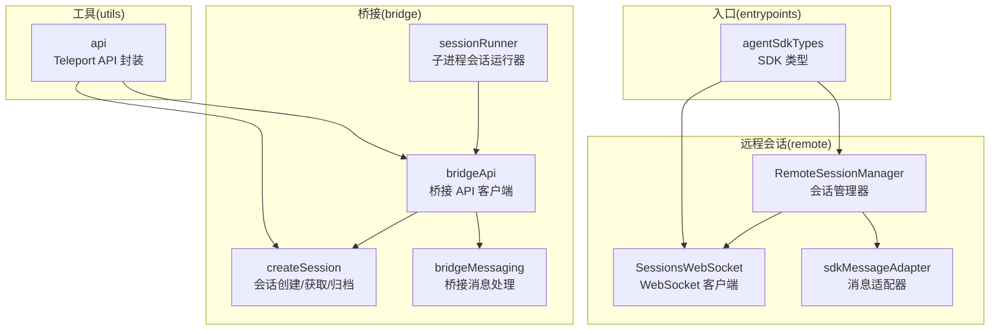
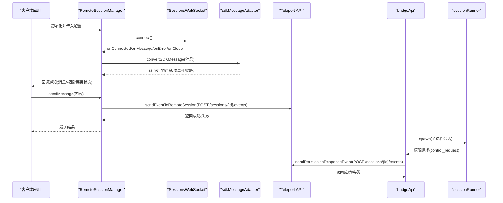
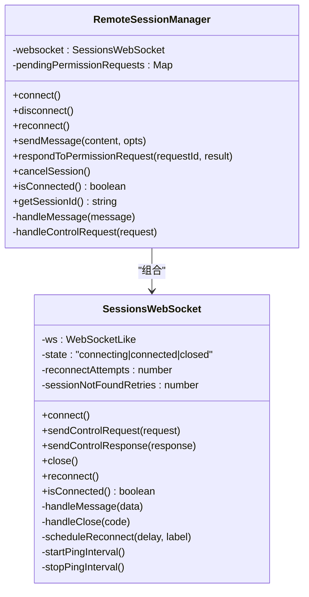
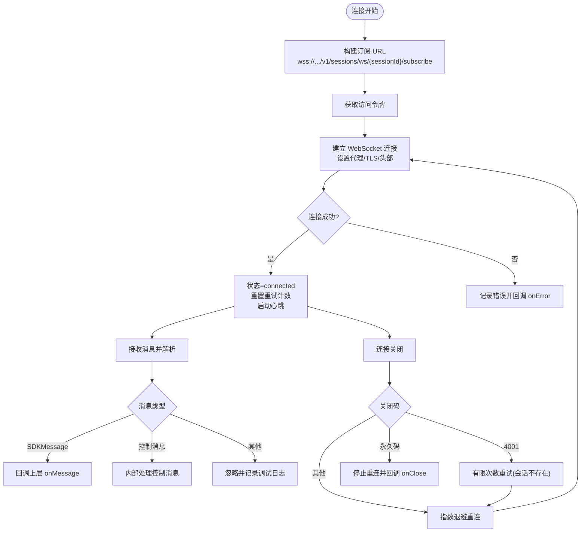
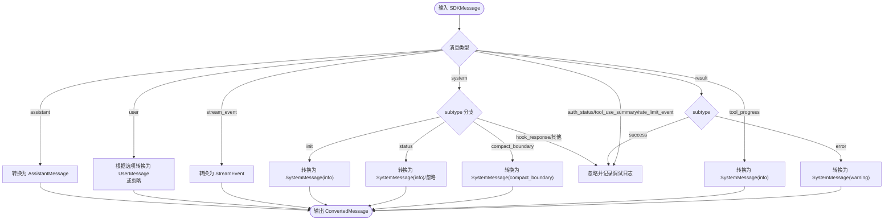
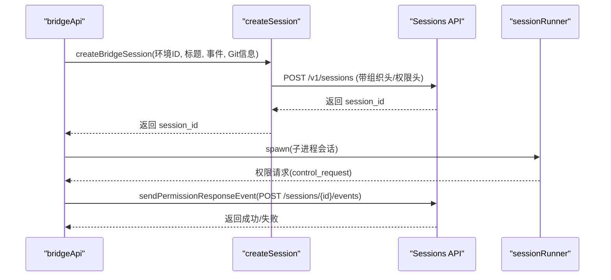
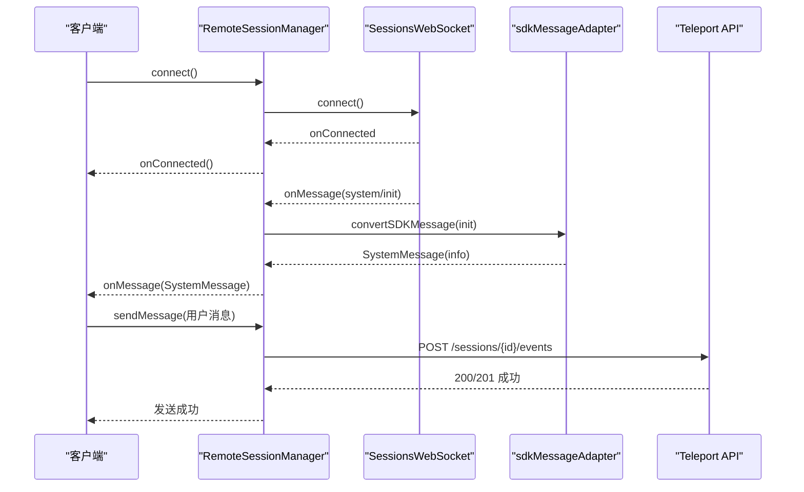
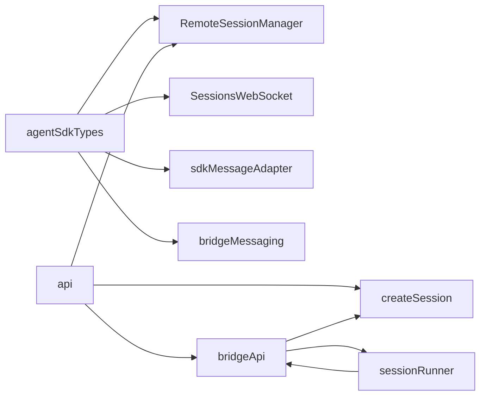

# 远程会话架构

<cite>
**本文档引用的文件**
- [RemoteSessionManager.ts](file://src/remote/RemoteSessionManager.ts)
- [sdkMessageAdapter.ts](file://src/remote/sdkMessageAdapter.ts)
- [SessionsWebSocket.ts](file://src/remote/SessionsWebSocket.ts)
- [createSession.ts](file://src/bridge/createSession.ts)
- [sessionRunner.ts](file://src/bridge/sessionRunner.ts)
- [bridgeApi.ts](file://src/bridge/bridgeApi.ts)
- [bridgeMessaging.ts](file://src/bridge/bridgeMessaging.ts)
- [agentSdkTypes.ts](file://src/entrypoints/agentSdkTypes.ts)
- [api.ts](file://src/utils/teleport/api.ts)
- [types.ts](file://src/bridge/types.ts)
</cite>

## 目录
1. [简介](#简介)
2. [项目结构](#项目结构)
3. [核心组件](#核心组件)
4. [架构总览](#架构总览)
5. [详细组件分析](#详细组件分析)
6. [依赖关系分析](#依赖关系分析)
7. [性能考量](#性能考量)
8. [故障排查指南](#故障排查指南)
9. [结论](#结论)
10. [附录](#附录)

## 简介
本文件系统性阐述远程会话架构的设计与实现，重点覆盖以下方面：
- 远程会话管理器（RemoteSessionManager）的职责与生命周期管理
- 会话状态同步机制与消息适配器（sdkMessageAdapter）在协议转换中的作用
- 会话初始化流程：客户端连接建立、身份验证、会话状态初始化
- SDK 消息适配器如何处理不同协议间的通信转换
- 会话状态存储与恢复机制：本地状态缓存与远程状态同步
- 架构图与组件交互示例，帮助开发者快速理解整体设计思路与实现原理

## 项目结构
远程会话相关代码主要分布在以下模块：
- remote：远程会话管理与 WebSocket 传输层
- bridge：桥接环境注册、工作轮询、会话运行与事件发送
- entrypoints：SDK 类型与入口
- utils：通用工具（如 Teleport API 封装）
- types：桥接与会话相关类型定义

**图表来源**
- [RemoteSessionManager.ts:95-324](file://src/remote/RemoteSessionManager.ts#L95-L324)
- [SessionsWebSocket.ts:82-404](file://src/remote/SessionsWebSocket.ts#L82-L404)
- [sdkMessageAdapter.ts:168-278](file://src/remote/sdkMessageAdapter.ts#L168-L278)
- [bridgeApi.ts:68-451](file://src/bridge/bridgeApi.ts#L68-L451)
- [createSession.ts:34-180](file://src/bridge/createSession.ts#L34-L180)
- [sessionRunner.ts:248-547](file://src/bridge/sessionRunner.ts#L248-L547)
- [bridgeMessaging.ts:132-208](file://src/bridge/bridgeMessaging.ts#L132-L208)
- [agentSdkTypes.ts:12-26](file://src/entrypoints/agentSdkTypes.ts#L12-L26)
- [api.ts:361-417](file://src/utils/teleport/api.ts#L361-L417)

**章节来源**
- [RemoteSessionManager.ts:95-324](file://src/remote/RemoteSessionManager.ts#L95-L324)
- [SessionsWebSocket.ts:82-404](file://src/remote/SessionsWebSocket.ts#L82-L404)
- [sdkMessageAdapter.ts:168-278](file://src/remote/sdkMessageAdapter.ts#L168-L278)
- [bridgeApi.ts:68-451](file://src/bridge/bridgeApi.ts#L68-L451)
- [createSession.ts:34-180](file://src/bridge/createSession.ts#L34-L180)
- [sessionRunner.ts:248-547](file://src/bridge/sessionRunner.ts#L248-L547)
- [bridgeMessaging.ts:132-208](file://src/bridge/bridgeMessaging.ts#L132-L208)
- [agentSdkTypes.ts:12-26](file://src/entrypoints/agentSdkTypes.ts#L12-L26)
- [api.ts:361-417](file://src/utils/teleport/api.ts#L361-L417)

## 核心组件
- RemoteSessionManager：协调 WebSocket 订阅、HTTP 事件发送、权限请求/响应流程，负责会话生命周期管理与错误回调。
- SessionsWebSocket：封装 WebSocket 连接、认证、消息解析、重连策略与心跳保活。
- sdkMessageAdapter：将 SDKMessage 转换为 REPL 内部 Message 类型，处理流式事件与系统消息映射。
- bridgeApi：桥接环境注册、工作轮询、会话事件发送、会话归档等桥接 API 的统一客户端。
- createSession：通过 Sessions API 创建/获取/归档会话，携带初始事件与上下文。
- sessionRunner：子进程会话运行器，负责子进程生命周期、权限请求转发、活动追踪与令牌更新。
- bridgeMessaging：桥接层消息处理与去重、控制请求路由与响应。
- agentSdkTypes：SDK 消息类型与控制协议类型定义。
- api：Teleport API 封装，提供会话事件发送、标题更新、会话查询等能力。

**章节来源**
- [RemoteSessionManager.ts:95-324](file://src/remote/RemoteSessionManager.ts#L95-L324)
- [SessionsWebSocket.ts:82-404](file://src/remote/SessionsWebSocket.ts#L82-L404)
- [sdkMessageAdapter.ts:168-278](file://src/remote/sdkMessageAdapter.ts#L168-L278)
- [bridgeApi.ts:68-451](file://src/bridge/bridgeApi.ts#L68-L451)
- [createSession.ts:34-180](file://src/bridge/createSession.ts#L34-L180)
- [sessionRunner.ts:248-547](file://src/bridge/sessionRunner.ts#L248-L547)
- [bridgeMessaging.ts:132-208](file://src/bridge/bridgeMessaging.ts#L132-L208)
- [agentSdkTypes.ts:12-26](file://src/entrypoints/agentSdkTypes.ts#L12-L26)
- [api.ts:361-417](file://src/utils/teleport/api.ts#L361-L417)

## 架构总览
远程会话架构由“客户端会话管理”和“桥接环境”两大部分组成：
- 客户端侧：RemoteSessionManager 通过 SessionsWebSocket 订阅会话事件，使用 HTTP 接口发送用户事件；sdkMessageAdapter 将 SDK 消息转换为 REPL 可渲染的消息格式。
- 桥接侧：bridgeApi 提供环境注册、工作轮询、会话事件发送与归档；createSession 通过 Sessions API 创建会话并注入初始事件；sessionRunner 管理子进程会话生命周期，并将权限请求转发给服务器；bridgeMessaging 处理消息去重与控制请求响应。

**图表来源**
- [RemoteSessionManager.ts:108-141](file://src/remote/RemoteSessionManager.ts#L108-L141)
- [SessionsWebSocket.ts:100-204](file://src/remote/SessionsWebSocket.ts#L100-L204)
- [sdkMessageAdapter.ts:168-278](file://src/remote/sdkMessageAdapter.ts#L168-L278)
- [api.ts:361-417](file://src/utils/teleport/api.ts#L361-L417)
- [bridgeApi.ts:419-450](file://src/bridge/bridgeApi.ts#L419-L450)
- [sessionRunner.ts:248-547](file://src/bridge/sessionRunner.ts#L248-L547)

## 详细组件分析

### RemoteSessionManager 组件分析
- 职责
  - 管理 WebSocket 连接与消息分发
  - 处理权限请求/取消/响应
  - 通过 HTTP 向会话发送用户事件
  - 提供连接状态查询与断开/重连能力
- 关键流程
  - connect：构造 SessionsWebSocket 并发起连接
  - handleMessage：区分 SDKMessage 与控制消息，分发到回调或内部处理
  - sendMessage：封装事件并通过 Teleport API 发送到会话
  - respondToPermissionRequest：构建并发送权限响应
  - cancelSession：向远端发送中断请求
  - reconnect/disconnect：强制重连或关闭连接并清理状态

**图表来源**
- [RemoteSessionManager.ts:95-324](file://src/remote/RemoteSessionManager.ts#L95-L324)
- [SessionsWebSocket.ts:82-404](file://src/remote/SessionsWebSocket.ts#L82-L404)

**章节来源**
- [RemoteSessionManager.ts:95-324](file://src/remote/RemoteSessionManager.ts#L95-L324)
- [SessionsWebSocket.ts:82-404](file://src/remote/SessionsWebSocket.ts#L82-L404)

### SessionsWebSocket 组件分析
- 职责
  - 建立并维护 WebSocket 连接，支持浏览器与 Node 环境
  - 实现指数退避重连、心跳保活、错误码处理
  - 解析服务端消息并按类型分发
- 关键特性
  - 认证：通过请求头携带访问令牌
  - 重连策略：对 4001（会话不存在）进行有限次重试
  - 心跳：周期性 ping 保持连接活跃
  - 控制消息：支持发送 control_request/control_response

**图表来源**
- [SessionsWebSocket.ts:100-288](file://src/remote/SessionsWebSocket.ts#L100-L288)

**章节来源**
- [SessionsWebSocket.ts:82-404](file://src/remote/SessionsWebSocket.ts#L82-L404)

### SDK 消息适配器组件分析
- 职责
  - 将 SDKMessage 转换为 REPL 内部 Message 或流事件
  - 处理系统消息（初始化、状态、压缩边界）、工具进度、结果消息等
  - 提供会话结束判断与结果文本提取
- 转换规则
  - assistant → AssistantMessage
  - user → 用户消息（根据选项决定是否包含 tool_result）
  - stream_event → StreamEvent
  - system/init/status/compact_boundary → SystemMessage
  - tool_progress → SystemMessage
  - result → 仅在错误时转为 SystemMessage
  - 其他类型（auth_status、tool_use_summary、rate_limit_event 等）忽略

**图表来源**
- [sdkMessageAdapter.ts:168-278](file://src/remote/sdkMessageAdapter.ts#L168-L278)

**章节来源**
- [sdkMessageAdapter.ts:168-278](file://src/remote/sdkMessageAdapter.ts#L168-L278)

### 桥接 API 与会话创建组件分析
- bridgeApi
  - 提供环境注册、工作轮询、会话事件发送、会话归档、心跳等接口
  - 统一处理 401 自动刷新与错误分类
- createSession
  - 通过 Sessions API 创建会话，支持初始事件注入与 Git 源信息
  - 支持获取/归档/更新会话标题等操作

**图表来源**
- [bridgeApi.ts:142-450](file://src/bridge/bridgeApi.ts#L142-L450)
- [createSession.ts:34-180](file://src/bridge/createSession.ts#L34-L180)
- [sessionRunner.ts:248-547](file://src/bridge/sessionRunner.ts#L248-L547)

**章节来源**
- [bridgeApi.ts:68-451](file://src/bridge/bridgeApi.ts#L68-L451)
- [createSession.ts:34-180](file://src/bridge/createSession.ts#L34-L180)
- [sessionRunner.ts:248-547](file://src/bridge/sessionRunner.ts#L248-L547)

### 会话初始化流程（从客户端角度）
- 连接建立
  - RemoteSessionManager 使用 SessionsWebSocket 建立到 /v1/sessions/ws/{id}/subscribe 的 WSS 连接
  - 通过请求头携带访问令牌与版本号完成认证
- 身份验证
  - 访问令牌由外部提供，每次连接尝试都会重新获取最新令牌
- 会话状态初始化
  - 会话初始化消息（system/init）经 sdkMessageAdapter 转换为系统消息，用于界面提示与状态同步
- 消息流转
  - WebSocket 推送 SDKMessage，RemoteSessionManager 分发到上层回调
  - 上层通过 RemoteSessionManager.sendMessage 发送用户事件，底层通过 Teleport API 的 /sessions/{id}/events 接口提交

**图表来源**
- [RemoteSessionManager.ts:108-141](file://src/remote/RemoteSessionManager.ts#L108-L141)
- [SessionsWebSocket.ts:100-204](file://src/remote/SessionsWebSocket.ts#L100-L204)
- [sdkMessageAdapter.ts:228-231](file://src/remote/sdkMessageAdapter.ts#L228-L231)
- [api.ts:361-417](file://src/utils/teleport/api.ts#L361-L417)

**章节来源**
- [RemoteSessionManager.ts:108-141](file://src/remote/RemoteSessionManager.ts#L108-L141)
- [SessionsWebSocket.ts:100-204](file://src/remote/SessionsWebSocket.ts#L100-L204)
- [sdkMessageAdapter.ts:228-231](file://src/remote/sdkMessageAdapter.ts#L228-L231)
- [api.ts:361-417](file://src/utils/teleport/api.ts#L361-L417)

### SDK 消息适配器在协议转换中的作用
- 协议差异
  - CCR 后端通过 WebSocket 发送 SDKMessage
  - REPL 需要内部 Message 类型进行渲染与交互
- 适配策略
  - 类型映射：assistant → AssistantMessage；user → UserMessage；system/init/status/compact_boundary → SystemMessage
  - 流式处理：stream_event → StreamEvent
  - 行为过滤：result.success 忽略，仅错误 result 转换为 SystemMessage
  - 特殊事件：auth_status、tool_use_summary、rate_limit_event 等忽略不显示
- 选项化行为
  - convertToolResults：将远端返回的 tool_result 用户消息转换为本地可渲染的 UserMessage
  - convertUserTextMessages：将历史事件中的人类文本消息转换为 UserMessage

**章节来源**
- [sdkMessageAdapter.ts:168-278](file://src/remote/sdkMessageAdapter.ts#L168-L278)

### 会话状态存储与恢复机制
- 本地状态缓存
  - RemoteSessionManager 维护权限请求映射与连接状态，用于响应权限决策与断线重连
  - sdkMessageAdapter 对消息进行类型转换与过滤，减少 UI 层负担
- 远程状态同步
  - SessionsWebSocket 通过心跳与重连策略维持连接稳定
  - Teleport API 提供会话事件发送与标题更新，确保远端状态与本地一致
- 恢复机制
  - 4001（会话不存在）场景下进行有限次重试，避免短暂编排导致的误判
  - 强制重连接口（reconnect）用于订阅过期后手动恢复

**章节来源**
- [RemoteSessionManager.ts:95-324](file://src/remote/RemoteSessionManager.ts#L95-L324)
- [SessionsWebSocket.ts:17-288](file://src/remote/SessionsWebSocket.ts#L17-L288)
- [api.ts:361-417](file://src/utils/teleport/api.ts#L361-L417)

## 依赖关系分析
- RemoteSessionManager 依赖 SessionsWebSocket 与 Teleport API，同时消费 agentSdkTypes 中的 SDKMessage 类型
- sdkMessageAdapter 依赖 agentSdkTypes 的 SDKMessage 与内部 Message 类型
- bridgeApi 依赖 Teleport API 与桥接类型定义
- sessionRunner 依赖 bridgeApi 与 Teleport API，负责子进程生命周期与权限请求转发
- bridgeMessaging 依赖 agentSdkTypes 的控制协议类型，提供消息去重与控制请求响应

**图表来源**
- [agentSdkTypes.ts:12-26](file://src/entrypoints/agentSdkTypes.ts#L12-L26)
- [RemoteSessionManager.ts:95-324](file://src/remote/RemoteSessionManager.ts#L95-L324)
- [SessionsWebSocket.ts:82-404](file://src/remote/SessionsWebSocket.ts#L82-L404)
- [sdkMessageAdapter.ts:168-278](file://src/remote/sdkMessageAdapter.ts#L168-L278)
- [bridgeApi.ts:68-451](file://src/bridge/bridgeApi.ts#L68-L451)
- [createSession.ts:34-180](file://src/bridge/createSession.ts#L34-L180)
- [sessionRunner.ts:248-547](file://src/bridge/sessionRunner.ts#L248-L547)
- [bridgeMessaging.ts:132-208](file://src/bridge/bridgeMessaging.ts#L132-L208)
- [api.ts:361-417](file://src/utils/teleport/api.ts#L361-L417)

**章节来源**
- [agentSdkTypes.ts:12-26](file://src/entrypoints/agentSdkTypes.ts#L12-L26)
- [RemoteSessionManager.ts:95-324](file://src/remote/RemoteSessionManager.ts#L95-L324)
- [SessionsWebSocket.ts:82-404](file://src/remote/SessionsWebSocket.ts#L82-L404)
- [sdkMessageAdapter.ts:168-278](file://src/remote/sdkMessageAdapter.ts#L168-L278)
- [bridgeApi.ts:68-451](file://src/bridge/bridgeApi.ts#L68-L451)
- [createSession.ts:34-180](file://src/bridge/createSession.ts#L34-L180)
- [sessionRunner.ts:248-547](file://src/bridge/sessionRunner.ts#L248-L547)
- [bridgeMessaging.ts:132-208](file://src/bridge/bridgeMessaging.ts#L132-L208)
- [api.ts:361-417](file://src/utils/teleport/api.ts#L361-L417)

## 性能考量
- 连接稳定性
  - SessionsWebSocket 的指数退避重连与心跳保活降低网络抖动影响
  - 对 4001 的有限重试避免频繁重建连接
- 消息处理
  - sdkMessageAdapter 的类型守卫与分支选择减少不必要的对象构造
  - BoundedUUIDSet 作为去重环形缓冲区，内存占用恒定
- 请求可靠性
  - Teleport API 的幂等性与错误分类（401 自动刷新、403 可抑制）提升可用性

[本节为通用指导，无需特定文件分析]

## 故障排查指南
- 连接失败
  - 检查访问令牌是否有效与最新（RemoteSessionManager 会在每次连接尝试重新获取）
  - 观察 SessionsWebSocket 的错误回调与关闭码，4003 为永久拒绝，4001 为临时重试
- 权限请求未响应
  - 确认 RemoteSessionManager 是否正确收到 control_request 并触发 onPermissionRequest
  - 检查 respondToPermissionRequest 是否被调用且发送了 control_response
- 消息未显示
  - 检查 sdkMessageAdapter 的转换逻辑，确认消息类型与选项（convertToolResults/convertUserTextMessages）
  - 确认 result.success 是否被忽略（仅错误 result 会被转换为 SystemMessage）
- 会话标题不同步
  - 确认 Teleport API 的 updateSessionTitle 是否被调用并返回成功
- 子进程权限问题
  - 检查 sessionRunner 的权限请求转发与 bridgeApi 的 sendPermissionResponseEvent 调用

**章节来源**
- [RemoteSessionManager.ts:154-214](file://src/remote/RemoteSessionManager.ts#L154-L214)
- [SessionsWebSocket.ts:234-288](file://src/remote/SessionsWebSocket.ts#L234-L288)
- [sdkMessageAdapter.ts:168-278](file://src/remote/sdkMessageAdapter.ts#L168-L278)
- [api.ts:425-466](file://src/utils/teleport/api.ts#L425-L466)
- [sessionRunner.ts:417-444](file://src/bridge/sessionRunner.ts#L417-L444)
- [bridgeApi.ts:419-450](file://src/bridge/bridgeApi.ts#L419-L450)

## 结论
远程会话架构通过 RemoteSessionManager 与 SessionsWebSocket 实现稳定的连接与消息分发，借助 sdkMessageAdapter 完成 SDK 与 REPL 的协议转换。桥接侧通过 bridgeApi 与 createSession 提供会话生命周期管理与事件发送能力，sessionRunner 则负责子进程会话的运行与权限控制。整体设计在连接稳定性、消息处理与权限控制方面具备良好的容错与扩展性。

[本节为总结性内容，无需特定文件分析]

## 附录
- 关键类型与接口
  - SDKMessage：SDK 协议消息类型
  - SDKControlRequest/SDKControlResponse：控制协议类型
  - RemoteSessionConfig/RemoteSessionCallbacks：会话配置与回调
  - BridgeConfig/BridgeApiClient：桥接配置与 API 客户端接口
- 常用方法路径
  - RemoteSessionManager.connect/sendMessage/respondToPermissionRequest/cancelSession/reconnect/disconnect
  - SessionsWebSocket.connect/sendControlRequest/sendControlResponse/isConnected/reconnect/close
  - sdkMessageAdapter.convertSDKMessage/isSessionEndMessage/getResultText
  - bridgeApi.registerBridgeEnvironment/pollForWork/sendPermissionResponseEvent/archiveSession
  - createSession.createBridgeSession/getBridgeSession/archiveBridgeSession/updateBridgeSessionTitle
  - sessionRunner.createSessionSpawner/spawn/kill/forceKill/updateAccessToken

**章节来源**
- [agentSdkTypes.ts:12-26](file://src/entrypoints/agentSdkTypes.ts#L12-L26)
- [RemoteSessionManager.ts:100-324](file://src/remote/RemoteSessionManager.ts#L100-L324)
- [SessionsWebSocket.ts:90-404](file://src/remote/SessionsWebSocket.ts#L90-L404)
- [sdkMessageAdapter.ts:168-303](file://src/remote/sdkMessageAdapter.ts#L168-L303)
- [bridgeApi.ts:141-451](file://src/bridge/bridgeApi.ts#L141-L451)
- [createSession.ts:34-385](file://src/bridge/createSession.ts#L34-L385)
- [sessionRunner.ts:248-547](file://src/bridge/sessionRunner.ts#L248-L547)
- [types.ts:81-263](file://src/bridge/types.ts#L81-L263)