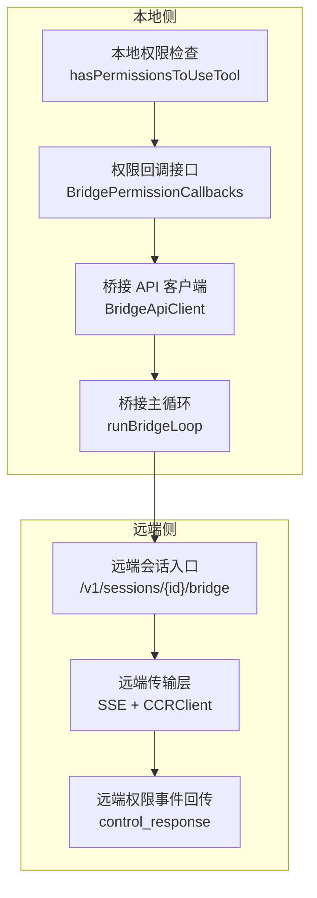
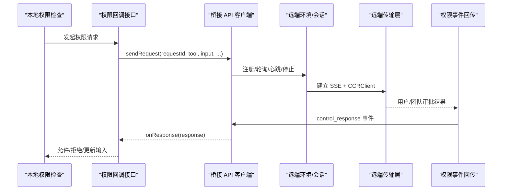
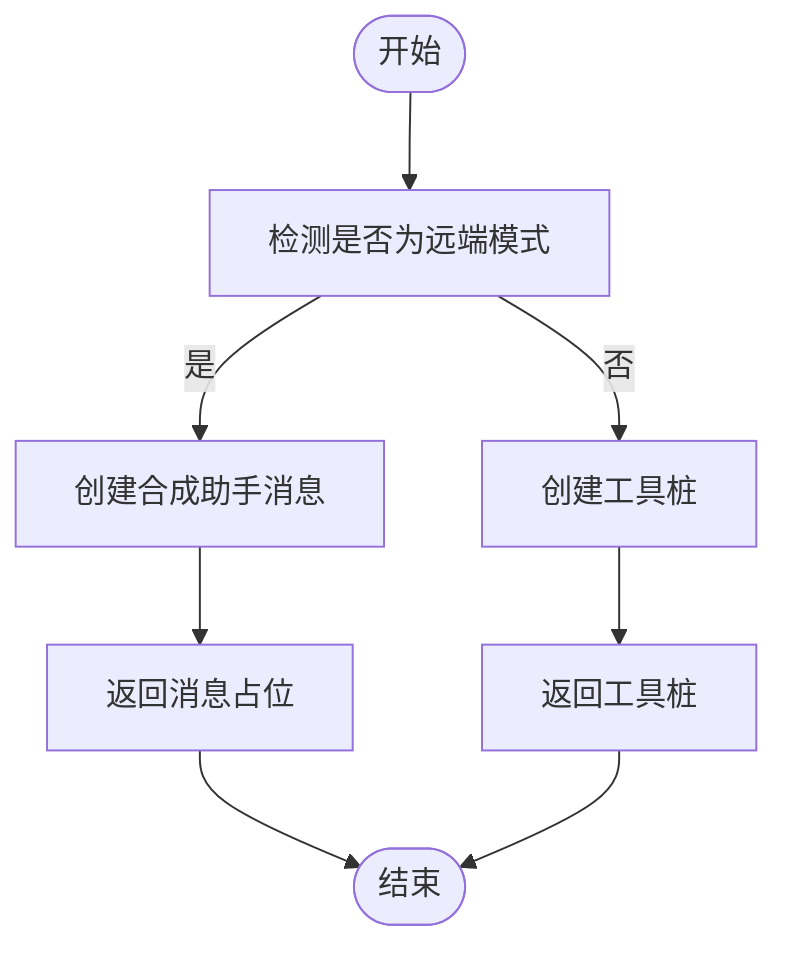
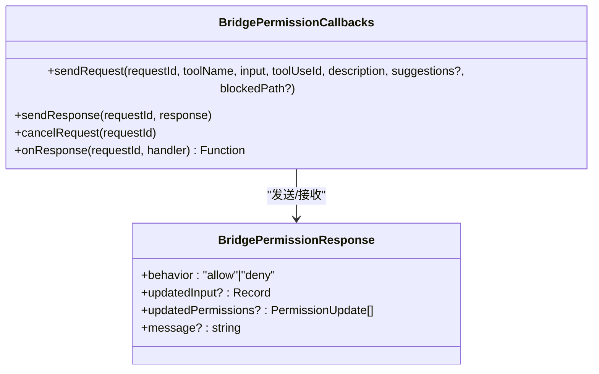
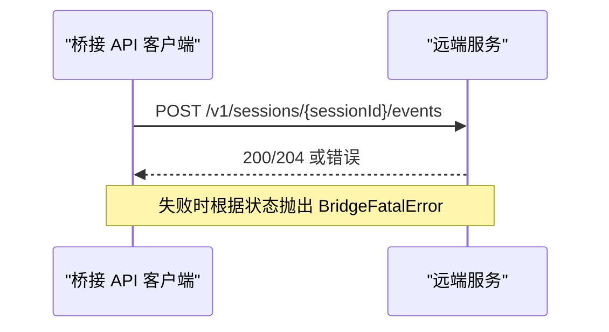
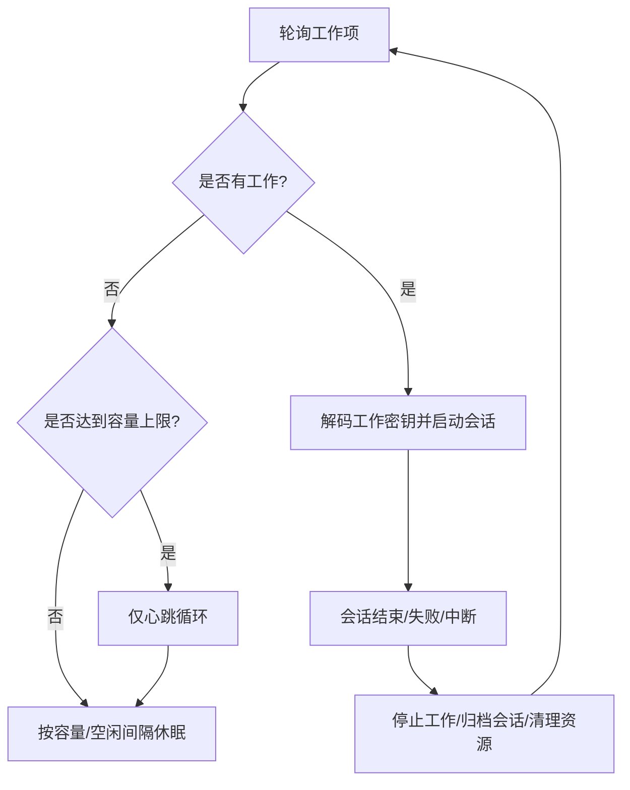
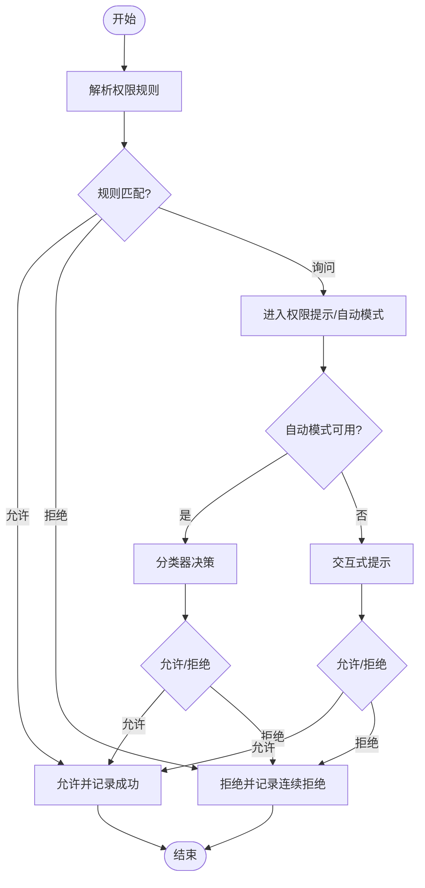
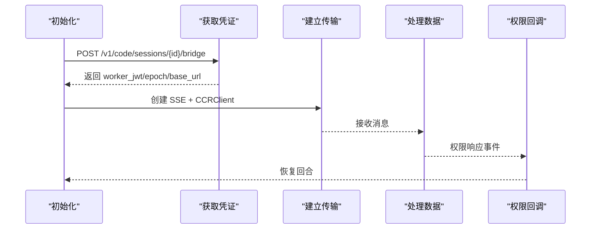
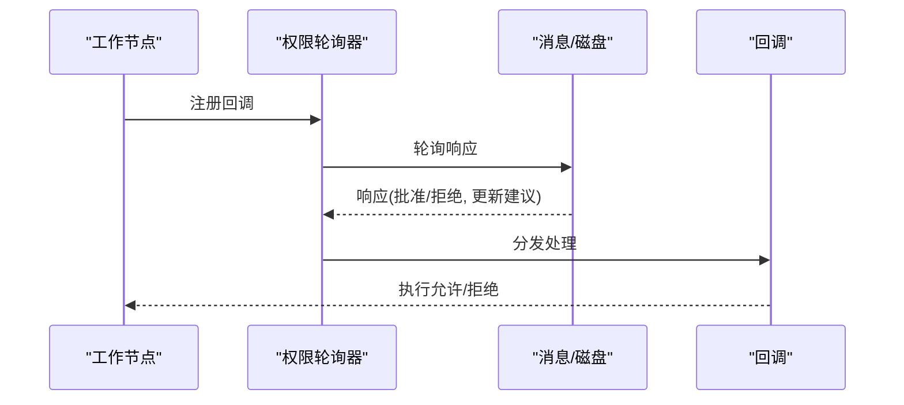
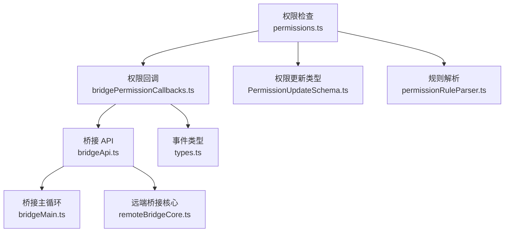

# 远程权限桥接

<cite>
**本文引用的文件**
- [remotePermissionBridge.ts](file://src/remote/remotePermissionBridge.ts)
- [bridgePermissionCallbacks.ts](file://src/bridge/bridgePermissionCallbacks.ts)
- [bridgeApi.ts](file://src/bridge/bridgeApi.ts)
- [bridgeMain.ts](file://src/bridge/bridgeMain.ts)
- [types.ts](file://src/bridge/types.ts)
- [PermissionUpdateSchema.ts](file://src/utils/permissions/PermissionUpdateSchema.ts)
- [useSwarmPermissionPoller.ts](file://src/hooks/useSwarmPermissionPoller.ts)
- [remoteBridgeCore.ts](file://src/bridge/remoteBridgeCore.ts)
- [bridgeConfig.ts](file://src/bridge/bridgeConfig.ts)
- [permissions.ts](file://src/utils/permissions/permissions.ts)
- [permissionRuleParser.ts](file://src/utils/permissions/permissionRuleParser.ts)
- [bridgeStatusUtil.ts](file://src/bridge/bridgeStatusUtil.ts)
</cite>

## 目录
1. [简介](#简介)
2. [项目结构](#项目结构)
3. [核心组件](#核心组件)
4. [架构总览](#架构总览)
5. [详细组件分析](#详细组件分析)
6. [依赖关系分析](#依赖关系分析)
7. [性能考量](#性能考量)
8. [故障排查指南](#故障排查指南)
9. [结论](#结论)
10. [附录：配置与策略指南](#附录配置与策略指南)

## 简介
本文件系统性阐述“远程权限桥接”的设计与实现，聚焦于本地与远程会话之间的权限状态同步与权限请求转发机制。文档覆盖以下关键主题：
- 权限请求在本地与远程之间的转发链路与决策传播
- 权限状态同步与事件回传（control_response）
- 远程权限验证流程（检查、缓存与更新）
- 安全考虑（隔离、审计与撤销）
- 配置示例与权限策略设置指南

## 项目结构
围绕远程权限桥接的关键模块分布如下：
- 远端权限桥接核心：负责合成消息、工具桩与远端权限事件回传
- 桥接 API 客户端：封装环境注册、轮询、心跳、停止工作项、发送权限响应等
- 桥接主循环：驱动会话生命周期、心跳、令牌刷新与错误恢复
- 权限回调与事件类型：定义权限请求/响应的协议与校验
- 权限规则与更新：权限规则解析、持久化与应用
- 远端桥接核心（REPL 路径）：直接连接会话入口层，支持权限响应事件回传
- 状态与 UI 工具：桥接状态、URL 构建与终端显示

**图表来源**
- [bridgeApi.ts:140-451](file://src/bridge/bridgeApi.ts#L140-L451)
- [bridgeMain.ts:141-800](file://src/bridge/bridgeMain.ts#L141-L800)
- [remoteBridgeCore.ts:140-800](file://src/bridge/remoteBridgeCore.ts#L140-L800)
- [bridgePermissionCallbacks.ts:1-44](file://src/bridge/bridgePermissionCallbacks.ts#L1-L44)

**章节来源**
- [bridgeApi.ts:140-451](file://src/bridge/bridgeApi.ts#L140-L451)
- [bridgeMain.ts:141-800](file://src/bridge/bridgeMain.ts#L141-L800)
- [remoteBridgeCore.ts:140-800](file://src/bridge/remoteBridgeCore.ts#L140-L800)
- [bridgePermissionCallbacks.ts:1-44](file://src/bridge/bridgePermissionCallbacks.ts#L1-L44)

## 核心组件
- 远端权限桥接辅助
  - 合成远端权限请求消息体，用于无真实助手消息时的占位
  - 创建本地缺失工具的“工具桩”，以触发回退权限请求
- 权限回调与事件
  - 定义权限请求/响应的回调接口与响应载荷结构
  - 对控制响应进行类型校验，确保安全解包
- 桥接 API 客户端
  - 提供环境注册、轮询、确认、停止、心跳、权限事件发送等能力
  - 统一封装认证失败处理与重试逻辑
- 桥接主循环
  - 驱动工作项轮询、心跳、令牌刷新与错误恢复
  - 在容量满载时采用“仅心跳”模式降低服务器压力
- 权限规则与更新
  - 规则解析与序列化、权限更新类型与目标位置
  - 权限检查主流程（允许/拒绝/询问）、自动模式与分类器集成
- 远端桥接核心（REPL）
  - 直连会话入口，建立 SSE + CCRClient 传输
  - 处理权限响应事件回传与传输重建

**章节来源**
- [remotePermissionBridge.ts:12-79](file://src/remote/remotePermissionBridge.ts#L12-L79)
- [bridgePermissionCallbacks.ts:1-44](file://src/bridge/bridgePermissionCallbacks.ts#L1-L44)
- [bridgeApi.ts:140-451](file://src/bridge/bridgeApi.ts#L140-L451)
- [bridgeMain.ts:141-800](file://src/bridge/bridgeMain.ts#L141-L800)
- [PermissionUpdateSchema.ts:1-79](file://src/utils/permissions/PermissionUpdateSchema.ts#L1-L79)
- [permissions.ts:473-800](file://src/utils/permissions/permissions.ts#L473-L800)
- [remoteBridgeCore.ts:140-800](file://src/bridge/remoteBridgeCore.ts#L140-L800)

## 架构总览
远程权限桥接由“本地权限检查—桥接 API—远端会话—远端传输—权限事件回传”构成的闭环。本地侧通过权限回调接口发起请求，桥接 API 将请求转发至远端；远端在用户或团队领导审批后，通过权限事件回传到本地，本地据此执行允许/拒绝与输入更新。

**图表来源**
- [bridgePermissionCallbacks.ts:10-27](file://src/bridge/bridgePermissionCallbacks.ts#L10-L27)
- [bridgeApi.ts:419-450](file://src/bridge/bridgeApi.ts#L419-L450)
- [remoteBridgeCore.ts:420-447](file://src/bridge/remoteBridgeCore.ts#L420-L447)

**章节来源**
- [bridgePermissionCallbacks.ts:1-44](file://src/bridge/bridgePermissionCallbacks.ts#L1-L44)
- [bridgeApi.ts:419-450](file://src/bridge/bridgeApi.ts#L419-L450)
- [remoteBridgeCore.ts:420-447](file://src/bridge/remoteBridgeCore.ts#L420-L447)

## 详细组件分析

### 组件一：远端权限桥接辅助
- 合成远端权限请求消息体
  - 当处于远端模式且无真实助手消息时，构造最小化的助手消息占位，满足需要 AssistantMessage 的场景
- 工具桩
  - 对本地未加载的远端工具（如 MCP 工具），生成“工具桩”以触发回退权限请求，避免静默失败

**图表来源**
- [remotePermissionBridge.ts:12-79](file://src/remote/remotePermissionBridge.ts#L12-L79)

**章节来源**
- [remotePermissionBridge.ts:12-79](file://src/remote/remotePermissionBridge.ts#L12-L79)

### 组件二：权限回调与事件类型
- 回调接口
  - sendRequest：发起权限请求（携带工具名、输入、工具使用 ID、描述等）
  - sendResponse：发送权限响应（行为、更新后的输入、更新后的权限、消息）
  - onResponse：订阅权限响应
- 类型校验
  - 对控制响应载荷进行严格类型校验，确保只接受合法字段

**图表来源**
- [bridgePermissionCallbacks.ts:1-44](file://src/bridge/bridgePermissionCallbacks.ts#L1-L44)

**章节来源**
- [bridgePermissionCallbacks.ts:1-44](file://src/bridge/bridgePermissionCallbacks.ts#L1-L44)

### 组件三：桥接 API 客户端
- 能力清单
  - 环境注册、轮询工作项、确认工作、停止工作、注销环境、归档会话、重连会话、心跳、发送权限响应事件
- 认证与重试
  - 对 401 错误尝试令牌刷新并重试一次
  - 统一错误处理，区分致命错误与可抑制 403
- 权限事件发送
  - 通过会话事件 API 发送 control_response，承载权限决策

**图表来源**
- [bridgeApi.ts:419-450](file://src/bridge/bridgeApi.ts#L419-L450)

**章节来源**
- [bridgeApi.ts:140-451](file://src/bridge/bridgeApi.ts#L140-L451)

### 组件四：桥接主循环（守护进程路径）
- 轮询与心跳
  - 在空闲时采用“仅心跳”模式，降低服务器负载
  - 心跳失败时触发重连或致命错误处理
- 令牌刷新
  - 对 OAuth 令牌过期进行预刷新，v2 会话通过重连触发服务器重新派发工作
- 会话生命周期
  - 会话完成/失败/中断的清理与归档，多会话模式下保持桥接常驻

**图表来源**
- [bridgeMain.ts:600-784](file://src/bridge/bridgeMain.ts#L600-L784)

**章节来源**
- [bridgeMain.ts:141-800](file://src/bridge/bridgeMain.ts#L141-L800)

### 组件五：权限规则与更新
- 规则解析与序列化
  - 支持工具名与内容组合的规则格式，转义/反转义括号以保证安全存储与解析
- 权限更新类型
  - 添加/替换/移除规则、设置模式、增删目录等，目标位置包括用户设置、项目设置、本地设置、会话内与命令行参数
- 权限检查主流程
  - 允许/拒绝/询问规则匹配，自动模式下的分类器决策与快速路径（如 acceptEdits）

**图表来源**
- [permissionRuleParser.ts:93-152](file://src/utils/permissions/permissionRuleParser.ts#L93-L152)
- [PermissionUpdateSchema.ts:42-78](file://src/utils/permissions/PermissionUpdateSchema.ts#L42-L78)
- [permissions.ts:473-800](file://src/utils/permissions/permissions.ts#L473-L800)

**章节来源**
- [permissionRuleParser.ts:1-199](file://src/utils/permissions/permissionRuleParser.ts#L1-L199)
- [PermissionUpdateSchema.ts:1-79](file://src/utils/permissions/PermissionUpdateSchema.ts#L1-L79)
- [permissions.ts:473-800](file://src/utils/permissions/permissions.ts#L473-L800)

### 组件六：远端桥接核心（REPL 路径）
- 直连会话入口
  - 创建会话并获取工作凭证，建立 SSE + CCRClient 传输
- 传输重建与 JWT 刷新
  - 预刷新与 401 自动恢复，重建传输并保持序列号一致性
- 权限事件回传
  - 权限响应到达时触发回调，恢复当前回合

**图表来源**
- [remoteBridgeCore.ts:140-527](file://src/bridge/remoteBridgeCore.ts#L140-L527)

**章节来源**
- [remoteBridgeCore.ts:140-800](file://src/bridge/remoteBridgeCore.ts#L140-L800)

### 组件七：权限提示与团队同步（Swarm）
- 轮询机制
  - 在作为工作节点时定期轮询权限响应，处理批准/拒绝与更新建议
- 回调注册与清理
  - 注册/注销权限回调，支持磁盘轮询与邮箱消息两种来源

**图表来源**
- [useSwarmPermissionPoller.ts:268-331](file://src/hooks/useSwarmPermissionPoller.ts#L268-L331)

**章节来源**
- [useSwarmPermissionPoller.ts:1-331](file://src/hooks/useSwarmPermissionPoller.ts#L1-L331)

## 依赖关系分析
- 本地权限检查依赖权限规则与更新机制，结合自动模式与分类器决策
- 权限回调接口与桥接 API 客户端共同构成请求/响应通道
- 桥接主循环与远端桥接核心分别面向守护进程与 REPL 场景，共享权限事件回传协议
- 权限更新类型与目标位置决定策略持久化与生效范围

**图表来源**
- [permissions.ts:473-800](file://src/utils/permissions/permissions.ts#L473-L800)
- [bridgePermissionCallbacks.ts:1-44](file://src/bridge/bridgePermissionCallbacks.ts#L1-L44)
- [bridgeApi.ts:140-451](file://src/bridge/bridgeApi.ts#L140-L451)
- [bridgeMain.ts:141-800](file://src/bridge/bridgeMain.ts#L141-L800)
- [remoteBridgeCore.ts:140-800](file://src/bridge/remoteBridgeCore.ts#L140-L800)
- [PermissionUpdateSchema.ts:1-79](file://src/utils/permissions/PermissionUpdateSchema.ts#L1-L79)
- [permissionRuleParser.ts:1-199](file://src/utils/permissions/permissionRuleParser.ts#L1-L199)
- [types.ts:124-131](file://src/bridge/types.ts#L124-L131)

**章节来源**
- [permissions.ts:473-800](file://src/utils/permissions/permissions.ts#L473-L800)
- [bridgePermissionCallbacks.ts:1-44](file://src/bridge/bridgePermissionCallbacks.ts#L1-L44)
- [bridgeApi.ts:140-451](file://src/bridge/bridgeApi.ts#L140-L451)
- [bridgeMain.ts:141-800](file://src/bridge/bridgeMain.ts#L141-L800)
- [remoteBridgeCore.ts:140-800](file://src/bridge/remoteBridgeCore.ts#L140-L800)
- [PermissionUpdateSchema.ts:1-79](file://src/utils/permissions/PermissionUpdateSchema.ts#L1-L79)
- [permissionRuleParser.ts:1-199](file://src/utils/permissions/permissionRuleParser.ts#L1-L199)
- [types.ts:124-131](file://src/bridge/types.ts#L124-L131)

## 性能考量
- 轮询与心跳
  - 在容量满载时采用“仅心跳”模式，显著降低服务器压力
  - 心跳失败时延迟重试，避免紧循环
- 令牌刷新
  - 预刷新策略减少 401 风险，v2 会话通过重连触发服务器重新派发工作
- 事件回传
  - 权限事件通过会话事件 API 发送，避免额外长连接开销
- 规则解析与分类器
  - 快速路径（acceptEdits、安全工具白名单）减少分类器调用次数

[本节为通用指导，无需具体文件分析]

## 故障排查指南
- 认证失败（401）
  - 触发令牌刷新与重试；若失败则抛出致命错误
- 访问被拒（403）
  - 区分会话过期与角色权限不足；部分可抑制的 403 不影响核心功能
- 会话过期（404/410）
  - 需要重启远程控制或重新登录
- 心跳失败
  - 触发服务器重新派发工作；检查网络与令牌有效性
- 权限事件未达
  - 检查远端是否正确回传 control_response；本地回调是否注册

**章节来源**
- [bridgeApi.ts:454-540](file://src/bridge/bridgeApi.ts#L454-L540)
- [bridgeMain.ts:200-270](file://src/bridge/bridgeMain.ts#L200-L270)

## 结论
远程权限桥接通过“本地权限检查—桥接 API—远端会话—传输层—权限事件回传”的闭环，实现了本地与远程权限状态的同步与决策传播。其设计兼顾安全性（类型校验、认证失败处理、预刷新）、可观测性（状态显示、日志与遥测）与可维护性（模块化职责、清晰的错误处理）。配合完善的权限规则与更新机制，可满足复杂场景下的权限治理需求。

[本节为总结，无需具体文件分析]

## 附录：配置与策略指南

### 权限请求转发与决策传播
- 本地侧
  - 使用权限回调接口发起请求，携带工具名、输入、工具使用 ID、描述等
  - 订阅响应并根据行为执行允许/拒绝与输入更新
- 远端侧
  - 通过会话事件 API 发送 control_response，承载权限决策
- 事件回传
  - 远端传输层收到权限响应后，触发本地回调，恢复当前回合

**章节来源**
- [bridgePermissionCallbacks.ts:10-27](file://src/bridge/bridgePermissionCallbacks.ts#L10-L27)
- [bridgeApi.ts:419-450](file://src/bridge/bridgeApi.ts#L419-L450)
- [remoteBridgeCore.ts:420-447](file://src/bridge/remoteBridgeCore.ts#L420-L447)

### 权限验证流程（检查、缓存与更新）
- 检查
  - 规则匹配（允许/拒绝/询问），自动模式下的分类器决策
- 缓存
  - 连续拒绝计数与拒绝状态持久化，自动模式下成功使用后重置
- 更新
  - 权限更新类型（添加/替换/移除规则、设置模式、增删目录）写入目标位置（用户/项目/本地/会话/命令行）

**章节来源**
- [permissions.ts:473-800](file://src/utils/permissions/permissions.ts#L473-L800)
- [PermissionUpdateSchema.ts:42-78](file://src/utils/permissions/PermissionUpdateSchema.ts#L42-L78)

### 权限桥接的安全考虑
- 隔离
  - 本地与远端通过桥接 API 与传输层隔离，权限决策在本地执行
- 审计
  - 状态显示、日志与遥测记录桥接状态、会话活动与权限决策
- 撤销
  - 会话归档与停止工作项，确保资源回收与权限失效

**章节来源**
- [bridgeStatusUtil.ts:1-164](file://src/bridge/bridgeStatusUtil.ts#L1-L164)
- [bridgeApi.ts:325-356](file://src/bridge/bridgeApi.ts#L325-L356)
- [bridgeMain.ts:520-533](file://src/bridge/bridgeMain.ts#L520-L533)

### 配置示例与策略设置
- 认证与基础 URL
  - 开发者可通过环境变量覆盖令牌与基础 URL，生产默认来自 OAuth 配置
- 权限模式与规则
  - 通过权限更新类型设置模式与规则，并选择持久化目标位置
- REPL/守护进程差异
  - REPL 路径直连会话入口，守护进程路径经环境 API 轮询调度

**章节来源**
- [bridgeConfig.ts:1-49](file://src/bridge/bridgeConfig.ts#L1-L49)
- [PermissionUpdateSchema.ts:27-40](file://src/utils/permissions/PermissionUpdateSchema.ts#L27-L40)
- [remoteBridgeCore.ts:140-256](file://src/bridge/remoteBridgeCore.ts#L140-L256)
- [bridgeMain.ts:141-200](file://src/bridge/bridgeMain.ts#L141-L200)