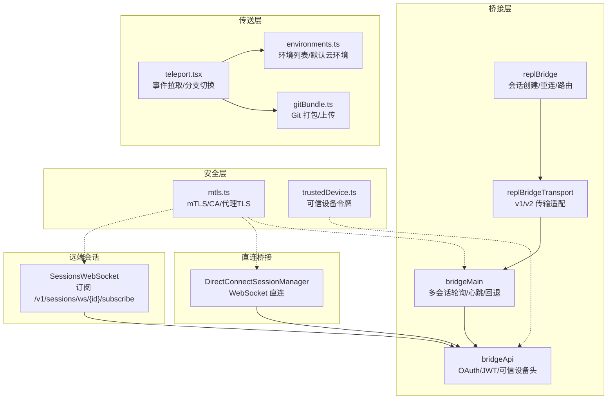
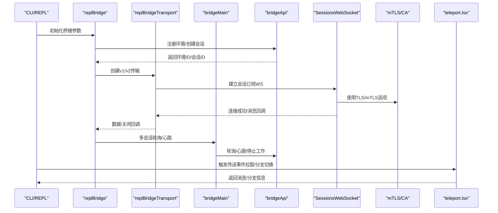
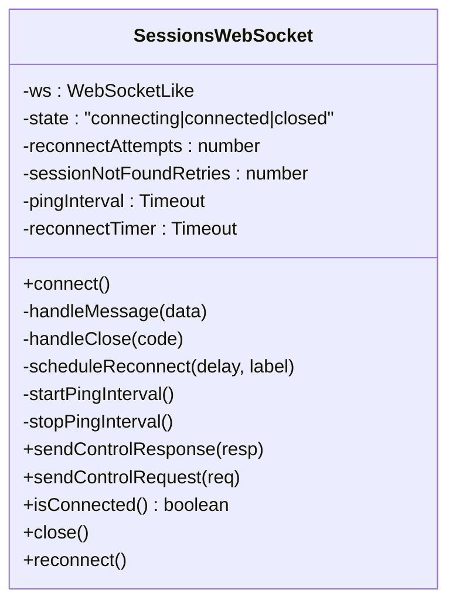
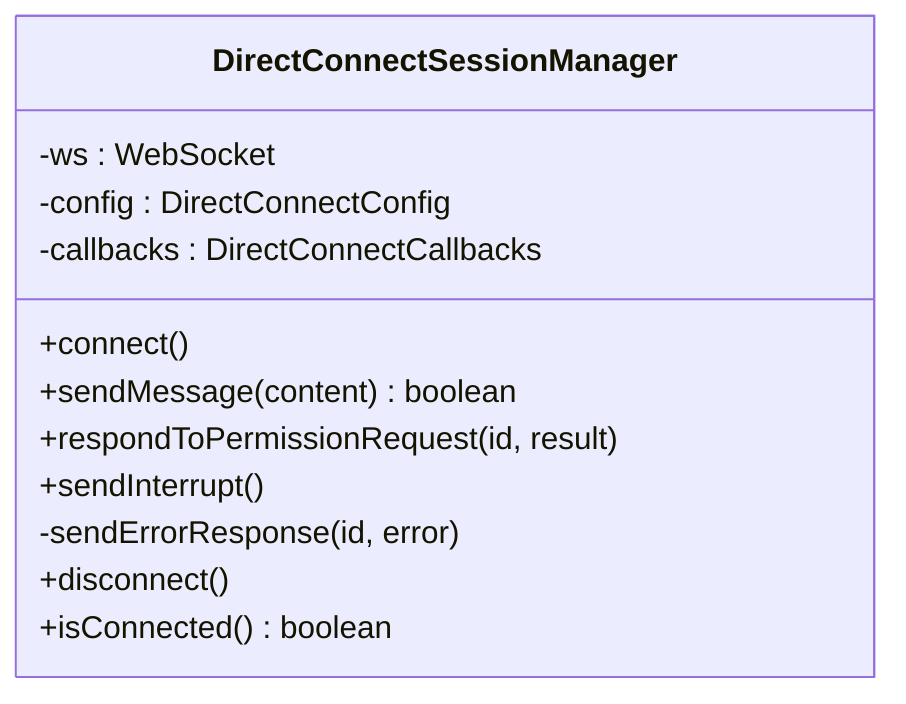
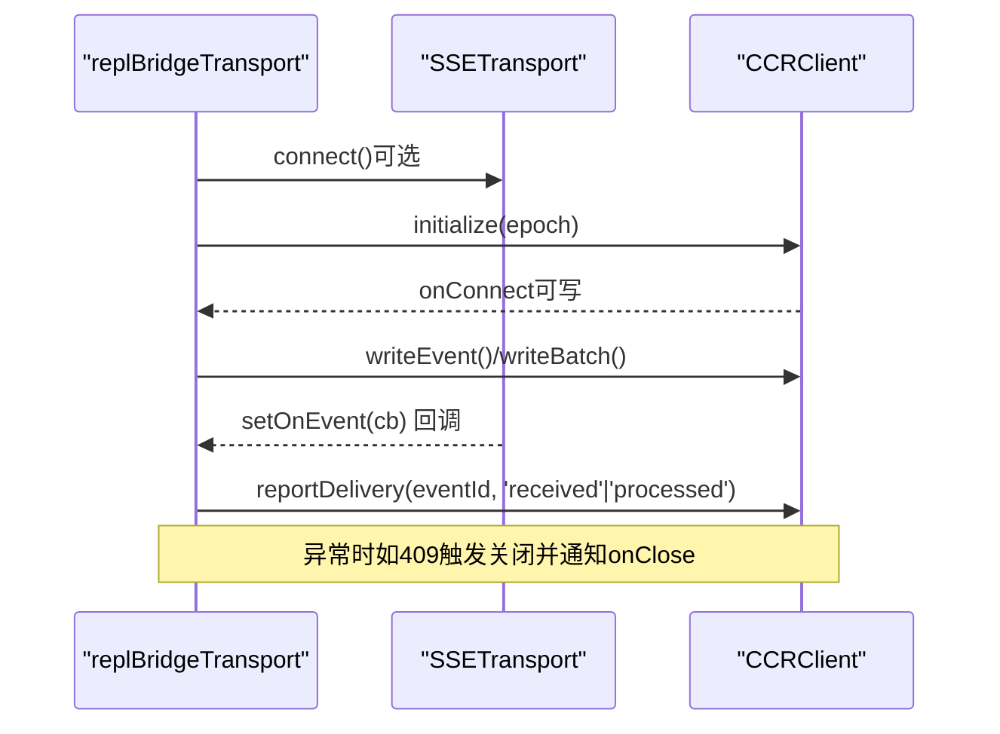
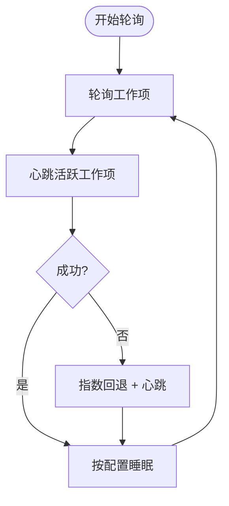
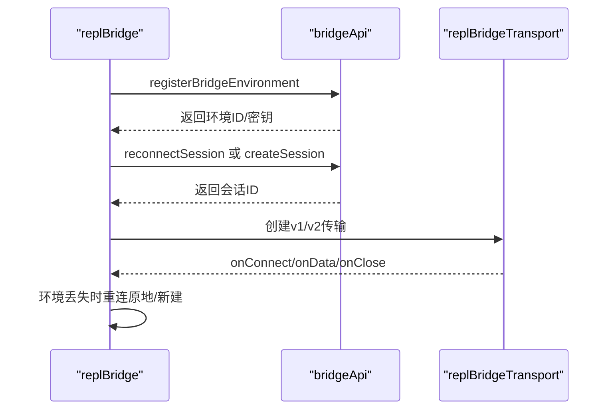
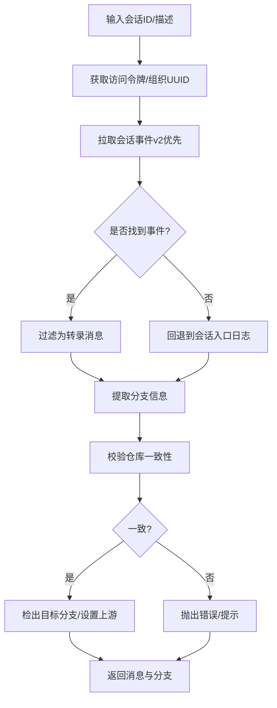
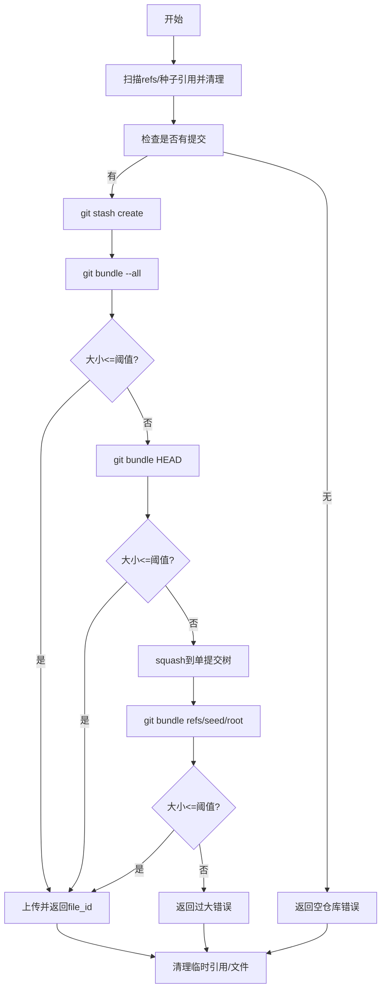
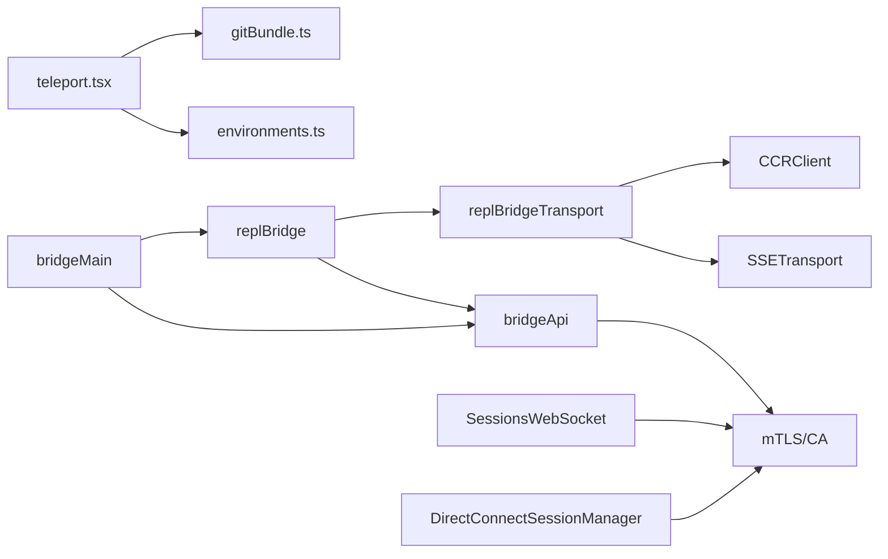

# 会话连接管理

<cite>
**本文引用的文件**
- [SessionsWebSocket.ts](file://src/remote/SessionsWebSocket.ts)
- [directConnectManager.ts](file://src/server/directConnectManager.ts)
- [replBridgeTransport.ts](file://src/bridge/replBridgeTransport.ts)
- [replBridge.ts](file://src/bridge/replBridge.ts)
- [bridgeMain.ts](file://src/bridge/bridgeMain.ts)
- [bridgeApi.ts](file://src/bridge/bridgeApi.ts)
- [WebSocketTransport.ts](file://src/cli/transports/WebSocketTransport.ts)
- [replBridge.ts（片段）](file://src/bridge/replBridge.ts)
- [bridgeMain.ts（片段）](file://src/bridge/bridgeMain.ts)
- [teleport.tsx](file://src/utils/teleport.tsx)
- [gitBundle.ts](file://src/utils/teleport/gitBundle.ts)
- [environments.ts](file://src/utils/teleport/environments.ts)
- [mtls.ts](file://src/utils/mtls.ts)
- [trustedDevice.ts](file://src/bridge/trustedDevice.ts)
- [RemoteEnvironmentDialog.tsx](file://src/components/RemoteEnvironmentDialog.tsx)
</cite>

## 目录
1. [简介](#简介)
2. [项目结构](#项目结构)
3. [核心组件](#核心组件)
4. [架构总览](#架构总览)
5. [详细组件分析](#详细组件分析)
6. [依赖关系分析](#依赖关系分析)
7. [性能考虑](#性能考虑)
8. [故障排除指南](#故障排除指南)
9. [结论](#结论)
10. [附录：连接配置与示例](#附录连接配置与示例)

## 简介
本文件系统性梳理“会话连接管理”的实现，覆盖以下主题：
- WebSocket 连接的建立与维护：连接池、重连策略、心跳与空闲检测、连接状态监控
- 会话服务器实现：直接连接管理器与会话路由机制
- 传送功能：环境选择、Git 打包与远程环境同步
- 连接安全性：TLS 加密、身份验证与访问控制
- 配置示例与常见问题排查

## 项目结构
围绕会话连接管理的关键模块分布如下：
- 会话订阅层：远端会话 WebSocket 客户端
- 直连桥接层：本地直连会话管理器
- 桥接层：REPL/守护进程桥接，包含 v1/v2 传输抽象与工作轮询
- 传送层：环境选择、Git 打包上传、事件拉取与分支切换
- 安全层：mTLS、OAuth/JWT、可信设备令牌

图示来源
- [SessionsWebSocket.ts:82-405](file://src/remote/SessionsWebSocket.ts#L82-L405)
- [directConnectManager.ts:40-214](file://src/server/directConnectManager.ts#L40-L214)
- [replBridgeTransport.ts:119-371](file://src/bridge/replBridgeTransport.ts#L119-L371)
- [replBridge.ts:260-800](file://src/bridge/replBridge.ts#L260-L800)
- [bridgeMain.ts:141-2492](file://src/bridge/bridgeMain.ts#L141-L2492)
- [bridgeApi.ts:68-200](file://src/bridge/bridgeApi.ts#L68-L200)
- [teleport.tsx:730-900](file://src/utils/teleport.tsx#L730-L900)
- [gitBundle.ts:152-293](file://src/utils/teleport/gitBundle.ts#L152-L293)
- [environments.ts:32-121](file://src/utils/teleport/environments.ts#L32-L121)
- [mtls.ts:100-152](file://src/utils/mtls.ts#L100-L152)
- [trustedDevice.ts:54-63](file://src/bridge/trustedDevice.ts#L54-L63)

章节来源
- [SessionsWebSocket.ts:82-405](file://src/remote/SessionsWebSocket.ts#L82-L405)
- [directConnectManager.ts:40-214](file://src/server/directConnectManager.ts#L40-L214)
- [replBridgeTransport.ts:119-371](file://src/bridge/replBridgeTransport.ts#L119-L371)
- [replBridge.ts:260-800](file://src/bridge/replBridge.ts#L260-L800)
- [bridgeMain.ts:141-2492](file://src/bridge/bridgeMain.ts#L141-L2492)
- [bridgeApi.ts:68-200](file://src/bridge/bridgeApi.ts#L68-L200)
- [teleport.tsx:730-900](file://src/utils/teleport.tsx#L730-L900)
- [gitBundle.ts:152-293](file://src/utils/teleport/gitBundle.ts#L152-L293)
- [environments.ts:32-121](file://src/utils/teleport/environments.ts#L32-L121)
- [mtls.ts:100-152](file://src/utils/mtls.ts#L100-L152)
- [trustedDevice.ts:54-63](file://src/bridge/trustedDevice.ts#L54-L63)

## 核心组件
- 远端会话 WebSocket 客户端：负责连接、认证、消息收发、心跳、断线重连与永久关闭码处理
- 直连会话管理器：面向本地直连场景，处理权限请求、中断信号、消息发送
- 桥接传输适配：统一 v1（HybridTransport）与 v2（SSETransport + CCRClient）写路径
- 桥接主循环：多会话轮询、心跳、指数回退、环境重建与会话重连策略
- 传送工具链：事件拉取、分支切换、Git 打包上传、环境选择
- 安全工具：mTLS/CA 证书、OAuth/JWT、可信设备令牌

章节来源
- [SessionsWebSocket.ts:82-405](file://src/remote/SessionsWebSocket.ts#L82-L405)
- [directConnectManager.ts:40-214](file://src/server/directConnectManager.ts#L40-L214)
- [replBridgeTransport.ts:23-70](file://src/bridge/replBridgeTransport.ts#L23-L70)
- [bridgeMain.ts:141-2492](file://src/bridge/bridgeMain.ts#L141-L2492)
- [teleport.tsx:565-715](file://src/utils/teleport.tsx#L565-L715)
- [gitBundle.ts:152-293](file://src/utils/teleport/gitBundle.ts#L152-L293)
- [mtls.ts:100-152](file://src/utils/mtls.ts#L100-L152)
- [bridgeApi.ts:68-200](file://src/bridge/bridgeApi.ts#L68-L200)

## 架构总览
下图展示从桥接到远端会话的典型调用链路，以及传送流程中的事件拉取与分支切换。

图示来源
- [replBridge.ts:260-800](file://src/bridge/replBridge.ts#L260-L800)
- [replBridgeTransport.ts:119-371](file://src/bridge/replBridgeTransport.ts#L119-L371)
- [bridgeMain.ts:141-2492](file://src/bridge/bridgeMain.ts#L141-L2492)
- [bridgeApi.ts:68-200](file://src/bridge/bridgeApi.ts#L68-L200)
- [SessionsWebSocket.ts:82-405](file://src/remote/SessionsWebSocket.ts#L82-L405)
- [mtls.ts:100-152](file://src/utils/mtls.ts#L100-L152)
- [teleport.tsx:565-715](file://src/utils/teleport.tsx#L565-L715)

## 详细组件分析

### 远端会话 WebSocket 客户端（SessionsWebSocket）
- 连接与认证：通过 OAuth 访问令牌在连接时作为头部携带；支持代理与 mTLS
- 心跳与空闲：周期性 ping，维持长连接健康
- 断线与重连：对不同关闭码采取差异化策略；对 4001（瞬态）有限重试；对永久关闭码直接终止
- 控制消息：支持发送控制请求/响应，用于中断等操作
- 状态管理：内部维护连接状态机，暴露连接/断开/错误/重连回调

图示来源
- [SessionsWebSocket.ts:82-405](file://src/remote/SessionsWebSocket.ts#L82-L405)

章节来源
- [SessionsWebSocket.ts:82-405](file://src/remote/SessionsWebSocket.ts#L82-L405)

### 直连会话管理器（DirectConnectSessionManager）
- 用途：本地直连场景下的会话管理，处理来自远端的控制请求（如工具使用授权）
- 功能：消息解析、权限请求分发、消息发送、中断请求、连接状态查询

图示来源
- [directConnectManager.ts:40-214](file://src/server/directConnectManager.ts#L40-L214)

章节来源
- [directConnectManager.ts:40-214](file://src/server/directConnectManager.ts#L40-L214)

### 桥接传输适配（replBridgeTransport）
- 统一 v1 与 v2 写路径：v1 使用 HybridTransport；v2 使用 SSETransport 读 + CCRClient 写
- 认证与注册：v2 通过 registerWorker 获取 epoch，并在 CCRClient 中进行心跳与状态上报
- 事件交付跟踪：在 v2 下记录 received/processing/processed 状态，避免重启导致的重复提示
- 关闭与回退：当 SSE 流异常或 epoch 不匹配时，触发关闭并由上层轮询恢复

图示来源
- [replBridgeTransport.ts:119-371](file://src/bridge/replBridgeTransport.ts#L119-L371)

章节来源
- [replBridgeTransport.ts:23-70](file://src/bridge/replBridgeTransport.ts#L23-L70)
- [replBridgeTransport.ts:119-371](file://src/bridge/replBridgeTransport.ts#L119-L371)

### 桥接主循环（bridgeMain）
- 多会话轮询：按配置周期拉取工作项，维护活动会话集合、心跳、超时与清理
- 指数回退：对网络/服务异常采用指数回退，设置最大延迟与放弃时间
- 睡眠检测：基于回退阈值识别系统休眠，重置重连预算
- 环境与会话生命周期：注册/注销环境、归档会话、停止工作项

图示来源
- [bridgeMain.ts:141-2492](file://src/bridge/bridgeMain.ts#L141-L2492)

章节来源
- [bridgeMain.ts:141-2492](file://src/bridge/bridgeMain.ts#L141-L2492)

### REPL 桥接核心（replBridge）
- 初始化与崩溃恢复：注册环境、创建/复用会话、持久化指针（支持持续模式）
- 重连策略：环境丢失后尝试“原地重连”（相同环境ID），否则归档旧会话并创建新会话
- 传输切换：在 v1/v2 之间动态选择，携带 SSE 序号水位，避免历史重放
- 权限与标题：处理权限请求回调、派生会话标题、初始消息去重

图示来源
- [replBridge.ts:260-800](file://src/bridge/replBridge.ts#L260-L800)
- [bridgeApi.ts:68-200](file://src/bridge/bridgeApi.ts#L68-L200)
- [replBridgeTransport.ts:119-371](file://src/bridge/replBridgeTransport.ts#L119-L371)

章节来源
- [replBridge.ts:260-800](file://src/bridge/replBridge.ts#L260-L800)
- [bridgeApi.ts:68-200](file://src/bridge/bridgeApi.ts#L68-L200)

### 传送功能（teleport.tsx）
- 事件拉取：优先使用 CCR v2 的事件接口，回退到会话入口日志
- 分支切换：校验仓库一致性，拉取目标分支，执行检出与上游设置
- 会话恢复：过滤侧链消息，生成用户提示消息，返回消息与分支信息

图示来源
- [teleport.tsx:565-715](file://src/utils/teleport.tsx#L565-L715)
- [teleport.tsx:315-344](file://src/utils/teleport.tsx#L315-L344)

章节来源
- [teleport.tsx:565-715](file://src/utils/teleport.tsx#L565-L715)
- [teleport.tsx:315-344](file://src/utils/teleport.tsx#L315-L344)

### 传送中的 Git 打包（gitBundle.ts）
- 打包策略：--all → HEAD → squashed-root 降级链，受大小限制与特性门控控制
- WIP 捕获：通过 stash 创建临时引用，打包未提交变更
- 上传与清理：上传至文件 API，删除临时引用与临时文件

图示来源
- [gitBundle.ts:152-293](file://src/utils/teleport/gitBundle.ts#L152-L293)

章节来源
- [gitBundle.ts:152-293](file://src/utils/teleport/gitBundle.ts#L152-L293)

### 环境选择与默认云环境（environments.ts）
- 环境列表：通过 OAuth 获取可用环境列表
- 默认云环境：在无环境时创建默认云环境，包含语言与网络配置

章节来源
- [environments.ts:32-121](file://src/utils/teleport/environments.ts#L32-L121)

### 连接安全性（mTLS、OAuth/JWT、可信设备）
- mTLS/CA：从环境变量加载客户端证书/私钥与 CA，注入到 WebSocket/TLS 请求中
- OAuth/JWT：桥接 API 层统一添加 Authorization 头与可信设备头，支持 401 刷新
- 可信设备：在启用门控时附加 X-Trusted-Device-Token，增强高安全会话的接入控制

章节来源
- [mtls.ts:100-152](file://src/utils/mtls.ts#L100-L152)
- [bridgeApi.ts:68-200](file://src/bridge/bridgeApi.ts#L68-L200)
- [trustedDevice.ts:54-63](file://src/bridge/trustedDevice.ts#L54-L63)

## 依赖关系分析
- 组件耦合
  - replBridge 依赖 bridgeApi 进行环境注册与会话管理
  - replBridgeTransport 将 SSE 与 CCRClient 解耦，仅暴露统一写接口
  - bridgeMain 提供多会话轮询与回退策略，支撑 replBridge 的稳定性
  - teleport.tsx 依赖 sessions API 与文件 API，结合 gitBundle 完成环境同步
- 外部依赖
  - WebSocket 客户端（浏览器/Node/ws）、代理与 TLS
  - Axios 与 OAuth 令牌刷新
  - Git 命令行工具与文件 API

图示来源
- [replBridge.ts:260-800](file://src/bridge/replBridge.ts#L260-L800)
- [bridgeMain.ts:141-2492](file://src/bridge/bridgeMain.ts#L141-L2492)
- [replBridgeTransport.ts:119-371](file://src/bridge/replBridgeTransport.ts#L119-L371)
- [teleport.tsx:730-900](file://src/utils/teleport.tsx#L730-L900)
- [gitBundle.ts:152-293](file://src/utils/teleport/gitBundle.ts#L152-L293)
- [environments.ts:32-121](file://src/utils/teleport/environments.ts#L32-L121)
- [SessionsWebSocket.ts:82-405](file://src/remote/SessionsWebSocket.ts#L82-L405)
- [directConnectManager.ts:40-214](file://src/server/directConnectManager.ts#L40-L214)
- [mtls.ts:100-152](file://src/utils/mtls.ts#L100-L152)

章节来源
- [replBridge.ts:260-800](file://src/bridge/replBridge.ts#L260-L800)
- [bridgeMain.ts:141-2492](file://src/bridge/bridgeMain.ts#L141-L2492)
- [replBridgeTransport.ts:119-371](file://src/bridge/replBridgeTransport.ts#L119-L371)
- [teleport.tsx:730-900](file://src/utils/teleport.tsx#L730-L900)
- [gitBundle.ts:152-293](file://src/utils/teleport/gitBundle.ts#L152-L293)
- [environments.ts:32-121](file://src/utils/teleport/environments.ts#L32-L121)
- [SessionsWebSocket.ts:82-405](file://src/remote/SessionsWebSocket.ts#L82-L405)
- [directConnectManager.ts:40-214](file://src/server/directConnectManager.ts#L40-L214)
- [mtls.ts:100-152](file://src/utils/mtls.ts#L100-L152)

## 性能考虑
- 连接保持
  - 心跳与保活帧：减少代理空闲超时导致的 RST
  - ping 间隔与 pong 检测：及时发现链路异常
- 重连策略
  - 指数回退上限与放弃时间：避免风暴式重连
  - 睡眠检测：区分系统休眠与网络异常，重置预算
- 传输优化
  - v2 写路径批量化与事件交付跟踪，降低重复提示风险
  - SSE 序号水位传递，避免历史重放
- 传送效率
  - 打包降级链与大小阈值，平衡传输与准确性
  - 并行 SSE 连接与 CCR 初始化，缩短就绪时间

## 故障排除指南
- 连接频繁断开
  - 检查代理/防火墙是否造成空闲超时，适当缩短代理空闲超时或启用保活
  - 查看关闭码：1002/4001/4003 对应协议错误/会话不存在/未授权，需针对性修复
  - 启用诊断日志与遥测事件，定位 Cloudflare 代理 RST 或服务端回收
- 重连失败或无限重连
  - 确认访问令牌有效且可刷新（401 自动重试）
  - 检查回退配置与放弃时间，避免过长等待
- 传送失败
  - 仓库不一致：确保在正确仓库检出目标分支
  - 打包过大：启用 HEAD/squashed-root 降级链，或使用 GitHub 远端
  - 文件上传失败：检查文件 API 可达性与令牌
- 安全相关
  - mTLS 证书/私钥/CA 加载失败：确认环境变量与文件路径
  - 可信设备令牌：在门控开启时确保令牌存在并有效

章节来源
- [WebSocketTransport.ts:38-46](file://src/cli/transports/WebSocketTransport.ts#L38-L46)
- [bridgeMain.ts:107-109](file://src/bridge/bridgeMain.ts#L107-L109)
- [bridgeApi.ts:106-139](file://src/bridge/bridgeApi.ts#L106-L139)
- [teleport.tsx:367-421](file://src/utils/teleport.tsx#L367-L421)
- [gitBundle.ts:152-293](file://src/utils/teleport/gitBundle.ts#L152-L293)
- [mtls.ts:23-73](file://src/utils/mtls.ts#L23-L73)
- [trustedDevice.ts:54-63](file://src/bridge/trustedDevice.ts#L54-L63)

## 结论
该体系以“桥接 + 传输适配 + 多会话轮询”为核心，结合远端订阅与直连两种路径，提供稳定可靠的会话连接能力。通过 mTLS/OAuth/可信设备令牌强化安全，借助 SSE 序号与事件交付跟踪提升一致性，配合传送层的 Git 打包与分支切换，实现跨环境无缝迁移与恢复。

## 附录：连接配置与示例
- mTLS/CA 配置
  - 设置客户端证书/私钥/口令与额外 CA 证书路径，自动注入到 WebSocket/TLS 请求
  - 清理缓存后生效，适用于企业代理与内网场景
- OAuth/JWT 与可信设备
  - 在桥接 API 层统一添加 Authorization 头与可信设备头
  - 401 场景自动尝试刷新，刷新失败则视为致命错误
- 代理与 TLS
  - 通过代理 URL 与 TLS 选项配置，支持 Bun 与 Node 环境
- 传送参数
  - useBundle：强制使用 Git 打包（无需 GitHub 远端）
  - reuseOutcomeBranch：复用结果分支直接推送
  - environmentVariables：向容器注入只写环境变量

章节来源
- [mtls.ts:100-152](file://src/utils/mtls.ts#L100-L152)
- [bridgeApi.ts:68-200](file://src/bridge/bridgeApi.ts#L68-L200)
- [trustedDevice.ts:54-63](file://src/bridge/trustedDevice.ts#L54-L63)
- [teleport.tsx:730-900](file://src/utils/teleport.tsx#L730-L900)