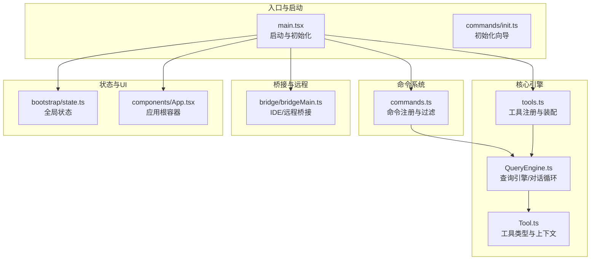
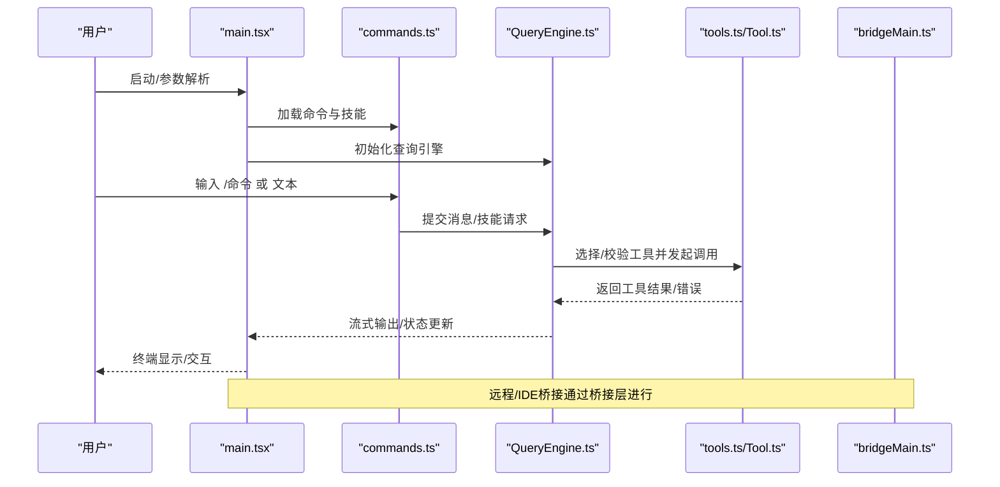
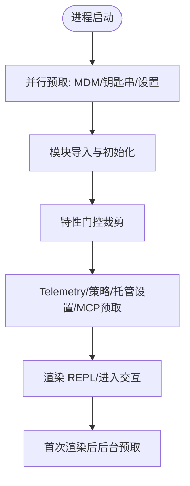
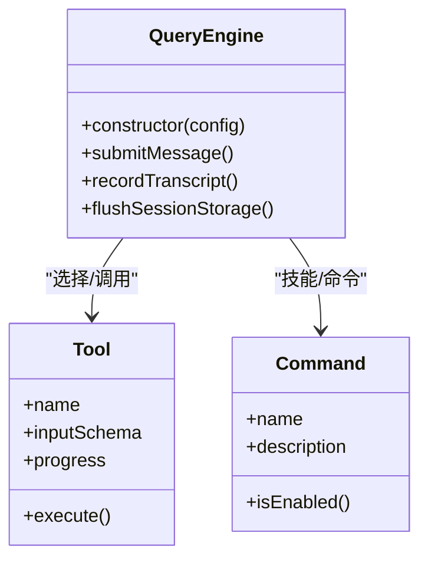
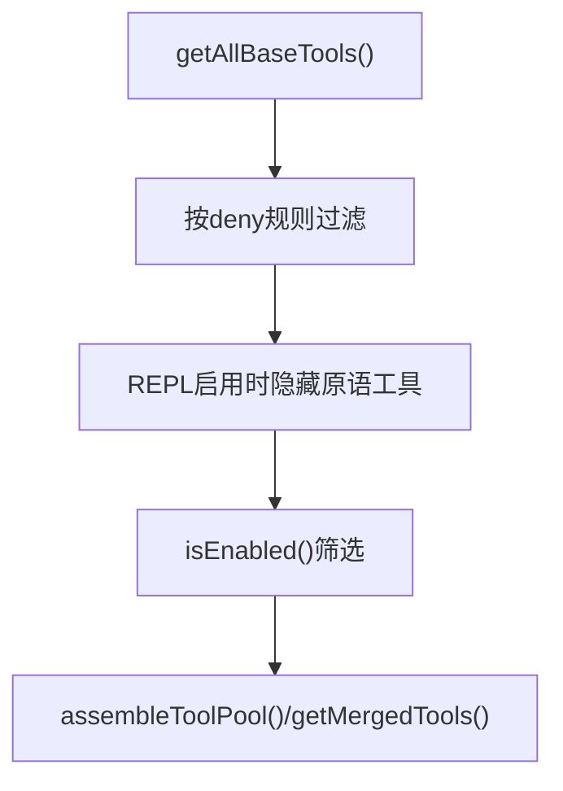
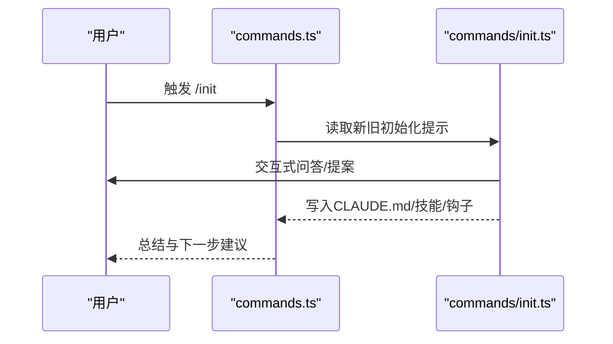
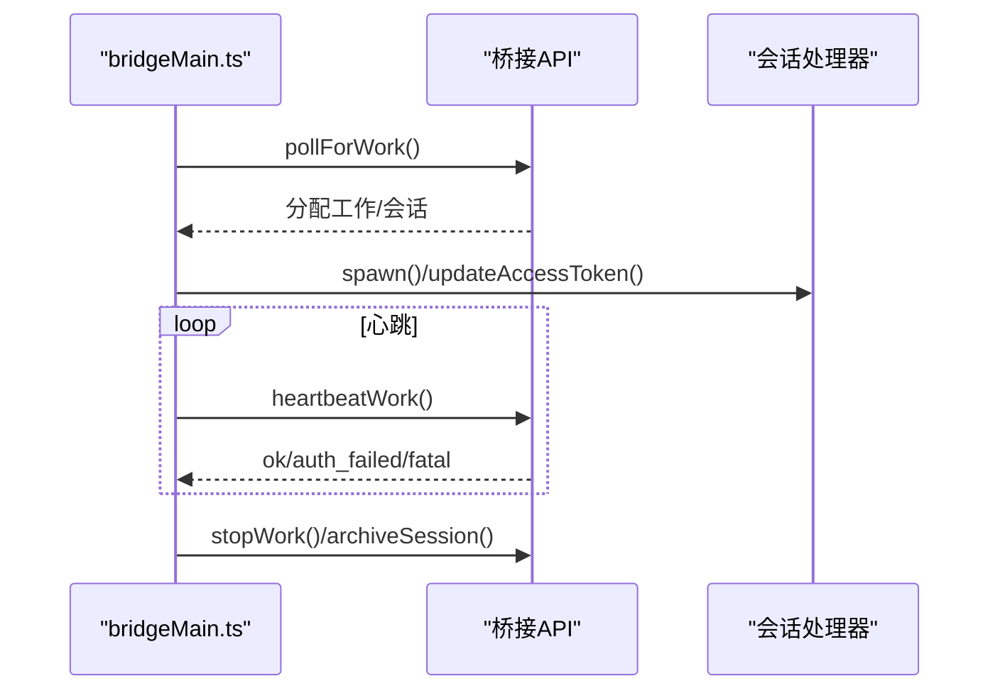
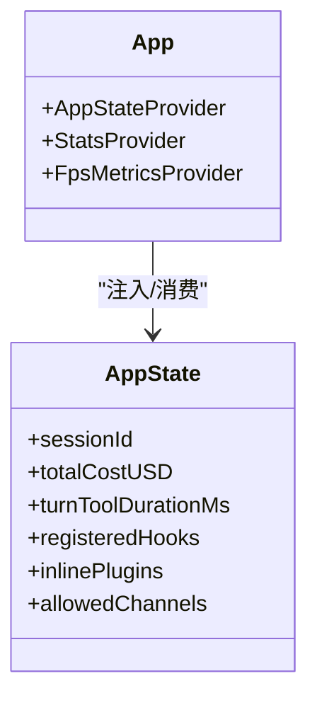
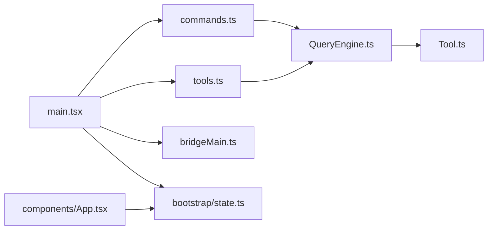

# 项目概述

<cite>
**本文档引用的文件**
- [README.md](file://README.md)
- [main.tsx](file://src/main.tsx)
- [state.ts](file://src/bootstrap/state.ts)
- [init.ts](file://src/commands/init.ts)
- [bridgeMain.ts](file://src/bridge/bridgeMain.ts)
- [tools.ts](file://src/tools.ts)
- [commands.ts](file://src/commands.ts)
- [QueryEngine.ts](file://src/QueryEngine.ts)
- [Tool.ts](file://src/Tool.ts)
- [App.tsx](file://src/components/App.tsx)
</cite>

## 目录
1. [简介](#简介)
2. [项目结构](#项目结构)
3. [核心组件](#核心组件)
4. [架构总览](#架构总览)
5. [详细组件分析](#详细组件分析)
6. [依赖关系分析](#依赖关系分析)
7. [性能考量](#性能考量)
8. [故障排查指南](#故障排查指南)
9. [结论](#结论)
10. [附录](#附录)

## 简介
Claude Code 是一款由 Anthropic 开发的 AI 驱动命令行代码助手，旨在通过终端与 Claude 进行交互，完成诸如文件编辑、命令执行、代码搜索、工作流编排等软件工程任务。该项目以“代理式开发者工具”为定位，强调可组合的工具体系、权限与安全模型、远程协作与桥接能力，并提供插件与技能扩展机制。

- 项目规模：约 1900 个源文件，超过 51 万行代码，覆盖命令系统、工具系统、服务层、桥接层、状态管理、UI 组件等多个维度。
- 技术栈：TypeScript + Bun（运行时）+ React + Ink（终端 UI 渲染），并集成 CLI 解析、协议适配（MCP/LSP）、分析与遥测等生态组件。
- 安全研究背景：该仓库为公开暴露的源码快照，用于教育、防御性安全研究与供应链分析，不构成对原始代码的所有权声明。

**章节来源**
- [README.md: 1-281:1-281](file://README.md#L1-L281)

## 项目结构
项目采用模块化分层组织，围绕“入口启动 → 命令解析 → 工具执行 → 会话与状态 → UI 渲染”的主路径展开，并在桥接层、服务层、插件与技能系统中实现扩展能力。

**图示来源**
- [main.tsx: 585-800:585-800](file://src/main.tsx#L585-L800)
- [commands.ts: 258-346:258-346](file://src/commands.ts#L258-L346)
- [tools.ts: 193-390:193-390](file://src/tools.ts#L193-L390)
- [QueryEngine.ts: 184-200:184-200](file://src/QueryEngine.ts#L184-L200)
- [Tool.ts: 158-200:158-200](file://src/Tool.ts#L158-L200)
- [bridgeMain.ts: 141-152:141-152](file://src/bridge/bridgeMain.ts#L141-L152)
- [state.ts: 429-430:429-430](file://src/bootstrap/state.ts#L429-L430)
- [App.tsx: 19-56:19-56](file://src/components/App.tsx#L19-L56)

**章节来源**
- [README.md: 53-95:53-95](file://README.md#L53-L95)
- [main.tsx: 585-800:585-800](file://src/main.tsx#L585-L800)
- [commands.ts: 258-346:258-346](file://src/commands.ts#L258-L346)
- [tools.ts: 193-390:193-390](file://src/tools.ts#L193-L390)
- [QueryEngine.ts: 184-200:184-200](file://src/QueryEngine.ts#L184-L200)
- [Tool.ts: 158-200:158-200](file://src/Tool.ts#L158-L200)
- [bridgeMain.ts: 141-152:141-152](file://src/bridge/bridgeMain.ts#L141-L152)
- [state.ts: 429-430:429-430](file://src/bootstrap/state.ts#L429-L430)
- [App.tsx: 19-56:19-56](file://src/components/App.tsx#L19-L56)

## 核心组件
- 入口与启动（main.tsx）
  - 并行预取：MDM 设置、钥匙串读取、OAuth/密钥预取等，减少首次渲染前阻塞。
  - 特性开关：基于 Bun 的特性门控（feature flags）按需裁剪构建产物。
  - 深度集成：Telemetry、策略限制、远程托管设置、MCP 官方注册表预取等。
  - 多入口支持：CLI、SDK、MCP 服务、本地代理等不同入口点。
- 查询引擎（QueryEngine.ts）
  - 会话生命周期管理：消息存储、工具调用循环、权限拒绝处理、预算与成本跟踪。
  - 结构化输出：支持 JSON Schema 输出约束、钩子事件、压缩与回放。
- 工具系统（Tool.ts、tools.ts）
  - 工具抽象：统一输入模式、权限上下文、进度事件与结果格式。
  - 工具装配：内置工具与 MCP 工具合并、去重与排序，保证提示缓存稳定性。
- 命令系统（commands.ts、commands/init.ts）
  - 命令注册：动态加载技能、插件与工作流命令，按可用性与启用状态过滤。
  - 初始化向导：引导生成 CLAUDE.md、个人说明、技能与钩子配置。
- 桥接与远程（bridge/bridgeMain.ts）
  - 双向通信：IDE 扩展与 CLI 之间的桥接，心跳、令牌刷新、会话管理。
  - 多会话与容量：按容量睡眠、心跳模式、超时与失败恢复。
- 状态与 UI（bootstrap/state.ts、components/App.tsx）
  - 全局状态：会话 ID、计费、用量、转轮统计、计划/自动模式标记等。
  - 应用容器：FPS 指标、统计上下文、应用状态树提供者。

**章节来源**
- [main.tsx: 585-800:585-800](file://src/main.tsx#L585-L800)
- [QueryEngine.ts: 184-200:184-200](file://src/QueryEngine.ts#L184-L200)
- [Tool.ts: 158-200:158-200](file://src/Tool.ts#L158-L200)
- [tools.ts: 193-390:193-390](file://src/tools.ts#L193-L390)
- [commands.ts: 258-346:258-346](file://src/commands.ts#L258-L346)
- [init.ts: 226-257:226-257](file://src/commands/init.ts#L226-L257)
- [bridgeMain.ts: 141-152:141-152](file://src/bridge/bridgeMain.ts#L141-L152)
- [state.ts: 429-430:429-430](file://src/bootstrap/state.ts#L429-L430)
- [App.tsx: 19-56:19-56](file://src/components/App.tsx#L19-L56)

## 架构总览
Claude Code 的整体架构围绕“入口启动 → 命令/工具选择 → 查询引擎 → 权限与安全 → 工具执行 → 结果回传”的闭环展开；同时通过桥接层实现 IDE 与远程控制，通过插件与技能系统实现可扩展的工作流。

**图示来源**
- [main.tsx: 585-800:585-800](file://src/main.tsx#L585-L800)
- [commands.ts: 258-346:258-346](file://src/commands.ts#L258-L346)
- [QueryEngine.ts: 184-200:184-200](file://src/QueryEngine.ts#L184-L200)
- [tools.ts: 193-390:193-390](file://src/tools.ts#L193-L390)
- [Tool.ts: 158-200:158-200](file://src/Tool.ts#L158-L200)
- [bridgeMain.ts: 141-152:141-152](file://src/bridge/bridgeMain.ts#L141-L152)

## 详细组件分析

### 入口与启动（main.tsx）
- 并行预取与延迟加载：在导入之前触发 MDM 与钥匙串读取，避免阻塞后续模块评估；部分重型模块（分析、gRPC、特性门控子系统）采用动态导入。
- 特性门控：通过 Bun 的特性开关裁剪未使用的功能分支，降低体积与启动时间。
- 多入口路径：根据 CLI 参数或环境变量选择 CLI、SDK、MCP 服务或本地代理入口。
- 启动后置：在 REPL 首次渲染后再启动后台预取，减少首帧阻塞。

**图示来源**
- [main.tsx: 13-200:13-200](file://src/main.tsx#L13-L200)

**章节来源**
- [main.tsx: 13-200:13-200](file://src/main.tsx#L13-L200)

### 查询引擎（QueryEngine.ts）
- 会话与消息：维护消息历史、文件缓存、用量与成本统计，支持多轮对话与工具调用循环。
- 权限与拒绝：记录权限拒绝与孤儿权限处理，确保安全边界。
- 结构化输出：支持 JSON Schema 输出、钩子事件、压缩与回放，便于长会话与 SDK 使用。
- 任务预算：可选任务预算与最大轮次限制，防止资源滥用。

**图示来源**
- [QueryEngine.ts: 184-200:184-200](file://src/QueryEngine.ts#L184-L200)
- [Tool.ts: 158-200:158-200](file://src/Tool.ts#L158-L200)
- [commands.ts: 258-346:258-346](file://src/commands.ts#L258-L346)

**章节来源**
- [QueryEngine.ts: 184-200:184-200](file://src/QueryEngine.ts#L184-L200)
- [Tool.ts: 158-200:158-200](file://src/Tool.ts#L158-L200)
- [commands.ts: 258-346:258-346](file://src/commands.ts#L258-L346)

### 工具系统（Tool.ts、tools.ts）
- 工具抽象：统一输入 JSON Schema、权限上下文、进度事件与结果格式，支持 Bash、文件读写、搜索、MCP、LSP、任务与团队协作等。
- 装配与合并：内置工具与 MCP 工具合并，按名称去重，内置工具优先，保持提示缓存稳定。
- 条件工具：基于特性门控与环境变量启用特定工具（如 PowerShell、Web 浏览器、计划模式等）。

**图示来源**
- [tools.ts: 193-390:193-390](file://src/tools.ts#L193-L390)

**章节来源**
- [tools.ts: 193-390:193-390](file://src/tools.ts#L193-L390)
- [Tool.ts: 158-200:158-200](file://src/Tool.ts#L158-L200)

### 命令系统（commands.ts、commands/init.ts）
- 动态加载：技能目录、插件与工作流命令异步加载，按可用性与启用状态过滤。
- 初始化向导：引导生成 CLAUDE.md、个人说明、技能与钩子，支持多阶段提案与优化建议。
- 远程安全：提供远程/桥接安全命令白名单，保障移动端/网页端输入的安全性。

**图示来源**
- [commands.ts: 258-346:258-346](file://src/commands.ts#L258-L346)
- [init.ts: 226-257:226-257](file://src/commands/init.ts#L226-L257)

**章节来源**
- [commands.ts: 258-346:258-346](file://src/commands.ts#L258-L346)
- [init.ts: 226-257:226-257](file://src/commands/init.ts#L226-L257)

### 桥接与远程（bridge/bridgeMain.ts）
- 会话管理：心跳、令牌刷新、超时与失败恢复；多会话模式下的容量与睡眠策略。
- 安全与信任：JWT 认证、过期重连、环境与工作项清理。
- 日志与诊断：调试日志路径、状态显示、错误归因与事件上报。

**图示来源**
- [bridgeMain.ts: 141-152:141-152](file://src/bridge/bridgeMain.ts#L141-L152)

**章节来源**
- [bridgeMain.ts: 141-152:141-152](file://src/bridge/bridgeMain.ts#L141-L152)

### 状态与 UI（bootstrap/state.ts、components/App.tsx）
- 全局状态：会话 ID、计费与用量、转轮统计、计划/自动模式标记、钩子与插件状态等。
- 应用容器：FPS 指标、统计上下文、应用状态树提供者，支撑 UI 与性能监控。

**图示来源**
- [state.ts: 429-430:429-430](file://src/bootstrap/state.ts#L429-L430)
- [App.tsx: 19-56:19-56](file://src/components/App.tsx#L19-L56)

**章节来源**
- [state.ts: 429-430:429-430](file://src/bootstrap/state.ts#L429-L430)
- [App.tsx: 19-56:19-56](file://src/components/App.tsx#L19-L56)

## 依赖关系分析
- 入口到命令与工具：main.tsx 依赖 commands.ts 与 tools.ts，负责命令注册与工具装配。
- 引擎到工具：QueryEngine.ts 依赖 Tool.ts 与 tools.ts，驱动工具选择与执行。
- 命令到技能：commands.ts 动态加载技能、插件与工作流命令，形成命令池。
- 桥接到远程：bridgeMain.ts 与外部桥接 API 协作，管理会话与令牌。
- UI 到状态：components/App.tsx 通过状态提供者向上游传递状态与上下文。

**图示来源**
- [main.tsx: 585-800:585-800](file://src/main.tsx#L585-L800)
- [commands.ts: 258-346:258-346](file://src/commands.ts#L258-L346)
- [tools.ts: 193-390:193-390](file://src/tools.ts#L193-L390)
- [QueryEngine.ts: 184-200:184-200](file://src/QueryEngine.ts#L184-L200)
- [Tool.ts: 158-200:158-200](file://src/Tool.ts#L158-L200)
- [bridgeMain.ts: 141-152:141-152](file://src/bridge/bridgeMain.ts#L141-L152)
- [state.ts: 429-430:429-430](file://src/bootstrap/state.ts#L429-L430)
- [App.tsx: 19-56:19-56](file://src/components/App.tsx#L19-L56)

**章节来源**
- [main.tsx: 585-800:585-800](file://src/main.tsx#L585-L800)
- [commands.ts: 258-346:258-346](file://src/commands.ts#L258-L346)
- [tools.ts: 193-390:193-390](file://src/tools.ts#L193-L390)
- [QueryEngine.ts: 184-200:184-200](file://src/QueryEngine.ts#L184-L200)
- [Tool.ts: 158-200:158-200](file://src/Tool.ts#L158-L200)
- [bridgeMain.ts: 141-152:141-152](file://src/bridge/bridgeMain.ts#L141-L152)
- [state.ts: 429-430:429-430](file://src/bootstrap/state.ts#L429-L430)
- [App.tsx: 19-56:19-56](file://src/components/App.tsx#L19-L56)

## 性能考量
- 启动优化：并行预取与延迟加载显著缩短首帧时间；特性门控裁剪未使用代码。
- 事件循环：首次渲染后才启动后台预取，避免抢占主线程。
- 缓存与提示：工具与系统提示的稳定排序与提示缓存策略，减少重复计算。
- 资源限制：任务预算、最大轮次与成本跟踪，防止长时间会话占用资源。

[本节为通用指导，无需具体文件分析]

## 故障排查指南
- 启动阶段
  - 检查特性门控与环境变量是否正确，确认未被误裁剪。
  - 关注并行预取失败（MDM/钥匙串）导致的初始化延迟。
- 会话与工具
  - 若工具调用失败，检查权限上下文与拒绝记录，确认 deny 规则与工作目录映射。
  - 使用结构化输出与钩子事件定位问题，必要时开启调试模式。
- 桥接与远程
  - 关注心跳失败与 JWT 过期，确认重新连接与令牌刷新流程。
  - 检查会话超时与容量限制，避免在高负载下出现抖动。
- UI 与状态
  - 若 UI 卡顿，检查 FPS 指标与滚动节流；确认状态更新频率与渲染批处理。

**章节来源**
- [main.tsx: 13-200:13-200](file://src/main.tsx#L13-L200)
- [QueryEngine.ts: 184-200:184-200](file://src/QueryEngine.ts#L184-L200)
- [bridgeMain.ts: 141-152:141-152](file://src/bridge/bridgeMain.ts#L141-L152)

## 结论
Claude Code 以“代理式开发者工具”为核心定位，通过模块化的命令与工具系统、严格的权限与安全模型、灵活的桥接与远程能力，以及可扩展的插件与技能机制，实现了从终端到 IDE/远程的无缝协作。其技术栈与架构设计兼顾性能与可维护性，适合在复杂工程场景中进行规模化应用与持续演进。

[本节为总结性内容，无需具体文件分析]

## 附录
- 实际使用场景示例（概念性说明）
  - 代码编辑：使用文件读取/编辑工具进行局部修改与保存。
  - 文件操作：使用通配/搜索工具定位与批量处理文件。
  - 命令执行：通过 Bash/PowerShell 工具执行脚本与命令。
  - 代码搜索：结合 ripgrep 与工具搜索阈值，快速检索代码库。
  - 交互式会话：通过 /init 生成 CLAUDE.md 与技能，提升团队协作效率。
  - 远程协作：通过桥接层与远程控制，实现跨设备与跨环境的协同开发。

[本节为概念性说明，无需具体文件分析]