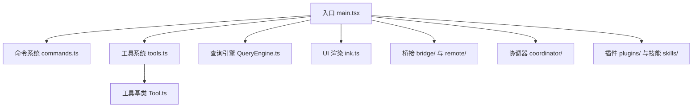
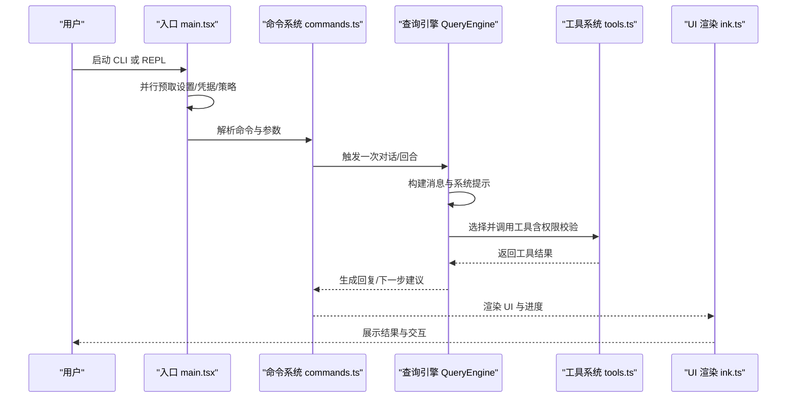
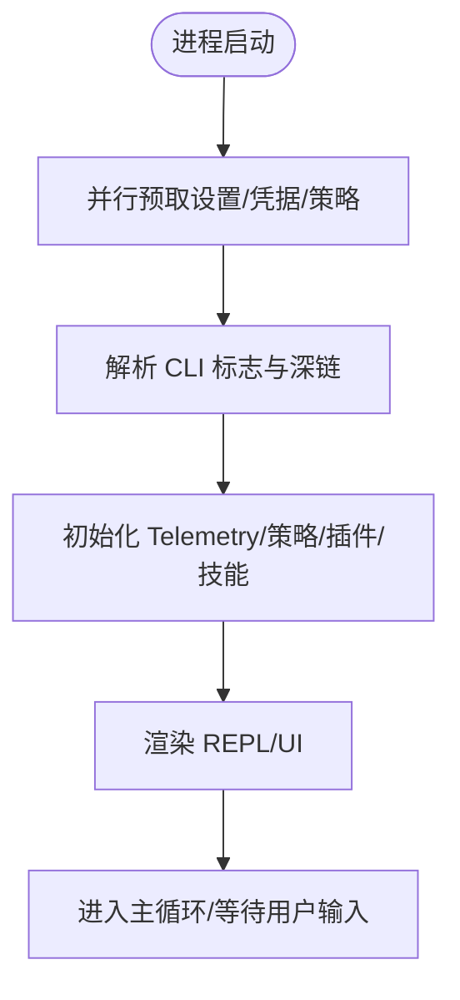
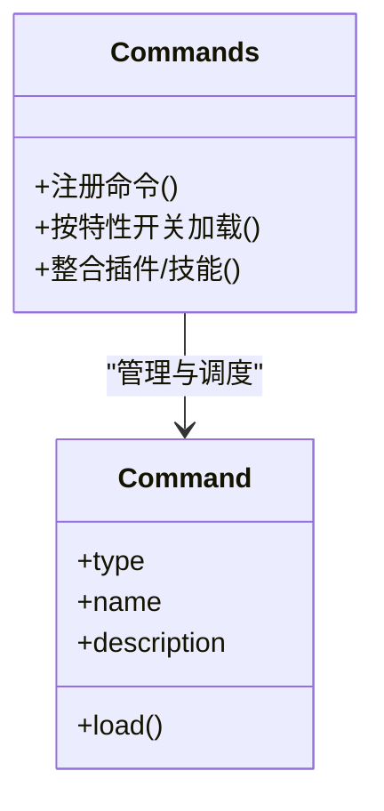
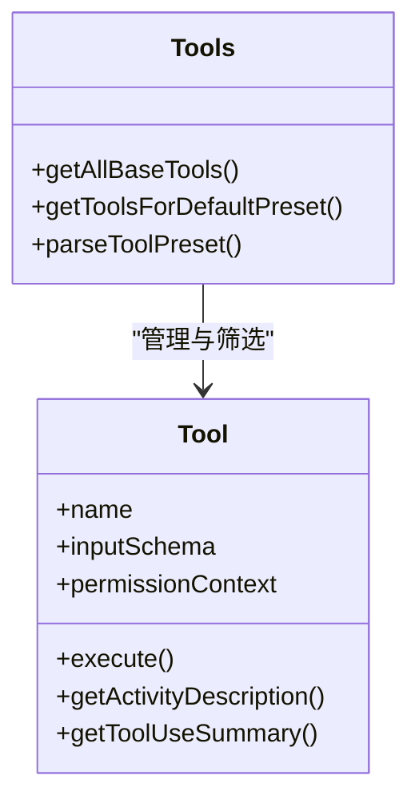
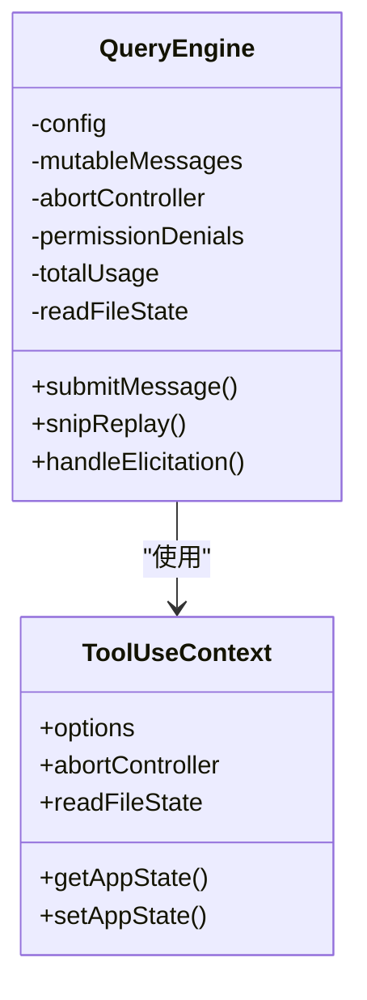
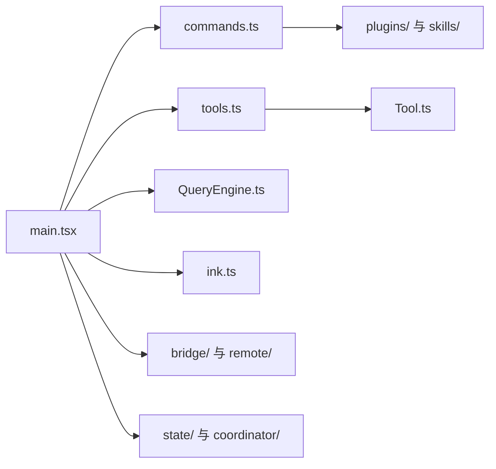

# 项目介绍

<cite>
**本文引用的文件列表**
- [README.md](file://README.md)
- [main.tsx](file://src/main.tsx)
- [Tool.ts](file://src/Tool.ts)
- [tools.ts](file://src/tools.ts)
- [commands.ts](file://src/commands.ts)
- [QueryEngine.ts](file://src/QueryEngine.ts)
- [ink.ts](file://src/ink.ts)
</cite>

## 目录
1. [引言](#引言)
2. [项目结构](#项目结构)
3. [核心组件](#核心组件)
4. [架构总览](#架构总览)
5. [详细组件分析](#详细组件分析)
6. [依赖关系分析](#依赖关系分析)
7. [性能考量](#性能考量)
8. [故障排查指南](#故障排查指南)
9. [结论](#结论)
10. [附录](#附录)

## 引言
Claude Code 是一个由 AI 驱动的命令行代码助手，专注于通过终端完成软件工程任务的自动化与智能化。它以“代理式开发者工具”（agentic developer tooling）为核心定位，围绕“文件编辑、命令执行、代码搜索、工作流协调”等能力构建，既可作为交互式 REPL 使用，也可在非交互模式下作为 SDK/CLI 执行任务。该项目当前处于安全研究背景下的公开镜像状态：其源码于特定时间点通过 npm 分发中的 source map 暴露，仓库保留了该公开快照用于教育、防御性安全研究与供应链分析。

本项目采用 TypeScript + Bun 运行时，并以 React + Ink 构建终端 UI，形成“命令行 + 可视化界面 + 大模型推理”的统一技术栈。项目规模庞大（约 1900 文件，512000+ 行代码），体现了现代 agentic 系统在模块化、插件化、权限与安全控制方面的复杂度与工程化程度。

面向不同层次的读者：
- 初学者：我们将用通俗语言解释什么是“代理式开发者工具”，以及它如何帮助你自动完成日常开发任务。
- 有经验的开发者：我们将深入到模块划分、数据流、权限系统、并发与并发安全、特性开关与死代码消除等层面，帮助你理解整体架构与技术选型。

## 项目结构
从仓库目录结构可见，项目按“入口/命令/工具/服务/桥接/状态/任务/技能/插件/UI 组件”等维度组织，体现清晰的分层与职责分离：
- 入口与启动：main.tsx 负责 CLI 解析、并行预取、设置加载、Telemetry 初始化、REPL 启动等。
- 命令系统：commands.ts 注册并按环境条件动态加载各类“/斜杠命令”，覆盖配置、审查、任务、会话、桌面/移动集成等。
- 工具系统：tools.ts 统一注册与筛选工具集，支持按特性开关与运行环境启用/禁用；Tool.ts 定义工具类型与权限上下文。
- 查询引擎：QueryEngine.ts 封装 LLM 调用、工具调用循环、思考模式、重试与计费统计等核心逻辑。
- UI 层：ink.ts 提供 React/Ink 渲染封装，配合大量 UI 组件与屏幕实现交互体验。
- 桥接与远程：bridge/ 与 remote/ 支持 IDE 扩展与远程会话，实现跨端协作。
- 协调器与多智能体：coordinator/ 与 AgentTool 支持子代理与团队并行工作。
- 插件与技能：plugins/ 与 skills/ 提供扩展与可复用工作流。

图表来源
- [main.tsx:585-800](file://src/main.tsx#L585-L800)
- [commands.ts:1-200](file://src/commands.ts#L1-L200)
- [tools.ts:1-200](file://src/tools.ts#L1-L200)
- [Tool.ts:1-200](file://src/Tool.ts#L1-L200)
- [QueryEngine.ts:130-207](file://src/QueryEngine.ts#L130-L207)
- [ink.ts:1-81](file://src/ink.ts#L1-L81)

章节来源
- [README.md:53-95](file://README.md#L53-L95)
- [main.tsx:585-800](file://src/main.tsx#L585-L800)

## 核心组件
- 代理式开发者工具（Agentic Developer Tooling）
  - 以“工具”为基本执行单元，结合 LLM 推理与权限控制，实现“计划—执行—反馈—再计划”的循环，从而完成复杂的软件工程任务。
  - 在 Claude Code 中，工具涵盖 Bash、文件读写/编辑、搜索（Glob/Grep）、Web 抓取/搜索、MCP/LSP 集成、任务管理、消息传递、团队协作等。
- 命令系统（Slash Commands）
  - 以“/”前缀触发，覆盖配置、审查、任务、会话、桌面/移动集成、权限与策略、诊断与健康检查等高频场景。
- 工具系统（Tools）
  - 每个工具自包含输入模式、权限模型与执行逻辑；支持并发安全与队列调度，避免资源冲突。
- 查询引擎（QueryEngine）
  - 负责一次对话/回合的完整生命周期：消息构建、工具调用循环、思考模式、重试与计费统计、历史截断与回放。
- 权限与安全
  - 每次工具调用均进行权限校验，支持多种权限模式（默认、计划模式、绕过、自动等），并可结合策略限制与合规要求。
- 特性开关与死代码消除
  - 通过 Bun 的特性开关（feature flags）在构建期剔除未启用的功能，减少体积与启动开销。
- 终端 UI（React + Ink）
  - 以 React 组件驱动终端渲染，提供流畅的交互体验与可视化反馈。

章节来源
- [README.md:101-130](file://README.md#L101-L130)
- [README.md:131-157](file://README.md#L131-L157)
- [README.md:175-184](file://README.md#L175-L184)
- [README.md:186-188](file://README.md#L186-L188)
- [README.md:190-204](file://README.md#L190-L204)
- [README.md:209-224](file://README.md#L209-L224)

## 架构总览
Claude Code 的整体架构围绕“入口 -> 命令解析 -> 工具选择 -> 权限校验 -> LLM 推理 -> 工具执行 -> 结果回传”的闭环展开。入口模块负责并行预取与初始化，命令模块负责用户意图解析，工具模块负责具体动作，查询引擎负责推理与工具调用循环，UI 层负责可视化呈现。

图表来源
- [main.tsx:585-800](file://src/main.tsx#L585-L800)
- [commands.ts:1-200](file://src/commands.ts#L1-L200)
- [QueryEngine.ts:130-207](file://src/QueryEngine.ts#L130-L207)
- [tools.ts:1-200](file://src/tools.ts#L1-L200)
- [ink.ts:1-81](file://src/ink.ts#L1-L81)

## 详细组件分析

### 入口与启动（main.tsx）
- 并行预取：在导入其他模块之前，先并行发起 MDM 设置读取、钥匙串预取、API 预连接等，缩短首次渲染与首次请求的等待时间。
- 特性开关：通过 Bun 的特性开关按需加载功能模块（如协调器模式、助理模式、语音模式等），减少冷启动与包体大小。
- 深链与远程：对 deep link、直接连接、SSH 远程等入口进行早期解析与重写，确保后续命令处理路径一致。
- 会话与 Telemetry：在初始化阶段记录托管设置键、沙箱状态、证书相关环境变量等，为诊断与优化提供依据。

图表来源
- [main.tsx:11-200](file://src/main.tsx#L11-L200)
- [main.tsx:585-800](file://src/main.tsx#L585-L800)

章节来源
- [main.tsx:11-200](file://src/main.tsx#L11-L200)
- [main.tsx:585-800](file://src/main.tsx#L585-L800)

### 命令系统（commands.ts）
- 动态注册：命令以模块形式注册，按特性开关与平台差异按需加载，避免不必要的模块解析与内存占用。
- 命令种类：覆盖配置管理、代码审查、任务与团队协作、会话恢复、桌面/移动集成、权限与策略、诊断与健康检查等。
- 插件与技能：命令层同时整合内置与第三方插件提供的命令与技能，形成可扩展的工作流入口。

图表来源
- [commands.ts:1-200](file://src/commands.ts#L1-L200)

章节来源
- [commands.ts:1-200](file://src/commands.ts#L1-L200)

### 工具系统（tools.ts 与 Tool.ts）
- 工具基类：定义工具输入模式、权限上下文、进度事件、活动描述、摘要等通用接口，保证工具的一致性与可观测性。
- 工具集合：包含 Bash、文件读写/编辑、搜索（Glob/Grep）、Web 抓取/搜索、MCP/LSP、任务管理、消息传递、团队协作、计划/工作树切换、技能执行、合成输出等。
- 并发与队列：工具执行器维护队列与并发安全，确保非并发安全工具顺序执行，避免资源竞争。
- 权限上下文：每个工具调用都携带权限上下文，支持自动/默认/绕过/计划等多种模式。

图表来源
- [Tool.ts:150-200](file://src/Tool.ts#L150-L200)
- [tools.ts:190-200](file://src/tools.ts#L190-L200)

章节来源
- [Tool.ts:150-200](file://src/Tool.ts#L150-L200)
- [tools.ts:190-200](file://src/tools.ts#L190-L200)

### 查询引擎（QueryEngine.ts）
- 会话生命周期：封装一次对话的完整生命周期，包括消息构建、工具调用循环、思考模式、重试与计费统计、历史截断与回放。
- 配置与上下文：接收工具集、命令集、MCP 客户端、代理定义、文件缓存、模型与预算等配置，统一管理会话状态。
- 回放与截断：在长会话中支持历史截断与回放，平衡内存占用与 UI 可追溯性。

图表来源
- [QueryEngine.ts:130-207](file://src/QueryEngine.ts#L130-L207)

章节来源
- [QueryEngine.ts:130-207](file://src/QueryEngine.ts#L130-L207)

### 终端 UI（React + Ink）
- 渲染封装：ink.ts 对 React/Ink 进行统一包装，确保主题与组件体系一致，简化各页面的渲染调用。
- 交互体验：通过组件化 UI 提供进度、提示、键盘绑定、选择与滚动等交互能力，适配 REPL 与非交互模式。

章节来源
- [ink.ts:1-81](file://src/ink.ts#L1-L81)

## 依赖关系分析
- 入口依赖：main.tsx 依赖命令系统、工具系统、查询引擎、UI 渲染、桥接与远程、Telemetry、策略与权限等模块。
- 命令系统依赖：commands.ts 依赖工具系统、插件与技能系统、权限与策略、诊断与健康检查等。
- 工具系统依赖：tools.ts 依赖 Tool.ts、权限上下文、并发执行器、特性开关等。
- 查询引擎依赖：QueryEngine.ts 依赖工具系统、消息类型、文件缓存、模型与预算、会话状态等。
- UI 依赖：ink.ts 依赖设计系统与主题，为各组件提供统一渲染能力。

图表来源
- [main.tsx:585-800](file://src/main.tsx#L585-L800)
- [commands.ts:1-200](file://src/commands.ts#L1-L200)
- [tools.ts:1-200](file://src/tools.ts#L1-L200)
- [Tool.ts:1-200](file://src/Tool.ts#L1-L200)
- [QueryEngine.ts:130-207](file://src/QueryEngine.ts#L130-L207)
- [ink.ts:1-81](file://src/ink.ts#L1-L81)

章节来源
- [main.tsx:585-800](file://src/main.tsx#L585-L800)
- [commands.ts:1-200](file://src/commands.ts#L1-L200)
- [tools.ts:1-200](file://src/tools.ts#L1-L200)
- [Tool.ts:1-200](file://src/Tool.ts#L1-L200)
- [QueryEngine.ts:130-207](file://src/QueryEngine.ts#L130-L207)
- [ink.ts:1-81](file://src/ink.ts#L1-L81)

## 性能考量
- 启动性能
  - 并行预取：在导入其他模块前并行发起设置、钥匙串与 API 预连接，缩短首次渲染与首次请求等待。
  - 死代码消除：通过特性开关在构建期剔除未启用功能，降低包体与启动时间。
- 执行性能
  - 工具并发：工具执行器维护队列与并发安全，避免非并发安全工具的资源竞争。
  - 历史截断：在长会话中对历史进行截断与回放，平衡内存占用与 UI 可追溯性。
- I/O 与外部依赖
  - 外部工具（如 ripgrep、MCP/LSP）通过异步与延迟加载优化首帧响应。
  - Telemetry 与诊断在非交互模式下按需初始化，减少对脚本化调用的影响。

章节来源
- [main.tsx:388-431](file://src/main.tsx#L388-L431)
- [tools.ts:120-135](file://src/tools.ts#L120-L135)
- [QueryEngine.ts:169-173](file://src/QueryEngine.ts#L169-L173)

## 故障排查指南
- 权限问题
  - 若工具调用被拒绝，请检查权限模式与策略配置，确认是否需要用户授权或自动绕过。
- 远程与桥接
  - 若远程会话或 IDE 桥接异常，检查桥接配置、认证令牌与网络连通性。
- 诊断与健康检查
  - 使用诊断命令收集系统上下文、工作树数量、GitHub 认证状态、沙箱与证书相关环境变量等信息，辅助定位问题。
- Telemetry 与日志
  - 在调试模式下查看诊断日志，关注启动 Telemetry 与托管设置加载事件，定位初始化阶段的问题。

章节来源
- [main.tsx:307-321](file://src/main.tsx#L307-L321)
- [main.tsx:354-380](file://src/main.tsx#L354-L380)

## 结论
Claude Code 以“代理式开发者工具”为核心理念，通过命令系统、工具系统、查询引擎与终端 UI 的协同，实现了从“意图表达”到“动作执行”的自动化闭环。项目在安全研究背景下公开镜像，既体现了现代 agentic 系统在工程化与模块化上的复杂度，也为教育与防御性研究提供了宝贵的参考。对于初学者，Claude Code 展示了如何将 LLM 与工具系统结合，提升软件工程效率；对于有经验的开发者，其特性开关、权限模型、并发与死代码消除等设计细节，值得深入学习与借鉴。

## 附录
- 技术栈概览
  - 运行时：Bun
  - 语言：TypeScript（严格）
  - 终端 UI：React + Ink
  - CLI 解析：Commander.js（额外类型）
  - 模式验证：Zod v4
  - 代码搜索：ripgrep
  - 协议：MCP SDK、LSP
  - API：Anthropic SDK
  - 遥测：OpenTelemetry + gRPC
  - 特性开关：GrowthBook
  - 认证：OAuth 2.0、JWT、macOS 钥匙串

章节来源
- [README.md:227-242](file://README.md#L227-L242)