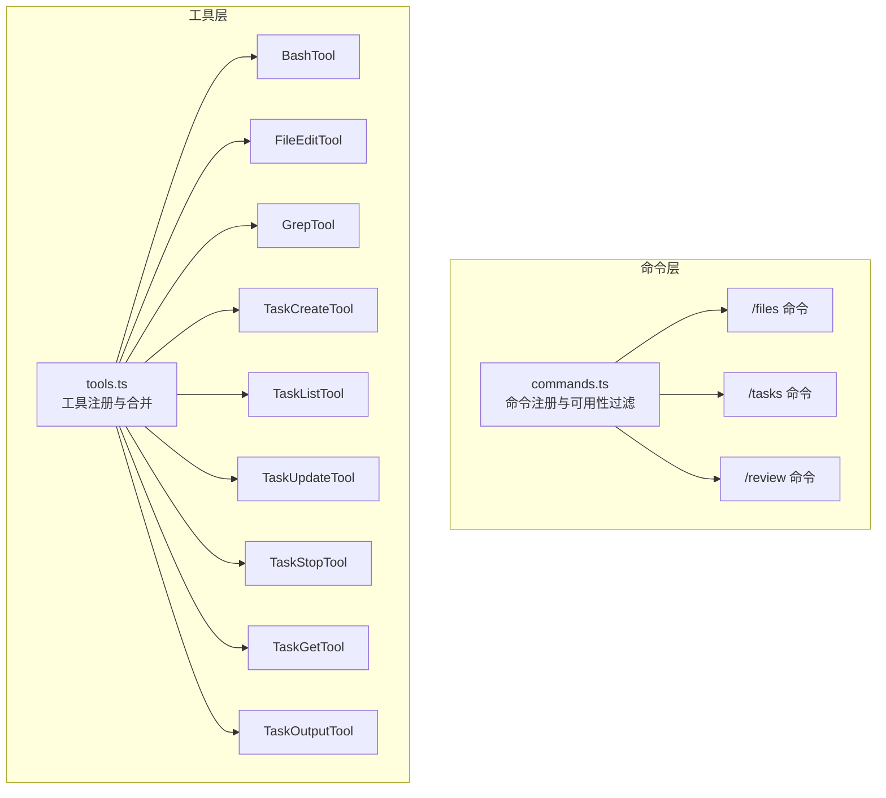
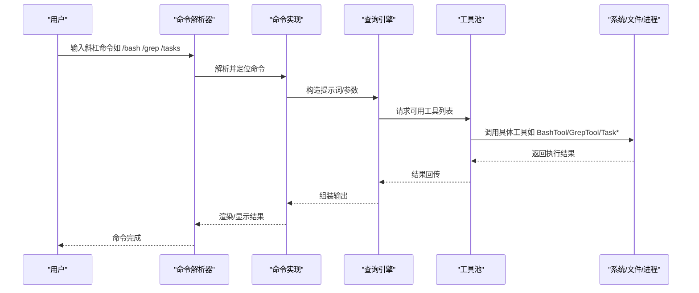
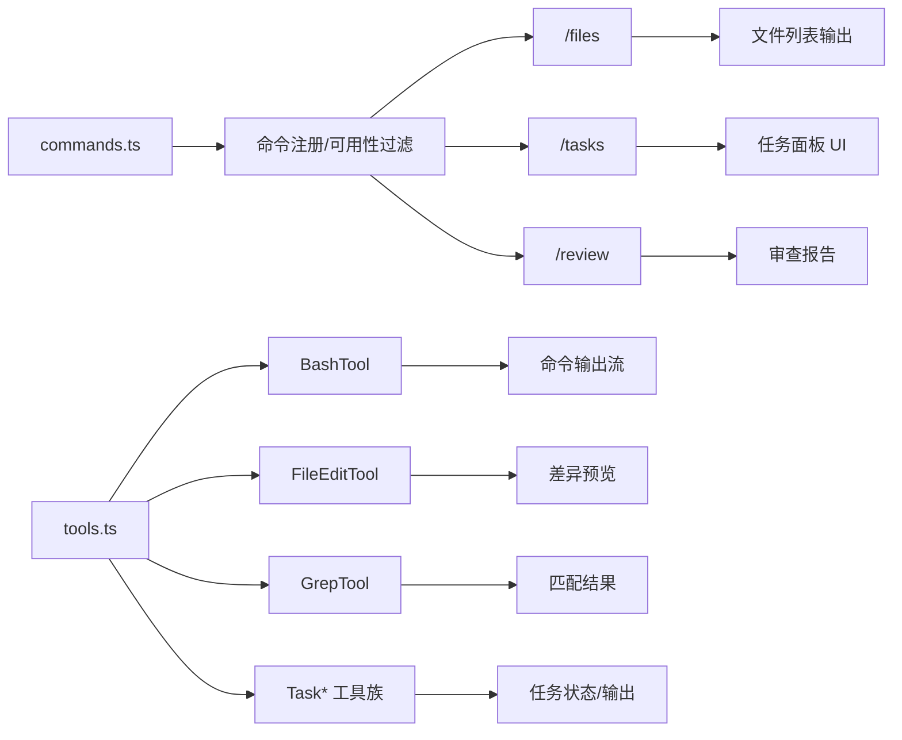

# 使用场景示例

<cite>
**本文引用的文件**
- [README.md](file://README.md)
- [commands.ts](file://src/commands.ts)
- [tools.ts](file://src/tools.ts)
- [commands/files/index.ts](file://src/commands/files/index.ts)
- [commands/tasks/index.ts](file://src/commands/tasks/index.ts)
- [tools/BashTool/BashTool.ts](file://src/tools/BashTool/BashTool.ts)
- [tools/FileEditTool/FileEditTool.ts](file://src/tools/FileEditTool/FileEditTool.ts)
- [tools/GrepTool/GrepTool.ts](file://src/tools/GrepTool/GrepTool.ts)
- [tools/TaskCreateTool/TaskCreateTool.ts](file://src/tools/TaskCreateTool/TaskCreateTool.ts)
- [tools/TaskListTool/TaskListTool.ts](file://src/tools/TaskListTool/TaskListTool.ts)
- [tools/TaskUpdateTool/TaskUpdateTool.ts](file://src/tools/TaskUpdateTool/TaskUpdateTool.ts)
- [tools/TaskStopTool/TaskStopTool.ts](file://src/tools/TaskStopTool/TaskStopTool.ts)
- [tools/TaskGetTool/TaskGetTool.ts](file://src/tools/TaskGetTool/TaskGetTool.ts)
- [tools/TaskOutputTool/TaskOutputTool.ts](file://src/tools/TaskOutputTool/TaskOutputTool.ts)
- [commands/review.js](file://src/commands/review.js)
- [commands/review/reviewRemote.ts](file://src/commands/review/reviewRemote.ts)
- [commands/review/ultrareviewEnabled.ts](file://src/commands/review/ultrareviewEnabled.ts)
</cite>

## 目录
1. [简介](#简介)
2. [项目结构](#项目结构)
3. [核心组件](#核心组件)
4. [架构总览](#架构总览)
5. [详细场景示例](#详细场景示例)
6. [依赖关系分析](#依赖关系分析)
7. [性能与可扩展性](#性能与可扩展性)
8. [故障排查指南](#故障排查指南)
9. [结论](#结论)
10. [附录：常用命令速查](#附录常用命令速查)

## 简介
本文件面向 Claude Code 的使用者，提供真实可复现的使用场景示例，覆盖以下典型工程任务：
- 代码编辑场景（/edit 命令）
- 文件操作场景（/files 命令）
- 命令执行场景（/bash 命令）
- 代码搜索场景（/grep 命令）
- 代码审查场景（/review 命令）
- 任务管理场景（/tasks 命令）

每个场景均给出步骤说明、预期结果与注意事项，并解释如何组合不同工具与命令以完成复杂软件工程任务。同时提供新手入门与进阶用法，帮助你在日常开发工作流中显著提升效率。

## 项目结构
Claude Code 采用“命令系统 + 工具系统”的分层设计：
- 命令系统：用户通过以“/”开头的斜杠命令触发功能，命令注册与可用性由统一入口管理。
- 工具系统：每个可被模型调用或直接执行的原子能力封装为独立工具，如 Bash 执行、文件读写、代码搜索、任务管理等。

图表来源
- [commands.ts:258-346](file://src/commands.ts#L258-L346)
- [tools.ts:193-251](file://src/tools.ts#L193-L251)

章节来源
- [README.md:53-95](file://README.md#L53-L95)
- [commands.ts:258-346](file://src/commands.ts#L258-L346)
- [tools.ts:193-251](file://src/tools.ts#L193-L251)

## 核心组件
- 命令注册与可用性过滤：commands.ts 统一加载内置命令、插件命令、技能命令与动态技能，按权限与特性标志进行过滤与排序。
- 工具注册与合并：tools.ts 汇总内置工具与 MCP 工具，支持模式化筛选（如简单模式、REPL 模式）与去重策略。
- 场景相关的关键命令与工具：
  - /files：列出当前上下文中的受跟踪文件
  - /tasks：以 UI 列表形式查看与管理后台任务
  - /bash：执行任意 shell 命令
  - /grep：基于 ripgrep 的内容搜索
  - /edit：对文件进行局部替换式修改
  - /review：代码审查（含远程与超审查开关）

章节来源
- [commands.ts:258-346](file://src/commands.ts#L258-L346)
- [tools.ts:193-251](file://src/tools.ts#L193-L251)
- [commands/files/index.ts:1-13](file://src/commands/files/index.ts#L1-L13)
- [commands/tasks/index.ts:1-12](file://src/commands/tasks/index.ts#L1-L12)

## 架构总览
下图展示了从命令到工具的调用链路，以及与任务系统的交互：

图表来源
- [commands.ts:476-517](file://src/commands.ts#L476-L517)
- [tools.ts:345-389](file://src/tools.ts#L345-L389)

## 详细场景示例

### 场景一：代码编辑场景（/edit 命令）
适用目标：需要对单个或多个文件进行局部修改、重构片段、修复小缺陷等。

- 典型步骤
  1) 选择要编辑的文件路径（可通过 /files 或 IDE 集成获取）
  2) 在聊天中输入“/edit”，并附带目标文件路径与替换规则（如“将 X 替换为 Y”）
  3) Claude Code 将自动读取文件内容，生成最小变更集，确认后执行写入
  4) 查看差异预览，必要时回滚或微调

- 预期结果
  - 文件被安全地部分修改，保留其余内容不变
  - 变更以结构化差异呈现，便于审阅
  - 失败时返回错误信息与可能的修复建议

- 注意事项
  - 对大文件或二进制文件不建议使用 /edit，请改用 /bash 或 /files 辅助定位
  - 修改前建议先用 /grep 检索相关上下文，避免误改
  - 若涉及多文件联动，优先拆分为多次小范围修改，降低冲突风险

- 相关工具
  - FileEditTool：负责局部替换与写入
  - FileReadTool：读取文件内容
  - FileWriteTool：创建/覆盖文件（用于备份或导出）

章节来源
- [tools/FileEditTool/FileEditTool.ts](file://src/tools/FileEditTool/FileEditTool.ts)

### 场景二：文件操作场景（/files 命令）
适用目标：快速了解当前会话跟踪了哪些文件，辅助上下文压缩与审查。

- 典型步骤
  1) 在终端输入“/files”
  2) 查看输出的文件清单（含路径、大小、最近修改时间等元信息）
  3) 可结合 /grep 进一步筛选特定文件或内容

- 预期结果
  - 列表清晰展示当前上下文中的受跟踪文件
  - 支持非交互模式输出，便于脚本化处理

- 注意事项
  - 仅在特定用户类型可见（由命令定义启用条件控制）
  - 若文件过多导致上下文膨胀，可考虑使用 /compact 或 /context 进行压缩

- 相关命令
  - /files：列出受跟踪文件
  - /context：可视化上下文
  - /compact：压缩上下文

章节来源
- [commands/files/index.ts:1-13](file://src/commands/files/index.ts#L1-L13)
- [commands.ts:651-660](file://src/commands.ts#L651-L660)

### 场景三：命令执行场景（/bash 命令）
适用目标：运行构建脚本、测试套件、环境诊断、安装依赖等。

- 典型步骤
  1) 输入“/bash”并附带命令（如“npm test”、“find . -name '*.ts' | wc -l”）
  2) 观察实时输出流（支持长耗时任务）
  3) 失败时根据错误信息调整命令或参数

- 预期结果
  - 命令在本地 shell 中执行，输出流式返回
  - 支持权限与安全策略检查（需用户授权）

- 注意事项
  - 避免执行高危命令（如 rm -rf、格式化磁盘）
  - 大量输出时可配合管道与分页工具（如 less、head）减少阻塞
  - 与任务系统结合：将长时间任务转交后台（见“任务管理场景”）

- 相关工具
  - BashTool：执行 shell 命令
  - TaskCreateTool：创建后台任务
  - TaskListTool：查看任务状态
  - TaskStopTool：停止任务
  - TaskOutputTool：获取任务输出

章节来源
- [tools/BashTool/BashTool.ts](file://src/tools/BashTool/BashTool.ts)
- [tools/TaskCreateTool/TaskCreateTool.ts](file://src/tools/TaskCreateTool/TaskCreateTool.ts)
- [tools/TaskListTool/TaskListTool.ts](file://src/tools/TaskListTool/TaskListTool.ts)
- [tools/TaskStopTool/TaskStopTool.ts](file://src/tools/TaskStopTool/TaskStopTool.ts)
- [tools/TaskOutputTool/TaskOutputTool.ts](file://src/tools/TaskOutputTool/TaskOutputTool.ts)

### 场景四：代码搜索场景（/grep 命令）
适用目标：在代码库中查找特定字符串、函数签名、配置项等。

- 典型步骤
  1) 输入“/grep”并附带搜索模式（如正则表达式或关键词）
  2) 指定文件过滤（如只在 src/ 下搜索）
  3) 查看匹配结果列表与上下文片段

- 预期结果
  - 快速定位所有匹配位置
  - 展示上下文行数，便于判断是否为目标

- 注意事项
  - 使用 ripgrep，性能优异；合理设置忽略目录（如 node_modules、.git）
  - 大型仓库建议配合文件过滤与限定目录，避免全盘扫描

- 相关工具
  - GrepTool：基于 ripgrep 的搜索工具
  - GlobTool：文件模式匹配（辅助缩小搜索范围）

章节来源
- [tools/GrepTool/GrepTool.ts](file://src/tools/GrepTool/GrepTool.ts)

### 场景五：代码审查场景（/review 命令）
适用目标：对新增或修改的代码进行质量与风格审查，识别潜在问题。

- 典型步骤
  1) 准备好待审查的变更（通常来自本地分支或暂存区）
  2) 输入“/review”，附上审查目标（如新增模块、重构区域）
  3) 等待审查报告，关注安全性、可维护性、性能与一致性建议

- 预期结果
  - 输出结构化的审查意见与改进建议
  - 可选开启“超审查”模式以获得更深入的分析

- 注意事项
  - 审查质量取决于上下文与提示词；尽量提供背景说明
  - 对于远程协作，可结合远程审查能力使用

- 相关命令与开关
  - /review：主审查命令
  - ultrareviewEnabled：超审查开关
  - reviewRemote：远程审查能力

章节来源
- [commands/review.js](file://src/commands/review.js)
- [commands/review/ultrareviewEnabled.ts](file://src/commands/review/ultrareviewEnabled.ts)
- [commands/review/reviewRemote.ts](file://src/commands/review/reviewRemote.ts)

### 场景六：任务管理场景（/tasks 命令）
适用目标：查看、启动、停止与追踪后台任务，提升长时间操作的可控性。

- 典型步骤
  1) 输入“/tasks”打开任务面板
  2) 创建任务：使用“/bash”并将耗时操作放入后台（或直接使用 TaskCreateTool）
  3) 查看任务状态：通过 TaskListTool 获取列表
  4) 停止或获取输出：TaskStopTool/TaskOutputTool

- 预期结果
  - 任务列表清晰展示名称、状态、进度与输出链接
  - 可随时中断失败或卡住的任务

- 注意事项
  - 合理命名任务，便于后续检索
  - 对关键任务建议记录输出以便复盘

- 相关工具
  - TaskCreateTool：创建任务
  - TaskListTool：列出任务
  - TaskUpdateTool：更新任务状态/描述
  - TaskGetTool：获取任务详情
  - TaskStopTool：停止任务
  - TaskOutputTool：获取任务输出

章节来源
- [commands/tasks/index.ts:1-12](file://src/commands/tasks/index.ts#L1-L12)
- [tools/TaskCreateTool/TaskCreateTool.ts](file://src/tools/TaskCreateTool/TaskCreateTool.ts)
- [tools/TaskListTool/TaskListTool.ts](file://src/tools/TaskListTool/TaskListTool.ts)
- [tools/TaskUpdateTool/TaskUpdateTool.ts](file://src/tools/TaskUpdateTool/TaskUpdateTool.ts)
- [tools/TaskGetTool/TaskGetTool.ts](file://src/tools/TaskGetTool/TaskGetTool.ts)
- [tools/TaskStopTool/TaskStopTool.ts](file://src/tools/TaskStopTool/TaskStopTool.ts)
- [tools/TaskOutputTool/TaskOutputTool.ts](file://src/tools/TaskOutputTool/TaskOutputTool.ts)

## 依赖关系分析
- 命令到工具的依赖
  - commands.ts 负责命令注册与可用性过滤，tools.ts 负责工具注册与合并
  - 查询引擎在运行时向工具池请求可用工具，工具池根据权限与特性标志返回集合
- 任务系统与工具的耦合
  - 任务相关的工具（Task*）与 BashTool 协同，支持后台执行与状态追踪
- 命令到 UI 的映射
  - /tasks 为 JSX 类型命令，通过 UI 组件渲染任务面板；/files 为本地命令，适合非交互输出

图表来源
- [commands.ts:258-346](file://src/commands.ts#L258-L346)
- [tools.ts:193-251](file://src/tools.ts#L193-L251)

章节来源
- [commands.ts:258-346](file://src/commands.ts#L258-L346)
- [tools.ts:193-251](file://src/tools.ts#L193-L251)

## 性能与可扩展性
- 并行加载与懒加载
  - 命令与工具采用懒加载与并行预取，缩短启动与响应延迟
- 工具选择与缓存
  - 工具池按权限与特性标志动态裁剪，避免不必要的工具参与
- 任务与后台执行
  - 将耗时操作转为后台任务，避免阻塞交互体验
- 搜索优化
  - 使用 ripgrep 进行高效内容搜索，建议配合文件过滤与忽略目录

[本节为通用指导，无需特定文件来源]

## 故障排查指南
- 命令不可用
  - 检查命令可用性与特性标志（如 /files 的启用条件），确认当前用户类型与环境变量
- 权限拒绝
  - 某些工具需要用户授权；若被拒绝，可在权限设置中调整策略
- 输出过大导致卡顿
  - 使用 /grep 的文件过滤或分页工具，或将大任务转为后台任务
- 任务异常
  - 使用 TaskListTool 查看状态，TaskStopTool 停止异常任务，TaskOutputTool 获取输出日志

章节来源
- [commands.ts:417-443](file://src/commands.ts#L417-L443)
- [tools.ts:262-269](file://src/tools.ts#L262-L269)

## 结论
通过将命令系统与工具系统有机结合，Claude Code 能够覆盖从文件浏览、代码编辑、命令执行、内容搜索到代码审查与任务管理的完整开发闭环。新手可从简单的 /files 与 /bash 开始，逐步掌握 /edit、/grep 与 /tasks；高级用户可借助 /review 与任务系统完成复杂工程任务的自动化与可视化管理。建议在团队内制定统一的提示词模板与任务命名规范，持续沉淀最佳实践。

[本节为总结性内容，无需特定文件来源]

## 附录：常用命令速查
- /files：列出当前上下文中的受跟踪文件
- /tasks：打开任务面板，查看与管理后台任务
- /bash：执行 shell 命令（支持长输出流）
- /grep：基于 ripgrep 的内容搜索
- /edit：对文件进行局部替换式修改
- /review：代码审查（可选开启超审查与远程审查）

章节来源
- [commands/files/index.ts:1-13](file://src/commands/files/index.ts#L1-L13)
- [commands/tasks/index.ts:1-12](file://src/commands/tasks/index.ts#L1-L12)
- [tools/BashTool/BashTool.ts](file://src/tools/BashTool/BashTool.ts)
- [tools/GrepTool/GrepTool.ts](file://src/tools/GrepTool/GrepTool.ts)
- [tools/FileEditTool/FileEditTool.ts](file://src/tools/FileEditTool/FileEditTool.ts)
- [commands/review.js](file://src/commands/review.js)