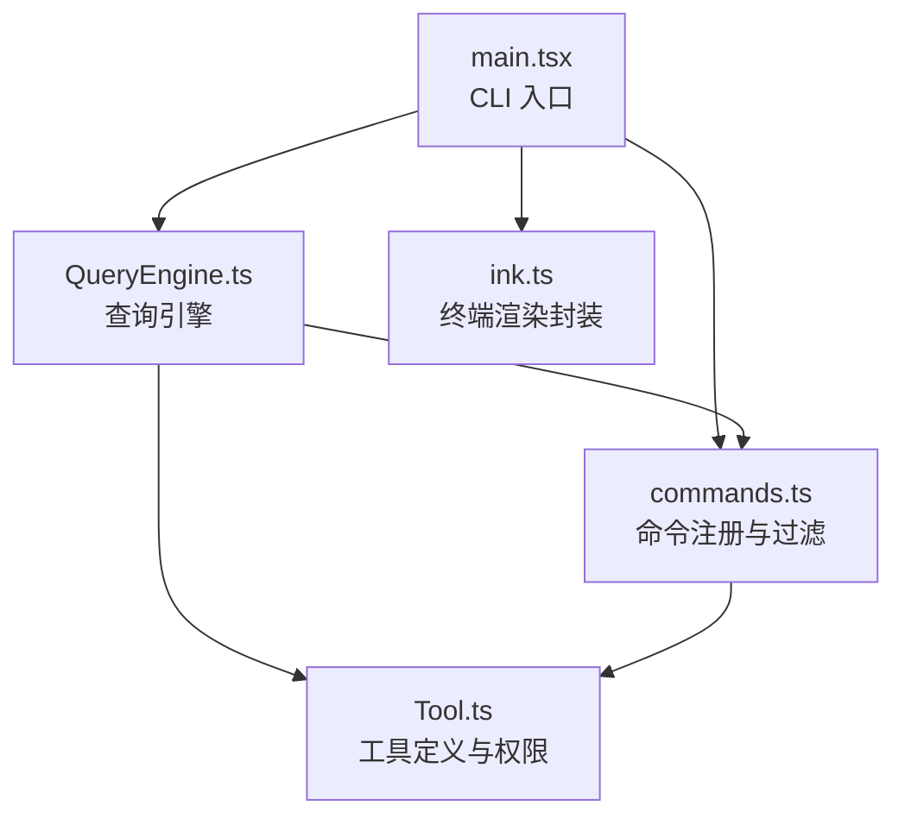
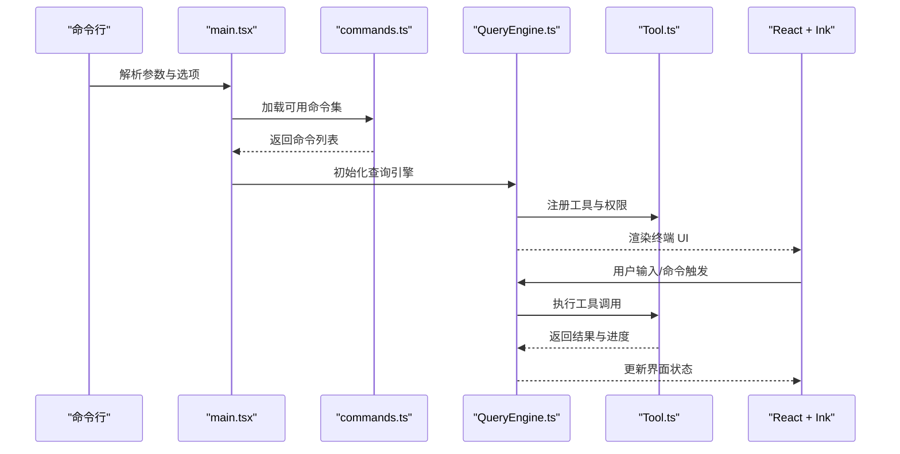
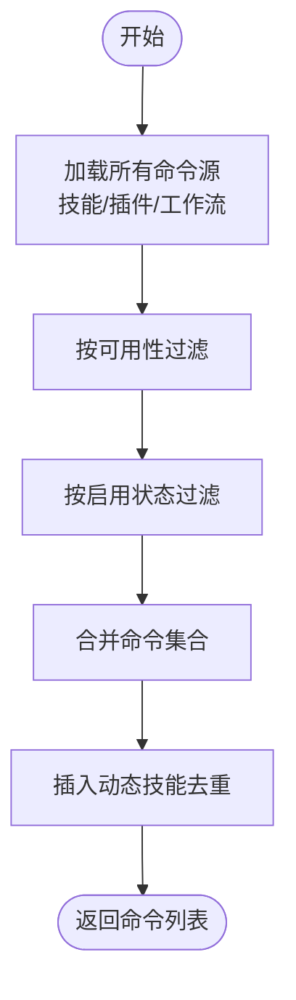
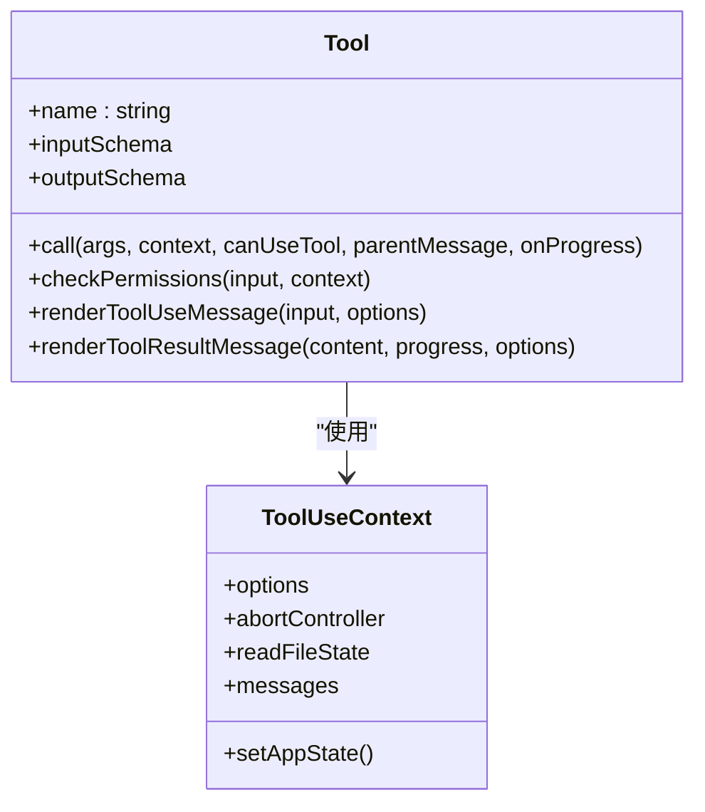
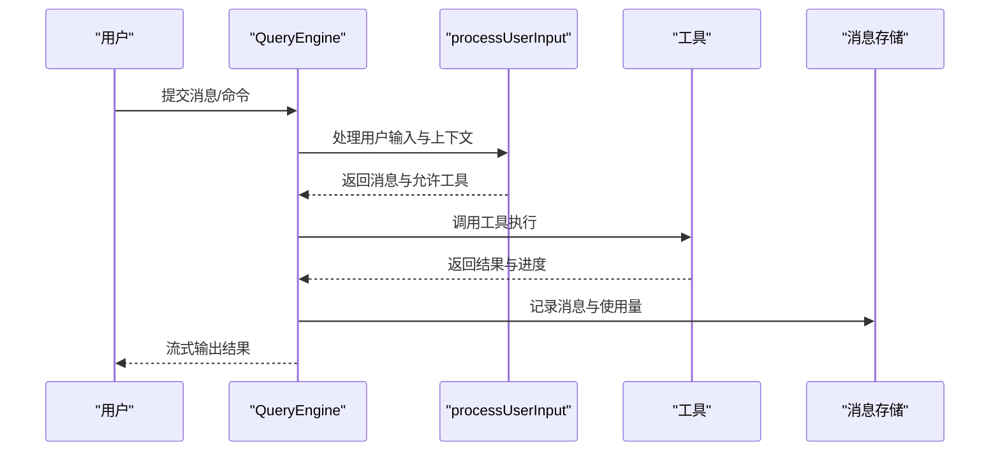
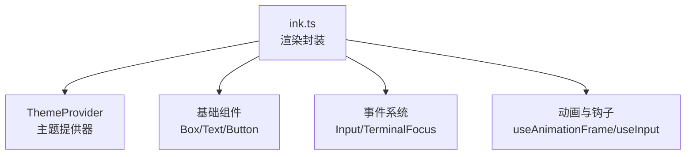
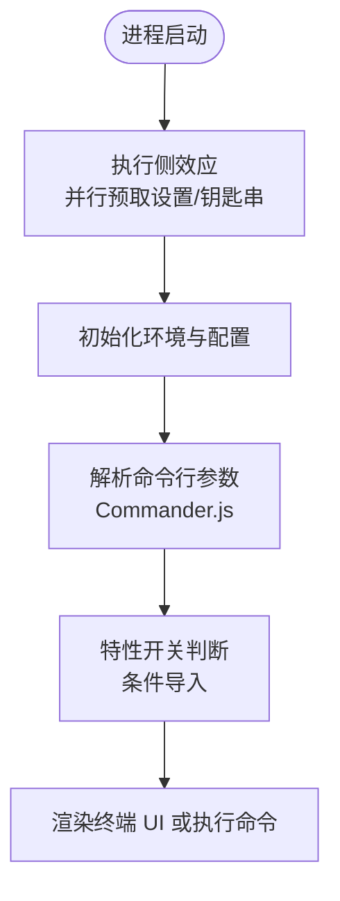
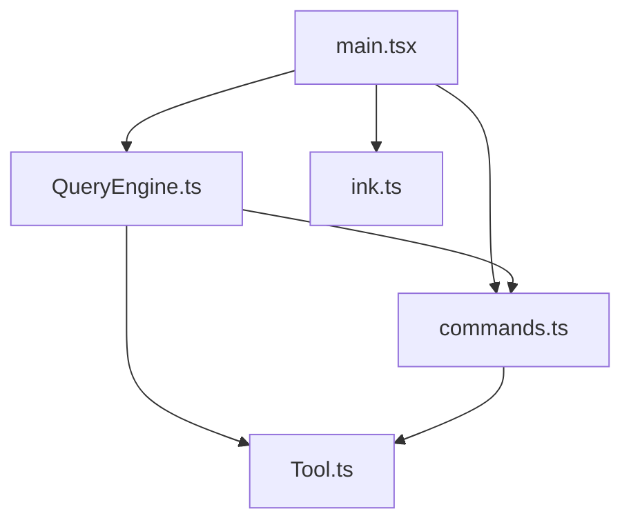

# 技术栈概览

<cite>
**本文档引用的文件**
- [README.md](file://README.md)
- [main.tsx](file://src/main.tsx)
- [commands.ts](file://src/commands.ts)
- [Tool.ts](file://src/Tool.ts)
- [QueryEngine.ts](file://src/QueryEngine.ts)
- [ink.ts](file://src/ink.ts)
</cite>

## 目录
1. [简介](#简介)
2. [项目结构](#项目结构)
3. [核心组件](#核心组件)
4. [架构总览](#架构总览)
5. [详细组件分析](#详细组件分析)
6. [依赖关系分析](#依赖关系分析)
7. [性能考量](#性能考量)
8. [故障排查指南](#故障排查指南)
9. [结论](#结论)

## 简介
本项目是一个大型终端交互式开发者代理系统，支持命令行交互、终端 UI、多模型工具调用与多代理协作。项目采用 Bun 运行时、TypeScript 严格模式、React + Ink 终端 UI 框架、Commander.js 命令行解析、Zod 类型验证等核心技术组合，支撑起约 1900+ 文件、512000+ 行代码的复杂系统。

技术栈选择基于以下考虑：
- 启动速度与运行效率：Bun 提供极快的启动与执行性能，适合 CLI 工具链场景
- 类型安全与可维护性：TypeScript 严格模式确保大规模代码库的稳定性
- 终端 UI 体验：React + Ink 提供现代化、可组合的终端界面
- 命令行解析：Commander.js 提供强大而灵活的 CLI 能力
- 类型验证：Zod 提供运行时类型校验与编译时类型推导
- 可扩展性：模块化设计、动态导入、特性开关与插件体系

## 项目结构
项目采用按功能域分层的组织方式：
- 入口与 CLI：main.tsx 作为主入口，使用 Commander.js 解析命令行参数
- 命令系统：commands.ts 统一注册与管理所有 slash 命令，支持条件加载与远程模式过滤
- 工具系统：Tool.ts 定义统一的工具抽象与权限模型，配合 Zod 输入校验
- 查询引擎：QueryEngine.ts 实现对话循环、工具调用与消息管理
- 终端 UI：ink.ts 封装 Ink 渲染器，提供主题与组件能力
- 配置与验证：README.md 中列出的 Zod 配置模式用于系统配置校验

**图表来源**
- [main.tsx](file://src/main.tsx)
- [commands.ts](file://src/commands.ts)
- [Tool.ts](file://src/Tool.ts)
- [QueryEngine.ts](file://src/QueryEngine.ts)
- [ink.ts](file://src/ink.ts)

**章节来源**
- [README.md](file://README.md)
- [main.tsx](file://src/main.tsx)
- [commands.ts](file://src/commands.ts)
- [Tool.ts](file://src/Tool.ts)
- [QueryEngine.ts](file://src/QueryEngine.ts)
- [ink.ts](file://src/ink.ts)

## 核心组件
- Bun 运行时：提供快速启动、模块加载与原生性能，适配 CLI 工具链
- TypeScript 严格模式：通过严格的类型检查保障大型代码库的可维护性
- React + Ink：构建终端 UI，提供组件化与主题化能力
- Commander.js：命令行参数解析与子命令注册，支持帮助排序与位置参数
- Zod：配置与输入验证，确保运行时数据一致性
- 动态导入与特性开关：通过 Bun 的特性开关与动态 import 实现按需加载与死代码消除
- 插件与技能系统：支持内置与第三方插件，以及用户自定义技能工作流

**章节来源**
- [README.md](file://README.md)
- [main.tsx](file://src/main.tsx)
- [commands.ts](file://src/commands.ts)
- [Tool.ts](file://src/Tool.ts)
- [QueryEngine.ts](file://src/QueryEngine.ts)
- [ink.ts](file://src/ink.ts)

## 架构总览
系统采用“命令驱动 + 工具执行 + 终端 UI”的三层架构：
- CLI 层：通过 Commander.js 解析命令，初始化环境与配置
- 逻辑层：QueryEngine 负责对话循环、消息管理与工具调度；Tool.ts 定义工具接口与权限模型
- 表现层：React + Ink 提供终端 UI，ink.ts 封装渲染与主题

**图表来源**
- [main.tsx](file://src/main.tsx)
- [commands.ts](file://src/commands.ts)
- [QueryEngine.ts](file://src/QueryEngine.ts)
- [Tool.ts](file://src/Tool.ts)
- [ink.ts](file://src/ink.ts)

## 详细组件分析

### CLI 与命令系统
- 命令注册：commands.ts 统一管理内置命令、技能、插件与工作流命令，并支持条件加载与可用性过滤
- 远程模式：提供 REMOTE_SAFE_COMMANDS 与 BRIDGE_SAFE_COMMANDS，确保远程控制桥接的安全性
- 动态加载：通过 memoize 缓存与 Promise.all 并行加载，提升命令发现与技能加载性能

**图表来源**
- [commands.ts](file://src/commands.ts)

**章节来源**
- [commands.ts](file://src/commands.ts)

### 工具系统与权限模型
- 工具抽象：Tool.ts 定义工具的输入输出模式、权限检查、并发安全与 UI 渲染接口
- 权限系统：通过 ToolPermissionContext 与 checkPermissions 实现细粒度权限控制
- 输入校验：结合 Zod 与工具内 inputSchema，确保输入合法性与安全性

**图表来源**
- [Tool.ts](file://src/Tool.ts)

**章节来源**
- [Tool.ts](file://src/Tool.ts)

### 查询引擎与对话循环
- 查询引擎：QueryEngine.ts 实现消息管理、工具调用循环、权限拒绝追踪与会话持久化
- 流式处理：支持异步生成器模式，逐步产出消息与进度事件
- 结构化输出：通过合成输出工具与 JSON Schema 强制结构化响应

**图表来源**
- [QueryEngine.ts](file://src/QueryEngine.ts)
- [Tool.ts](file://src/Tool.ts)

**章节来源**
- [QueryEngine.ts](file://src/QueryEngine.ts)

### 终端 UI 与渲染
- 渲染封装：ink.ts 对 Ink 渲染器进行封装，统一注入主题提供器
- 组件体系：提供 Box、Text、Button 等基础组件与主题化能力
- 性能优化：通过动态导入与懒加载减少初始渲染负担

**图表来源**
- [ink.ts](file://src/ink.ts)

**章节来源**
- [ink.ts](file://src/ink.ts)

### 命令行解析与入口初始化
- 入口初始化：main.tsx 在顶部执行侧效应以并行预取 MDM 设置、钥匙串读取与 API 预连接
- 特性开关：通过 Bun 的 feature 标记实现死代码消除与条件导入
- 深度链接与远程控制：支持 cc:// 协议与直接连接模式，提供交互式与非交互式两种路径

**图表来源**
- [main.tsx](file://src/main.tsx)

**章节来源**
- [main.tsx](file://src/main.tsx)

## 依赖关系分析
- 模块耦合：命令系统与工具系统强关联，查询引擎同时依赖两者
- 动态依赖：通过动态 import 与特性开关降低模块间耦合度
- 外部依赖：Commander.js、Zod、React、Ink 等作为核心外部库

**图表来源**
- [main.tsx](file://src/main.tsx)
- [commands.ts](file://src/commands.ts)
- [Tool.ts](file://src/Tool.ts)
- [QueryEngine.ts](file://src/QueryEngine.ts)
- [ink.ts](file://src/ink.ts)

**章节来源**
- [main.tsx](file://src/main.tsx)
- [commands.ts](file://src/commands.ts)
- [Tool.ts](file://src/Tool.ts)
- [QueryEngine.ts](file://src/QueryEngine.ts)
- [ink.ts](file://src/ink.ts)

## 性能考量
- 并行预取：在入口处并行执行 MDM 设置读取与钥匙串预取，缩短关键路径等待时间
- 延迟加载：将重型模块（如分析、遥测、某些特性子系统）通过动态 import 延迟到实际需要
- 死代码消除：利用 Bun 的特性开关在构建期剔除未使用的代码分支
- 会话持久化：在关键节点进行会话记录与刷新，平衡用户体验与性能开销

**章节来源**
- [main.tsx](file://src/main.tsx)
- [README.md](file://README.md)

## 故障排查指南
- 启动阶段：若检测到调试或检查模式，入口会直接退出，避免在调试状态下继续执行
- 权限问题：工具调用前会进行权限检查，失败时记录拒绝信息以便诊断
- 会话恢复：当进程在首次响应前被中断，仍可通过已记录的用户消息进行恢复

**章节来源**
- [main.tsx](file://src/main.tsx)
- [Tool.ts](file://src/Tool.ts)
- [QueryEngine.ts](file://src/QueryEngine.ts)

## 结论
该技术栈通过 Bun 的高性能运行时、TypeScript 的严格类型系统、React + Ink 的终端 UI 能力、Commander.js 的命令行解析与 Zod 的类型验证，共同支撑起一个可扩展、可维护且高性能的终端开发者代理系统。面对 1900+ 文件与 512000+ 行代码的体量，项目通过并行预取、延迟加载、死代码消除与模块化设计有效控制了复杂度与启动时间，满足 CLI 场景下的性能与体验要求。