# 架构设计理念

<cite>
**本文引用的文件**
- [src/state/AppStateStore.ts](file://src/state/AppStateStore.ts)
- [src/state/store.ts](file://src/state/store.ts)
- [src/state/onChangeAppState.ts](file://src/state/onChangeAppState.ts)
- [src/Tool.ts](file://src/Tool.ts)
- [src/commands.ts](file://src/commands.ts)
- [src/bootstrap/state.ts](file://src/bootstrap/state.ts)
- [src/main.tsx](file://src/main.tsx)
- [src/utils/hooks/hookEvents.ts](file://src/utils/hooks/hookEvents.ts)
- [src/utils/signal.ts](file://src/utils/signal.ts)
- [src/bridge/replBridge.ts](file://src/bridge/replBridge.ts)
- [src/cli/remoteIO.ts](file://src/cli/remoteIO.ts)
- [src/cli/transports/SSETransport.ts](file://src/cli/transports/SSETransport.ts)
</cite>

## 目录
1. [引言](#引言)
2. [项目结构](#项目结构)
3. [核心组件](#核心组件)
4. [架构总览](#架构总览)
5. [详细组件分析](#详细组件分析)
6. [依赖关系分析](#依赖关系分析)
7. [性能考虑](#性能考虑)
8. [故障排查指南](#故障排查指南)
9. [结论](#结论)

## 引言
本文件面向 Claude Code 项目的架构设计理念进行深入剖析，围绕模块化架构、组件化设计与多种设计模式的实际应用展开，重点覆盖并行预取（Parallel Prefetch）、延迟加载（Lazy Loading）、观察者模式、策略模式、装饰器模式等。同时，系统性阐述状态管理机制（AppStateStore）、工具系统架构（Tool 基类）、命令系统设计（commands.ts）等关键架构组件，并结合实际代码路径给出可视化图示，帮助开发者快速理解整体设计思路与实现原理。

## 项目结构
项目采用“按功能域分层 + 按职责划分模块”的组织方式：
- state：集中式状态管理与变更钩子
- tools：工具系统基类与工具集合
- commands：命令体系与动态加载
- bootstrap：启动期全局状态与度量
- bridge/cli：远程桥接与传输层
- utils：通用工具与事件系统（信号、钩子）

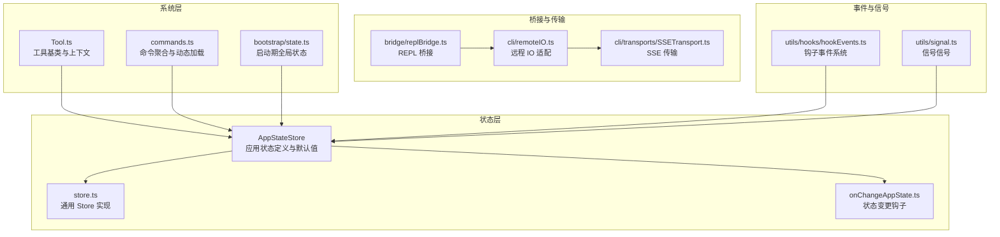

**图表来源**
- [src/state/AppStateStore.ts:89-452](file://src/state/AppStateStore.ts#L89-L452)
- [src/state/store.ts:4-34](file://src/state/store.ts#L4-L34)
- [src/state/onChangeAppState.ts:43-92](file://src/state/onChangeAppState.ts#L43-L92)
- [src/Tool.ts:158-300](file://src/Tool.ts#L158-L300)
- [src/commands.ts:258-346](file://src/commands.ts#L258-L346)
- [src/bootstrap/state.ts:45-257](file://src/bootstrap/state.ts#L45-L257)
- [src/bridge/replBridge.ts:788-876](file://src/bridge/replBridge.ts#L788-L876)
- [src/cli/remoteIO.ts:221-255](file://src/cli/remoteIO.ts#L221-L255)
- [src/cli/transports/SSETransport.ts:122-147](file://src/cli/transports/SSETransport.ts#L122-L147)
- [src/utils/hooks/hookEvents.ts:57-91](file://src/utils/hooks/hookEvents.ts#L57-L91)
- [src/utils/signal.ts:27-43](file://src/utils/signal.ts#L27-L43)

**章节来源**
- [src/state/AppStateStore.ts:89-452](file://src/state/AppStateStore.ts#L89-L452)
- [src/state/store.ts:4-34](file://src/state/store.ts#L4-L34)
- [src/state/onChangeAppState.ts:43-92](file://src/state/onChangeAppState.ts#L43-L92)
- [src/Tool.ts:158-300](file://src/Tool.ts#L158-L300)
- [src/commands.ts:258-346](file://src/commands.ts#L258-L346)
- [src/bootstrap/state.ts:45-257](file://src/bootstrap/state.ts#L45-L257)
- [src/bridge/replBridge.ts:788-876](file://src/bridge/replBridge.ts#L788-L876)
- [src/cli/remoteIO.ts:221-255](file://src/cli/remoteIO.ts#L221-L255)
- [src/cli/transports/SSETransport.ts:122-147](file://src/cli/transports/SSETransport.ts#L122-L147)
- [src/utils/hooks/hookEvents.ts:57-91](file://src/utils/hooks/hookEvents.ts#L57-L91)
- [src/utils/signal.ts:27-43](file://src/utils/signal.ts#L27-L43)

## 核心组件
- 应用状态中心（AppStateStore）
  - 定义了完整的应用状态结构，包含设置、任务、插件、通知、权限上下文、提示词建议、推测状态等。
  - 提供默认状态工厂函数，确保启动一致性。
- 状态存储（Store）
  - 轻量级通用 Store，支持订阅与变更回调，避免重复渲染与副作用扩散。
- 状态变更钩子（onChangeAppState）
  - 在状态变化时同步外部元数据（如权限模式、会话信息），并持久化部分用户偏好。
- 工具系统（Tool 基类）
  - 统一的工具接口、输入输出模式、并发安全、权限校验、进度渲染、结果展示等能力。
- 命令系统（commands.ts）
  - 动态聚合内置命令、技能、插件命令与工作流命令；支持可用性过滤、启用状态检查、远程安全命令白名单。
- 启动期全局状态（bootstrap/state）
  - 记录会话标识、统计计数、模型用量、交互时间、慢操作追踪等，贯穿整个生命周期。
- 钩子事件系统（hookEvents）
  - 低噪声事件广播，支持“总是发出”与“按需开启”的两类事件，配合信号机制。
- 信号（signal）
  - 无状态事件信号，用于跨模块松耦合通知。

**章节来源**
- [src/state/AppStateStore.ts:89-452](file://src/state/AppStateStore.ts#L89-L452)
- [src/state/store.ts:4-34](file://src/state/store.ts#L4-L34)
- [src/state/onChangeAppState.ts:43-92](file://src/state/onChangeAppState.ts#L43-L92)
- [src/Tool.ts:158-300](file://src/Tool.ts#L158-L300)
- [src/commands.ts:258-346](file://src/commands.ts#L258-L346)
- [src/bootstrap/state.ts:45-257](file://src/bootstrap/state.ts#L45-L257)
- [src/utils/hooks/hookEvents.ts:57-91](file://src/utils/hooks/hookEvents.ts#L57-L91)
- [src/utils/signal.ts:27-43](file://src/utils/signal.ts#L27-L43)

## 架构总览
系统采用“状态驱动 + 松耦合事件 + 可插拔工具/命令”的架构风格：
- 状态驱动：AppStateStore 作为单一真相源，通过 Store 的 setState 与 onChange 钩子协调 UI、桥接与后台任务。
- 松耦合事件：信号与钩子事件系统解耦模块间通信，避免循环依赖与强耦合。
- 可插拔扩展：Tool 与 Command 以统一接口抽象，支持动态加载与策略切换。
- 远程桥接：REPL 桥接与 SSE 传输层保证远程模式下的消息可靠与有序。

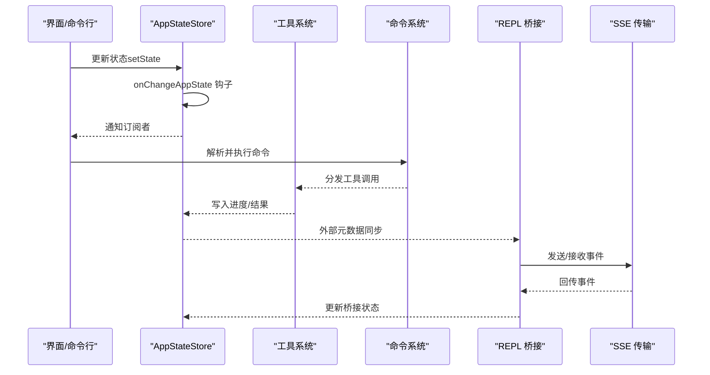

**图表来源**
- [src/state/AppStateStore.ts:89-452](file://src/state/AppStateStore.ts#L89-L452)
- [src/state/onChangeAppState.ts:43-92](file://src/state/onChangeAppState.ts#L43-L92)
- [src/Tool.ts:158-300](file://src/Tool.ts#L158-L300)
- [src/commands.ts:258-346](file://src/commands.ts#L258-L346)
- [src/bridge/replBridge.ts:788-876](file://src/bridge/replBridge.ts#L788-L876)
- [src/cli/transports/SSETransport.ts:122-147](file://src/cli/transports/SSETransport.ts#L122-L147)

## 详细组件分析

### 并行预取（Parallel Prefetch）与延迟加载（Lazy Loading）
- 并行预取
  - 在主入口完成关键导入后，启动 MDM 与钥匙串预取，减少后续初始化阻塞。
  - 启动完成后，延迟执行非关键后台任务（用户上下文、系统上下文、提示、认证凭据、模型能力、变更检测器等），避免抢占首屏渲染。
- 延迟加载
  - 命令系统对重型模块（如“洞察报告”）采用懒加载封装，仅在真正触发时才动态导入。
  - 技能与插件命令加载使用缓存与并行加载策略，降低冷启动成本。

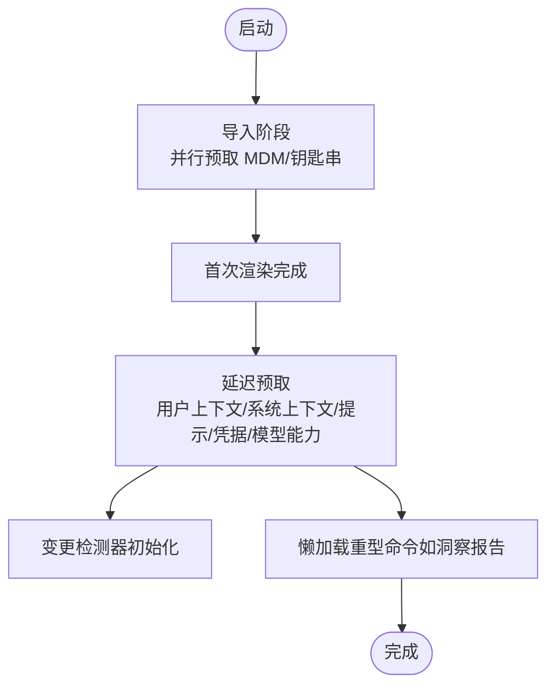

**图表来源**
- [src/main.tsx:11-21](file://src/main.tsx#L11-L21)
- [src/main.tsx:388-431](file://src/main.tsx#L388-L431)
- [src/commands.ts:188-202](file://src/commands.ts#L188-L202)

**章节来源**
- [src/main.tsx:11-21](file://src/main.tsx#L11-L21)
- [src/main.tsx:388-431](file://src/main.tsx#L388-L431)
- [src/commands.ts:188-202](file://src/commands.ts#L188-L202)

### 观察者模式与事件系统
- 信号（Signal）
  - 无状态事件信号，适合一次性通知场景，避免携带状态导致的耦合。
- 钩子事件（Hook Events）
  - 事件类型包括 started、progress、response，支持“总是发出”与“按需开启”，并带有限队列与日志记录。
- 状态变更钩子（onChangeAppState）
  - 在状态变化时同步外部元数据（如权限模式、会话元数据），并通过信号通知订阅者。

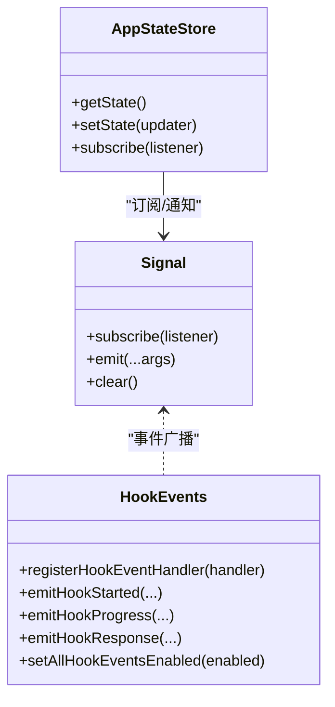

**图表来源**
- [src/utils/signal.ts:27-43](file://src/utils/signal.ts#L27-L43)
- [src/utils/hooks/hookEvents.ts:57-91](file://src/utils/hooks/hookEvents.ts#L57-L91)
- [src/state/AppStateStore.ts:89-452](file://src/state/AppStateStore.ts#L89-L452)

**章节来源**
- [src/utils/signal.ts:27-43](file://src/utils/signal.ts#L27-L43)
- [src/utils/hooks/hookEvents.ts:57-91](file://src/utils/hooks/hookEvents.ts#L57-L91)
- [src/state/onChangeAppState.ts:43-92](file://src/state/onChangeAppState.ts#L43-L92)

### 策略模式（策略化命令与工具）
- 命令系统
  - 通过条件导入与可用性过滤，动态选择不同策略（如助手模式、语音模式、远程控制等），并在运行时根据特性开关切换。
  - 支持“本地命令”“提示型命令”“本地 JSX 命令”三类策略，分别处理不同执行环境与安全边界。
- 工具系统
  - 工具接口统一，不同工具以“策略”形式注册，支持并发安全判定、只读/破坏性标记、权限校验策略、输入验证策略等。

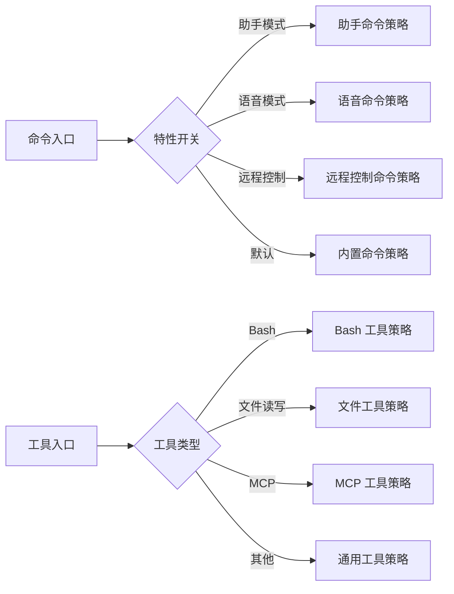

**图表来源**
- [src/commands.ts:47-123](file://src/commands.ts#L47-L123)
- [src/commands.ts:619-676](file://src/commands.ts#L619-L676)
- [src/Tool.ts:362-473](file://src/Tool.ts#L362-L473)

**章节来源**
- [src/commands.ts:47-123](file://src/commands.ts#L47-L123)
- [src/commands.ts:619-676](file://src/commands.ts#L619-L676)
- [src/Tool.ts:362-473](file://src/Tool.ts#L362-L473)

### 装饰器模式（工具包装与 UI 渲染）
- 工具装饰
  - 工具可通过“透明包装器”模式，将内部工具调用的渲染委托给外层进度处理器，实现“无侵入”的 UI 包装与展示。
- 结果渲染装饰
  - 工具支持自定义结果消息渲染、进度消息渲染、拒绝/错误消息渲染，形成“装饰链”以增强用户体验与可读性。

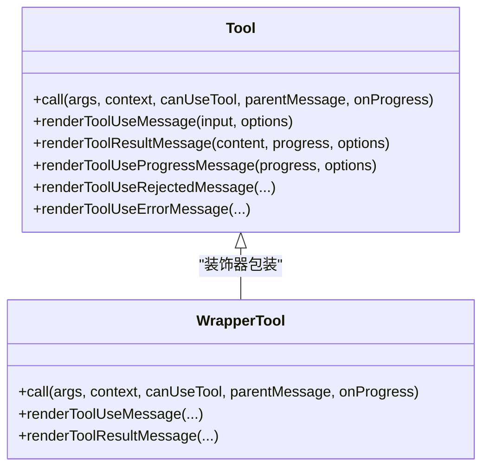

**图表来源**
- [src/Tool.ts:505-695](file://src/Tool.ts#L505-L695)

**章节来源**
- [src/Tool.ts:505-695](file://src/Tool.ts#L505-L695)

### 状态管理机制（AppStateStore）
- 单一真相源
  - AppStateStore 定义完整状态结构，包含设置、任务、插件、通知、权限上下文、提示词建议、推测状态等，确保 UI 与后台逻辑的一致性。
- Store 与 onChange 钩子
  - 通过 Store 的 setState 与 onChangeAppState 钩子，实现状态变更的统一处理与外部同步（如桥接元数据、配置持久化）。
- 默认状态与深冻结
  - 提供默认状态工厂与深冻结类型，避免意外修改与副作用传播。

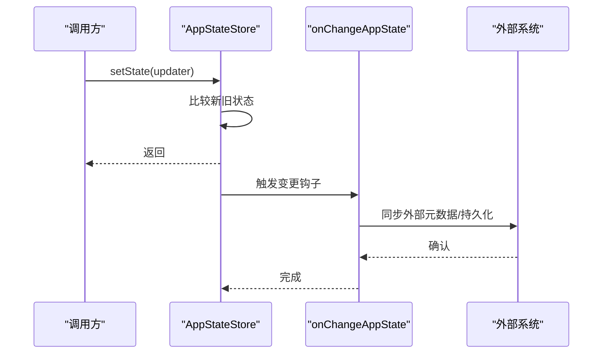

**图表来源**
- [src/state/AppStateStore.ts:89-452](file://src/state/AppStateStore.ts#L89-L452)
- [src/state/store.ts:4-34](file://src/state/store.ts#L4-L34)
- [src/state/onChangeAppState.ts:43-92](file://src/state/onChangeAppState.ts#L43-L92)

**章节来源**
- [src/state/AppStateStore.ts:89-452](file://src/state/AppStateStore.ts#L89-L452)
- [src/state/store.ts:4-34](file://src/state/store.ts#L4-L34)
- [src/state/onChangeAppState.ts:43-92](file://src/state/onChangeAppState.ts#L43-L92)

### 工具系统架构（Tool 基类）
- 上下文与能力
  - ToolUseContext 提供工具调用所需的选项、文件读取缓存、状态访问、通知、进度回调、权限上下文等。
- 输入输出与验证
  - 工具定义输入/输出模式、输入等价性比较、并发安全、只读/破坏性标记、输入验证与权限检查。
- 渲染与展示
  - 支持工具使用消息、结果消息、进度消息、拒绝/错误消息的自定义渲染，便于 UI 层统一展示。

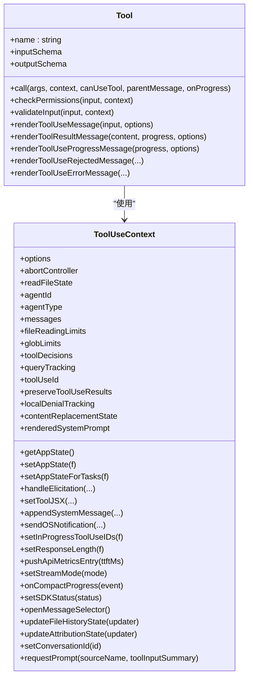

**图表来源**
- [src/Tool.ts:158-300](file://src/Tool.ts#L158-L300)
- [src/Tool.ts:362-473](file://src/Tool.ts#L362-L473)
- [src/Tool.ts:505-695](file://src/Tool.ts#L505-L695)

**章节来源**
- [src/Tool.ts:158-300](file://src/Tool.ts#L158-L300)
- [src/Tool.ts:362-473](file://src/Tool.ts#L362-L473)
- [src/Tool.ts:505-695](file://src/Tool.ts#L505-L695)

### 命令系统设计（commands.ts）
- 动态聚合
  - 内置命令、技能目录命令、插件命令、工作流命令、MCP 技能命令统一聚合，支持去重与动态插入。
- 可用性与启用过滤
  - 根据认证状态与提供商要求过滤命令可用性；每个命令独立启用状态检查。
- 远程安全命令
  - 明确区分远程模式安全命令与本地命令，避免远程执行潜在风险。

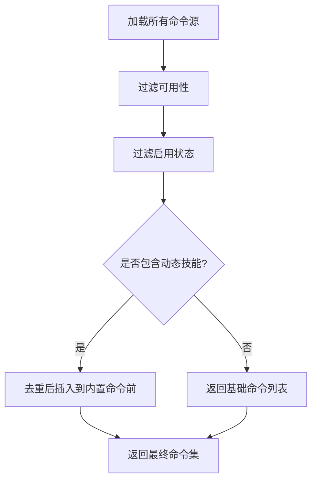

**图表来源**
- [src/commands.ts:449-469](file://src/commands.ts#L449-L469)
- [src/commands.ts:476-517](file://src/commands.ts#L476-L517)
- [src/commands.ts:619-676](file://src/commands.ts#L619-L676)

**章节来源**
- [src/commands.ts:449-469](file://src/commands.ts#L449-L469)
- [src/commands.ts:476-517](file://src/commands.ts#L476-L517)
- [src/commands.ts:619-676](file://src/commands.ts#L619-L676)

### 远程桥接与传输（REPL 桥接与 SSE）
- 桥接状态与序列号
  - 桥接在会话切换时重置传输状态与最近 UUID 缓存，防止历史事件丢失或重复。
- 事件回放与批量发送
  - 使用刷新门（flush gate）收集待发送消息，完成后批量写入传输层，保证顺序与可靠性。
- SSE 传输
  - 实现标准 SSE 字段解析与帧聚合，支持事件、ID、数据字段，忽略未知字段。

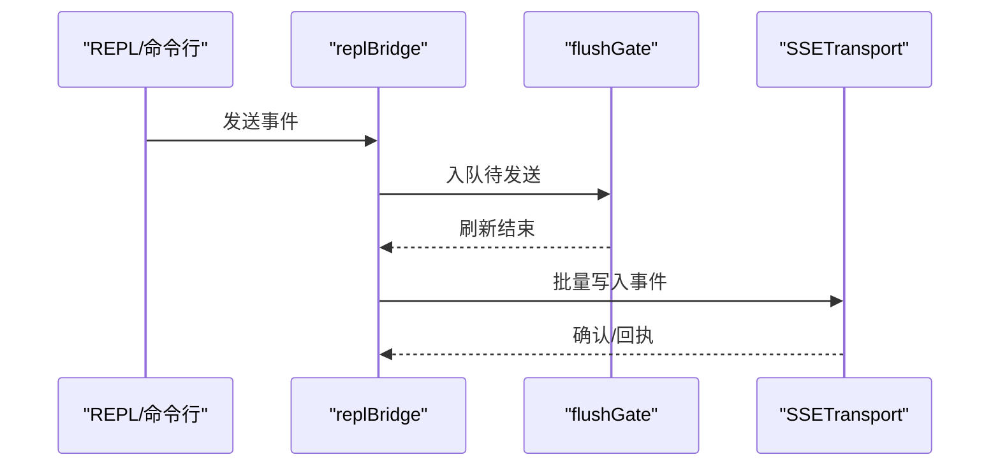

**图表来源**
- [src/bridge/replBridge.ts:788-876](file://src/bridge/replBridge.ts#L788-L876)
- [src/cli/remoteIO.ts:221-255](file://src/cli/remoteIO.ts#L221-L255)
- [src/cli/transports/SSETransport.ts:84-116](file://src/cli/transports/SSETransport.ts#L84-L116)

**章节来源**
- [src/bridge/replBridge.ts:788-876](file://src/bridge/replBridge.ts#L788-L876)
- [src/cli/remoteIO.ts:221-255](file://src/cli/remoteIO.ts#L221-L255)
- [src/cli/transports/SSETransport.ts:84-116](file://src/cli/transports/SSETransport.ts#L84-L116)

## 依赖关系分析
- 组件内聚与耦合
  - AppStateStore 与 Store 高内聚，通过 onChange 钩子与外部系统解耦。
  - Tool 与 ToolUseContext 通过接口解耦，便于扩展不同工具策略。
  - commands.ts 通过条件导入与可用性过滤，实现特性开关与远程安全命令的低耦合。
- 外部依赖与集成点
  - bridge 与 cli 层负责与远程系统集成，传输层遵循 SSE 规范，确保兼容性。
- 循环依赖规避
  - 通过延迟 require 与类型导入，避免模块间循环依赖（如 teammates 与 AppState 的相互引用）。

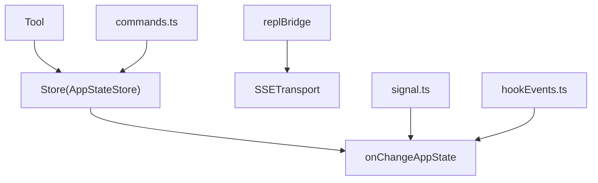

**图表来源**
- [src/state/AppStateStore.ts:89-452](file://src/state/AppStateStore.ts#L89-L452)
- [src/state/onChangeAppState.ts:43-92](file://src/state/onChangeAppState.ts#L43-L92)
- [src/Tool.ts:158-300](file://src/Tool.ts#L158-L300)
- [src/commands.ts:258-346](file://src/commands.ts#L258-L346)
- [src/bridge/replBridge.ts:788-876](file://src/bridge/replBridge.ts#L788-L876)
- [src/cli/transports/SSETransport.ts:122-147](file://src/cli/transports/SSETransport.ts#L122-L147)
- [src/utils/signal.ts:27-43](file://src/utils/signal.ts#L27-L43)
- [src/utils/hooks/hookEvents.ts:57-91](file://src/utils/hooks/hookEvents.ts#L57-L91)

**章节来源**
- [src/state/AppStateStore.ts:89-452](file://src/state/AppStateStore.ts#L89-L452)
- [src/state/onChangeAppState.ts:43-92](file://src/state/onChangeAppState.ts#L43-L92)
- [src/Tool.ts:158-300](file://src/Tool.ts#L158-L300)
- [src/commands.ts:258-346](file://src/commands.ts#L258-L346)
- [src/bridge/replBridge.ts:788-876](file://src/bridge/replBridge.ts#L788-L876)
- [src/cli/transports/SSETransport.ts:122-147](file://src/cli/transports/SSETransport.ts#L122-L147)
- [src/utils/signal.ts:27-43](file://src/utils/signal.ts#L27-L43)
- [src/utils/hooks/hookEvents.ts:57-91](file://src/utils/hooks/hookEvents.ts#L57-L91)

## 性能考虑
- 启动性能
  - 并行预取与延迟加载显著缩短首屏渲染时间，避免阻塞关键路径。
  - 对重型模块（如洞察报告）采用懒加载，仅在需要时加载。
- 状态更新
  - Store 的浅比较避免不必要的渲染；onChange 钩子集中处理副作用，减少分散更新带来的抖动。
- 传输与桥接
  - 批量写入与刷新门机制减少网络往返；SSE 字段解析严格遵循规范，提升稳定性。
- 事件系统
  - 钩子事件系统限制最大挂起事件数量，避免内存膨胀；信号系统无状态，开销极小。

[本节为通用指导，无需列出具体文件来源]

## 故障排查指南
- 状态未同步
  - 检查 onChangeAppState 是否正确触发外部元数据同步（如权限模式、会话元数据）。
- 命令不可用
  - 确认命令可用性过滤与启用状态检查是否符合预期；远程模式下确认是否命中安全命令白名单。
- 桥接消息丢失
  - 检查会话切换时是否重置传输状态与最近 UUID 缓存；确认刷新门是否正确清空与批量发送。
- 事件未广播
  - 检查钩子事件系统是否已启用“全部事件”，以及事件处理器是否正确注册。

**章节来源**
- [src/state/onChangeAppState.ts:43-92](file://src/state/onChangeAppState.ts#L43-L92)
- [src/commands.ts:619-676](file://src/commands.ts#L619-L676)
- [src/bridge/replBridge.ts:788-876](file://src/bridge/replBridge.ts#L788-L876)
- [src/utils/hooks/hookEvents.ts:184-186](file://src/utils/hooks/hookEvents.ts#L184-L186)

## 结论
Claude Code 项目通过模块化与组件化设计，结合观察者模式、策略模式与装饰器模式，构建了高内聚、低耦合且可扩展的系统架构。并行预取与延迟加载优化启动性能，状态中心与事件系统保障一致性与可观测性，工具与命令体系提供灵活扩展能力。远程桥接与传输层遵循标准协议，兼顾安全与可靠性。整体设计在性能、可扩展性与安全性之间取得良好平衡，适合长期演进与多平台部署。