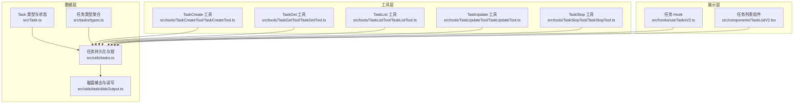
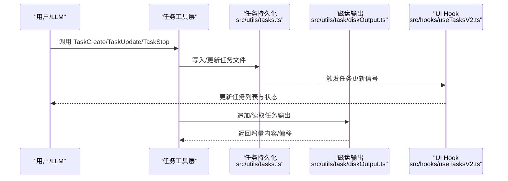
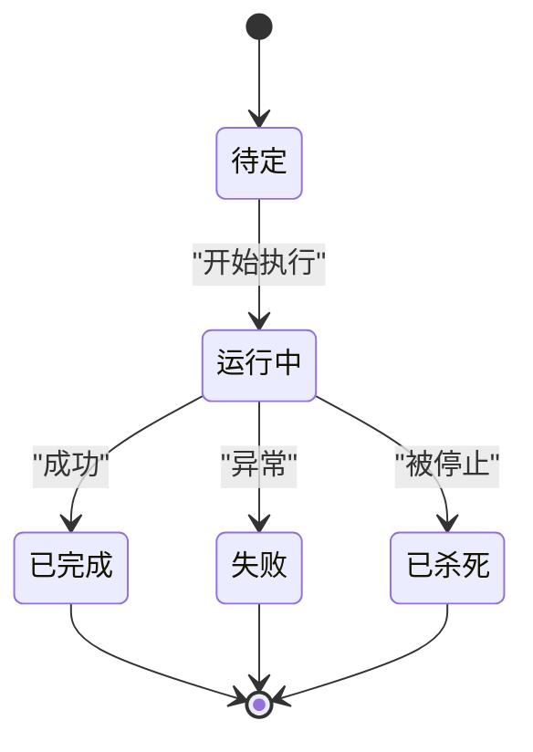
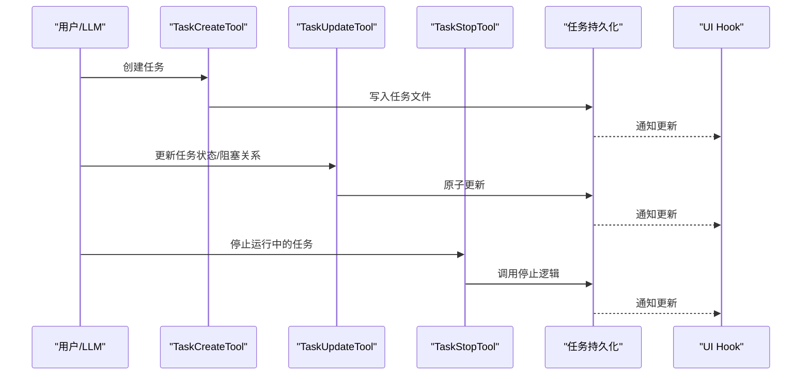
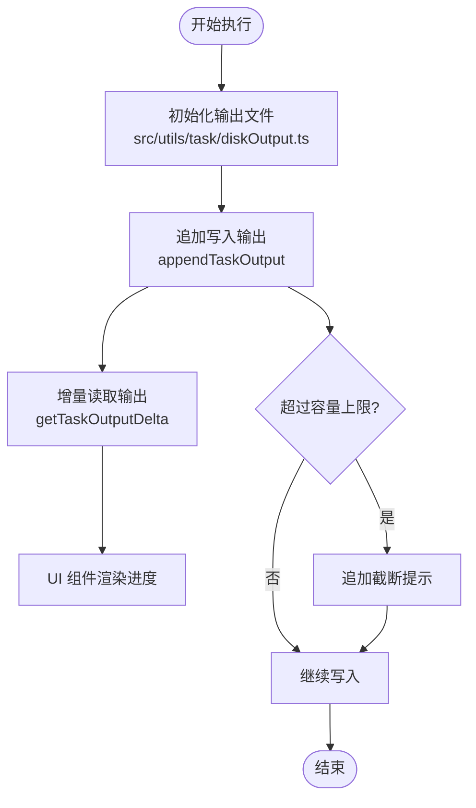
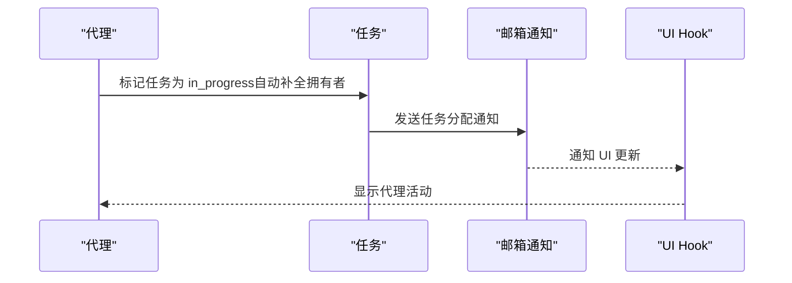
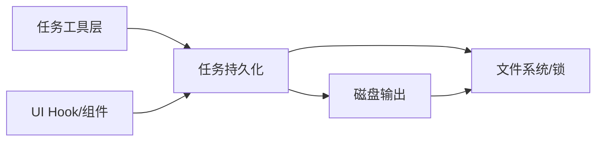

# 任务管理系统

<cite>
**本文档引用的文件**
- [src/Task.ts](file://src/Task.ts)
- [src/tasks/types.ts](file://src/tasks/types.ts)
- [src/tasks.ts](file://src/tasks.ts)
- [src/utils/tasks.ts](file://src/utils/tasks.ts)
- [src/utils/task/diskOutput.ts](file://src/utils/task/diskOutput.ts)
- [src/tasks/stopTask.ts](file://src/tasks/stopTask.ts)
- [src/tools/TaskCreateTool/TaskCreateTool.ts](file://src/tools/TaskCreateTool/TaskCreateTool.ts)
- [src/tools/TaskGetTool/TaskGetTool.ts](file://src/tools/TaskGetTool/TaskGetTool.ts)
- [src/tools/TaskListTool/TaskListTool.ts](file://src/tools/TaskListTool/TaskListTool.ts)
- [src/tools/TaskUpdateTool/TaskUpdateTool.ts](file://src/tools/TaskUpdateTool/TaskUpdateTool.ts)
- [src/tools/TaskStopTool/TaskStopTool.ts](file://src/tools/TaskStopTool/TaskStopTool.ts)
- [src/hooks/useTasksV2.ts](file://src/hooks/useTasksV2.ts)
- [src/components/TaskListV2.tsx](file://src/components/TaskListV2.tsx)
</cite>

## 目录
1. [简介](#简介)
2. [项目结构](#项目结构)
3. [核心组件](#核心组件)
4. [架构总览](#架构总览)
5. [详细组件分析](#详细组件分析)
6. [依赖关系分析](#依赖关系分析)
7. [性能考虑](#性能考虑)
8. [故障排除指南](#故障排除指南)
9. [结论](#结论)
10. [附录](#附录)

## 简介
本文件为 Claude Code 任务管理系统的全面技术文档，面向任务开发者与系统管理员，涵盖任务生命周期设计、状态管理与同步、任务工具功能（创建、更新、查询、停止）、执行机制（调度、进度跟踪、结果管理）、配置示例与使用方法、最佳实践以及与代理系统的集成方式。

## 项目结构
任务系统由“数据模型与持久化”、“任务工具层”、“UI 展示层”三部分组成：
- 数据模型与持久化：定义任务类型、状态、ID 生成、输出落盘与读取、并发安全的 CRUD 操作
- 任务工具层：提供 TaskCreate/TaskGet/TaskList/TaskUpdate/TaskStop 等工具，支持 LLM 调用与 SDK 控制
- UI 展示层：通过 React Hook 与组件实时展示任务列表、状态与进度

**图表来源**
- [src/Task.ts:1-126](file://src/Task.ts#L1-L126)
- [src/tasks/types.ts:1-47](file://src/tasks/types.ts#L1-L47)
- [src/utils/tasks.ts:1-800](file://src/utils/tasks.ts#L1-L800)
- [src/utils/task/diskOutput.ts:1-452](file://src/utils/task/diskOutput.ts#L1-L452)
- [src/tools/TaskCreateTool/TaskCreateTool.ts:1-139](file://src/tools/TaskCreateTool/TaskCreateTool.ts#L1-L139)
- [src/tools/TaskGetTool/TaskGetTool.ts:1-129](file://src/tools/TaskGetTool/TaskGetTool.ts#L1-L129)
- [src/tools/TaskListTool/TaskListTool.ts:1-117](file://src/tools/TaskListTool/TaskListTool.ts#L1-L117)
- [src/tools/TaskUpdateTool/TaskUpdateTool.ts:1-407](file://src/tools/TaskUpdateTool/TaskUpdateTool.ts#L1-L407)
- [src/tools/TaskStopTool/TaskStopTool.ts:1-132](file://src/tools/TaskStopTool/TaskStopTool.ts#L1-L132)
- [src/hooks/useTasksV2.ts:1-251](file://src/hooks/useTasksV2.ts#L1-L251)
- [src/components/TaskListV2.tsx:1-378](file://src/components/TaskListV2.tsx#L1-L378)

**章节来源**
- [src/Task.ts:1-126](file://src/Task.ts#L1-L126)
- [src/utils/tasks.ts:1-800](file://src/utils/tasks.ts#L1-L800)
- [src/hooks/useTasksV2.ts:1-251](file://src/hooks/useTasksV2.ts#L1-L251)

## 核心组件
- 任务类型与状态
  - 定义任务类型枚举、状态枚举、终端状态判断、任务上下文与基础字段
  - 关键路径：[src/Task.ts:6-57](file://src/Task.ts#L6-L57)
- 任务类型聚合
  - 聚合所有任务状态类型，提供“后台任务”判定逻辑
  - 关键路径：[src/tasks/types.ts:12-46](file://src/tasks/types.ts#L12-L46)
- 任务持久化与并发控制
  - 提供任务 CRUD、阻塞关系维护、任务列表锁定、高水位标记防止 ID 回绕
  - 关键路径：[src/utils/tasks.ts:284-441](file://src/utils/tasks.ts#L284-L441)
- 磁盘输出与读写
  - 输出文件初始化、追加写入、增量读取、容量限制与截断、软链接输出
  - 关键路径：[src/utils/task/diskOutput.ts:97-231](file://src/utils/task/diskOutput.ts#L97-L231)
- 停止任务
  - 统一停止逻辑，错误分类（未找到、非运行中、不支持类型），抑制噪声通知并发出 SDK 事件
  - 关键路径：[src/tasks/stopTask.ts:38-100](file://src/tasks/stopTask.ts#L38-L100)

**章节来源**
- [src/Task.ts:1-126](file://src/Task.ts#L1-L126)
- [src/tasks/types.ts:1-47](file://src/tasks/types.ts#L1-L47)
- [src/utils/tasks.ts:1-800](file://src/utils/tasks.ts#L1-L800)
- [src/utils/task/diskOutput.ts:1-452](file://src/utils/task/diskOutput.ts#L1-L452)
- [src/tasks/stopTask.ts:1-101](file://src/tasks/stopTask.ts#L1-L101)

## 架构总览
任务系统采用“文件系统 + 锁 + React Hook”的架构：
- 文件系统存储任务元数据（JSON），通过锁保证并发一致性
- React Hook 订阅任务目录变更与内存信号，实现 UI 即时刷新
- 工具层通过统一接口调用任务持久化与状态更新，支持 LLM 自动化与手动控制

**图表来源**
- [src/tools/TaskCreateTool/TaskCreateTool.ts:80-129](file://src/tools/TaskCreateTool/TaskCreateTool.ts#L80-L129)
- [src/tools/TaskUpdateTool/TaskUpdateTool.ts:123-363](file://src/tools/TaskUpdateTool/TaskUpdateTool.ts#L123-L363)
- [src/tools/TaskStopTool/TaskStopTool.ts:107-130](file://src/tools/TaskStopTool/TaskStopTool.ts#L107-L130)
- [src/utils/tasks.ts:284-441](file://src/utils/tasks.ts#L284-L441)
- [src/utils/task/diskOutput.ts:268-357](file://src/utils/task/diskOutput.ts#L268-L357)
- [src/hooks/useTasksV2.ts:113-152](file://src/hooks/useTasksV2.ts#L113-L152)

## 详细组件分析

### 任务生命周期与状态管理
- 生命周期阶段
  - 创建：生成唯一 ID，写入初始状态（如 pending）
  - 执行：状态从 pending 变为 running；输出写入磁盘
  - 结束：状态变为 completed/failed/killed；记录结束时间与通知标志
- 状态同步
  - 文件系统作为事实来源；React Hook 通过文件监听与内存信号订阅实现 UI 同步
  - 高水位标记确保重置/删除后 ID 不回绕
- 并发控制
  - 列表级锁与文件级锁结合，避免竞态条件

**图表来源**
- [src/Task.ts:15-29](file://src/Task.ts#L15-L29)
- [src/utils/tasks.ts:284-308](file://src/utils/tasks.ts#L284-L308)

**章节来源**
- [src/Task.ts:15-57](file://src/Task.ts#L15-L57)
- [src/utils/tasks.ts:133-188](file://src/utils/tasks.ts#L133-L188)
- [src/hooks/useTasksV2.ts:113-152](file://src/hooks/useTasksV2.ts#L113-L152)

### 任务工具功能
- TaskCreateTool
  - 输入：主题、描述、活动形式、元数据
  - 行为：创建任务、触发任务创建钩子、自动展开任务视图
  - 输出：返回任务 ID 与主题
  - 关键路径：[src/tools/TaskCreateTool/TaskCreateTool.ts:80-129](file://src/tools/TaskCreateTool/TaskCreateTool.ts#L80-L129)
- TaskGetTool
  - 输入：任务 ID
  - 行为：读取任务详情（含阻塞关系）
  - 输出：任务对象或空
  - 关键路径：[src/tools/TaskGetTool/TaskGetTool.ts:73-98](file://src/tools/TaskGetTool/TaskGetTool.ts#L73-L98)
- TaskListTool
  - 行为：列出任务，过滤内部任务，计算开放任务集合
  - 输出：任务数组
  - 关键路径：[src/tools/TaskListTool/TaskListTool.ts:65-90](file://src/tools/TaskListTool/TaskListTool.ts#L65-L90)
- TaskUpdateTool
  - 输入：任务 ID、主题/描述/活动形式/状态/拥有者/阻塞关系/元数据
  - 行为：原子更新、状态变更钩子、阻塞关系双向维护、所有权变更通知
  - 输出：更新字段、状态变更信息、可选验证提醒
  - 关键路径：[src/tools/TaskUpdateTool/TaskUpdateTool.ts:123-363](file://src/tools/TaskUpdateTool/TaskUpdateTool.ts#L123-L363)
- TaskStopTool
  - 输入：任务 ID 或已弃用的 shell_id
  - 行为：校验运行中状态，调用统一停止逻辑，抑制噪声通知
  - 输出：成功消息与命令摘要
  - 关键路径：[src/tools/TaskStopTool/TaskStopTool.ts:107-130](file://src/tools/TaskStopTool/TaskStopTool.ts#L107-L130)

**图表来源**
- [src/tools/TaskCreateTool/TaskCreateTool.ts:80-129](file://src/tools/TaskCreateTool/TaskCreateTool.ts#L80-L129)
- [src/tools/TaskUpdateTool/TaskUpdateTool.ts:123-363](file://src/tools/TaskUpdateTool/TaskUpdateTool.ts#L123-L363)
- [src/tools/TaskStopTool/TaskStopTool.ts:107-130](file://src/tools/TaskStopTool/TaskStopTool.ts#L107-L130)
- [src/utils/tasks.ts:284-441](file://src/utils/tasks.ts#L284-L441)
- [src/hooks/useTasksV2.ts:113-152](file://src/hooks/useTasksV2.ts#L113-L152)

**章节来源**
- [src/tools/TaskCreateTool/TaskCreateTool.ts:1-139](file://src/tools/TaskCreateTool/TaskCreateTool.ts#L1-L139)
- [src/tools/TaskGetTool/TaskGetTool.ts:1-129](file://src/tools/TaskGetTool/TaskGetTool.ts#L1-L129)
- [src/tools/TaskListTool/TaskListTool.ts:1-117](file://src/tools/TaskListTool/TaskListTool.ts#L1-L117)
- [src/tools/TaskUpdateTool/TaskUpdateTool.ts:1-407](file://src/tools/TaskUpdateTool/TaskUpdateTool.ts#L1-L407)
- [src/tools/TaskStopTool/TaskStopTool.ts:1-132](file://src/tools/TaskStopTool/TaskStopTool.ts#L1-L132)

### 执行机制：调度、进度跟踪与结果管理
- 调度
  - 任务状态从 pending 到 running 的推进由具体任务实现负责；工具层仅维护元数据与阻塞关系
- 进度跟踪
  - 通过磁盘输出增量读取与偏移量实现进度流式展示
  - UI 组件根据终端宽度与任务数量进行截断与优先级排序
- 结果管理
  - 输出文件上限控制与截断提示
  - 支持软链接输出以复用代理对话转录

**图表来源**
- [src/utils/task/diskOutput.ts:400-451](file://src/utils/task/diskOutput.ts#L400-L451)
- [src/utils/task/diskOutput.ts:268-357](file://src/utils/task/diskOutput.ts#L268-L357)
- [src/components/TaskListV2.tsx:136-189](file://src/components/TaskListV2.tsx#L136-L189)

**章节来源**
- [src/utils/task/diskOutput.ts:97-231](file://src/utils/task/diskOutput.ts#L97-L231)
- [src/components/TaskListV2.tsx:1-378](file://src/components/TaskListV2.tsx#L1-L378)

### 任务与代理系统的集成
- 代理协作
  - 当启用代理集群时，任务拥有者字段用于在 UI 中显示代理活动状态
  - 任务状态变更会触发邮箱通知（跨进程通信）
- 任务列表切换
  - 领导者创建团队时，任务列表 ID 会切换到团队名，UI Hook 自动重定向监听目录

**图表来源**
- [src/tools/TaskUpdateTool/TaskUpdateTool.ts:185-298](file://src/tools/TaskUpdateTool/TaskUpdateTool.ts#L185-L298)
- [src/hooks/useTasksV2.ts:113-152](file://src/hooks/useTasksV2.ts#L113-L152)

**章节来源**
- [src/utils/tasks.ts:763-798](file://src/utils/tasks.ts#L763-L798)
- [src/tools/TaskUpdateTool/TaskUpdateTool.ts:276-298](file://src/tools/TaskUpdateTool/TaskUpdateTool.ts#L276-L298)

## 依赖关系分析
- 组件耦合
  - 工具层依赖任务持久化模块；UI Hook 依赖任务持久化与内存信号
  - 磁盘输出模块独立于业务逻辑，仅提供 IO 能力
- 外部依赖
  - 文件系统与锁（proper-lockfile）保障并发安全
  - React Hook 与文件监听实现 UI 实时更新

**图表来源**
- [src/utils/tasks.ts:102-108](file://src/utils/tasks.ts#L102-L108)
- [src/utils/task/diskOutput.ts:400-451](file://src/utils/task/diskOutput.ts#L400-L451)
- [src/hooks/useTasksV2.ts:113-152](file://src/hooks/useTasksV2.ts#L113-L152)

**章节来源**
- [src/utils/tasks.ts:102-108](file://src/utils/tasks.ts#L102-L108)
- [src/utils/task/diskOutput.ts:1-452](file://src/utils/task/diskOutput.ts#L1-L452)
- [src/hooks/useTasksV2.ts:1-251](file://src/hooks/useTasksV2.ts#L1-L251)

## 性能考虑
- I/O 优化
  - 使用队列与单线程 drain 循环写入，避免链式 .then 内存累积
  - 增量读取与上限控制，避免大文件加载到内存
- 并发控制
  - 列表级锁与文件级锁组合，减少竞争；重试退避策略降低冲突
- UI 渲染
  - 文件监听 + 内存信号订阅，避免频繁轮询
  - 任务列表按终端宽度截断与优先级排序，提升可读性

[本节为通用指导，无需特定文件引用]

## 故障排除指南
- 停止任务失败
  - 未找到任务：检查任务 ID 是否正确
  - 非运行中状态：确认任务当前状态为 running
  - 不支持类型：确认任务类型是否在支持列表内
  - 关键路径：[src/tasks/stopTask.ts:38-100](file://src/tasks/stopTask.ts#L38-L100)
- 任务无法更新
  - 任务不存在：先创建再更新
  - 状态变更钩子阻塞：查看钩子返回的阻塞错误
  - 关键路径：[src/tools/TaskUpdateTool/TaskUpdateTool.ts:146-265](file://src/tools/TaskUpdateTool/TaskUpdateTool.ts#L146-L265)
- 输出为空或截断
  - 检查输出文件是否存在与权限
  - 查看容量上限与截断提示
  - 关键路径：[src/utils/task/diskOutput.ts:304-373](file://src/utils/task/diskOutput.ts#L304-L373)
- UI 不刷新
  - 确认任务列表 ID 是否因团队切换而改变
  - 检查文件监听是否可用
  - 关键路径：[src/hooks/useTasksV2.ts:90-105](file://src/hooks/useTasksV2.ts#L90-L105)

**章节来源**
- [src/tasks/stopTask.ts:10-18](file://src/tasks/stopTask.ts#L10-L18)
- [src/tools/TaskUpdateTool/TaskUpdateTool.ts:146-265](file://src/tools/TaskUpdateTool/TaskUpdateTool.ts#L146-L265)
- [src/utils/task/diskOutput.ts:304-373](file://src/utils/task/diskOutput.ts#L304-L373)
- [src/hooks/useTasksV2.ts:90-105](file://src/hooks/useTasksV2.ts#L90-L105)

## 结论
该任务系统以文件系统为核心，配合锁与 React Hook 实现高可靠的状态同步与 UI 实时更新；工具层提供完整的任务生命周期能力，支持与代理系统的深度集成。通过磁盘输出的增量读取与容量控制，系统在大规模任务场景下仍保持稳定与高效。

[本节为总结，无需特定文件引用]

## 附录

### 配置示例与使用方法
- 启用任务系统
  - 在非交互模式下强制启用任务工具（适用于 SDK 场景）
  - 关键路径：[src/utils/tasks.ts:133-139](file://src/utils/tasks.ts#L133-L139)
- 设置任务列表 ID
  - 支持显式环境变量、团队名、领导者团队名、会话 ID 的优先级解析
  - 关键路径：[src/utils/tasks.ts:199-210](file://src/utils/tasks.ts#L199-L210)
- 重置任务列表
  - 清空并写入高水位标记，防止 ID 回绕
  - 关键路径：[src/utils/tasks.ts:147-188](file://src/utils/tasks.ts#L147-L188)

**章节来源**
- [src/utils/tasks.ts:133-139](file://src/utils/tasks.ts#L133-L139)
- [src/utils/tasks.ts:199-210](file://src/utils/tasks.ts#L199-L210)
- [src/utils/tasks.ts:147-188](file://src/utils/tasks.ts#L147-L188)

### 最佳实践
- 使用 TaskUpdateTool 的元数据字段进行扩展属性管理，支持键值合并与删除
- 在代理集群场景下，利用拥有者字段与邮箱通知实现任务归属可视化
- 对于长时间运行任务，定期使用增量读取接口获取进度，避免一次性加载大文件
- 使用高水位标记与重置功能清理历史任务，避免 ID 冲突

**章节来源**
- [src/tools/TaskUpdateTool/TaskUpdateTool.ts:200-211](file://src/tools/TaskUpdateTool/TaskUpdateTool.ts#L200-L211)
- [src/utils/tasks.ts:763-798](file://src/utils/tasks.ts#L763-L798)
- [src/utils/task/diskOutput.ts:304-357](file://src/utils/task/diskOutput.ts#L304-L357)