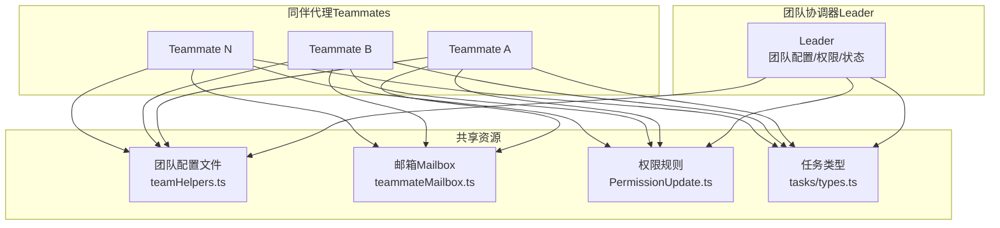
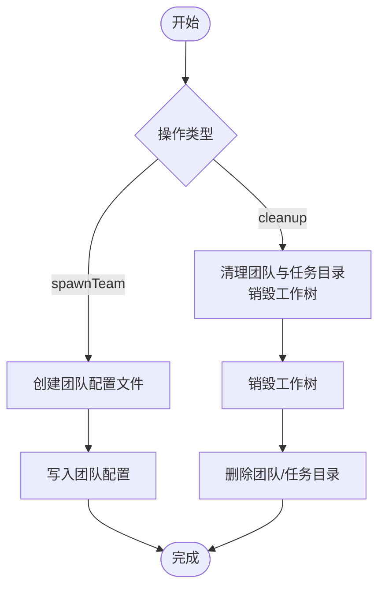
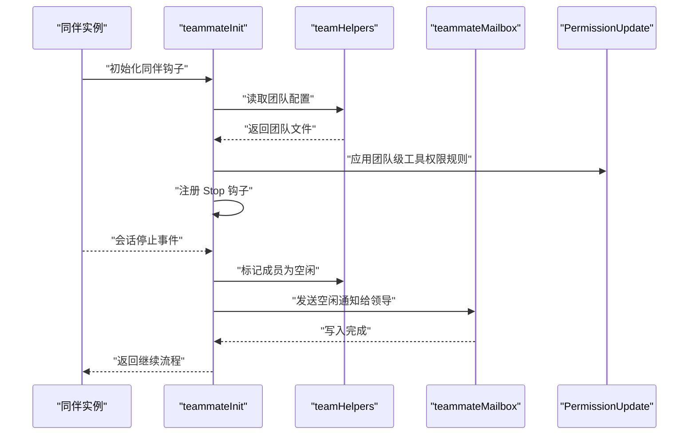
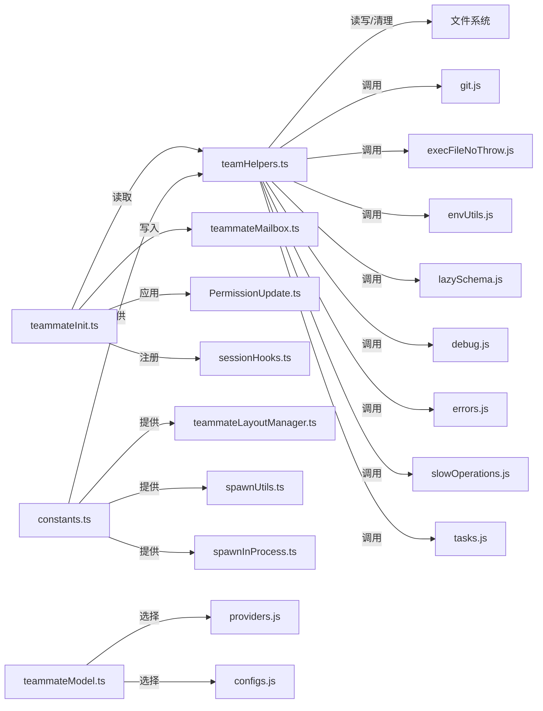

# 代理和多代理协调

<cite>
**本文引用的文件**
- [src/utils/swarm/teamHelpers.ts](file://src/utils/swarm/teamHelpers.ts)
- [src/utils/swarm/teammateInit.ts](file://src/utils/swarm/teammateInit.ts)
- [src/utils/swarm/constants.ts](file://src/utils/swarm/constants.ts)
- [src/utils/swarm/teammateModel.ts](file://src/utils/swarm/teammateModel.ts)
- [src/tasks/types.ts](file://src/tasks/types.ts)
- [src/commands/agents/index.ts](file://src/commands/agents/index.ts)
- [src/components/teams/CoordinatorAgentStatus.tsx](file://src/components/teams/CoordinatorAgentStatus.tsx)
- [src/components/agents/CoordinatorAgentStatus.tsx](file://src/components/agents/CoordinatorAgentStatus.tsx)
- [src/utils/teammate.ts](file://src/utils/teammate.ts)
- [src/utils/teammateMailbox.ts](file://src/utils/teammateMailbox.ts)
- [src/utils/hooks/sessionHooks.ts](file://src/utils/hooks/sessionHooks.ts)
- [src/utils/permissions/PermissionUpdate.ts](file://src/utils/permissions/PermissionUpdate.ts)
- [src/bootstrap/state.ts](file://src/bootstrap/state.ts)
- [src/utils/model/providers.js](file://src/utils/model/providers.js)
- [src/utils/model/configs.js](file://src/utils/model/configs.js)
- [src/utils/envUtils.js](file://src/utils/envUtils.js)
- [src/utils/errors.js](file://src/utils/errors.js)
- [src/utils/debug.js](file://src/utils/debug.js)
- [src/utils/slowOperations.js](file://src/utils/slowOperations.js)
- [src/utils/tasks.js](file://src/utils/tasks.js)
- [src/utils/git.js](file://src/utils/git.js)
- [src/utils/execFileNoThrow.js](file://src/utils/execFileNoThrow.js)
- [src/utils/lazySchema.js](file://src/utils/lazySchema.js)
- [src/utils/teammateLayoutManager.ts](file://src/utils/swarm/teammateLayoutManager.ts)
- [src/utils/swarm/backends/types.js](file://src/utils/swarm/backends/types.js)
- [src/utils/swarm/backends/registry.js](file://src/utils/swarm/backends/registry.js)
- [src/utils/swarm/backends/detection.js](file://src/utils/swarm/backends/detection.js)
- [src/utils/swarm/reconnection.ts](file://src/utils/swarm/reconnection.ts)
- [src/utils/swarm/permissionSync.ts](file://src/utils/swarm/permissionSync.ts)
- [src/utils/swarm/leaderPermissionBridge.ts](file://src/utils/swarm/leaderPermissionBridge.ts)
- [src/utils/swarm/inProcessRunner.ts](file://src/utils/swarm/inProcessRunner.ts)
- [src/utils/swarm/spawnUtils.ts](file://src/utils/swarm/spawnUtils.ts)
- [src/utils/swarm/spawnInProcess.ts](file://src/utils/swarm/spawnInProcess.ts)
- [src/utils/swarm/It2SetupPrompt.tsx](file://src/utils/swarm/It2SetupPrompt.tsx)
- [src/utils/swarm/teammatePromptAddendum.ts](file://src/utils/swarm/teammatePromptAddendum.ts)
- [src/memdir/teamMemPaths.ts](file://src/memdir/teamMemPaths.ts)
- [src/memdir/teamMemPrompts.ts](file://src/memdir/teamMemPrompts.ts)
- [src/services/teamMemorySync/teamMemorySync.ts](file://src/services/teamMemorySync/teamMemorySync.ts)
- [src/services/teamMemorySync/teamMemoryOps.ts](file://src/services/teamMemorySync/teamMemoryOps.ts)
- [src/services/teamMemorySync/teamMemoryPaths.ts](file://src/services/teamMemorySync/teamMemoryPaths.ts)
</cite>

## 目录
1. [简介](#简介)
2. [项目结构](#项目结构)
3. [核心组件](#核心组件)
4. [架构总览](#架构总览)
5. [详细组件分析](#详细组件分析)
6. [依赖关系分析](#依赖关系分析)
7. [性能考虑](#性能考虑)
8. [故障排查指南](#故障排查指南)
9. [结论](#结论)
10. [附录：配置与最佳实践](#附录配置与最佳实践)

## 简介
本文件系统性阐述 Claude Code 的“代理与多代理协调”体系，覆盖以下主题：
- 代理生命周期：从初始化、运行到停止与清理
- 代理通信与协作：通过邮箱（mailbox）与权限规则实现跨代理消息与访问控制
- 多代理协调器功能：任务分配、调度与协调策略
- 子代理（Teammate）的创建与管理：工具使用、权限同步、状态同步
- 团队代理（Team）的创建与管理：团队配置、并行工作协调与会话清理
- 配置示例与性能优化建议
- 开发者最佳实践与常见问题解决

## 项目结构
围绕“代理与多代理协调”的核心目录与文件如下：
- Swarm 工具集：团队配置、权限、状态、清理与后端集成
- 任务类型：统一的任务状态与后台任务判定
- 组件：协调器状态展示与交互入口
- 工具与服务：代理工具、权限更新、模型选择、内存与路径管理

```mermaid
graph TB
subgraph "Swarm 核心"
TH["teamHelpers.ts<br/>团队配置/清理/状态"]
TI["teammateInit.ts<br/>同伴初始化/钩子注册"]
TC["constants.ts<br/>常量/环境变量"]
TM["teammateModel.ts<br/>同伴默认模型回退"]
end
subgraph "任务与命令"
TT["tasks/types.ts<br/>任务类型/后台任务判定"]
AC["commands/agents/index.ts<br/>代理命令入口"]
end
subgraph "组件"
CS1["components/teams/CoordinatorAgentStatus.tsx"]
CS2["components/agents/CoordinatorAgentStatus.tsx"]
end
subgraph "工具与服务"
UT["utils/teammate.ts"]
UM["utils/teammateMailbox.ts"]
SH["utils/hooks/sessionHooks.ts"]
PU["utils/permissions/PermissionUpdate.ts"]
BS["bootstrap/state.ts"]
MP["utils/model/providers.js"]
MC["utils/model/configs.js"]
EU["utils/envUtils.js"]
ER["utils/errors.js"]
DE["utils/debug.js"]
SO["utils/slowOperations.js"]
TK["utils/tasks.js"]
GT["utils/git.js"]
EX["utils/execFileNoThrow.js"]
LZ["utils/lazySchema.js"]
TL["utils/swarm/teammateLayoutManager.ts"]
BT["utils/swarm/backends/types.js"]
BR["utils/swarm/backends/registry.js"]
BD["utils/swarm/backends/detection.js"]
RC["utils/swarm/reconnection.ts"]
PS["utils/swarm/permissionSync.ts"]
LP["utils/swarm/leaderPermissionBridge.ts"]
IR["utils/swarm/inProcessRunner.ts"]
SU["utils/swarm/spawnUtils.ts"]
SI["utils/swarm/spawnInProcess.ts"]
IS["utils/swarm/It2SetupPrompt.tsx"]
TA["utils/swarm/teammatePromptAddendum.ts"]
TP["memdir/teamMemPaths.ts"]
TR["memdir/teamMemPrompts.ts"]
TMS["services/teamMemorySync/*.ts"]
end
TH --> TI
TI --> UM
TI --> SH
TI --> PU
TH --> EU
TH --> ER
TH --> DE
TH --> SO
TH --> TK
TH --> GT
TH --> EX
TH --> LZ
TH --> BT
TH --> BR
TH --> BD
TH --> RC
TH --> PS
TH --> LP
TH --> IR
TH --> SU
TH --> SI
TH --> IS
TH --> TA
TH --> TP
TH --> TR
TH --> TMS
TT --> TH
AC --> TH
CS1 --> TH
CS2 --> TH
TM --> MP
TM --> MC
TC --> EU
```

图示来源
- [src/utils/swarm/teamHelpers.ts:1-684](file://src/utils/swarm/teamHelpers.ts#L1-L684)
- [src/utils/swarm/teammateInit.ts:1-130](file://src/utils/swarm/teammateInit.ts#L1-L130)
- [src/utils/swarm/constants.ts:1-34](file://src/utils/swarm/constants.ts#L1-L34)
- [src/utils/swarm/teammateModel.ts:1-11](file://src/utils/swarm/teammateModel.ts#L1-L11)
- [src/tasks/types.ts:1-47](file://src/tasks/types.ts#L1-L47)
- [src/commands/agents/index.ts:1-11](file://src/commands/agents/index.ts#L1-L11)
- [src/components/teams/CoordinatorAgentStatus.tsx](file://src/components/teams/CoordinatorAgentStatus.tsx)
- [src/components/agents/CoordinatorAgentStatus.tsx](file://src/components/agents/CoordinatorAgentStatus.tsx)
- [src/utils/teammate.ts](file://src/utils/teammate.ts)
- [src/utils/teammateMailbox.ts](file://src/utils/teammateMailbox.ts)
- [src/utils/hooks/sessionHooks.ts](file://src/utils/hooks/sessionHooks.ts)
- [src/utils/permissions/PermissionUpdate.ts](file://src/utils/permissions/PermissionUpdate.ts)
- [src/bootstrap/state.ts](file://src/bootstrap/state.ts)
- [src/utils/model/providers.js](file://src/utils/model/providers.js)
- [src/utils/model/configs.js](file://src/utils/model/configs.js)
- [src/utils/envUtils.js](file://src/utils/envUtils.js)
- [src/utils/errors.js](file://src/utils/errors.js)
- [src/utils/debug.js](file://src/utils/debug.js)
- [src/utils/slowOperations.js](file://src/utils/slowOperations.js)
- [src/utils/tasks.js](file://src/utils/tasks.js)
- [src/utils/git.js](file://src/utils/git.js)
- [src/utils/execFileNoThrow.js](file://src/utils/execFileNoThrow.js)
- [src/utils/lazySchema.js](file://src/utils/lazySchema.js)
- [src/utils/swarm/teammateLayoutManager.ts](file://src/utils/swarm/teammateLayoutManager.ts)
- [src/utils/swarm/backends/types.js](file://src/utils/swarm/backends/types.js)
- [src/utils/swarm/backends/registry.js](file://src/utils/swarm/backends/registry.js)
- [src/utils/swarm/backends/detection.js](file://src/utils/swarm/backends/detection.js)
- [src/utils/swarm/reconnection.ts](file://src/utils/swarm/reconnection.ts)
- [src/utils/swarm/permissionSync.ts](file://src/utils/swarm/permissionSync.ts)
- [src/utils/swarm/leaderPermissionBridge.ts](file://src/utils/swarm/leaderPermissionBridge.ts)
- [src/utils/swarm/inProcessRunner.ts](file://src/utils/swarm/inProcessRunner.ts)
- [src/utils/swarm/spawnUtils.ts](file://src/utils/swarm/spawnUtils.ts)
- [src/utils/swarm/spawnInProcess.ts](file://src/utils/swarm/spawnInProcess.ts)
- [src/utils/swarm/It2SetupPrompt.tsx](file://src/utils/swarm/It2SetupPrompt.tsx)
- [src/utils/swarm/teammatePromptAddendum.ts](file://src/utils/swarm/teammatePromptAddendum.ts)
- [src/memdir/teamMemPaths.ts](file://src/memdir/teamMemPaths.ts)
- [src/memdir/teamMemPrompts.ts](file://src/memdir/teamMemPrompts.ts)
- [src/services/teamMemorySync/teamMemorySync.ts](file://src/services/teamMemorySync/teamMemorySync.ts)
- [src/services/teamMemorySync/teamMemoryOps.ts](file://src/services/teamMemorySync/teamMemoryOps.ts)
- [src/services/teamMemorySync/teamMemoryPaths.ts](file://src/services/teamMemorySync/teamMemoryPaths.ts)

章节来源
- [src/utils/swarm/teamHelpers.ts:1-684](file://src/utils/swarm/teamHelpers.ts#L1-L684)
- [src/utils/swarm/teammateInit.ts:1-130](file://src/utils/swarm/teammateInit.ts#L1-L130)
- [src/utils/swarm/constants.ts:1-34](file://src/utils/swarm/constants.ts#L1-L34)
- [src/utils/swarm/teammateModel.ts:1-11](file://src/utils/swarm/teammateModel.ts#L1-L11)
- [src/tasks/types.ts:1-47](file://src/tasks/types.ts#L1-L47)
- [src/commands/agents/index.ts:1-11](file://src/commands/agents/index.ts#L1-L11)

## 核心组件
- 团队配置与生命周期管理：负责团队文件的读写、成员移除、隐藏面板、权限模式批量更新、活跃状态维护、会话清理与工作树销毁等。
- 同伴初始化：在同伴代理启动时注册会话停止钩子，向团队领导发送空闲通知，并应用团队级工具权限规则。
- 常量与环境变量：定义团队会话名、tmux 命令、隔离 socket 名称以及同伴相关环境变量键值。
- 模型回退：根据 API 提供商选择同伴默认模型。
- 任务类型：统一任务状态接口与后台任务判定逻辑，便于 UI 与调度层统一处理。

章节来源
- [src/utils/swarm/teamHelpers.ts:1-684](file://src/utils/swarm/teamHelpers.ts#L1-L684)
- [src/utils/swarm/teammateInit.ts:1-130](file://src/utils/swarm/teammateInit.ts#L1-L130)
- [src/utils/swarm/constants.ts:1-34](file://src/utils/swarm/constants.ts#L1-L34)
- [src/utils/swarm/teammateModel.ts:1-11](file://src/utils/swarm/teammateModel.ts#L1-L11)
- [src/tasks/types.ts:1-47](file://src/tasks/types.ts#L1-L47)

## 架构总览
下图展示了“代理与多代理协调”的高层架构：团队协调器（Leader）与多个同伴代理（Teammates）通过共享的团队配置与邮箱进行协作；同伴在停止时通过邮箱通知领导；团队配置支持批量权限同步与活跃状态管理；任务类型统一了后台任务的判定。

图示来源
- [src/utils/swarm/teamHelpers.ts:1-684](file://src/utils/swarm/teamHelpers.ts#L1-L684)
- [src/utils/swarm/teammateInit.ts:1-130](file://src/utils/swarm/teammateInit.ts#L1-L130)
- [src/utils/teammateMailbox.ts](file://src/utils/teammateMailbox.ts)
- [src/utils/permissions/PermissionUpdate.ts](file://src/utils/permissions/PermissionUpdate.ts)
- [src/tasks/types.ts:1-47](file://src/tasks/types.ts#L1-L47)

## 详细组件分析

### 组件A：团队配置与生命周期（teamHelpers）
职责与能力
- 团队文件读写：同步与异步读写团队配置 JSON，含名称、描述、创建时间、领导代理 ID、成员列表、隐藏面板、团队允许路径等。
- 成员管理：按 agentId 或 name 移除成员；按 tmuxPaneId 移除成员；按 agentId 移除成员；设置成员权限模式；批量设置成员权限模式；设置成员活跃状态。
- 隐藏面板：添加/移除隐藏面板 ID。
- 清理与回收：注册/注销会话清理；优雅关闭时清理孤儿面板；销毁工作树；删除团队与任务目录。
- 路径与命名：对团队名与代理名进行安全化处理，确保 tmux 窗口名、工作树路径与文件路径合法。
- 数据校验：基于 lazySchema 的输入输出模式，保证操作参数正确性。

图示来源
- [src/utils/swarm/teamHelpers.ts:19-94](file://src/utils/swarm/teamHelpers.ts#L19-L94)
- [src/utils/swarm/teamHelpers.ts:115-182](file://src/utils/swarm/teamHelpers.ts#L115-L182)
- [src/utils/swarm/teamHelpers.ts:576-683](file://src/utils/swarm/teamHelpers.ts#L576-L683)

章节来源
- [src/utils/swarm/teamHelpers.ts:1-684](file://src/utils/swarm/teamHelpers.ts#L1-L684)

### 组件B：同伴初始化与协作（teammateInit）
职责与能力
- 初始化钩子：在同伴代理启动时注册 Stop 钩子，当同伴会话停止时，将其标记为空闲并发送空闲通知给团队领导。
- 权限应用：读取团队配置中的“团队级允许路径”，动态为同伴应用工具权限规则。
- 信息获取：通过工具函数获取团队名、代理名、颜色等上下文信息。

图示来源
- [src/utils/swarm/teammateInit.ts:28-129](file://src/utils/swarm/teammateInit.ts#L28-L129)
- [src/utils/swarm/teamHelpers.ts:131-160](file://src/utils/swarm/teamHelpers.ts#L131-L160)
- [src/utils/teammateMailbox.ts](file://src/utils/teammateMailbox.ts)
- [src/utils/permissions/PermissionUpdate.ts](file://src/utils/permissions/PermissionUpdate.ts)

章节来源
- [src/utils/swarm/teammateInit.ts:1-130](file://src/utils/swarm/teammateInit.ts#L1-L130)

### 组件C：常量与环境变量（constants）
- 定义团队会话名、tmux 命令、隐藏会话名、隔离 socket 名称生成逻辑。
- 定义同伴相关环境变量键：同伴命令、颜色、计划模式强制开关。

章节来源
- [src/utils/swarm/constants.ts:1-34](file://src/utils/swarm/constants.ts#L1-L34)

### 组件D：同伴默认模型回退（teammateModel）
- 根据当前 API 提供商选择同伴默认模型 ID，确保不同提供商（如 Bedrock/Vertex/Foundry）获得正确的模型标识。

章节来源
- [src/utils/swarm/teammateModel.ts:1-11](file://src/utils/swarm/teammateModel.ts#L1-L11)
- [src/utils/model/providers.js](file://src/utils/model/providers.js)
- [src/utils/model/configs.js](file://src/utils/model/configs.js)

### 组件E：任务类型与后台任务判定（tasks/types）
- 统一任务状态联合类型，包含本地代理、远程代理、进程内同伴、Shell、工作流、监控 MCP 等任务状态。
- 提供后台任务判定函数：仅运行中或待执行且已后台化的任务才视为后台任务。

章节来源
- [src/tasks/types.ts:1-47](file://src/tasks/types.ts#L1-L47)

### 组件F：代理命令入口（commands/agents/index）
- 定义“agents”命令，用于管理代理配置，作为进入代理相关功能的入口。

章节来源
- [src/commands/agents/index.ts:1-11](file://src/commands/agents/index.ts#L1-L11)

### 组件G：协调器状态组件（CoordinatorAgentStatus）
- 在 UI 层展示协调器状态，便于用户了解团队代理的运行情况与交互入口。

章节来源
- [src/components/teams/CoordinatorAgentStatus.tsx](file://src/components/teams/CoordinatorAgentStatus.tsx)
- [src/components/agents/CoordinatorAgentStatus.tsx](file://src/components/agents/CoordinatorAgentStatus.tsx)

### 组件H：团队内存与路径管理
- 团队内存路径与提示词管理：为团队代理提供一致的记忆检索与提示词注入能力。
- 团队记忆同步服务：封装团队记忆的同步、操作与路径管理，保障多代理间知识一致性。

章节来源
- [src/memdir/teamMemPaths.ts](file://src/memdir/teamMemPaths.ts)
- [src/memdir/teamMemPrompts.ts](file://src/memdir/teamMemPrompts.ts)
- [src/services/teamMemorySync/teamMemorySync.ts](file://src/services/teamMemorySync/teamMemorySync.ts)
- [src/services/teamMemorySync/teamMemoryOps.ts](file://src/services/teamMemorySync/teamMemoryOps.ts)
- [src/services/teamMemorySync/teamMemoryPaths.ts](file://src/services/teamMemorySync/teamMemoryPaths.ts)

## 依赖关系分析
- 组件耦合与内聚
  - teamHelpers 与 teamMateInit 高度耦合：前者提供团队配置与清理，后者在同伴生命周期中读取并应用配置。
  - teammateInit 依赖 teammateMailbox 进行跨代理通信，依赖 PermissionUpdate 应用权限规则。
  - tasks/types 为 UI 与调度层提供统一抽象，降低上层复杂度。
- 外部依赖与集成
  - Git 工作树管理：通过 git 命令与回退的 rm -rf 方案销毁工作树。
  - tmux/外部会话：通过 backends 类型与检测模块决定是否使用外部会话，支持孤儿面板清理。
  - 环境变量与配置：通过 envUtils 与 constants 提供隔离 socket 与同伴命令等配置。

图示来源
- [src/utils/swarm/teamHelpers.ts:1-684](file://src/utils/swarm/teamHelpers.ts#L1-L684)
- [src/utils/swarm/teammateInit.ts:1-130](file://src/utils/swarm/teammateInit.ts#L1-L130)
- [src/utils/swarm/constants.ts:1-34](file://src/utils/swarm/constants.ts#L1-L34)
- [src/utils/swarm/teammateModel.ts:1-11](file://src/utils/swarm/teammateModel.ts#L1-L11)
- [src/utils/git.js](file://src/utils/git.js)
- [src/utils/execFileNoThrow.js](file://src/utils/execFileNoThrow.js)
- [src/utils/envUtils.js](file://src/utils/envUtils.js)
- [src/utils/lazySchema.js](file://src/utils/lazySchema.js)
- [src/utils/debug.js](file://src/utils/debug.js)
- [src/utils/errors.js](file://src/utils/errors.js)
- [src/utils/slowOperations.js](file://src/utils/slowOperations.js)
- [src/utils/tasks.js](file://src/utils/tasks.js)
- [src/utils/teammateMailbox.ts](file://src/utils/teammateMailbox.ts)
- [src/utils/permissions/PermissionUpdate.ts](file://src/utils/permissions/PermissionUpdate.ts)
- [src/utils/hooks/sessionHooks.ts](file://src/utils/hooks/sessionHooks.ts)
- [src/utils/model/providers.js](file://src/utils/model/providers.js)
- [src/utils/model/configs.js](file://src/utils/model/configs.js)

章节来源
- [src/utils/swarm/teamHelpers.ts:1-684](file://src/utils/swarm/teamHelpers.ts#L1-L684)
- [src/utils/swarm/teammateInit.ts:1-130](file://src/utils/swarm/teammateInit.ts#L1-L130)
- [src/utils/swarm/constants.ts:1-34](file://src/utils/swarm/constants.ts#L1-L34)
- [src/utils/swarm/teammateModel.ts:1-11](file://src/utils/swarm/teammateModel.ts#L1-L11)

## 性能考虑
- 并发清理：在优雅关闭时，先并发尝试终止孤儿面板，再并发删除目录，减少整体停机时间。
- 批量权限更新：setMultipleMemberModes 使用映射表一次性构建更新后的成员数组，避免多次写入。
- 异步读写：团队配置读写提供同步与异步版本，异步版本用于工具处理器等异步上下文，避免阻塞。
- 缓存与延迟加载：lazySchema 与动态导入（如 backends/registry 与 backends/detection）仅在需要时加载，降低启动开销。
- I/O 优化：工作树销毁优先使用 git worktree remove，失败后再回退 rm -rf，减少异常路径的 I/O 成本。

章节来源
- [src/utils/swarm/teamHelpers.ts:576-683](file://src/utils/swarm/teamHelpers.ts#L576-L683)
- [src/utils/swarm/teamHelpers.ts:415-445](file://src/utils/swarm/teamHelpers.ts#L415-L445)
- [src/utils/swarm/teamHelpers.ts:147-160](file://src/utils/swarm/teamHelpers.ts#L147-L160)
- [src/utils/lazySchema.js](file://src/utils/lazySchema.js)
- [src/utils/swarm/backends/registry.js](file://src/utils/swarm/backends/registry.js)
- [src/utils/swarm/backends/detection.js](file://src/utils/swarm/backends/detection.js)

## 故障排查指南
- 无法读取团队配置
  - 现象：读取团队文件返回 null。
  - 排查：检查团队目录是否存在、权限是否足够；确认错误码是否为 ENOENT；查看调试日志。
  - 参考：[src/utils/swarm/teamHelpers.ts:131-142](file://src/utils/swarm/teamHelpers.ts#L131-L142)
- 删除成员失败
  - 现象：按 agentId 或 name 移除成员未生效。
  - 排查：确认 teamFile 是否存在；确认 identifier 是否有效；查看日志确认是否找到匹配成员。
  - 参考：[src/utils/swarm/teamHelpers.ts:188-227](file://src/utils/swarm/teamHelpers.ts#L188-L227)
- 工作树删除失败
  - 现象：工作树目录残留或删除报错。
  - 排查：确认主仓库路径解析成功；git worktree remove 返回码；若失败则回退 rm -rf。
  - 参考：[src/utils/swarm/teamHelpers.ts:492-551](file://src/utils/swarm/teamHelpers.ts#L492-L551)
- 同伴停止未通知领导
  - 现象：同伴停止后领导未收到空闲通知。
  - 排查：确认 teammateInit 是否注册 Stop 钩子；检查 mailbox 写入是否成功；确认代理名与颜色设置。
  - 参考：[src/utils/swarm/teammateInit.ts:98-128](file://src/utils/swarm/teammateInit.ts#L98-L128)
- 权限规则未生效
  - 现象：同伴仍无法使用某些工具。
  - 排查：确认团队配置中的 teamAllowedPaths 是否存在；确认 PermissionUpdate 是否被正确应用；检查规则内容格式。
  - 参考：[src/utils/swarm/teammateInit.ts:44-79](file://src/utils/swarm/teammateInit.ts#L44-L79), [src/utils/permissions/PermissionUpdate.ts](file://src/utils/permissions/PermissionUpdate.ts)

章节来源
- [src/utils/swarm/teamHelpers.ts:131-142](file://src/utils/swarm/teamHelpers.ts#L131-L142)
- [src/utils/swarm/teamHelpers.ts:188-227](file://src/utils/swarm/teamHelpers.ts#L188-L227)
- [src/utils/swarm/teamHelpers.ts:492-551](file://src/utils/swarm/teamHelpers.ts#L492-L551)
- [src/utils/swarm/teammateInit.ts:98-128](file://src/utils/swarm/teammateInit.ts#L98-L128)
- [src/utils/permissions/PermissionUpdate.ts](file://src/utils/permissions/PermissionUpdate.ts)

## 结论
该代理与多代理协调系统以“团队配置为中心”，通过严格的文件读写、权限规则与状态同步机制，实现了同伴代理的生命周期管理与高效协作。配合任务类型统一抽象与 UI 状态组件，系统在可扩展性、可观测性与易用性方面达到平衡。建议在生产环境中结合批量权限更新、并发清理与动态导入等策略，进一步提升性能与稳定性。

## 附录：配置与最佳实践

### 配置示例
- 团队配置字段
  - name：团队名称（经安全化处理）
  - description：团队描述
  - createdAt：创建时间戳
  - leadAgentId：团队领导代理 ID
  - members：成员数组，包含 agentId、name、agentType、model、prompt、color、planModeRequired、joinedAt、tmuxPaneId、cwd、worktreePath、sessionId、subscriptions、backendType、isActive、mode 等
  - hiddenPaneIds：隐藏面板 ID 列表
  - teamAllowedPaths：团队级允许路径列表，包含 path、toolName、addedBy、addedAt
- 环境变量
  - CLAUDE_CODE_TEAMMATE_COMMAND：同伴命令路径（默认使用当前二进制）
  - CLAUDE_CODE_AGENT_COLOR：同伴颜色（用于输出与面板识别）
  - CLAUDE_CODE_PLAN_MODE_REQUIRED：是否强制计划模式（true/false）

章节来源
- [src/utils/swarm/teamHelpers.ts:64-90](file://src/utils/swarm/teamHelpers.ts#L64-L90)
- [src/utils/swarm/constants.ts:21-33](file://src/utils/swarm/constants.ts#L21-L33)

### 性能优化方法
- 并发清理：在会话退出时并发终止面板与删除目录。
- 批量权限更新：使用 setMultipleMemberModes 一次性更新多个成员的权限模式。
- 异步读写：在工具处理器中使用异步读写团队配置，避免阻塞主线程。
- 动态导入：仅在需要时加载 backends 与检测模块，降低启动成本。
- I/O 降级：工作树删除优先使用 git 命令，失败回退 rm -rf。

章节来源
- [src/utils/swarm/teamHelpers.ts:576-683](file://src/utils/swarm/teamHelpers.ts#L576-L683)
- [src/utils/swarm/teamHelpers.ts:415-445](file://src/utils/swarm/teamHelpers.ts#L415-L445)
- [src/utils/swarm/teamHelpers.ts:147-160](file://src/utils/swarm/teamHelpers.ts#L147-L160)
- [src/utils/swarm/backends/registry.js](file://src/utils/swarm/backends/registry.js)
- [src/utils/swarm/backends/detection.js](file://src/utils/swarm/backends/detection.js)

### 开发者最佳实践
- 使用 teamHelpers 提供的工具函数进行团队配置读写与清理，避免直接操作文件系统。
- 在同伴初始化阶段注册必要的钩子与权限规则，确保生命周期事件与权限变更及时生效。
- 对于批量操作（如批量设置成员权限），优先使用提供的批量接口，减少重复写入。
- 在 UI 中通过 CoordinatorAgentStatus 组件展示团队状态，便于用户感知与干预。
- 对于计划模式强制场景，通过环境变量开启，确保代码编写前有计划审批流程。

章节来源
- [src/utils/swarm/teammateInit.ts:28-129](file://src/utils/swarm/teammateInit.ts#L28-L129)
- [src/components/teams/CoordinatorAgentStatus.tsx](file://src/components/teams/CoordinatorAgentStatus.tsx)
- [src/components/agents/CoordinatorAgentStatus.tsx](file://src/components/agents/CoordinatorAgentStatus.tsx)