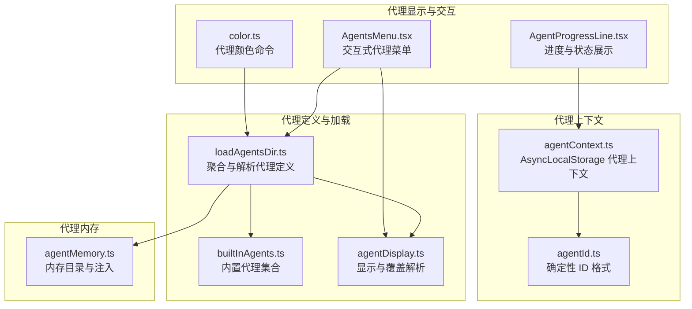
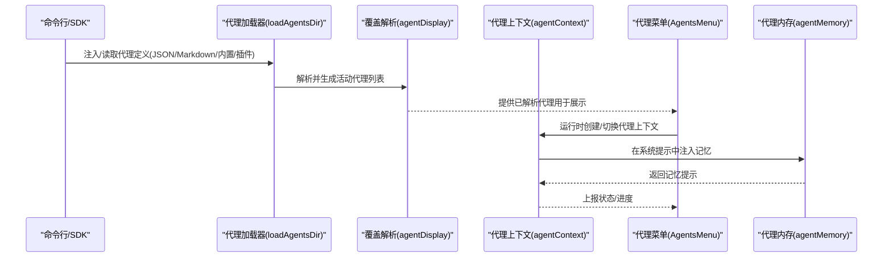
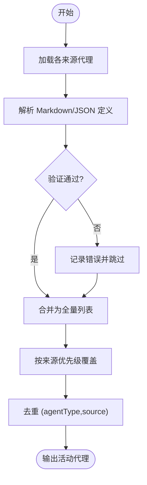
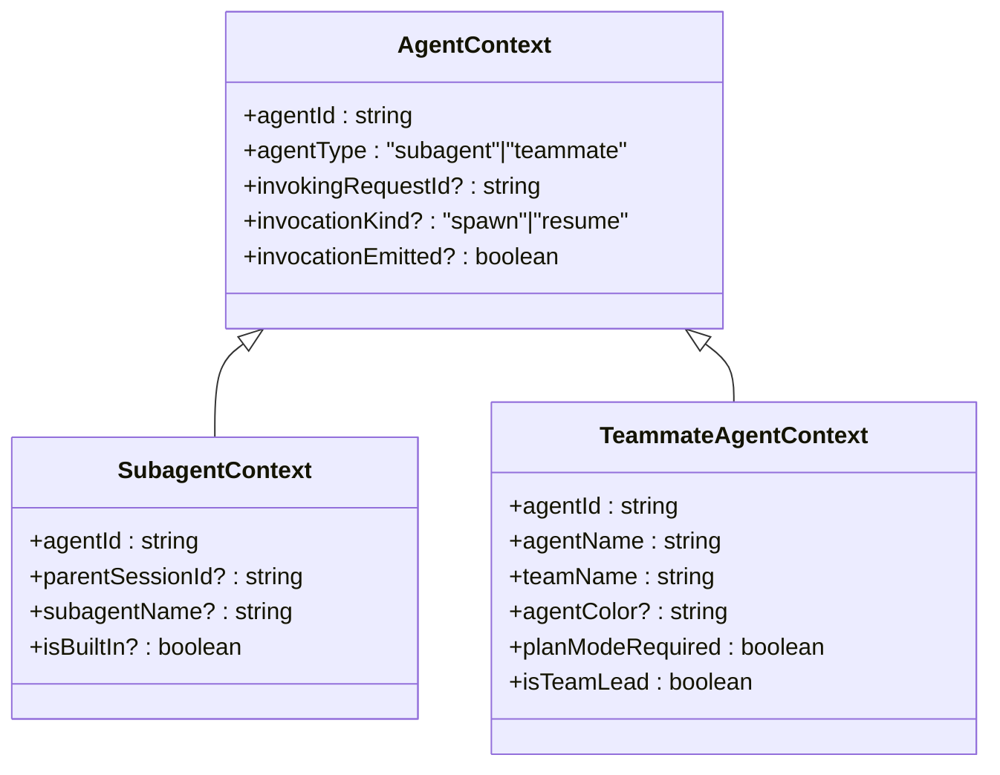
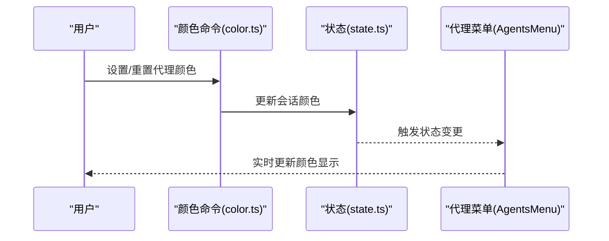
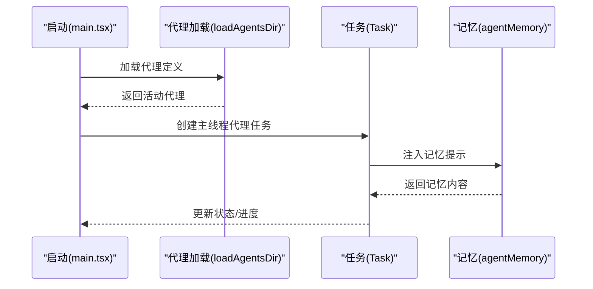
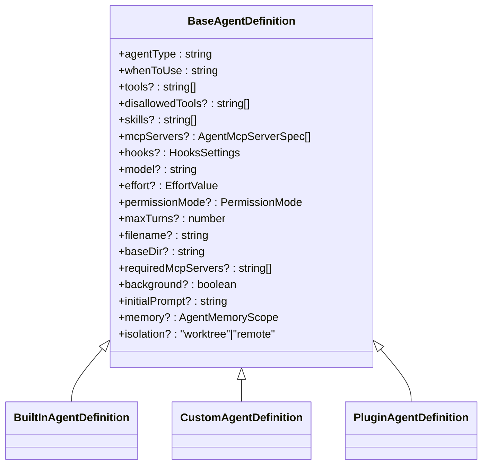
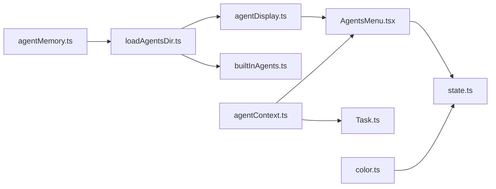

# 代理架构设计

<cite>
**本文档引用的文件**
- [agentColorManager.ts](file://src/tools/AgentTool/agentColorManager.ts)
- [AgentsMenu.tsx](file://src/components/agents/AgentsMenu.tsx)
- [agentDisplay.ts](file://src/tools/AgentTool/agentDisplay.ts)
- [loadAgentsDir.ts](file://src/tools/AgentTool/loadAgentsDir.ts)
- [agentContext.ts](file://src/utils/agentContext.ts)
- [agentId.ts](file://src/utils/agentId.ts)
- [builtInAgents.ts](file://src/tools/AgentTool/builtInAgents.ts)
- [agentMemory.ts](file://src/tools/AgentTool/agentMemory.ts)
- [AgentProgressLine.tsx](file://src/components/AgentProgressLine.tsx)
- [Task.ts](file://src/Task.ts)
- [main.tsx](file://src/main.tsx)
- [color.ts](file://src/commands/color/color.ts)
- [print.ts](file://src/cli/print.ts)
- [state.ts](file://src/bootstrap/state.ts)
</cite>

## 目录
1. [引言](#引言)
2. [项目结构](#项目结构)
3. [核心组件](#核心组件)
4. [架构总览](#架构总览)
5. [详细组件分析](#详细组件分析)
6. [依赖关系分析](#依赖关系分析)
7. [性能考虑](#性能考虑)
8. [故障排除指南](#故障排除指南)
9. [结论](#结论)

## 引言
本文件面向代理开发者，系统化阐述代理架构的设计理念、实现细节与最佳实践。内容涵盖代理的定义与属性、代理显示系统（颜色、标识、状态）、代理工具的生命周期与状态管理、可扩展性（注册、配置、继承）以及性能与内存管理策略。目标是帮助开发者在不深入源码的前提下，快速理解并高效扩展代理系统。

## 项目结构
代理系统围绕“代理定义加载 → 代理上下文执行 → 代理显示与交互 → 代理内存与持久化”的主干流程组织，关键模块如下：
- 代理定义与加载：从多来源（内置、插件、用户/项目/策略设置、命令行注入）聚合并解析代理定义，支持覆盖与去重。
- 代理上下文：通过异步存储隔离不同并发代理的上下文，确保事件归属正确。
- 代理显示与交互：提供 CLI 与交互式 UI 的统一展示与操作入口。
- 代理内存：按作用域（用户/项目/本地）持久化与注入代理记忆。
- 生命周期与状态：任务状态机贯穿代理的创建、运行、完成/失败/终止等阶段。

**图表来源**
- [loadAgentsDir.ts:296-398](file://src/tools/AgentTool/loadAgentsDir.ts#L296-L398)
- [builtInAgents.ts:22-72](file://src/tools/AgentTool/builtInAgents.ts#L22-L72)
- [agentDisplay.ts:46-72](file://src/tools/AgentTool/agentDisplay.ts#L46-L72)
- [agentContext.ts:93-131](file://src/utils/agentContext.ts#L93-L131)
- [agentId.ts:38-68](file://src/utils/agentId.ts#L38-L68)
- [AgentsMenu.tsx:31-281](file://src/components/agents/AgentsMenu.tsx#L31-L281)
- [AgentProgressLine.tsx:46-86](file://src/components/AgentProgressLine.tsx#L46-L86)
- [color.ts:20-93](file://src/commands/color/color.ts#L20-L93)
- [agentMemory.ts:52-114](file://src/tools/AgentTool/agentMemory.ts#L52-L114)

**章节来源**
- [loadAgentsDir.ts:296-398](file://src/tools/AgentTool/loadAgentsDir.ts#L296-L398)
- [builtInAgents.ts:22-72](file://src/tools/AgentTool/builtInAgents.ts#L22-L72)
- [agentDisplay.ts:46-72](file://src/tools/AgentTool/agentDisplay.ts#L46-L72)
- [agentContext.ts:93-131](file://src/utils/agentContext.ts#L93-L131)
- [agentId.ts:38-68](file://src/utils/agentId.ts#L38-L68)
- [AgentsMenu.tsx:31-281](file://src/components/agents/AgentsMenu.tsx#L31-L281)
- [AgentProgressLine.tsx:46-86](file://src/components/AgentProgressLine.tsx#L46-L86)
- [color.ts:20-93](file://src/commands/color/color.ts#L20-L93)
- [agentMemory.ts:52-114](file://src/tools/AgentTool/agentMemory.ts#L52-L114)

## 核心组件
- 代理定义类型与来源
  - 基类字段：通用属性（工具集、权限模式、最大轮次、初始提示、内存作用域、隔离模式等）。
  - 派生类型：内置代理、自定义代理（用户/项目/策略）、插件代理。
  - 来源优先级：内置 → 插件 → 用户/项目/策略 → 标志位注入（CLI/SDK）。
- 代理上下文
  - 使用 AsyncLocalStorage 隔离子代理与队内伙伴代理的执行链，避免并发场景下的上下文污染。
  - 提供获取/运行上下文、类型守卫与调用边界信息消费能力。
- 代理显示与覆盖
  - 统一的来源分组与排序，解析覆盖关系并去重，便于 UI 与 CLI 一致展示。
- 代理颜色与标识
  - 颜色映射与主题映射，支持会话级颜色持久化；ID 格式规范（代理名@团队名、请求 ID）。
- 代理内存
  - 支持用户/项目/本地三类作用域，自动创建目录并在系统提示中注入记忆内容。
- 生命周期与状态
  - 任务状态机（待定/运行/完成/失败/终止），终端态保护消息注入与资源回收。

**章节来源**
- [loadAgentsDir.ts:106-166](file://src/tools/AgentTool/loadAgentsDir.ts#L106-L166)
- [loadAgentsDir.ts:193-221](file://src/tools/AgentTool/loadAgentsDir.ts#L193-L221)
- [agentContext.ts:93-131](file://src/utils/agentContext.ts#L93-L131)
- [agentDisplay.ts:46-72](file://src/tools/AgentTool/agentDisplay.ts#L46-L72)
- [agentColorManager.ts:36-50](file://src/tools/AgentTool/agentColorManager.ts#L36-L50)
- [agentId.ts:38-68](file://src/utils/agentId.ts#L38-L68)
- [agentMemory.ts:52-114](file://src/tools/AgentTool/agentMemory.ts#L52-L114)
- [Task.ts:15-29](file://src/Task.ts#L15-L29)

## 架构总览
代理系统采用“定义加载 → 上下文执行 → 显示交互 → 内存持久”的分层架构。数据流从文件/插件/设置/命令行汇聚到统一的代理定义列表，经覆盖解析后进入执行阶段；执行期间通过上下文隔离保证事件归属；UI 层负责展示与操作；内存层提供跨轮次的记忆注入。

**图表来源**
- [loadAgentsDir.ts:296-398](file://src/tools/AgentTool/loadAgentsDir.ts#L296-L398)
- [agentDisplay.ts:46-72](file://src/tools/AgentTool/agentDisplay.ts#L46-L72)
- [agentContext.ts:108-110](file://src/utils/agentContext.ts#L108-L110)
- [AgentsMenu.tsx:31-281](file://src/components/agents/AgentsMenu.tsx#L31-L281)
- [agentMemory.ts:138-177](file://src/tools/AgentTool/agentMemory.ts#L138-L177)

## 详细组件分析

### 代理定义与加载
- 多来源聚合
  - 内置代理：根据特性开关与入口点动态决定是否启用。
  - 插件代理：并发初始化并合并结果，避免阻塞。
  - 自定义代理：从 Markdown 文件解析，支持工具、权限模式、记忆、隔离等字段。
  - 标志位注入：CLI/SDK 注入的代理以特定来源标记，保证与磁盘加载区分。
- 覆盖与去重
  - 按来源优先级构建映射，相同类型取最高优先级。
  - 去重键为 (agentType, source)，处理工作树重复加载问题。
- 错误处理
  - 解析失败记录错误并继续返回内置代理，保证系统可用性。

**图表来源**
- [loadAgentsDir.ts:296-398](file://src/tools/AgentTool/loadAgentsDir.ts#L296-L398)
- [builtInAgents.ts:22-72](file://src/tools/AgentTool/builtInAgents.ts#L22-L72)

**章节来源**
- [loadAgentsDir.ts:296-398](file://src/tools/AgentTool/loadAgentsDir.ts#L296-L398)
- [builtInAgents.ts:22-72](file://src/tools/AgentTool/builtInAgents.ts#L22-L72)

### 代理上下文与生命周期
- 上下文隔离
  - 使用 AsyncLocalStorage 保存当前代理上下文，避免并发代理互相覆盖。
  - 支持子代理与队内伙伴代理两类上下文，分别用于工具代理与群组协作。
- 调用边界与溯源
  - 提供消费调用边界的能力，确保每轮调用仅产生一次溯源事件。
- 生命周期状态
  - 任务状态机覆盖代理执行的完整生命周期，终端态防止后续消息注入。

**图表来源**
- [agentContext.ts:32-85](file://src/utils/agentContext.ts#L32-L85)

**章节来源**
- [agentContext.ts:93-131](file://src/utils/agentContext.ts#L93-L131)
- [Task.ts:15-29](file://src/Task.ts#L15-L29)

### 代理显示系统
- 颜色管理
  - 预定义颜色集合与主题映射，支持会话级颜色持久化与重置。
  - 颜色写入状态持久化，即时更新 UI。
- 标识与来源
  - 统一来源分组与排序，解析覆盖关系，去重处理。
- 状态展示
  - 进度行组件根据运行状态、背景化、最后工具等信息动态渲染状态文本与颜色。

**图表来源**
- [color.ts:20-93](file://src/commands/color/color.ts#L20-L93)
- [state.ts:1487-1541](file://src/bootstrap/state.ts#L1487-L1541)
- [AgentsMenu.tsx:31-281](file://src/components/agents/AgentsMenu.tsx#L31-L281)

**章节来源**
- [agentColorManager.ts:36-50](file://src/tools/AgentTool/agentColorManager.ts#L36-L50)
- [color.ts:20-93](file://src/commands/color/color.ts#L20-L93)
- [agentDisplay.ts:46-72](file://src/tools/AgentTool/agentDisplay.ts#L46-L72)
- [AgentProgressLine.tsx:46-86](file://src/components/AgentProgressLine.tsx#L46-L86)

### 代理工具的生命周期与状态管理
- 启动与初始化
  - 主线程代理类型由 CLI 或设置决定，若不存在则回退默认行为。
  - CLI 注入的代理与磁盘加载分离，避免策略屏蔽泄漏。
- 执行与监控
  - 通过任务状态机跟踪运行状态，终端态阻止后续消息注入。
  - 非交互模式下延迟内存提取，确保进程安全退出。
- 记忆与快照
  - 启动前检查并初始化代理记忆快照，必要时提示用户合并更新。

**图表来源**
- [main.tsx:2033-2065](file://src/main.tsx#L2033-L2065)
- [loadAgentsDir.ts:296-398](file://src/tools/AgentTool/loadAgentsDir.ts#L296-L398)
- [Task.ts:15-29](file://src/Task.ts#L15-L29)
- [agentMemory.ts:138-177](file://src/tools/AgentTool/agentMemory.ts#L138-L177)

**章节来源**
- [main.tsx:2033-2065](file://src/main.tsx#L2033-L2065)
- [print.ts:3861-3896](file://src/cli/print.ts#L3861-L3896)
- [Task.ts:15-29](file://src/Task.ts#L15-L29)
- [agentMemory.ts:262-294](file://src/tools/AgentTool/agentMemory.ts#L262-L294)

### 可扩展性设计
- 代理注册机制
  - 内置代理：集中导出，按特性与入口点动态启用。
  - 插件代理：独立加载并缓存，与自定义代理合并。
  - 自定义代理：通过 Markdown Frontmatter 定义，支持工具、权限、记忆、隔离等丰富配置。
- 代理配置管理
  - 来源优先级明确，覆盖解析与去重保障一致性。
  - 支持从 JSON/Markdown 两种格式注入，满足不同使用场景。
- 代理继承体系
  - 基类字段统一，派生类型承载来源差异；覆盖解析体现“高优先级胜出”。

**图表来源**
- [loadAgentsDir.ts:106-166](file://src/tools/AgentTool/loadAgentsDir.ts#L106-L166)

**章节来源**
- [builtInAgents.ts:22-72](file://src/tools/AgentTool/builtInAgents.ts#L22-L72)
- [loadAgentsDir.ts:106-166](file://src/tools/AgentTool/loadAgentsDir.ts#L106-L166)

## 依赖关系分析
- 组件耦合
  - 代理加载器与覆盖解析紧密耦合，前者提供全量列表，后者提供活动列表。
  - 上下文模块与任务模块弱耦合，通过状态接口交互。
  - 显示组件依赖加载器与覆盖解析的结果，保持 UI 与数据一致。
- 外部依赖
  - 插件代理加载器独立于主流程，通过并发初始化提升启动性能。
  - 内存模块与路径/环境变量解耦，支持远程挂载与本地目录。

**图表来源**
- [loadAgentsDir.ts:296-398](file://src/tools/AgentTool/loadAgentsDir.ts#L296-L398)
- [agentDisplay.ts:46-72](file://src/tools/AgentTool/agentDisplay.ts#L46-L72)
- [builtInAgents.ts:22-72](file://src/tools/AgentTool/builtInAgents.ts#L22-L72)
- [AgentsMenu.tsx:31-281](file://src/components/agents/AgentsMenu.tsx#L31-L281)
- [agentContext.ts:93-131](file://src/utils/agentContext.ts#L93-L131)
- [Task.ts:15-29](file://src/Task.ts#L15-L29)
- [agentMemory.ts:52-114](file://src/tools/AgentTool/agentMemory.ts#L52-L114)
- [color.ts:20-93](file://src/commands/color/color.ts#L20-L93)
- [state.ts:1487-1541](file://src/bootstrap/state.ts#L1487-L1541)

**章节来源**
- [loadAgentsDir.ts:296-398](file://src/tools/AgentTool/loadAgentsDir.ts#L296-L398)
- [agentDisplay.ts:46-72](file://src/tools/AgentTool/agentDisplay.ts#L46-L72)
- [AgentsMenu.tsx:31-281](file://src/components/agents/AgentsMenu.tsx#L31-L281)
- [agentContext.ts:93-131](file://src/utils/agentContext.ts#L93-L131)
- [Task.ts:15-29](file://src/Task.ts#L15-L29)
- [agentMemory.ts:52-114](file://src/tools/AgentTool/agentMemory.ts#L52-L114)
- [color.ts:20-93](file://src/commands/color/color.ts#L20-L93)
- [state.ts:1487-1541](file://src/bootstrap/state.ts#L1487-L1541)

## 性能考虑
- 并发优化
  - 插件代理加载与记忆快照初始化并发进行，减少启动等待时间。
  - 缓存与去重降低重复解析成本。
- 内存管理
  - 代理定义加载结果与插件代理缓存可清理，避免长期驻留。
  - 记忆目录惰性创建，避免不必要的 IO。
- 事件与上下文
  - AsyncLocalStorage 避免全局状态竞争，降低锁开销。
  - 终止态任务保护，避免无效计算与消息注入。

[本节为通用指导，无需列出具体文件来源]

## 故障排除指南
- 代理未出现或被隐藏
  - 检查来源优先级与覆盖关系，确认是否被更高优先级来源覆盖。
  - 确认所需 MCP 服务器是否满足要求。
- 颜色设置无效
  - 确认非队内伙伴代理（非 teammate）才允许设置颜色。
  - 检查会话颜色持久化是否成功写入。
- 记忆未生效
  - 确认代理启用了记忆作用域，并且目录已创建。
  - 非交互模式下注意内存提取的延迟关闭。
- 并发上下文错乱
  - 确保在正确的代理上下文中执行，避免跨代理上下文参数传递。

**章节来源**
- [agentDisplay.ts:46-72](file://src/tools/AgentTool/agentDisplay.ts#L46-L72)
- [loadAgentsDir.ts:229-255](file://src/tools/AgentTool/loadAgentsDir.ts#L229-L255)
- [color.ts:20-93](file://src/commands/color/color.ts#L20-L93)
- [agentMemory.ts:138-177](file://src/tools/AgentTool/agentMemory.ts#L138-L177)
- [agentContext.ts:93-131](file://src/utils/agentContext.ts#L93-L131)

## 结论
该代理架构以“定义清晰、上下文隔离、显示统一、内存可选”为核心设计原则，通过来源优先级与覆盖解析确保一致性，借助 AsyncLocalStorage 保障并发安全，结合任务状态机与 UI 组件实现完整的生命周期管理。开发者可在不破坏整体架构的前提下，通过内置/插件/自定义三种方式扩展代理能力，并利用记忆与确定性 ID 体系提升可维护性与可调试性。