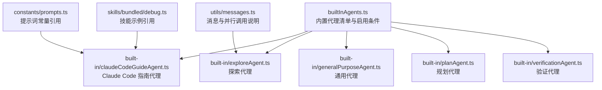
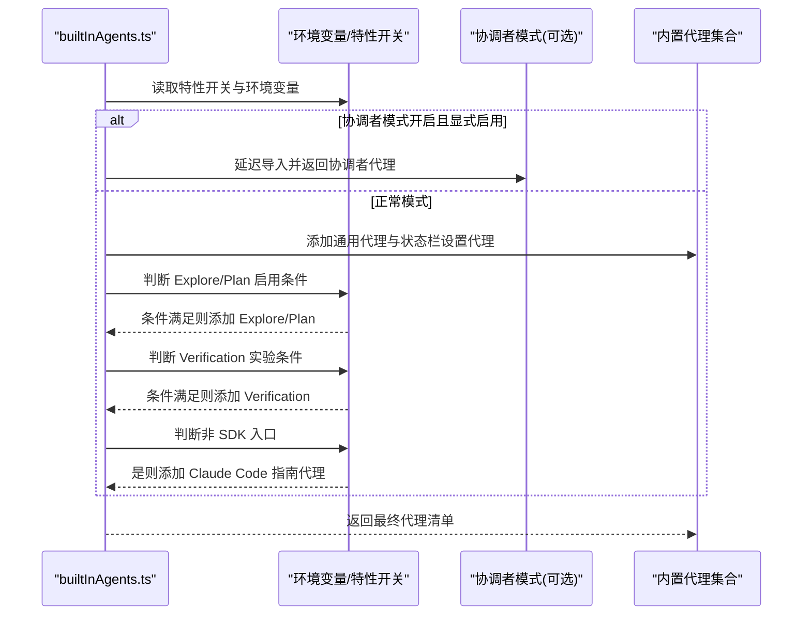
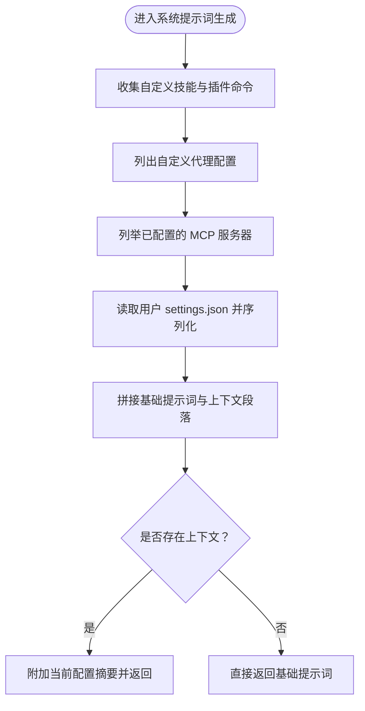
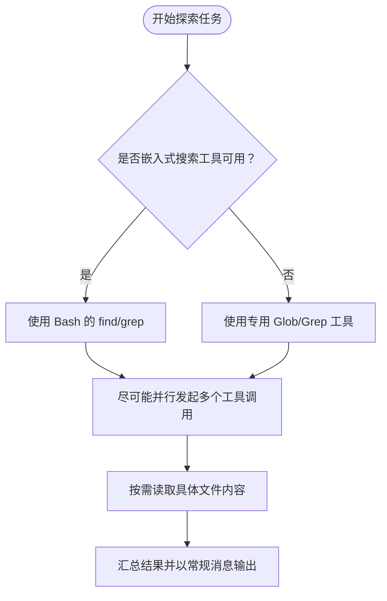
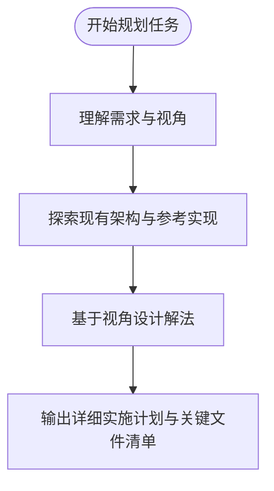
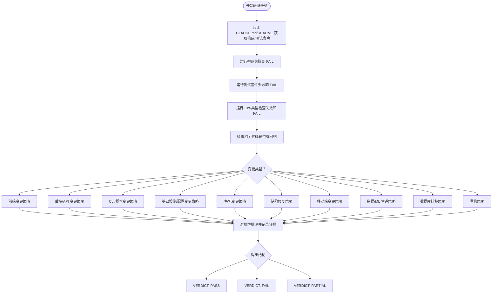
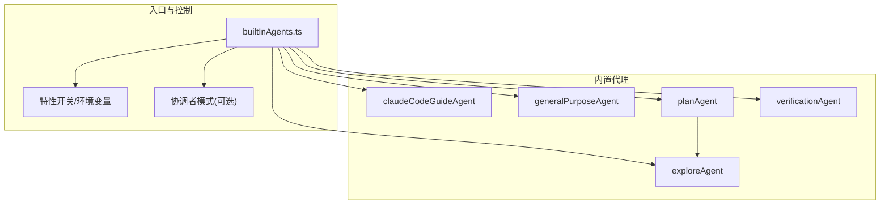
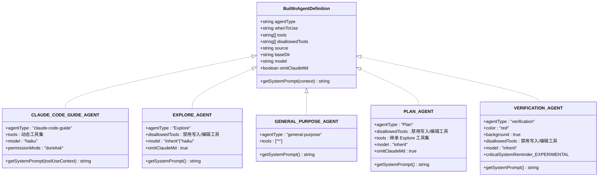

# 内置代理

<cite>
**本文引用的文件**
- [builtInAgents.ts](file://src/tools/AgentTool/builtInAgents.ts)
- [claudeCodeGuideAgent.ts](file://src/tools/AgentTool/built-in/claudeCodeGuideAgent.ts)
- [exploreAgent.ts](file://src/tools/AgentTool/built-in/exploreAgent.ts)
- [generalPurposeAgent.ts](file://src/tools/AgentTool/built-in/generalPurposeAgent.ts)
- [planAgent.ts](file://src/tools/AgentTool/built-in/planAgent.ts)
- [verificationAgent.ts](file://src/tools/AgentTool/built-in/verificationAgent.ts)
- [messages.ts](file://src/utils/messages.ts)
- [prompts.ts](file://src/constants/prompts.ts)
- [debug.ts](file://src/skills/bundled/debug.ts)
- [loadAgentsDir.js](file://src/tools/AgentTool/loadAgentsDir.js)
- [types.ts](file://src/components/agents/types.ts)
- [generateAgent.ts](file://src/components/agents/generateAgent.ts)
- [validateAgent.ts](file://src/components/agents/validateAgent.ts)
- [utils.ts](file://src/components/agents/utils.ts)
- [agentFileUtils.ts](file://src/components/agents/agentFileUtils.ts)
</cite>

## 目录
1. [简介](#简介)
2. [项目结构](#项目结构)
3. [核心组件](#核心组件)
4. [架构总览](#架构总览)
5. [详细组件分析](#详细组件分析)
6. [依赖关系分析](#依赖关系分析)
7. [性能考量](#性能考量)
8. [故障排查指南](#故障排查指南)
9. [结论](#结论)
10. [附录](#附录)

## 简介
本文件系统性介绍 Claude Code 提供的内置代理，涵盖以下类型：claudeCodeGuideAgent、exploreAgent、generalPurposeAgent、planAgent、verificationAgent。内容包括各代理的功能特性、适用场景、配置与提示词设计、行为逻辑与决策机制、定制化方法（参数调整、功能扩展、行为修改）、使用示例与最佳实践、代理选择指南以及性能优化建议。目标是为用户提供完整的内置代理使用手册，同时帮助开发者理解其实现原理并进行安全可控的扩展。

## 项目结构
内置代理位于 AgentTool 的 built-in 目录中，并通过集中入口进行加载与启用控制。关键文件如下：
- builtInAgents.ts：内置代理清单与启用条件（特性开关、环境变量、入口点类型）
- built-in/*.ts：各内置代理定义（提示词、工具集、模型策略、限制规则）
- utils/messages.ts：在会话消息中对 Explore Agent 的并行调用与使用方式进行说明
- constants/prompts.ts：引用内置代理模块（用于集成或调试）
- skills/bundled/debug.ts：示例中引用内置代理类型常量
- 组件层：agents 目录下的类型、生成器、校验器与工具函数，支撑代理的可视化编辑与持久化

图表来源
- [builtInAgents.ts:22-72](file://src/tools/AgentTool/builtInAgents.ts#L22-L72)
- [claudeCodeGuideAgent.ts:98-205](file://src/tools/AgentTool/built-in/claudeCodeGuideAgent.ts#L98-L205)
- [exploreAgent.ts:64-83](file://src/tools/AgentTool/built-in/exploreAgent.ts#L64-L83)
- [generalPurposeAgent.ts:25-34](file://src/tools/AgentTool/built-in/generalPurposeAgent.ts#L25-L34)
- [planAgent.ts:73-92](file://src/tools/AgentTool/built-in/planAgent.ts#L73-L92)
- [verificationAgent.ts:134-152](file://src/tools/AgentTool/built-in/verificationAgent.ts#L134-L152)
- [messages.ts:3221-3242](file://src/utils/messages.ts#L3221-L3242)
- [prompts.ts:39](file://src/constants/prompts.ts#L39)
- [debug.ts:1](file://src/skills/bundled/debug.ts#L1)

章节来源
- [builtInAgents.ts:13-72](file://src/tools/AgentTool/builtInAgents.ts#L13-L72)
- [messages.ts:3221-3242](file://src/utils/messages.ts#L3221-L3242)
- [prompts.ts:39](file://src/constants/prompts.ts#L39)
- [debug.ts:1](file://src/skills/bundled/debug.ts#L1)

## 核心组件
本节概述五类内置代理的职责与能力边界：
- Claude Code 指南代理（claudeCodeGuideAgent）：面向用户引导与知识检索，结合项目上下文动态生成系统提示词，优先引用官方文档并可回退到本地文件搜索。
- 探索代理（exploreAgent）：只读快速探索代码库，禁止任何写操作；支持并行工具调用以提升效率；根据构建类型自动切换搜索工具。
- 通用代理（generalPurposeAgent）：多步骤研究与文件搜索的通用执行者，强调“先广后深”的搜索策略与避免无意义的文件创建。
- 规划代理（planAgent）：软件架构与实现规划专家，仅限只读探索与设计，输出关键实现文件清单与步骤分解。
- 验证代理（verificationAgent）：对抗式验证，严格禁止对项目目录进行修改，要求提供可复现实验命令与证据，产出 PASS/FAIL/PARTIAL 结论。

章节来源
- [claudeCodeGuideAgent.ts:98-205](file://src/tools/AgentTool/built-in/claudeCodeGuideAgent.ts#L98-L205)
- [exploreAgent.ts:64-83](file://src/tools/AgentTool/built-in/exploreAgent.ts#L64-L83)
- [generalPurposeAgent.ts:25-34](file://src/tools/AgentTool/built-in/generalPurposeAgent.ts#L25-L34)
- [planAgent.ts:73-92](file://src/tools/AgentTool/built-in/planAgent.ts#L73-L92)
- [verificationAgent.ts:134-152](file://src/tools/AgentTool/built-in/verificationAgent.ts#L134-L152)

## 架构总览
内置代理由统一入口加载，依据特性开关、环境变量与运行模式决定是否启用及如何启用。Explore/Plan 两类代理在特定条件下才被加入清单；Verification 在特定实验条件下启用；Guide 代理在非 SDK 入口时默认包含。

图表来源
- [builtInAgents.ts:22-72](file://src/tools/AgentTool/builtInAgents.ts#L22-L72)

章节来源
- [builtInAgents.ts:13-72](file://src/tools/AgentTool/builtInAgents.ts#L13-L72)

## 详细组件分析

### Claude Code 指南代理（claudeCodeGuideAgent）
- 功能特点
  - 聚焦于 Claude Code CLI、Agent SDK、Claude API 的使用指导与最佳实践。
  - 动态构建系统提示词，整合自定义技能、自定义代理、MCP 服务器、插件命令与用户设置。
  - 优先从官方文档映射页抓取信息，必要时使用网络搜索与本地文件检索。
- 适用场景
  - 用户询问安装、配置、快捷键、钩子、技能、MCP、IDE 集成、设置、子代理与插件等主题。
  - 当存在正在运行或最近完成的同类型代理时，应优先继续对话而非新建。
- 工具集
  - 根据构建类型自动选择 Bash 或专用搜索工具（Glob/Grep），并包含文件读取、网页抓取与搜索工具。
- 提示词设计
  - 基础提示词定义了三个领域的权威知识来源与工作流程。
  - 反馈指引根据第三方服务（Bedrock/Vertex/Foundry）使用情况动态调整。
  - 上下文注入：自定义技能、自定义代理、MCP 客户端、插件命令、用户设置。
- 行为与决策
  - 严格遵循“优先官方文档”的原则；当无法覆盖时，使用网络搜索与本地文件辅助回答。
  - 对用户未发现的功能或问题，提供明确的反馈渠道或问题报告路径。
- 定制化方法
  - 通过系统提示词工厂函数注入更多上下文（如团队记忆、项目历史）。
  - 调整工具集以适配不同环境（例如嵌入式搜索工具可用时优先 Bash）。
  - 修改模型选择策略（当前固定为较低成本模型以提升响应速度）。

图表来源
- [claudeCodeGuideAgent.ts:121-204](file://src/tools/AgentTool/built-in/claudeCodeGuideAgent.ts#L121-L204)

章节来源
- [claudeCodeGuideAgent.ts:23-87](file://src/tools/AgentTool/built-in/claudeCodeGuideAgent.ts#L23-L87)
- [claudeCodeGuideAgent.ts:98-205](file://src/tools/AgentTool/built-in/claudeCodeGuideAgent.ts#L98-L205)

### 探索代理（exploreAgent）
- 功能特点
  - 专长于快速探索代码库：按模式查找文件、按关键字搜索代码、按需读取文件内容。
  - 明确的只读约束：禁止一切写操作（创建、编辑、删除、移动、重定向写入等）。
  - 支持并行工具调用以提高效率；根据构建类型自动选择 Bash 或专用搜索工具。
- 适用场景
  - 快速定位文件（如按通配符）、关键词检索（正则表达式）、回答关于代码库的问题。
  - 建议指定“快速/中等/非常彻底”等细致程度，以便代理调整策略。
- 工具集与限制
  - 默认允许：搜索与读取工具；明确禁用：代理工具、退出计划模式工具、文件编辑/写入/笔记本编辑工具。
  - 模型策略：Ant 用户继承主代理模型；外部用户使用轻量模型以加速。
  - 上下文策略：omitClaudeMd=true，减少令牌占用但不影响对 CLAUDE.md 的直接读取。
- 行为与决策
  - 强调“高效利用工具”，在保证质量的前提下尽量减少调用次数。
  - 输出应直接作为常规消息呈现，不尝试创建文件。
- 定制化方法
  - 可通过系统提示词工厂函数扩展搜索策略或输出格式。
  - 在需要更严格的只读约束时，可进一步收紧 disallowedTools。
  - 根据项目规模与复杂度调整并行调用策略（由上层消息层控制并行数量）。

图表来源
- [exploreAgent.ts:13-57](file://src/tools/AgentTool/built-in/exploreAgent.ts#L13-L57)
- [exploreAgent.ts:64-83](file://src/tools/AgentTool/built-in/exploreAgent.ts#L64-L83)

章节来源
- [exploreAgent.ts:13-83](file://src/tools/AgentTool/built-in/exploreAgent.ts#L13-L83)
- [messages.ts:3221-3242](file://src/utils/messages.ts#L3221-L3242)

### 通用代理（generalPurposeAgent）
- 功能特点
  - 多步骤研究与复杂问题调查的通用执行者。
  - 强调“先广后深”的搜索策略：不确定匹配时先广泛搜索，再逐步收敛。
  - 明确避免无意义的文件创建，优先编辑现有文件。
- 适用场景
  - 需要跨多个文件进行系统性分析与推理的任务。
  - 关键字或文件搜索不确定性较高时，交由该代理进行多策略探索。
- 工具集与模型
  - 默认允许全部工具（通配符），便于灵活执行。
  - 模型未显式指定，采用默认子代理模型策略。
- 行为与决策
  - 不过度包装，完成即止；仅提供必要摘要。
  - 避免主动创建文档文件（除非明确要求）。
- 定制化方法
  - 可通过系统提示词工厂函数增加领域特定的约束或输出模板。
  - 在高风险项目中可限制工具集以降低误操作概率。

章节来源
- [generalPurposeAgent.ts:19-34](file://src/tools/AgentTool/built-in/generalPurposeAgent.ts#L19-L34)

### 规划代理（planAgent）
- 功能特点
  - 软件架构与实现规划专家，专注于“只读探索与设计”。
  - 严格禁止任何写操作，必须在完成后提供关键实现文件清单与步骤分解。
- 适用场景
  - 需要设计实现方案、识别关键文件、考虑架构权衡与依赖顺序时。
- 工具集与限制
  - 工具集与探索代理一致，但明确禁用写入与编辑工具。
  - 模型策略：继承主代理模型；omitClaudeMd=true，节省令牌。
- 行为与决策
  - 四步法：理解需求、探索架构、设计解法、详细计划。
  - 输出必须包含“实现所需的关键文件清单”。
- 定制化方法
  - 可在系统提示词中引入特定视角（如安全性、性能、可维护性）以影响设计方案。

图表来源
- [planAgent.ts:14-71](file://src/tools/AgentTool/built-in/planAgent.ts#L14-L71)
- [planAgent.ts:73-92](file://src/tools/AgentTool/built-in/planAgent.ts#L73-L92)

章节来源
- [planAgent.ts:14-92](file://src/tools/AgentTool/built-in/planAgent.ts#L14-L92)

### 验证代理（verificationAgent）
- 功能特点
  - 对实现进行对抗式验证，目标是“发现最后 20% 的问题”。
  - 严禁对项目目录进行任何修改（含临时文件），仅允许在临时目录中编写一次性脚本。
  - 要求提供可复现实验命令与证据，产出 PASS/FAIL/PARTIAL。
- 适用场景
  - 非平凡变更（3+ 文件修改、后端/API/基础设施变更）完成后，进行独立验证。
  - 需要端到端测试、并发与边界值检查、幂等性与孤儿操作检测等。
- 工具集与限制
  - 明确禁用：代理工具、退出计划模式工具、文件编辑/写入/笔记本编辑工具。
  - 模型策略：继承主代理模型。
  - 输出格式严格：每个检查必须包含“命令运行”、“观察输出”、“结果”三要素。
- 行为与决策
  - 通用基线：构建失败即 FAIL；测试套件失败即 FAIL；Lint/类型检查失败即 FAIL；回归检查失败即 FAIL。
  - 类型特定策略：前端、后端、CLI、基础设施、库、缺陷修复、移动端、数据/ML 管道、数据库迁移、重构等。
  - 必须包含至少一次对抗性探测（并发、边界、幂等、孤儿操作等）。
- 定制化方法
  - 可在系统提示词中补充特定变更类型的验证策略细节。
  - 在工具可用时充分利用浏览器自动化、网页抓取等能力进行验证。

图表来源
- [verificationAgent.ts:10-152](file://src/tools/AgentTool/built-in/verificationAgent.ts#L10-L152)

章节来源
- [verificationAgent.ts:10-152](file://src/tools/AgentTool/built-in/verificationAgent.ts#L10-L152)

## 依赖关系分析
内置代理的加载与启用依赖于特性开关、环境变量与运行模式；Explore/Plan/Verification 的启用受实验条件控制；Guide 代理在非 SDK 入口时默认包含。Explore/Plan 代理共享搜索工具集，规划代理复用探索代理的工具集。

图表来源
- [builtInAgents.ts:22-72](file://src/tools/AgentTool/builtInAgents.ts#L22-L72)
- [planAgent.ts:12](file://src/tools/AgentTool/built-in/planAgent.ts#L12)

章节来源
- [builtInAgents.ts:13-72](file://src/tools/AgentTool/builtInAgents.ts#L13-L72)
- [planAgent.ts:12](file://src/tools/AgentTool/built-in/planAgent.ts#L12)

## 性能考量
- 模型选择
  - Explore/Plan/Verification 在外部用户场景默认使用轻量模型以提升响应速度；Ant 用户继承主代理模型以获得更强能力。
- 工具并行
  - Explore/Plan 代理鼓励并行工具调用以缩短总耗时；消息层会根据配置限制最大并行数，避免资源争用。
- 上下文裁剪
  - Explore/Plan/Verification 将 omitClaudeMd 设为 true，减少令牌消耗；Guide 代理在有上下文时才附加配置摘要。
- 令牌预算
  - Guide 代理在上下文较多时会序列化 settings.json，注意控制设置体量；Explore/Plan/Verification 的系统提示词较长，建议在高负载场景适当裁剪上下文。

章节来源
- [exploreAgent.ts:76-81](file://src/tools/AgentTool/built-in/exploreAgent.ts#L76-L81)
- [planAgent.ts:87-90](file://src/tools/AgentTool/built-in/planAgent.ts#L87-L90)
- [verificationAgent.ts:134-152](file://src/tools/AgentTool/built-in/verificationAgent.ts#L134-L152)
- [claudeCodeGuideAgent.ts:173-180](file://src/tools/AgentTool/built-in/claudeCodeGuideAgent.ts#L173-L180)
- [messages.ts:3221-3242](file://src/utils/messages.ts#L3221-L3242)

## 故障排查指南
- Explore/Plan 代理未出现
  - 检查特性开关与环境变量是否满足启用条件；确认非交互模式下未被禁用。
  - 确认当前入口点类型是否允许包含 Guide 代理。
- Explore 代理报错“禁止写操作”
  - 确认未尝试使用文件编辑/写入工具；仅使用只读工具（Bash/Glob/Grep/FileRead）。
- Guide 代理上下文缺失
  - 检查 settings.json 是否过大导致序列化开销过高；确认自定义技能/代理/MCP 客户端是否正确注册。
- Verification 代理无法执行某些检查
  - 确认会话中是否具备相应工具（如浏览器自动化、网页抓取等）；检查临时目录权限与清理策略。
- 代理提示词异常
  - 检查系统提示词工厂函数是否正确注入上下文；确保工具名称与实际可用工具一致。

章节来源
- [builtInAgents.ts:13-72](file://src/tools/AgentTool/builtInAgents.ts#L13-L72)
- [exploreAgent.ts:67-73](file://src/tools/AgentTool/built-in/exploreAgent.ts#L67-L73)
- [verificationAgent.ts:139-151](file://src/tools/AgentTool/built-in/verificationAgent.ts#L139-L151)
- [claudeCodeGuideAgent.ts:121-204](file://src/tools/AgentTool/built-in/claudeCodeGuideAgent.ts#L121-L204)

## 结论
内置代理围绕“只读探索—通用执行—规划设计—对抗验证”的闭环构建，既满足日常开发中的快速检索与执行需求，又在关键变更后提供严谨的验证保障。通过特性开关、环境变量与运行模式的组合，系统实现了灵活的启用策略；通过系统提示词工厂与工具集裁剪，提供了强大的定制空间。建议在生产环境中优先使用 Explore/Plan 进行探索与设计，再以 Verification 进行独立验证，最后由 Guide 代理提供上下文化的使用指导。

## 附录

### 使用示例与最佳实践
- 快速定位文件
  - 使用 Explore 代理，指定“快速/中等/非常彻底”等细致程度；在嵌入式搜索可用时优先使用 Bash 的 find/grep。
- 复杂问题研究
  - 使用通用代理进行多步骤研究；先广泛搜索，再逐步收敛；避免无意义的文件创建。
- 设计实现方案
  - 使用规划代理输出步骤分解与关键文件清单；严格遵守只读约束。
- 变更后验证
  - 对非平凡变更使用验证代理；提供可复现实验命令与证据；包含对抗性探测。
- 用户引导
  - 使用 Guide 代理回答安装、配置、快捷键、钩子、技能、MCP、IDE 集成、设置等问题；优先引用官方文档。

章节来源
- [exploreAgent.ts:61-62](file://src/tools/AgentTool/built-in/exploreAgent.ts#L61-L62)
- [generalPurposeAgent.ts:27-28](file://src/tools/AgentTool/built-in/generalPurposeAgent.ts#L27-L28)
- [planAgent.ts:75-76](file://src/tools/AgentTool/built-in/planAgent.ts#L75-L76)
- [verificationAgent.ts:131-132](file://src/tools/AgentTool/built-in/verificationAgent.ts#L131-L132)
- [claudeCodeGuideAgent.ts:99-100](file://src/tools/AgentTool/built-in/claudeCodeGuideAgent.ts#L99-L100)

### 代理选择指南
- 需要快速探索代码库：选择 Explore 代理
- 需要通用执行与研究：选择通用代理
- 需要设计实现方案：选择规划代理
- 需要独立验证：选择验证代理
- 需要使用指导与知识检索：选择 Guide 代理

章节来源
- [builtInAgents.ts:22-72](file://src/tools/AgentTool/builtInAgents.ts#L22-L72)

### 定制化方法
- 参数调整
  - 模型策略：根据场景选择轻量模型或继承主代理模型。
  - 工具集：在系统提示词工厂中增删工具，或通过 disallowedTools 限制危险操作。
  - 上下文注入：在 Guide 代理中动态拼接自定义技能、代理、MCP、插件与设置。
- 功能扩展
  - 新增类型：在 AgentTool 的加载器中注册新代理定义（参考内置代理的结构）。
  - 提示词增强：在系统提示词工厂中加入领域特定约束与输出模板。
- 行为修改
  - 通过特性开关与环境变量控制启用范围。
  - 在消息层调整 Explore/Plan 的并行数量与超时策略。

章节来源
- [claudeCodeGuideAgent.ts:121-204](file://src/tools/AgentTool/built-in/claudeCodeGuideAgent.ts#L121-L204)
- [exploreAgent.ts:67-73](file://src/tools/AgentTool/built-in/exploreAgent.ts#L67-L73)
- [planAgent.ts:77-83](file://src/tools/AgentTool/built-in/planAgent.ts#L77-L83)
- [verificationAgent.ts:139-151](file://src/tools/AgentTool/built-in/verificationAgent.ts#L139-L151)
- [builtInAgents.ts:13-72](file://src/tools/AgentTool/builtInAgents.ts#L13-L72)

### 代码级关系图

图表来源
- [types.ts](file://src/components/agents/types.ts)
- [claudeCodeGuideAgent.ts:98-205](file://src/tools/AgentTool/built-in/claudeCodeGuideAgent.ts#L98-L205)
- [exploreAgent.ts:64-83](file://src/tools/AgentTool/built-in/exploreAgent.ts#L64-L83)
- [generalPurposeAgent.ts:25-34](file://src/tools/AgentTool/built-in/generalPurposeAgent.ts#L25-L34)
- [planAgent.ts:73-92](file://src/tools/AgentTool/built-in/planAgent.ts#L73-L92)
- [verificationAgent.ts:134-152](file://src/tools/AgentTool/built-in/verificationAgent.ts#L134-L152)