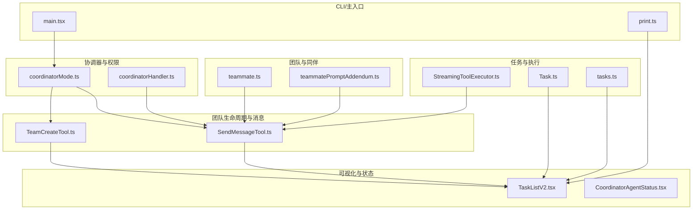
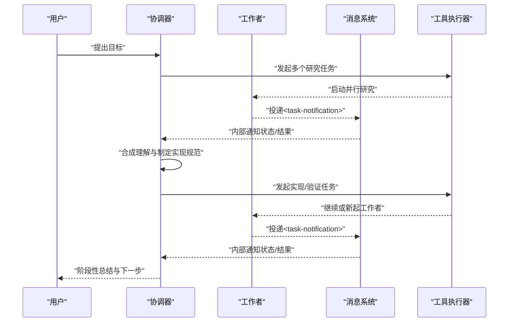
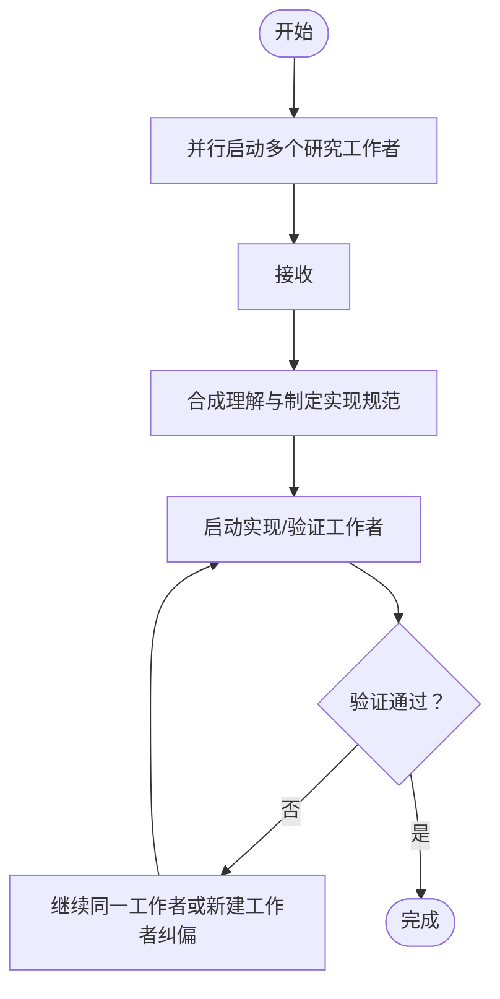
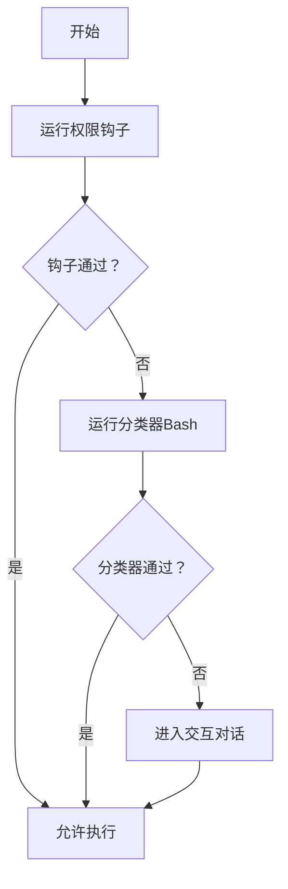
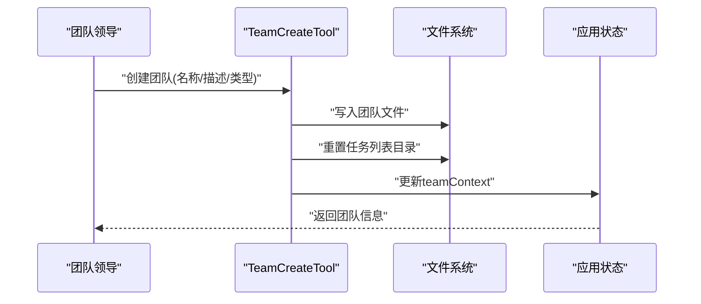
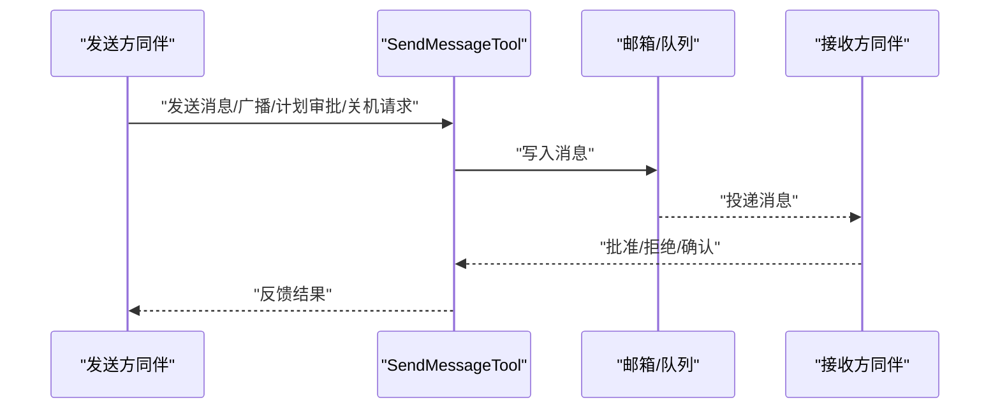
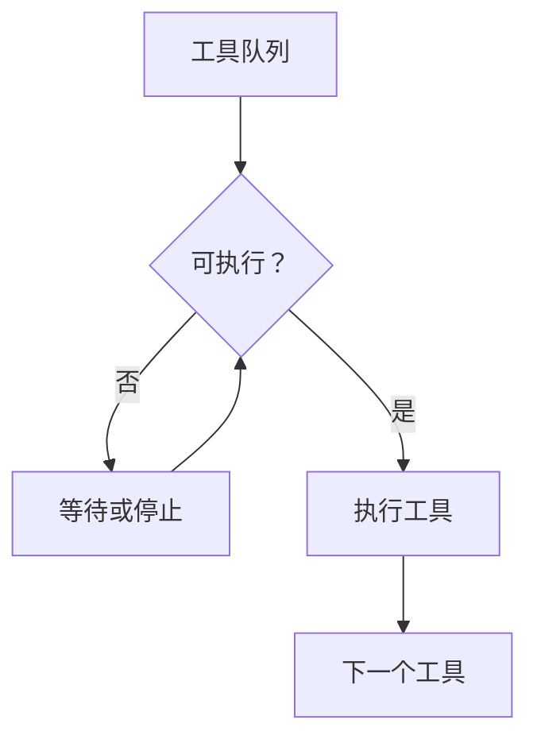
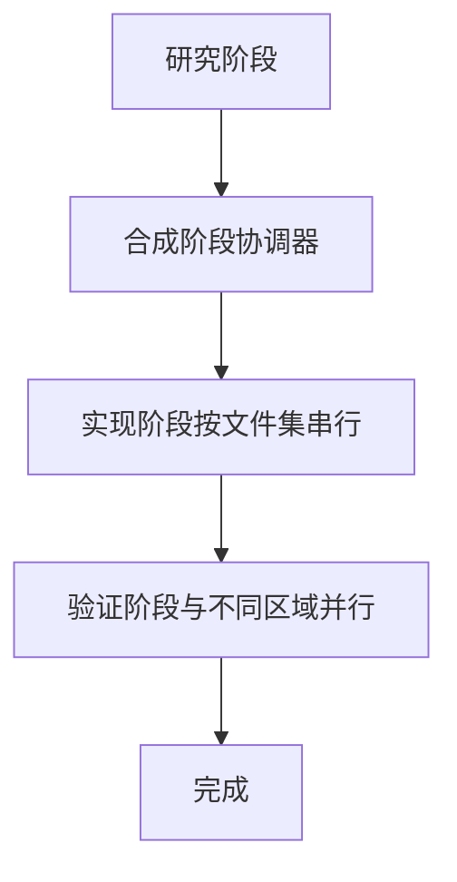
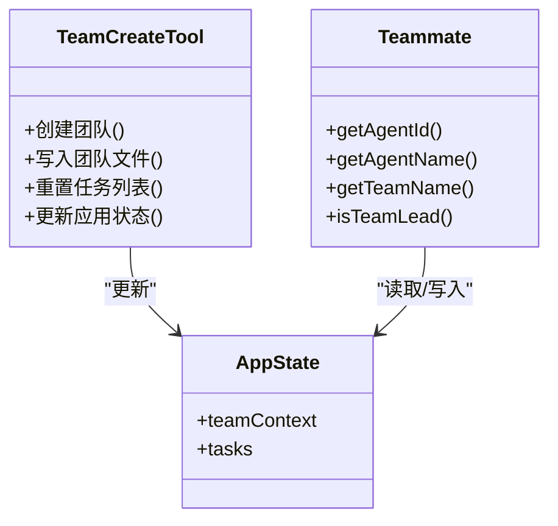
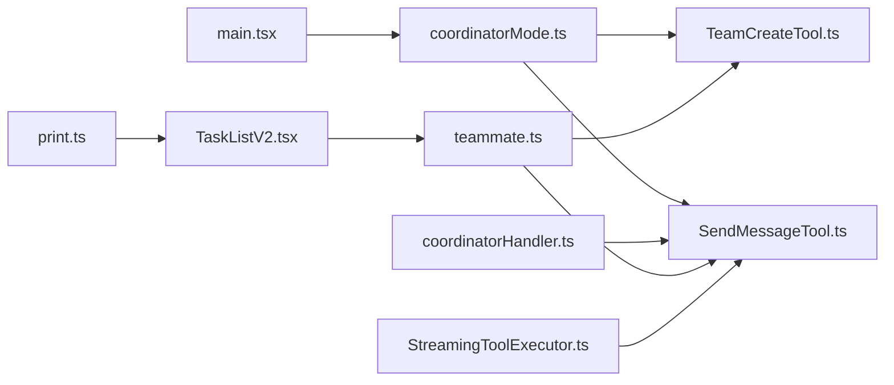

# 团队协调机制

<cite>
**本文引用的文件**
- [coordinatorMode.ts](file://src/coordinator/coordinatorMode.ts)
- [coordinatorHandler.ts](file://src/hooks/toolPermission/handlers/coordinatorHandler.ts)
- [teammate.ts](file://src/utils/teammate.ts)
- [teammatePromptAddendum.ts](file://src/utils/swarm/teammatePromptAddendum.ts)
- [TeamCreateTool.ts](file://src/tools/TeamCreateTool/TeamCreateTool.ts)
- [SendMessageTool.ts](file://src/tools/SendMessageTool/SendMessageTool.ts)
- [Task.ts](file://src/Task.ts)
- [tasks.ts](file://src/tasks.ts)
- [StreamingToolExecutor.ts](file://src/services/tools/StreamingToolExecutor.ts)
- [TaskListV2.tsx](file://src/components/TaskListV2.tsx)
- [CoordinatorAgentStatus.tsx](file://src/components/CoordinatorAgentStatus.tsx)
- [print.ts](file://src/cli/print.ts)
- [main.tsx](file://src/main.tsx)
</cite>

## 目录
1. [简介](#简介)
2. [项目结构](#项目结构)
3. [核心组件](#核心组件)
4. [架构总览](#架构总览)
5. [详细组件分析](#详细组件分析)
6. [依赖关系分析](#依赖关系分析)
7. [性能考量](#性能考量)
8. [故障排查指南](#故障排查指南)
9. [结论](#结论)
10. [附录](#附录)

## 简介
本文件系统化阐述团队协调机制的设计与实现，聚焦多代理协调器（Coordinator）的角色、职责与工作原理；任务分配与调度（任务类型识别、代理选择与负载均衡）；并行工作协调（任务分解、结果整合、冲突解决）；以及团队代理的创建与管理（团队配置、成员管理、协作模式）。同时给出性能优化与故障处理策略，为团队代理开发者与系统管理员提供技术指导。

## 项目结构
围绕团队协调的关键模块分布如下：
- 协调器模式与系统提示：coordinatorMode.ts 提供协调器模式开关、用户上下文与系统提示，定义协调器角色、工具集与工作流。
- 协调器权限处理：coordinatorHandler.ts 定义协调器工作者的权限检查流程（钩子+分类器），确保自动化与交互式决策的顺序与回退。
- 团队与同伴（Teammate）工具链：teammate.ts 提供同伴身份解析、动态上下文、领导判定与在进程同伴的空闲等待等能力；teammatePromptAddendum.ts 为同伴补充系统提示，强调通信约束。
- 团队生命周期与消息传递：TeamCreateTool.ts 负责团队创建与任务列表初始化；SendMessageTool.ts 实现同伴间消息、广播、计划审批与关机请求/响应协议。
- 任务与执行：Task.ts 定义任务类型与状态；tasks.ts 汇总任务类型；StreamingToolExecutor.ts 控制工具并发执行与排队。
- 可视化与状态：TaskListV2.tsx 展示任务面板与同伴活动；CoordinatorAgentStatus.tsx 提供可见任务筛选与计数。
- CLI/主入口集成：main.tsx 条件加载协调器模式；print.ts 在非交互模式下对后台任务进行节流与结果延迟输出，避免提前结束导致的并发问题。

**图表来源**
- [coordinatorMode.ts:111-370](file://src/coordinator/coordinatorMode.ts#L111-L370)
- [coordinatorHandler.ts:26-66](file://src/hooks/toolPermission/handlers/coordinatorHandler.ts#L26-L66)
- [teammate.ts:1-293](file://src/utils/teammate.ts#L1-L293)
- [teammatePromptAddendum.ts:8-19](file://src/utils/swarm/teammatePromptAddendum.ts#L8-L19)
- [TeamCreateTool.ts:74-241](file://src/tools/TeamCreateTool/TeamCreateTool.ts#L74-L241)
- [SendMessageTool.ts:520-918](file://src/tools/SendMessageTool/SendMessageTool.ts#L520-L918)
- [Task.ts:6-57](file://src/Task.ts#L6-L57)
- [tasks.ts:17-39](file://src/tasks.ts#L17-L39)
- [StreamingToolExecutor.ts:123-151](file://src/services/tools/StreamingToolExecutor.ts#L123-L151)
- [TaskListV2.tsx:65-336](file://src/components/TaskListV2.tsx#L65-L336)
- [CoordinatorAgentStatus.tsx:31-43](file://src/components/CoordinatorAgentStatus.tsx#L31-L43)
- [main.tsx:75-82](file://src/main.tsx#L75-L82)
- [print.ts:2216-2254](file://src/cli/print.ts#L2216-L2254)

**章节来源**
- [coordinatorMode.ts:111-370](file://src/coordinator/coordinatorMode.ts#L111-L370)
- [coordinatorHandler.ts:26-66](file://src/hooks/toolPermission/handlers/coordinatorHandler.ts#L26-L66)
- [teammate.ts:1-293](file://src/utils/teammate.ts#L1-L293)
- [teammatePromptAddendum.ts:8-19](file://src/utils/swarm/teammatePromptAddendum.ts#L8-L19)
- [TeamCreateTool.ts:74-241](file://src/tools/TeamCreateTool/TeamCreateTool.ts#L74-L241)
- [SendMessageTool.ts:520-918](file://src/tools/SendMessageTool/SendMessageTool.ts#L520-L918)
- [Task.ts:6-57](file://src/Task.ts#L6-L57)
- [tasks.ts:17-39](file://src/tasks.ts#L17-L39)
- [StreamingToolExecutor.ts:123-151](file://src/services/tools/StreamingToolExecutor.ts#L123-L151)
- [TaskListV2.tsx:65-336](file://src/components/TaskListV2.tsx#L65-L336)
- [CoordinatorAgentStatus.tsx:31-43](file://src/components/CoordinatorAgentStatus.tsx#L31-L43)
- [main.tsx:75-82](file://src/main.tsx#L75-L82)
- [print.ts:2216-2254](file://src/cli/print.ts#L2216-L2254)

## 核心组件
- 协调器模式与系统提示
  - 协调器模式开关与会话匹配：通过环境变量与特性门控控制是否启用协调器模式，并在会话恢复时切换以保持一致性。
  - 用户上下文与工具集：根据简单模式或标准模式生成工作者可用工具清单，并可附加 MCP 服务器工具与草稿区（scratchpad）能力说明。
  - 工作流与并发策略：明确研究、合成、实现、验证四阶段；并行是关键能力，读取类任务自由并行，写入类任务按文件集串行，验证可与不同区域实现并行。
- 权限自动化与回退
  - 顺序执行：先运行权限钩子（本地快速检查），再尝试分类器（慢推理，仅 Bash 场景）；失败则进入交互对话。
- 团队创建与任务列表
  - 创建团队：生成唯一团队名、确定团队领导代理 ID、写入团队文件、重置任务列表目录、注册清理、更新应用状态。
  - 任务列表：每个团队对应一个任务列表（Team = Project = TaskList），保证跨同伴一致的编号与存储。
- 同伴身份与通信
  - 身份解析：支持在进程同伴（AsyncLocalStorage）与 tmux/iTerm2 同伴（动态上下文）两种形态；领导判定基于团队上下文与代理 ID。
  - 通信协议：SendMessage 工具支持点对点消息、广播、计划审批请求/响应、关机请求/批准/拒绝；支持跨会话桥接（Remote Control）与本地 UDS 发送。
- 任务与执行
  - 任务类型与状态：统一的任务基元与终端态判断，用于死任务注入防护与清理路径。
  - 并发执行：工具执行器按并发安全策略排队执行，非并发工具需等待当前执行完成或全部并发安全。
- 可视化与状态
  - 任务面板：展示任务状态、所有者颜色、阻塞关系与近期活动摘要；支持截断与隐藏统计。
  - 协调器任务计数：过滤可见任务并排序，便于面板渲染与索引。

**章节来源**
- [coordinatorMode.ts:36-109](file://src/coordinator/coordinatorMode.ts#L36-L109)
- [coordinatorHandler.ts:26-66](file://src/hooks/toolPermission/handlers/coordinatorHandler.ts#L26-L66)
- [TeamCreateTool.ts:128-237](file://src/tools/TeamCreateTool/TeamCreateTool.ts#L128-L237)
- [Task.ts:6-57](file://src/Task.ts#L6-L57)
- [StreamingToolExecutor.ts:123-151](file://src/services/tools/StreamingToolExecutor.ts#L123-L151)
- [TaskListV2.tsx:65-336](file://src/components/TaskListV2.tsx#L65-L336)
- [CoordinatorAgentStatus.tsx:31-43](file://src/components/CoordinatorAgentStatus.tsx#L31-L43)

## 架构总览
协调器作为多代理系统的中枢，负责：
- 角色与职责
  - 代表用户目标，驱动工作者并行研究、实现与验证。
  - 通过系统提示与工具集约束工作者行为，避免重复与无效劳动。
- 工作原理
  - 任务分解：将复杂目标拆分为研究、合成、实现、验证阶段。
  - 并行执行：利用工作者异步特性，最大化并行度；对写密集型任务采用串行化以避免冲突。
  - 结果整合：汇总工作者报告，形成最终结论与下一步指令。
  - 冲突解决：当工作者失败或方向错误时，通过继续（continue）或停止（stop）进行纠偏。

**图表来源**
- [coordinatorMode.ts:116-250](file://src/coordinator/coordinatorMode.ts#L116-L250)
- [SendMessageTool.ts:149-266](file://src/tools/SendMessageTool/SendMessageTool.ts#L149-L266)
- [StreamingToolExecutor.ts:123-151](file://src/services/tools/StreamingToolExecutor.ts#L123-L151)

## 详细组件分析

### 组件A：协调器模式与系统提示
- 设计理念
  - 明确角色定位：协调者负责帮助用户达成目标、指导工作者、综合结果并向用户沟通。
  - 工具边界：严格限制工具使用方式，避免工作者互相检查、重复报告文件内容或运行无意义命令。
  - 并发策略：读取类任务自由并行；写入类任务按文件集串行；验证可与不同区域实现并行。
- 关键要点
  - 任务通知格式：工作者结果以特定 XML 标签包裹，协调器据此区分内部信号与用户消息。
  - 提示撰写：要求工作者自包含上下文，避免“基于你的发现”等委托性表述；明确“完成”的标准。
  - 继续/新建：根据上下文重叠度决定继续或新建工作者，减少噪声与错误锚定。
- 适用场景
  - 复杂缺陷修复：并行研究多个角度，随后合成规范并行实现与验证。
  - 需求变更：中途停止错误方向的工作，纠正后继续。

**图表来源**
- [coordinatorMode.ts:116-250](file://src/coordinator/coordinatorMode.ts#L116-L250)

**章节来源**
- [coordinatorMode.ts:111-370](file://src/coordinator/coordinatorMode.ts#L111-L370)

### 组件B：权限自动化与回退（协调器工作者）
- 设计理念
  - 自动化优先：本地钩子快速通过；慢推理分类器仅在必要时触发。
  - 失败回退：自动化检查异常或未决时，进入交互对话，保障用户体验与可控性。
- 关键要点
  - 顺序执行：钩子→分类器→对话；异常捕获并记录，不影响后续流程。
  - 上下文保留：即使失败也消耗钩子与分类器，避免重复开销。
- 适用场景
  - Bash 类操作的自动化审批；其他场景的交互式确认。

**图表来源**
- [coordinatorHandler.ts:26-66](file://src/hooks/toolPermission/handlers/coordinatorHandler.ts#L26-L66)

**章节来源**
- [coordinatorHandler.ts:26-66](file://src/hooks/toolPermission/handlers/coordinatorHandler.ts#L26-L66)

### 组件C：团队创建与成员管理
- 设计理念
  - 唯一团队：领导者只能管理一个团队；若已存在则报错。
  - 唯一命名：若名称冲突，自动生成唯一词缀名。
  - 任务隔离：每个团队拥有独立任务列表目录，编号从 1 开始。
  - 清理策略：注册会话清理，避免遗留团队文件。
- 关键要点
  - 团队文件：记录团队名、描述、创建时间、领导代理 ID、会话 ID、成员列表等。
  - 应用状态：更新 teamContext，包含团队名、文件路径、领导代理 ID 与同伴映射。
  - 领导判定：基于 AppState 中的 leadAgentId 与当前代理 ID 判断。
- 适用场景
  - 新项目启动：创建团队并初始化任务列表。
  - 多团队并行：为不同项目/分支维护独立团队与任务空间。

**图表来源**
- [TeamCreateTool.ts:128-237](file://src/tools/TeamCreateTool/TeamCreateTool.ts#L128-L237)

**章节来源**
- [TeamCreateTool.ts:74-241](file://src/tools/TeamCreateTool/TeamCreateTool.ts#L74-L241)
- [teammate.ts:171-198](file://src/utils/teammate.ts#L171-L198)

### 组件D：同伴身份与通信协议
- 设计理念
  - 身份解析：在进程同伴与 tmux/iTerm2 同伴之间提供统一接口；支持动态上下文注入。
  - 通信约束：同伴必须使用 SendMessage 工具进行消息传递，避免文本直接可见。
  - 计划与关机：支持计划审批请求/响应与关机请求/批准/拒绝，保障有序退出。
- 关键要点
  - 广播与点对点：支持“*”广播与指定同伴；结构化消息不可广播。
  - 跨会话通信：支持桥接（Remote Control）与本地 UDS；结构化消息仅限明文。
  - 关停机制：在进程同伴中通过 AbortController 中止；非进程同伴通过优雅关闭。
- 适用场景
  - 多窗口/多机器协作：通过桥接发送明文消息；本地同伴间通过 UDS。
  - 团队收尾：统一发起关机请求，经批准后有序退出。

**图表来源**
- [SendMessageTool.ts:149-266](file://src/tools/SendMessageTool/SendMessageTool.ts#L149-L266)
- [teammatePromptAddendum.ts:8-19](file://src/utils/swarm/teammatePromptAddendum.ts#L8-L19)

**章节来源**
- [teammate.ts:1-293](file://src/utils/teammate.ts#L1-L293)
- [teammatePromptAddendum.ts:8-19](file://src/utils/swarm/teammatePromptAddendum.ts#L8-L19)
- [SendMessageTool.ts:520-918](file://src/tools/SendMessageTool/SendMessageTool.ts#L520-L918)

### 组件E：任务分配与调度（含并发控制）
- 设计理念
  - 任务类型：本地 Bash、本地/远程代理、在进程同伴、本地工作流、监控 MCP 等。
  - 并发策略：工具执行器按“是否并发安全”与“当前执行中工具”状态决定排队与启动。
  - 终端态：统一的任务终止态用于清理与防护，避免向已死任务注入消息。
- 关键要点
  - 工具并发：非并发工具需等待当前执行完成；并发安全工具可并行。
  - 任务索引：按启动时间排序可见任务，便于面板渲染与索引。
- 适用场景
  - 批量工具调用：自动排队与并发控制，避免资源争用。
  - 面板展示：稳定排序与可见性过滤，提升可观测性。

**图表来源**
- [StreamingToolExecutor.ts:123-151](file://src/services/tools/StreamingToolExecutor.ts#L123-L151)
- [Task.ts:27-29](file://src/Task.ts#L27-L29)
- [CoordinatorAgentStatus.tsx:31-33](file://src/components/CoordinatorAgentStatus.tsx#L31-L33)

**章节来源**
- [tasks.ts:17-39](file://src/tasks.ts#L17-L39)
- [StreamingToolExecutor.ts:123-151](file://src/services/tools/StreamingToolExecutor.ts#L123-L151)
- [CoordinatorAgentStatus.tsx:31-43](file://src/components/CoordinatorAgentStatus.tsx#L31-L43)

### 组件F：并行工作协调（任务分解、结果整合、冲突解决）
- 设计理念
  - 分解：研究（并行）、合成（协调器）、实现（并行/串行）、验证（并行/串行）。
  - 整合：以任务通知为输入，统一格式与语义，避免歧义。
  - 冲突：失败时继续同一工作者以保留上下文；方向错误时停止并纠正。
- 关键要点
  - 通知格式：包含任务 ID、状态、摘要、结果与用量；摘要描述“完成/失败/被停止”。
  - 继续策略：根据上下文重叠度选择继续或新建工作者，减少噪声。
- 适用场景
  - 缺陷修复：并行研究多个可能位置，随后合成规范并行实现与验证。
  - 需求变更：中途停止错误方向的工作，纠正后继续。

**图表来源**
- [coordinatorMode.ts:198-250](file://src/coordinator/coordinatorMode.ts#L198-L250)

**章节来源**
- [coordinatorMode.ts:198-250](file://src/coordinator/coordinatorMode.ts#L198-L250)

### 组件G：团队代理的创建与管理（团队配置、成员管理、协作模式）
- 设计理念
  - 团队配置：名称、描述、领导代理类型与模型；成员列表包含代理 ID、名称、类型、模型、加入时间等。
  - 成员管理：动态上下文支持运行时加入/离开；领导判定基于 AppState 与代理 ID。
  - 协作模式：同伴必须通过 SendMessage 工具通信；支持广播与跨会话桥接。
- 关键要点
  - 动态上下文：支持在运行时设置/清除同伴上下文，优先于环境变量。
  - 颜色与活动：同伴颜色用于面板高亮；活动摘要用于任务面板显示。
- 适用场景
  - 多人协作：通过团队文件与同伴邮箱实现跨窗口/跨机器协作。
  - 模板化工作流：统一的团队配置与成员管理，便于复制与扩展。

**图表来源**
- [TeamCreateTool.ts:128-237](file://src/tools/TeamCreateTool/TeamCreateTool.ts#L128-L237)
- [teammate.ts:88-198](file://src/utils/teammate.ts#L88-L198)

**章节来源**
- [TeamCreateTool.ts:74-241](file://src/tools/TeamCreateTool/TeamCreateTool.ts#L74-L241)
- [teammate.ts:1-293](file://src/utils/teammate.ts#L1-L293)
- [TaskListV2.tsx:94-104](file://src/components/TaskListV2.tsx#L94-L104)

## 依赖关系分析
- 模块耦合
  - 协调器模式与工具：coordinatorMode.ts 为工具提供系统提示与工具集；工具执行受 StreamingToolExecutor.ts 并发策略影响。
  - 权限处理：coordinatorHandler.ts 与工具权限检查链路衔接，确保自动化与交互式流程。
  - 团队与同伴：teammate.ts 为 TeamCreateTool.ts 与 SendMessageTool.ts 提供身份与上下文；TaskListV2.tsx 依赖同伴活动与颜色。
  - CLI/主入口：main.tsx 条件加载协调器模式；print.ts 在非交互模式下对后台任务进行节流与结果延迟输出。
- 外部依赖
  - 文件系统：团队文件与任务列表目录；消息邮箱（通过 teammates 邮箱写入）。
  - 运行时环境：进程内（AsyncLocalStorage）与 tmux/iTerm2 同伴上下文；Remote Control 与 UDS 通信通道。

**图表来源**
- [coordinatorMode.ts:111-370](file://src/coordinator/coordinatorMode.ts#L111-L370)
- [coordinatorHandler.ts:26-66](file://src/hooks/toolPermission/handlers/coordinatorHandler.ts#L26-L66)
- [teammate.ts:1-293](file://src/utils/teammate.ts#L1-L293)
- [TeamCreateTool.ts:74-241](file://src/tools/TeamCreateTool/TeamCreateTool.ts#L74-L241)
- [SendMessageTool.ts:520-918](file://src/tools/SendMessageTool/SendMessageTool.ts#L520-L918)
- [StreamingToolExecutor.ts:123-151](file://src/services/tools/StreamingToolExecutor.ts#L123-L151)
- [TaskListV2.tsx:65-336](file://src/components/TaskListV2.tsx#L65-L336)
- [print.ts:2216-2254](file://src/cli/print.ts#L2216-L2254)
- [main.tsx:75-82](file://src/main.tsx#L75-L82)

**章节来源**
- [main.tsx:75-82](file://src/main.tsx#L75-L82)
- [print.ts:2216-2254](file://src/cli/print.ts#L2216-L2254)

## 性能考量
- 并发与排队
  - 工具执行器按并发安全策略排队，避免非并发工具相互抢占；在串行写入场景下降低冲突概率。
- 输出节流（非交互模式）
  - 在非交互模式下，CLI 对后台任务进行节流，避免提前输出导致的并发问题；待后台任务结束后再输出结果。
- 任务可见性与面板刷新
  - 任务面板按最近完成时间计算刷新时机，避免频繁重绘；颜色与活动摘要减少视觉噪音。
- 资源分配与优先级
  - 通过任务类型与状态判断优先级：研究类任务优先并行；实现类任务按文件集串行；验证类任务与不同区域实现并行。

**章节来源**
- [StreamingToolExecutor.ts:123-151](file://src/services/tools/StreamingToolExecutor.ts#L123-L151)
- [print.ts:2216-2254](file://src/cli/print.ts#L2216-L2254)
- [TaskListV2.tsx:65-85](file://src/components/TaskListV2.tsx#L65-L85)

## 故障排查指南
- 协调器模式不生效
  - 检查特性门控与环境变量；使用会话匹配函数确保模式与恢复会话一致。
- 权限检查失败
  - 自动化检查异常时进入交互对话；查看日志以定位具体错误；确认钩子与分类器是否正确配置。
- 团队创建失败
  - 名称冲突时自动生成唯一名称；若已存在团队则报错；检查团队文件写入与任务列表目录重置。
- 通信异常
  - 广播与结构化消息限制：广播仅支持明文；跨会话消息仅限明文；检查地址格式与连接状态。
- 后台任务提前结束
  - 非交互模式下会等待后台任务完成后再输出结果；如需立即退出，使用关机请求并获得批准。

**章节来源**
- [coordinatorMode.ts:36-78](file://src/coordinator/coordinatorMode.ts#L36-L78)
- [coordinatorHandler.ts:47-61](file://src/hooks/toolPermission/handlers/coordinatorHandler.ts#L47-L61)
- [TeamCreateTool.ts:132-140](file://src/tools/TeamCreateTool/TeamCreateTool.ts#L132-L140)
- [SendMessageTool.ts:604-718](file://src/tools/SendMessageTool/SendMessageTool.ts#L604-L718)
- [print.ts:2222-2236](file://src/cli/print.ts#L2222-L2236)

## 结论
该团队协调机制以“协调器”为核心，结合“任务分解—并行执行—结果整合—冲突解决”的闭环流程，辅以严格的权限自动化、同伴通信协议与任务并发控制，实现了高效、可控且可扩展的多代理协作体系。通过团队创建与成员管理、可视化面板与状态跟踪，开发者与管理员可以清晰掌握任务进展并进行有效干预。建议在实际部署中关注并发策略、输出节流与通信通道的稳定性，以获得最佳性能与可靠性。

## 附录
- 关键术语
  - 协调器：负责目标推进、工作者编排与结果整合的中枢代理。
  - 同伴：团队中的工作者或在进程同伴，遵循统一通信协议。
  - 任务通知：工作者结果的标准化内部信号，包含状态、摘要与用量。
  - 并发安全：工具是否可与其他工具并行执行的属性。
- 最佳实践
  - 使用明确的“完成”标准与精确的文件/行号指引，减少工作者偏差。
  - 在实现与验证阶段合理划分文件区域，最大化并行度。
  - 通过关机请求与批准流程有序退出，避免资源泄漏。