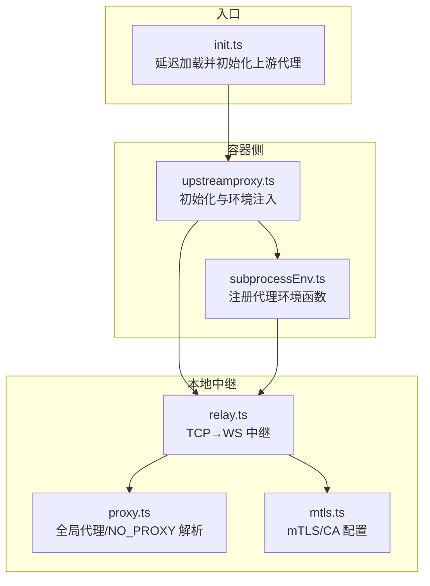
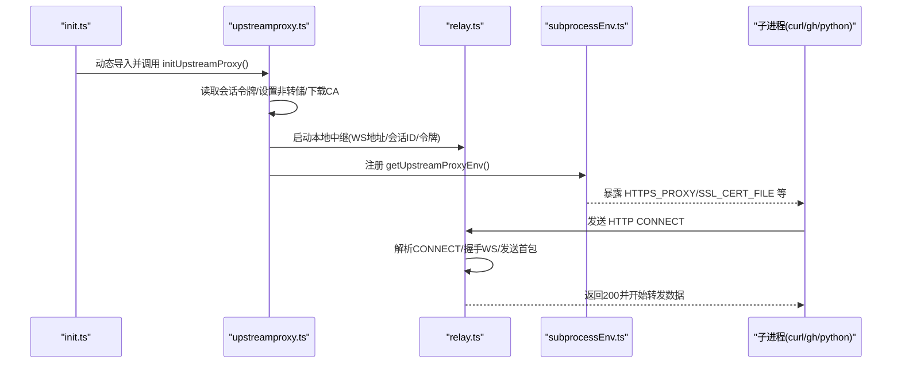
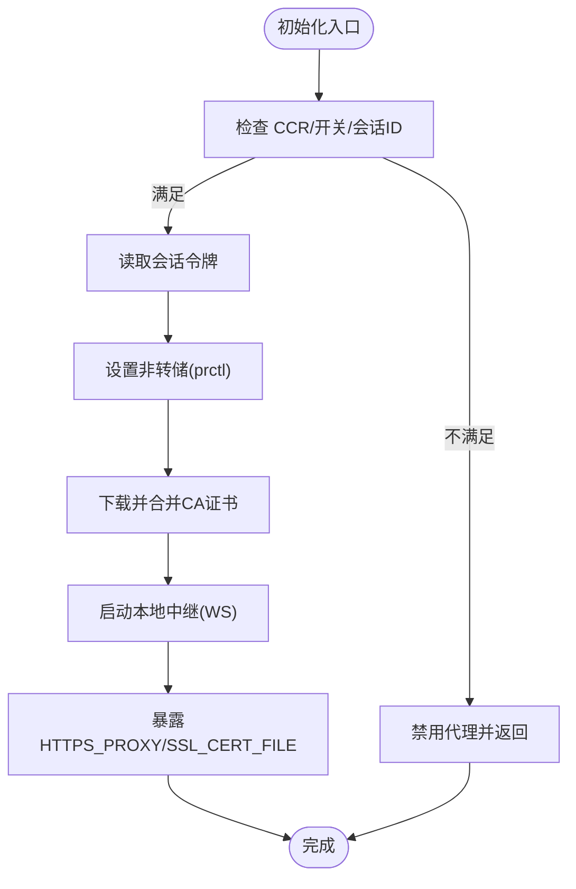
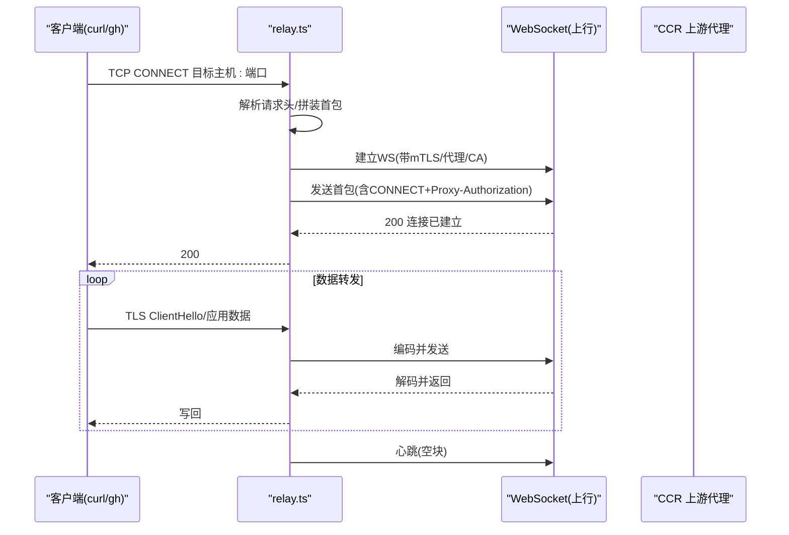
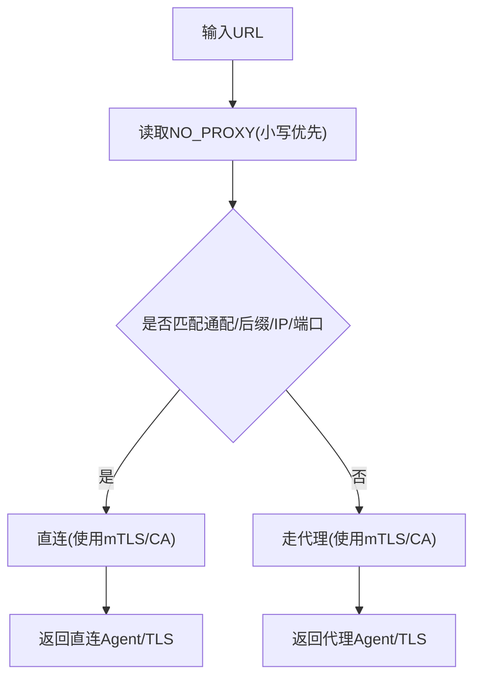
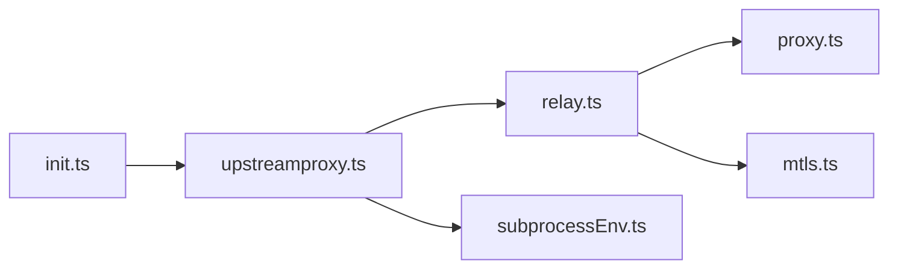

# 上游代理

<cite>
**本文引用的文件**
- [upstreamproxy.ts](file://src/upstreamproxy/upstreamproxy.ts)
- [relay.ts](file://src/upstreamproxy/relay.ts)
- [proxy.ts](file://src/utils/proxy.ts)
- [mtls.ts](file://src/utils/mtls.ts)
- [init.ts](file://src/entrypoints/init.ts)
- [subprocessEnv.ts](file://src/utils/subprocessEnv.ts)
</cite>

## 目录
1. [简介](#简介)
2. [项目结构](#项目结构)
3. [核心组件](#核心组件)
4. [架构总览](#架构总览)
5. [详细组件分析](#详细组件分析)
6. [依赖关系分析](#依赖关系分析)
7. [性能考量](#性能考量)
8. [故障排除指南](#故障排除指南)
9. [结论](#结论)
10. [附录](#附录)

## 简介
本文件面向网络工程师与系统管理员，系统性阐述 Claude Code 上游代理（upstream proxy）的设计与实现，覆盖代理配置、代理管理与代理路由机制；解释代理服务器设置、连接管理与流量转发；说明安全考虑与性能优化策略；提供配置示例与故障排除方法，并总结最佳实践。

## 项目结构
上游代理功能位于独立模块中，核心由两部分组成：
- 容器侧装配与环境注入：负责在 CCR 容器内初始化本地代理、下载并合并 CA 证书、启动本地 CONNECT→WebSocket 中继、暴露 HTTPS_PROXY/SSL_CERT_FILE 等环境变量供子进程继承。
- 本地中继：监听本地回环地址的 TCP 端口，接收 HTTP CONNECT 请求，通过 WebSocket 将字节流转发到 CCR 上游代理端点，完成 MITM 与凭据注入。

**图表来源**
- [upstreamproxy.ts:1-286](file://src/upstreamproxy/upstreamproxy.ts#L1-L286)
- [relay.ts:1-456](file://src/upstreamproxy/relay.ts#L1-L456)
- [proxy.ts:1-427](file://src/utils/proxy.ts#L1-L427)
- [mtls.ts:1-180](file://src/utils/mtls.ts#L1-L180)
- [init.ts:160-183](file://src/entrypoints/init.ts#L160-L183)
- [subprocessEnv.ts:64-99](file://src/utils/subprocessEnv.ts#L64-L99)

**章节来源**
- [upstreamproxy.ts:1-286](file://src/upstreamproxy/upstreamproxy.ts#L1-L286)
- [relay.ts:1-456](file://src/upstreamproxy/relay.ts#L1-L456)
- [proxy.ts:1-427](file://src/utils/proxy.ts#L1-L427)
- [mtls.ts:1-180](file://src/utils/mtls.ts#L1-L180)
- [init.ts:160-183](file://src/entrypoints/init.ts#L160-L183)
- [subprocessEnv.ts:64-99](file://src/utils/subprocessEnv.ts#L64-L99)

## 核心组件
- 上游代理初始化与环境注入
  - 读取会话令牌、设置非转储（防止同 UID 调试器从堆内存读取）、下载并合并 CA 证书、启动本地中继、暴露 HTTPS_PROXY/SSL_CERT_FILE 等环境变量。
  - 支持继承父进程已注入的代理变量，确保子进程一致路由。
- 本地中继（CONNECT→WebSocket）
  - 监听 127.0.0.1 的临时端口，解析 HTTP CONNECT 请求，建立 WebSocket 连接，编码/解码二进制数据块，维持心跳，处理错误与关闭。
- 全局代理与 NO_PROXY 解析
  - 提供代理 URL、NO_PROXY 解析、Axios/undici 代理拦截器、WebSocket 代理参数等能力，支持 mTLS 与自定义 CA。
- mTLS 与 CA 配置
  - 从环境变量加载客户端证书/密钥/口令，合并系统 CA，为代理与 WebSocket 提供 TLS 选项。
- 启动入口集成
  - 在 CCR 场景下延迟加载上游代理模块，注册环境注入函数，失败时降级不中断会话。

**章节来源**
- [upstreamproxy.ts:79-153](file://src/upstreamproxy/upstreamproxy.ts#L79-L153)
- [relay.ts:155-174](file://src/upstreamproxy/relay.ts#L155-L174)
- [proxy.ts:64-129](file://src/utils/proxy.ts#L64-L129)
- [mtls.ts:23-95](file://src/utils/mtls.ts#L23-L95)
- [init.ts:167-183](file://src/entrypoints/init.ts#L167-L183)
- [subprocessEnv.ts:64-99](file://src/utils/subprocessEnv.ts#L64-L99)

## 架构总览
上游代理采用“容器侧装配 + 本地中继”的分层设计：
- 容器侧负责在运行时准备本地代理所需的凭据与证书，并向所有子进程注入统一的 HTTPS_PROXY/SSL_CERT_FILE。
- 本地中继以最小状态机处理 CONNECT 握手与数据转发，通过 WebSocket 与 CCR 上游代理通信，实现 MITM 与组织级凭据注入。

**图表来源**
- [init.ts:167-183](file://src/entrypoints/init.ts#L167-L183)
- [upstreamproxy.ts:132-150](file://src/upstreamproxy/upstreamproxy.ts#L132-L150)
- [relay.ts:344-396](file://src/upstreamproxy/relay.ts#L344-L396)
- [subprocessEnv.ts:73-99](file://src/utils/subprocessEnv.ts#L73-L99)

## 详细组件分析

### 组件 A：上游代理初始化与环境注入（upstreamproxy.ts）
职责与流程
- 条件启用：仅在 CCR 环境且服务端开关开启时初始化。
- 令牌与安全：读取容器内会话令牌，设置 prctl(PR_SET_DUMPABLE, 0) 降低堆内存泄露风险。
- CA 下载与合并：从 CCR 基础 URL 获取上游代理 CA，与系统 CA 合并写入用户目录，供后续 TLS 使用。
- 中继启动：构造 WS 地址，启动本地中继，记录端口，成功后删除令牌文件（失败则保留以便重启重试）。
- 环境变量注入：返回 HTTPS_PROXY/SSL_CERT_FILE 等键值，供 subprocessEnv 注入到子进程。

关键要点
- 失败开路：任何步骤失败均记录警告并禁用代理，保证会话不被代理故障阻断。
- NO_PROXY 白名单：内置 Anthropic API、包仓库与 GitHub 等直连域名，避免 MITM 干扰与循环路由。
- 子进程继承：若父进程已注入代理变量，子进程直接透传，无需重新初始化。

**图表来源**
- [upstreamproxy.ts:85-153](file://src/upstreamproxy/upstreamproxy.ts#L85-L153)

**章节来源**
- [upstreamproxy.ts:79-153](file://src/upstreamproxy/upstreamproxy.ts#L79-L153)

### 组件 B：本地中继（CONNECT→WebSocket，relay.ts）
职责与流程
- 监听：在 127.0.0.1 上随机端口监听，兼容 Bun 与 Node。
- CONNECT 解析：累积请求头直到 CRLF CRLF，校验首行是否为 CONNECT，提取目标主机与端口。
- 握手与首包：建立 WebSocket（含 mTLS/CA 与代理），发送包含 CONNECT 行与 Proxy-Authorization 的首包。
- 数据转发：按最大块大小切片发送，接收端解码后写回客户端。
- 心跳与清理：周期性发送空块保持连接，错误/关闭时清理资源。

协议与兼容性
- 协议：将字节封装为 UpstreamProxyChunk（单字段 bytes），与服务端适配器兼容。
- 运行时：Bun 与 Node 分支处理写缓冲与事件差异，确保行为一致。

**图表来源**
- [relay.ts:295-428](file://src/upstreamproxy/relay.ts#L295-L428)

**章节来源**
- [relay.ts:155-174](file://src/upstreamproxy/relay.ts#L155-L174)
- [relay.ts:295-428](file://src/upstreamproxy/relay.ts#L295-L428)

### 组件 C：全局代理与 NO_PROXY 解析（proxy.ts）
职责与流程
- 代理 URL 与 NO_PROXY：优先小写变量，支持通配与后缀匹配。
- Axios/undici 代理拦截：根据 NO_PROXY 决定是否走代理或直连，自动合并 mTLS/CA。
- WebSocket 代理：Node 使用 agent，Bun 使用 proxy 字符串。
- Fetch 选项：按运行时选择 dispatcher 或 proxy + TLS 选项。

**图表来源**
- [proxy.ts:64-129](file://src/utils/proxy.ts#L64-L129)
- [proxy.ts:168-192](file://src/utils/proxy.ts#L168-L192)
- [proxy.ts:198-237](file://src/utils/proxy.ts#L198-L237)

**章节来源**
- [proxy.ts:64-129](file://src/utils/proxy.ts#L64-L129)
- [proxy.ts:168-192](file://src/utils/proxy.ts#L168-L192)
- [proxy.ts:198-237](file://src/utils/proxy.ts#L198-L237)
- [proxy.ts:243-275](file://src/utils/proxy.ts#L243-L275)
- [proxy.ts:288-319](file://src/utils/proxy.ts#L288-L319)
- [proxy.ts:327-388](file://src/utils/proxy.ts#L327-L388)

### 组件 D：mTLS 与 CA 配置（mtls.ts）
职责与流程
- 从环境变量加载客户端证书/私钥/口令，必要时合并系统 CA。
- 生成 HTTPS Agent 与 WebSocket TLS 选项，供代理与 WebSocket 使用。
- 缓存配置，避免重复 IO。

**章节来源**
- [mtls.ts:23-95](file://src/utils/mtls.ts#L23-L95)
- [mtls.ts:100-152](file://src/utils/mtls.ts#L100-L152)

### 组件 E：启动入口与子进程环境注入（init.ts, subprocessEnv.ts）
职责与流程
- init.ts：在 CCR 环境延迟加载上游代理模块，注册 getUpstreamProxyEnv 函数，失败时降级记录日志。
- subprocessEnv.ts：在 CCR 场景下将代理变量注入子进程环境，同时可按需清理敏感变量（如在 GitHub Actions 环境）。

**章节来源**
- [init.ts:167-183](file://src/entrypoints/init.ts#L167-L183)
- [subprocessEnv.ts:64-99](file://src/utils/subprocessEnv.ts#L64-L99)

## 依赖关系分析
- upstreamproxy.ts 依赖 relay.ts 启动本地中继；依赖 subprocessEnv.ts 注入环境变量；依赖 proxy.ts/mtls.ts 提供 TLS 与代理参数。
- relay.ts 依赖 proxy.ts 的 WebSocket 代理与 TLS 选项，依赖 mtls.ts 的 mTLS 配置。
- init.ts 与 subprocessEnv.ts 协作，确保在 CCR 容器中正确注入代理环境。

**图表来源**
- [upstreamproxy.ts:29-29](file://src/upstreamproxy/upstreamproxy.ts#L29-L29)
- [relay.ts:21-22](file://src/upstreamproxy/relay.ts#L21-L22)
- [proxy.ts:1-19](file://src/utils/proxy.ts#L1-L19)
- [mtls.ts:1-8](file://src/utils/mtls.ts#L1-L8)
- [init.ts:167-175](file://src/entrypoints/init.ts#L167-L175)
- [subprocessEnv.ts:73-77](file://src/utils/subprocessEnv.ts#L73-L77)

**章节来源**
- [upstreamproxy.ts:29-29](file://src/upstreamproxy/upstreamproxy.ts#L29-L29)
- [relay.ts:21-22](file://src/upstreamproxy/relay.ts#L21-L22)
- [proxy.ts:1-19](file://src/utils/proxy.ts#L1-L19)
- [mtls.ts:1-8](file://src/utils/mtls.ts#L1-L8)
- [init.ts:167-175](file://src/entrypoints/init.ts#L167-L175)
- [subprocessEnv.ts:73-77](file://src/utils/subprocessEnv.ts#L73-L77)

## 性能考量
- 连接复用与心跳
  - 中继使用 WebSocket 传输，周期性发送空块作为应用层保活，避免代理空闲超时导致的连接中断。
- 写缓冲与背压
  - Bun 侧显式队列尾部未写完的数据并在 drain 事件中继续发送；Node 侧内部缓冲，避免丢包。
- 分块传输
  - 将大块数据按固定上限切片发送，兼顾吞吐与内存占用。
- 代理与 mTLS 的延迟加载
  - 仅在存在代理或 mTLS 配置时才加载相关模块，减少冷启动开销。
- Keep-Alive 策略
  - mTLS Agent 默认启用 keep-alive；当底层连接池出现陈旧错误时可禁用 keep-alive 以避免复用坏连接。

**章节来源**
- [relay.ts:54-54](file://src/upstreamproxy/relay.ts#L54-L54)
- [relay.ts:215-226](file://src/upstreamproxy/relay.ts#L215-L226)
- [relay.ts:436-442](file://src/upstreamproxy/relay.ts#L436-L442)
- [proxy.ts:29-35](file://src/utils/proxy.ts#L29-L35)
- [mtls.ts:86-94](file://src/utils/mtls.ts#L86-L94)

## 故障排除指南
常见问题与定位思路
- 代理未生效
  - 检查 CCR 环境变量开关与会话 ID 是否存在；确认初始化日志是否显示“启用在 127.0.0.1:端口”。
  - 若 CA 下载失败或中继启动异常，会记录警告并禁用代理。
- 子进程未走代理
  - 确认 subprocessEnv 已注册上游代理环境函数；检查 HTTPS_PROXY/SSL_CERT_FILE 是否注入。
  - NO_PROXY 列表可能命中直连规则（如 Anthropic API、包仓库、GitHub），导致不经过中继。
- 连接被代理空闲超时中断
  - 中继已内置心跳；若仍频繁断开，检查企业代理策略或调整心跳间隔。
- TLS 握手失败
  - 确认合并后的 CA 文件路径正确；检查 mTLS 证书/密钥/口令是否有效。
- 令牌读取失败
  - 容器内令牌文件不存在或权限不足；初始化会记录警告并禁用代理。

排查步骤建议
- 查看初始化阶段日志，确认上游代理模块是否成功加载与初始化。
- 在子进程中打印环境变量，验证 HTTPS_PROXY/SSL_CERT_FILE 是否存在。
- 使用 curl/openssl 验证到目标站点的 TLS 路径与证书链。
- 临时关闭 NO_PROXY 或调整规则，验证是否为白名单导致直连。

**章节来源**
- [upstreamproxy.ts:96-103](file://src/upstreamproxy/upstreamproxy.ts#L96-L103)
- [upstreamproxy.ts:146-150](file://src/upstreamproxy/upstreamproxy.ts#L146-L150)
- [relay.ts:410-427](file://src/upstreamproxy/relay.ts#L410-L427)
- [proxy.ts:88-129](file://src/utils/proxy.ts#L88-L129)
- [mtls.ts:23-73](file://src/utils/mtls.ts#L23-L73)

## 结论
该上游代理系统通过“容器侧装配 + 本地中继”的方式，在 CCR 容器内实现了对出站 HTTPS 流量的统一路由与 MITM，结合 NO_PROXY 白名单与 mTLS/CA 配置，既满足企业网络合规要求，又保持了对关键服务（如 Anthropic API）的透明访问。其失败开路的设计与子进程环境注入机制，确保了在代理异常时不会影响会话稳定性。

## 附录

### 配置示例与使用场景
- CCR 容器内启用
  - 确保 CLAUDE_CODE_REMOTE 与 CCR_UPSTREAM_PROXY_ENABLED 开关开启；容器内存在会话令牌文件；基础 URL 正确。
- 子进程路由
  - 通过 subprocessEnv 注入 HTTPS_PROXY/SSL_CERT_FILE；curl/gh/python 等工具自动走本地中继。
- 企业代理与 mTLS
  - 设置 HTTPS_PROXY/NO_PROXY；配置 CLAUDE_CODE_CLIENT_CERT/KEY/PASSPHRASE/NODE_EXTRA_CA_CERTS 等环境变量。

**章节来源**
- [upstreamproxy.ts:85-94](file://src/upstreamproxy/upstreamproxy.ts#L85-L94)
- [upstreamproxy.ts:160-199](file://src/upstreamproxy/upstreamproxy.ts#L160-L199)
- [proxy.ts:64-75](file://src/utils/proxy.ts#L64-L75)
- [mtls.ts:30-65](file://src/utils/mtls.ts#L30-L65)

### 最佳实践
- 安全
  - 使用 prctl 防止同 UID 调试；严格控制令牌文件生命周期；最小化代理变量注入范围。
  - 仅在必要时合并 CA，避免信任边界扩大。
- 可靠性
  - 失败开路与降级日志；心跳保活；NO_PROXY 白名单应覆盖关键服务域名。
- 性能
  - 合理设置心跳间隔；启用 keep-alive；按需延迟加载代理与 mTLS 模块。
- 可运维性
  - 明确代理与 mTLS 的环境变量命名规范；在 CI/CD 环境中谨慎清理敏感变量。

**章节来源**
- [upstreamproxy.ts:112-112](file://src/upstreamproxy/upstreamproxy.ts#L112-L112)
- [upstreamproxy.ts:138-144](file://src/upstreamproxy/upstreamproxy.ts#L138-L144)
- [relay.ts:54-54](file://src/upstreamproxy/relay.ts#L54-L54)
- [proxy.ts:327-388](file://src/utils/proxy.ts#L327-L388)
- [mtls.ts:86-94](file://src/utils/mtls.ts#L86-L94)