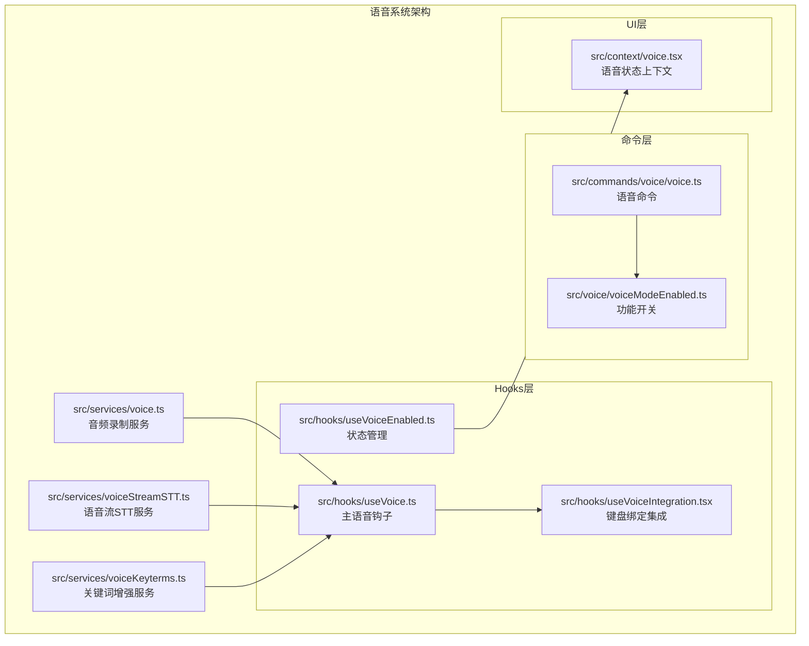
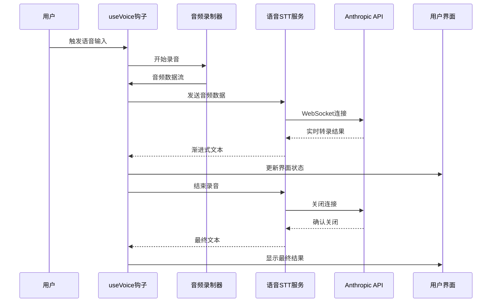
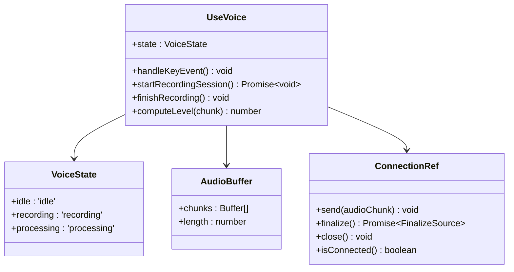
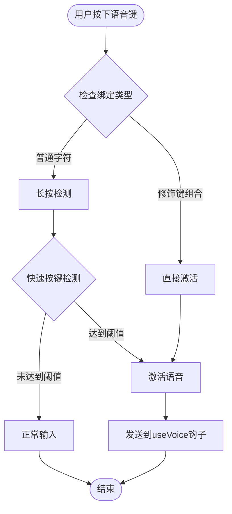
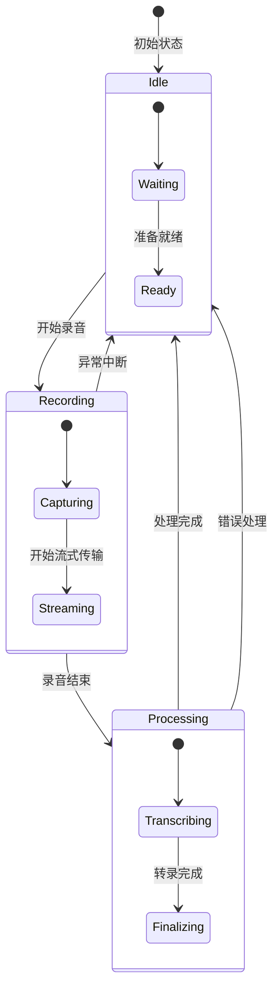
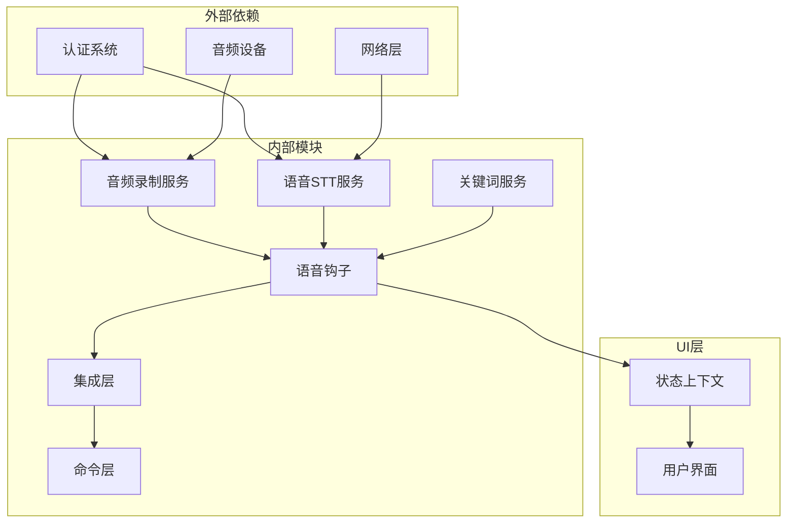

# 语音系统

<cite>
**本文档引用的文件**
- [src/services/voice.ts](file://src/services/voice.ts)
- [src/services/voiceStreamSTT.ts](file://src/services/voiceStreamSTT.ts)
- [src/services/voiceKeyterms.ts](file://src/services/voiceKeyterms.ts)
- [src/hooks/useVoice.ts](file://src/hooks/useVoice.ts)
- [src/hooks/useVoiceIntegration.tsx](file://src/hooks/useVoiceIntegration.tsx)
- [src/hooks/useVoiceEnabled.ts](file://src/hooks/useVoiceEnabled.ts)
- [src/commands/voice/voice.ts](file://src/commands/voice/voice.ts)
- [src/context/voice.tsx](file://src/context/voice.tsx)
- [src/voice/voiceModeEnabled.ts](file://src/voice/voiceModeEnabled.ts)
</cite>

## 目录
1. [简介](#简介)
2. [项目结构](#项目结构)
3. [核心组件](#核心组件)
4. [架构概览](#架构概览)
5. [详细组件分析](#详细组件分析)
6. [依赖关系分析](#依赖关系分析)
7. [性能考虑](#性能考虑)
8. [故障排除指南](#故障排除指南)
9. [结论](#结论)

## 简介

Claude Code 语音系统是一个完整的语音交互解决方案，支持语音识别（STT）、语音合成（TTS）和语音交互功能。该系统采用现代化的架构设计，提供了流畅的用户体验和强大的功能集成能力。

语音系统的核心特性包括：
- 实时语音识别（Push-to-Talk 模式）
- 多语言支持（20+ 种语言）
- 智能关键词增强
- 流式音频传输
- 自动降噪和静音检测
- 跨平台兼容性（macOS、Windows、Linux）

## 项目结构

语音系统在代码库中的组织结构如下：



**图表来源**
- [src/services/voice.ts:1-526](file://src/services/voice.ts#L1-L526)
- [src/services/voiceStreamSTT.ts:1-545](file://src/services/voiceStreamSTT.ts#L1-L545)
- [src/hooks/useVoice.ts:1-1145](file://src/hooks/useVoice.ts#L1-L1145)

**章节来源**
- [src/services/voice.ts:1-526](file://src/services/voice.ts#L1-L526)
- [src/services/voiceStreamSTT.ts:1-545](file://src/services/voiceStreamSTT.ts#L1-L545)
- [src/hooks/useVoice.ts:1-1145](file://src/hooks/useVoice.ts#L1-L1145)

## 核心组件

### 音频录制服务
音频录制服务负责跨平台的音频捕获，支持原生音频模块和多种后备方案：

- **原生音频模块**：macOS 上使用 CoreAudio，Windows 使用 WASAPI
- **SoX 后备方案**：适用于 Linux 和 macOS 的音频录制
- **ALSA 后备方案**：Linux 系统的 ALSA 设备支持
- **智能设备检测**：自动检测可用的音频设备

### 语音流STT服务
语音流STT服务实现了与 Anthropic 语音流 API 的连接：

- **WebSocket 连接**：使用持久化的 WebSocket 连接进行实时通信
- **流式传输**：支持实时音频流和渐进式转录
- **错误处理**：完善的错误恢复和重连机制
- **超时管理**：智能的连接超时和保活机制

### 关键词增强服务
关键词增强服务通过深度学习模型提升语音识别准确性：

- **全局关键词**：编程相关的专业术语
- **项目特定关键词**：基于项目根目录和分支名称
- **文件名关键词**：从最近文件中提取的关键词
- **动态关键词**：根据用户会话实时更新

**章节来源**
- [src/services/voice.ts:38-526](file://src/services/voice.ts#L38-L526)
- [src/services/voiceStreamSTT.ts:50-545](file://src/services/voiceStreamSTT.ts#L50-L545)
- [src/services/voiceKeyterms.ts:1-107](file://src/services/voiceKeyterms.ts#L1-L107)

## 架构概览

语音系统的整体架构采用分层设计，确保了模块化和可维护性：



**图表来源**
- [src/hooks/useVoice.ts:322-522](file://src/hooks/useVoice.ts#L322-L522)
- [src/services/voiceStreamSTT.ts:111-545](file://src/services/voiceStreamSTT.ts#L111-L545)

系统采用事件驱动的异步架构，每个组件都有明确的职责分工：

- **服务层**：处理底层的音频和网络操作
- **Hook层**：管理业务逻辑和状态转换
- **UI层**：提供用户交互和反馈
- **命令层**：处理用户指令和配置

## 详细组件分析

### useVoice 主钩子组件

useVoice 是语音系统的核心钩子，负责协调整个语音交互流程：



**图表来源**
- [src/hooks/useVoice.ts:143-156](file://src/hooks/useVoice.ts#L143-L156)
- [src/hooks/useVoice.ts:200-205](file://src/hooks/useVoice.ts#L200-L205)

#### 关键功能特性

1. **智能按键检测**：区分普通按键输入和语音激活
2. **自动重连机制**：在网络异常时自动恢复连接
3. **静音检测**：智能停止录音和发送音频
4. **音频可视化**：实时显示音频波形和音量级别
5. **错误恢复**：优雅处理各种异常情况

#### 语音模式类型

系统支持两种主要的语音模式：

- **Push-to-Talk 模式**：按住空格键开始录音，释放键结束录音
- **Focus 模式**：终端获得焦点时自动开始录音，失去焦点时自动结束

**章节来源**
- [src/hooks/useVoice.ts:199-800](file://src/hooks/useVoice.ts#L199-L800)

### useVoiceIntegration 键盘绑定集成

键盘绑定集成为用户提供灵活的语音激活方式：



**图表来源**
- [src/hooks/useVoiceIntegration.tsx:468-647](file://src/hooks/useVoiceIntegration.tsx#L468-L647)

#### 绑定类型支持

系统支持多种键盘绑定配置：

- **修饰键组合**：如 `Ctrl+C`、`Cmd+V` 等
- **普通字符**：如空格键、字母键等
- **自定义绑定**：用户可以配置个性化的快捷键

**章节来源**
- [src/hooks/useVoiceIntegration.tsx:373-677](file://src/hooks/useVoiceIntegration.tsx#L373-L677)

### 语音命令系统

语音命令系统提供了完整的语音功能控制：

```mermaid
sequenceDiagram
participant User as 用户
participant Command as /voice 命令
participant Checker as 功能检查器
participant Setup as 设置器
participant UI as 用户界面
User->>/voice : 执行语音命令
Command->>Checker : 检查认证状态
Checker-->>Command : 返回认证状态
Command->>Checker : 检查环境可用性
Checker-->>Command : 返回环境信息
Command->>Setup : 启用语音功能
Setup->>UI : 更新界面状态
UI-->>User : 显示结果
```

**图表来源**
- [src/commands/voice/voice.ts:16-151](file://src/commands/voice/voice.ts#L16-L151)

#### 命令功能

语音命令支持以下操作：

- **启用/禁用语音功能**
- **环境检查和诊断**
- **依赖项安装指导**
- **权限请求和配置**

**章节来源**
- [src/commands/voice/voice.ts:1-151](file://src/commands/voice/voice.ts#L1-L151)

### 语音状态管理系统

语音状态管理系统负责维护语音功能的全局状态：



**图表来源**
- [src/context/voice.tsx:4-17](file://src/context/voice.tsx#L4-L17)

#### 状态管理

语音状态包括：

- **录音状态**：空闲、录音中、处理中
- **错误信息**：存储最后一次错误详情
- **音频级别**：实时音频波形数据
- **预热状态**：语音激活前的预热指示

**章节来源**
- [src/context/voice.tsx:1-88](file://src/context/voice.tsx#L1-L88)

## 依赖关系分析

语音系统各组件之间的依赖关系如下：



**图表来源**
- [src/services/voice.ts:1-526](file://src/services/voice.ts#L1-L526)
- [src/services/voiceStreamSTT.ts:1-545](file://src/services/voiceStreamSTT.ts#L1-L545)
- [src/hooks/useVoice.ts:1-1145](file://src/hooks/useVoice.ts#L1-L1145)

### 关键依赖链

1. **认证依赖**：所有语音功能都需要有效的认证状态
2. **网络依赖**：语音STT需要稳定的网络连接
3. **硬件依赖**：音频录制需要可用的麦克风设备
4. **状态依赖**：UI层依赖于语音状态管理

**章节来源**
- [src/voice/voiceModeEnabled.ts:1-55](file://src/voice/voiceModeEnabled.ts#L1-L55)
- [src/hooks/useVoiceEnabled.ts:1-26](file://src/hooks/useVoiceEnabled.ts#L1-L26)

## 性能考虑

语音系统在设计时充分考虑了性能优化：

### 内存管理
- **音频缓冲区限制**：避免长时间录音导致的内存泄漏
- **连接池管理**：复用WebSocket连接减少资源消耗
- **垃圾回收优化**：及时清理不再使用的对象引用

### 网络优化
- **连接保活**：定期发送保活消息维持连接稳定
- **重连策略**：指数退避算法避免频繁重连
- **超时控制**：合理的超时设置平衡响应速度和稳定性

### 音频处理优化
- **异步处理**：音频录制和网络传输完全异步进行
- **流式处理**：实时音频流避免大块数据处理
- **降噪算法**：内置降噪提高音频质量

### 用户体验优化
- **预热机制**：提前加载音频模块减少首次使用延迟
- **进度反馈**：实时显示录音状态和处理进度
- **错误提示**：友好的错误信息帮助用户解决问题

## 故障排除指南

### 常见问题及解决方案

#### 麦克风权限问题
**症状**：无法启动录音或出现权限错误
**解决方案**：
1. 检查系统隐私设置中的麦克风权限
2. 重新授权应用程序访问麦克风
3. 在命令行中运行 `voice` 命令重新请求权限

#### 网络连接问题
**症状**：语音连接失败或频繁断开
**解决方案**：
1. 检查网络连接是否稳定
2. 尝试切换到更稳定的网络环境
3. 检查防火墙设置是否阻止了连接

#### 音频设备问题
**症状**：没有音频输入或音频质量差
**解决方案**：
1. 确认音频设备正确连接
2. 检查音频设备的音量设置
3. 尝试使用不同的音频设备

#### 语音识别问题
**症状**：语音识别准确率低或无法识别
**解决方案**：
1. 检查语言设置是否正确
2. 确保环境安静无噪音干扰
3. 适当调整麦克风位置和距离

**章节来源**
- [src/commands/voice/voice.ts:63-112](file://src/commands/voice/voice.ts#L63-L112)

### 调试和监控

语音系统提供了完善的调试功能：

- **日志记录**：详细的系统日志便于问题诊断
- **状态监控**：实时监控语音功能的状态变化
- **性能指标**：收集关键性能指标用于优化
- **错误报告**：自动收集和上报错误信息

## 结论

Claude Code 语音系统是一个设计精良、功能完整的语音交互解决方案。系统采用了现代化的架构设计，具有以下优势：

1. **模块化设计**：清晰的分层架构便于维护和扩展
2. **跨平台兼容**：支持主流操作系统和硬件设备
3. **高性能优化**：针对性能进行了全面优化
4. **用户体验优秀**：提供流畅自然的语音交互体验
5. **错误处理完善**：具备强大的错误检测和恢复能力

该系统为开发者提供了丰富的扩展接口，可以轻松集成到各种应用场景中。同时，完善的文档和工具链使得开发和维护变得更加简单高效。

未来的发展方向包括：
- 支持更多的语音识别模型
- 增强多语言和方言支持
- 优化移动端的语音功能
- 集成更多的人工智能特性