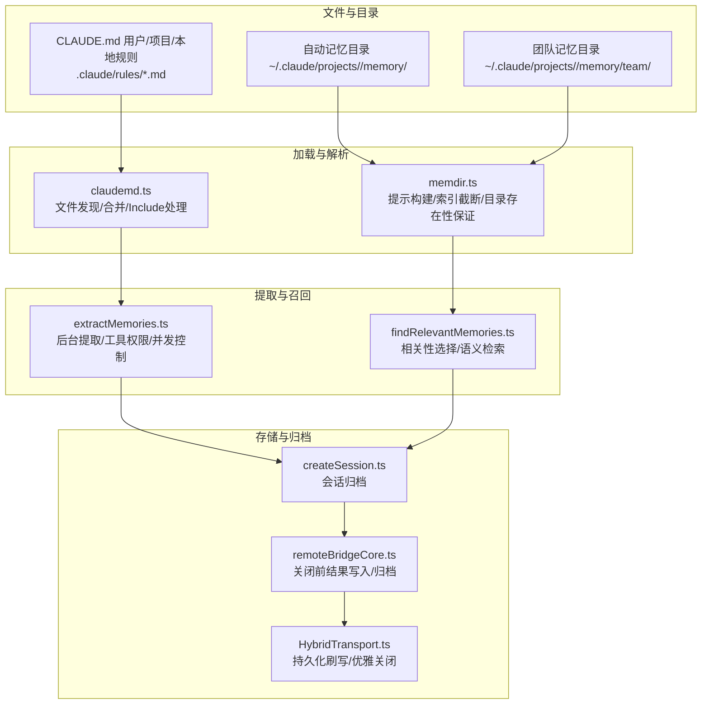
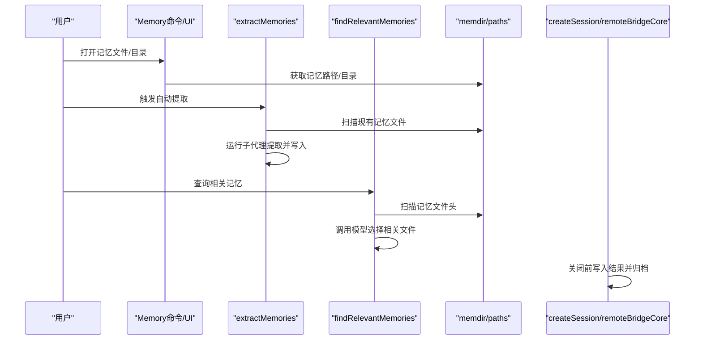
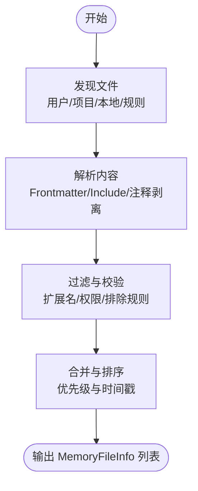
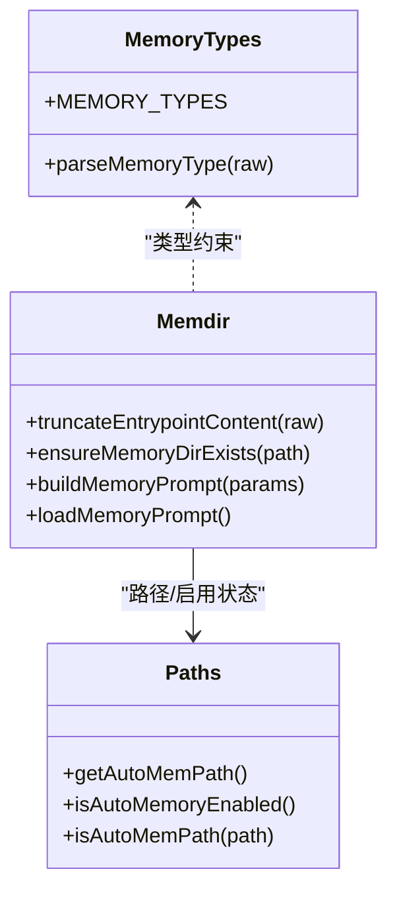
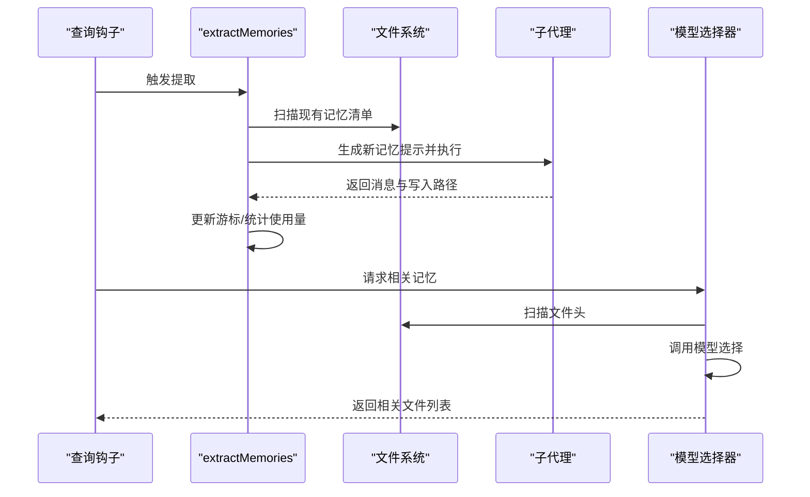
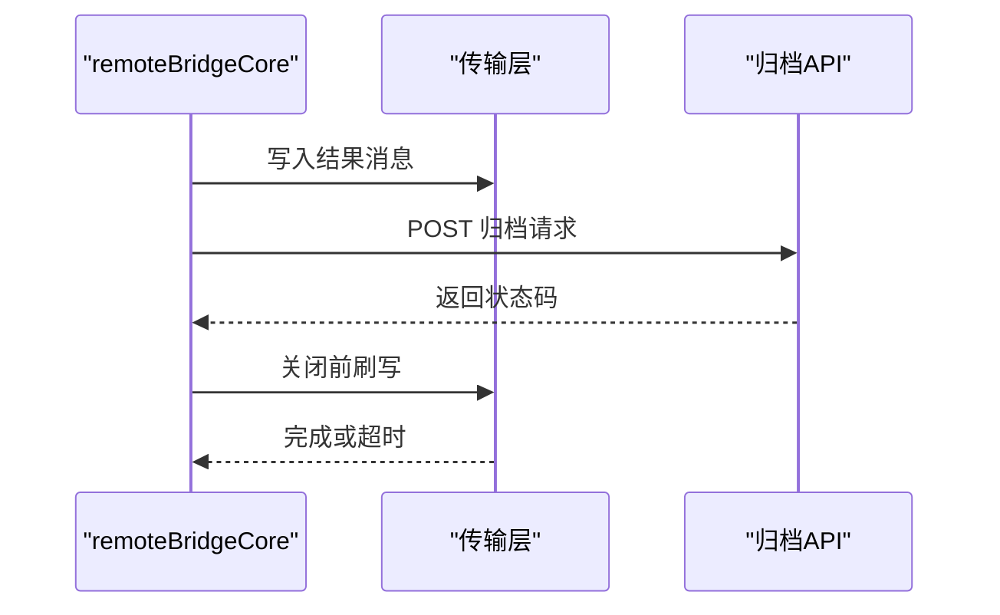
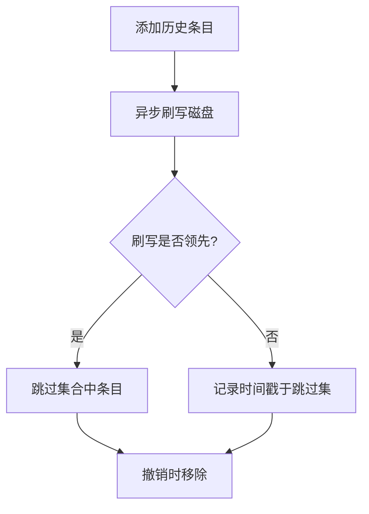
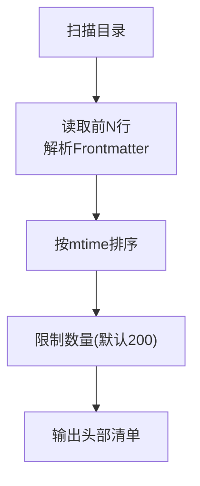
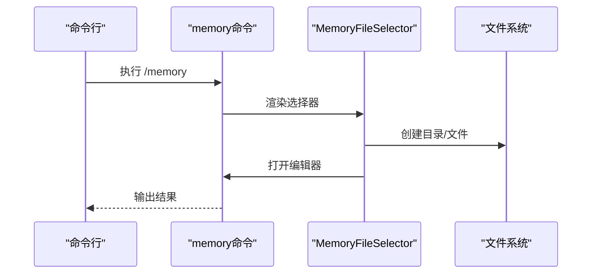
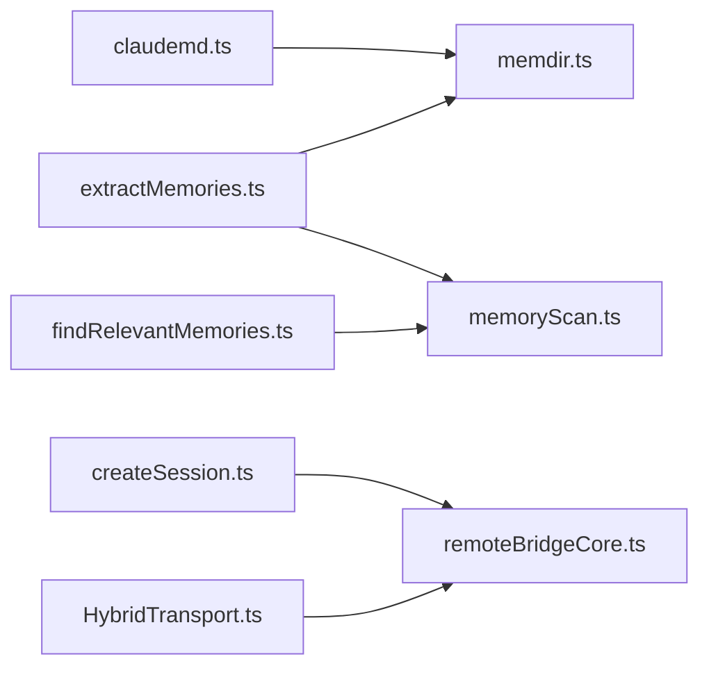

# 内存管理机制

<cite>
**本文引用的文件**
- [memdir.ts](file://src/memdir/memdir.ts)
- [memoryTypes.ts](file://src/memdir/memoryTypes.ts)
- [memoryScan.ts](file://src/memdir/memoryScan.ts)
- [memoryAge.ts](file://src/memdir/memoryAge.ts)
- [memoryFileDetection.ts](file://src/utils/memoryFileDetection.ts)
- [MemoryFileSelector.tsx](file://src/components/memory/MemoryFileSelector.tsx)
- [memory.tsx](file://src/commands/memory/memory.tsx)
- [index.ts](file://src/commands/memory/index.ts)
- [extractMemories.ts](file://src/services/extractMemories/extractMemories.ts)
- [findRelevantMemories.ts](file://src/memdir/findRelevantMemories.ts)
- [claudemd.ts](file://src/utils/claudemd.ts)
- [paths.ts](file://src/memdir/paths.ts)
- [teamMemPaths.ts](file://src/memdir/teamMemPaths.ts)
- [teamMemPrompts.ts](file://src/memdir/teamMemPrompts.ts)
- [createSession.ts](file://src/bridge/createSession.ts)
- [remoteBridgeCore.ts](file://src/bridge/remoteBridgeCore.ts)
- [HybridTransport.ts](file://src/cli/transports/HybridTransport.ts)
- [history.ts](file://src/history.ts)
- [compact.ts](file://src/commands/compact/compact.ts)
- [caches.ts](file://src/commands/clear/caches.ts)
</cite>

## 目录
1. [简介](#简介)
2. [项目结构](#项目结构)
3. [核心组件](#核心组件)
4. [架构总览](#架构总览)
5. [详细组件分析](#详细组件分析)
6. [依赖关系分析](#依赖关系分析)
7. [性能考量](#性能考量)
8. [故障排除指南](#故障排除指南)
9. [结论](#结论)

## 简介
本文件系统性阐述 Claude Code 的内存管理机制，覆盖内存的生命周期（创建、更新、删除、归档）、存储策略（写入、读取、修改）、版本与历史记录、清理与维护、性能优化以及安全与完整性保障。文档基于代码库的实际实现进行分析，提供面向技术与非技术读者的渐进式理解路径。

## 项目结构
Claude Code 的内存管理由多层模块协同完成：
- 文件级内存：用户/项目/本地/自动记忆等多源文件，通过统一加载器聚合
- 自动记忆目录：按类型分类的记忆文件，支持索引文件（MEMORY.md）与主题文件
- 提取与召回：自动提取对话中的关键信息到记忆，查询时选择相关记忆
- 存储与归档：桥接会话结束后对历史进行归档，确保持久化与可恢复
- UI 与命令：交互式编辑记忆文件，选择与打开记忆目录

**图表来源**
- [claudemd.ts:1-800](file://src/utils/claudemd.ts#L1-L800)
- [memdir.ts:1-508](file://src/memdir/memdir.ts#L1-L508)
- [extractMemories.ts:1-616](file://src/services/extractMemories/extractMemories.ts#L1-L616)
- [findRelevantMemories.ts:1-142](file://src/memdir/findRelevantMemories.ts#L1-L142)
- [createSession.ts:277-317](file://src/bridge/createSession.ts#L277-L317)
- [remoteBridgeCore.ts:658-687](file://src/bridge/remoteBridgeCore.ts#L658-L687)
- [HybridTransport.ts:140-195](file://src/cli/transports/HybridTransport.ts#L140-L195)

**章节来源**
- [claudemd.ts:1-800](file://src/utils/claudemd.ts#L1-L800)
- [memdir.ts:1-508](file://src/memdir/memdir.ts#L1-L508)

## 核心组件
- 文件级内存加载器：负责发现、解析、合并不同来源的记忆文件，支持 @include 指令与路径过滤
- 自动记忆目录：提供类型化记忆的保存与索引，支持个人与团队模式
- 自动提取服务：在会话结束时从对话中抽取关键信息写入记忆
- 相关性选择：根据查询选择最相关的记忆文件
- 存储与归档：桥接关闭前写入结果并触发会话归档，确保数据持久化
- UI 与命令：提供交互式编辑与选择记忆文件的能力

**章节来源**
- [claudemd.ts:1-800](file://src/utils/claudemd.ts#L1-L800)
- [memdir.ts:1-508](file://src/memdir/memdir.ts#L1-L508)
- [extractMemories.ts:1-616](file://src/services/extractMemories/extractMemories.ts#L1-L616)
- [findRelevantMemories.ts:1-142](file://src/memdir/findRelevantMemories.ts#L1-L142)
- [createSession.ts:277-317](file://src/bridge/createSession.ts#L277-L317)

## 架构总览
内存管理采用“多源聚合 + 类型化存储 + 自动提取 + 相关性召回”的分层架构：
- 多源聚合：用户/项目/本地/规则文件统一加载与合并
- 类型化存储：自动记忆目录按类型组织，索引文件集中展示
- 自动提取：后台运行，避免干扰主对话流程
- 相关性召回：结合文件头元信息与模型选择，减少无关内容
- 归档持久化：桥接关闭前确保结果与历史被持久化

**图表来源**
- [memory.tsx:1-89](file://src/commands/memory/memory.tsx#L1-L89)
- [MemoryFileSelector.tsx:1-438](file://src/components/memory/MemoryFileSelector.tsx#L1-L438)
- [extractMemories.ts:296-587](file://src/services/extractMemories/extractMemories.ts#L296-L587)
- [findRelevantMemories.ts:39-75](file://src/memdir/findRelevantMemories.ts#L39-L75)
- [createSession.ts:277-317](file://src/bridge/createSession.ts#L277-L317)
- [remoteBridgeCore.ts:658-687](file://src/bridge/remoteBridgeCore.ts#L658-L687)

## 详细组件分析

### 文件级内存加载与解析
- 发现与合并：按优先级顺序加载用户、项目、本地与规则文件，后加载者具有更高优先级
- Include 指令：支持 @path 引用，递归解析并去重，限制最大嵌套深度
- 安全过滤：仅允许文本扩展名，跳过二进制文件；HTML 注释剥离；权限错误日志
- 排除规则：支持基于设置的路径排除，处理符号链接真实路径

**图表来源**
- [claudemd.ts:1-800](file://src/utils/claudemd.ts#L1-L800)

**章节来源**
- [claudemd.ts:1-800](file://src/utils/claudemd.ts#L1-L800)

### 自动记忆目录与类型化存储
- 目录结构：个人与团队记忆目录，支持索引文件（MEMORY.md）与主题文件
- 类型约束：用户、反馈、项目、参考四类，明确使用场景与范围
- 索引截断：对索引文件进行行数与字节数限制，超限警告提示
- 目录存在性：确保目录存在，避免写入前检查

**图表来源**
- [memoryTypes.ts:1-272](file://src/memdir/memoryTypes.ts#L1-L272)
- [memdir.ts:1-508](file://src/memdir/memdir.ts#L1-L508)
- [paths.ts](file://src/memdir/paths.ts)

**章节来源**
- [memoryTypes.ts:1-272](file://src/memdir/memoryTypes.ts#L1-L272)
- [memdir.ts:1-508](file://src/memdir/memdir.ts#L1-L508)

### 自动提取与相关性召回
- 自动提取：在会话结束时运行，扫描现有记忆清单，调用子代理生成新记忆，限制轮次上限
- 工具权限：严格限制工具使用范围，仅允许只读读取与自动记忆目录内的写入
- 并发与节流：通过游标与节流参数避免重复提取，支持尾随运行以处理堆积上下文
- 相关性召回：扫描文件头（名称、描述、类型、修改时间），调用模型选择最相关文件

**图表来源**
- [extractMemories.ts:296-587](file://src/services/extractMemories/extractMemories.ts#L296-L587)
- [findRelevantMemories.ts:39-75](file://src/memdir/findRelevantMemories.ts#L39-L75)

**章节来源**
- [extractMemories.ts:1-616](file://src/services/extractMemories/extractMemories.ts#L1-L616)
- [findRelevantMemories.ts:1-142](file://src/memdir/findRelevantMemories.ts#L1-L142)

### 存储策略与归档流程
- 写入与持久化：桥接关闭前先写入结果消息，再进行归档，确保传输层有足够窗口完成上传
- 归档接口：POST 归档端点，携带访问令牌与组织标识，超时与状态处理
- 优雅关闭：传输层在关闭时进行最后的刷写与限时等待，防止进程退出导致数据丢失

**图表来源**
- [remoteBridgeCore.ts:658-687](file://src/bridge/remoteBridgeCore.ts#L658-L687)
- [createSession.ts:277-317](file://src/bridge/createSession.ts#L277-L317)
- [HybridTransport.ts:140-195](file://src/cli/transports/HybridTransport.ts#L140-L195)

**章节来源**
- [remoteBridgeCore.ts:658-687](file://src/bridge/remoteBridgeCore.ts#L658-L687)
- [createSession.ts:277-317](file://src/bridge/createSession.ts#L277-L317)
- [HybridTransport.ts:140-195](file://src/cli/transports/HybridTransport.ts#L140-L195)

### 版本控制与历史记录
- 历史条目管理：提供添加与撤销历史条目的能力，避免中断恢复时重复显示
- 清理与缓存：清理会话缓存、重置获取记忆文件缓存、清理图像路径缓存等
- 压缩与清理：压缩后清理逻辑，重置缓存基线，抑制压缩警告

**图表来源**
- [history.ts:436-464](file://src/history.ts#L436-L464)
- [caches.ts:68-92](file://src/commands/clear/caches.ts#L68-L92)
- [compact.ts:48-83](file://src/commands/compact/compact.ts#L48-L83)

**章节来源**
- [history.ts:436-464](file://src/history.ts#L436-L464)
- [caches.ts:68-92](file://src/commands/clear/caches.ts#L68-L92)
- [compact.ts:48-83](file://src/commands/compact/compact.ts#L48-L83)

### 清理与维护机制
- 记忆扫描：扫描目录下 .md 文件，读取前若干行提取元信息，按修改时间排序
- 新鲜度提示：对超过一天的记忆附加提醒，避免过期信息误导
- 路径检测：识别会话文件类型、自动记忆文件、团队记忆文件与目录，用于权限与范围控制

**图表来源**
- [memoryScan.ts:35-77](file://src/memdir/memoryScan.ts#L35-L77)
- [memoryAge.ts:1-54](file://src/memdir/memoryAge.ts#L1-L54)
- [memoryFileDetection.ts:1-290](file://src/utils/memoryFileDetection.ts#L1-L290)

**章节来源**
- [memoryScan.ts:1-95](file://src/memdir/memoryScan.ts#L1-L95)
- [memoryAge.ts:1-54](file://src/memdir/memoryAge.ts#L1-L54)
- [memoryFileDetection.ts:1-290](file://src/utils/memoryFileDetection.ts#L1-L290)

### UI 与命令交互
- 记忆命令：提供交互式选择与编辑记忆文件的能力，自动创建配置目录与文件
- 文件选择器：列出用户/项目/自动/团队记忆目录，支持打开目录与切换开关
- 编辑器集成：根据环境变量选择编辑器，提供友好的提示信息

**图表来源**
- [index.ts:1-10](file://src/commands/memory/index.ts#L1-L10)
- [memory.tsx:1-89](file://src/commands/memory/memory.tsx#L1-L89)
- [MemoryFileSelector.tsx:1-438](file://src/components/memory/MemoryFileSelector.tsx#L1-L438)

**章节来源**
- [index.ts:1-10](file://src/commands/memory/index.ts#L1-L10)
- [memory.tsx:1-89](file://src/commands/memory/memory.tsx#L1-L89)
- [MemoryFileSelector.tsx:1-438](file://src/components/memory/MemoryFileSelector.tsx#L1-L438)

## 依赖关系分析
- 组件耦合
  - claudemd.ts 依赖 memdir.ts 的索引截断与路径工具
  - extractMemories.ts 依赖 memdir.ts 的扫描与路径判断
  - findRelevantMemories.ts 依赖 memoryScan.ts 的扫描与格式化
  - createSession.ts 与 remoteBridgeCore.ts 共同保证归档与关闭流程
- 外部依赖
  - 文件系统操作封装、路径解析、正则匹配、模型调用等

**图表来源**
- [claudemd.ts:1-800](file://src/utils/claudemd.ts#L1-L800)
- [memdir.ts:1-508](file://src/memdir/memdir.ts#L1-L508)
- [extractMemories.ts:1-616](file://src/services/extractMemories/extractMemories.ts#L1-L616)
- [memoryScan.ts:1-95](file://src/memdir/memoryScan.ts#L1-L95)
- [findRelevantMemories.ts:1-142](file://src/memdir/findRelevantMemories.ts#L1-L142)
- [createSession.ts:277-317](file://src/bridge/createSession.ts#L277-L317)
- [remoteBridgeCore.ts:658-687](file://src/bridge/remoteBridgeCore.ts#L658-L687)
- [HybridTransport.ts:140-195](file://src/cli/transports/HybridTransport.ts#L140-L195)

**章节来源**
- [claudemd.ts:1-800](file://src/utils/claudemd.ts#L1-L800)
- [memdir.ts:1-508](file://src/memdir/memdir.ts#L1-L508)
- [extractMemories.ts:1-616](file://src/services/extractMemories/extractMemories.ts#L1-L616)
- [memoryScan.ts:1-95](file://src/memdir/memoryScan.ts#L1-L95)
- [findRelevantMemories.ts:1-142](file://src/memdir/findRelevantMemories.ts#L1-L142)
- [createSession.ts:277-317](file://src/bridge/createSession.ts#L277-L317)
- [remoteBridgeCore.ts:658-687](file://src/bridge/remoteBridgeCore.ts#L658-L687)
- [HybridTransport.ts:140-195](file://src/cli/transports/HybridTransport.ts#L140-L195)

## 性能考量
- I/O 优化
  - 单次扫描读取前 N 行并返回 mtime，避免双倍 stat 调用
  - 使用 Promise.allSettled 并行处理多个文件，提升扫描效率
- 缓存与节流
  - 提取服务内部游标与节流参数，避免频繁重复提取
  - 压缩后清理与缓存重置，减少后续计算负担
- 传输与归档
  - 关闭前刷写与限时等待，确保上传窗口最大化，降低丢失风险

**章节来源**
- [memoryScan.ts:35-77](file://src/memdir/memoryScan.ts#L35-L77)
- [extractMemories.ts:374-386](file://src/services/extractMemories/extractMemories.ts#L374-L386)
- [compact.ts:48-83](file://src/commands/compact/compact.ts#L48-L83)
- [remoteBridgeCore.ts:658-687](file://src/bridge/remoteBridgeCore.ts#L658-L687)

## 故障排除指南
- 权限错误
  - 用户/项目/本地记忆文件读取失败时记录权限错误事件，便于定位问题
- 路径异常
  - 非法路径、符号链接、排除规则导致的文件跳过，均进行安全处理
- 提取失败
  - 提取为尽力而为，失败不阻塞主线程，记录事件并继续运行
- 历史回滚
  - 支持撤销最近一次历史添加，避免中断恢复时重复显示

**章节来源**
- [claudemd.ts:402-437](file://src/utils/claudemd.ts#L402-L437)
- [memoryFileDetection.ts:1-290](file://src/utils/memoryFileDetection.ts#L1-L290)
- [extractMemories.ts:497-503](file://src/services/extractMemories/extractMemories.ts#L497-L503)
- [history.ts:436-464](file://src/history.ts#L436-L464)

## 结论
Claude Code 的内存管理通过“多源聚合 + 类型化存储 + 自动提取 + 相关性召回 + 归档持久化”的完整链路，实现了高效、安全且可维护的记忆体系。其设计兼顾性能（扫描优化、缓存与节流）与可靠性（权限控制、错误处理、归档与关闭流程），为长期对话与知识沉淀提供了坚实基础。