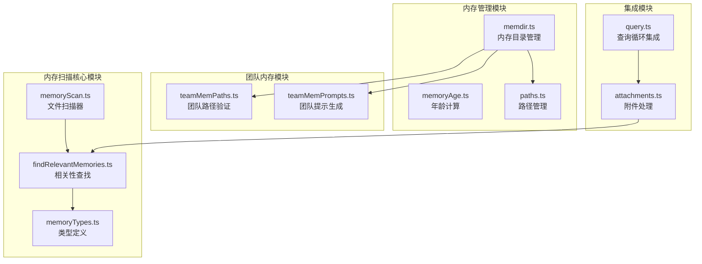
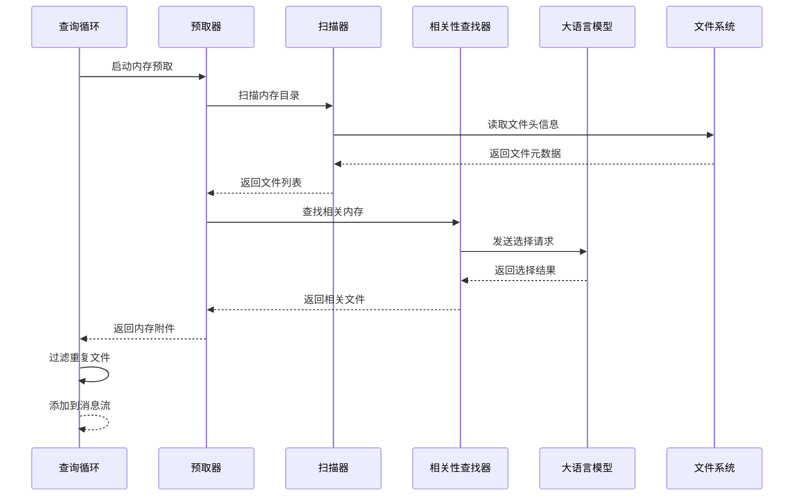
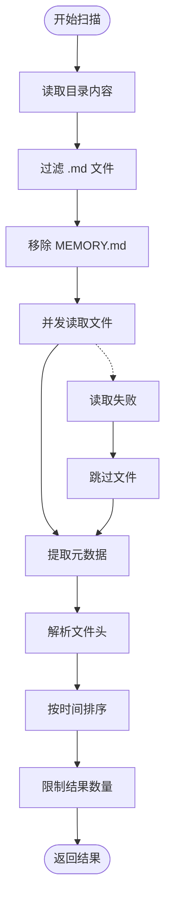
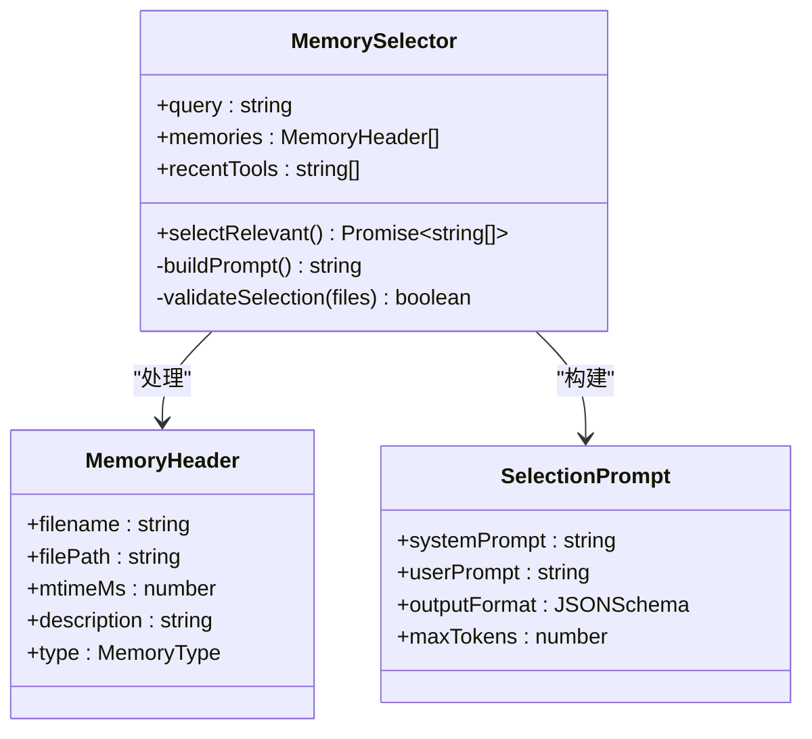
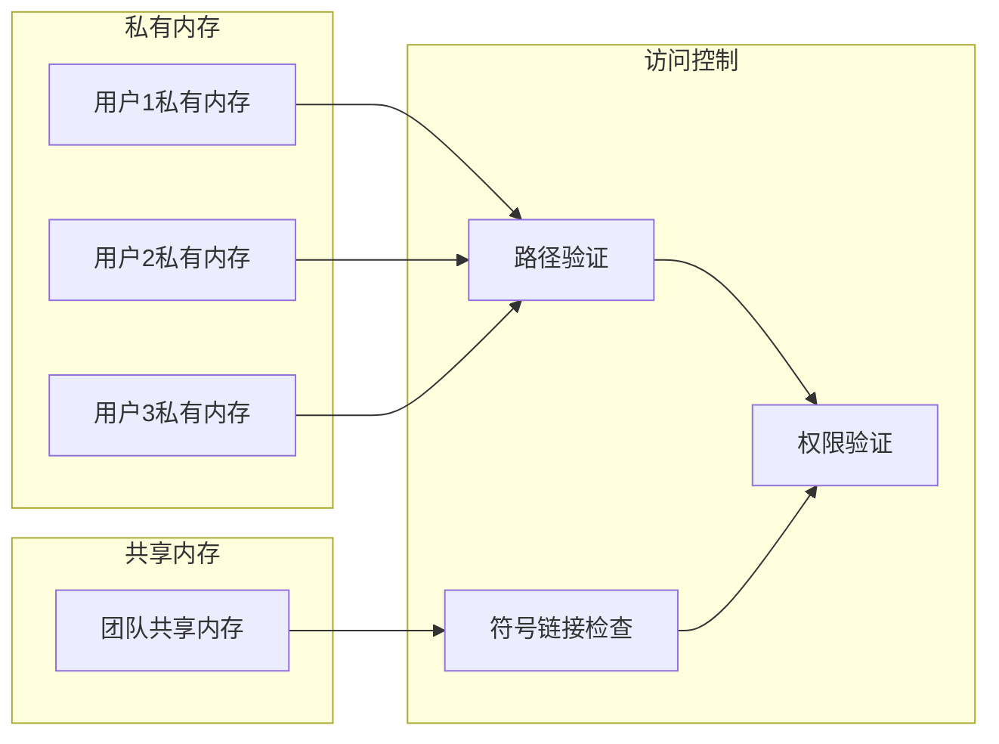
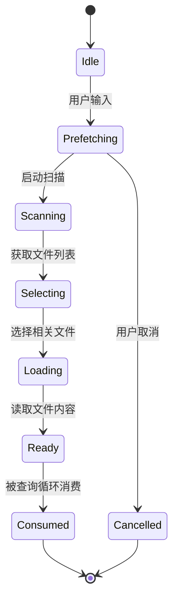
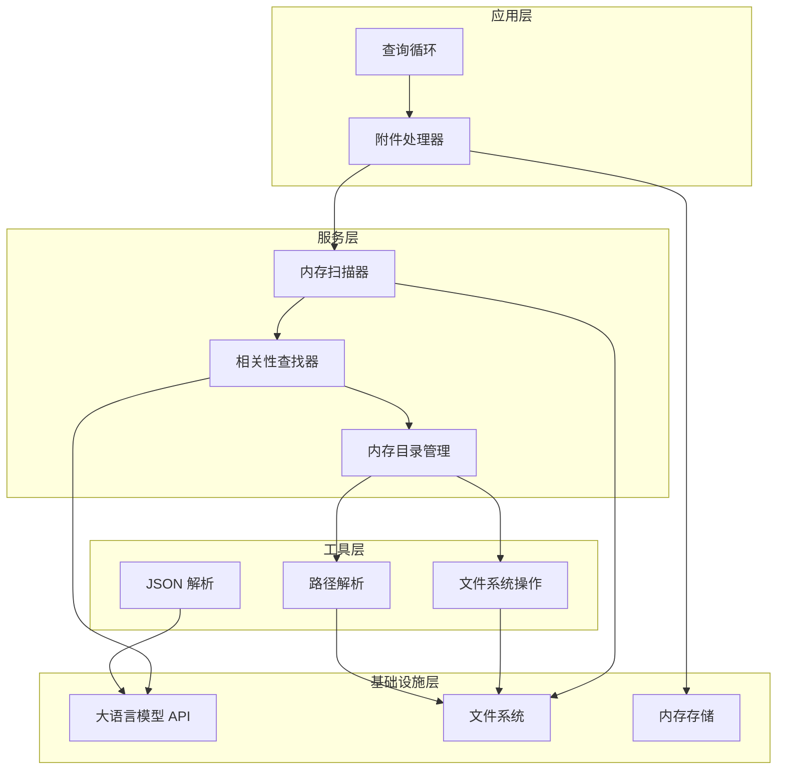

# 内存扫描功能

<cite>
**本文档引用的文件**
- [memoryScan.ts](file://src/memdir/memoryScan.ts)
- [findRelevantMemories.ts](file://src/memdir/findRelevantMemories.ts)
- [memoryTypes.ts](file://src/memdir/memoryTypes.ts)
- [memdir.ts](file://src/memdir/memdir.ts)
- [memoryAge.ts](file://src/memdir/memoryAge.ts)
- [paths.ts](file://src/memdir/paths.ts)
- [teamMemPaths.ts](file://src/memdir/teamMemPaths.ts)
- [teamMemPrompts.ts](file://src/memdir/teamMemPrompts.ts)
- [attachments.ts](file://src/utils/attachments.ts)
- [query.ts](file://src/query.ts)
</cite>

## 目录
1. [简介](#简介)
2. [项目结构](#项目结构)
3. [核心组件](#核心组件)
4. [架构概览](#架构概览)
5. [详细组件分析](#详细组件分析)
6. [依赖关系分析](#依赖关系分析)
7. [性能考虑](#性能考虑)
8. [故障排除指南](#故障排除指南)
9. [结论](#结论)

## 简介

Claude Code 的内存扫描功能是一个智能的文件系统扫描和检索系统，专门用于在大型项目中高效地发现和选择相关的记忆文件。该系统通过扫描内存目录中的 Markdown 文件，提取元数据信息，并使用大语言模型进行相关性评估，从而为用户提供最相关的上下文信息。

内存扫描功能的核心价值在于：
- **智能文件发现**：自动扫描内存目录中的所有 Markdown 文件
- **元数据提取**：从文件头信息中提取描述和类型信息
- **相关性排序**：基于语义相似度和上下文关联进行排序
- **性能优化**：通过预取和缓存机制提升响应速度
- **安全隔离**：支持团队内存和私有内存的隔离管理

## 项目结构

内存扫描功能主要分布在以下模块中：

**图表来源**
- [memoryScan.ts:1-95](file://src/memdir/memoryScan.ts#L1-L95)
- [findRelevantMemories.ts:1-142](file://src/memdir/findRelevantMemories.ts#L1-L142)
- [memdir.ts:1-508](file://src/memdir/memdir.ts#L1-L508)

## 核心组件

### 内存扫描器 (memoryScan.ts)

内存扫描器是整个系统的基础组件，负责扫描内存目录并提取文件元数据。

**关键特性**：
- **递归扫描**：支持深度递归扫描内存目录
- **元数据提取**：解析文件头信息，提取描述和类型
- **时间戳排序**：按修改时间降序排列结果
- **性能优化**：单次读取同时获取文件内容和修改时间

**扫描算法复杂度**：
- 时间复杂度：O(n) + O(k log k)，其中 n 是文件数量，k 是有效文件数量
- 空间复杂度：O(n)

**Section sources**
- [memoryScan.ts:35-77](file://src/memdir/memoryScan.ts#L35-L77)

### 相关性查找器 (findRelevantMemories.ts)

相关性查找器使用大语言模型来评估和选择最相关的内存文件。

**工作流程**：
1. 扫描内存目录获取文件列表
2. 过滤已显示的文件避免重复
3. 使用系统提示词指导模型选择
4. 解析模型输出的 JSON 结果
5. 返回相关文件的绝对路径和时间戳

**Section sources**
- [findRelevantMemories.ts:39-75](file://src/memdir/findRelevantMemories.ts#L39-L75)

### 内存类型系统 (memoryTypes.ts)

定义了四种内存类型，每种类型都有明确的用途和约束。

**四种内存类型**：
- **user**：用户个人信息和偏好
- **feedback**：用户反馈和行为指导
- **project**：项目相关信息和决策
- **reference**：外部资源引用链接

**Section sources**
- [memoryTypes.ts:14-31](file://src/memdir/memoryTypes.ts#L14-L31)

## 架构概览

内存扫描功能采用分层架构设计，确保了模块间的清晰分离和高内聚低耦合。

**图表来源**
- [attachments.ts:2361-2424](file://src/utils/attachments.ts#L2361-L2424)
- [findRelevantMemories.ts:77-141](file://src/memdir/findRelevantMemories.ts#L77-L141)

## 详细组件分析

### 内存扫描算法

内存扫描算法采用了优化的单次遍历策略，通过一次文件读取操作同时获取文件内容和元数据信息。

**算法特点**：
- **单次统计**：使用 `readFileInRange` 同时获取内容和修改时间
- **并发处理**：使用 `Promise.allSettled` 并发处理多个文件
- **内存控制**：限制最大文件数量为 200 个
- **错误恢复**：单个文件失败不影响整体扫描

**Section sources**
- [memoryScan.ts:35-77](file://src/memdir/memoryScan.ts#L35-L77)

### 相关性匹配算法

相关性匹配算法基于大语言模型的语义理解能力，结合多种启发式规则来评估文件的相关性。

**匹配策略**：
1. **语义相似度**：基于查询与文件描述的语义匹配
2. **工具相关性**：避免选择当前正在使用的工具文档
3. **时间新鲜度**：优先选择最近修改的文件
4. **类型约束**：根据内存类型进行分类筛选

**Section sources**
- [findRelevantMemories.ts:77-141](file://src/memdir/findRelevantMemories.ts#L77-L141)

### 团队内存管理

团队内存功能提供了多用户协作的内存管理能力，支持私有和共享两种模式。

**安全特性**：
- **路径注入防护**：防止通过 URL 编码或 Unicode 规范化攻击
- **符号链接检测**：使用 `realpath` 验证实际文件位置
- **权限隔离**：确保文件写入仅限于允许的目录范围

**Section sources**
- [teamMemPaths.ts:109-206](file://src/memdir/teamMemPaths.ts#L109-L206)

### 预取和缓存机制

内存预取机制通过提前扫描和加载相关文件来提升用户体验。

**预取策略**：
- **时机选择**：在用户输入后立即启动预取
- **去重机制**：避免重复加载相同文件
- **超时控制**：支持中断和清理机制
- **内存限制**：控制会话中内存附件的总大小

**Section sources**
- [attachments.ts:2361-2424](file://src/utils/attachments.ts#L2361-L2424)
- [query.ts:1592-1614](file://src/query.ts#L1592-L1614)

## 依赖关系分析

内存扫描功能的依赖关系体现了清晰的分层架构：

**依赖特点**：
- **向上依赖**：底层组件不依赖上层组件
- **向下依赖**：上层组件依赖底层组件
- **横向依赖**：同级组件之间通过接口通信
- **抽象隔离**：通过接口定义隔离具体实现

**Section sources**
- [attachments.ts:2196-2242](file://src/utils/attachments.ts#L2196-L2242)
- [memdir.ts:1-508](file://src/memdir/memdir.ts#L1-L508)

## 性能考虑

### 索引构建优化

内存扫描系统采用了多种优化策略来提升性能：

**文件系统优化**：
- **单次读取**：避免重复的文件统计操作
- **并发处理**：使用 Promise.allSettled 并发处理多个文件
- **内存限制**：限制最大文件数量避免内存溢出
- **错误容错**：单个文件失败不影响整体性能

**网络和 API 优化**：
- **预取机制**：提前启动相关性查找避免等待
- **去重过滤**：避免重复加载相同文件
- **超时控制**：支持快速取消长时间运行的操作
- **缓存策略**：利用会话级别的缓存减少重复计算

### 查询加速技术

**内存预取**：
- 在用户输入时启动预取，减少响应延迟
- 支持中断和清理，避免资源浪费
- 智能去重，避免重复加载

**结果过滤**：
- 基于会话状态过滤已读取的文件
- 限制结果数量，避免过多上下文
- 按时间排序，优先选择最新文件

**Section sources**
- [memoryScan.ts:21-34](file://src/memdir/memoryScan.ts#L21-L34)
- [attachments.ts:2361-2424](file://src/utils/attachments.ts#L2361-L2424)

## 故障排除指南

### 常见问题和解决方案

**内存扫描无结果**：
1. 检查内存目录是否存在且可访问
2. 确认文件格式符合要求（.md 文件）
3. 验证文件头包含有效的描述信息
4. 检查是否启用了相关功能开关

**相关性选择不准确**：
1. 检查查询语句是否清晰明确
2. 确认内存文件的描述信息是否准确
3. 验证内存类型分类是否正确
4. 调整相关性阈值设置

**性能问题**：
1. 检查文件数量是否超过限制
2. 确认网络连接是否稳定
3. 验证磁盘空间是否充足
4. 检查是否有其他进程占用资源

**安全警告**：
1. 检查路径验证是否通过
2. 确认没有路径遍历攻击尝试
3. 验证符号链接安全性
4. 确保权限设置正确

### 调试技巧

**启用调试日志**：
- 使用调试模式查看详细的执行过程
- 监控内存使用情况和性能指标
- 检查错误日志和异常信息
- 分析网络请求和响应时间

**性能监控**：
- 监控文件扫描时间
- 跟踪相关性查找的延迟
- 分析内存使用峰值
- 统计错误发生频率

**Section sources**
- [findRelevantMemories.ts:131-140](file://src/memdir/findRelevantMemories.ts#L131-L140)
- [teamMemPaths.ts:109-171](file://src/memdir/teamMemPaths.ts#L109-L171)

## 结论

Claude Code 的内存扫描功能通过精心设计的架构和优化策略，实现了高效的文件扫描、智能的相关性匹配和安全的内存管理。该系统的主要优势包括：

**技术创新**：
- 单次扫描获取元数据和内容的优化策略
- 基于大语言模型的相关性评估算法
- 多层次的安全防护机制
- 智能的预取和缓存策略

**实用性价值**：
- 显著提升用户查找相关信息的效率
- 提供准确的上下文增强
- 支持团队协作和知识管理
- 保持系统的稳定性和可靠性

**未来发展**：
- 可以进一步优化相关性算法
- 扩展支持更多的文件格式
- 增强个性化推荐能力
- 改进性能监控和诊断工具

该内存扫描功能为 Claude Code 提供了强大的上下文管理能力，是实现智能对话和高效开发体验的重要基础。