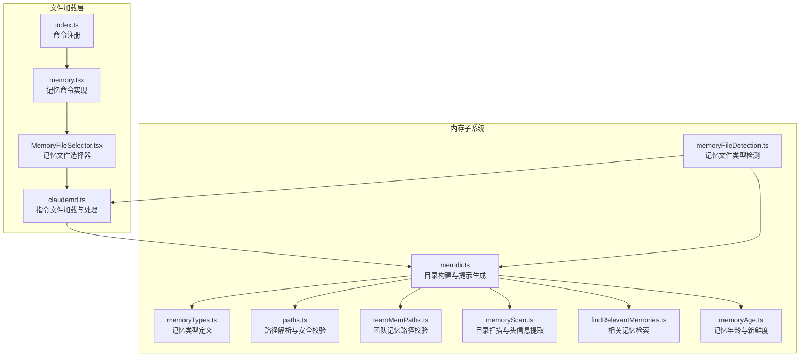
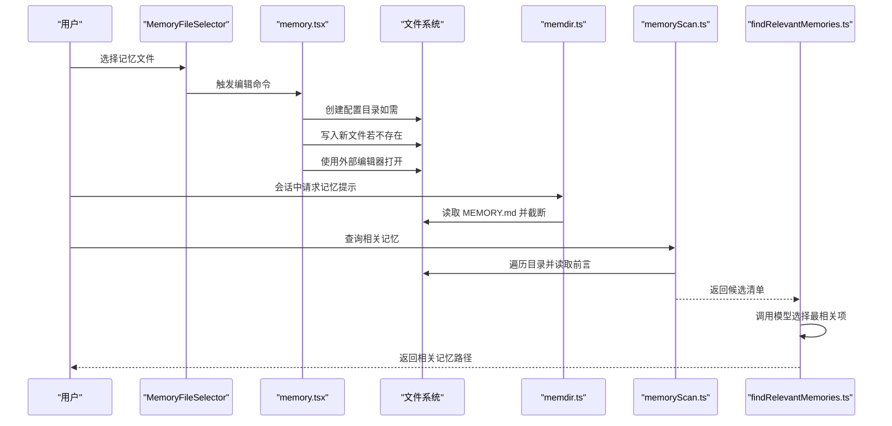
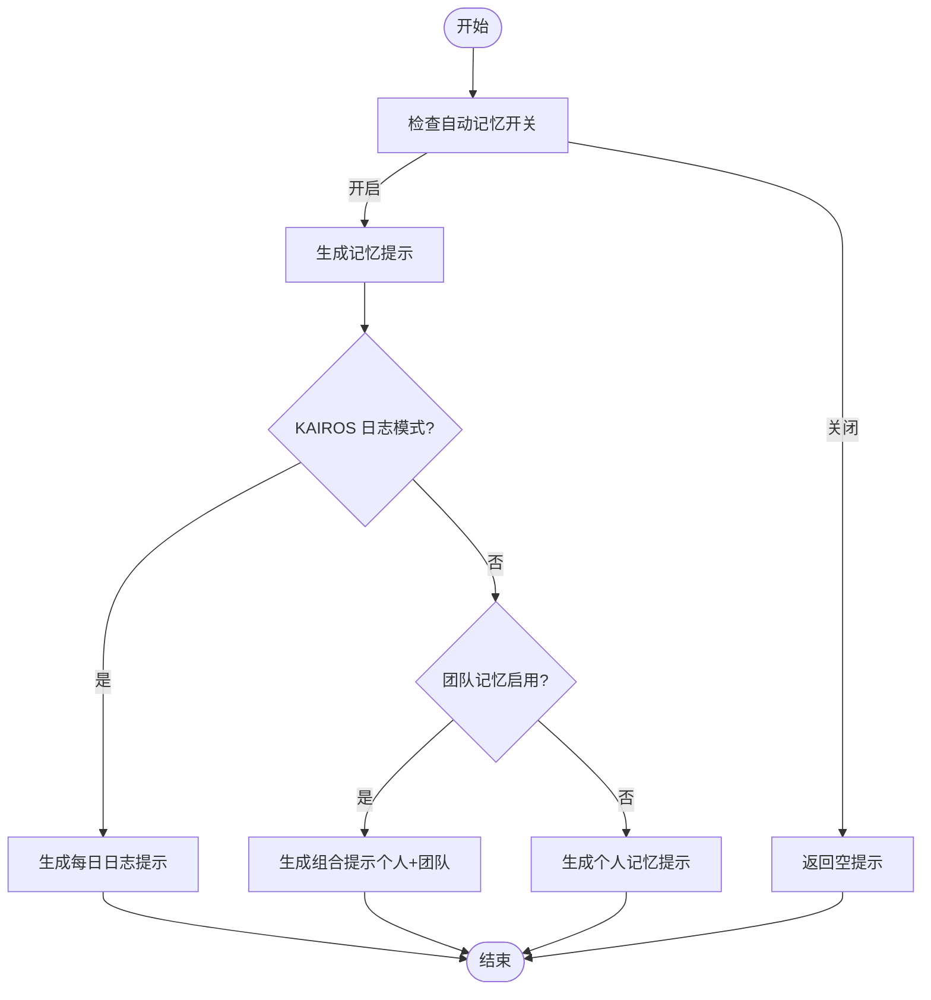
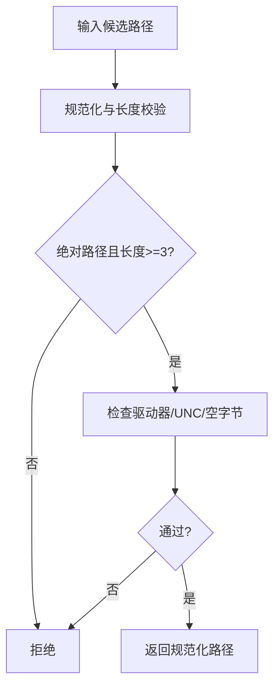
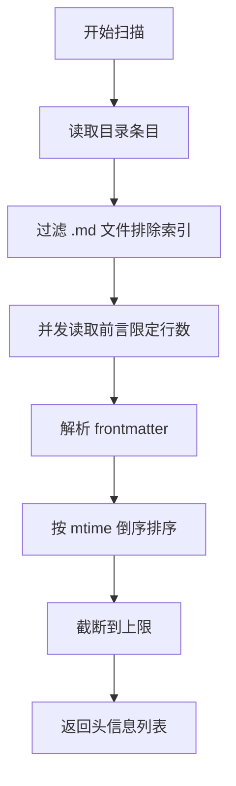
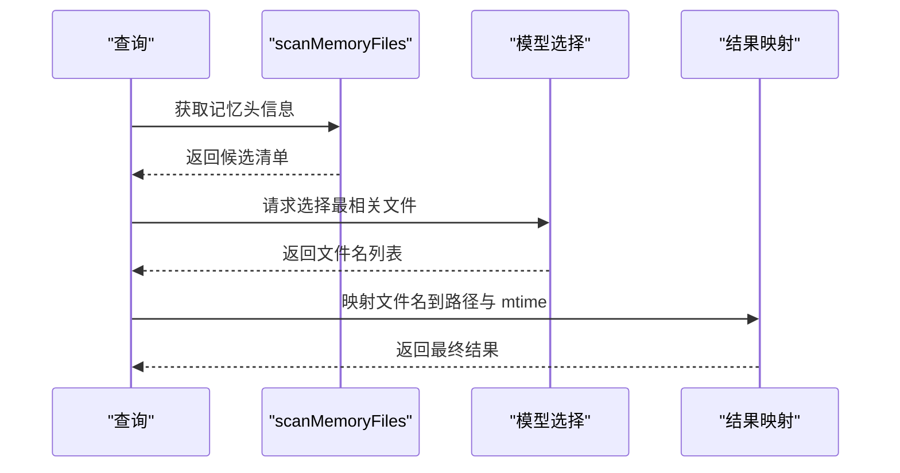
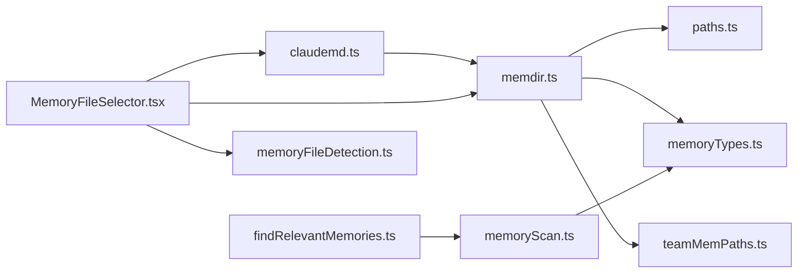

# 内存架构设计

<cite>
**本文档引用的文件**
- [memdir.ts](file://src/memdir/memdir.ts)
- [memoryTypes.ts](file://src/memdir/memoryTypes.ts)
- [paths.ts](file://src/memdir/paths.ts)
- [teamMemPaths.ts](file://src/memdir/teamMemPaths.ts)
- [findRelevantMemories.ts](file://src/memdir/findRelevantMemories.ts)
- [memoryScan.ts](file://src/memdir/memoryScan.ts)
- [memoryAge.ts](file://src/memdir/memoryAge.ts)
- [claudemd.ts](file://src/utils/claudemd.ts)
- [MemoryFileSelector.tsx](file://src/components/memory/MemoryFileSelector.tsx)
- [memory.tsx](file://src/commands/memory/memory.tsx)
- [index.ts](file://src/commands/memory/index.ts)
- [memoryFileDetection.ts](file://src/utils/memoryFileDetection.ts)
- [README.md](file://README.md)
</cite>

## 目录
1. [简介](#简介)
2. [项目结构](#项目结构)
3. [核心组件](#核心组件)
4. [架构总览](#架构总览)
5. [详细组件分析](#详细组件分析)
6. [依赖关系分析](#依赖关系分析)
7. [性能考量](#性能考量)
8. [故障排除指南](#故障排除指南)
9. [结论](#结论)

## 简介
本文件系统化梳理 Claude Code 的内存架构设计，聚焦于持久化记忆目录（memdir）与相关工具链。内容涵盖：
- 内存目录结构与文件组织方式
- 记忆类型分类体系与存储规则
- 目录创建与管理机制（含自动创建、权限与错误处理）
- 文件命名约定与组织原则
- 最佳实践与设计考虑
- 扩展性与可维护性分析

## 项目结构
内存子系统主要由以下模块组成：
- memdir：内存目录构建、提示生成、扫描与检索
- memdir/paths：路径解析与安全校验
- memdir/teamMemPaths：团队记忆目录的安全路径校验
- utils/claudemd：用户/项目/本地指令文件加载与处理
- components/memory/MemoryFileSelector：交互式记忆文件选择器
- commands/memory：命令入口，支持编辑记忆文件
- utils/memoryFileDetection：记忆文件类型检测与范围判定

**图表来源**
- [memdir.ts:1-508](file://src/memdir/memdir.ts#L1-L508)
- [memoryTypes.ts:1-272](file://src/memdir/memoryTypes.ts#L1-L272)
- [paths.ts:1-279](file://src/memdir/paths.ts#L1-L279)
- [teamMemPaths.ts:1-293](file://src/memdir/teamMemPaths.ts#L1-L293)
- [memoryScan.ts:1-95](file://src/memdir/memoryScan.ts#L1-L95)
- [findRelevantMemories.ts:1-142](file://src/memdir/findRelevantMemories.ts#L1-L142)
- [memoryAge.ts:1-54](file://src/memdir/memoryAge.ts#L1-L54)
- [claudemd.ts:1-800](file://src/utils/claudemd.ts#L1-L800)
- [MemoryFileSelector.tsx:1-438](file://src/components/memory/MemoryFileSelector.tsx#L1-L438)
- [memory.tsx:1-89](file://src/commands/memory/memory.tsx#L1-L89)
- [index.ts:1-10](file://src/commands/memory/index.ts#L1-L10)
- [memoryFileDetection.ts:1-290](file://src/utils/memoryFileDetection.ts#L1-L290)

**章节来源**
- [README.md:39-95](file://README.md#L39-L95)

## 核心组件
- 内存目录构建与提示生成：负责生成面向模型的记忆使用指导、索引文件（MEMORY.md）截断策略、搜索建议等。
- 路径解析与安全校验：解析内存基座目录、项目级目录、覆盖路径；执行安全校验（路径规范化、危险字符过滤、符号链接检测）。
- 目录扫描与头信息提取：遍历记忆目录，读取文件前言元数据，生成清单并排序。
- 相关记忆检索：基于查询与工具使用上下文，通过大模型选择最相关的记忆文件。
- 记忆年龄与新鲜度：计算记忆文件年龄，输出提醒文本，辅助模型在引用时进行事实校验。
- 指令文件加载与处理：加载用户/项目/本地指令文件，支持 @include 引用、HTML 注释剥离、内容截断等。
- 记忆文件选择器：交互式 UI，列出可用记忆文件（含 @include 导入的文件），支持打开目录与编辑文件。

**章节来源**
- [memdir.ts:1-508](file://src/memdir/memdir.ts#L1-L508)
- [paths.ts:1-279](file://src/memdir/paths.ts#L1-L279)
- [memoryScan.ts:1-95](file://src/memdir/memoryScan.ts#L1-L95)
- [findRelevantMemories.ts:1-142](file://src/memdir/findRelevantMemories.ts#L1-L142)
- [memoryAge.ts:1-54](file://src/memdir/memoryAge.ts#L1-L54)
- [claudemd.ts:1-800](file://src/utils/claudemd.ts#L1-L800)
- [MemoryFileSelector.tsx:1-438](file://src/components/memory/MemoryFileSelector.tsx#L1-L438)

## 架构总览
内存系统采用“目录驱动 + 文件前言元数据 + 大模型检索”的组合模式：
- 目录驱动：memdir 提供统一的目录结构与提示生成，确保模型在写入时遵循规范。
- 元数据驱动：memoryScan 仅读取文件前言部分，快速提取类型、描述等关键信息，避免全量读取。
- 检索驱动：findRelevantMemories 基于查询与近期工具使用情况，筛选出最相关的记忆文件。
- 安全驱动：paths 与 teamMemPaths 对路径进行严格校验，防止路径穿越与符号链接逃逸。

**图表来源**
- [memory.tsx:1-89](file://src/commands/memory/memory.tsx#L1-L89)
- [memdir.ts:1-508](file://src/memdir/memdir.ts#L1-L508)
- [memoryScan.ts:1-95](file://src/memdir/memoryScan.ts#L1-L95)
- [findRelevantMemories.ts:1-142](file://src/memdir/findRelevantMemories.ts#L1-L142)

## 详细组件分析

### 内存目录与提示生成（memdir.ts）
- 目录存在性保证：ensureMemoryDirExists 通过递归创建目录，屏蔽常见权限错误，便于模型直接写入。
- 提示生成：buildMemoryLines/buildMemoryPrompt 生成面向模型的记忆使用指导，包含类型定义、禁止保存内容、索引文件截断策略等。
- 索引文件截断：truncateEntrypointContent 对 MEMORY.md 进行行数与字节数双重限制，并追加警告提示。
- 搜索建议：buildSearchingPastContextSection 在启用特性开关时，提供针对记忆目录与会话日志的搜索建议。
- 组合模式：loadMemoryPrompt 根据是否启用自动记忆、助理日志模式、团队记忆等分支，返回不同提示内容。

**图表来源**
- [memdir.ts:419-507](file://src/memdir/memdir.ts#L419-L507)

**章节来源**
- [memdir.ts:1-508](file://src/memdir/memdir.ts#L1-L508)

### 路径解析与安全校验（paths.ts、teamMemPaths.ts）
- 自动记忆路径解析：优先级为环境变量覆盖 > 设置文件覆盖 > 默认基座目录 + 项目根路径拼接。
- 安全校验：拒绝相对路径、根路径、UNC 路径、包含空字节等危险路径；支持波浪号展开（设置文件场景）。
- 团队记忆路径：teamMemPaths 在团队记忆启用时，对路径进行字符串与符号链接双重校验，防止路径穿越与逃逸。
- 实际写入保护：当设置了覆盖路径时，文件写入的白名单豁免不适用，确保写入安全性。

**图表来源**
- [paths.ts:109-150](file://src/memdir/paths.ts#L109-L150)
- [teamMemPaths.ts:109-171](file://src/memdir/teamMemPaths.ts#L109-L171)

**章节来源**
- [paths.ts:1-279](file://src/memdir/paths.ts#L1-L279)
- [teamMemPaths.ts:1-293](file://src/memdir/teamMemPaths.ts#L1-L293)

### 目录扫描与头信息提取（memoryScan.ts）
- 扫描策略：遍历目录，过滤 .md 文件（排除索引文件），限制最大文件数量，按修改时间倒序。
- 前言解析：仅读取前若干行，解析 frontmatter，提取类型与描述字段。
- 清单格式：formatMemoryManifest 输出简洁的清单文本，便于检索与注入。

**图表来源**
- [memoryScan.ts:35-77](file://src/memdir/memoryScan.ts#L35-L77)

**章节来源**
- [memoryScan.ts:1-95](file://src/memdir/memoryScan.ts#L1-L95)

### 相关记忆检索（findRelevantMemories.ts）
- 输入：查询语句、记忆目录、最近使用的工具列表、已展示文件集合。
- 流程：先扫描目录得到头信息，再调用模型选择最相关的文件名，最后映射回完整路径与修改时间。
- 优化：通过 alreadySurfaced 过滤已展示文件，减少重复选择成本。

**图表来源**
- [findRelevantMemories.ts:39-75](file://src/memdir/findRelevantMemories.ts#L39-L75)

**章节来源**
- [findRelevantMemories.ts:1-142](file://src/memdir/findRelevantMemories.ts#L1-L142)

### 记忆年龄与新鲜度（memoryAge.ts）
- 年龄计算：以天为单位向下取整，区分今天/昨天与其他日期。
- 新鲜度提醒：对超过一天的记忆输出系统提醒文本，提示在引用前验证当前状态。

**章节来源**
- [memoryAge.ts:1-54](file://src/memdir/memoryAge.ts#L1-L54)

### 指令文件加载与处理（claudemd.ts）
- 加载顺序：全局指令 → 用户指令 → 项目指令 → 本地指令（越近越优先）。
- @include 支持：解析 @path 引用，支持相对/绝对/家目录路径，忽略代码块内引用，处理循环引用。
- 安全与性能：限制文本文件类型，剥离 HTML 注释，截断索引文件，记录权限错误事件。
- 排除规则：支持基于设置的排除模式（含符号链接解析），避免敏感或不需要的文件被加载。

**章节来源**
- [claudemd.ts:1-800](file://src/utils/claudemd.ts#L1-L800)

### 记忆文件选择器（MemoryFileSelector.tsx）
- 功能：列出所有可用记忆文件（含 @include 导入的文件），支持打开目录与编辑文件。
- 交互：提供切换自动记忆与自动梦境开关，显示上次运行状态；支持键盘快捷键导航。
- 安全：对团队记忆目录与自动记忆目录提供打开按钮，内部仍受路径校验约束。

**章节来源**
- [MemoryFileSelector.tsx:1-438](file://src/components/memory/MemoryFileSelector.tsx#L1-L438)

### 记忆命令入口（memory.tsx、index.ts）
- 命令注册：/memory 命令注册为本地 JSX 组件。
- 编辑流程：确保配置目录存在，尝试创建文件（若不存在），使用外部编辑器打开，记录编辑器来源提示。

**章节来源**
- [index.ts:1-10](file://src/commands/memory/index.ts#L1-L10)
- [memory.tsx:1-89](file://src/commands/memory/memory.tsx#L1-L89)

### 记忆文件类型检测（memoryFileDetection.ts）
- 类型判定：识别会话记忆文件、会话转录文件、自动记忆文件、团队记忆文件、代理记忆文件。
- 目录判定：判断给定目录是否属于记忆相关目录（含覆盖路径与配置基座目录）。
- 命令目标判定：判断 shell 命令是否针对记忆目录或文件。

**章节来源**
- [memoryFileDetection.ts:1-290](file://src/utils/memoryFileDetection.ts#L1-L290)

## 依赖关系分析
- memdir.ts 依赖：
  - paths.ts：路径解析与安全校验
  - memoryTypes.ts：记忆类型定义
  - teamMemPaths.ts：团队记忆路径校验（条件加载）
- memoryScan.ts 依赖：
  - memoryTypes.ts：类型解析
  - utils/frontmatterParser.ts：前言解析
  - utils/readFileInRange.ts：高效读取前言
- findRelevantMemories.ts 依赖：
  - memoryScan.ts：扫描与清单
  - utils/sideQuery.ts：模型选择
  - utils/model/model.ts：默认模型
- claudemd.ts 依赖：
  - memdir/memdir.ts：索引截断
  - utils/frontmatterParser.ts：前言解析
  - utils/readFileInRange.ts：高效读取
  - utils/errors.ts：错误码提取
- MemoryFileSelector.tsx 依赖：
  - memdir/paths.ts：自动记忆路径
  - utils/claudemd.ts：记忆文件列表
  - tools/AgentTool/agentMemory.ts：代理记忆目录
  - utils/memoryFileDetection.ts：类型检测

**图表来源**
- [memdir.ts:1-508](file://src/memdir/memdir.ts#L1-L508)
- [paths.ts:1-279](file://src/memdir/paths.ts#L1-L279)
- [memoryTypes.ts:1-272](file://src/memdir/memoryTypes.ts#L1-L272)
- [teamMemPaths.ts:1-293](file://src/memdir/teamMemPaths.ts#L1-L293)
- [memoryScan.ts:1-95](file://src/memdir/memoryScan.ts#L1-L95)
- [findRelevantMemories.ts:1-142](file://src/memdir/findRelevantMemories.ts#L1-L142)
- [claudemd.ts:1-800](file://src/utils/claudemd.ts#L1-L800)
- [MemoryFileSelector.tsx:1-438](file://src/components/memory/MemoryFileSelector.tsx#L1-L438)
- [memoryFileDetection.ts:1-290](file://src/utils/memoryFileDetection.ts#L1-L290)

**章节来源**
- [memdir.ts:1-508](file://src/memdir/memdir.ts#L1-L508)
- [memoryScan.ts:1-95](file://src/memdir/memoryScan.ts#L1-L95)
- [findRelevantMemories.ts:1-142](file://src/memdir/findRelevantMemories.ts#L1-L142)
- [claudemd.ts:1-800](file://src/utils/claudemd.ts#L1-L800)
- [MemoryFileSelector.tsx:1-438](file://src/components/memory/MemoryFileSelector.tsx#L1-L438)
- [memoryFileDetection.ts:1-290](file://src/utils/memoryFileDetection.ts#L1-L290)

## 性能考量
- I/O 优化
  - memoryScan 采用单次读取 + 排序策略，避免双倍 stat 调用，提升大规模目录扫描效率。
  - truncateEntrypointContent 与 readFileInRange 限制读取范围，降低内存占用。
- 并发与缓存
  - getMemoryFiles 使用 memoize 缓存，减少重复扫描与解析开销。
  - findRelevantMemories 通过 alreadySurfaced 过滤，避免重复选择。
- 模型调用
  - 选择器仅在必要时调用模型，且输出格式受控，减少 token 消耗。
- 权限与错误处理
  - ensureMemoryDirExists 屏蔽常见权限错误，避免阻塞提示构建。
  - claudemd.ts 对权限错误进行事件上报，便于诊断。

[本节为通用性能讨论，无需特定文件引用]

## 故障排除指南
- 目录创建失败
  - 现象：提示构建阶段无法创建目录。
  - 排查：检查权限与磁盘空间；确认 isAutoMemoryEnabled 开关状态。
  - 参考：[memdir.ts:129-147](file://src/memdir/memdir.ts#L129-L147)
- 路径校验失败
  - 现象：访问团队记忆或自动记忆目录时报错。
  - 排查：检查路径是否包含危险字符、是否为符号链接逃逸；确认 isTeamMemoryEnabled 与 isAutoMemoryEnabled。
  - 参考：[paths.ts:109-150](file://src/memdir/paths.ts#L109-L150)、[teamMemPaths.ts:109-171](file://src/memdir/teamMemPaths.ts#L109-L171)
- 记忆文件未加载
  - 现象：@include 引用的文件未出现在记忆列表。
  - 排查：确认文件扩展名在允许列表中；检查排除规则；确认路径解析与符号链接处理。
  - 参考：[claudemd.ts:96-227](file://src/utils/claudemd.ts#L96-L227)、[claudemd.ts:547-612](file://src/utils/claudemd.ts#L547-L612)
- 编辑器无法打开
  - 现象：/memory 命令无法打开外部编辑器。
  - 排查：检查 $EDITOR 或 $VISUAL 环境变量；确认目录已创建。
  - 参考：[memory.tsx:44-58](file://src/commands/memory/memory.tsx#L44-L58)

**章节来源**
- [memdir.ts:129-147](file://src/memdir/memdir.ts#L129-L147)
- [paths.ts:109-150](file://src/memdir/paths.ts#L109-L150)
- [teamMemPaths.ts:109-171](file://src/memdir/teamMemPaths.ts#L109-L171)
- [claudemd.ts:96-227](file://src/utils/claudemd.ts#L96-L227)
- [claudemd.ts:547-612](file://src/utils/claudemd.ts#L547-L612)
- [memory.tsx:44-58](file://src/commands/memory/memory.tsx#L44-L58)

## 结论
Claude Code 的内存架构以“目录 + 元数据 + 检索”为核心，结合严格的路径安全校验与高效的 I/O 策略，实现了可扩展、可维护且安全的记忆系统：
- 目录结构清晰：自动记忆与团队记忆分层管理，索引文件截断保障上下文控制。
- 类型体系明确：四类记忆类型与禁止保存清单，确保记忆质量与一致性。
- 安全优先：从路径规范化到符号链接检测，多层防护防止越权与逃逸。
- 可维护性强：模块职责清晰、依赖边界明确，便于演进与调试。