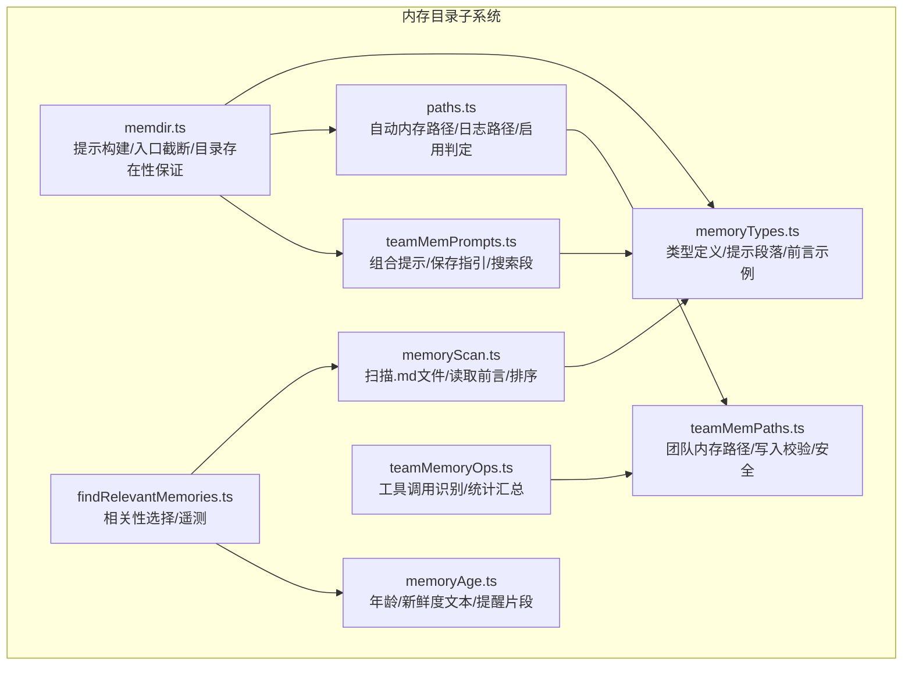
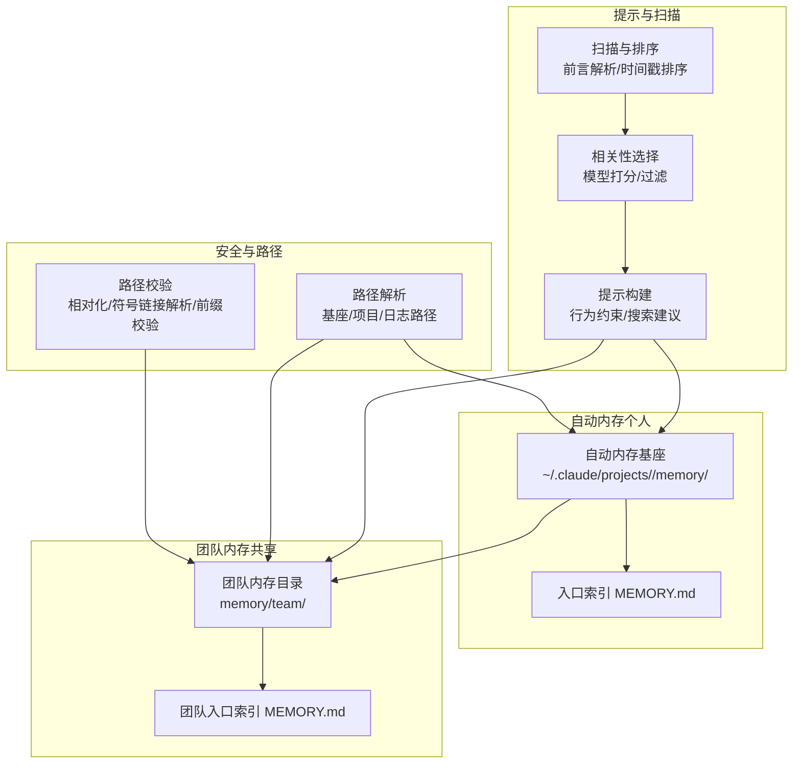
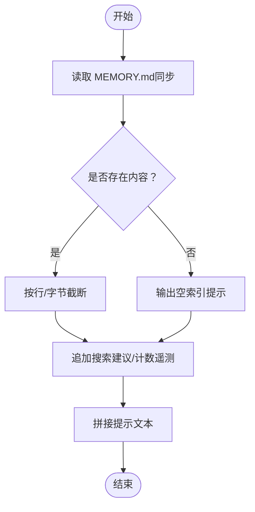
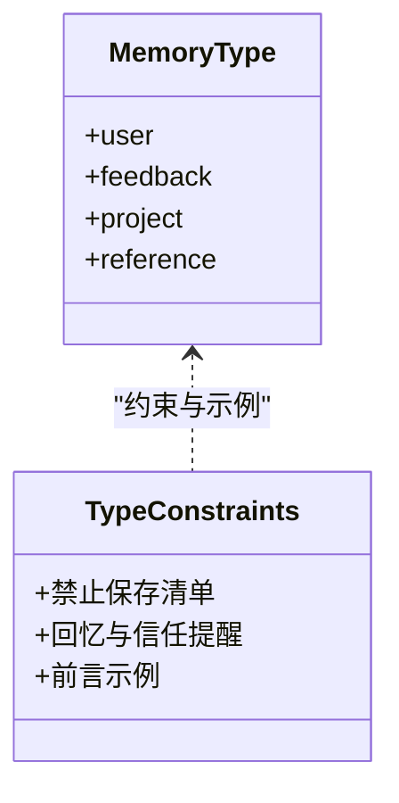
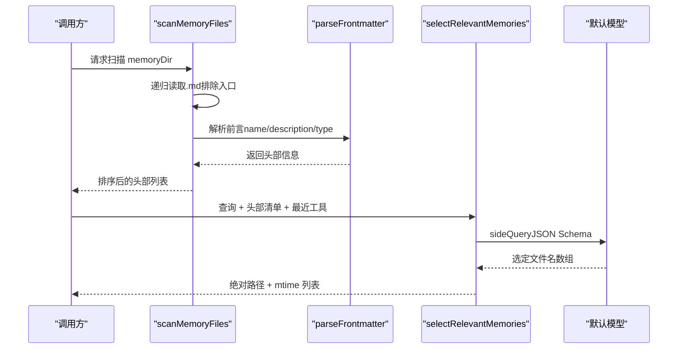
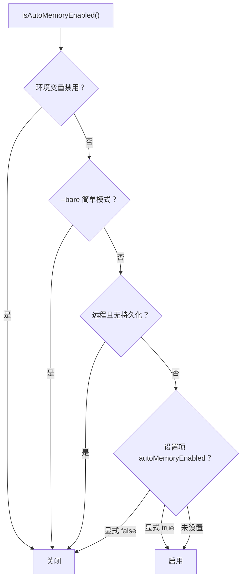
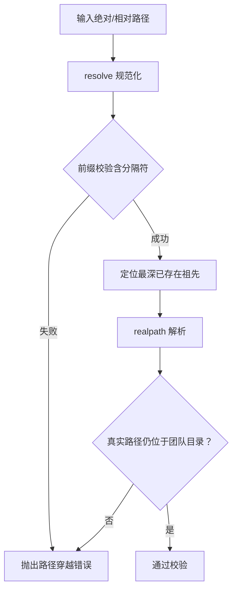
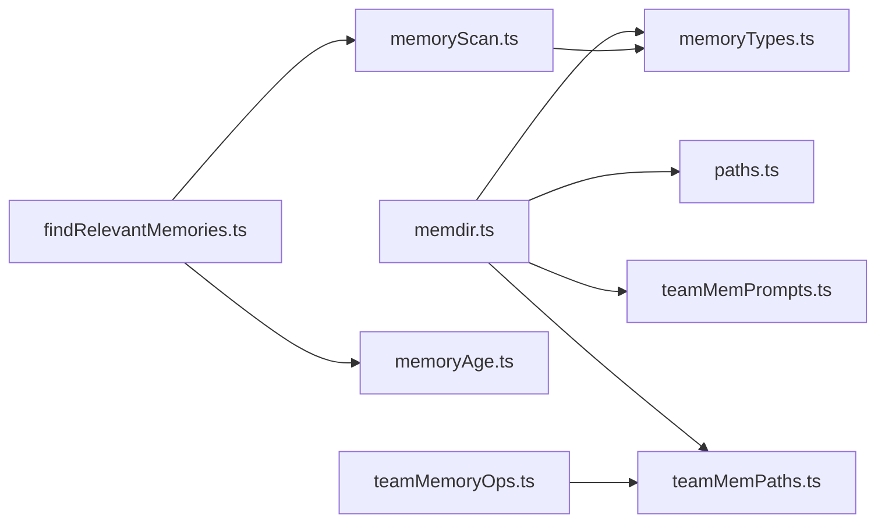

# 内存目录

<cite>
**本文引用的文件**
- [memdir.ts](file://src/memdir/memdir.ts)
- [memoryTypes.ts](file://src/memdir/memoryTypes.ts)
- [memoryScan.ts](file://src/memdir/memoryScan.ts)
- [findRelevantMemories.ts](file://src/memdir/findRelevantMemories.ts)
- [memoryAge.ts](file://src/memdir/memoryAge.ts)
- [paths.ts](file://src/memdir/paths.ts)
- [teamMemPaths.ts](file://src/memdir/teamMemPaths.ts)
- [teamMemPrompts.ts](file://src/memdir/teamMemPrompts.ts)
- [teamMemoryOps.ts](file://src/utils/teamMemoryOps.ts)
- [MemoryUsageIndicator.tsx](file://src/components/MemoryUsageIndicator.tsx)
</cite>

## 目录
1. [简介](#简介)
2. [项目结构](#项目结构)
3. [核心组件](#核心组件)
4. [架构总览](#架构总览)
5. [组件详解](#组件详解)
6. [依赖关系分析](#依赖关系分析)
7. [性能与存储考量](#性能与存储考量)
8. [故障排查指南](#故障排查指南)
9. [结论](#结论)
10. [附录：配置与使用](#附录配置与使用)

## 简介
本文件系统性阐述 Claude Code 的“内存目录”（MemDir）设计与实现，覆盖以下主题：
- 存储结构：个人记忆（自动内存）、团队记忆（共享内存）、入口索引（MEMORY.md）
- 生命周期：创建、更新、删除、归档与日志模式
- 检索与查询：扫描、摘要格式化、相关性选择、新鲜度提示
- 同步与安全：团队内存路径校验、写入校验、跨进程一致性
- 配置与使用：路径解析、开关控制、提示构建、搜索建议
- 性能与存储：扫描策略、截断与节流、缓存与遥测

## 项目结构
内存目录相关代码集中在 src/memdir 下，并通过若干工具与服务模块协同工作。

**图表来源**
- [memdir.ts:1-508](file://src/memdir/memdir.ts#L1-L508)
- [memoryTypes.ts:1-272](file://src/memdir/memoryTypes.ts#L1-L272)
- [memoryScan.ts:1-95](file://src/memdir/memoryScan.ts#L1-L95)
- [findRelevantMemories.ts:1-142](file://src/memdir/findRelevantMemories.ts#L1-L142)
- [memoryAge.ts:1-54](file://src/memdir/memoryAge.ts#L1-L54)
- [paths.ts:1-279](file://src/memdir/paths.ts#L1-L279)
- [teamMemPaths.ts:1-293](file://src/memdir/teamMemPaths.ts#L1-L293)
- [teamMemPrompts.ts:1-101](file://src/memdir/teamMemPrompts.ts#L1-L101)
- [teamMemoryOps.ts:1-89](file://src/utils/teamMemoryOps.ts#L1-L89)

**章节来源**
- [memdir.ts:1-508](file://src/memdir/memdir.ts#L1-L508)
- [paths.ts:1-279](file://src/memdir/paths.ts#L1-L279)

## 核心组件
- 提示构建与入口管理：负责生成系统提示、确保内存目录存在、截断入口内容、注入搜索建议等。
- 类型与约束：定义四类记忆类型、禁止保存清单、回忆与信任提醒、前言示例。
- 扫描与相关性：扫描 .md 文件、提取头部信息、格式化清单、基于模型选择相关记忆。
- 年龄与新鲜度：计算天数、生成可读文本、输出系统提醒片段。
- 路径与启用：解析自动内存基座与项目路径、日志路径、启用开关；支持覆盖与安全校验。
- 团队内存：团队目录结构、路径校验、写入校验、组合提示与搜索段。
- 工具集成：识别团队内存的搜索/写入/编辑操作，汇总统计。

**章节来源**
- [memdir.ts:111-507](file://src/memdir/memdir.ts#L111-L507)
- [memoryTypes.ts:1-272](file://src/memdir/memoryTypes.ts#L1-L272)
- [memoryScan.ts:1-95](file://src/memdir/memoryScan.ts#L1-L95)
- [findRelevantMemories.ts:1-142](file://src/memdir/findRelevantMemories.ts#L1-L142)
- [memoryAge.ts:1-54](file://src/memdir/memoryAge.ts#L1-L54)
- [paths.ts:1-279](file://src/memdir/paths.ts#L1-L279)
- [teamMemPaths.ts:1-293](file://src/memdir/teamMemPaths.ts#L1-L293)
- [teamMemPrompts.ts:1-101](file://src/memdir/teamMemPrompts.ts#L1-L101)
- [teamMemoryOps.ts:1-89](file://src/utils/teamMemoryOps.ts#L1-L89)

## 架构总览
内存目录系统围绕“文件系统 + 提示工程 + 可选团队同步”的架构展开。自动内存（个人）与团队内存（共享）在路径上同属一个基座，团队内存为自动内存的一个子目录。系统通过提示构建器注入行为约束与使用建议，通过扫描与相关性选择提升检索效率，并通过路径校验与写入校验保障安全。

**图表来源**
- [paths.ts:85-279](file://src/memdir/paths.ts#L85-L279)
- [teamMemPaths.ts:84-293](file://src/memdir/teamMemPaths.ts#L84-L293)
- [memdir.ts:111-507](file://src/memdir/memdir.ts#L111-L507)
- [memoryScan.ts:35-95](file://src/memdir/memoryScan.ts#L35-L95)
- [findRelevantMemories.ts:39-142](file://src/memdir/findRelevantMemories.ts#L39-L142)

## 组件详解

### 提示构建与入口管理（memdir.ts）
- 入口截断：对 MEMORY.md 进行行数与字节数双重限制，先按行截断再按字节截断，避免切半行；在末尾追加警告提示。
- 目录存在性保证：幂等创建内存目录，捕获权限错误以便调试但不影响提示构建。
- 提示构建：
  - 个体模式：仅生成个人目录的提示与保存指引。
  - 组合模式：同时包含个人与团队目录，提供“作用域”与“保存两步法”。
  - 助手模式（KAIROS 日志）：采用追加式日志文件而非实时索引，夜间整理到索引。
- 搜索建议：根据嵌入式搜索能力或工具形式生成 grep 命令，优先内存目录，其次会话转录日志。

**图表来源**
- [memdir.ts:272-316](file://src/memdir/memdir.ts#L272-L316)
- [memdir.ts:318-407](file://src/memdir/memdir.ts#L318-L407)

**章节来源**
- [memdir.ts:41-103](file://src/memdir/memdir.ts#L41-L103)
- [memdir.ts:129-147](file://src/memdir/memdir.ts#L129-L147)
- [memdir.ts:199-316](file://src/memdir/memdir.ts#L199-L316)
- [memdir.ts:318-407](file://src/memdir/memdir.ts#L318-L407)
- [memdir.ts:419-507](file://src/memdir/memdir.ts#L419-L507)

### 记忆类型与约束（memoryTypes.ts）
- 四类记忆：user、feedback、project、reference，严格限定“不可派生自当前项目状态”的内容。
- 禁止保存清单：代码模式、架构、文件路径、git 历史、调试方案、CLAUDE.md 已有内容、临时任务细节。
- 回忆与信任提醒：强调“记忆可能过期”，建议先核对当前状态；命名函数/文件/标志即为当时快照。
- 前言示例：提供 name/description/type 等字段的示例格式。

**图表来源**
- [memoryTypes.ts:14-31](file://src/memdir/memoryTypes.ts#L14-L31)
- [memoryTypes.ts:183-272](file://src/memdir/memoryTypes.ts#L183-L272)

**章节来源**
- [memoryTypes.ts:1-272](file://src/memdir/memoryTypes.ts#L1-L272)

### 扫描与相关性（memoryScan.ts / findRelevantMemories.ts）
- 扫描策略：
  - 递归遍历目录，过滤 .md（排除入口索引）。
  - 仅读取前若干行以解析前言，获取描述与类型，同时获得 mtimeMs。
  - 单次读取后排序，避免双倍 stat。
  - 结果上限固定，防止大规模目录导致性能问题。
- 相关性选择：
  - 将扫描结果格式化为清单，结合近期工具列表过滤噪声。
  - 使用模型进行 JSON Schema 输出，返回最相关的文件名集合。
  - 支持遥测记录选择形状与命中率。

**图表来源**
- [memoryScan.ts:35-77](file://src/memdir/memoryScan.ts#L35-L77)
- [findRelevantMemories.ts:77-142](file://src/memdir/findRelevantMemories.ts#L77-L142)

**章节来源**
- [memoryScan.ts:1-95](file://src/memdir/memoryScan.ts#L1-L95)
- [findRelevantMemories.ts:1-142](file://src/memdir/findRelevantMemories.ts#L1-L142)

### 新鲜度与年龄（memoryAge.ts）
- 天数计算：以毫秒差换算为天数，向下取整，负值钳制为 0。
- 可读文本：对超过一天的记忆生成“旧”提醒，建议核对当前代码。
- 系统提醒片段：包装为系统提醒标签，便于下游消费。

**章节来源**
- [memoryAge.ts:1-54](file://src/memdir/memoryAge.ts#L1-L54)

### 路径与启用（paths.ts）
- 启用判定：环境变量、简单模式、远程无持久化、设置项，按优先级决定是否启用自动内存。
- 基座与项目路径：支持环境变量覆盖、设置项覆盖、默认基座（~/.claude），并以规范化的项目根作为键进行缓存。
- 日志路径：助手模式下按日期生成日志文件路径，夜间整理到索引。
- 安全校验：拒绝相对路径、根路径、Windows 驱动器根、UNC、空字节等危险输入。

**图表来源**
- [paths.ts:30-55](file://src/memdir/paths.ts#L30-L55)

**章节来源**
- [paths.ts:1-279](file://src/memdir/paths.ts#L1-L279)

### 团队内存（teamMemPaths.ts / teamMemPrompts.ts）
- 目录结构：团队目录位于自动内存基座之下，按项目隔离。
- 启用判定：必须先启用自动内存，再由特性门控开启团队内存。
- 安全校验：
  - 字符串层：resolve 规避 .. 注入；前缀校验防止前缀攻击。
  - 符号链接层：解析最深已存在祖先，验证真实路径仍在团队目录内；处理环链、悬挂链接等异常。
- 写入校验：对写入路径执行双重校验，确保不逃逸。
- 组合提示：提供“作用域”说明、“保存两步法”、搜索建议与持久化对比。

**图表来源**
- [teamMemPaths.ts:214-256](file://src/memdir/teamMemPaths.ts#L214-L256)

**章节来源**
- [teamMemPaths.ts:1-293](file://src/memdir/teamMemPaths.ts#L1-L293)
- [teamMemPrompts.ts:1-101](file://src/memdir/teamMemPrompts.ts#L1-L101)

### 工具集成与统计（teamMemoryOps.ts）
- 搜索识别：判断搜索工具输入的目标是否指向团队内存。
- 写入/编辑识别：判断写入或编辑工具是否针对团队内存。
- 统计汇总：将团队内存的读取/搜索/写入次数转化为自然语言摘要。

**章节来源**
- [teamMemoryOps.ts:1-89](file://src/utils/teamMemoryOps.ts#L1-L89)

## 依赖关系分析
- 模块耦合：
  - memdir.ts 依赖 paths.ts（路径）、memoryTypes.ts（类型与提示段）、teamMemPrompts.ts（组合提示）、teamMemPaths.ts（团队启用）。
  - memoryScan.ts 依赖 memoryTypes.ts（类型解析）与文件系统工具。
  - findRelevantMemories.ts 依赖 memoryScan.ts 与 sideQuery。
  - teamMemPaths.ts 与 teamMemPrompts.ts 共同维护团队内存提示与安全。
- 外部依赖：
  - 文件系统 API（fs/promises）、路径工具（path）、前端言解析、侧查询接口、遥测与特性门控。

**图表来源**
- [memdir.ts:1-508](file://src/memdir/memdir.ts#L1-L508)
- [memoryScan.ts:1-95](file://src/memdir/memoryScan.ts#L1-L95)
- [findRelevantMemories.ts:1-142](file://src/memdir/findRelevantMemories.ts#L1-L142)
- [memoryAge.ts:1-54](file://src/memdir/memoryAge.ts#L1-L54)
- [paths.ts:1-279](file://src/memdir/paths.ts#L1-L279)
- [teamMemPaths.ts:1-293](file://src/memdir/teamMemPaths.ts#L1-L293)
- [teamMemPrompts.ts:1-101](file://src/memdir/teamMemPrompts.ts#L1-L101)
- [teamMemoryOps.ts:1-89](file://src/utils/teamMemoryOps.ts#L1-L89)

**章节来源**
- [memdir.ts:1-508](file://src/memdir/memdir.ts#L1-L508)
- [memoryScan.ts:1-95](file://src/memdir/memoryScan.ts#L1-L95)
- [findRelevantMemories.ts:1-142](file://src/memdir/findRelevantMemories.ts#L1-L142)
- [memoryAge.ts:1-54](file://src/memdir/memoryAge.ts#L1-L54)
- [paths.ts:1-279](file://src/memdir/paths.ts#L1-L279)
- [teamMemPaths.ts:1-293](file://src/memdir/teamMemPaths.ts#L1-L293)
- [teamMemPrompts.ts:1-101](file://src/memdir/teamMemPrompts.ts#L1-L101)
- [teamMemoryOps.ts:1-89](file://src/utils/teamMemoryOps.ts#L1-L89)

## 性能与存储考量
- 扫描与排序
  - 单次读取 + 排序，避免二次 stat，适合 N≤200 的常见规模。
  - 限制最大文件数，防止大目录拖慢。
- 截断策略
  - MEMORY.md 行数与字节数双重限制，先按行截断，再按字节截断至最近换行，避免切半。
- 缓存与计数
  - 目录计数异步上报，不阻塞提示构建。
  - 自动内存路径按项目根缓存，减少重复解析。
- 搜索建议
  - 根据嵌入式搜索能力或工具形式动态生成命令，优先内存目录，降低对大型转录日志的依赖。
- 内存监控
  - CLI 中提供内存使用指示器，高/危时显示大小与堆转储入口，辅助诊断。

**章节来源**
- [memoryScan.ts:21-77](file://src/memdir/memoryScan.ts#L21-L77)
- [memdir.ts:41-103](file://src/memdir/memdir.ts#L41-L103)
- [paths.ts:223-235](file://src/memdir/paths.ts#L223-L235)
- [memdir.ts:153-185](file://src/memdir/memdir.ts#L153-L185)
- [MemoryUsageIndicator.tsx:1-37](file://src/components/MemoryUsageIndicator.tsx#L1-L37)

## 故障排查指南
- 目录无法创建/写入
  - 检查权限与只读文件系统；系统会在日志中记录失败原因。
  - 确认路径未被拒绝（根路径、UNC、空字节等）。
- MEMORY.md 被截断
  - 检查行数与字节大小，遵循“每行约 150 字符以内”的索引条目规范。
- 相关性选择无效
  - 确认扫描阶段未返回空集；检查最近工具列表是否正确传入；关注模型调用异常与信号中断。
- 团队内存写入失败
  - 检查路径是否包含 ..、\、空字节或 URL 编码穿越；确认符号链接未逃逸团队目录。
- 新鲜度提醒
  - 对于超过一天的记忆，建议先核对当前代码与变更；必要时更新或删除过时记忆。

**章节来源**
- [memdir.ts:129-147](file://src/memdir/memdir.ts#L129-L147)
- [paths.ts:109-150](file://src/memdir/paths.ts#L109-L150)
- [findRelevantMemories.ts:131-141](file://src/memdir/findRelevantMemories.ts#L131-L141)
- [teamMemPaths.ts:228-256](file://src/memdir/teamMemPaths.ts#L228-L256)
- [memoryAge.ts:33-53](file://src/memdir/memoryAge.ts#L33-L53)

## 结论
内存目录系统通过“文件化索引 + 行为约束 + 安全校验 + 智能检索”的组合，实现了可扩展、可审计、可协作的记忆存储。个人与团队记忆在统一基座下分工明确：个人记忆专注私有上下文，团队记忆聚焦项目共识；通过入口索引与搜索建议降低检索成本，通过类型约束与新鲜度提醒提升质量与可信度。

## 附录：配置与使用

### 启用与禁用
- 环境变量优先：禁用自动内存（1/true 关闭，0/false 开启）。
- 简单模式：--bare 会整体禁用内存相关功能。
- 远程无持久化：在远程模式且未设置远程内存目录时禁用。
- 设置项：支持在 settings.json 中显式开启/关闭。

**章节来源**
- [paths.ts:30-55](file://src/memdir/paths.ts#L30-L55)

### 路径解析
- 基座：默认 ~/.claude，可通过环境变量覆盖。
- 项目路径：以规范化后的项目根为键，避免多工作树产生不同键。
- 日志路径：助手模式按日期生成日志文件，夜间整理到索引。
- 覆盖：支持环境变量与设置项覆盖完整路径，注意安全校验。

**章节来源**
- [paths.ts:85-279](file://src/memdir/paths.ts#L85-L279)

### 提示与保存
- 个人模式：生成个人目录提示，提供保存指引与搜索建议。
- 组合模式：同时包含个人与团队目录，提供“作用域”与“保存两步法”。
- 助手模式：采用追加式日志文件，夜间整理到索引。

**章节来源**
- [memdir.ts:199-316](file://src/memdir/memdir.ts#L199-L316)
- [teamMemPrompts.ts:22-101](file://src/memdir/teamMemPrompts.ts#L22-L101)

### 搜索与检索
- 搜索建议：根据嵌入式能力或工具形式生成 grep 命令，优先内存目录。
- 相关性选择：扫描 + 前言解析 + 模型打分，返回最相关文件路径与时间戳。

**章节来源**
- [memdir.ts:375-407](file://src/memdir/memdir.ts#L375-L407)
- [findRelevantMemories.ts:39-142](file://src/memdir/findRelevantMemories.ts#L39-L142)

### 团队内存安全
- 路径校验：字符串层（resolve + 前缀）+ 符号链接层（realpathDeepestExisting + isRealPathWithinTeamDir）。
- 写入校验：对写入路径执行双重校验，拒绝逃逸与悬挂链接。
- 识别与统计：搜索/写入/编辑工具调用识别，汇总团队内存使用情况。

**章节来源**
- [teamMemPaths.ts:214-284](file://src/memdir/teamMemPaths.ts#L214-L284)
- [teamMemoryOps.ts:10-89](file://src/utils/teamMemoryOps.ts#L10-L89)