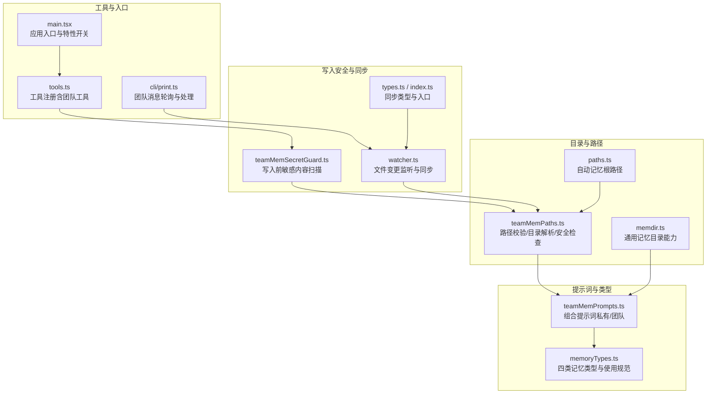
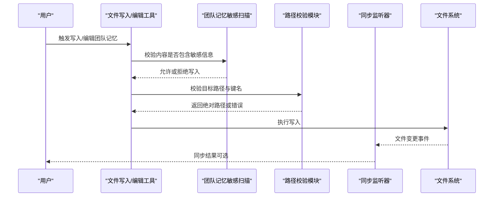
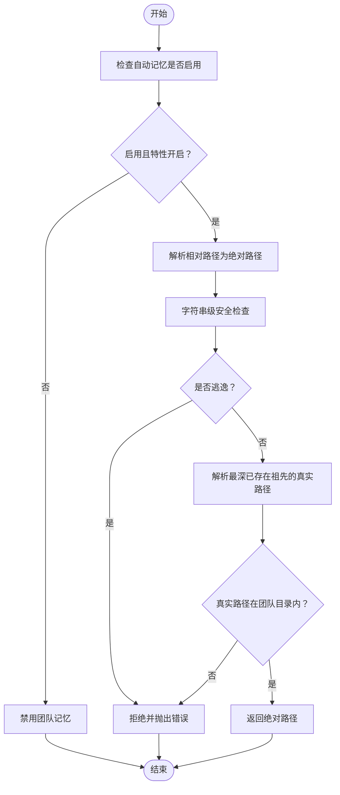
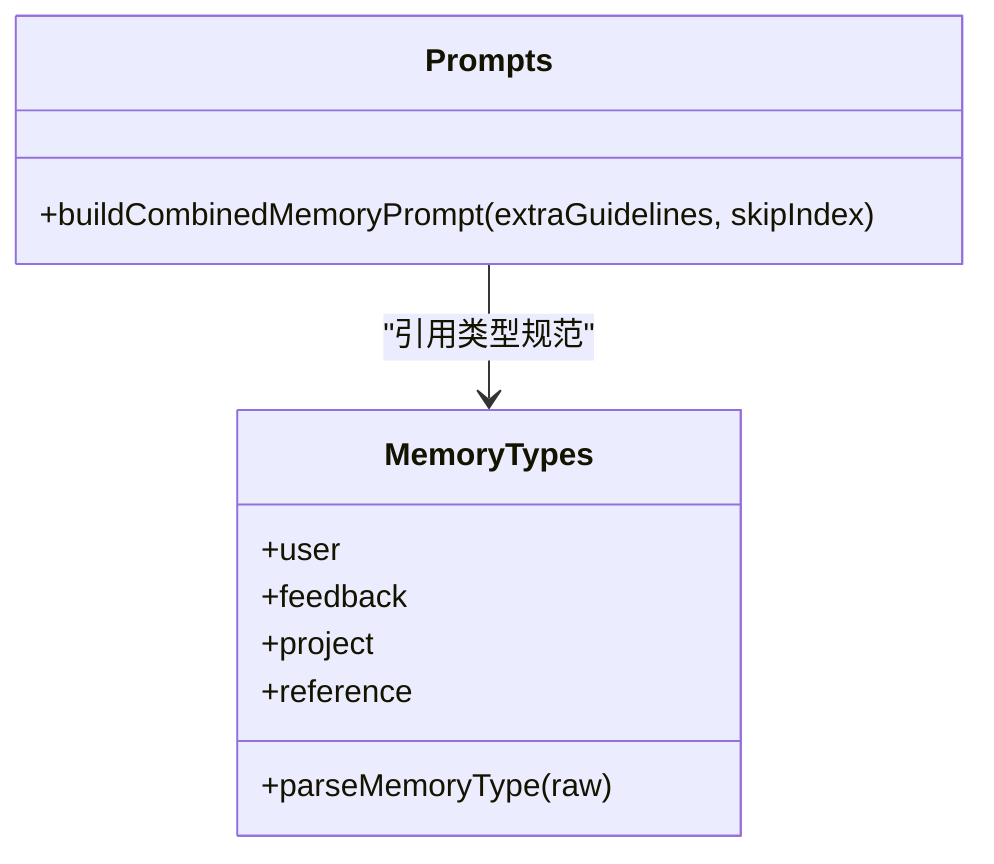
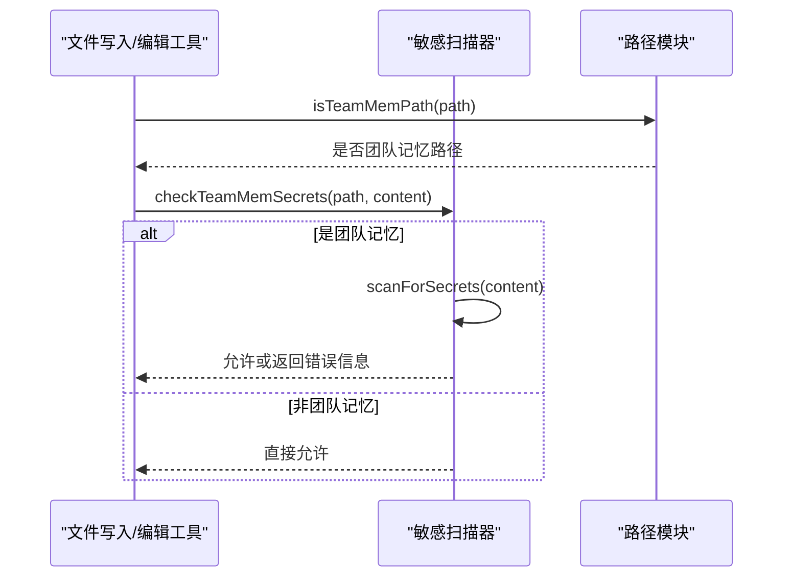
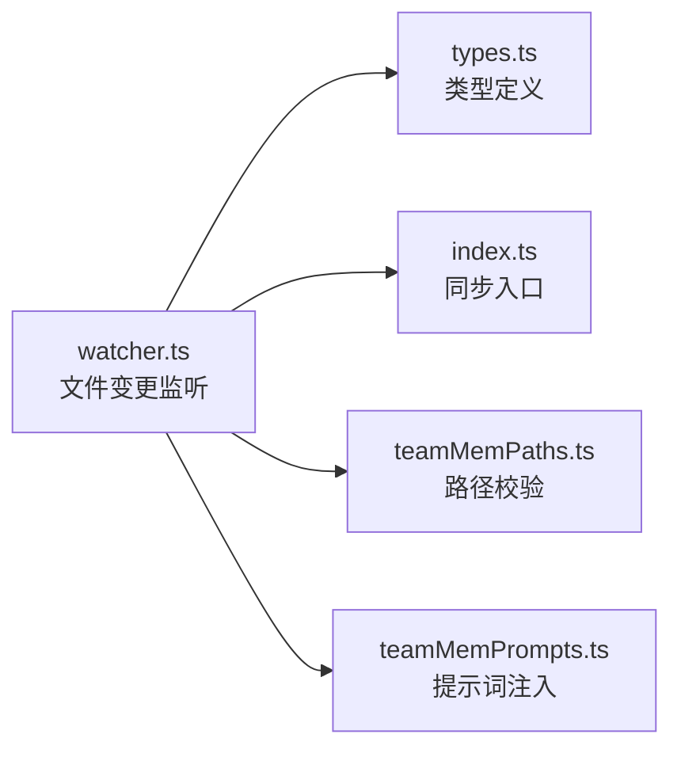
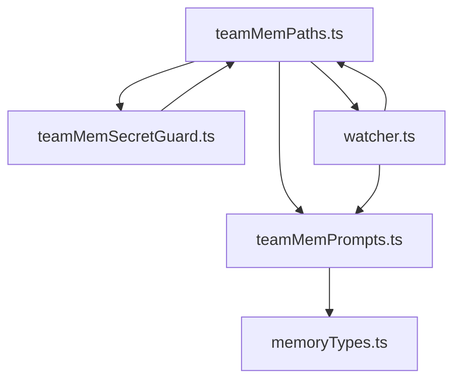

# 团队记忆系统

<cite>
**本文引用的文件**
- [src/memdir/teamMemPaths.ts](file://src/memdir/teamMemPaths.ts)
- [src/memdir/teamMemPrompts.ts](file://src/memdir/teamMemPrompts.ts)
- [src/memdir/memoryTypes.ts](file://src/memdir/memoryTypes.ts)
- [src/utils/teamMemoryOps.ts](file://src/utils/teamMemoryOps.ts)
- [src/services/teamMemorySync/teamMemSecretGuard.ts](file://src/services/teamMemorySync/teamMemSecretGuard.ts)
- [src/services/teamMemorySync/watcher.ts](file://src/services/teamMemorySync/watcher.ts)
- [src/services/teamMemorySync/types.ts](file://src/services/teamMemorySync/types.ts)
- [src/services/teamMemorySync/index.ts](file://src/services/teamMemorySync/index.ts)
- [src/memdir/memdir.ts](file://src/memdir/memdir.ts)
- [src/memdir/paths.ts](file://src/memdir/paths.ts)
- [src/tools.ts](file://src/tools.ts)
- [src/main.tsx](file://src/main.tsx)
- [src/cli/print.ts](file://src/cli/print.ts)
</cite>

## 目录
1. [引言](#引言)
2. [项目结构](#项目结构)
3. [核心组件](#核心组件)
4. [架构总览](#架构总览)
5. [详细组件分析](#详细组件分析)
6. [依赖关系分析](#依赖关系分析)
7. [性能考量](#性能考量)
8. [故障排查指南](#故障排查指南)
9. [结论](#结论)
10. [附录](#附录)

## 引言
本文件系统性阐述 Claude Code 的“团队记忆”设计与实现，重点覆盖以下方面：
- 设计理念：团队记忆与个人记忆的边界、作用域与协作方式
- 实现架构：目录布局、路径校验、提示词注入、写入安全与同步机制
- 同步机制：团队成员间的记忆共享与协作流程
- 权限与访问控制：角色与权限设置、敏感信息防护
- 冲突解决与一致性：路径校验、写入约束、内容扫描
- 配置与管理：启用条件、目录结构、索引入口、类型规范
- 最佳实践与使用建议：如何正确保存/更新/删除团队记忆

## 项目结构
团队记忆功能由“目录与路径校验”“提示词与类型规范”“写入安全与同步”三部分组成，并与工具链（如文件写入/编辑）和会话状态紧密集成。

图示来源
- [src/memdir/teamMemPaths.ts:1-293](file://src/memdir/teamMemPaths.ts#L1-L293)
- [src/memdir/teamMemPrompts.ts:1-101](file://src/memdir/teamMemPrompts.ts#L1-L101)
- [src/memdir/memoryTypes.ts:1-272](file://src/memdir/memoryTypes.ts#L1-L272)
- [src/services/teamMemorySync/teamMemSecretGuard.ts:1-45](file://src/services/teamMemorySync/teamMemSecretGuard.ts#L1-L45)
- [src/services/teamMemorySync/watcher.ts](file://src/services/teamMemorySync/watcher.ts)
- [src/services/teamMemorySync/types.ts](file://src/services/teamMemorySync/types.ts)
- [src/services/teamMemorySync/index.ts](file://src/services/teamMemorySync/index.ts)
- [src/memdir/memdir.ts](file://src/memdir/memdir.ts)
- [src/memdir/paths.ts](file://src/memdir/paths.ts)
- [src/tools.ts:54-74](file://src/tools.ts#L54-L74)
- [src/main.tsx:68-82](file://src/main.tsx#L68-L82)
- [src/cli/print.ts:356-421](file://src/cli/print.ts#L356-L421)

章节来源
- [src/memdir/teamMemPaths.ts:1-293](file://src/memdir/teamMemPaths.ts#L1-L293)
- [src/memdir/teamMemPrompts.ts:1-101](file://src/memdir/teamMemPrompts.ts#L1-L101)
- [src/memdir/memoryTypes.ts:1-272](file://src/memdir/memoryTypes.ts#L1-L272)
- [src/services/teamMemorySync/teamMemSecretGuard.ts:1-45](file://src/services/teamMemorySync/teamMemSecretGuard.ts#L1-L45)
- [src/services/teamMemorySync/watcher.ts](file://src/services/teamMemorySync/watcher.ts)
- [src/services/teamMemorySync/types.ts](file://src/services/teamMemorySync/types.ts)
- [src/services/teamMemorySync/index.ts](file://src/services/teamMemorySync/index.ts)
- [src/memdir/memdir.ts](file://src/memdir/memdir.ts)
- [src/memdir/paths.ts](file://src/memdir/paths.ts)
- [src/tools.ts:54-74](file://src/tools.ts#L54-L74)
- [src/main.tsx:68-82](file://src/main.tsx#L68-L82)
- [src/cli/print.ts:356-421](file://src/cli/print.ts#L356-L421)

## 核心组件
- 目录与路径校验：负责团队记忆目录定位、相对键校验、写入路径校验、符号链接逃逸检测与前缀攻击防护
- 提示词与类型：定义“私有/团队”双目录的使用边界、四种记忆类型（user/feedback/project/reference）及使用场景
- 写入安全：在写入前扫描潜在敏感信息，阻止将共享内容写入团队记忆
- 同步与监听：监听团队记忆目录变更，实现跨成员的增量同步
- 工具与入口：通过工具链（文件写入/编辑等）触发团队记忆操作；应用入口根据特性开关启用相关能力

章节来源
- [src/memdir/teamMemPaths.ts:73-94](file://src/memdir/teamMemPaths.ts#L73-L94)
- [src/memdir/teamMemPrompts.ts:22-100](file://src/memdir/teamMemPrompts.ts#L22-L100)
- [src/memdir/memoryTypes.ts:14-106](file://src/memdir/memoryTypes.ts#L14-L106)
- [src/services/teamMemorySync/teamMemSecretGuard.ts:15-44](file://src/services/teamMemorySync/teamMemSecretGuard.ts#L15-L44)
- [src/services/teamMemorySync/watcher.ts](file://src/services/teamMemorySync/watcher.ts)
- [src/tools.ts:54-74](file://src/tools.ts#L54-L74)
- [src/main.tsx:68-82](file://src/main.tsx#L68-L82)

## 架构总览
团队记忆以“目录隔离 + 路径校验 + 提示词注入 + 写入扫描 + 变更监听”的方式实现：
- 目录隔离：团队记忆位于自动记忆目录下的子目录，按项目隔离
- 路径校验：字符串级规范化与真实路径解析，双重保障防止逃逸
- 提示词注入：在系统提示中明确团队记忆的存在、范围与使用边界
- 写入扫描：对团队记忆写入进行敏感内容扫描，避免泄露
- 变更监听：监听团队记忆目录变化，驱动同步与协作

图示来源
- [src/services/teamMemorySync/teamMemSecretGuard.ts:15-44](file://src/services/teamMemorySync/teamMemSecretGuard.ts#L15-L44)
- [src/memdir/teamMemPaths.ts:228-284](file://src/memdir/teamMemPaths.ts#L228-L284)
- [src/services/teamMemorySync/watcher.ts](file://src/services/teamMemorySync/watcher.ts)

## 详细组件分析

### 目录与路径校验（teamMemPaths.ts）
- 功能要点
  - 判断团队记忆是否启用（依赖自动记忆开启与特性开关）
  - 计算团队记忆根路径与入口文件路径
  - 字符串级路径校验：拒绝空字节、URL 编码遍历、反斜杠、绝对路径等
  - 符号链接深度解析与逃逸检测：解析最深已存在祖先，确保真实路径仍在团队目录内
  - 前缀攻击防护：匹配前缀后要求分隔符，避免“team-evil”误匹配
  - 对相对键进行安全拼接与校验
- 安全性
  - 多层防御：字符串规范化 + 真实路径解析 + 前缀匹配 + 分隔符校验
  - 对异常情况采取保守策略（失败即拒绝）

图示来源
- [src/memdir/teamMemPaths.ts:73-94](file://src/memdir/teamMemPaths.ts#L73-L94)
- [src/memdir/teamMemPaths.ts:214-284](file://src/memdir/teamMemPaths.ts#L214-L284)

章节来源
- [src/memdir/teamMemPaths.ts:1-293](file://src/memdir/teamMemPaths.ts#L1-L293)

### 提示词与类型（teamMemPrompts.ts 与 memoryTypes.ts）
- 组合提示词
  - 明确私有与团队两套目录的存在与职责
  - 指导如何保存/更新/删除记忆，以及索引入口的作用
  - 强调“漂移警告”与“信任回忆”的使用原则
- 四种记忆类型
  - user：私有，描述用户角色、偏好、知识背景
  - feedback：默认私有，仅在明确为项目级约定时才团队共享
  - project：私有或团队，偏向团队，记录项目状态、动机与约束
  - reference：通常团队，存储外部系统入口与上下文线索
- 不应保存的内容：可从当前项目状态推导的信息、Git 历史、调试方案、临时任务细节等

图示来源
- [src/memdir/memoryTypes.ts:14-106](file://src/memdir/memoryTypes.ts#L14-L106)
- [src/memdir/teamMemPrompts.ts:22-100](file://src/memdir/teamMemPrompts.ts#L22-L100)

章节来源
- [src/memdir/teamMemPrompts.ts:1-101](file://src/memdir/teamMemPrompts.ts#L1-L101)
- [src/memdir/memoryTypes.ts:1-272](file://src/memdir/memoryTypes.ts#L1-L272)

### 写入安全（teamMemSecretGuard.ts）
- 功能要点
  - 在文件写入/编辑工具输入校验阶段，对团队记忆路径进行敏感内容扫描
  - 若发现潜在敏感信息，阻止写入并给出明确提示
  - 通过特性开关控制是否启用扫描逻辑
- 与路径模块协作：仅对团队记忆路径执行扫描，提升效率

图示来源
- [src/services/teamMemorySync/teamMemSecretGuard.ts:15-44](file://src/services/teamMemorySync/teamMemSecretGuard.ts#L15-L44)
- [src/memdir/teamMemPaths.ts:290-292](file://src/memdir/teamMemPaths.ts#L290-L292)

章节来源
- [src/services/teamMemorySync/teamMemSecretGuard.ts:1-45](file://src/services/teamMemorySync/teamMemSecretGuard.ts#L1-L45)

### 同步与监听（teamMemorySync/watcher.ts 与 types.ts/index.ts）
- 监听器职责
  - 监控团队记忆目录的文件变更，作为团队成员协作的基础
  - 结合会话状态与消息通道，实现增量同步与通知
- 类型与入口
  - types.ts 定义同步相关类型
  - index.ts 作为同步模块入口，协调监听与处理流程

图示来源
- [src/services/teamMemorySync/watcher.ts](file://src/services/teamMemorySync/watcher.ts)
- [src/services/teamMemorySync/types.ts](file://src/services/teamMemorySync/types.ts)
- [src/services/teamMemorySync/index.ts](file://src/services/teamMemorySync/index.ts)
- [src/memdir/teamMemPaths.ts:1-293](file://src/memdir/teamMemPaths.ts#L1-L293)
- [src/memdir/teamMemPrompts.ts:1-101](file://src/memdir/teamMemPrompts.ts#L1-L101)

章节来源
- [src/services/teamMemorySync/watcher.ts](file://src/services/teamMemorySync/watcher.ts)
- [src/services/teamMemorySync/types.ts](file://src/services/teamMemorySync/types.ts)
- [src/services/teamMemorySync/index.ts](file://src/services/teamMemorySync/index.ts)

### 工具与入口集成（tools.ts 与 main.tsx）
- 工具注册
  - 团队工具（如创建/删除团队、发送消息）通过延迟导入避免循环依赖
- 应用入口
  - 特性开关控制团队记忆相关模块的加载与行为

章节来源
- [src/tools.ts:54-74](file://src/tools.ts#L54-L74)
- [src/main.tsx:68-82](file://src/main.tsx#L68-L82)

### 团队消息与协作（cli/print.ts）
- 团队消息轮询：团队负责人轮询未读消息，标记已读并格式化输出
- 协作流程：在非交互模式下，需先请求团队成员优雅关停，再清理并返回最终响应

章节来源
- [src/cli/print.ts:356-421](file://src/cli/print.ts#L356-L421)
- [src/cli/print.ts:2512-2603](file://src/cli/print.ts#L2512-L2603)

## 依赖关系分析
- 耦合与内聚
  - teamMemPaths.ts 为核心安全模块，被提示词、写入扫描、同步监听广泛依赖
  - teamMemPrompts.ts 与 memoryTypes.ts 提供统一的类型与使用规范，降低耦合
  - teamMemSecretGuard.ts 与 watcher.ts 分别承担“写入安全”和“同步监听”，职责清晰
- 外部依赖
  - 文件系统 API（路径解析、符号链接处理）
  - 特性开关（决定功能启用与否）

图示来源
- [src/memdir/teamMemPaths.ts:1-293](file://src/memdir/teamMemPaths.ts#L1-L293)
- [src/memdir/teamMemPrompts.ts:1-101](file://src/memdir/teamMemPrompts.ts#L1-L101)
- [src/memdir/memoryTypes.ts:1-272](file://src/memdir/memoryTypes.ts#L1-L272)
- [src/services/teamMemorySync/teamMemSecretGuard.ts:1-45](file://src/services/teamMemorySync/teamMemSecretGuard.ts#L1-L45)
- [src/services/teamMemorySync/watcher.ts](file://src/services/teamMemorySync/watcher.ts)

## 性能考量
- 路径校验成本低：字符串级规范化与前缀匹配为 O(n)；真实路径解析仅在必要时进行
- 监听器按需触发：仅在文件变更时触发处理，避免轮询开销
- 特性开关：通过编译期/运行时特性开关裁剪不必要模块，减少内存与 CPU 占用

## 故障排查指南
- 路径逃逸错误
  - 现象：写入被拒绝并提示路径逃逸
  - 排查：确认路径不包含“..”“/”“\0”等非法字符；避免使用绝对路径
  - 参考：字符串级校验与真实路径解析
- 符号链接逃逸
  - 现象：写入被拒绝并提示通过符号链接逃逸
  - 排查：检查团队目录是否存在恶意符号链接；确保团队目录存在且无环
- 敏感信息阻断
  - 现象：写入被拒绝并提示包含敏感信息
  - 排查：移除密钥、令牌等敏感内容后再尝试写入
- 同步未生效
  - 现象：团队成员未看到最新变更
  - 排查：确认监听器正常运行；检查文件是否在团队目录内；核对提示词中的索引入口是否正确

章节来源
- [src/memdir/teamMemPaths.ts:109-206](file://src/memdir/teamMemPaths.ts#L109-L206)
- [src/services/teamMemorySync/teamMemSecretGuard.ts:15-44](file://src/services/teamMemorySync/teamMemSecretGuard.ts#L15-L44)
- [src/services/teamMemorySync/watcher.ts](file://src/services/teamMemorySync/watcher.ts)

## 结论
团队记忆系统通过“目录隔离 + 路径校验 + 提示词注入 + 写入扫描 + 变更监听”的组合，实现了安全、可控、可协作的记忆体系。其设计强调：
- 安全优先：严格的路径校验与敏感内容扫描
- 使用清晰：明确的类型与边界，避免滥用
- 协作顺畅：基于目录监听的同步与消息轮询
- 易于扩展：模块化设计便于后续增强

## 附录

### 团队记忆与个人记忆的区别与联系
- 区别
  - 作用域：个人记忆位于自动记忆根目录；团队记忆位于团队子目录
  - 共享性：个人记忆仅当前用户可见；团队记忆对项目协作成员共享
- 联系
  - 共同遵循相同的类型规范与使用边界
  - 在系统提示中同时注入两者的存在与使用指导

章节来源
- [src/memdir/teamMemPrompts.ts:60-96](file://src/memdir/teamMemPrompts.ts#L60-L96)

### 同步机制与协作流程
- 同步机制
  - 监听团队记忆目录变更，触发增量同步
  - 结合会话状态与消息通道，实现跨成员协作
- 协作流程
  - 非交互模式下，需先请求团队成员关停，再清理并返回最终响应

章节来源
- [src/services/teamMemorySync/watcher.ts](file://src/services/teamMemorySync/watcher.ts)
- [src/cli/print.ts:379-391](file://src/cli/print.ts#L379-L391)
- [src/cli/print.ts:2512-2603](file://src/cli/print.ts#L2512-L2603)

### 权限管理与访问控制
- 角色与权限
  - 团队成员通过协作通道进行消息传递与任务分配
  - 写入权限受路径校验与敏感扫描双重保护
- 访问控制
  - 仅团队记忆路径可触发扫描与同步
  - 特性开关控制功能启用

章节来源
- [src/services/teamMemorySync/teamMemSecretGuard.ts:15-44](file://src/services/teamMemorySync/teamMemSecretGuard.ts#L15-L44)
- [src/memdir/teamMemPaths.ts:290-292](file://src/memdir/teamMemPaths.ts#L290-L292)
- [src/main.tsx:68-82](file://src/main.tsx#L68-L82)

### 冲突解决与一致性保证
- 冲突解决
  - 通过“漂移警告”与“信任回忆”指导用户在使用记忆前验证当前状态
  - 更新或删除过时记忆，保持一致性
- 一致性保证
  - 路径校验与符号链接逃逸检测确保写入位置一致
  - 监听器保证变更及时传播

章节来源
- [src/memdir/memoryTypes.ts:197-202](file://src/memdir/memoryTypes.ts#L197-L202)
- [src/memdir/memoryTypes.ts:240-256](file://src/memdir/memoryTypes.ts#L240-L256)
- [src/memdir/teamMemPaths.ts:109-206](file://src/memdir/teamMemPaths.ts#L109-L206)

### 配置与管理指南
- 启用条件
  - 自动记忆开启且特性开关启用
- 目录结构
  - 团队记忆根目录：自动记忆根目录下的 team 子目录
  - 入口文件：团队记忆根目录下的 MEMORY.md
- 索引入口
  - 每个目录（私有/团队）维护一个索引文件，用于快速检索
- 类型规范
  - 使用四种类型之一，遵循 frontmatter 格式与使用场景

章节来源
- [src/memdir/teamMemPaths.ts:73-94](file://src/memdir/teamMemPaths.ts#L73-L94)
- [src/memdir/teamMemPrompts.ts:22-58](file://src/memdir/teamMemPrompts.ts#L22-L58)
- [src/memdir/memoryTypes.ts:261-271](file://src/memdir/memoryTypes.ts#L261-L271)

### 最佳实践与使用建议
- 保存建议
  - 优先保存不可从当前项目状态推导的信息
  - 更新或删除过时内容，避免重复与冗余
- 类型选择
  - 用户偏好与沟通风格：user（私有）
  - 项目级约定：feedback/project/reference（团队）
- 安全建议
  - 永远不要在团队记忆中保存敏感数据
  - 写入前进行敏感内容自检
- 使用建议
  - 在使用记忆前，先验证当前状态
  - 将近期状态优先参考当前代码与日志

章节来源
- [src/memdir/teamMemPrompts.ts:76-96](file://src/memdir/teamMemPrompts.ts#L76-L96)
- [src/memdir/memoryTypes.ts:183-195](file://src/memdir/memoryTypes.ts#L183-L195)
- [src/services/teamMemorySync/teamMemSecretGuard.ts:37-41](file://src/services/teamMemorySync/teamMemSecretGuard.ts#L37-L41)