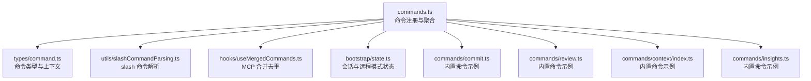
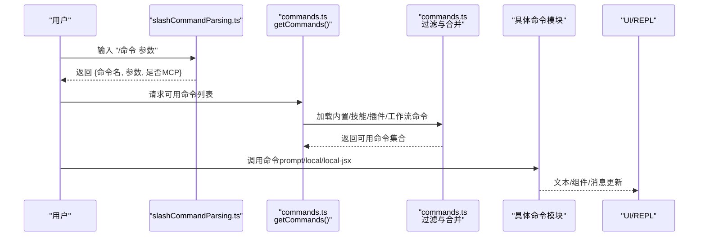
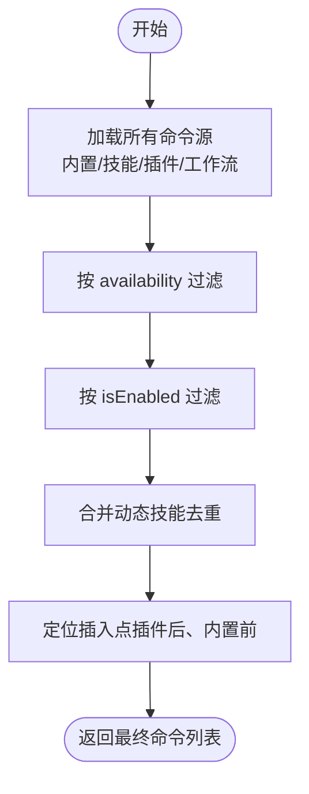
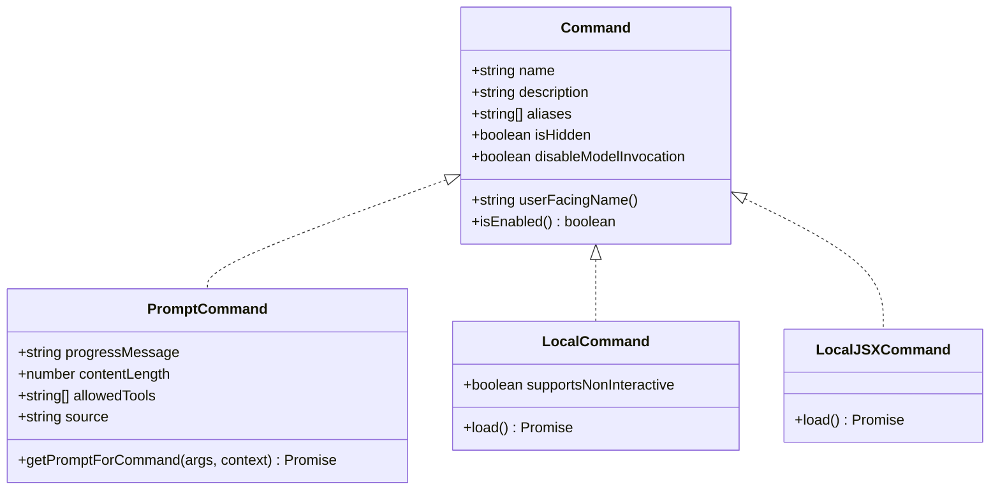
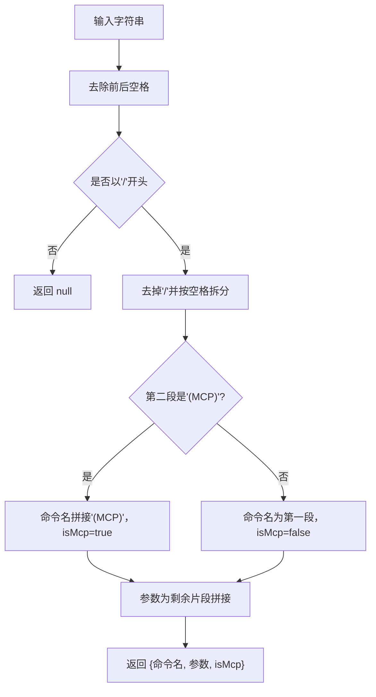
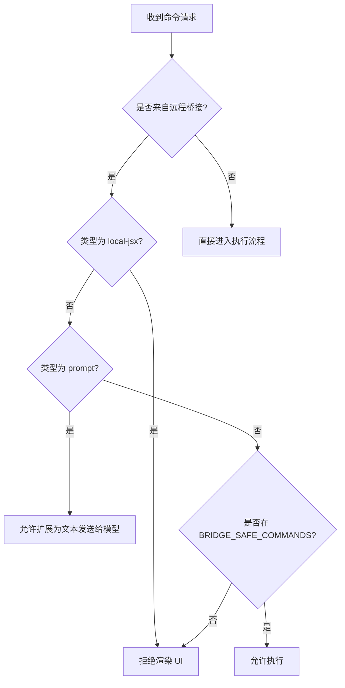
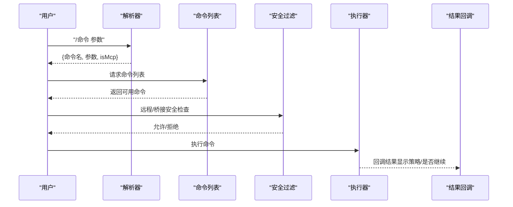
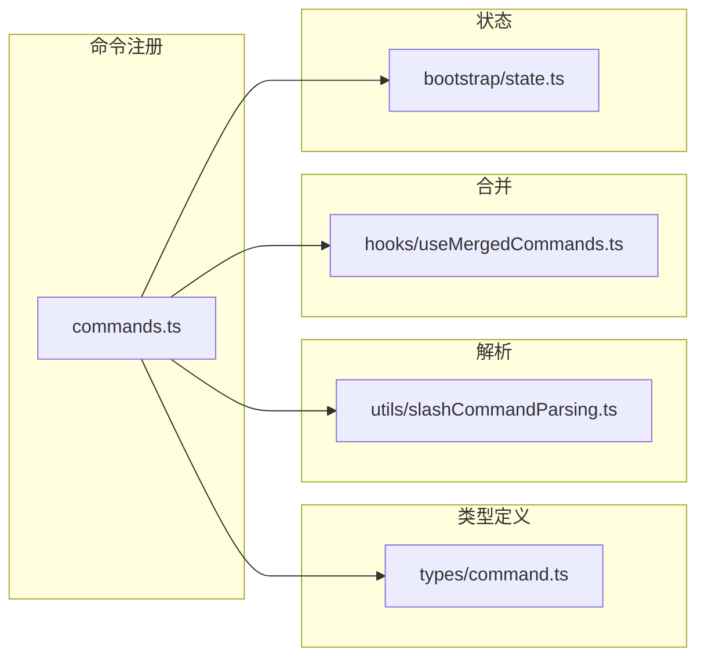

# 命令系统

<cite>
**本文引用的文件**
- [commands.ts](file://src/commands.ts)
- [command.ts](file://src/types/command.ts)
- [slashCommandParsing.ts](file://src/utils/slashCommandParsing.ts)
- [useMergedCommands.ts](file://src/hooks/useMergedCommands.ts)
- [state.ts](file://src/bootstrap/state.ts)
- [commit.ts](file://src/commands/commit.ts)
- [resume/index.ts](file://src/commands/resume/index.ts)
- [session/index.ts](file://src/commands/session/index.ts)
- [files/index.ts](file://src/commands/files/index.ts)
- [diff/index.ts](file://src/commands/diff/index.ts)
- [review.ts](file://src/commands/review.ts)
- [context/index.ts](file://src/commands/context/index.ts)
- [insights.ts](file://src/commands/insights.ts)
- [config/index.ts](file://src/commands/config/index.ts)
</cite>

## 目录
1. [简介](#简介)
2. [项目结构](#项目结构)
3. [核心组件](#核心组件)
4. [架构总览](#架构总览)
5. [详细组件分析](#详细组件分析)
6. [依赖关系分析](#依赖关系分析)
7. [性能考量](#性能考量)
8. [故障排查指南](#故障排查指南)
9. [结论](#结论)
10. [附录](#附录)

## 简介
本文件系统性阐述 Claude Code 的命令系统，覆盖命令注册机制、命令执行流程与条件导入体系；对 slash 命令进行分类与功能说明（会话管理、文件操作、代码分析、设置管理等）；提供命令开发指南（自定义命令创建、参数处理、测试方法）；给出命令生命周期与错误处理机制；并提供实际使用示例与最佳实践。

## 项目结构
命令系统由“命令注册与聚合”“命令类型与上下文”“slash 命令解析”“命令生命周期钩子”四大部分组成：
- 命令注册与聚合：集中导出与过滤可用命令，支持动态技能与插件注入，并按可用性与启用状态筛选。
- 命令类型与上下文：统一定义命令类型（prompt、local、local-jsx），以及本地命令上下文与结果展示策略。
- slash 命令解析：将用户输入解析为命令名、参数与 MCP 标记。
- 命令生命周期钩子：在 REPL/远程模式下对命令进行安全过滤与延迟加载。

**图表来源**
- [commands.ts:258-517](file://src/commands.ts#L258-L517)
- [command.ts:16-217](file://src/types/command.ts#L16-L217)
- [slashCommandParsing.ts:25-60](file://src/utils/slashCommandParsing.ts#L25-L60)
- [useMergedCommands.ts:5-15](file://src/hooks/useMergedCommands.ts#L5-L15)
- [state.ts:390-423](file://src/bootstrap/state.ts#L390-L423)
- [commit.ts:57-92](file://src/commands/commit.ts#L57-L92)
- [review.ts:33-58](file://src/commands/review.ts#L33-L58)
- [context/index.ts:4-24](file://src/commands/context/index.ts#L4-L24)
- [insights.ts:1-800](file://src/commands/insights.ts#L1-L800)

**章节来源**
- [commands.ts:258-517](file://src/commands.ts#L258-L517)
- [command.ts:16-217](file://src/types/command.ts#L16-L217)
- [slashCommandParsing.ts:25-60](file://src/utils/slashCommandParsing.ts#L25-L60)
- [useMergedCommands.ts:5-15](file://src/hooks/useMergedCommands.ts#L5-L15)
- [state.ts:390-423](file://src/bootstrap/state.ts#L390-L423)

## 核心组件
- 命令注册与聚合
  - 统一从各目录导出命令，支持特性开关与环境变量控制的条件导入。
  - 使用记忆化缓存加速命令加载与技能发现。
  - 按可用性（订阅/控制台）与启用状态过滤命令。
  - 动态技能与插件技能合并，避免重复并保持顺序稳定。
- 命令类型与上下文
  - prompt：面向模型的提示型命令，可指定工具白名单、上下文路径、effort 等。
  - local：纯文本输出命令，支持非交互式调用。
  - local-jsx：渲染 UI 的命令，采用延迟加载以减少首屏开销。
  - 上下文包含消息更新、主题、IDE 安装状态、动态 MCP 配置等。
- slash 命令解析
  - 解析“/命令名 参数”或“/命令名 (MCP) 参数”，返回命令名、参数与是否来自 MCP 的标记。
- 命令生命周期钩子
  - 远程模式预过滤：仅允许本地无副作用的安全命令先行显示。
  - 桥接安全：区分 prompt 命令（扩展为文本）与 local 命令（需显式白名单）两类。

**章节来源**
- [commands.ts:476-517](file://src/commands.ts#L476-L517)
- [commands.ts:619-686](file://src/commands.ts#L619-L686)
- [commands.ts:672-676](file://src/commands.ts#L672-L676)
- [command.ts:16-217](file://src/types/command.ts#L16-L217)
- [slashCommandParsing.ts:25-60](file://src/utils/slashCommandParsing.ts#L25-L60)

## 架构总览
命令系统通过“集中注册—条件导入—动态聚合—可用性与启用过滤—远程/桥接安全—延迟加载”的链路，形成高扩展、低耦合、可演进的命令生态。

**图表来源**
- [slashCommandParsing.ts:25-60](file://src/utils/slashCommandParsing.ts#L25-L60)
- [commands.ts:476-517](file://src/commands.ts#L476-L517)
- [commands.ts:619-686](file://src/commands.ts#L619-L686)

## 详细组件分析

### 命令注册与条件导入
- 条件导入
  - 通过特性开关（feature）与环境变量（如 USER_TYPE、IS_DEMO）决定是否加载特定命令（如内部命令、助手、语音、工作流等）。
  - 对重型模块（如 insights）采用懒加载占位器，仅在真正调用时才动态导入。
- 命令聚合
  - 内置命令、技能目录命令、插件技能、工作流命令、捆绑技能与内置插件技能合并。
  - 动态技能去重并插入到合适位置，保证用户感知的一致性。
- 可用性与启用
  - availability 限定订阅/控制台等环境；isEnabled 支持运行时启用/禁用。
  - meetAvailabilityRequirement 在每次获取命令列表时重新评估。

**图表来源**
- [commands.ts:449-469](file://src/commands.ts#L449-L469)
- [commands.ts:476-517](file://src/commands.ts#L476-L517)
- [commands.ts:417-443](file://src/commands.ts#L417-L443)

**章节来源**
- [commands.ts:476-517](file://src/commands.ts#L476-L517)
- [commands.ts:417-443](file://src/commands.ts#L417-L443)

### 命令类型与上下文
- 类型定义
  - prompt：面向模型的提示型命令，支持工具白名单、路径过滤、effort、hooks 等。
  - local：纯文本输出，支持非交互式调用。
  - local-jsx：延迟加载 UI 组件，适合重型界面。
- 上下文与结果
  - LocalJSXCommandContext 提供消息更新、主题、IDE 状态、动态 MCP 配置等。
  - LocalCommandResult 支持文本、紧凑压缩结果、跳过等。

**图表来源**
- [command.ts:16-217](file://src/types/command.ts#L16-L217)

**章节来源**
- [command.ts:16-217](file://src/types/command.ts#L16-L217)

### slash 命令解析
- 功能
  - 将原始输入解析为命令名、参数与 MCP 标记。
  - 支持“/命令 (MCP) 参数”格式，便于区分 MCP 命令。
- 典型用法
  - 在 REPL 中接收用户输入后，先解析再路由到具体命令实现。

**图表来源**
- [slashCommandParsing.ts:25-60](file://src/utils/slashCommandParsing.ts#L25-L60)

**章节来源**
- [slashCommandParsing.ts:25-60](file://src/utils/slashCommandParsing.ts#L25-L60)

### 命令生命周期与安全过滤
- 远程模式安全
  - REMOTE_SAFE_COMMANDS：仅允许本地状态变更类命令（如清屏、帮助、主题切换等）。
  - filterCommandsForRemoteMode 在渲染 REPL 前预过滤，避免竞态。
- 桥接安全
  - BRIDGE_SAFE_COMMANDS：允许通过移动端/网页桥接执行的本地命令白名单。
  - isBridgeSafeCommand：prompt 命令默认安全；local 命令需显式允许；local-jsx 命令禁止。
- 延迟加载
  - local-jsx 命令通过 load() 延迟导入，降低首屏成本。

**图表来源**
- [commands.ts:619-686](file://src/commands.ts#L619-L686)
- [commands.ts:672-676](file://src/commands.ts#L672-L676)

**章节来源**
- [commands.ts:619-686](file://src/commands.ts#L619-L686)
- [commands.ts:672-676](file://src/commands.ts#L672-L676)

### slash 命令分类与功能

#### 会话管理命令
- /commit：基于当前 Git 状态生成提交信息并执行提交，遵循安全协议。
- /resume：恢复之前的对话，支持别名 continue。
- /session：在远程模式下显示远程会话 URL 与二维码。

**章节来源**
- [commit.ts:57-92](file://src/commands/commit.ts#L57-L92)
- [resume/index.ts:3-12](file://src/commands/resume/index.ts#L3-L12)
- [session/index.ts:4-16](file://src/commands/session/index.ts#L4-L16)

#### 文件操作命令
- /files：列出当前上下文中跟踪的所有文件（ant 用户可见）。
- /diff：查看未提交变更与按轮次的差异视图。

**章节来源**
- [files/index.ts:3-12](file://src/commands/files/index.ts#L3-L12)
- [diff/index.ts:3-8](file://src/commands/diff/index.ts#L3-L8)

#### 代码分析命令
- /review：审查拉取请求，支持本地工具链与 GitHub CLI。
- /context 与 /context（非交互）：可视化当前上下文占用或显示上下文使用情况。
- /insights：生成使用报告，聚合会话元数据、工具使用、语言分布、错误统计等。

**章节来源**
- [review.ts:33-58](file://src/commands/review.ts#L33-L58)
- [context/index.ts:4-24](file://src/commands/context/index.ts#L4-L24)
- [insights.ts:1-800](file://src/commands/insights.ts#L1-L800)

#### 设置管理命令
- /config：打开配置面板（别名 settings）。
- /theme：切换终端主题。
- /settings：同 /config。

**章节来源**
- [config/index.ts:3-11](file://src/commands/config/index.ts#L3-L11)

### 命令开发指南

#### 自定义命令创建
- 选择命令类型
  - prompt：需要模型参与的提示型命令，需实现 getPromptForCommand(args, context)。
  - local：纯文本输出，支持非交互式调用，适合批处理任务。
  - local-jsx：渲染 UI 组件，采用延迟加载（load 返回 call 函数）。
- 关键字段
  - name、description、aliases、isHidden、disableModelInvocation、userFacingName。
  - availability 限制可用环境；isEnabled 控制运行时启用。
  - 对于 prompt 命令，可配置 allowedTools、paths、effort、hooks 等。
- 注册方式
  - 将命令对象导出并在 commands.ts 的 COMMANDS 数组中加入。
  - 若为条件特性命令，使用 feature 检查与 require 动态导入。

**章节来源**
- [command.ts:16-217](file://src/types/command.ts#L16-L217)
- [commands.ts:258-346](file://src/commands.ts#L258-L346)

#### 命令参数处理
- slash 命令解析
  - 使用 parseSlashCommand 将输入拆分为命令名、参数与 MCP 标记。
- 参数传递
  - prompt 命令通过 getPromptForCommand(args, context) 获取参数。
  - local/local-jsx 命令通过 load() 返回的 call(args, context) 获取参数。
- 安全与敏感参数
  - 可设置 isSensitive 以在历史中脱敏参数。

**章节来源**
- [slashCommandParsing.ts:25-60](file://src/utils/slashCommandParsing.ts#L25-L60)
- [command.ts:16-217](file://src/types/command.ts#L16-L217)

#### 命令测试方法
- 单元测试
  - 对 parseSlashCommand 进行输入/输出断言。
  - 对命令过滤逻辑（availability/isEnabled）进行边界测试。
- 集成测试
  - 使用 getCommands 获取命令列表，验证动态技能与插件合并正确性。
  - 验证远程/桥接安全过滤逻辑。
- 性能测试
  - 测试命令列表缓存命中率与懒加载触发时机。

**章节来源**
- [commands.ts:476-517](file://src/commands.ts#L476-L517)
- [slashCommandParsing.ts:25-60](file://src/utils/slashCommandParsing.ts#L25-L60)

### 命令执行的完整生命周期
- 解析阶段：parseSlashCommand 将输入解析为命令名与参数。
- 列表阶段：getCommands 聚合内置/技能/插件/工作流命令，应用可用性与启用过滤。
- 安全阶段：filterCommandsForRemoteMode 与 isBridgeSafeCommand 决定是否允许执行。
- 执行阶段：根据命令类型调用 getPromptForCommand 或 load().call。
- 结果阶段：LocalJSXCommandOnDone 控制结果展示与后续行为（是否查询模型、插入 meta 消息等）。

**图表来源**
- [slashCommandParsing.ts:25-60](file://src/utils/slashCommandParsing.ts#L25-L60)
- [commands.ts:476-517](file://src/commands.ts#L476-L517)
- [commands.ts:619-686](file://src/commands.ts#L619-L686)
- [command.ts:117-126](file://src/types/command.ts#L117-L126)

**章节来源**
- [slashCommandParsing.ts:25-60](file://src/utils/slashCommandParsing.ts#L25-L60)
- [commands.ts:476-517](file://src/commands.ts#L476-L517)
- [commands.ts:619-686](file://src/commands.ts#L619-L686)
- [command.ts:117-126](file://src/types/command.ts#L117-L126)

### 错误处理机制
- 技能与插件加载失败
  - getSkills 与 loadAllCommands 对异常进行捕获并记录日志，返回空集合或降级结果。
- 技能索引缓存
  - clearCommandMemoizationCaches 清理命令层缓存；clearCommandsCache 还清理插件与技能缓存。
- UI 层容错
  - getSlashCommandToolSkills 失败时返回空数组，避免影响主流程。

**章节来源**
- [commands.ts:358-398](file://src/commands.ts#L358-L398)
- [commands.ts:523-539](file://src/commands.ts#L523-L539)
- [commands.ts:587-608](file://src/commands.ts#L587-L608)

## 依赖关系分析

**图表来源**
- [commands.ts:258-517](file://src/commands.ts#L258-L517)
- [command.ts:16-217](file://src/types/command.ts#L16-L217)
- [slashCommandParsing.ts:25-60](file://src/utils/slashCommandParsing.ts#L25-L60)
- [useMergedCommands.ts:5-15](file://src/hooks/useMergedCommands.ts#L5-L15)
- [state.ts:390-423](file://src/bootstrap/state.ts#L390-L423)

**章节来源**
- [commands.ts:258-517](file://src/commands.ts#L258-L517)
- [command.ts:16-217](file://src/types/command.ts#L16-L217)
- [slashCommandParsing.ts:25-60](file://src/utils/slashCommandParsing.ts#L25-L60)
- [useMergedCommands.ts:5-15](file://src/hooks/useMergedCommands.ts#L5-L15)
- [state.ts:390-423](file://src/bootstrap/state.ts#L390-L423)

## 性能考量
- 记忆化缓存
  - loadAllCommands、getSkillToolCommands、getSlashCommandToolSkills 使用 memoize 缓存昂贵的磁盘 I/O 与动态导入。
- 懒加载
  - insights 与大量命令采用延迟加载，仅在调用时导入，显著降低启动时间。
- 远程/桥接预过滤
  - 在渲染前过滤不可用命令，减少无效渲染与等待。
- 去重与顺序
  - 动态技能去重并插入到插件与内置之间，避免重复与顺序问题。

**章节来源**
- [commands.ts:449-469](file://src/commands.ts#L449-L469)
- [commands.ts:563-581](file://src/commands.ts#L563-L581)
- [commands.ts:587-608](file://src/commands.ts#L587-L608)
- [commands.ts:619-686](file://src/commands.ts#L619-L686)

## 故障排查指南
- 命令未出现
  - 检查 availability 与 isEnabled 是否满足当前环境与设置。
  - 确认命令是否被动态技能去重或未在预期位置插入。
- 命令无法执行
  - 远程/桥接模式下确认命令是否在安全白名单内。
  - 检查命令类型：local-jsx 命令不会在桥接上渲染 UI。
- 加载失败
  - 查看日志中技能/插件加载失败记录，必要时清理缓存并重试。
- 性能问题
  - 观察命令列表缓存命中情况，确保未频繁重建命令集合。

**章节来源**
- [commands.ts:417-443](file://src/commands.ts#L417-L443)
- [commands.ts:476-517](file://src/commands.ts#L476-L517)
- [commands.ts:619-686](file://src/commands.ts#L619-L686)
- [commands.ts:523-539](file://src/commands.ts#L523-L539)

## 结论
该命令系统通过“集中注册—条件导入—动态聚合—可用性与启用过滤—远程/桥接安全—延迟加载”的架构，实现了高扩展、强隔离与良好用户体验。开发者可依据命令类型与上下文规范快速扩展新命令，并利用解析、过滤与缓存机制保障性能与稳定性。

## 附录

### 实际使用示例与最佳实践
- 会话管理
  - 使用 /resume 恢复历史会话；在远程模式下使用 /session 获取访问链接。
- 文件与差异
  - 使用 /files 查看上下文文件；使用 /diff 查看变更与每轮差异。
- 代码分析
  - 使用 /review 审查 PR；使用 /context 可视化上下文占用；使用 /insights 生成使用报告。
- 设置管理
  - 使用 /config 打开设置面板；使用 /theme 切换主题。
- 最佳实践
  - prompt 命令尽量明确 allowedTools 与 paths，提升安全性与可控性。
  - 大型 UI 命令优先采用 local-jsx 并延迟加载。
  - 对外部依赖（如 GitHub CLI）做好降级与错误提示。

**章节来源**
- [resume/index.ts:3-12](file://src/commands/resume/index.ts#L3-L12)
- [session/index.ts:4-16](file://src/commands/session/index.ts#L4-L16)
- [files/index.ts:3-12](file://src/commands/files/index.ts#L3-L12)
- [diff/index.ts:3-8](file://src/commands/diff/index.ts#L3-L8)
- [review.ts:33-58](file://src/commands/review.ts#L33-L58)
- [context/index.ts:4-24](file://src/commands/context/index.ts#L4-L24)
- [insights.ts:1-800](file://src/commands/insights.ts#L1-L800)
- [config/index.ts:3-11](file://src/commands/config/index.ts#L3-L11)