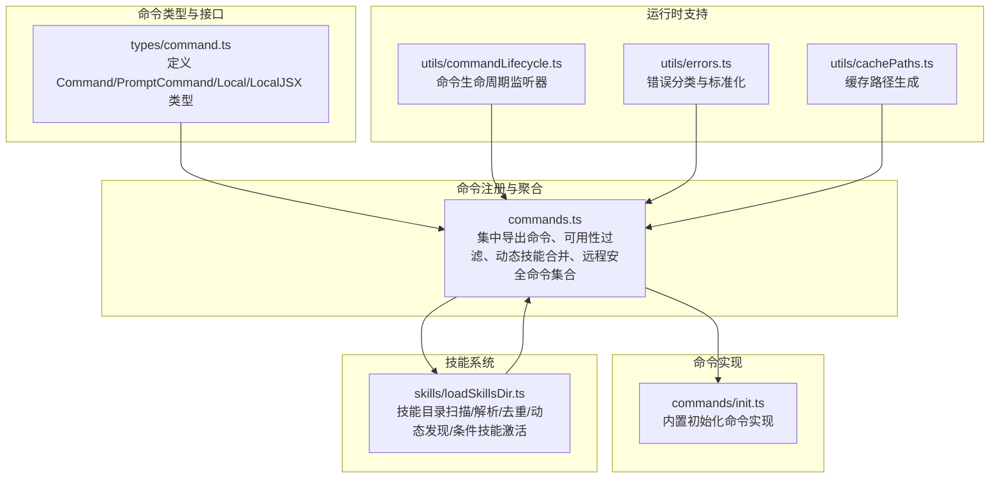
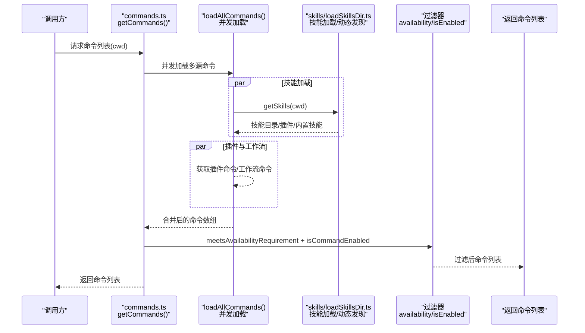
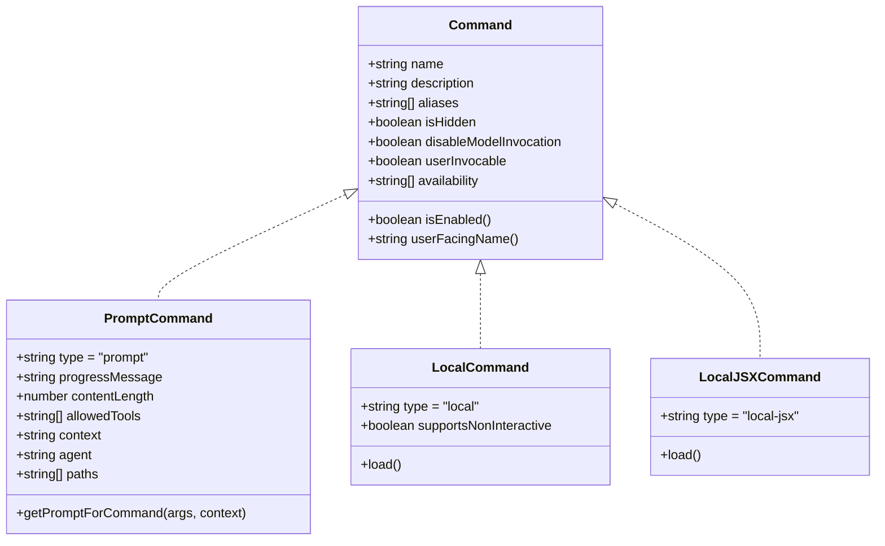
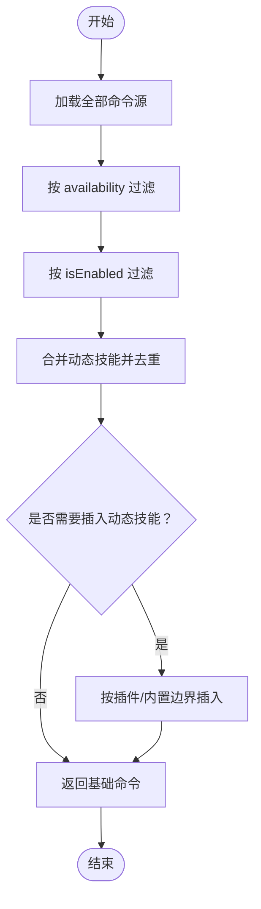
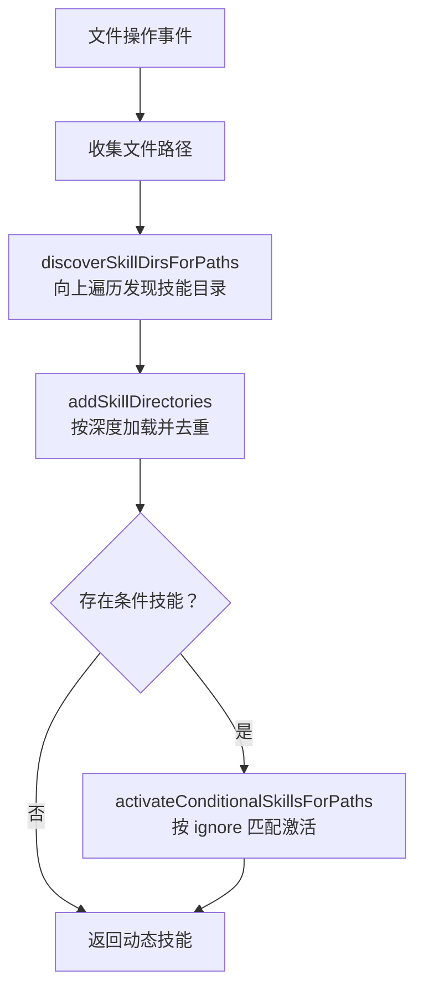
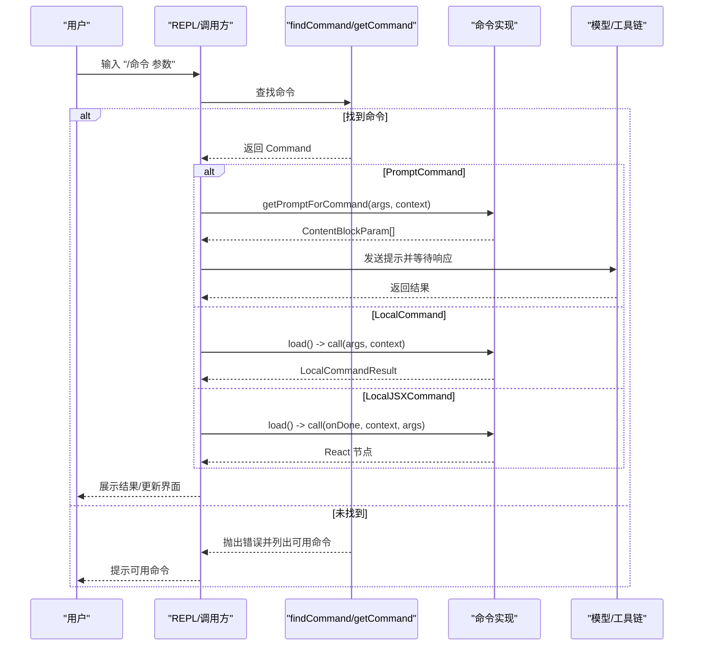
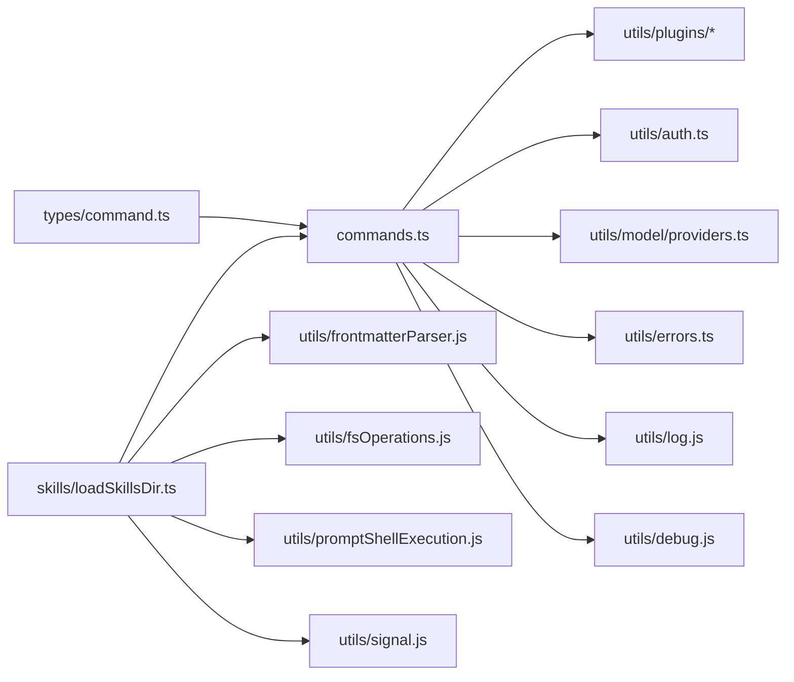

# 命令基础架构

<cite>
**本文档引用的文件**
- [src/commands.ts](file://src/commands.ts)
- [src/types/command.ts](file://src/types/command.ts)
- [src/commands/init.ts](file://src/commands/init.ts)
- [src/utils/commandLifecycle.ts](file://src/utils/commandLifecycle.ts)
- [src/skills/loadSkillsDir.ts](file://src/skills/loadSkillsDir.ts)
- [src/utils/cachePaths.ts](file://src/utils/cachePaths.ts)
- [src/utils/errors.ts](file://src/utils/errors.ts)
</cite>

## 目录
1. [简介](#简介)
2. [项目结构](#项目结构)
3. [核心组件](#核心组件)
4. [架构总览](#架构总览)
5. [详细组件分析](#详细组件分析)
6. [依赖关系分析](#依赖关系分析)
7. [性能考量](#性能考量)
8. [故障排查指南](#故障排查指南)
9. [结论](#结论)
10. [附录](#附录)

## 简介
本文件系统性阐述命令系统基础架构，覆盖命令注册机制、加载流程与条件导入、命令类型体系（prompt、local、local-jsx）、生命周期管理、可用性检查、命令发现与过滤、动态技能集成、执行流程、缓存与性能优化、错误处理模式，并提供可操作的示例路径以指导正确注册与使用命令。

## 项目结构
命令系统围绕统一的命令类型定义与集中式命令注册入口展开，同时通过技能目录、插件、工作流等多源聚合，形成可扩展的命令生态。关键模块如下：
- 命令类型与通用能力：types/command.ts
- 命令注册与聚合：commands.ts
- 初始化命令实现：commands/init.ts
- 技能加载与动态发现：skills/loadSkillsDir.ts
- 命令生命周期监听：utils/commandLifecycle.ts
- 缓存路径与持久化：utils/cachePaths.ts
- 错误分类与标准化：utils/errors.ts

**图表来源**
- [src/types/command.ts:1-217](file://src/types/command.ts#L1-L217)
- [src/commands.ts:1-755](file://src/commands.ts#L1-L755)
- [src/commands/init.ts:1-257](file://src/commands/init.ts#L1-L257)
- [src/skills/loadSkillsDir.ts:1-1087](file://src/skills/loadSkillsDir.ts#L1-L1087)
- [src/utils/commandLifecycle.ts:1-22](file://src/utils/commandLifecycle.ts#L1-L22)
- [src/utils/errors.ts:1-239](file://src/utils/errors.ts#L1-L239)
- [src/utils/cachePaths.ts:1-39](file://src/utils/cachePaths.ts#L1-L39)

**章节来源**
- [src/commands.ts:1-755](file://src/commands.ts#L1-L755)
- [src/types/command.ts:1-217](file://src/types/command.ts#L1-L217)

## 核心组件
- 命令类型系统
  - PromptCommand：面向模型的提示词型命令，支持内容长度估算、工具白名单、上下文执行策略（内联/分叉）、effort、路径过滤等。
  - LocalCommand：本地命令，延迟加载，支持非交互执行。
  - LocalJSXCommand：本地UI命令，延迟加载，渲染 Ink 组件。
- 命令注册与聚合
  - 集中式导出内置命令数组与名称集合，按需条件导入特性分支命令。
  - 聚合技能目录、插件、工作流、内置命令，统一暴露给上层使用。
- 可用性与启用控制
  - availability：基于认证/提供商环境的静态可见性控制。
  - isEnabled：基于功能开关/环境变量的动态启用控制。
- 动态技能与条件技能
  - 技能目录去重、条件技能（paths）延迟激活、文件操作触发的动态发现。
- 远程/桥接安全命令
  - REMOTE_SAFE_COMMANDS 与 BRIDGE_SAFE_COMMANDS 明确允许在远端/移动端执行的命令集。

**章节来源**
- [src/types/command.ts:16-217](file://src/types/command.ts#L16-L217)
- [src/commands.ts:256-676](file://src/commands.ts#L256-L676)

## 架构总览
命令系统采用“类型定义 + 集中式注册 + 多源聚合 + 条件导入 + 动态发现”的架构，确保：
- 类型安全与扩展性：统一的 Command 接口约束不同类型的命令行为。
- 性能优先：大量异步加载与 memoize 缓存，避免重复 IO。
- 可观测性：生命周期监听、错误分类、调试日志。
- 安全边界：远程/桥接安全命令白名单，避免危险命令在受限环境中执行。

**图表来源**
- [src/commands.ts:449-517](file://src/commands.ts#L449-L517)
- [src/skills/loadSkillsDir.ts:638-804](file://src/skills/loadSkillsDir.ts#L638-L804)

**章节来源**
- [src/commands.ts:449-517](file://src/commands.ts#L449-L517)

## 详细组件分析

### 命令类型系统与生命周期
- PromptCommand 关键字段
  - type: 'prompt'
  - progressMessage/contentLength：用于进度反馈与令牌估算
  - allowedTools/agent/context/effort/paths：控制工具使用、代理类型、执行上下文、努力级别与路径过滤
  - getPromptForCommand(args, context)：按需生成最终提示内容
- LocalCommand 与 LocalJSXCommand
  - 支持延迟加载，减少启动时内存占用
  - LocalJSXCommand 专为 UI 渲染设计，不参与远端/桥接执行
- 生命周期监听
  - setCommandLifecycleListener/notifyCommandLifecycle 提供统一的生命周期回调入口

**图表来源**
- [src/types/command.ts:16-217](file://src/types/command.ts#L16-L217)

**章节来源**
- [src/types/command.ts:16-217](file://src/types/command.ts#L16-L217)
- [src/utils/commandLifecycle.ts:1-22](file://src/utils/commandLifecycle.ts#L1-L22)

### 命令注册与条件导入
- 内置命令集中导出，按特性开关条件 require，避免无关模块进入构建产物。
- 内部仅命令与远程安全命令集合独立维护，便于远端/桥接场景预过滤。
- 使用 memoize 对昂贵的命令聚合与技能索引进行缓存，提升后续查询性能。

**章节来源**
- [src/commands.ts:256-346](file://src/commands.ts#L256-L346)
- [src/commands.ts:619-676](file://src/commands.ts#L619-L676)

### 命令可用性检查与过滤
- meetsAvailabilityRequirement：根据 availability 列表判断是否对当前用户可见（如 claude-ai 订阅者、Console 直连用户）。
- isCommandEnabled：默认启用，可通过 isEnabled 回调实现动态启用/禁用。
- getCommands：先聚合所有命令，再应用可用性与启用过滤；随后合并动态技能并插入到合适位置，保证去重与顺序稳定。

**图表来源**
- [src/commands.ts:476-517](file://src/commands.ts#L476-L517)

**章节来源**
- [src/commands.ts:417-443](file://src/commands.ts#L417-L443)
- [src/commands.ts:476-517](file://src/commands.ts#L476-L517)

### 动态技能命令与条件技能
- 技能目录去重：基于 realpath 去除符号链接与重复路径，避免重复加载。
- 条件技能：通过 paths 前言字段声明匹配规则，仅在编辑/读取相关文件时激活。
- 动态发现：根据文件操作路径向上遍历，发现新的 .claude/skills 目录并加载，支持深度优先覆盖策略。
- 激活时机：文件操作触发时，使用 ignore 规则匹配路径，激活符合条件的条件技能并加入动态技能集合。

**图表来源**
- [src/skills/loadSkillsDir.ts:861-915](file://src/skills/loadSkillsDir.ts#L861-L915)
- [src/skills/loadSkillsDir.ts:923-975](file://src/skills/loadSkillsDir.ts#L923-L975)
- [src/skills/loadSkillsDir.ts:997-1058](file://src/skills/loadSkillsDir.ts#L997-L1058)

**章节来源**
- [src/skills/loadSkillsDir.ts:638-804](file://src/skills/loadSkillsDir.ts#L638-L804)
- [src/skills/loadSkillsDir.ts:818-1087](file://src/skills/loadSkillsDir.ts#L818-L1087)

### 命令执行核心流程（从输入解析到结果返回）
- 输入解析：命令名/别名查找，找不到时抛出参考性错误信息。
- 执行路径选择：
  - PromptCommand：调用 getPromptForCommand 生成提示内容，交由模型处理。
  - LocalCommand：延迟加载模块并执行 call(args, context)，返回 LocalCommandResult。
  - LocalJSXCommand：延迟加载模块并渲染 UI，返回 React 节点。
- 结果处理：根据命令类型与 onDone 回调决定消息显示方式、是否继续对话、元消息注入等。

**图表来源**
- [src/commands.ts:688-719](file://src/commands.ts#L688-L719)
- [src/types/command.ts:53-56](file://src/types/command.ts#L53-L56)
- [src/types/command.ts:62-72](file://src/types/command.ts#L62-L72)
- [src/types/command.ts:131-142](file://src/types/command.ts#L131-L142)

**章节来源**
- [src/commands.ts:688-719](file://src/commands.ts#L688-L719)
- [src/types/command.ts:53-56](file://src/types/command.ts#L53-L56)
- [src/types/command.ts:62-72](file://src/types/command.ts#L62-L72)
- [src/types/command.ts:131-142](file://src/types/command.ts#L131-L142)

### 命令缓存机制与性能优化
- memoize 缓存
  - COMMANDS()/builtInCommandNames：内置命令集合与名称集合缓存。
  - loadAllCommands：命令聚合缓存（cwd 为键）。
  - getSkillToolCommands/getSlashCommandToolSkills：技能索引缓存。
- 技能缓存
  - getSkillDirCommands：技能目录加载缓存。
  - 条件技能与动态技能状态：会话内存活，支持增量更新。
- 缓存清理
  - clearCommandMemoizationCaches：清理命令相关缓存。
  - clearCommandsCache：清理命令与技能相关缓存。
- 性能要点
  - 并行加载：技能、插件、工作流并行获取，降低总等待时间。
  - 去重与懒加载：技能去重与命令延迟加载，减少内存与 CPU 开销。
  - 路径缓存：cachePaths 生成稳定的缓存目录，避免升级后孤儿缓存。

**章节来源**
- [src/commands.ts:256-346](file://src/commands.ts#L256-L346)
- [src/commands.ts:523-539](file://src/commands.ts#L523-L539)
- [src/skills/loadSkillsDir.ts:638-804](file://src/skills/loadSkillsDir.ts#L638-L804)
- [src/utils/cachePaths.ts:25-38](file://src/utils/cachePaths.ts#L25-L38)

### 错误处理模式
- 错误分类
  - Abort/Shell/Teleport/配置解析/网络/HTTP 等分类，便于统一处理与上报。
- 标准化
  - toError/errorMessage/shortErrorStack：将任意异常标准化为 Error，提取短栈信息，避免泄露敏感数据。
- 非致命错误
  - 技能加载失败降级为空数组，不影响主流程。
- 生命周期与可观测性
  - 命令生命周期监听，便于外部模块记录执行状态。

**章节来源**
- [src/utils/errors.ts:1-239](file://src/utils/errors.ts#L1-L239)
- [src/utils/commandLifecycle.ts:1-22](file://src/utils/commandLifecycle.ts#L1-L22)
- [src/commands.ts:359-397](file://src/commands.ts#L359-L397)
- [src/commands.ts:600-607](file://src/commands.ts#L600-L607)

### 典型命令示例（注册与使用）
- 注册一个内置 Prompt 命令
  - 参考路径：[src/commands/init.ts:226-254](file://src/commands/init.ts#L226-L254)
  - 特点：type 为 'prompt'，描述动态生成，contentLength 为 0，progressMessage 用于 UI 反馈。
- 注册一个 Local 命令（延迟加载）
  - 参考类型定义：[src/types/command.ts:74-78](file://src/types/command.ts#L74-L78)
  - 实现约定：导出模块包含 call(args, context) 方法，返回 LocalCommandResult。
- 注册一个 LocalJSX 命令（延迟加载 UI）
  - 参考类型定义：[src/types/command.ts:144-152](file://src/types/command.ts#L144-L152)
  - 实现约定：导出模块包含 call(onDone, context, args) 方法，返回 React 节点。

**章节来源**
- [src/commands/init.ts:226-254](file://src/commands/init.ts#L226-L254)
- [src/types/command.ts:74-78](file://src/types/command.ts#L74-L78)
- [src/types/command.ts:144-152](file://src/types/command.ts#L144-L152)

## 依赖关系分析
- 命令类型依赖于工具上下文、主题、IDE 状态等通用类型。
- commands.ts 依赖：
  - types/command.ts：命令类型与工具函数。
  - skills/loadSkillsDir.ts：技能目录加载、动态发现、条件技能。
  - utils/plugins：插件命令与技能缓存清理。
  - utils/auth、utils/model：可用性判断（订阅者/第三方服务）。
- skills/loadSkillsDir.ts 依赖：
  - frontmatter 解析、路径解析、忽略规则、shell 执行、令牌估算等工具。
  - 命令生命周期信号：动态技能加载完成后通知订阅者清理缓存。

**图表来源**
- [src/commands.ts:156-170](file://src/commands.ts#L156-L170)
- [src/skills/loadSkillsDir.ts:1-65](file://src/skills/loadSkillsDir.ts#L1-L65)

**章节来源**
- [src/commands.ts:156-170](file://src/commands.ts#L156-L170)
- [src/skills/loadSkillsDir.ts:1-65](file://src/skills/loadSkillsDir.ts#L1-L65)

## 性能考量
- 异步并行加载：技能、插件、工作流并行获取，显著降低冷启动时间。
- memoize 缓存：命令聚合、技能索引、技能目录加载均使用缓存，避免重复 IO。
- 延迟加载：LocalJSX 命令延迟加载，减少初始包体与内存占用。
- 去重与最小化：技能去重、动态技能按需插入、远程安全命令预过滤，减少无效计算与渲染。
- 缓存路径稳定性：cachePaths 使用 djb2Hash 生成稳定目录名，避免升级导致缓存失效。

[本节为通用性能建议，无需特定文件引用]

## 故障排查指南
- 命令未出现或不可见
  - 检查 availability 与 isEnabled 是否限制了当前环境。
  - 确认命令未被动态技能去重覆盖。
- 技能未生效
  - 检查 paths 前言是否与实际文件匹配。
  - 确认动态发现已扫描到对应目录且未被 gitignore 屏蔽。
- 执行报错
  - 使用 shortErrorStack 提取精简堆栈，避免泄露敏感信息。
  - 分类错误：使用 classifyAxiosError/telemetry-safe 错误包装，便于定位网络/权限/超时等问题。
- 缓存问题
  - 清理命令与技能缓存：clearCommandsCache。
  - 重新加载动态技能：触发文件操作或手动调用动态发现接口。

**章节来源**
- [src/commands.ts:523-539](file://src/commands.ts#L523-L539)
- [src/skills/loadSkillsDir.ts:818-851](file://src/skills/loadSkillsDir.ts#L818-L851)
- [src/utils/errors.ts:161-171](file://src/utils/errors.ts#L161-L171)
- [src/utils/errors.ts:213-238](file://src/utils/errors.ts#L213-L238)

## 结论
该命令系统通过统一的类型定义、集中式注册与多源聚合、条件导入与动态发现，实现了高扩展性与高性能的命令生态。结合可用性检查、远程/桥接安全策略、完善的缓存与错误处理，既满足复杂场景下的灵活性，又保障了生产环境的稳定性与可观测性。

## 附录
- 命令类型速查
  - PromptCommand：面向模型的提示词命令，适合技能与工作流。
  - LocalCommand：本地执行命令，支持非交互。
  - LocalJSXCommand：本地 UI 命令，延迟加载，不适用于远端/桥接。
- 常用工具函数
  - getCommandName/isCommandEnabled：解析显示名与启用状态。
  - findCommand/getCommand：命令查找与校验。
  - formatDescriptionWithSource：带来源标注的描述格式化。

**章节来源**
- [src/types/command.ts:209-217](file://src/types/command.ts#L209-L217)
- [src/commands.ts:688-754](file://src/commands.ts#L688-L754)