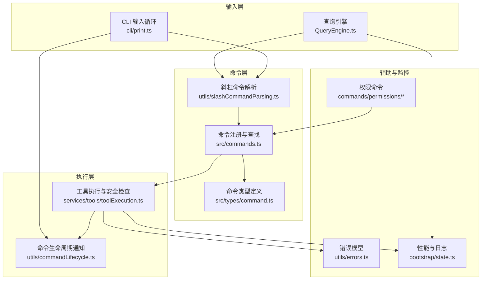
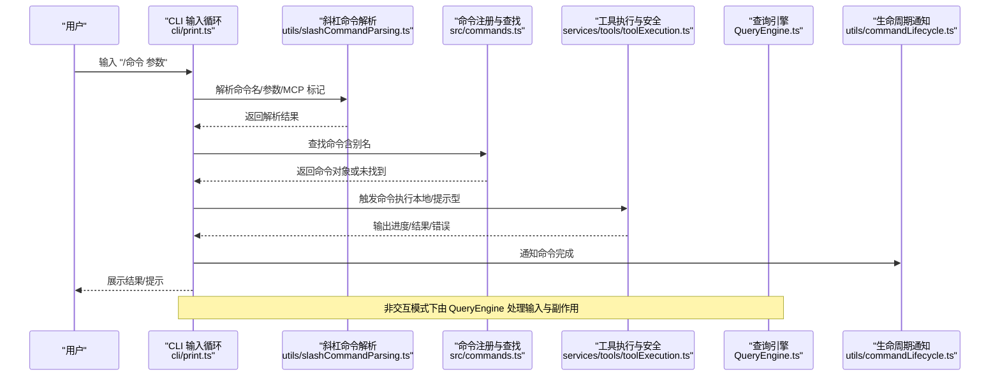
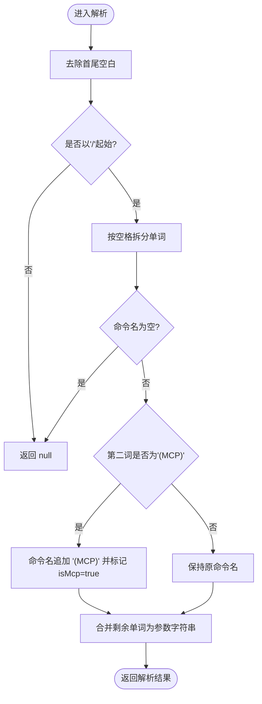
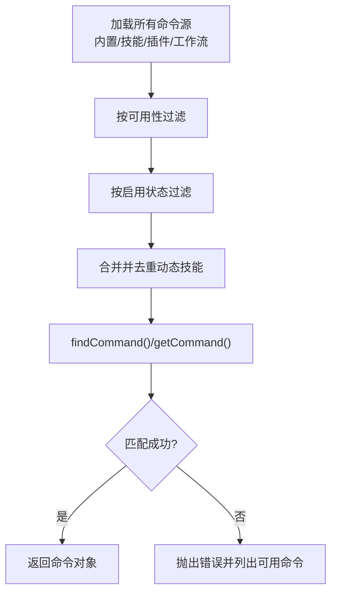
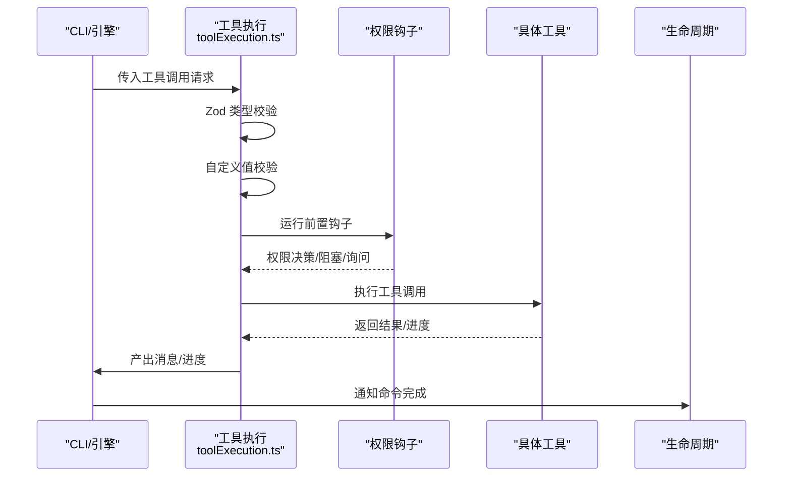
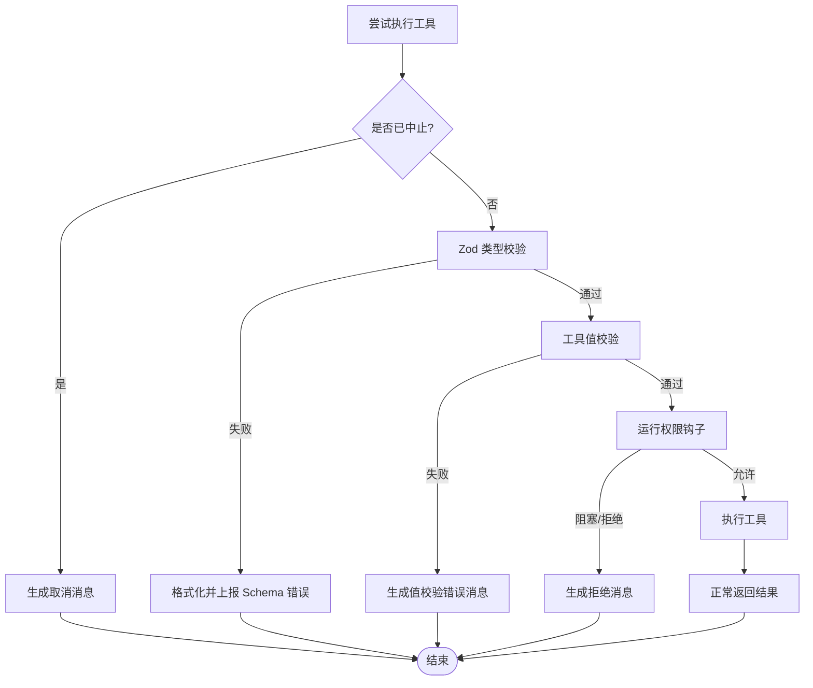
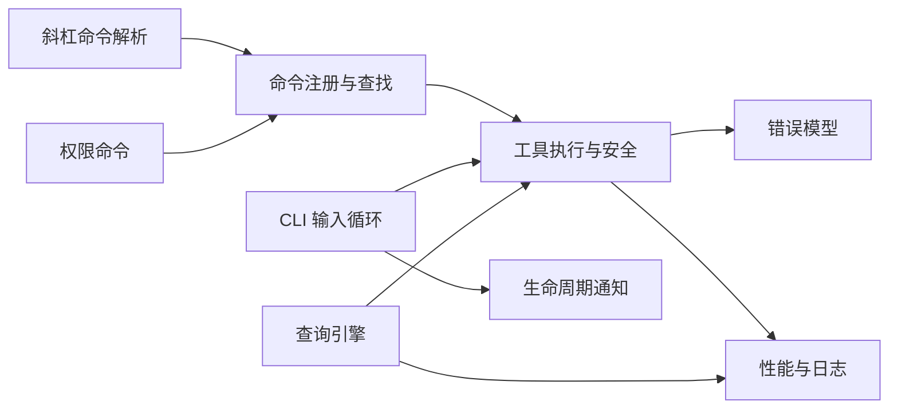

# 命令执行流程

<cite>
**本文引用的文件**
- [src/commands.ts](file://src/commands.ts)
- [src/utils/slashCommandParsing.ts](file://src/utils/slashCommandParsing.ts)
- [src/types/command.ts](file://src/types/command.ts)
- [src/utils/commandLifecycle.ts](file://src/utils/commandLifecycle.ts)
- [src/cli/print.ts](file://src/cli/print.ts)
- [src/services/tools/toolExecution.ts](file://src/services/tools/toolExecution.ts)
- [src/utils/errors.ts](file://src/utils/errors.ts)
- [src/QueryEngine.ts](file://src/QueryEngine.ts)
- [src/commands/permissions/index.ts](file://src/commands/permissions/index.ts)
- [src/commands/permissions/permissions.tsx](file://src/commands/permissions/permissions.tsx)
- [src/bootstrap/state.ts](file://src/bootstrap/state.ts)
</cite>

## 目录
1. [引言](#引言)
2. [项目结构](#项目结构)
3. [核心组件](#核心组件)
4. [架构总览](#架构总览)
5. [详细组件分析](#详细组件分析)
6. [依赖关系分析](#依赖关系分析)
7. [性能考量](#性能考量)
8. [故障排查指南](#故障排查指南)
9. [结论](#结论)
10. [附录](#附录)

## 引言
本文件系统性梳理从用户输入“斜杠命令”（如 /help、/model 等）到最终结果输出的完整执行流程，覆盖命令解析、参数提取与验证、类型转换、命令查找与匹配（含别名与来源）、安全检查（权限、远程模式、资源限制）、错误处理与回滚、性能监控与日志记录等关键环节。文档以循序渐进的方式呈现，既适合技术读者深入理解实现细节，也便于非技术读者把握整体流程。

## 项目结构
围绕命令执行的关键模块分布如下：
- 命令定义与注册：commands.ts 负责内置命令、技能、插件命令的聚合与可用性过滤。
- 命令类型与上下文：types/command.ts 定义命令类型、调用签名、结果展示策略等。
- 斜杠命令解析：utils/slashCommandParsing.ts 将原始输入拆分为命令名、参数与 MCP 标记。
- 命令生命周期：utils/commandLifecycle.ts 提供事件通知钩子，用于追踪命令开始/完成。
- CLI 执行循环：cli/print.ts 维护命令队列、批处理、中断与重放、性能指标记录。
- 工具执行与安全：services/tools/toolExecution.ts 实现工具调用前的权限校验、输入验证、错误分类与遥测。
- 错误模型：utils/errors.ts 提供统一的错误类型与判定逻辑。
- 查询引擎集成：QueryEngine.ts 在交互/非交互模式下处理用户输入与命令副作用。
- 权限命令：commands/permissions/* 提供权限规则管理的命令入口与 UI 实现。
- 性能与日志：bootstrap/state.ts 提供慢操作统计、计数器与日志提供者等基础设施。

**图表来源**
- [src/cli/print.ts](file://src/cli/print.ts)
- [src/QueryEngine.ts](file://src/QueryEngine.ts)
- [src/utils/slashCommandParsing.ts](file://src/utils/slashCommandParsing.ts)
- [src/commands.ts](file://src/commands.ts)
- [src/types/command.ts](file://src/types/command.ts)
- [src/services/tools/toolExecution.ts](file://src/services/tools/toolExecution.ts)
- [src/utils/commandLifecycle.ts](file://src/utils/commandLifecycle.ts)
- [src/utils/errors.ts](file://src/utils/errors.ts)
- [src/bootstrap/state.ts](file://src/bootstrap/state.ts)
- [src/commands/permissions/index.ts](file://src/commands/permissions/index.ts)
- [src/commands/permissions/permissions.tsx](file://src/commands/permissions/permissions.tsx)

**章节来源**
- [src/commands.ts](file://src/commands.ts)
- [src/utils/slashCommandParsing.ts](file://src/utils/slashCommandParsing.ts)
- [src/types/command.ts](file://src/types/command.ts)
- [src/utils/commandLifecycle.ts](file://src/utils/commandLifecycle.ts)
- [src/cli/print.ts](file://src/cli/print.ts)
- [src/services/tools/toolExecution.ts](file://src/services/tools/toolExecution.ts)
- [src/utils/errors.ts](file://src/utils/errors.ts)
- [src/QueryEngine.ts](file://src/QueryEngine.ts)
- [src/commands/permissions/index.ts](file://src/commands/permissions/index.ts)
- [src/commands/permissions/permissions.tsx](file://src/commands/permissions/permissions.tsx)
- [src/bootstrap/state.ts](file://src/bootstrap/state.ts)

## 核心组件
- 命令注册与可用性过滤：commands.ts 聚合内置命令、技能、插件命令，并按可用性与启用状态动态筛选；提供命令查找、别名匹配、描述格式化等功能。
- 命令类型与调用：types/command.ts 定义命令基类、提示型命令、本地命令与本地 JSX 命令的调用签名与上下文，以及结果展示策略。
- 斜杠命令解析：utils/slashCommandParsing.ts 将输入拆分为命令名、参数与是否为 MCP 命令标记。
- 命令生命周期：utils/commandLifecycle.ts 提供监听器设置与通知，用于追踪命令状态变更。
- CLI 执行循环：cli/print.ts 维护命令队列、批处理、中断、重放与性能指标记录。
- 工具执行与安全：services/tools/toolExecution.ts 实现输入类型验证、值验证、权限决策、错误分类与遥测。
- 错误模型：utils/errors.ts 提供统一错误类型与判定逻辑。
- 查询引擎：QueryEngine.ts 在交互/非交互模式下处理用户输入与命令副作用。
- 权限命令：commands/permissions/* 提供权限规则管理的命令入口与 UI 实现。
- 性能与日志：bootstrap/state.ts 提供慢操作统计、计数器与日志提供者等基础设施。

**章节来源**
- [src/commands.ts](file://src/commands.ts)
- [src/types/command.ts](file://src/types/command.ts)
- [src/utils/slashCommandParsing.ts](file://src/utils/slashCommandParsing.ts)
- [src/utils/commandLifecycle.ts](file://src/utils/commandLifecycle.ts)
- [src/cli/print.ts](file://src/cli/print.ts)
- [src/services/tools/toolExecution.ts](file://src/services/tools/toolExecution.ts)
- [src/utils/errors.ts](file://src/utils/errors.ts)
- [src/QueryEngine.ts](file://src/QueryEngine.ts)
- [src/commands/permissions/index.ts](file://src/commands/permissions/index.ts)
- [src/commands/permissions/permissions.tsx](file://src/commands/permissions/permissions.tsx)
- [src/bootstrap/state.ts](file://src/bootstrap/state.ts)

## 架构总览
下图展示了从用户输入到结果输出的端到端流程，涵盖命令解析、查找、安全检查、执行与反馈。

**图表来源**
- [src/cli/print.ts](file://src/cli/print.ts)
- [src/utils/slashCommandParsing.ts](file://src/utils/slashCommandParsing.ts)
- [src/commands.ts](file://src/commands.ts)
- [src/services/tools/toolExecution.ts](file://src/services/tools/toolExecution.ts)
- [src/QueryEngine.ts](file://src/QueryEngine.ts)
- [src/utils/commandLifecycle.ts](file://src/utils/commandLifecycle.ts)

## 详细组件分析

### 命令解析与参数提取
- 输入规范：斜杠命令必须以“/”开头，后续空格分隔命令名与参数；支持“第二词为 (MCP)”的特殊标记以识别 MCP 命令。
- 解析步骤：
  - 去除首尾空白，校验是否以“/”起始；
  - 拆分单词，确定命令名与参数起始位置；
  - 若第二词为“(MCP)”，则将命令名扩展为“命令名 (MCP)”并将 isMcp 标记置为真；
  - 合并剩余部分作为参数字符串。
- 类型定义：返回结构包含命令名、参数与 isMcp 标记，便于后续分支处理。

**图表来源**
- [src/utils/slashCommandParsing.ts](file://src/utils/slashCommandParsing.ts)

**章节来源**
- [src/utils/slashCommandParsing.ts](file://src/utils/slashCommandParsing.ts)

### 命令查找与匹配（含别名与来源）
- 命令来源：
  - 内置命令：commands.ts 中集中导出与 memo 缓存；
  - 技能命令：来自技能目录、插件、工作流与动态发现；
  - MCP 技能：可从 MCP 服务器加载，标记 loadedFrom 为 'mcp'。
- 可用性与启用：
  - meetsAvailabilityRequirement() 按认证/提供商要求过滤；
  - isCommandEnabled() 按功能开关与环境变量控制启用状态；
  - getCommands() 返回当前用户可用命令集合。
- 查找与匹配：
  - findCommand() 支持精确名、显示名与别名匹配；
  - getCommand() 在未找到时抛出带可用命令列表的错误，便于提示用户；
  - formatDescriptionWithSource() 为 UI 展示添加来源标注（插件、内置、MCP、打包等）。

**图表来源**
- [src/commands.ts](file://src/commands.ts)

**章节来源**
- [src/commands.ts](file://src/commands.ts)

### 命令执行与安全检查
- 执行路径：
  - 本地命令：通过 load() 延迟加载实现，调用 LocalCommandCall 或 LocalJSXCommandCall；
  - 提示型命令：生成内容块参数交由模型处理（例如技能工具）。
- 安全检查：
  - 远程模式安全：filterCommandsForRemoteMode() 与 isBridgeSafeCommand() 控制仅允许安全命令在远程模式下执行；
  - 权限决策：runPreToolUseHooks()/runPostToolUseHooks() 与权限系统协作，支持会话级/用户级/配置级规则；
  - 输入验证：Zod Schema 校验 + 工具自定义 validateInput()；
  - 错误分类：classifyToolError() 与错误类型体系，确保遥测与日志安全。
- 结果展示：
  - LocalCommandResult 支持文本、紧凑展示、跳过消息等；
  - JSX 命令通过 React 组件渲染 UI。

**图表来源**
- [src/services/tools/toolExecution.ts](file://src/services/tools/toolExecution.ts)
- [src/utils/commandLifecycle.ts](file://src/utils/commandLifecycle.ts)

**章节来源**
- [src/services/tools/toolExecution.ts](file://src/services/tools/toolExecution.ts)
- [src/utils/commandLifecycle.ts](file://src/utils/commandLifecycle.ts)

### 命令执行的错误处理与回滚
- 错误类型：
  - AbortError、APIUserAbortError、ShellError、TeleportOperationError 等；
  - isAbortError() 统一判定中断类错误；
  - classifyAxiosError() 对网络/鉴权/超时等进行分类。
- 回滚与恢复：
  - CLI 层在收到中断信号时触发 abortController.abort()，工具执行路径检测中止并返回取消消息；
  - 工具执行失败时生成工具结果消息，避免中断导致的对话历史不一致；
  - 权限拒绝场景通过钩子与消息注入实现“重试”与“补充输入”的闭环。
- 日志与遥测：
  - classifyToolError() 与 logEvent() 记录错误类别与上下文；
  - 错误栈短截（shortErrorStack）避免泄露敏感信息。

**图表来源**
- [src/services/tools/toolExecution.ts](file://src/services/tools/toolExecution.ts)
- [src/utils/errors.ts](file://src/utils/errors.ts)

**章节来源**
- [src/services/tools/toolExecution.ts](file://src/services/tools/toolExecution.ts)
- [src/utils/errors.ts](file://src/utils/errors.ts)

### 命令执行的性能监控与日志记录
- 慢操作跟踪：bootstrap/state.ts 提供慢操作数组与 TTL 清理，稳定引用避免频繁重渲染；
- 性能指标：CLI 循环中记录每轮查询的性能报告与无头剖析指标；
- 生命周期事件：commandLifecycle 提供 started/completed 事件，便于外部订阅；
- 遥测与日志：工具执行路径使用 logEvent() 与分类器记录关键阶段与错误类型，确保可观测性。

**章节来源**
- [src/bootstrap/state.ts](file://src/bootstrap/state.ts)
- [src/utils/commandLifecycle.ts](file://src/utils/commandLifecycle.ts)
- [src/cli/print.ts](file://src/cli/print.ts)
- [src/services/tools/toolExecution.ts](file://src/services/tools/toolExecution.ts)

### 权限命令与远程模式安全
- 权限命令：/permissions 提供规则列表与重试机制，支持在 UI 中重新发起被拒绝的权限请求；
- 远程模式安全：REMOTE_SAFE_COMMANDS 与 BRIDGE_SAFE_COMMANDS 明确允许在远程/移动端执行的命令集；
- 入口与实现：commands/permissions/index.ts 定义命令元数据，permissions.tsx 实现 UI 交互与消息注入。

**章节来源**
- [src/commands/permissions/index.ts](file://src/commands/permissions/index.ts)
- [src/commands/permissions/permissions.tsx](file://src/commands/permissions/permissions.tsx)
- [src/commands.ts](file://src/commands.ts)

## 依赖关系分析
- 命令层对类型层的依赖：命令对象严格遵循 types/command.ts 的接口约定；
- 解析层对注册层的依赖：解析结果驱动命令查找与匹配；
- 执行层对安全与错误层的依赖：输入验证、权限钩子与错误分类贯穿执行链；
- CLI 与查询引擎对生命周期与状态层的依赖：命令完成通知与性能指标采集。

**图表来源**
- [src/utils/slashCommandParsing.ts](file://src/utils/slashCommandParsing.ts)
- [src/commands.ts](file://src/commands.ts)
- [src/services/tools/toolExecution.ts](file://src/services/tools/toolExecution.ts)
- [src/utils/errors.ts](file://src/utils/errors.ts)
- [src/bootstrap/state.ts](file://src/bootstrap/state.ts)
- [src/cli/print.ts](file://src/cli/print.ts)
- [src/QueryEngine.ts](file://src/QueryEngine.ts)
- [src/utils/commandLifecycle.ts](file://src/utils/commandLifecycle.ts)
- [src/commands/permissions/index.ts](file://src/commands/permissions/index.ts)

**章节来源**
- [src/utils/slashCommandParsing.ts](file://src/utils/slashCommandParsing.ts)
- [src/commands.ts](file://src/commands.ts)
- [src/services/tools/toolExecution.ts](file://src/services/tools/toolExecution.ts)
- [src/utils/errors.ts](file://src/utils/errors.ts)
- [src/bootstrap/state.ts](file://src/bootstrap/state.ts)
- [src/cli/print.ts](file://src/cli/print.ts)
- [src/QueryEngine.ts](file://src/QueryEngine.ts)
- [src/utils/commandLifecycle.ts](file://src/utils/commandLifecycle.ts)
- [src/commands/permissions/index.ts](file://src/commands/permissions/index.ts)

## 性能考量
- 命令加载缓存：commands.ts 使用 memoize 缓存命令加载与技能索引，减少重复 I/O；
- CLI 批处理：cli/print.ts 对提示型命令进行批处理合并，降低开销；
- 慢操作追踪：bootstrap/state.ts 提供慢操作 TTL 与稳定数组引用，避免不必要的重渲染；
- 无头剖析：每轮查询后记录性能指标，便于定位瓶颈。

[本节为通用指导，无需特定文件引用]

## 故障排查指南
- 命令未找到：getCommand() 会在找不到时抛错并列出可用命令，优先检查拼写与别名；
- 输入类型错误：Zod 校验失败时会返回结构化错误消息，建议根据提示修正参数类型；
- 权限拒绝：查看权限钩子与规则来源（会话/用户/配置），必要时通过 /permissions 重试；
- 中断与取消：确认是否触发了中断信号，工具执行路径会返回取消消息；
- 远程模式受限：确认命令是否在 REMOTE_SAFE_COMMANDS/BRIDGE_SAFE_COMMANDS 中。

**章节来源**
- [src/commands.ts](file://src/commands.ts)
- [src/services/tools/toolExecution.ts](file://src/services/tools/toolExecution.ts)
- [src/utils/errors.ts](file://src/utils/errors.ts)
- [src/commands.ts](file://src/commands.ts)

## 结论
该系统通过清晰的命令定义、严格的解析与匹配、完善的权限与安全检查、稳健的错误处理与回滚机制，以及全面的性能监控与日志记录，构建了可靠的命令执行流水线。从 CLI 到查询引擎再到工具执行，各层职责明确、耦合度低，既保证了安全性与可维护性，也为扩展新命令与工具提供了良好的基础。

[本节为总结，无需特定文件引用]

## 附录
- 关键执行节点与状态变化：
  - 解析：输入 -> 命令名/参数/isMcp
  - 查找：命令名/别名 -> 命令对象
  - 安全：可用性/启用/远程/权限
  - 执行：工具调用 -> 进度/结果/错误
  - 通知：生命周期事件
- 代码示例路径（不直接展示代码内容）：
  - 命令解析：[src/utils/slashCommandParsing.ts](file://src/utils/slashCommandParsing.ts)
  - 命令注册与查找：[src/commands.ts](file://src/commands.ts)
  - 命令类型定义：[src/types/command.ts](file://src/types/command.ts)
  - 工具执行与安全：[src/services/tools/toolExecution.ts](file://src/services/tools/toolExecution.ts)
  - CLI 执行循环：[src/cli/print.ts](file://src/cli/print.ts)
  - 查询引擎：[src/QueryEngine.ts](file://src/QueryEngine.ts)
  - 命令生命周期：[src/utils/commandLifecycle.ts](file://src/utils/commandLifecycle.ts)
  - 错误模型：[src/utils/errors.ts](file://src/utils/errors.ts)
  - 权限命令：[src/commands/permissions/index.ts](file://src/commands/permissions/index.ts)、[src/commands/permissions/permissions.tsx](file://src/commands/permissions/permissions.tsx)
  - 性能与日志：[src/bootstrap/state.ts](file://src/bootstrap/state.ts)