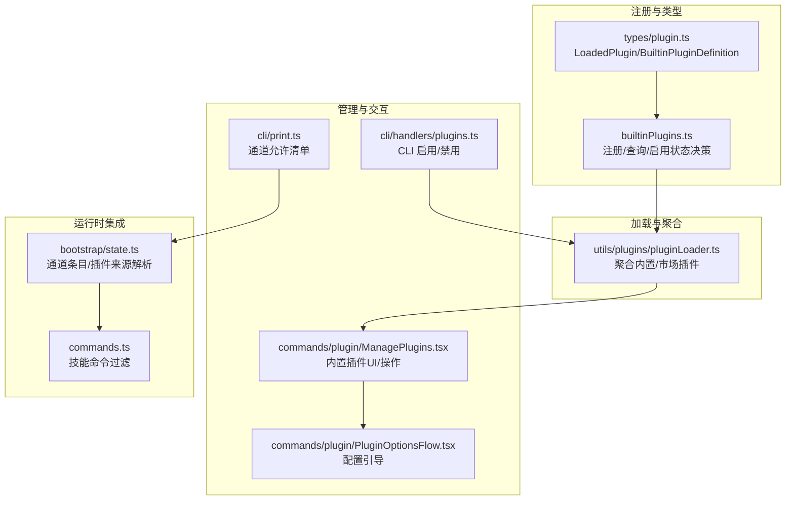
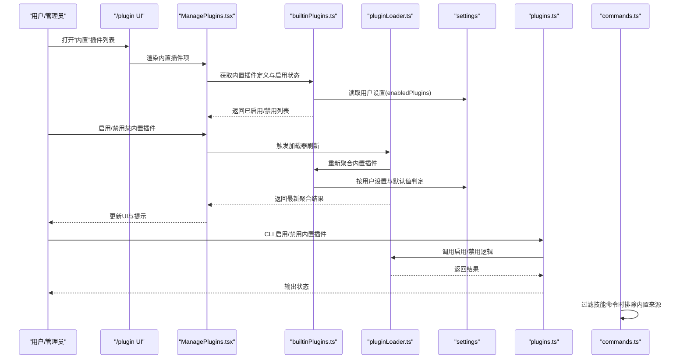
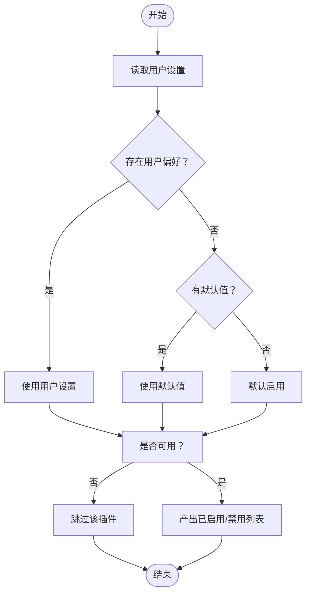
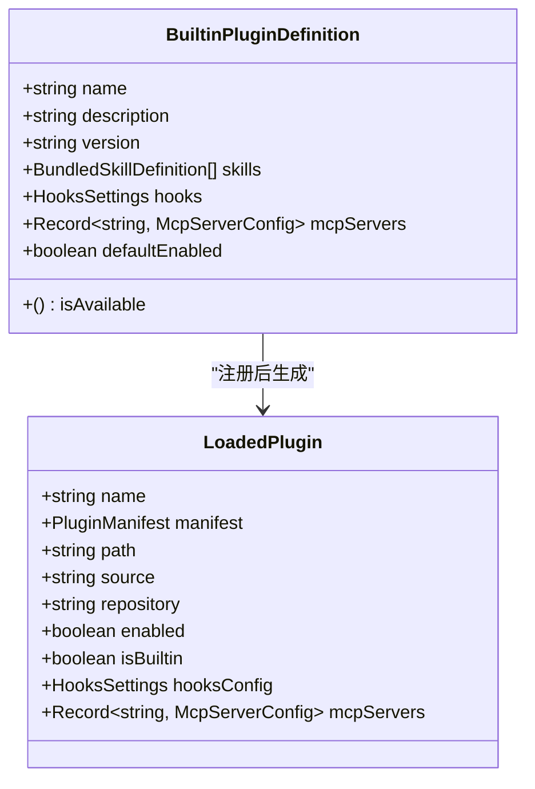
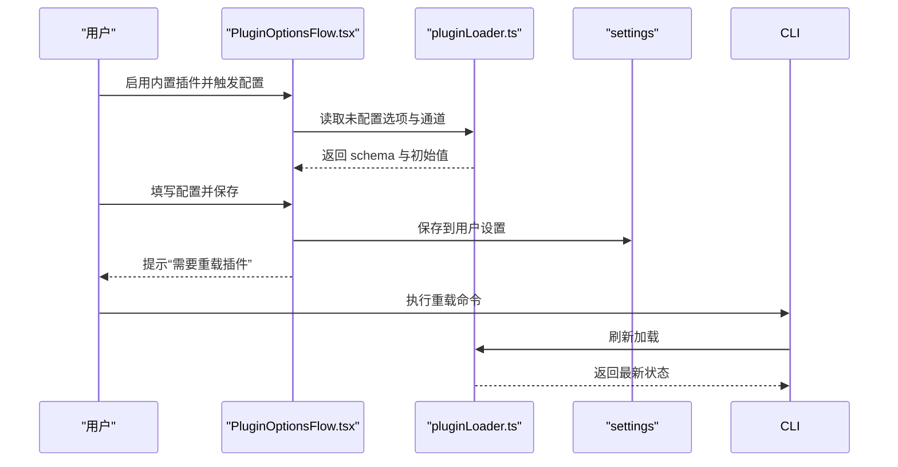
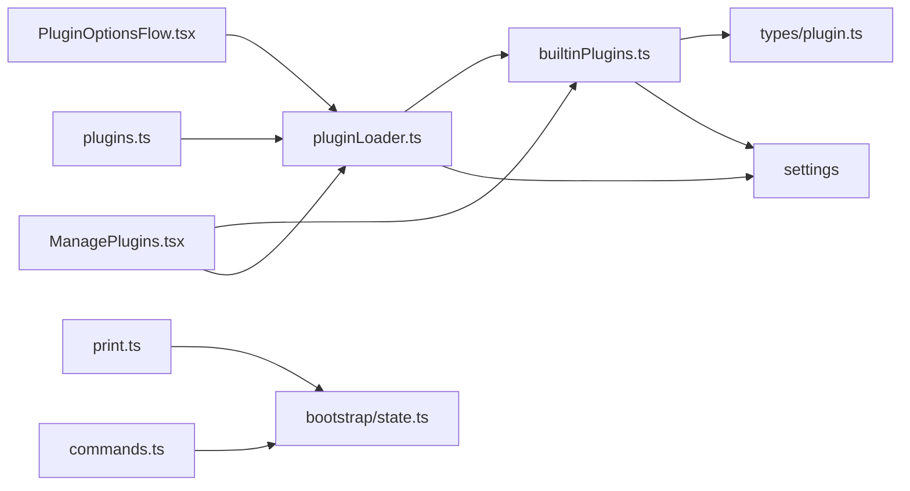

# 内置插件

<cite>
**本文引用的文件**
- [builtinPlugins.ts](file://src/plugins/builtinPlugins.ts)
- [plugin.ts](file://src/types/plugin.ts)
- [pluginLoader.ts](file://src/utils/plugins/pluginLoader.ts)
- [ManagePlugins.tsx](file://src/commands/plugin/ManagePlugins.tsx)
- [PluginOptionsFlow.tsx](file://src/commands/plugin/PluginOptionsFlow.tsx)
- [plugins.ts](file://src/cli/handlers/plugins.ts)
- [print.ts](file://src/cli/print.ts)
- [state.ts](file://src/bootstrap/state.ts)
- [commands.ts](file://src/commands.ts)
</cite>

## 目录
1. [简介](#简介)
2. [项目结构](#项目结构)
3. [核心组件](#核心组件)
4. [架构总览](#架构总览)
5. [详细组件分析](#详细组件分析)
6. [依赖关系分析](#依赖关系分析)
7. [性能考量](#性能考量)
8. [故障排查指南](#故障排查指南)
9. [结论](#结论)
10. [附录](#附录)

## 简介
本文件系统化阐述内置插件（Built-in Plugins）的设计与实现，覆盖注册机制、启用/禁用管理、配置选项、可用性检查与默认状态、与市场插件的区别与管理方式、分类（技能插件、钩子插件、MCP 服务器插件）、用户设置与持久化、开发与维护流程，以及具体示例与配置案例。目标读者包括最终用户、管理员与开发者。

## 项目结构
内置插件由“注册表 + 加载器 + UI/CLI 管理 + 类型定义”构成：
- 注册与查询：在启动时注册，按名称或 ID 查询，按用户设置与默认值决定启用/禁用。
- 加载与合并：加载器统一聚合内置与市场插件，生成已启用/禁用列表与错误集合。
- 管理界面：/plugin UI 将内置插件以“内置”分组展示，支持启用/禁用、查看组件、配置选项等。
- 配置与选项：支持顶层插件选项与 MCP 通道级用户配置，提供引导式配置流程。
- 标识符与范围：内置插件使用特定标识符后缀区分，并在 UI 中以“内置”作用域显示。

**图表来源**
- [builtinPlugins.ts:1-160](file://src/plugins/builtinPlugins.ts#L1-L160)
- [plugin.ts:18-70](file://src/types/plugin.ts#L18-L70)
- [pluginLoader.ts:1-200](file://src/utils/plugins/pluginLoader.ts#L1-L200)
- [ManagePlugins.tsx:193-339](file://src/commands/plugin/ManagePlugins.tsx#L193-L339)
- [PluginOptionsFlow.tsx:1-101](file://src/commands/plugin/PluginOptionsFlow.tsx#L1-L101)
- [plugins.ts:240-253](file://src/cli/handlers/plugins.ts#L240-L253)
- [print.ts:4674-4711](file://src/cli/print.ts#L4674-L4711)
- [state.ts:37-40](file://src/bootstrap/state.ts#L37-L40)
- [commands.ts:541-581](file://src/commands.ts#L541-L581)

**章节来源**
- [builtinPlugins.ts:1-160](file://src/plugins/builtinPlugins.ts#L1-L160)
- [plugin.ts:18-70](file://src/types/plugin.ts#L18-L70)
- [pluginLoader.ts:1-200](file://src/utils/plugins/pluginLoader.ts#L1-L200)
- [ManagePlugins.tsx:193-339](file://src/commands/plugin/ManagePlugins.tsx#L193-L339)
- [PluginOptionsFlow.tsx:1-101](file://src/commands/plugin/PluginOptionsFlow.tsx#L1-L101)
- [plugins.ts:240-253](file://src/cli/handlers/plugins.ts#L240-L253)
- [print.ts:4674-4711](file://src/cli/print.ts#L4674-L4711)
- [state.ts:37-40](file://src/bootstrap/state.ts#L37-L40)
- [commands.ts:541-581](file://src/commands.ts#L541-L581)

## 核心组件
- 内置插件注册与查询
  - 提供注册函数、ID 判定、按名获取定义、按用户设置与默认值拆分启用/禁用列表。
- 类型定义
  - 定义内置插件定义结构、加载后的插件对象、错误类型与消息映射。
- 插件加载器
  - 统一加载内置与市场插件，处理重复名、错误收集、版本缓存、种子缓存探测等。
- 管理界面
  - 在 /plugin UI 中将内置插件归类为“内置”，支持启用/禁用、查看组件、配置选项、批量操作。
- 配置与选项
  - 支持顶层插件选项与 MCP 通道级用户配置；提供配置引导流程，保存后提示需重载生效。
- CLI 管理
  - 提供启用/禁用/更新/卸载等命令行接口，支持作用域与批量操作。
- 运行时集成
  - 通道允许清单校验要求插件来源；技能命令过滤排除内置插件来源标记。

**章节来源**
- [builtinPlugins.ts:25-102](file://src/plugins/builtinPlugins.ts#L25-L102)
- [plugin.ts:18-70](file://src/types/plugin.ts#L18-L70)
- [pluginLoader.ts:1-200](file://src/utils/plugins/pluginLoader.ts#L1-L200)
- [ManagePlugins.tsx:193-339](file://src/commands/plugin/ManagePlugins.tsx#L193-L339)
- [PluginOptionsFlow.tsx:1-101](file://src/commands/plugin/PluginOptionsFlow.tsx#L1-L101)
- [plugins.ts:240-253](file://src/cli/handlers/plugins.ts#L240-L253)
- [print.ts:4674-4711](file://src/cli/print.ts#L4674-L4711)
- [commands.ts:541-581](file://src/commands.ts#L541-L581)

## 架构总览
内置插件从注册到运行的关键路径如下：

**图表来源**
- [ManagePlugins.tsx:564-585](file://src/commands/plugin/ManagePlugins.tsx#L564-L585)
- [builtinPlugins.ts:57-102](file://src/plugins/builtinPlugins.ts#L57-L102)
- [pluginLoader.ts:1-200](file://src/utils/plugins/pluginLoader.ts#L1-L200)
- [plugins.ts:240-253](file://src/cli/handlers/plugins.ts#L240-L253)
- [commands.ts:541-581](file://src/commands.ts#L541-L581)

## 详细组件分析

### 注册与启用/禁用管理
- 注册
  - 在应用启动阶段调用注册函数，将内置插件定义写入注册表。
- 启用/禁用判定
  - 优先使用用户设置；若未设置则回退到插件默认值；若不可用则跳过。
- 标识符与范围
  - 内置插件 ID 使用特定后缀以区别于市场插件；UI 中以“内置”作用域显示。

**图表来源**
- [builtinPlugins.ts:57-102](file://src/plugins/builtinPlugins.ts#L57-L102)

**章节来源**
- [builtinPlugins.ts:25-102](file://src/plugins/builtinPlugins.ts#L25-L102)

### 与市场插件的区别与管理方式
- 标识符格式
  - 内置插件：name@builtin
  - 市场插件：name@marketplace
- 管理方式
  - 内置插件通过用户设置控制启用/禁用；市场插件通过安装/更新/卸载与作用域管理。
- UI 展示
  - 内置插件在“内置”分组中显示，作用域固定为“内置”。

**章节来源**
- [builtinPlugins.ts:12-14](file://src/plugins/builtinPlugins.ts#L12-L14)
- [ManagePlugins.tsx:564-585](file://src/commands/plugin/ManagePlugins.tsx#L564-L585)

### 分类：技能插件、钩子插件、MCP 服务器插件
- 技能插件
  - 通过内置插件定义提供技能，加载器将其转换为命令对象，仅启用的内置插件技能参与聚合。
- 钩子插件
  - 通过内置插件定义提供钩子配置，UI 中可列出事件类型。
- MCP 服务器插件
  - 通过内置插件定义提供 MCP 服务器配置，UI 中可列出服务器名称；通道允许清单要求插件来源。

**图表来源**
- [plugin.ts:18-70](file://src/types/plugin.ts#L18-L70)

**章节来源**
- [plugin.ts:18-70](file://src/types/plugin.ts#L18-L70)
- [ManagePlugins.tsx:193-339](file://src/commands/plugin/ManagePlugins.tsx#L193-L339)
- [print.ts:4674-4711](file://src/cli/print.ts#L4674-L4711)

### 配置方法与用户设置管理
- 顶层插件选项
  - 通过配置引导流程收集未配置项，保存至用户设置；保存后提示需重载插件以生效。
- MCP 通道级用户配置
  - 针对每个 MCP 服务器提供独立配置，支持 schema 校验与预填。
- 设置持久化
  - 用户设置中的 enabledPlugins 字段用于记录内置插件启用状态；CLI 与 UI 均读写该字段。

**图表来源**
- [PluginOptionsFlow.tsx:1-101](file://src/commands/plugin/PluginOptionsFlow.tsx#L1-L101)
- [ManagePlugins.tsx:1660-1701](file://src/commands/plugin/ManagePlugins.tsx#L1660-L1701)
- [pluginLoader.ts:1-200](file://src/utils/plugins/pluginLoader.ts#L1-L200)

**章节来源**
- [PluginOptionsFlow.tsx:1-101](file://src/commands/plugin/PluginOptionsFlow.tsx#L1-L101)
- [ManagePlugins.tsx:1660-1701](file://src/commands/plugin/ManagePlugins.tsx#L1660-L1701)
- [pluginLoader.ts:1-200](file://src/utils/plugins/pluginLoader.ts#L1-L200)

### 可用性检查与默认状态设置
- 可用性检查
  - 若插件定义提供可用性回调且返回 false，则该插件不进入启用/禁用列表。
- 默认状态
  - 无用户设置时，优先使用插件定义的默认值；否则默认启用。

**章节来源**
- [builtinPlugins.ts:66-76](file://src/plugins/builtinPlugins.ts#L66-L76)

### 开发与维护流程
- 注册内置插件
  - 在启动阶段调用注册函数，传入包含技能、钩子、MCP 服务器等的定义。
- 配置与测试
  - 通过 /plugin UI 或 CLI 验证启用/禁用、组件展示与配置流程。
- 错误处理
  - 使用统一的错误类型与消息映射，便于定位与提示。

**章节来源**
- [builtinPlugins.ts:25-32](file://src/plugins/builtinPlugins.ts#L25-L32)
- [plugin.ts:101-284](file://src/types/plugin.ts#L101-L284)

### 具体示例与配置案例
- 示例：技能插件
  - 内置插件定义包含若干技能，加载器将其转为命令对象，仅启用的内置技能参与技能列表。
- 示例：MCP 服务器插件
  - 内置插件定义包含 MCP 服务器配置，UI 中可列出服务器名称；通道允许清单要求插件来源。
- 配置案例
  - 顶层插件选项：在配置引导中填写必填项并保存，提示需执行重载命令。
  - MCP 通道级配置：针对每个通道单独配置，保存后提示需重载生效。

**章节来源**
- [builtinPlugins.ts:108-121](file://src/plugins/builtinPlugins.ts#L108-L121)
- [ManagePlugins.tsx:193-339](file://src/commands/plugin/ManagePlugins.tsx#L193-L339)
- [PluginOptionsFlow.tsx:66-95](file://src/commands/plugin/PluginOptionsFlow.tsx#L66-L95)

## 依赖关系分析
- 组件耦合
  - builtinPlugins.ts 与 types/plugin.ts 强耦合（类型定义），与 settings 交互（用户设置）。
  - pluginLoader.ts 聚合内置与市场插件，依赖注册表与设置。
  - ManagePlugins.tsx 依赖注册表与加载器，负责 UI 行为与操作。
  - PluginOptionsFlow.tsx 依赖加载器与设置，负责配置引导。
  - CLI handlers 与 pluginLoader.ts 协作完成启用/禁用等操作。
  - print.ts 与 bootstrap/state.ts 协作进行通道允许清单校验。
  - commands.ts 与 bootstrap/state.ts 协作过滤技能命令。

**图表来源**
- [builtinPlugins.ts:1-160](file://src/plugins/builtinPlugins.ts#L1-L160)
- [plugin.ts:18-70](file://src/types/plugin.ts#L18-L70)
- [pluginLoader.ts:1-200](file://src/utils/plugins/pluginLoader.ts#L1-L200)
- [ManagePlugins.tsx:193-339](file://src/commands/plugin/ManagePlugins.tsx#L193-L339)
- [PluginOptionsFlow.tsx:1-101](file://src/commands/plugin/PluginOptionsFlow.tsx#L1-L101)
- [plugins.ts:240-253](file://src/cli/handlers/plugins.ts#L240-L253)
- [print.ts:4674-4711](file://src/cli/print.ts#L4674-L4711)
- [state.ts:37-40](file://src/bootstrap/state.ts#L37-L40)
- [commands.ts:541-581](file://src/commands.ts#L541-L581)

**章节来源**
- [builtinPlugins.ts:1-160](file://src/plugins/builtinPlugins.ts#L1-L160)
- [plugin.ts:18-70](file://src/types/plugin.ts#L18-L70)
- [pluginLoader.ts:1-200](file://src/utils/plugins/pluginLoader.ts#L1-L200)
- [ManagePlugins.tsx:193-339](file://src/commands/plugin/ManagePlugins.tsx#L193-L339)
- [PluginOptionsFlow.tsx:1-101](file://src/commands/plugin/PluginOptionsFlow.tsx#L1-L101)
- [plugins.ts:240-253](file://src/cli/handlers/plugins.ts#L240-L253)
- [print.ts:4674-4711](file://src/cli/print.ts#L4674-L4711)
- [state.ts:37-40](file://src/bootstrap/state.ts#L37-L40)
- [commands.ts:541-581](file://src/commands.ts#L541-L581)

## 性能考量
- 缓存与版本化
  - 插件缓存采用版本化目录结构，支持种子缓存探测，减少重复下载与解压。
- 加载策略
  - 加载器按优先级发现插件源，避免重复加载与冲突；错误收集集中处理，便于快速失败与重试。
- UI 响应
  - UI 通过挂起状态与错误提示优化用户体验，避免长时间无响应。

[本节为通用建议，无需引用具体文件]

## 故障排查指南
- 常见错误类型
  - 路径不存在、网络错误、清单解析/校验失败、MCP/LSP 配置无效、请求超时/失败、依赖未满足等。
- 错误消息映射
  - 通过统一的错误消息映射函数生成用户可读提示，辅助定位问题。
- 排查步骤
  - 检查用户设置中的启用状态与配置项；
  - 查看加载器输出的错误集合；
  - 确认通道允许清单与插件来源；
  - 必要时清理缓存并重载插件。

**章节来源**
- [plugin.ts:101-284](file://src/types/plugin.ts#L101-L284)
- [plugin.ts:295-363](file://src/types/plugin.ts#L295-L363)

## 结论
内置插件系统通过清晰的注册与启用/禁用判定、统一的加载与聚合、完善的 UI/CLI 管理与配置引导，实现了与市场插件一致的用户体验。其关键优势在于：
- 明确的标识符与作用域区分；
- 基于用户设置与默认值的灵活启用策略；
- 支持多组件（技能/钩子/MCP）与多层级配置；
- 与运行时通道与技能过滤的无缝集成。

[本节为总结，无需引用具体文件]

## 附录
- 关键术语
  - 内置插件：随 CLI 发布、可被用户启用/禁用的插件。
  - 市场插件：通过市场安装、具有版本与作用域管理的插件。
  - 通道：MCP 服务器连接实例，支持允许清单与用户配置。
- 相关文件索引
  - 注册与类型：[builtinPlugins.ts](file://src/plugins/builtinPlugins.ts)，[plugin.ts](file://src/types/plugin.ts)
  - 加载与聚合：[pluginLoader.ts](file://src/utils/plugins/pluginLoader.ts)
  - 管理与配置：[ManagePlugins.tsx](file://src/commands/plugin/ManagePlugins.tsx)，[PluginOptionsFlow.tsx](file://src/commands/plugin/PluginOptionsFlow.tsx)
  - CLI 管理：[plugins.ts](file://src/cli/handlers/plugins.ts)
  - 运行时集成：[print.ts](file://src/cli/print.ts)，[state.ts](file://src/bootstrap/state.ts)，[commands.ts](file://src/commands.ts)

[本节为补充说明，无需引用具体文件]