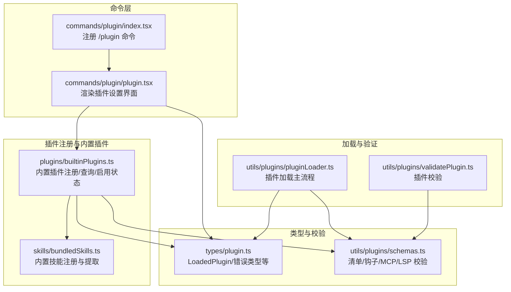
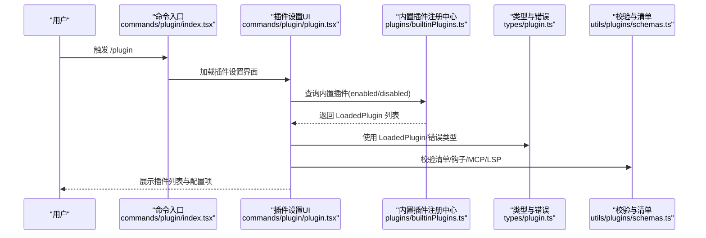
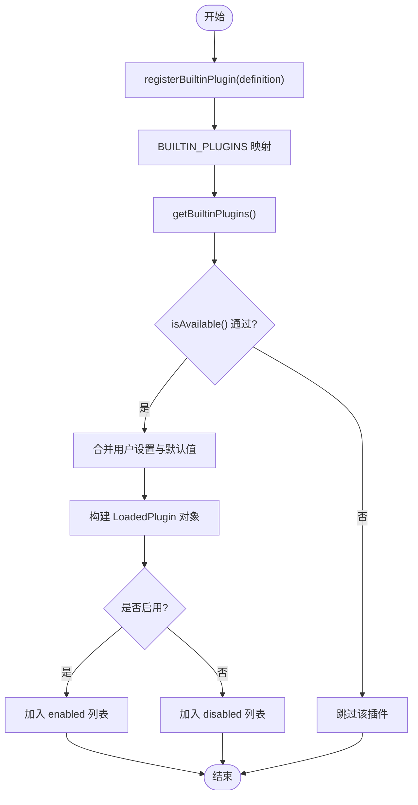
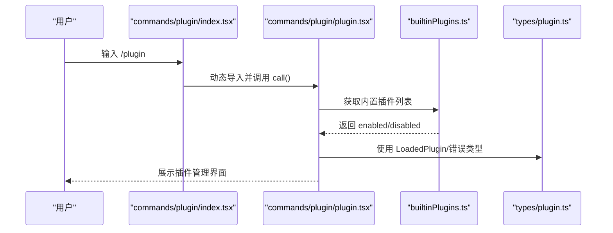
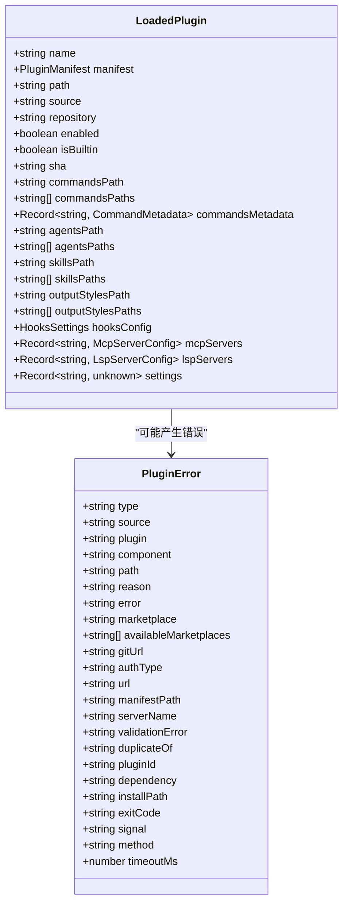
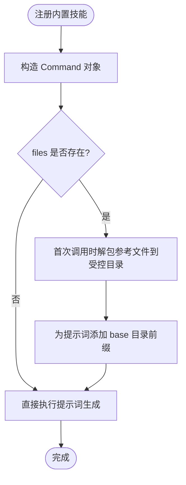
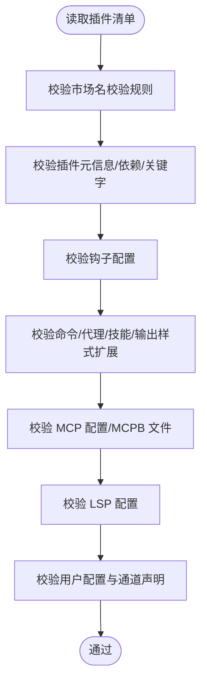
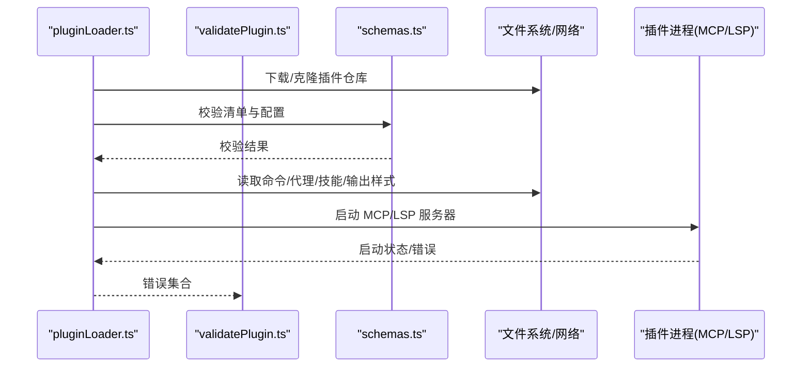
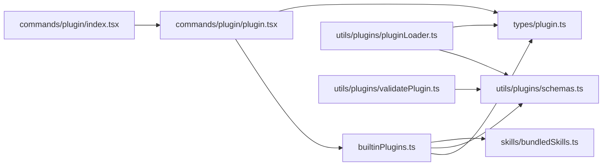

# 插件系统

<cite>
**本文引用的文件**
- [builtinPlugins.ts](file://src/plugins/builtinPlugins.ts)
- [plugin.ts](file://src/commands/plugin/plugin.tsx)
- [index.tsx](file://src/commands/plugin/index.tsx)
- [plugin.ts](file://src/types/plugin.ts)
- [bundledSkills.ts](file://src/skills/bundledSkills.ts)
- [schemas.ts](file://src/utils/plugins/schemas.ts)
- [pluginLoader.ts](file://src/utils/plugins/pluginLoader.ts)
- [validatePlugin.ts](file://src/utils/plugins/validatePlugin.ts)
</cite>

## 目录
1. [简介](#简介)
2. [项目结构](#项目结构)
3. [核心组件](#核心组件)
4. [架构总览](#架构总览)
5. [详细组件分析](#详细组件分析)
6. [依赖关系分析](#依赖关系分析)
7. [性能考量](#性能考量)
8. [故障排查指南](#故障排查指南)
9. [结论](#结论)
10. [附录](#附录)

## 简介
本文件为 Claude Code 插件系统的全面技术文档，面向插件开发者与维护者，系统阐述插件架构设计、插件生命周期与注册机制、内置插件与市场插件的差异与配置、插件加载与依赖管理、版本与安全策略、错误类型与排障建议，并提供开发、测试与发布的最佳实践与示例路径。

## 项目结构
围绕插件系统的关键目录与文件如下：
- 插件注册与内置插件管理：src/plugins/builtinPlugins.ts
- 插件命令入口与 UI：src/commands/plugin/*
- 类型定义：src/types/plugin.ts
- 内置技能（与插件能力类似）：src/skills/bundledSkills.ts
- 插件清单与配置校验：src/utils/plugins/schemas.ts
- 插件加载器与校验工具：src/utils/plugins/pluginLoader.ts、src/utils/plugins/validatePlugin.ts

**图示来源**
- [index.tsx:1-11](file://src/commands/plugin/index.tsx#L1-L11)
- [plugin.ts:1-7](file://src/commands/plugin/plugin.tsx#L1-L7)
- [builtinPlugins.ts:1-160](file://src/plugins/builtinPlugins.ts#L1-L160)
- [bundledSkills.ts:1-221](file://src/skills/bundledSkills.ts#L1-L221)
- [plugin.ts:1-364](file://src/types/plugin.ts#L1-L364)
- [schemas.ts:1-800](file://src/utils/plugins/schemas.ts#L1-L800)
- [pluginLoader.ts](file://src/utils/plugins/pluginLoader.ts)
- [validatePlugin.ts](file://src/utils/plugins/validatePlugin.ts)

**章节来源**
- [index.tsx:1-11](file://src/commands/plugin/index.tsx#L1-L11)
- [plugin.ts:1-7](file://src/commands/plugin/plugin.tsx#L1-L7)
- [builtinPlugins.ts:1-160](file://src/plugins/builtinPlugins.ts#L1-L160)
- [bundledSkills.ts:1-221](file://src/skills/bundledSkills.ts#L1-L221)
- [plugin.ts:1-364](file://src/types/plugin.ts#L1-L364)
- [schemas.ts:1-800](file://src/utils/plugins/schemas.ts#L1-L800)

## 核心组件
- 内置插件注册中心：负责内置插件的注册、可用性过滤、启用状态合并用户设置、生成 LoadedPlugin 列表，并将内置技能转换为命令对象供模型调用。
- 插件命令入口：/plugin 命令作为入口，加载插件设置 UI，驱动插件发现、安装、启用/禁用、配置与卸载。
- 类型与错误体系：统一的 LoadedPlugin 结构、插件组件类型、丰富的 PluginError 枚举，便于 UI 展示与日志定位。
- 清单与配置校验：对插件清单、钩子、MCP/LSP 配置进行强类型校验，保障运行期稳定性。
- 加载器与校验工具：实现从磁盘或远程源加载插件、解析清单、处理依赖、启动 MCP/LSP 服务、错误收集与报告。

**章节来源**
- [builtinPlugins.ts:21-128](file://src/plugins/builtinPlugins.ts#L21-L128)
- [plugin.ts:1-7](file://src/commands/plugin/plugin.tsx#L1-L7)
- [index.tsx:1-11](file://src/commands/plugin/index.tsx#L1-L11)
- [plugin.ts:48-289](file://src/types/plugin.ts#L48-L289)
- [schemas.ts:274-800](file://src/utils/plugins/schemas.ts#L274-L800)
- [pluginLoader.ts](file://src/utils/plugins/pluginLoader.ts)
- [validatePlugin.ts](file://src/utils/plugins/validatePlugin.ts)

## 架构总览
下图展示从命令入口到插件加载与运行的整体流程，以及内置插件与市场插件在数据结构上的统一与差异。

**图示来源**
- [index.tsx:1-11](file://src/commands/plugin/index.tsx#L1-L11)
- [plugin.ts:1-7](file://src/commands/plugin/plugin.tsx#L1-L7)
- [builtinPlugins.ts:57-102](file://src/plugins/builtinPlugins.ts#L57-L102)
- [plugin.ts:48-289](file://src/types/plugin.ts#L48-L289)
- [schemas.ts:274-800](file://src/utils/plugins/schemas.ts#L274-L800)

## 详细组件分析

### 组件一：内置插件注册中心（builtinPlugins.ts）
- 职责
  - 注册内置插件定义（名称、描述、版本、技能、钩子、MCP/LSP、可用性检查、默认启用状态）。
  - 将已注册插件转换为 LoadedPlugin，按用户设置与默认值决定启用状态。
  - 将内置技能转换为命令对象，供模型调用。
- 关键点
  - 插件 ID 格式：name@builtin，用于区分市场插件（name@marketplace）。
  - isAvailable 过滤：不可用插件直接隐藏。
  - 用户设置优先级：用户显式设置 > 插件默认 > true。
  - 内置技能转命令时，保留用户可否调用、工具限制、上下文等属性。

**图示来源**
- [builtinPlugins.ts:21-102](file://src/plugins/builtinPlugins.ts#L21-L102)

**章节来源**
- [builtinPlugins.ts:21-128](file://src/plugins/builtinPlugins.ts#L21-L128)

### 组件二：插件命令入口与 UI（commands/plugin）
- 命令入口
  - 定义 /plugin 命令，立即执行并异步加载插件设置 UI 模块。
- UI 行为
  - 渲染插件设置界面，聚合内置与市场插件信息，支持启用/禁用、配置、错误展示等。

**图示来源**
- [index.tsx:1-11](file://src/commands/plugin/index.tsx#L1-L11)
- [plugin.ts:1-7](file://src/commands/plugin/plugin.tsx#L1-L7)
- [builtinPlugins.ts:57-102](file://src/plugins/builtinPlugins.ts#L57-L102)
- [plugin.ts:48-289](file://src/types/plugin.ts#L48-L289)

**章节来源**
- [index.tsx:1-11](file://src/commands/plugin/index.tsx#L1-L11)
- [plugin.ts:1-7](file://src/commands/plugin/plugin.tsx#L1-L7)

### 组件三：类型与错误体系（types/plugin.ts）
- LoadedPlugin：统一承载插件元数据、来源、启用状态、组件路径、MCP/LSP 配置、钩子设置、用户配置等。
- PluginError：枚举化错误类型，覆盖路径不存在、网络错误、清单解析/校验失败、MCP/LSP 启动/超时/崩溃、市场策略限制、依赖未满足、缓存缺失等，配套统一消息生成函数。

**图示来源**
- [plugin.ts:48-289](file://src/types/plugin.ts#L48-L289)

**章节来源**
- [plugin.ts:48-364](file://src/types/plugin.ts#L48-L364)

### 组件四：内置技能（bundledSkills.ts）
- 作用
  - 将编译进 CLI 的技能以命令形式暴露给模型；支持首次调用时解包参考文件到受控目录，确保安全写入与路径规范化。
- 与插件的关系
  - 内置技能与插件技能共享命令结构（Command），便于统一调度与权限控制；但内置技能不走市场插件的安装/更新流程。

**图示来源**
- [bundledSkills.ts:53-108](file://src/skills/bundledSkills.ts#L53-L108)
- [bundledSkills.ts:131-221](file://src/skills/bundledSkills.ts#L131-L221)

**章节来源**
- [bundledSkills.ts:1-221](file://src/skills/bundledSkills.ts#L1-L221)

### 组件五：清单与配置校验（utils/plugins/schemas.ts）
- 官方市场名校验与来源验证：阻止第三方冒用官方名称，限定来源组织与 URL 形式。
- 清单字段校验：插件元信息、作者、依赖、命令/代理/技能/输出样式扩展、MCP/LSP 配置等。
- 用户配置与通道声明：支持在清单中声明用户可配置项与助手模式下的频道（channel）绑定，便于安装时弹窗收集必要参数。

**图示来源**
- [schemas.ts:216-800](file://src/utils/plugins/schemas.ts#L216-L800)

**章节来源**
- [schemas.ts:1-800](file://src/utils/plugins/schemas.ts#L1-L800)

### 组件六：插件加载器与校验工具（pluginLoader.ts、validatePlugin.ts）
- 加载器职责
  - 解析与缓存市场配置、下载/克隆插件仓库、读取清单、解析组件路径、处理依赖链、启动 MCP/LSP 服务、聚合错误。
- 校验工具职责
  - 提供清单与配置的快速校验入口，辅助 UI 在安装前进行预检。

**图示来源**
- [pluginLoader.ts](file://src/utils/plugins/pluginLoader.ts)
- [validatePlugin.ts](file://src/utils/plugins/validatePlugin.ts)
- [schemas.ts:274-800](file://src/utils/plugins/schemas.ts#L274-L800)

**章节来源**
- [pluginLoader.ts](file://src/utils/plugins/pluginLoader.ts)
- [validatePlugin.ts](file://src/utils/plugins/validatePlugin.ts)

## 依赖关系分析
- 内置插件与市场插件在运行期使用同一 LoadedPlugin 结构，便于统一调度与权限控制。
- 内置插件通过用户设置与默认值决定启用状态，市场插件通过安装/更新流程与用户交互决定启用状态。
- 依赖管理：插件清单中的 dependencies 字段用于声明前置插件；加载器在启动前解析依赖链并报告未满足依赖。
- 安全与合规：官方市场名校验与来源验证防止第三方冒用；非 ASCII 名称与同形攻击模式被阻断。

**图示来源**
- [builtinPlugins.ts:1-160](file://src/plugins/builtinPlugins.ts#L1-L160)
- [plugin.ts:1-364](file://src/types/plugin.ts#L1-L364)
- [schemas.ts:1-800](file://src/utils/plugins/schemas.ts#L1-L800)
- [bundledSkills.ts:1-221](file://src/skills/bundledSkills.ts#L1-L221)
- [pluginLoader.ts](file://src/utils/plugins/pluginLoader.ts)
- [validatePlugin.ts](file://src/utils/plugins/validatePlugin.ts)
- [index.tsx:1-11](file://src/commands/plugin/index.tsx#L1-L11)
- [plugin.ts:1-7](file://src/commands/plugin/plugin.tsx#L1-L7)

**章节来源**
- [builtinPlugins.ts:1-160](file://src/plugins/builtinPlugins.ts#L1-L160)
- [plugin.ts:1-364](file://src/types/plugin.ts#L1-L364)
- [schemas.ts:1-800](file://src/utils/plugins/schemas.ts#L1-L800)
- [bundledSkills.ts:1-221](file://src/skills/bundledSkills.ts#L1-L221)
- [pluginLoader.ts](file://src/utils/plugins/pluginLoader.ts)
- [validatePlugin.ts](file://src/utils/plugins/validatePlugin.ts)
- [index.tsx:1-11](file://src/commands/plugin/index.tsx#L1-L11)
- [plugin.ts:1-7](file://src/commands/plugin/plugin.tsx#L1-L7)

## 性能考量
- 内置插件与内置技能的启用状态由用户设置与默认值决定，避免不必要的加载与初始化。
- 插件加载器采用分步校验与错误聚合，减少重复 IO 与网络请求；MCP/LSP 启动失败时及时回退并记录错误。
- 内置技能首次调用才解包参考文件，降低冷启动开销；安全写入采用一次性原子写与严格权限控制，避免竞态与路径逃逸风险。

[本节为通用性能讨论，无需列出具体文件来源]

## 故障排查指南
- 常见错误类型与定位
  - 路径不存在、网络错误、清单解析/校验失败、MCP/LSP 启动/超时/崩溃、市场策略限制（企业策略/黑名单）、依赖未满足、缓存缺失等。
- 排查步骤
  - 查看错误类型与上下文字段，结合 UI 或日志定位具体组件与路径。
  - 对于依赖未满足，确认前置插件是否已启用且存在于配置市场。
  - 对于 MCP/LSP 启动失败，检查服务器命令、参数、工作区路径与环境变量。
  - 对于缓存缺失，执行刷新命令后重试。
- 错误消息生成
  - 使用统一的消息生成函数，便于 UI 一致展示与用户理解。

**章节来源**
- [plugin.ts:101-364](file://src/types/plugin.ts#L101-L364)

## 结论
Claude Code 插件系统通过“内置插件注册中心 + 统一类型与错误体系 + 强类型清单校验 + 加载器与校验工具”的组合，实现了从注册、启用、配置到运行期监控的完整闭环。内置插件与市场插件在数据结构上保持一致，便于统一管理；同时通过严格的来源与名称校验、依赖解析与错误聚合，确保安全性与可维护性。

[本节为总结性内容，无需列出具体文件来源]

## 附录

### 插件开发指南（面向开发者）
- 创建步骤
  - 准备插件目录与清单（plugin.json），声明元信息、作者、依赖、命令/代理/技能/输出样式扩展、MCP/LSP 配置。
  - 如需用户配置，使用清单中的 userConfig 与 channels 字段声明必要参数。
  - 若为内置插件，使用注册函数在启动时注册定义，并提供默认启用状态与可用性检查。
- 插件 API 参考
  - 清单字段与校验：参见清单与配置校验模块。
  - 类型定义：LoadedPlugin、PluginError、钩子与组件类型。
- 测试方法
  - 使用校验工具对清单与配置进行预检；在本地模拟市场安装与启用流程，观察错误聚合与 UI 展示。
- 发布流程
  - 选择合适的市场（遵循官方市场名校验与来源验证规则）；确保依赖前置插件已发布并可访问；提供清晰的说明与许可证信息。

**章节来源**
- [schemas.ts:274-800](file://src/utils/plugins/schemas.ts#L274-L800)
- [plugin.ts:48-289](file://src/types/plugin.ts#L48-L289)
- [builtinPlugins.ts:21-128](file://src/plugins/builtinPlugins.ts#L21-L128)

### 插件加载机制与依赖管理
- 加载机制
  - 解析市场配置与插件仓库信息，下载/克隆至本地缓存，读取清单并解析各组件路径。
  - 处理依赖链：若声明依赖，先确保前置插件启用并可解析，否则报错。
  - 启动 MCP/LSP 服务：根据配置启动服务器，监控启动状态与异常。
- 依赖管理
  - 依赖以插件 ID 形式声明；加载器在启动前解析依赖链并报告未满足依赖。
- 版本控制
  - 支持基于仓库 SHA 的版本固定；市场插件可配置自动更新策略。

**章节来源**
- [pluginLoader.ts](file://src/utils/plugins/pluginLoader.ts)
- [plugin.ts:266-271](file://src/types/plugin.ts#L266-L271)

### 最佳实践与常见问题
- 最佳实践
  - 清单字段尽量完整，提供清晰的描述与关键词，便于发现与分类。
  - 合理拆分命令/代理/技能/输出样式，避免单一文件过大。
  - 对外部资源与敏感配置使用 userConfig 并在安装时弹窗收集。
  - 为 MCP/LSP 服务提供明确的启动/关闭超时与重启策略。
- 常见问题
  - 依赖未满足：确认前置插件已启用且存在于配置市场。
  - MCP/LSP 启动失败：检查命令、参数、工作区路径与环境变量。
  - 市场策略限制：检查企业策略与黑名单配置。

**章节来源**
- [plugin.ts:266-271](file://src/types/plugin.ts#L266-L271)
- [schemas.ts:35-58](file://src/utils/plugins/schemas.ts#L35-L58)