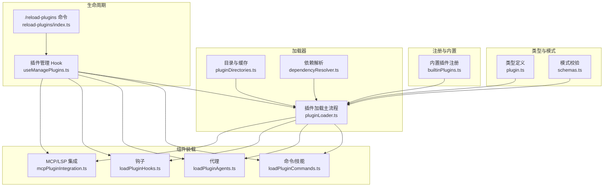
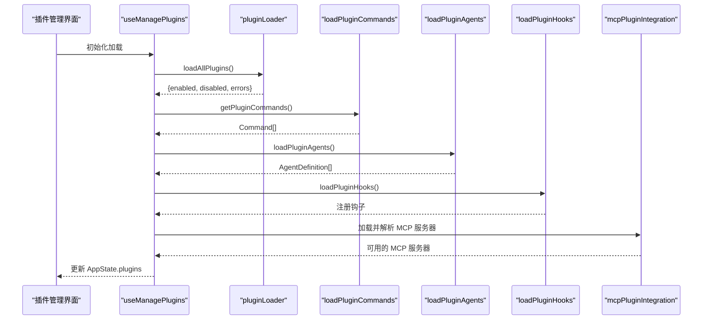
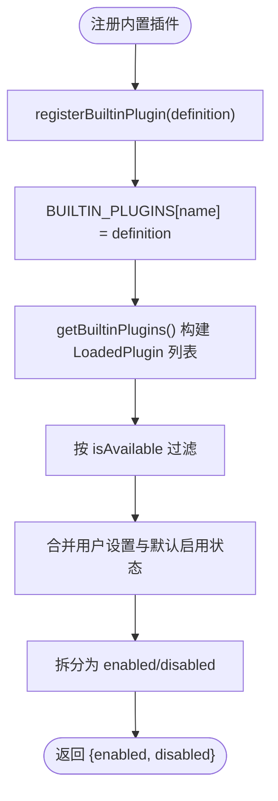
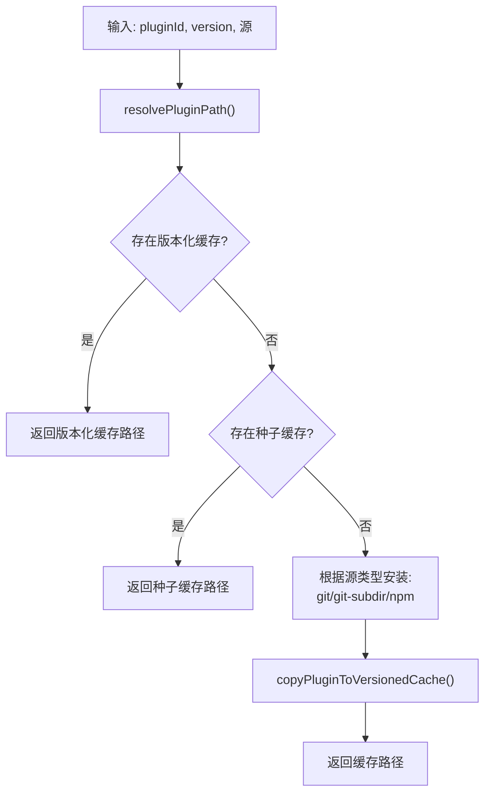
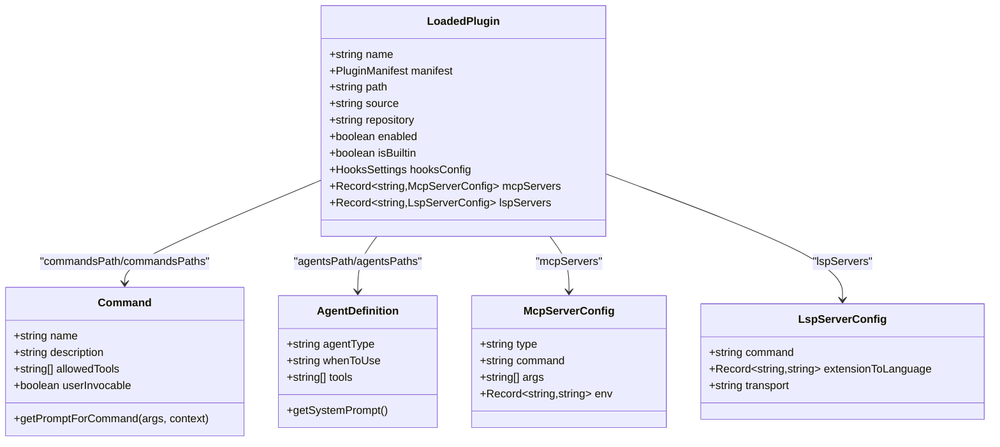
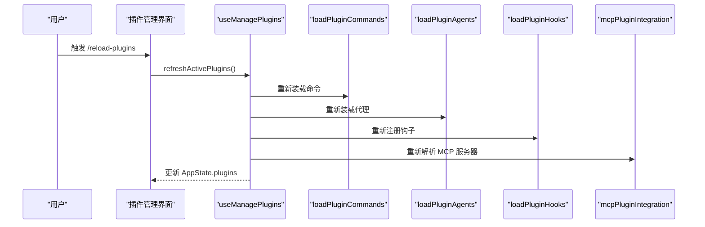
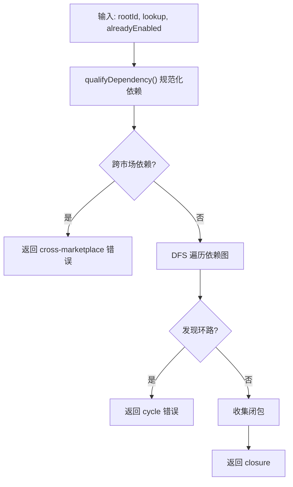
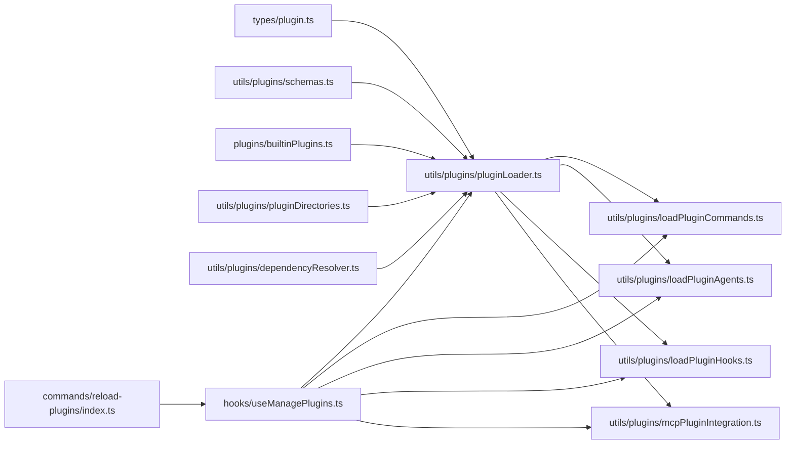

# 插件架构设计

<cite>
**本文档引用的文件**
- [builtinPlugins.ts](file://src/plugins/builtinPlugins.ts)
- [plugin.ts](file://src/types/plugin.ts)
- [useManagePlugins.ts](file://src/hooks/useManagePlugins.ts)
- [pluginLoader.ts](file://src/utils/plugins/pluginLoader.ts)
- [loadPluginCommands.ts](file://src/utils/plugins/loadPluginCommands.ts)
- [loadPluginAgents.ts](file://src/utils/plugins/loadPluginAgents.ts)
- [loadPluginHooks.ts](file://src/utils/plugins/loadPluginHooks.ts)
- [mcpPluginIntegration.ts](file://src/utils/plugins/mcpPluginIntegration.ts)
- [schemas.ts](file://src/utils/plugins/schemas.ts)
- [pluginDirectories.ts](file://src/utils/plugins/pluginDirectories.ts)
- [dependencyResolver.ts](file://src/utils/plugins/dependencyResolver.ts)
- [reload-plugins/index.ts](file://src/commands/reload-plugins/index.ts)
</cite>

## 目录
1. [引言](#引言)
2. [项目结构](#项目结构)
3. [核心组件](#核心组件)
4. [架构总览](#架构总览)
5. [详细组件分析](#详细组件分析)
6. [依赖关系分析](#依赖关系分析)
7. [性能考虑](#性能考虑)
8. [故障排除指南](#故障排除指南)
9. [结论](#结论)
10. [附录](#附录)

## 引言
本文件系统化阐述 Claude Code 插件架构设计，覆盖插件注册机制、生命周期管理、加载流程、插件定义结构、接口规范、类型系统、与核心系统的集成（钩子、工具扩展、命令注册）、依赖管理、版本控制与兼容性检查、设计原则与最佳实践，以及扩展点与自定义机制。目标读者为插件开发者与系统架构师。

## 项目结构
插件系统围绕“插件清单与注册”、“加载器与缓存”、“组件装载（命令/技能/代理/钩子/MCP/LSP）”、“依赖解析与版本控制”、“目录与数据存储”等模块组织，形成清晰分层与职责分离：

- 类型与模式：定义插件元数据、错误类型、组件类型、清单与配置校验模式
- 注册与内置插件：内置插件注册表与启用状态管理
- 加载器：发现、安装、缓存、验证、去重、错误收集
- 组件装载：命令/技能、代理、钩子、MCP/LSP 服务器
- 依赖解析：安装时闭包解析与运行时一致性校验
- 目录与数据：插件根目录、种子缓存、数据目录、大小统计与清理
- 生命周期：初始化加载、变更检测、热重载、刷新激活

**图表来源**
- [plugin.ts:1-364](file://src/types/plugin.ts#L1-L364)
- [schemas.ts:1-800](file://src/utils/plugins/schemas.ts#L1-L800)
- [builtinPlugins.ts:1-160](file://src/plugins/builtinPlugins.ts#L1-L160)
- [pluginLoader.ts:1-800](file://src/utils/plugins/pluginLoader.ts#L1-L800)
- [pluginDirectories.ts:1-179](file://src/utils/plugins/pluginDirectories.ts#L1-L179)
- [dependencyResolver.ts:1-306](file://src/utils/plugins/dependencyResolver.ts#L1-L306)
- [loadPluginCommands.ts:1-947](file://src/utils/plugins/loadPluginCommands.ts#L1-L947)
- [loadPluginAgents.ts:1-349](file://src/utils/plugins/loadPluginAgents.ts#L1-L349)
- [loadPluginHooks.ts:1-288](file://src/utils/plugins/loadPluginHooks.ts#L1-L288)
- [mcpPluginIntegration.ts:1-635](file://src/utils/plugins/mcpPluginIntegration.ts#L1-L635)
- [useManagePlugins.ts:1-305](file://src/hooks/useManagePlugins.ts#L1-L305)
- [reload-plugins/index.ts:1-19](file://src/commands/reload-plugins/index.ts#L1-L19)

**章节来源**
- [plugin.ts:1-364](file://src/types/plugin.ts#L1-L364)
- [schemas.ts:1-800](file://src/utils/plugins/schemas.ts#L1-L800)
- [builtinPlugins.ts:1-160](file://src/plugins/builtinPlugins.ts#L1-L160)
- [pluginLoader.ts:1-800](file://src/utils/plugins/pluginLoader.ts#L1-L800)
- [pluginDirectories.ts:1-179](file://src/utils/plugins/pluginDirectories.ts#L1-L179)
- [dependencyResolver.ts:1-306](file://src/utils/plugins/dependencyResolver.ts#L1-L306)
- [loadPluginCommands.ts:1-947](file://src/utils/plugins/loadPluginCommands.ts#L1-L947)
- [loadPluginAgents.ts:1-349](file://src/utils/plugins/loadPluginAgents.ts#L1-L349)
- [loadPluginHooks.ts:1-288](file://src/utils/plugins/loadPluginHooks.ts#L1-L288)
- [mcpPluginIntegration.ts:1-635](file://src/utils/plugins/mcpPluginIntegration.ts#L1-L635)
- [useManagePlugins.ts:1-305](file://src/hooks/useManagePlugins.ts#L1-L305)
- [reload-plugins/index.ts:1-19](file://src/commands/reload-plugins/index.ts#L1-L19)

## 核心组件
- 插件类型与错误模型：统一的 LoadedPlugin、PluginComponent、PluginError 类型体系，支持类型安全的错误处理与用户提示
- 内置插件注册：集中式注册表，支持可用性过滤、默认启用状态、用户设置覆盖
- 插件加载器：多源发现（市场、种子缓存、本地）、版本化缓存、ZIP 缓存、错误收集与上报
- 组件装载器：命令/技能、代理、钩子、MCP/LSP 的解析与注入
- 依赖解析：安装时闭包解析与运行时一致性校验，跨市场依赖限制
- 生命周期管理：初始化加载、变更通知、热重载、刷新激活

**章节来源**
- [plugin.ts:48-289](file://src/types/plugin.ts#L48-L289)
- [builtinPlugins.ts:21-102](file://src/plugins/builtinPlugins.ts#L21-L102)
- [pluginLoader.ts:1-800](file://src/utils/plugins/pluginLoader.ts#L1-L800)
- [loadPluginCommands.ts:1-947](file://src/utils/plugins/loadPluginCommands.ts#L1-L947)
- [loadPluginAgents.ts:1-349](file://src/utils/plugins/loadPluginAgents.ts#L1-L349)
- [loadPluginHooks.ts:1-288](file://src/utils/plugins/loadPluginHooks.ts#L1-L288)
- [mcpPluginIntegration.ts:1-635](file://src/utils/plugins/mcpPluginIntegration.ts#L1-L635)
- [dependencyResolver.ts:1-306](file://src/utils/plugins/dependencyResolver.ts#L1-L306)
- [useManagePlugins.ts:1-305](file://src/hooks/useManagePlugins.ts#L1-L305)

## 架构总览
插件系统采用“声明式清单 + 运行时装载”的架构。插件通过 plugin.json 等清单声明能力，系统在启动或刷新时按需装载命令、代理、钩子、MCP/LSP 等组件，并进行依赖校验与环境变量解析。内置插件与市场插件共享同一套装载与集成路径，差异主要体现在注册与启用策略上。

**图表来源**
- [useManagePlugins.ts:51-180](file://src/hooks/useManagePlugins.ts#L51-L180)
- [pluginLoader.ts:1-800](file://src/utils/plugins/pluginLoader.ts#L1-L800)
- [loadPluginCommands.ts:414-677](file://src/utils/plugins/loadPluginCommands.ts#L414-L677)
- [loadPluginAgents.ts:231-343](file://src/utils/plugins/loadPluginAgents.ts#L231-L343)
- [loadPluginHooks.ts:91-157](file://src/utils/plugins/loadPluginHooks.ts#L91-L157)
- [mcpPluginIntegration.ts:366-429](file://src/utils/plugins/mcpPluginIntegration.ts#L366-L429)

## 详细组件分析

### 插件注册与内置插件系统
- 内置插件注册表：以 Map 存储，键为插件名，值为定义对象；支持 isAvailable 过滤、默认启用状态与用户设置覆盖
- 插件标识：内置插件使用 `{name}@builtin` 格式；与市场插件区分
- 装载为 LoadedPlugin：内置插件被转换为 LoadedPlugin 结构，包含 manifest、hooksConfig、mcpServers 等字段
- 技能命令映射：内置插件的技能定义转换为命令对象，用于 UI 展示与调用

**图表来源**
- [builtinPlugins.ts:28-102](file://src/plugins/builtinPlugins.ts#L28-L102)

**章节来源**
- [builtinPlugins.ts:1-160](file://src/plugins/builtinPlugins.ts#L1-L160)

### 插件加载器与缓存
- 多源发现：优先市场插件，其次会话级插件（--plugin-dir），内置插件作为特殊来源
- 版本化缓存：按 marketplace/name/version 组织缓存目录，支持 ZIP 缓存与种子缓存
- 安装策略：git clone、git-subdir、NPM 包缓存复制；支持浅克隆与稀疏检出
- 错误收集：统一的 PluginError 类型，便于 UI 提示与诊断
- 路径解析：resolvePluginPath 支持版本化与遗留路径回退

**图表来源**
- [pluginLoader.ts:266-465](file://src/utils/plugins/pluginLoader.ts#L266-L465)
- [pluginDirectories.ts:53-90](file://src/utils/plugins/pluginDirectories.ts#L53-L90)

**章节来源**
- [pluginLoader.ts:1-800](file://src/utils/plugins/pluginLoader.ts#L1-L800)
- [pluginDirectories.ts:1-179](file://src/utils/plugins/pluginDirectories.ts#L1-L179)

### 插件组件装载（命令/技能、代理、钩子、MCP/LSP）
- 命令/技能：从 commands/ 与 skills/ 目录解析 Markdown 文件，提取 frontmatter，生成 Command 对象；支持命名空间与内联内容
- 代理：从 agents/ 目录解析 Markdown，生成 AgentDefinition；支持内存注入与工具集合
- 钩子：将插件 hooksConfig 转换为匹配器，注册到全局注册表；支持热重载与按需裁剪
- MCP/LSP：从 manifest 或 .mcp.json/.lsp.json 解析配置，支持 MCPB 文件、用户配置注入、环境变量展开、作用域前缀避免冲突

**图表来源**
- [plugin.ts:48-70](file://src/types/plugin.ts#L48-L70)
- [loadPluginCommands.ts:218-412](file://src/utils/plugins/loadPluginCommands.ts#L218-L412)
- [loadPluginAgents.ts:65-229](file://src/utils/plugins/loadPluginAgents.ts#L65-L229)
- [mcpPluginIntegration.ts:131-212](file://src/utils/plugins/mcpPluginIntegration.ts#L131-L212)

**章节来源**
- [loadPluginCommands.ts:1-947](file://src/utils/plugins/loadPluginCommands.ts#L1-L947)
- [loadPluginAgents.ts:1-349](file://src/utils/plugins/loadPluginAgents.ts#L1-L349)
- [loadPluginHooks.ts:1-288](file://src/utils/plugins/loadPluginHooks.ts#L1-L288)
- [mcpPluginIntegration.ts:1-635](file://src/utils/plugins/mcpPluginIntegration.ts#L1-L635)

### 插件生命周期管理与刷新
- 初始化加载：useManagePlugins 在挂载时执行一次性加载，包含命令、代理、钩子、MCP/LSP 的装载与错误聚合
- 变更检测：当插件状态在磁盘变化时，触发通知，引导用户执行 /reload-plugins
- 刷新激活：/reload-plugins 通过 refreshActivePlugins 应用变更，确保命令、代理、钩子、MCP 的一致性
- 热重载：钩子支持基于策略设置的热重载，避免缓存毒化

**图表来源**
- [useManagePlugins.ts:294-303](file://src/hooks/useManagePlugins.ts#L294-L303)
- [reload-plugins/index.ts:7-16](file://src/commands/reload-plugins/index.ts#L7-L16)

**章节来源**
- [useManagePlugins.ts:1-305](file://src/hooks/useManagePlugins.ts#L1-L305)
- [reload-plugins/index.ts:1-19](file://src/commands/reload-plugins/index.ts#L1-L19)

### 依赖管理、版本控制与兼容性检查
- 依赖解析：安装时使用 DFS 解析传递闭包，支持环路检测、跨市场依赖限制、已启用依赖跳过
- 运行时校验：verifyAndDemote 固定点迭代，对不满足依赖的插件进行降级并记录错误
- 版本控制：版本化缓存路径、种子缓存命中、ZIP 缓存、legacy 兼容路径
- 兼容性：清单模式校验、MCP/LSP 配置校验、环境变量缺失错误报告

**图表来源**
- [dependencyResolver.ts:95-159](file://src/utils/plugins/dependencyResolver.ts#L95-L159)

**章节来源**
- [dependencyResolver.ts:1-306](file://src/utils/plugins/dependencyResolver.ts#L1-L306)
- [pluginLoader.ts:1-800](file://src/utils/plugins/pluginLoader.ts#L1-L800)

### 插件与核心系统的集成
- 钩子系统：将插件 hooksConfig 转换为匹配器，注册到全局注册表；支持按事件类型分发
- 工具扩展：命令 frontmatter 中的 allowed-tools 与工具权限上下文结合，实现细粒度权限控制
- 命令注册：命令名称带命名空间（plugin:...），避免冲突；支持技能与普通命令两类
- MCP/LSP 扩展：通过 manifest 或配置文件声明，支持 MCPB、用户配置注入、环境变量展开、作用域前缀

**章节来源**
- [loadPluginHooks.ts:28-157](file://src/utils/plugins/loadPluginHooks.ts#L28-L157)
- [loadPluginCommands.ts:300-412](file://src/utils/plugins/loadPluginCommands.ts#L300-L412)
- [mcpPluginIntegration.ts:366-582](file://src/utils/plugins/mcpPluginIntegration.ts#L366-L582)

### 设计原则与最佳实践
- 声明式清单：通过 plugin.json 等清单声明能力，保持可读性与可维护性
- 类型安全：统一的类型与模式校验，减少运行时错误
- 缓存优先：版本化缓存与种子缓存提升加载性能与可靠性
- 权限最小化：钩子与工具权限在命令层面精细化控制
- 可观测性：丰富的错误类型与日志，便于诊断与用户提示
- 可扩展性：MCP/LSP、钩子、命令/技能、代理均支持扩展点与自定义

[本节为概念性总结，无需代码来源]

## 依赖关系分析
插件系统内部模块耦合度低，通过类型与模式实现松耦合；对外通过命令与服务暴露能力。

**图表来源**
- [plugin.ts:1-364](file://src/types/plugin.ts#L1-L364)
- [schemas.ts:1-800](file://src/utils/plugins/schemas.ts#L1-L800)
- [builtinPlugins.ts:1-160](file://src/plugins/builtinPlugins.ts#L1-L160)
- [pluginLoader.ts:1-800](file://src/utils/plugins/pluginLoader.ts#L1-L800)
- [pluginDirectories.ts:1-179](file://src/utils/plugins/pluginDirectories.ts#L1-L179)
- [dependencyResolver.ts:1-306](file://src/utils/plugins/dependencyResolver.ts#L1-L306)
- [loadPluginCommands.ts:1-947](file://src/utils/plugins/loadPluginCommands.ts#L1-L947)
- [loadPluginAgents.ts:1-349](file://src/utils/plugins/loadPluginAgents.ts#L1-L349)
- [loadPluginHooks.ts:1-288](file://src/utils/plugins/loadPluginHooks.ts#L1-L288)
- [mcpPluginIntegration.ts:1-635](file://src/utils/plugins/mcpPluginIntegration.ts#L1-L635)
- [useManagePlugins.ts:1-305](file://src/hooks/useManagePlugins.ts#L1-L305)
- [reload-plugins/index.ts:1-19](file://src/commands/reload-plugins/index.ts#L1-L19)

**章节来源**
- [plugin.ts:1-364](file://src/types/plugin.ts#L1-L364)
- [schemas.ts:1-800](file://src/utils/plugins/schemas.ts#L1-L800)
- [builtinPlugins.ts:1-160](file://src/plugins/builtinPlugins.ts#L1-L160)
- [pluginLoader.ts:1-800](file://src/utils/plugins/pluginLoader.ts#L1-L800)
- [pluginDirectories.ts:1-179](file://src/utils/plugins/pluginDirectories.ts#L1-L179)
- [dependencyResolver.ts:1-306](file://src/utils/plugins/dependencyResolver.ts#L1-L306)
- [loadPluginCommands.ts:1-947](file://src/utils/plugins/loadPluginCommands.ts#L1-L947)
- [loadPluginAgents.ts:1-349](file://src/utils/plugins/loadPluginAgents.ts#L1-L349)
- [loadPluginHooks.ts:1-288](file://src/utils/plugins/loadPluginHooks.ts#L1-L288)
- [mcpPluginIntegration.ts:1-635](file://src/utils/plugins/mcpPluginIntegration.ts#L1-L635)
- [useManagePlugins.ts:1-305](file://src/hooks/useManagePlugins.ts#L1-L305)
- [reload-plugins/index.ts:1-19](file://src/commands/reload-plugins/index.ts#L1-L19)

## 性能考虑
- 缓存策略：版本化缓存与 ZIP 编码显著降低重复下载与解压成本；种子缓存优先命中
- 并行装载：命令、代理、钩子、MCP/LSP 的装载在插件维度并行，减少总延迟
- 懒加载：/reload-plugins 延迟加载实现，避免不必要的初始化开销
- 路径与 I/O：使用稀疏检出与浅克隆优化 git-subdir 场景；缓存命中后避免网络请求

[本节为通用指导，无需具体代码来源]

## 故障排除指南
- 常见错误类型：路径不存在、Git 认证失败、网络错误、清单解析/校验失败、MCP/LSP 配置无效、依赖不满足等
- 错误展示：getPluginErrorMessage 将错误类型映射为用户可读消息
- 诊断建议：
  - 使用 Doctor UI 查看错误列表
  - 检查插件缓存路径与权限
  - 验证清单字段与依赖声明
  - 确认环境变量与用户配置已正确注入

**章节来源**
- [plugin.ts:101-363](file://src/types/plugin.ts#L101-L363)

## 结论
Claude Code 插件系统通过类型安全的定义、严格的模式校验、灵活的装载与缓存策略、完善的依赖与版本控制机制，实现了高可扩展性与强可观测性的插件生态。内置插件与市场插件共享一致的集成路径，配合钩子、命令、代理、MCP/LSP 的扩展点，为插件开发者提供了强大的自定义能力，同时保障了核心系统的稳定性与安全性。

[本节为总结性内容，无需具体代码来源]

## 附录
- 插件目录结构与环境变量：
  - ${CLAUDE_PLUGIN_ROOT}：插件根目录（版本化缓存）
  - ${CLAUDE_PLUGIN_DATA}：持久化数据目录（随插件更新保留）
  - ${CLAUDE_SESSION_ID}：会话 ID 注入
- 市场与内置插件标识：
  - 内置：`{name}@builtin`
  - 市场：`{name}@{marketplace}`

**章节来源**
- [pluginDirectories.ts:119-123](file://src/utils/plugins/pluginDirectories.ts#L119-L123)
- [builtinPlugins.ts:23-39](file://src/plugins/builtinPlugins.ts#L23-L39)
- [loadPluginCommands.ts:340-377](file://src/utils/plugins/loadPluginCommands.ts#L340-L377)