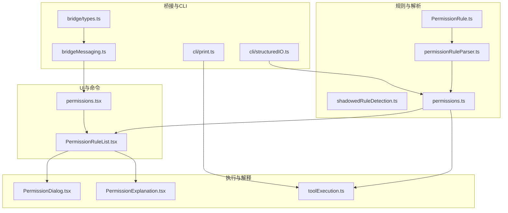
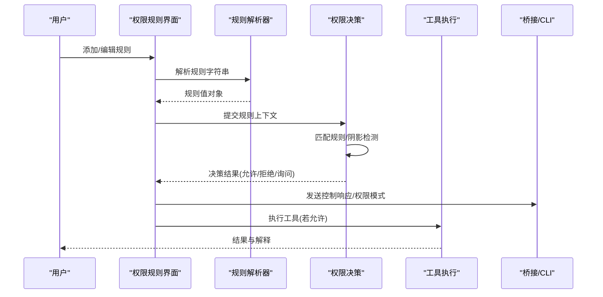
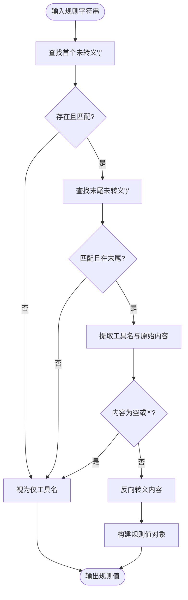
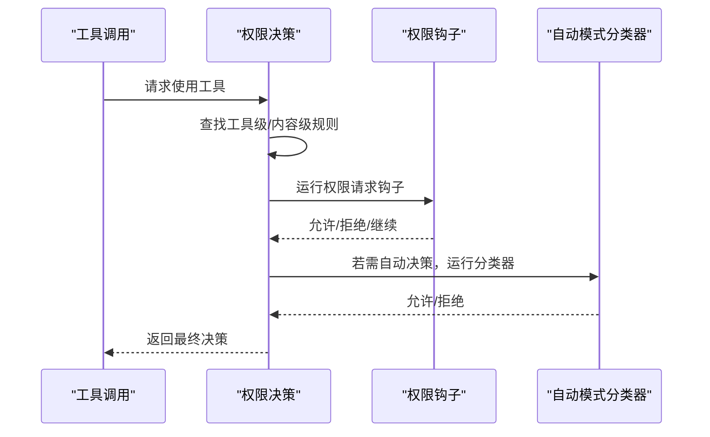
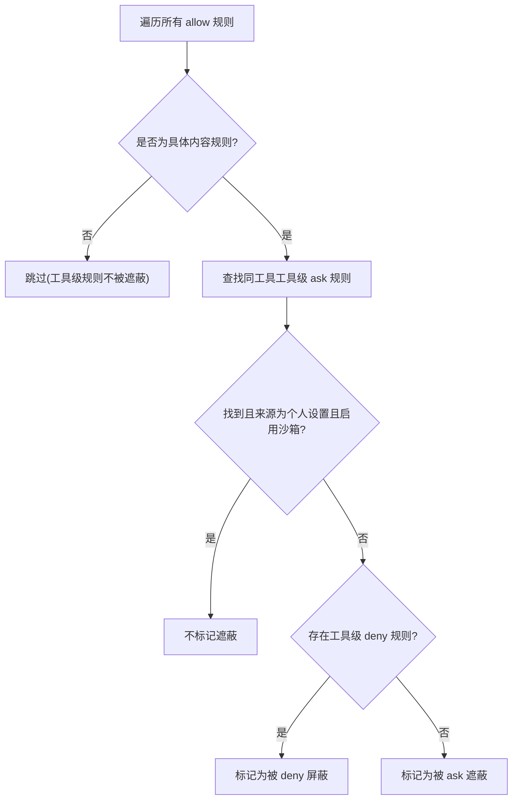
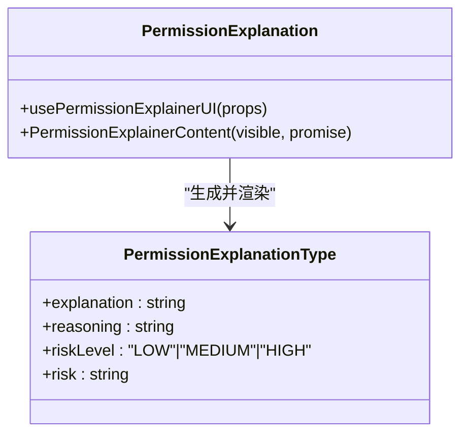
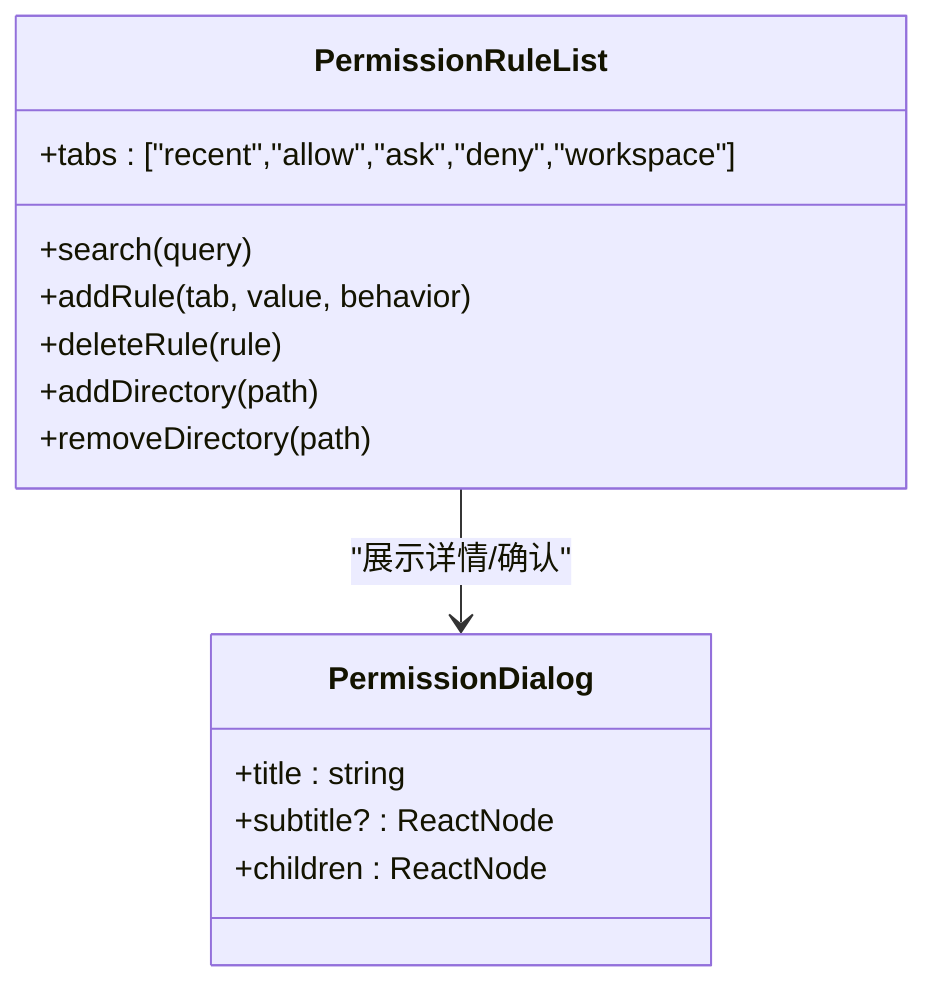
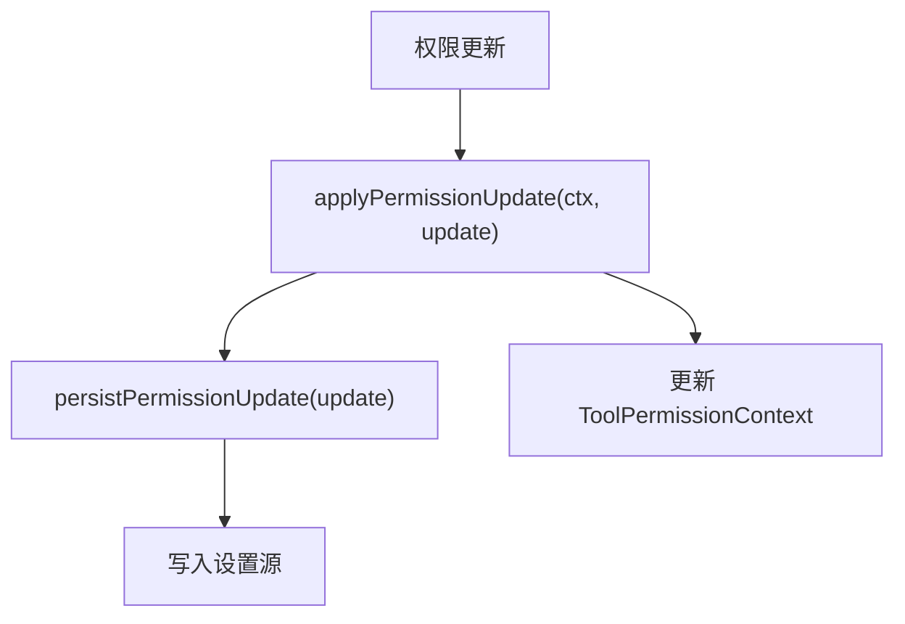
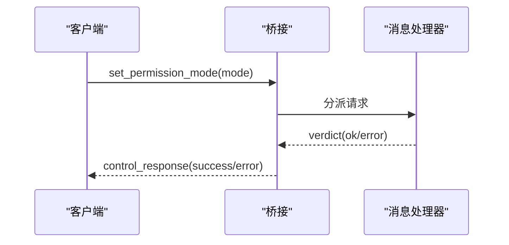
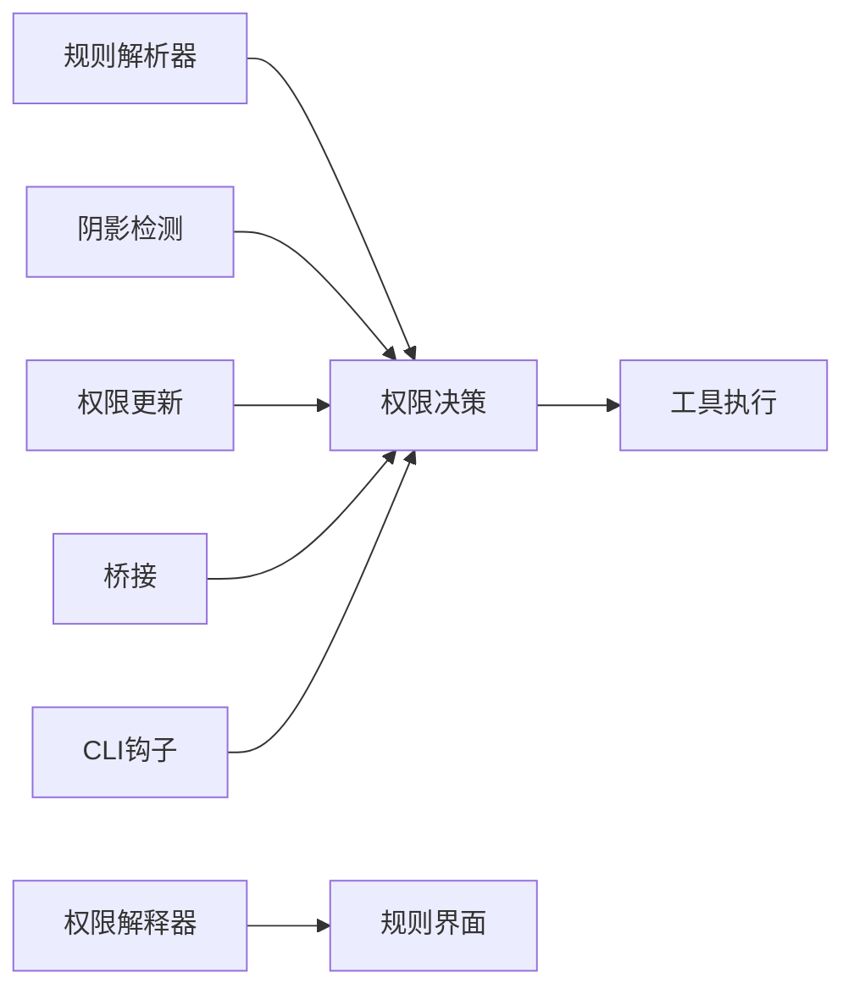

# 工具权限管理

<cite>
**本文档引用的文件**
- [src/utils/permissions/PermissionRule.ts](file://src/utils/permissions/PermissionRule.ts)
- [src/utils/permissions/permissionRuleParser.ts](file://src/utils/permissions/permissionRuleParser.ts)
- [src/utils/permissions/shadowedRuleDetection.ts](file://src/utils/permissions/shadowedRuleDetection.ts)
- [src/utils/permissions/permissions.ts](file://src/utils/permissions/permissions.ts)
- [src/utils/permissions/PermissionResult.ts](file://src/utils/permissions/PermissionResult.ts)
- [src/utils/permissions/PermissionUpdate.ts](file://src/utils/permissions/PermissionUpdate.ts)
- [src/components/permissions/PermissionExplanation.tsx](file://src/components/permissions/PermissionExplanation.tsx)
- [src/components/permissions/PermissionDialog.tsx](file://src/components/permissions/PermissionDialog.tsx)
- [src/components/permissions/rules/PermissionRuleList.tsx](file://src/components/permissions/rules/PermissionRuleList.tsx)
- [src/services/tools/toolExecution.ts](file://src/services/tools/toolExecution.ts)
- [src/commands/permissions/permissions.tsx](file://src/commands/permissions/permissions.tsx)
- [src/main.tsx](file://src/main.tsx)
- [src/bridge/bridgeMessaging.ts](file://src/bridge/bridgeMessaging.ts)
- [src/bridge/types.ts](file://src/bridge/types.ts)
- [src/cli/print.ts](file://src/cli/print.ts)
- [src/cli/structuredIO.ts](file://src/cli/structuredIO.ts)
</cite>

## 目录
1. [简介](#简介)
2. [项目结构](#项目结构)
3. [核心组件](#核心组件)
4. [架构总览](#架构总览)
5. [详细组件分析](#详细组件分析)
6. [依赖关系分析](#依赖关系分析)
7. [性能考虑](#性能考虑)
8. [故障排除指南](#故障排除指南)
9. [结论](#结论)
10. [附录](#附录)

## 简介
本文件系统性阐述工具权限管理机制，涵盖规则解析、匹配算法、阴影规则检测、权限解释器以及各类工具（文件系统、命令执行、网络访问等）的权限配置示例。文档同时提供最佳实践与常见陷阱，帮助开发者与运维人员安全、可控地管理工具权限。

## 项目结构
权限管理相关代码主要分布在以下模块：
- 规则定义与解析：utils/permissions 下的规则类型、解析器、阴影检测与规则加载
- 权限决策与执行：utils/permissions 的权限决策逻辑与工具执行服务
- 用户界面：components/permissions 下的规则列表、解释器、对话框等
- 命令入口与桥接：commands/permissions 与 bridge 层的消息处理
- CLI 集成：CLI 打印与结构化 IO 中的权限钩子与提示

**图表来源**
- [src/utils/permissions/PermissionRule.ts:1-41](file://src/utils/permissions/PermissionRule.ts#L1-L41)
- [src/utils/permissions/permissionRuleParser.ts:1-199](file://src/utils/permissions/permissionRuleParser.ts#L1-L199)
- [src/utils/permissions/shadowedRuleDetection.ts:1-235](file://src/utils/permissions/shadowedRuleDetection.ts#L1-L235)
- [src/utils/permissions/permissions.ts:1-800](file://src/utils/permissions/permissions.ts#L1-L800)
- [src/services/tools/toolExecution.ts:1-800](file://src/services/tools/toolExecution.ts#L1-L800)
- [src/components/permissions/PermissionExplanation.tsx:1-272](file://src/components/permissions/PermissionExplanation.tsx#L1-L272)
- [src/components/permissions/PermissionDialog.tsx:1-72](file://src/components/permissions/PermissionDialog.tsx#L1-L72)
- [src/components/permissions/rules/PermissionRuleList.tsx:1-800](file://src/components/permissions/rules/PermissionRuleList.tsx#L1-L800)
- [src/commands/permissions/permissions.tsx:1-9](file://src/commands/permissions/permissions.tsx#L1-L9)
- [src/bridge/bridgeMessaging.ts:328-371](file://src/bridge/bridgeMessaging.ts#L328-L371)
- [src/bridge/types.ts:117-131](file://src/bridge/types.ts#L117-L131)
- [src/cli/print.ts:4211-5265](file://src/cli/print.ts#L4211-L5265)
- [src/cli/structuredIO.ts:568-859](file://src/cli/structuredIO.ts#L568-L859)

**章节来源**
- [src/utils/permissions/PermissionRule.ts:1-41](file://src/utils/permissions/PermissionRule.ts#L1-L41)
- [src/utils/permissions/permissionRuleParser.ts:1-199](file://src/utils/permissions/permissionRuleParser.ts#L1-L199)
- [src/utils/permissions/shadowedRuleDetection.ts:1-235](file://src/utils/permissions/shadowedRuleDetection.ts#L1-L235)
- [src/utils/permissions/permissions.ts:1-800](file://src/utils/permissions/permissions.ts#L1-L800)
- [src/services/tools/toolExecution.ts:1-800](file://src/services/tools/toolExecution.ts#L1-L800)
- [src/components/permissions/PermissionExplanation.tsx:1-272](file://src/components/permissions/PermissionExplanation.tsx#L1-L272)
- [src/components/permissions/PermissionDialog.tsx:1-72](file://src/components/permissions/PermissionDialog.tsx#L1-L72)
- [src/components/permissions/rules/PermissionRuleList.tsx:1-800](file://src/components/permissions/rules/PermissionRuleList.tsx#L1-L800)
- [src/commands/permissions/permissions.tsx:1-9](file://src/commands/permissions/permissions.tsx#L1-L9)
- [src/bridge/bridgeMessaging.ts:328-371](file://src/bridge/bridgeMessaging.ts#L328-L371)
- [src/bridge/types.ts:117-131](file://src/bridge/types.ts#L117-L131)
- [src/cli/print.ts:4211-5265](file://src/cli/print.ts#L4211-L5265)
- [src/cli/structuredIO.ts:568-859](file://src/cli/structuredIO.ts#L568-L859)

## 核心组件
- 规则模型与解析：定义规则行为（允许/拒绝/询问）、规则值格式与解析/序列化
- 规则匹配与决策：按来源（用户设置、项目设置、会话等）聚合规则，执行匹配并生成决策
- 阴影规则检测：识别不可达规则（被更高优先级规则覆盖）
- 权限更新与持久化：支持添加/替换/移除规则与工作目录
- 权限解释器：为用户提供可读的权限决策解释
- UI 与命令：规则列表、对话框、权限命令入口
- 桥接与 CLI：控制响应、权限模式切换、权限钩子与提示

**章节来源**
- [src/utils/permissions/PermissionRule.ts:1-41](file://src/utils/permissions/PermissionRule.ts#L1-L41)
- [src/utils/permissions/permissionRuleParser.ts:1-199](file://src/utils/permissions/permissionRuleParser.ts#L1-L199)
- [src/utils/permissions/shadowedRuleDetection.ts:1-235](file://src/utils/permissions/shadowedRuleDetection.ts#L1-L235)
- [src/utils/permissions/permissions.ts:1-800](file://src/utils/permissions/permissions.ts#L1-L800)
- [src/utils/permissions/PermissionUpdate.ts:1-390](file://src/utils/permissions/PermissionUpdate.ts#L1-L390)
- [src/components/permissions/PermissionExplanation.tsx:1-272](file://src/components/permissions/PermissionExplanation.tsx#L1-L272)
- [src/components/permissions/rules/PermissionRuleList.tsx:1-800](file://src/components/permissions/rules/PermissionRuleList.tsx#L1-L800)
- [src/bridge/bridgeMessaging.ts:328-371](file://src/bridge/bridgeMessaging.ts#L328-L371)
- [src/cli/structuredIO.ts:568-859](file://src/cli/structuredIO.ts#L568-L859)

## 架构总览
权限管理采用“规则解析—匹配决策—执行与反馈”的分层架构。规则来源包括用户设置、项目设置、会话内存、命令行参数等；决策路径包含交互式提示、自动模式分类器、钩子决策与沙箱覆盖；最终通过 UI 与桥接通道呈现结果。

**图表来源**
- [src/components/permissions/rules/PermissionRuleList.tsx:1-800](file://src/components/permissions/rules/PermissionRuleList.tsx#L1-L800)
- [src/utils/permissions/permissionRuleParser.ts:1-199](file://src/utils/permissions/permissionRuleParser.ts#L1-L199)
- [src/utils/permissions/permissions.ts:1-800](file://src/utils/permissions/permissions.ts#L1-L800)
- [src/services/tools/toolExecution.ts:1-800](file://src/services/tools/toolExecution.ts#L1-L800)
- [src/bridge/bridgeMessaging.ts:328-371](file://src/bridge/bridgeMessaging.ts#L328-L371)

## 详细组件分析

### 规则模型与解析器
- 规则行为：allow/deny/ask
- 规则值：工具名与可选内容（如 Bash(ls:*)），支持转义括号以正确存储与解析
- 解析流程：查找首个未转义左括号与末尾未转义右括号，提取工具名与内容，再进行反向转义
- 序列化：对内容进行转义后拼接为字符串

**图表来源**
- [src/utils/permissions/permissionRuleParser.ts:81-133](file://src/utils/permissions/permissionRuleParser.ts#L81-L133)

**章节来源**
- [src/utils/permissions/PermissionRule.ts:1-41](file://src/utils/permissions/PermissionRule.ts#L1-L41)
- [src/utils/permissions/permissionRuleParser.ts:1-199](file://src/utils/permissions/permissionRuleParser.ts#L1-L199)

### 规则匹配与决策
- 规则来源：用户设置、项目设置、会话、命令行参数等
- 匹配策略：
  - 工具级匹配：规则无内容时匹配整个工具（含 MCP 服务器级）
  - 内容级匹配：规则有内容时按工具名与内容匹配（如 Bash(ls:*)）
- 决策顺序：deny > ask > allow；结合自动模式（auto/dontAsk）、分类器与钩子
- 特殊处理：PowerShell 在 auto 模式下的限制、受保护命名空间检查、沙箱覆盖

**图表来源**
- [src/utils/permissions/permissions.ts:473-800](file://src/utils/permissions/permissions.ts#L473-L800)
- [src/services/tools/toolExecution.ts:599-800](file://src/services/tools/toolExecution.ts#L599-L800)
- [src/cli/structuredIO.ts:568-859](file://src/cli/structuredIO.ts#L568-L859)

**章节来源**
- [src/utils/permissions/permissions.ts:122-302](file://src/utils/permissions/permissions.ts#L122-L302)
- [src/utils/permissions/permissions.ts:473-800](file://src/utils/permissions/permissions.ts#L473-L800)
- [src/services/tools/toolExecution.ts:599-800](file://src/services/tools/toolExecution.ts#L599-L800)
- [src/cli/structuredIO.ts:568-859](file://src/cli/structuredIO.ts#L568-L859)

### 阴影规则检测机制
- 目标：识别不可达规则，避免权限冲突与覆盖
- 检测类型：
  - allow 被 deny 完全屏蔽（更严重）
  - allow 被 ask 规则遮蔽（较温和）
- 特例：Bash 在个人设置来源且启用沙箱自动允许时，ask 不遮蔽 allow
- 输出：原因、遮蔽规则、修复建议

**图表来源**
- [src/utils/permissions/shadowedRuleDetection.ts:111-234](file://src/utils/permissions/shadowedRuleDetection.ts#L111-L234)

**章节来源**
- [src/utils/permissions/shadowedRuleDetection.ts:1-235](file://src/utils/permissions/shadowedRuleDetection.ts#L1-L235)

### 权限解释器
- 功能：在用户按下快捷键时生成解释文本，包含风险等级、理由与风险描述
- 实现：异步生成解释 Promise，React Suspense 渲染加载状态与结果
- 颜色映射：低/中/高风险对应不同颜色标签

**图表来源**
- [src/components/permissions/PermissionExplanation.tsx:1-272](file://src/components/permissions/PermissionExplanation.tsx#L1-L272)

**章节来源**
- [src/components/permissions/PermissionExplanation.tsx:1-272](file://src/components/permissions/PermissionExplanation.tsx#L1-L272)

### 权限规则列表与 UI
- 支持：查看/搜索/添加/删除规则，工作区目录增删
- 交互：键盘绑定、焦点管理、Tab 切换、搜索模式
- 反馈：新增规则成功提示、阴影规则警告

**图表来源**
- [src/components/permissions/rules/PermissionRuleList.tsx:1-800](file://src/components/permissions/rules/PermissionRuleList.tsx#L1-L800)
- [src/components/permissions/PermissionDialog.tsx:1-72](file://src/components/permissions/PermissionDialog.tsx#L1-L72)

**章节来源**
- [src/components/permissions/rules/PermissionRuleList.tsx:1-800](file://src/components/permissions/rules/PermissionRuleList.tsx#L1-L800)
- [src/components/permissions/PermissionDialog.tsx:1-72](file://src/components/permissions/PermissionDialog.tsx#L1-L72)

### 权限更新与持久化
- 支持操作：添加/替换/移除规则、增删工作目录、设置模式
- 持久化目标：用户设置、本地设置、项目设置
- 应用方式：即时应用到上下文并可持久化

**图表来源**
- [src/utils/permissions/PermissionUpdate.ts:55-206](file://src/utils/permissions/PermissionUpdate.ts#L55-L206)
- [src/utils/permissions/PermissionUpdate.ts:222-342](file://src/utils/permissions/PermissionUpdate.ts#L222-L342)

**章节来源**
- [src/utils/permissions/PermissionUpdate.ts:1-390](file://src/utils/permissions/PermissionUpdate.ts#L1-L390)

### 桥接与 CLI 集成
- 控制响应：桥接层接收 set_permission_mode 请求并返回 control_response
- 类型约束：PermissionResponseEvent 定义了成功的 subtype 与响应载荷
- CLI 提示：当权限响应孤儿化时，重新排队执行

**图表来源**
- [src/bridge/bridgeMessaging.ts:328-371](file://src/bridge/bridgeMessaging.ts#L328-L371)
- [src/bridge/types.ts:117-131](file://src/bridge/types.ts#L117-L131)
- [src/cli/print.ts:5235-5265](file://src/cli/print.ts#L5235-L5265)

**章节来源**
- [src/bridge/bridgeMessaging.ts:328-371](file://src/bridge/bridgeMessaging.ts#L328-L371)
- [src/bridge/types.ts:117-131](file://src/bridge/types.ts#L117-L131)
- [src/cli/print.ts:5235-5265](file://src/cli/print.ts#L5235-L5265)

## 依赖关系分析
- 组件耦合：
  - 规则解析器与权限决策紧密耦合，前者提供规则值，后者进行匹配
  - 阴影检测独立于决策，但影响规则有效性
  - 权限解释器与 UI 解耦，通过异步 Promise 渲染
- 外部依赖：
  - 设置源（用户/项目/本地/会话/命令行）
  - 自动模式分类器（可选特性）
  - 沙箱与受保护命名空间检查

**图表来源**
- [src/utils/permissions/permissionRuleParser.ts:1-199](file://src/utils/permissions/permissionRuleParser.ts#L1-L199)
- [src/utils/permissions/permissions.ts:1-800](file://src/utils/permissions/permissions.ts#L1-L800)
- [src/utils/permissions/shadowedRuleDetection.ts:1-235](file://src/utils/permissions/shadowedRuleDetection.ts#L1-L235)
- [src/services/tools/toolExecution.ts:1-800](file://src/services/tools/toolExecution.ts#L1-L800)
- [src/components/permissions/PermissionExplanation.tsx:1-272](file://src/components/permissions/PermissionExplanation.tsx#L1-L272)
- [src/utils/permissions/PermissionUpdate.ts:1-390](file://src/utils/permissions/PermissionUpdate.ts#L1-L390)
- [src/bridge/bridgeMessaging.ts:328-371](file://src/bridge/bridgeMessaging.ts#L328-L371)
- [src/cli/structuredIO.ts:568-859](file://src/cli/structuredIO.ts#L568-L859)

**章节来源**
- [src/utils/permissions/permissions.ts:1-800](file://src/utils/permissions/permissions.ts#L1-L800)
- [src/services/tools/toolExecution.ts:1-800](file://src/services/tools/toolExecution.ts#L1-L800)

## 性能考虑
- 规则解析：使用惰性 Schema 与预计算映射，减少重复解析开销
- 阴影检测：线性扫描 allow 规则并查找对应 ask/deny，复杂度 O(A×(D+A))，可通过缓存规则索引优化
- 自动模式分类器：仅在需要时触发，避免不必要的 API 调用；接受快速路径（如 acceptEdits）与白名单工具
- UI 渲染：解释器采用懒加载 Promise，避免无用渲染

[本节为通用指导，无需特定文件引用]

## 故障排除指南
- 规则孤儿化：当权限响应未按预期到达时，CLI 会尝试重新排队执行
- 阴影规则告警：规则列表会显示被遮蔽的规则及修复建议
- 模式冲突：dontAsk 模式会将 ask 转为 deny；auto 模式下某些工具（如 PowerShell）可能受限
- 沙箱覆盖：在沙箱启用时，部分规则可能被自动允许或要求移除

**章节来源**
- [src/cli/print.ts:5235-5265](file://src/cli/print.ts#L5235-L5265)
- [src/components/permissions/rules/PermissionRuleList.tsx:751-762](file://src/components/permissions/rules/PermissionRuleList.tsx#L751-L762)
- [src/utils/permissions/permissions.ts:503-520](file://src/utils/permissions/permissions.ts#L503-L520)

## 结论
该权限管理体系通过清晰的规则模型、严格的匹配与阴影检测、灵活的解释与 UI、以及桥接与 CLI 的无缝集成，实现了对工具权限的精细化控制。遵循最佳实践与避免常见陷阱，可在保证安全性的同时提升开发效率。

[本节为总结，无需特定文件引用]

## 附录

### 各类工具的权限配置示例
- 文件读写
  - 读取：为 Read 工具添加规则，如针对特定目录的通配模式
  - 写入：为 Write/文件编辑工具添加规则，注意工作目录范围
- 命令执行
  - Bash：使用内容级规则限定命令前缀或参数模式；避免过度宽泛的 Bash(*) 规则
  - PowerShell：在 auto 模式下可能受限，需明确用户交互需求
- 网络访问
  - MCP 工具：通过服务器级规则（如 mcp__server1）授权，或按工具粒度授权
- 代理与桥接
  - set_permission_mode：通过桥接层设置权限模式并返回控制响应

**章节来源**
- [src/utils/permissions/permissionRuleParser.ts:1-199](file://src/utils/permissions/permissionRuleParser.ts#L1-L199)
- [src/utils/permissions/permissions.ts:238-302](file://src/utils/permissions/permissions.ts#L238-L302)
- [src/bridge/bridgeMessaging.ts:328-371](file://src/bridge/bridgeMessaging.ts#L328-L371)

### 最佳实践与常见陷阱
- 最佳实践
  - 使用内容级规则而非工具级通配，最小化权限范围
  - 定期检查阴影规则，清理不可达规则
  - 在 auto 模式下优先使用 acceptEdits 快速路径与安全工具白名单
  - 将敏感规则持久化到合适的设置源（用户/项目/本地）
- 常见陷阱
  - 过度宽泛的 Bash(*) 或 PowerShell(*) 规则导致安全风险
  - ask 规则遮蔽 allow 规则却未意识到
  - 忘记在受保护命名空间或沙箱场景下的特殊限制
  - 忽略自动模式分类器的可用性与成本

[本节为通用指导，无需特定文件引用]