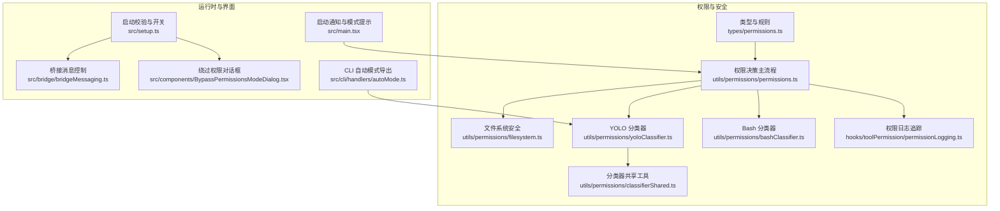
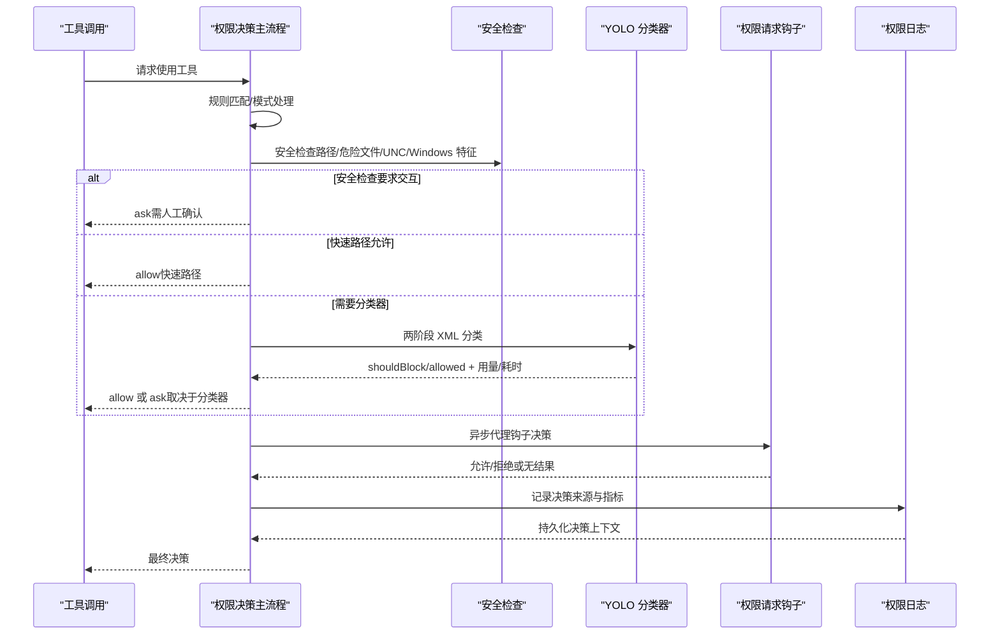
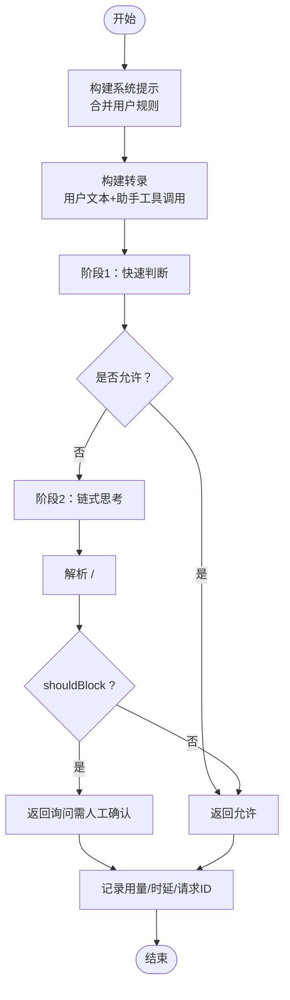
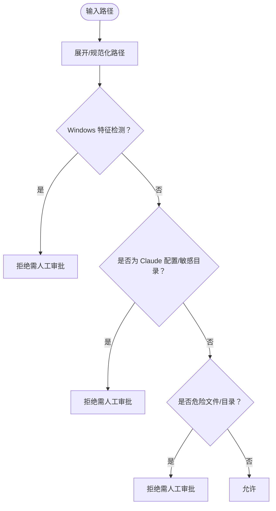
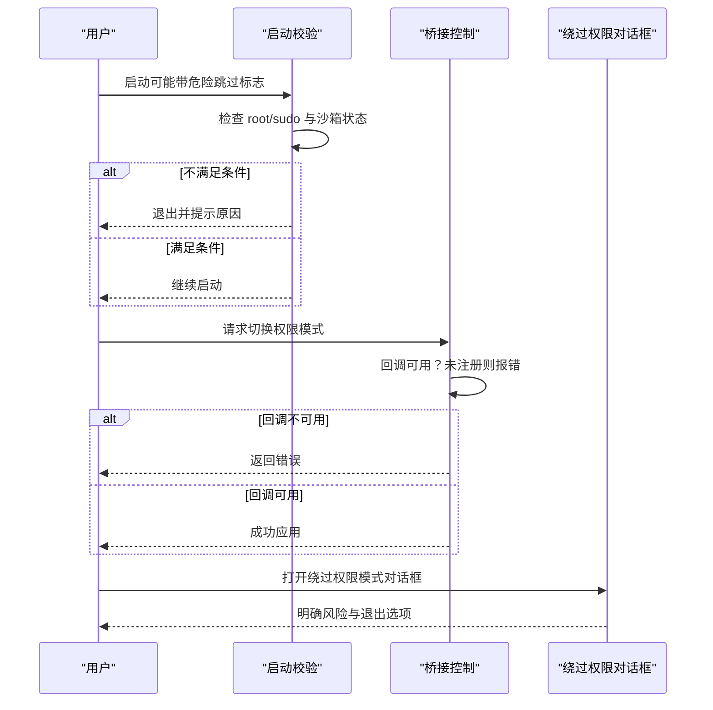
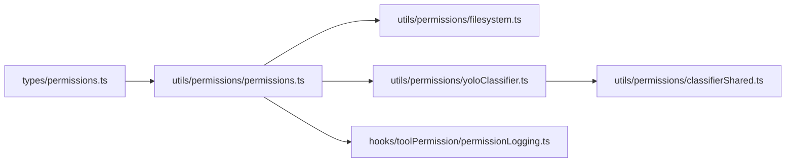

# 安全机制

<cite>
**本文引用的文件**
- [src/utils/permissions/yoloClassifier.ts](file://src/utils/permissions/yoloClassifier.ts)
- [src/utils/permissions/bashClassifier.ts](file://src/utils/permissions/bashClassifier.ts)
- [src/utils/permissions/classifierShared.ts](file://src/utils/permissions/classifierShared.ts)
- [src/utils/permissions/filesystem.ts](file://src/utils/permissions/filesystem.ts)
- [src/utils/permissions/permissions.ts](file://src/utils/permissions/permissions.ts)
- [src/utils/permissions/PermissionResult.ts](file://src/utils/permissions/PermissionResult.ts)
- [src/utils/permissions/PermissionRule.ts](file://src/utils/permissions/PermissionRule.ts)
- [src/utils/permissions/PermissionUpdateSchema.ts](file://src/utils/permissions/PermissionUpdateSchema.ts)
- [src/types/permissions.ts](file://src/types/permissions.ts)
- [src/hooks/toolPermission/permissionLogging.ts](file://src/hooks/toolPermission/permissionLogging.ts)
- [src/setup.ts](file://src/setup.ts)
- [src/bridge/bridgeMessaging.ts](file://src/bridge/bridgeMessaging.ts)
- [src/components/BypassPermissionsModeDialog.tsx](file://src/components/BypassPermissionsModeDialog.tsx)
- [src/cli/handlers/autoMode.ts](file://src/cli/handlers/autoMode.ts)
- [src/main.tsx](file://src/main.tsx)
</cite>

## 目录
1. [简介](#简介)
2. [项目结构](#项目结构)
3. [核心组件](#核心组件)
4. [架构总览](#架构总览)
5. [详细组件分析](#详细组件分析)
6. [依赖关系分析](#依赖关系分析)
7. [性能考量](#性能考量)
8. [故障排查指南](#故障排查指南)
9. [结论](#结论)
10. [附录](#附录)

## 简介
本文件面向安全工程师，系统化梳理代码库中的权限系统与安全机制，重点覆盖：
- 危险模式检测：Bash 分类器与 YOLO 分类器的工作原理与检测算法
- 危险模式识别：模式匹配技术与机器学习方法
- 绕过权限的紧急关闭开关与安全边界设置
- 权限拒绝追踪：决策历史记录与分析
- 安全审计与合规检查方法
- 安全事件响应流程与威胁缓解策略

## 项目结构
围绕权限与安全的关键模块分布如下：
- 权限类型与规则定义：types/permissions.ts
- 权限决策主流程：utils/permissions/permissions.ts
- 文件系统安全与路径校验：utils/permissions/filesystem.ts
- YOLO 自动模式分类器：utils/permissions/yoloClassifier.ts
- Bash 分类器（外部构建禁用）：utils/permissions/bashClassifier.ts
- 分类器共享工具：utils/permissions/classifierShared.ts
- 权限日志与追踪：hooks/toolPermission/permissionLogging.ts
- 紧急关闭开关与环境校验：setup.ts、bridge/bridgeMessaging.ts、components/BypassPermissionsModeDialog.tsx
- CLI 自动模式配置导出：cli/handlers/autoMode.ts
- 启动时通知与模式提示：main.tsx

图表来源
- [src/types/permissions.ts:1-442](file://src/types/permissions.ts#L1-L442)
- [src/utils/permissions/permissions.ts:1-800](file://src/utils/permissions/permissions.ts#L1-L800)
- [src/utils/permissions/filesystem.ts:1-800](file://src/utils/permissions/filesystem.ts#L1-L800)
- [src/utils/permissions/yoloClassifier.ts:1-800](file://src/utils/permissions/yoloClassifier.ts#L1-L800)
- [src/utils/permissions/bashClassifier.ts:1-62](file://src/utils/permissions/bashClassifier.ts#L1-L62)
- [src/utils/permissions/classifierShared.ts:1-40](file://src/utils/permissions/classifierShared.ts#L1-L40)
- [src/hooks/toolPermission/permissionLogging.ts:1-239](file://src/hooks/toolPermission/permissionLogging.ts#L1-L239)
- [src/setup.ts:395-446](file://src/setup.ts#L395-L446)
- [src/bridge/bridgeMessaging.ts:328-371](file://src/bridge/bridgeMessaging.ts#L328-L371)
- [src/components/BypassPermissionsModeDialog.tsx:44-86](file://src/components/BypassPermissionsModeDialog.tsx#L44-L86)
- [src/cli/handlers/autoMode.ts:1-47](file://src/cli/handlers/autoMode.ts#L1-L47)
- [src/main.tsx:2875-2910](file://src/main.tsx#L2875-L2910)

章节来源
- [src/types/permissions.ts:1-442](file://src/types/permissions.ts#L1-L442)
- [src/utils/permissions/permissions.ts:1-800](file://src/utils/permissions/permissions.ts#L1-L800)
- [src/utils/permissions/filesystem.ts:1-800](file://src/utils/permissions/filesystem.ts#L1-L800)
- [src/utils/permissions/yoloClassifier.ts:1-800](file://src/utils/permissions/yoloClassifier.ts#L1-L800)
- [src/utils/permissions/bashClassifier.ts:1-62](file://src/utils/permissions/bashClassifier.ts#L1-L62)
- [src/utils/permissions/classifierShared.ts:1-40](file://src/utils/permissions/classifierShared.ts#L1-L40)
- [src/hooks/toolPermission/permissionLogging.ts:1-239](file://src/hooks/toolPermission/permissionLogging.ts#L1-L239)
- [src/setup.ts:395-446](file://src/setup.ts#L395-L446)
- [src/bridge/bridgeMessaging.ts:328-371](file://src/bridge/bridgeMessaging.ts#L328-L371)
- [src/components/BypassPermissionsModeDialog.tsx:44-86](file://src/components/BypassPermissionsModeDialog.tsx#L44-L86)
- [src/cli/handlers/autoMode.ts:1-47](file://src/cli/handlers/autoMode.ts#L1-L47)
- [src/main.tsx:2875-2910](file://src/main.tsx#L2875-L2910)

## 核心组件
- 权限模式与行为
  - 模式枚举：acceptEdits、bypassPermissions、default、dontAsk、plan、auto（可选）
  - 行为枚举：allow、deny、ask
- 规则与来源
  - 规则来源：用户设置、项目设置、本地设置、策略设置、命令行参数、会话、标志位等
  - 规则值：工具名与可选内容（如 Bash 前缀规则）
- 决策结果与原因
  - 允许、询问、拒绝、透传（passthrough）
  - 决策原因：规则、模式、子命令结果、权限提示工具、钩子、异步代理、沙箱覆盖、分类器、工作目录、安全检查、其他
- 日志与追踪
  - 统一记录批准/拒绝事件，区分来源（用户永久/临时、hook、配置、分类器），并持久化到上下文用于下游分析

章节来源
- [src/types/permissions.ts:15-38](file://src/types/permissions.ts#L15-L38)
- [src/types/permissions.ts:54-79](file://src/types/permissions.ts#L54-L79)
- [src/types/permissions.ts:241-267](file://src/types/permissions.ts#L241-L267)
- [src/types/permissions.ts:271-324](file://src/types/permissions.ts#L271-L324)
- [src/hooks/toolPermission/permissionLogging.ts:181-239](file://src/hooks/toolPermission/permissionLogging.ts#L181-L239)

## 架构总览
权限系统在工具调用前进行多层判定：规则匹配、模式处理、安全检查、分类器评估、钩子与提示工具、最终决定与日志追踪。自动模式下优先尝试快速路径（接受编辑模式、安全工具白名单），否则进入两阶段 XML 分类器。

图表来源
- [src/utils/permissions/permissions.ts:473-800](file://src/utils/permissions/permissions.ts#L473-L800)
- [src/utils/permissions/yoloClassifier.ts:711-800](file://src/utils/permissions/yoloClassifier.ts#L711-L800)
- [src/utils/permissions/filesystem.ts:620-665](file://src/utils/permissions/filesystem.ts#L620-L665)
- [src/hooks/toolPermission/permissionLogging.ts:181-239](file://src/hooks/toolPermission/permissionLogging.ts#L181-L239)

## 详细组件分析

### YOLO 分类器（自动模式安全决策）
- 系统提示构建
  - 基于外部模板或内部模板，注入用户自定义 allow/deny/environment 规则
  - 支持 Bash 提示规则与 PowerShell 指南（按特性开关）
- 转录构建
  - 仅包含用户文本与助手工具调用块，避免模型文本影响分类
  - 工具输入通过 toAutoClassifierInput 投影，异常时回退原始输入
- 两阶段 XML 输出格式
  - 阶段1（快速）：短停止序列，立即返回 yes/no
  - 阶段2（思考）：附加链式思考指令，减少误判
  - 统一系统提示缓存以复用令牌
- 结果解析与统计
  - 解析 <block>/<reason> 标签，剥离思考内容
  - 汇总阶段1/2用量、时延、请求ID、消息ID，支持成本估算与溯源
- 错误诊断与转储
  - API 错误时写入会话级错误提示文件，便于 /share 收集
  - 可选择性转储请求/响应至用户临时目录

图表来源
- [src/utils/permissions/yoloClassifier.ts:484-540](file://src/utils/permissions/yoloClassifier.ts#L484-L540)
- [src/utils/permissions/yoloClassifier.ts:711-800](file://src/utils/permissions/yoloClassifier.ts#L711-L800)
- [src/utils/permissions/yoloClassifier.ts:567-604](file://src/utils/permissions/yoloClassifier.ts#L567-L604)
- [src/utils/permissions/yoloClassifier.ts:648-664](file://src/utils/permissions/yoloClassifier.ts#L648-L664)
- [src/utils/permissions/yoloClassifier.ts:213-250](file://src/utils/permissions/yoloClassifier.ts#L213-L250)

章节来源
- [src/utils/permissions/yoloClassifier.ts:484-540](file://src/utils/permissions/yoloClassifier.ts#L484-L540)
- [src/utils/permissions/yoloClassifier.ts:711-800](file://src/utils/permissions/yoloClassifier.ts#L711-L800)
- [src/utils/permissions/yoloClassifier.ts:567-604](file://src/utils/permissions/yoloClassifier.ts#L567-L604)
- [src/utils/permissions/yoloClassifier.ts:648-664](file://src/utils/permissions/yoloClassifier.ts#L648-L664)
- [src/utils/permissions/yoloClassifier.ts:213-250](file://src/utils/permissions/yoloClassifier.ts#L213-L250)

### Bash 分类器（外部构建禁用）
- 当前外部构建中 Bash 分类器功能被禁用，返回“此功能已禁用”的默认结果
- 保留接口以兼容未来启用场景

章节来源
- [src/utils/permissions/bashClassifier.ts:24-26](file://src/utils/permissions/bashClassifier.ts#L24-L26)
- [src/utils/permissions/bashClassifier.ts:40-53](file://src/utils/permissions/bashClassifier.ts#L40-L53)

### 分类器共享工具
- 提取指定工具的工具使用块
- 解析并验证分类器响应结构，失败时返回空值

章节来源
- [src/utils/permissions/classifierShared.ts:15-39](file://src/utils/permissions/classifierShared.ts#L15-L39)

### 文件系统安全与危险模式检测
- 危险文件与目录
  - .gitconfig、.bashrc、.zshrc、.git、.vscode、.idea、.claude 等
- 路径安全检查
  - 大小写规范化比较，防止大小写绕过
  - Windows 特征检测：ADS、8.3 名称、长路径前缀、尾随点/空格、DOS 设备名、连续三点
  - UNC 路径检测（防御纵深）
  - 符号链接与真实路径双重校验
- Claude 配置文件保护
  - .claude/settings.json、commands/、agents/、skills/ 等路径均需手动授权
- 会话计划与内存目录保护
  - 仅允许当前会话范围内的计划与内存文件

图表来源
- [src/utils/permissions/filesystem.ts:620-665](file://src/utils/permissions/filesystem.ts#L620-L665)
- [src/utils/permissions/filesystem.ts:434-488](file://src/utils/permissions/filesystem.ts#L434-L488)
- [src/utils/permissions/filesystem.ts:537-602](file://src/utils/permissions/filesystem.ts#L537-L602)

章节来源
- [src/utils/permissions/filesystem.ts:620-665](file://src/utils/permissions/filesystem.ts#L620-L665)
- [src/utils/permissions/filesystem.ts:434-488](file://src/utils/permissions/filesystem.ts#L434-L488)
- [src/utils/permissions/filesystem.ts:537-602](file://src/utils/permissions/filesystem.ts#L537-L602)

### 权限决策主流程与自动模式
- 快速路径
  - 接受编辑模式：在工作目录内安全文件编辑直接放行
  - 安全工具白名单：跳过分类器，降低开销
- 自动模式
  - 若非交互上下文且安全检查可由分类器评估，则自动决策
  - PowerShell 在特定特性开关下才进入分类器
- 拒绝追踪
  - 连续拒绝计数与累计拒绝计数，成功使用重置连续拒绝
- 模式转换
  - dontAsk 模式将 ask 转为 deny
  - auto/plan 模式下优先分类器

章节来源
- [src/utils/permissions/permissions.ts:473-800](file://src/utils/permissions/permissions.ts#L473-L800)
- [src/utils/permissions/permissions.ts:520-591](file://src/utils/permissions/permissions.ts#L520-L591)
- [src/utils/permissions/permissions.ts:593-686](file://src/utils/permissions/permissions.ts#L593-L686)

### 权限日志与追踪
- 事件分类
  - 批准：来自配置、分类器、用户（永久/临时）、hook
  - 拒绝：来自配置、用户拒绝、hook
- 指标与元数据
  - 工具名称、等待时间、沙箱状态、语言（针对代码编辑工具）
  - 决策来源字符串映射（分类器、hook、用户、配置）
- 决策持久化
  - 将决策写入工具使用上下文，供后续组件查询

章节来源
- [src/hooks/toolPermission/permissionLogging.ts:107-176](file://src/hooks/toolPermission/permissionLogging.ts#L107-L176)
- [src/hooks/toolPermission/permissionLogging.ts:181-239](file://src/hooks/toolPermission/permissionLogging.ts#L181-L239)

### 绕过权限的紧急关闭开关与安全边界
- 启动校验
  - 禁止 root/sudo 在非沙箱环境中使用危险跳过权限
  - Ant 用户在非容器/无互联网访问的沙箱中才允许
- 桥接控制
  - set_permission_mode 控制仅在注册回调的上下文中生效，未注册则报错
- 对话框提示
  - 绕过权限模式对话框明确风险与责任，并提供退出选项

图表来源
- [src/setup.ts:395-446](file://src/setup.ts#L395-L446)
- [src/bridge/bridgeMessaging.ts:328-371](file://src/bridge/bridgeMessaging.ts#L328-L371)
- [src/components/BypassPermissionsModeDialog.tsx:44-86](file://src/components/BypassPermissionsModeDialog.tsx#L44-L86)

章节来源
- [src/setup.ts:395-446](file://src/setup.ts#L395-L446)
- [src/bridge/bridgeMessaging.ts:328-371](file://src/bridge/bridgeMessaging.ts#L328-L371)
- [src/components/BypassPermissionsModeDialog.tsx:44-86](file://src/components/BypassPermissionsModeDialog.tsx#L44-L86)

### CLI 自动模式配置导出
- 导出默认外部规则、有效配置（用户设置覆盖外部默认）
- 便于审计与合规检查

章节来源
- [src/cli/handlers/autoMode.ts:24-47](file://src/cli/handlers/autoMode.ts#L24-L47)

### 启动通知与模式提示
- 启动时根据权限模式与环境生成高优通知（如过度宽松的 Bash 规则被忽略）

章节来源
- [src/main.tsx:2875-2910](file://src/main.tsx#L2875-L2910)

## 依赖关系分析
- 类型与规则
  - types/permissions.ts 为所有权限相关实现提供纯类型定义，避免循环导入
- 决策主流程
  - permissions.ts 依赖规则加载、钩子执行、分类器、文件系统安全、日志模块
- 分类器
  - yoloClassifier.ts 依赖系统提示构建、转录构建、XML 输出格式、用量统计、错误转储
- 文件系统安全
  - filesystem.ts 依赖路径工具、平台信息、设置根路径、计划/内存目录等

图表来源
- [src/types/permissions.ts:1-442](file://src/types/permissions.ts#L1-L442)
- [src/utils/permissions/permissions.ts:1-800](file://src/utils/permissions/permissions.ts#L1-L800)
- [src/utils/permissions/filesystem.ts:1-800](file://src/utils/permissions/filesystem.ts#L1-L800)
- [src/utils/permissions/yoloClassifier.ts:1-800](file://src/utils/permissions/yoloClassifier.ts#L1-L800)
- [src/utils/permissions/classifierShared.ts:1-40](file://src/utils/permissions/classifierShared.ts#L1-L40)
- [src/hooks/toolPermission/permissionLogging.ts:1-239](file://src/hooks/toolPermission/permissionLogging.ts#L1-L239)

章节来源
- [src/types/permissions.ts:1-442](file://src/types/permissions.ts#L1-L442)
- [src/utils/permissions/permissions.ts:1-800](file://src/utils/permissions/permissions.ts#L1-L800)
- [src/utils/permissions/filesystem.ts:1-800](file://src/utils/permissions/filesystem.ts#L1-L800)
- [src/utils/permissions/yoloClassifier.ts:1-800](file://src/utils/permissions/yoloClassifier.ts#L1-L800)
- [src/utils/permissions/classifierShared.ts:1-40](file://src/utils/permissions/classifierShared.ts#L1-L40)
- [src/hooks/toolPermission/permissionLogging.ts:1-239](file://src/hooks/toolPermission/permissionLogging.ts#L1-L239)

## 性能考量
- 两阶段分类器
  - 阶段1短停止序列快速拒绝对高风险动作，阶段2仅在必要时开启，平衡准确率与延迟
- 提示缓存
  - 系统提示与 CLAUDE.md 前缀使用缓存控制，减少重复令牌消耗
- 快速路径
  - 接受编辑模式与安全工具白名单显著降低分类器调用频率
- 用量与成本
  - 分类器用量、时延、请求ID、消息ID与成本估算纳入日志，便于开销分析

[本节为通用性能讨论，不直接分析具体文件]

## 故障排查指南
- 分类器错误诊断
  - API 错误时自动转储提示与上下文对比，定位投影偏差与令牌差异
  - 可通过会话级错误文件收集与 /share 功能上报
- 拒绝追踪
  - 连续拒绝计数与累计拒绝计数帮助识别异常模式，成功使用可重置连续拒绝
- 安全检查失败
  - Windows 特征、UNC 路径、危险文件/目录、符号链接绕过等均会触发人工审批
- 紧急关闭开关
  - 启动校验失败或桥接控制失败时，确保不会在不安全环境下启用绕过权限模式

章节来源
- [src/utils/permissions/yoloClassifier.ts:213-250](file://src/utils/permissions/yoloClassifier.ts#L213-L250)
- [src/utils/permissions/permissions.ts:486-501](file://src/utils/permissions/permissions.ts#L486-L501)
- [src/utils/permissions/filesystem.ts:537-602](file://src/utils/permissions/filesystem.ts#L537-L602)
- [src/setup.ts:395-446](file://src/setup.ts#L395-L446)
- [src/bridge/bridgeMessaging.ts:328-371](file://src/bridge/bridgeMessaging.ts#L328-L371)

## 结论
该权限系统通过“规则 + 模式 + 安全检查 + 分类器 + 钩子 + 日志”的多层防护，结合自动模式下的快速路径与两阶段分类器，在保证安全性的同时兼顾效率。紧急关闭开关与启动校验确保在不安全环境无法启用绕过权限模式；权限拒绝追踪与日志系统为审计与合规提供了完整证据链。

[本节为总结性内容，不直接分析具体文件]

## 附录
- 安全审计清单
  - 审核权限模式与规则来源（用户/项目/本地/策略/会话/命令行）
  - 检查自动模式导出规则与实际生效配置
  - 核对分类器用量与成本指标，识别异常峰值
  - 审阅拒绝追踪统计，关注连续拒绝与异常工具
- 合规检查要点
  - 确认危险文件/目录保护策略未被绕过
  - 校验 Windows 特征检测与 UNC 路径拦截
  - 确保绕过权限模式仅在受控沙箱中启用
- 威胁缓解策略
  - 限制 root/sudo 使用危险跳过权限
  - 严格沙箱与网络隔离
  - 强化分类器输出格式与解析健壮性
  - 增强日志与遥测，支持事后溯源

[本节为通用指导，不直接分析具体文件]