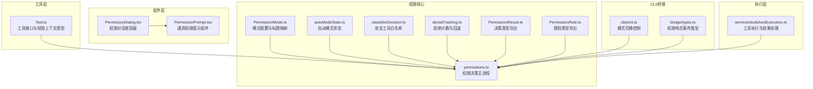
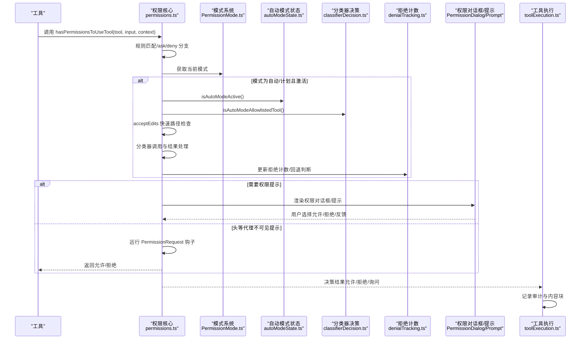
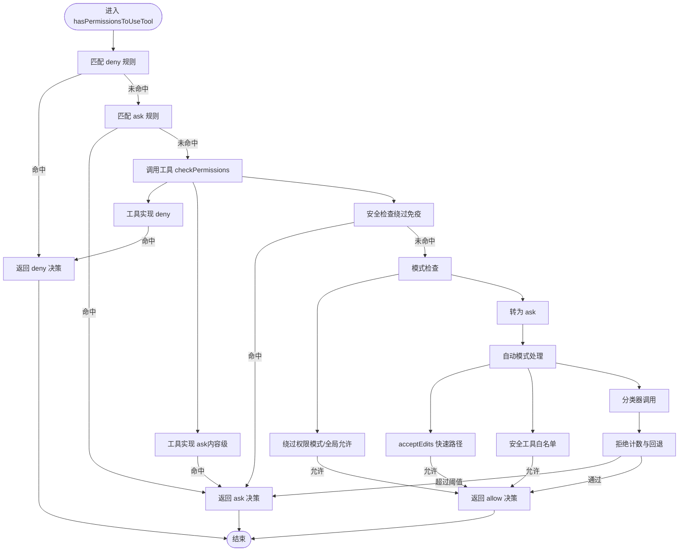
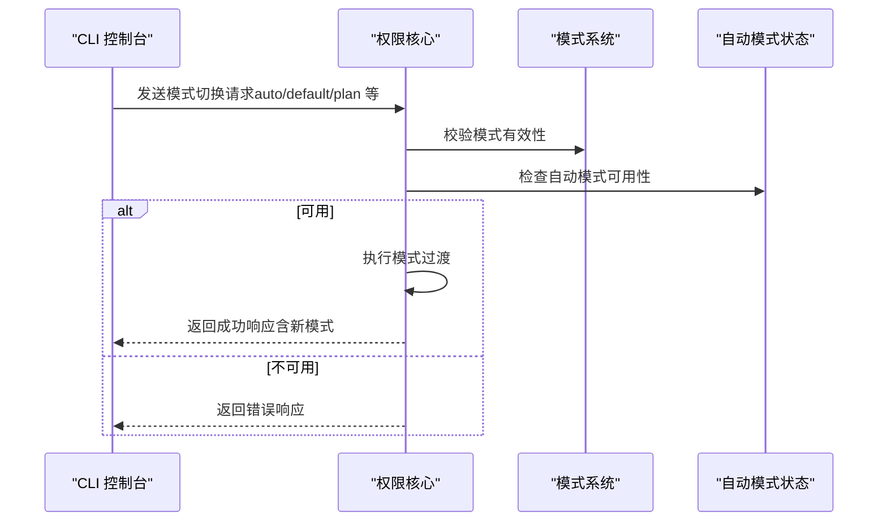
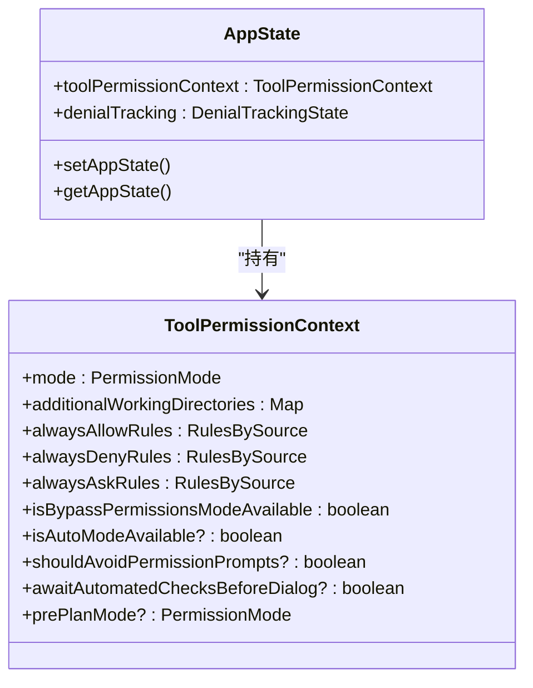
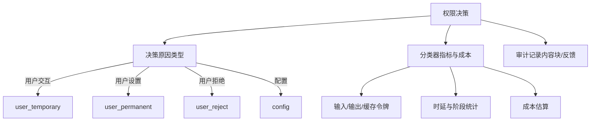
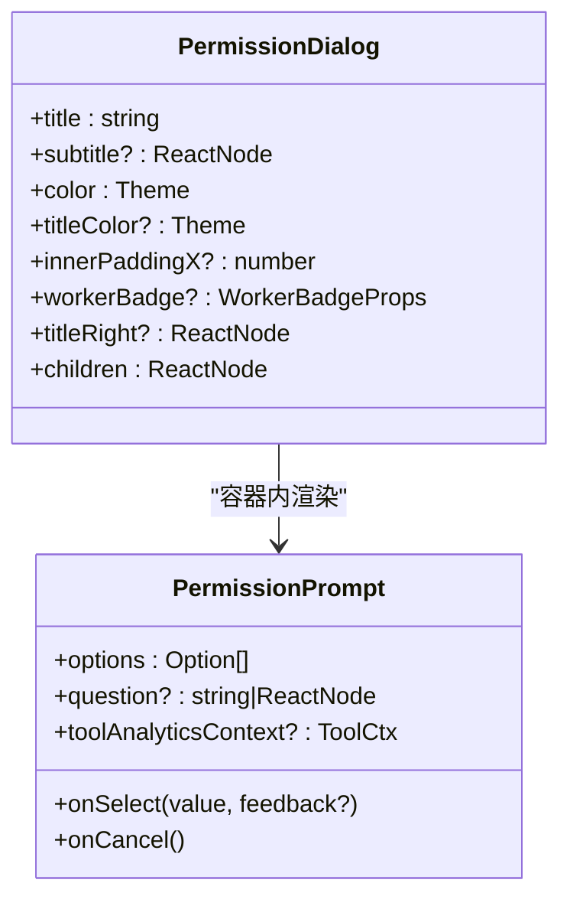
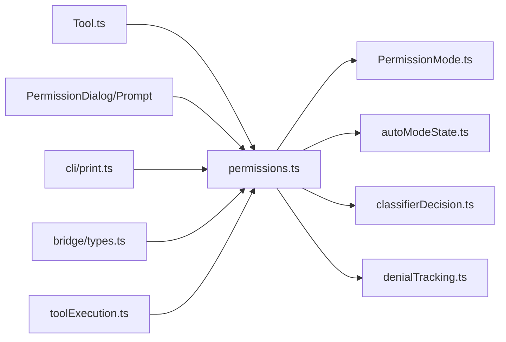

# 权限工作流程

<cite>
**本文档引用的文件**
- [src/utils/permissions/permissions.ts](file://src/utils/permissions/permissions.ts)
- [src/utils/permissions/PermissionMode.ts](file://src/utils/permissions/PermissionMode.ts)
- [src/utils/permissions/autoModeState.ts](file://src/utils/permissions/autoModeState.ts)
- [src/utils/permissions/classifierDecision.ts](file://src/utils/permissions/classifierDecision.ts)
- [src/utils/permissions/denialTracking.ts](file://src/utils/permissions/denialTracking.ts)
- [src/utils/permissions/PermissionResult.ts](file://src/utils/permissions/PermissionResult.ts)
- [src/utils/permissions/PermissionRule.ts](file://src/utils/permissions/PermissionRule.ts)
- [src/components/permissions/PermissionDialog.tsx](file://src/components/permissions/PermissionDialog.tsx)
- [src/components/permissions/PermissionPrompt.tsx](file://src/components/permissions/PermissionPrompt.tsx)
- [src/Tool.ts](file://src/Tool.ts)
- [src/cli/print.ts](file://src/cli/print.ts)
- [src/services/tools/toolExecution.ts](file://src/services/tools/toolExecution.ts)
- [src/bridge/types.ts](file://src/bridge/types.ts)
</cite>

## 目录
1. [简介](#简介)
2. [项目结构](#项目结构)
3. [核心组件](#核心组件)
4. [架构总览](#架构总览)
5. [详细组件分析](#详细组件分析)
6. [依赖关系分析](#依赖关系分析)
7. [性能考虑](#性能考虑)
8. [故障排除指南](#故障排除指南)
9. [结论](#结论)
10. [附录](#附录)

## 简介
本文件系统性梳理了代码库中的权限工作流程，覆盖从权限请求到最终决策的完整过程，包括权限模式切换机制、自动模式状态管理、权限上下文（PermissionContext）的职责与生命周期、权限日志与审计追踪、可视化时序图与流程图，以及调试方法与性能监控指标。目标是帮助开发者快速理解并正确集成与扩展权限体系。

## 项目结构
权限相关代码主要分布在以下模块：
- 工具层：工具接口定义与权限上下文类型
- 权限核心：规则解析、决策逻辑、自动模式与分类器、拒绝计数与回退策略
- 组件层：权限对话框与提示组件
- CLI/桥接：模式切换控制与事件响应
- 执行层：工具执行时对权限决策的使用与结果处理

**图表来源**
- [src/Tool.ts:123-148](file://src/Tool.ts#L123-L148)
- [src/utils/permissions/permissions.ts:473-1318](file://src/utils/permissions/permissions.ts#L473-L1318)
- [src/utils/permissions/PermissionMode.ts:42-142](file://src/utils/permissions/PermissionMode.ts#L42-L142)
- [src/utils/permissions/autoModeState.ts:1-40](file://src/utils/permissions/autoModeState.ts#L1-L40)
- [src/utils/permissions/classifierDecision.ts:56-99](file://src/utils/permissions/classifierDecision.ts#L56-L99)
- [src/utils/permissions/denialTracking.ts:7-46](file://src/utils/permissions/denialTracking.ts#L7-L46)
- [src/components/permissions/PermissionDialog.tsx:1-72](file://src/components/permissions/PermissionDialog.tsx#L1-L72)
- [src/components/permissions/PermissionPrompt.tsx:1-336](file://src/components/permissions/PermissionPrompt.tsx#L1-L336)
- [src/cli/print.ts:4602-4642](file://src/cli/print.ts#L4602-L4642)
- [src/services/tools/toolExecution.ts:173-231](file://src/services/tools/toolExecution.ts#L173-L231)
- [src/bridge/types.ts:124-131](file://src/bridge/types.ts#L124-L131)

**章节来源**
- [src/Tool.ts:123-148](file://src/Tool.ts#L123-L148)
- [src/utils/permissions/permissions.ts:473-1318](file://src/utils/permissions/permissions.ts#L473-L1318)
- [src/utils/permissions/PermissionMode.ts:42-142](file://src/utils/permissions/PermissionMode.ts#L42-L142)
- [src/utils/permissions/autoModeState.ts:1-40](file://src/utils/permissions/autoModeState.ts#L1-L40)
- [src/utils/permissions/classifierDecision.ts:56-99](file://src/utils/permissions/classifierDecision.ts#L56-L99)
- [src/utils/permissions/denialTracking.ts:7-46](file://src/utils/permissions/denialTracking.ts#L7-L46)
- [src/components/permissions/PermissionDialog.tsx:1-72](file://src/components/permissions/PermissionDialog.tsx#L1-L72)
- [src/components/permissions/PermissionPrompt.tsx:1-336](file://src/components/permissions/PermissionPrompt.tsx#L1-L336)
- [src/cli/print.ts:4602-4642](file://src/cli/print.ts#L4602-L4642)
- [src/services/tools/toolExecution.ts:173-231](file://src/services/tools/toolExecution.ts#L173-L231)
- [src/bridge/types.ts:124-131](file://src/bridge/types.ts#L124-L131)

## 核心组件
- 权限决策主流程：负责规则匹配、模式转换、自动模式分类器、拒绝计数与回退、钩子与头等代理的处理、最终生成允许/拒绝/询问决策。
- 权限模式系统：定义默认、计划、接受编辑、绕过权限、不询问、自动等模式，并提供外部模式映射与标题显示。
- 自动模式状态：维护自动模式的激活状态、命令行标志、电路断开状态，支持条件加载与测试重置。
- 安全工具白名单：在自动模式下跳过分类器调用的安全工具集合。
- 拒绝计数与回退：跟踪连续与累计拒绝次数，在阈值触发后回退到人工确认。
- 权限上下文（ToolPermissionContext）：承载当前权限模式、工作目录、规则集、可用模式开关、是否避免权限提示等运行期状态。
- 权限对话框与提示组件：提供统一的权限对话框容器与可选反馈输入的通用提示组件。
- CLI/桥接：模式切换控制与权限响应事件类型定义。

**章节来源**
- [src/utils/permissions/permissions.ts:473-1318](file://src/utils/permissions/permissions.ts#L473-L1318)
- [src/utils/permissions/PermissionMode.ts:42-142](file://src/utils/permissions/PermissionMode.ts#L42-L142)
- [src/utils/permissions/autoModeState.ts:1-40](file://src/utils/permissions/autoModeState.ts#L1-L40)
- [src/utils/permissions/classifierDecision.ts:56-99](file://src/utils/permissions/classifierDecision.ts#L56-L99)
- [src/utils/permissions/denialTracking.ts:7-46](file://src/utils/permissions/denialTracking.ts#L7-L46)
- [src/Tool.ts:123-148](file://src/Tool.ts#L123-L148)
- [src/components/permissions/PermissionDialog.tsx:1-72](file://src/components/permissions/PermissionDialog.tsx#L1-L72)
- [src/components/permissions/PermissionPrompt.tsx:1-336](file://src/components/permissions/PermissionPrompt.tsx#L1-L336)
- [src/cli/print.ts:4602-4642](file://src/cli/print.ts#L4602-L4642)
- [src/bridge/types.ts:124-131](file://src/bridge/types.ts#L124-L131)

## 架构总览
权限工作流从工具调用开始，经过规则匹配、模式转换、自动模式分类器、拒绝计数与回退、钩子与头等代理处理，最终生成决策并驱动工具执行或弹出权限对话框。

**图表来源**
- [src/utils/permissions/permissions.ts:473-1318](file://src/utils/permissions/permissions.ts#L473-L1318)
- [src/utils/permissions/PermissionMode.ts:42-142](file://src/utils/permissions/PermissionMode.ts#L42-L142)
- [src/utils/permissions/autoModeState.ts:15-17](file://src/utils/permissions/autoModeState.ts#L15-L17)
- [src/utils/permissions/classifierDecision.ts:96-99](file://src/utils/permissions/classifierDecision.ts#L96-L99)
- [src/utils/permissions/denialTracking.ts:24-45](file://src/utils/permissions/denialTracking.ts#L24-L45)
- [src/components/permissions/PermissionDialog.tsx:1-72](file://src/components/permissions/PermissionDialog.tsx#L1-L72)
- [src/components/permissions/PermissionPrompt.tsx:1-336](file://src/components/permissions/PermissionPrompt.tsx#L1-L336)
- [src/services/tools/toolExecution.ts:1403-1438](file://src/services/tools/toolExecution.ts#L1403-L1438)

## 详细组件分析

### 权限决策主流程（hasPermissionsToUseTool）
- 规则阶段：匹配 deny/ask 规则，工具级 deny/ask，工具实现检查，内容级 ask 规则，安全检查。
- 模式阶段：绕过权限模式、全局允许规则、行为转换（如 dontAsk 将 ask 转为 deny）。
- 自动模式阶段：acceptEdits 快速路径、安全工具白名单、分类器调用、拒绝计数与回退、headless 代理钩子。
- 结果阶段：生成允许/拒绝/询问决策，携带决策原因与更新后的输入。

**图表来源**
- [src/utils/permissions/permissions.ts:1158-1318](file://src/utils/permissions/permissions.ts#L1158-L1318)
- [src/utils/permissions/permissions.ts:518-927](file://src/utils/permissions/permissions.ts#L518-L927)
- [src/utils/permissions/classifierDecision.ts:96-99](file://src/utils/permissions/classifierDecision.ts#L96-L99)
- [src/utils/permissions/denialTracking.ts:24-45](file://src/utils/permissions/denialTracking.ts#L24-L45)

**章节来源**
- [src/utils/permissions/permissions.ts:473-1318](file://src/utils/permissions/permissions.ts#L473-L1318)

### 权限模式切换机制与自动模式状态管理
- 模式定义与标题映射：提供默认、计划、接受编辑、绕过权限、不询问、自动等模式，支持外部模式映射与颜色配置。
- 模式切换控制：CLI 层接收模式切换请求，进行自动模式可用性检查，成功后通过过渡函数更新上下文并返回新模式。
- 自动模式状态：维护激活状态、命令行标志、电路断开状态，支持条件加载与测试重置。

**图表来源**
- [src/cli/print.ts:4602-4642](file://src/cli/print.ts#L4602-L4642)
- [src/utils/permissions/PermissionMode.ts:42-142](file://src/utils/permissions/PermissionMode.ts#L42-L142)
- [src/utils/permissions/autoModeState.ts:19-33](file://src/utils/permissions/autoModeState.ts#L19-L33)

**章节来源**
- [src/cli/print.ts:4602-4642](file://src/cli/print.ts#L4602-L4642)
- [src/utils/permissions/PermissionMode.ts:42-142](file://src/utils/permissions/PermissionMode.ts#L42-L142)
- [src/utils/permissions/autoModeState.ts:1-40](file://src/utils/permissions/autoModeState.ts#L1-L40)

### 权限上下文（ToolPermissionContext）与生命周期
- 上下文组成：包含当前模式、额外工作目录、全局允许/拒绝/询问规则集、绕过权限可用性、自动模式可用性、是否避免权限提示、是否等待自动化检查等。
- 生命周期：由应用状态管理器持有，随会话/任务更新；在工具执行前构建，决策后可能被持久化或更新。

**图表来源**
- [src/Tool.ts:123-148](file://src/Tool.ts#L123-L148)

**章节来源**
- [src/Tool.ts:123-148](file://src/Tool.ts#L123-L148)

### 权限日志记录与审计追踪
- 决策原因到 OTel 源标签映射：区分用户临时授权、永久授权、用户拒绝、配置来源等，用于审计与分析。
- 分类器决策事件：记录自动模式决策、模型、令牌用量、阶段信息、成本估算、超时与缓存统计。
- 工具执行结果：在允许决策中收集工具结果与用户反馈内容块，便于后续审计。

**图表来源**
- [src/services/tools/toolExecution.ts:173-231](file://src/services/tools/toolExecution.ts#L173-L231)
- [src/utils/permissions/permissions.ts:725-812](file://src/utils/permissions/permissions.ts#L725-L812)
- [src/services/tools/toolExecution.ts:1403-1438](file://src/services/tools/toolExecution.ts#L1403-L1438)

**章节来源**
- [src/services/tools/toolExecution.ts:173-231](file://src/services/tools/toolExecution.ts#L173-L231)
- [src/utils/permissions/permissions.ts:725-812](file://src/utils/permissions/permissions.ts#L725-L812)
- [src/services/tools/toolExecution.ts:1403-1438](file://src/services/tools/toolExecution.ts#L1403-L1438)

### 权限对话框与提示组件
- 权限对话框：提供标题、副标题、颜色与边框样式，作为权限提示的容器。
- 通用权限提示：支持选项列表、键盘绑定、可选反馈输入（接受/拒绝）、Tab 展开输入模式、Esc 取消、Esc 计数审计。

**图表来源**
- [src/components/permissions/PermissionDialog.tsx:1-72](file://src/components/permissions/PermissionDialog.tsx#L1-L72)
- [src/components/permissions/PermissionPrompt.tsx:1-336](file://src/components/permissions/PermissionPrompt.tsx#L1-L336)

**章节来源**
- [src/components/permissions/PermissionDialog.tsx:1-72](file://src/components/permissions/PermissionDialog.tsx#L1-L72)
- [src/components/permissions/PermissionPrompt.tsx:1-336](file://src/components/permissions/PermissionPrompt.tsx#L1-L336)

## 依赖关系分析
- 工具层依赖权限核心：工具通过 Tool 接口与权限上下文交互，权限核心提供决策能力。
- 权限核心依赖模式系统与自动模式状态：用于模式判断与自动模式启用条件。
- 权限核心依赖分类器决策与拒绝计数：用于自动模式下的快速路径与回退策略。
- 组件层依赖权限核心：对话框与提示组件消费决策结果并呈现给用户。
- CLI/桥接依赖权限核心：控制模式切换与响应事件类型。

**图表来源**
- [src/Tool.ts:123-148](file://src/Tool.ts#L123-L148)
- [src/utils/permissions/permissions.ts:473-1318](file://src/utils/permissions/permissions.ts#L473-L1318)
- [src/utils/permissions/PermissionMode.ts:42-142](file://src/utils/permissions/PermissionMode.ts#L42-L142)
- [src/utils/permissions/autoModeState.ts:1-40](file://src/utils/permissions/autoModeState.ts#L1-L40)
- [src/utils/permissions/classifierDecision.ts:56-99](file://src/utils/permissions/classifierDecision.ts#L56-L99)
- [src/utils/permissions/denialTracking.ts:7-46](file://src/utils/permissions/denialTracking.ts#L7-L46)
- [src/components/permissions/PermissionDialog.tsx:1-72](file://src/components/permissions/PermissionDialog.tsx#L1-L72)
- [src/components/permissions/PermissionPrompt.tsx:1-336](file://src/components/permissions/PermissionPrompt.tsx#L1-L336)
- [src/cli/print.ts:4602-4642](file://src/cli/print.ts#L4602-L4642)
- [src/bridge/types.ts:124-131](file://src/bridge/types.ts#L124-L131)
- [src/services/tools/toolExecution.ts:1403-1438](file://src/services/tools/toolExecution.ts#L1403-L1438)

**章节来源**
- [src/utils/permissions/permissions.ts:473-1318](file://src/utils/permissions/permissions.ts#L473-L1318)

## 性能考虑
- 自动模式快速路径：acceptEdits 快速路径与安全工具白名单减少分类器调用，显著降低延迟与成本。
- 拒绝计数与回退：在连续/累计拒绝达到阈值时回退到人工确认，避免无意义的分类器调用。
- 分类器指标：记录输入/输出/缓存令牌、时延、阶段统计与成本估算，便于性能分析与优化。
- 令牌与成本计算：基于分类器用量与模型计算成本，辅助资源控制与预算分析。

**章节来源**
- [src/utils/permissions/permissions.ts:619-812](file://src/utils/permissions/permissions.ts#L619-L812)
- [src/utils/permissions/denialTracking.ts:12-45](file://src/utils/permissions/denialTracking.ts#L12-L45)
- [src/services/tools/toolExecution.ts:173-231](file://src/services/tools/toolExecution.ts#L173-L231)

## 故障排除指南
- 自动模式不可用：检查分类器门禁与状态，若不可用则返回错误消息并保持当前模式。
- 分类器不可用（失败关闭）：根据门禁配置决定“失败关闭”（拒绝并重试引导）或“失败开放”（回退到正常权限处理）。
- 分类器上下文过长：回退到人工确认并提示用户审查转录。
- 拒绝阈值触发：记录事件并提示用户审查转录，必要时重置计数。
- 头等代理不可见提示：优先运行 PermissionRequest 钩子，若无决策则自动拒绝并记录中断原因。

**章节来源**
- [src/utils/permissions/permissions.ts:818-1058](file://src/utils/permissions/permissions.ts#L818-L1058)
- [src/utils/permissions/denialTracking.ts:40-45](file://src/utils/permissions/denialTracking.ts#L40-L45)

## 结论
该权限工作流以规则为核心，结合模式切换与自动模式分类器，实现了灵活而安全的权限控制。通过拒绝计数与回退策略、审计追踪与性能指标，系统在保障安全的同时兼顾效率与可观测性。开发者可据此集成新的工具权限检查、扩展规则来源与决策逻辑，并利用现有组件与指标进行调试与优化。

## 附录
- 集成要点
  - 在工具实现中调用 checkPermissions 并遵循返回的决策结果。
  - 使用 ToolPermissionContext 传递权限状态，确保跨组件一致性。
  - 对于需要自动化处理的场景，优先采用 acceptEdits 快速路径与安全工具白名单。
  - 记录并上报分类器指标与成本，以便持续优化性能与预算。
- 调试建议
  - 启用权限决策日志与分类器耗时统计，定位瓶颈。
  - 使用拒绝计数事件与回退提示，验证阈值设置的合理性。
  - 在头等代理场景下，确保 PermissionRequest 钩子能够及时响应并给出明确决策。