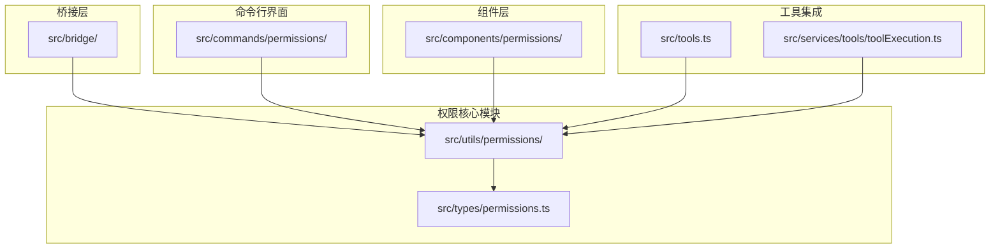
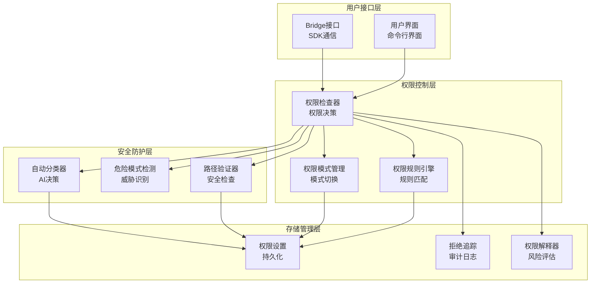
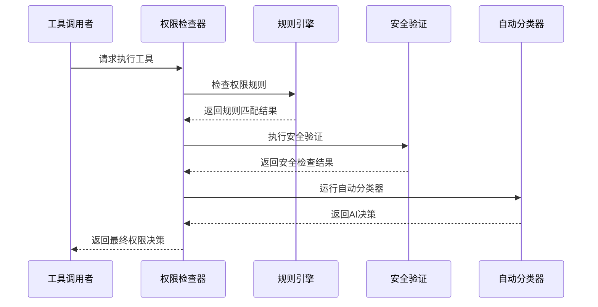
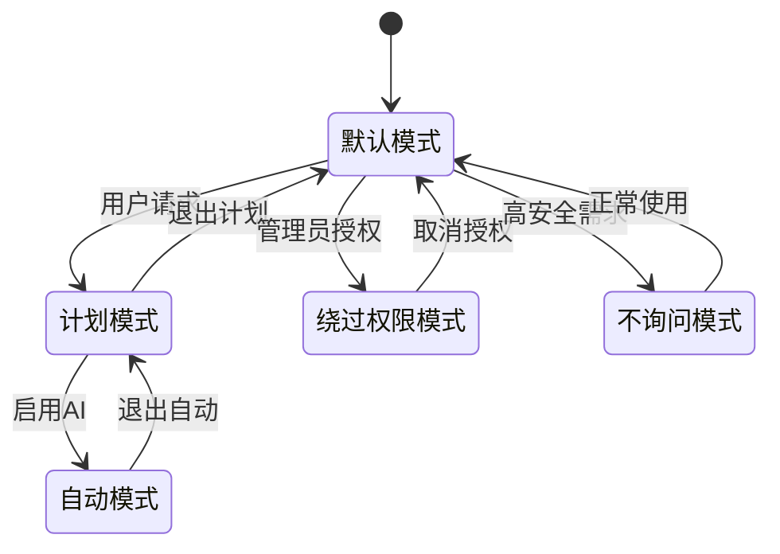
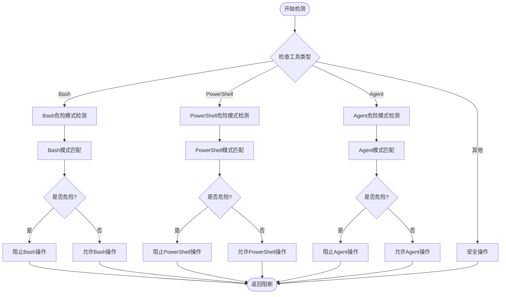
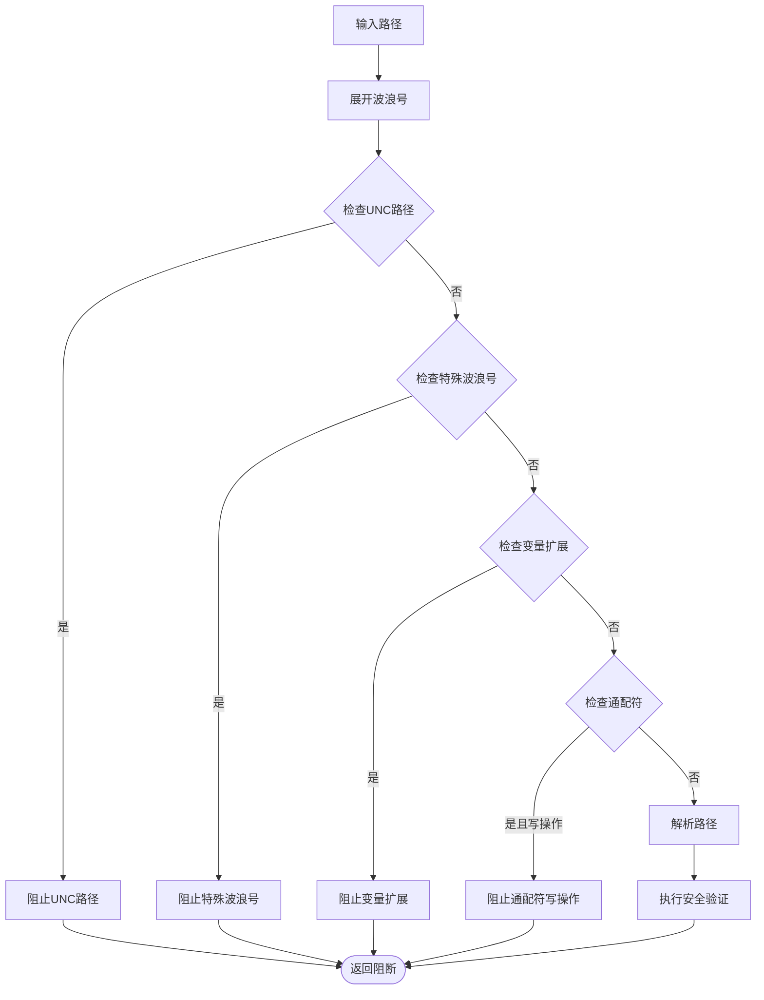
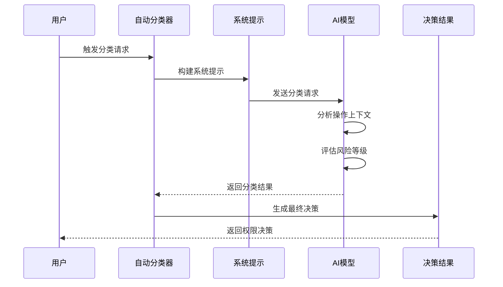

# 权限控制系统

<cite>
**本文档引用的文件**
- [src/utils/permissions/permissions.ts](file://src/utils/permissions/permissions.ts)
- [src/utils/permissions/PermissionMode.ts](file://src/utils/permissions/PermissionMode.ts)
- [src/utils/permissions/PermissionRule.ts](file://src/utils/permissions/PermissionRule.ts)
- [src/utils/permissions/PermissionUpdate.ts](file://src/utils/permissions/PermissionUpdate.ts)
- [src/utils/permissions/permissionSetup.ts](file://src/utils/permissions/permissionSetup.ts)
- [src/utils/permissions/dangerousPatterns.ts](file://src/utils/permissions/dangerousPatterns.ts)
- [src/utils/permissions/pathValidation.ts](file://src/utils/permissions/pathValidation.ts)
- [src/utils/permissions/permissionExplainer.ts](file://src/utils/permissions/permissionExplainer.ts)
- [src/utils/permissions/yoloClassifier.ts](file://src/utils/permissions/yoloClassifier.ts)
- [src/types/permissions.ts](file://src/types/permissions.ts)
- [src/bridge/bridgePermissionCallbacks.ts](file://src/bridge/bridgePermissionCallbacks.ts)
- [src/bridge/bridgeMessaging.ts](file://src/bridge/bridgeMessaging.ts)
- [src/commands/permissions/permissions.tsx](file://src/commands/permissions/permissions.tsx)
- [src/components/BypassPermissionsModeDialog.tsx](file://src/components/BypassPermissionsModeDialog.tsx)
- [src/services/tools/toolExecution.ts](file://src/services/tools/toolExecution.ts)
- [src/cli/print.ts](file://src/cli/print.ts)
- [src/main.tsx](file://src/main.tsx)
- [src/tools.ts](file://src/tools.ts)
</cite>

## 目录
1. [简介](#简介)
2. [项目结构](#项目结构)
3. [核心组件](#核心组件)
4. [架构概览](#架构概览)
5. [详细组件分析](#详细组件分析)
6. [依赖关系分析](#依赖关系分析)
7. [性能考虑](#性能考虑)
8. [故障排除指南](#故障排除指南)
9. [结论](#结论)
10. [附录](#附录)

## 简介

Claude Code 权限控制系统是一个多层次的安全框架，旨在保护用户环境免受潜在危险操作的影响。该系统通过智能的权限检查机制、灵活的权限策略配置和强大的安全防护措施，为开发者和系统管理员提供了全面的权限管理解决方案。

权限控制系统的核心目标是：
- 提供细粒度的工具权限控制
- 实现智能化的自动决策机制
- 建立多层次的安全防护体系
- 支持灵活的权限策略配置
- 确保操作的可追溯性和可审计性

## 项目结构

权限控制系统主要分布在以下目录中：



**图表来源**
- [src/utils/permissions/permissions.ts:1-800](file://src/utils/permissions/permissions.ts#L1-L800)
- [src/types/permissions.ts:1-442](file://src/types/permissions.ts#L1-L442)

**章节来源**
- [src/utils/permissions/permissions.ts:1-800](file://src/utils/permissions/permissions.ts#L1-L800)
- [src/types/permissions.ts:1-442](file://src/types/permissions.ts#L1-L442)

## 核心组件

### 权限模式系统

权限模式是权限控制系统的核心概念，提供了不同的安全级别和操作模式：

| 模式类型 | 描述 | 安全级别 | 主要用途 |
|---------|------|----------|----------|
| default | 默认模式，要求所有危险操作都需要确认 | 最高 | 日常开发工作 |
| plan | 计划模式，支持预设的工具使用策略 | 高 | 复杂任务规划 |
| acceptEdits | 接受编辑模式，允许文件编辑操作 | 中等 | 代码编辑和修改 |
| bypassPermissions | 绕过权限模式，完全信任用户操作 | 低 | 受控沙箱环境 |
| dontAsk | 不询问模式，自动拒绝可疑操作 | 最高 | 安全敏感环境 |
| auto | 自动模式，使用AI分类器进行智能决策 | 中等 | 智能自动化 |

### 权限规则引擎

权限规则引擎支持三种基本行为：
- **allow**: 明确允许特定工具或操作
- **deny**: 明确禁止特定工具或操作  
- **ask**: 需要用户交互确认的操作

规则可以针对具体的工具名称或工具内容模式进行匹配。

### 路径验证系统

路径验证系统确保文件操作的安全性：
- 支持通配符模式匹配
- 检测路径遍历攻击
- 验证沙箱写入白名单
- 处理UNC网络路径安全

**章节来源**
- [src/utils/permissions/PermissionMode.ts:1-142](file://src/utils/permissions/PermissionMode.ts#L1-L142)
- [src/utils/permissions/PermissionRule.ts:1-41](file://src/utils/permissions/PermissionRule.ts#L1-L41)
- [src/utils/permissions/pathValidation.ts:1-486](file://src/utils/permissions/pathValidation.ts#L1-L486)

## 架构概览

权限控制系统采用分层架构设计，确保了模块间的松耦合和高内聚：



**图表来源**
- [src/utils/permissions/permissions.ts:473-800](file://src/utils/permissions/permissions.ts#L473-L800)
- [src/utils/permissions/permissionSetup.ts:597-646](file://src/utils/permissions/permissionSetup.ts#L597-L646)

## 详细组件分析

### 权限检查器实现

权限检查器是整个系统的核心组件，负责执行具体的权限验证逻辑：



**图表来源**
- [src/utils/permissions/permissions.ts:473-800](file://src/utils/permissions/permissions.ts#L473-L800)
- [src/utils/permissions/yoloClassifier.ts:711-800](file://src/utils/permissions/yoloClassifier.ts#L711-L800)

权限检查器的工作流程包括：

1. **规则匹配阶段**: 检查工具级别的允许/禁止规则
2. **安全验证阶段**: 执行路径验证和危险模式检测
3. **自动决策阶段**: 在自动模式下运行AI分类器
4. **最终决策阶段**: 综合所有因素生成最终权限决策

**章节来源**
- [src/utils/permissions/permissions.ts:473-800](file://src/utils/permissions/permissions.ts#L473-L800)

### 权限模式管理

权限模式管理系统提供了灵活的模式切换机制：



**图表来源**
- [src/utils/permissions/PermissionMode.ts:42-91](file://src/utils/permissions/PermissionMode.ts#L42-L91)
- [src/utils/permissions/permissionSetup.ts:597-646](file://src/utils/permissions/permissionSetup.ts#L597-L646)

### 危险模式检测

危险模式检测系统专门用于识别可能对系统造成损害的操作：



**图表来源**
- [src/utils/permissions/permissionSetup.ts:84-285](file://src/utils/permissions/permissionSetup.ts#L84-L285)
- [src/utils/permissions/dangerousPatterns.ts:1-81](file://src/utils/permissions/dangerousPatterns.ts#L1-L81)

**章节来源**
- [src/utils/permissions/permissionSetup.ts:84-285](file://src/utils/permissions/permissionSetup.ts#L84-L285)
- [src/utils/permissions/dangerousPatterns.ts:1-81](file://src/utils/permissions/dangerousPatterns.ts#L1-L81)

### 路径验证机制

路径验证机制确保文件操作的安全性：



**图表来源**
- [src/utils/permissions/pathValidation.ts:373-486](file://src/utils/permissions/pathValidation.ts#L373-L486)

**章节来源**
- [src/utils/permissions/pathValidation.ts:1-486](file://src/utils/permissions/pathValidation.ts#L1-L486)

### 自动分类器系统

自动分类器系统使用AI技术进行智能权限决策：



**图表来源**
- [src/utils/permissions/yoloClassifier.ts:484-540](file://src/utils/permissions/yoloClassifier.ts#L484-L540)
- [src/utils/permissions/yoloClassifier.ts:711-800](file://src/utils/permissions/yoloClassifier.ts#L711-L800)

**章节来源**
- [src/utils/permissions/yoloClassifier.ts:1-800](file://src/utils/permissions/yoloClassifier.ts#L1-L800)

## 依赖关系分析

权限控制系统具有清晰的依赖层次结构：

```mermaid
graph TB
subgraph "基础类型定义"
Types[src/types/permissions.ts]
end
subgraph "核心实现"
Permissions[src/utils/permissions/permissions.ts]
Setup[src/utils/permissions/permissionSetup.ts]
Mode[src/utils/permissions/PermissionMode.ts]
Rule[src/utils/permissions/PermissionRule.ts]
Update[src/utils/permissions/PermissionUpdate.ts]
Path[src/utils/permissions/pathValidation.ts]
Danger[src/utils/permissions/dangerousPatterns.ts]
Explain[src/utils/permissions/permissionExplainer.ts]
Yolo[src/utils/permissions/yoloClassifier.ts]
end
subgraph "接口层"
Bridge[src/bridge/bridgePermissionCallbacks.ts]
BridgeMsg[src/bridge/bridgeMessaging.ts]
CLI[src/cli/print.ts]
Command[src/commands/permissions/permissions.tsx]
Component[src/components/BypassPermissionsModeDialog.tsx]
end
subgraph "工具集成"
Tools[src/tools.ts]
ToolExec[src/services/tools/toolExecution.ts]
Main[src/main.tsx]
end
Types --> Permissions
Types --> Setup
Types --> Mode
Types --> Rule
Types --> Update
Types --> Path
Types --> Danger
Types --> Explain
Types --> Yolo
Permissions --> Setup
Permissions --> Mode
Permissions --> Rule
Permissions --> Update
Permissions --> Path
Permissions --> Danger
Permissions --> Explain
Permissions --> Yolo
Bridge --> Permissions
BridgeMsg --> Permissions
CLI --> Permissions
Command --> Permissions
Component --> Permissions
Tools --> Permissions
ToolExec --> Permissions
Main --> Permissions
```



**图表来源**
- [src/types/permissions.ts:1-442](file://src/types/permissions.ts#L1-L442)
- [src/utils/permissions/permissions.ts:1-800](file://src/utils/permissions/permissions.ts#L1-L800)

**章节来源**
- [src/types/permissions.ts:1-442](file://src/types/permissions.ts#L1-L442)
- [src/utils/permissions/permissions.ts:1-800](file://src/utils/permissions/permissions.ts#L1-L800)

## 性能考虑

权限控制系统在设计时充分考虑了性能优化：

### 缓存策略
- **规则缓存**: 权限规则在内存中缓存，避免重复解析
- **路径解析缓存**: 解析后的路径结果进行缓存
- **分类器结果缓存**: 自动分类器的结果进行短期缓存

### 异步处理
- **非阻塞分类**: 自动分类器使用异步处理避免阻塞主线程
- **批量更新**: 权限更新操作支持批量处理
- **延迟初始化**: 非关键组件采用延迟初始化策略

### 内存管理
- **对象池**: 频繁创建的对象使用对象池复用
- **垃圾回收优化**: 避免创建不必要的临时对象
- **内存泄漏防护**: 使用弱引用和及时清理机制

## 故障排除指南

### 常见问题诊断

**问题1: 权限模式切换失败**
- 检查模式切换的前置条件
- 验证权限设置的有效性
- 确认安全门禁状态

**问题2: 自动模式分类器不可用**
- 检查网络连接状态
- 验证API密钥配置
- 确认功能开关状态

**问题3: 路径验证错误**
- 检查路径格式规范
- 验证文件系统权限
- 确认沙箱配置

### 调试方法

1. **启用调试模式**: 设置调试标志获取详细日志
2. **查看权限历史**: 分析权限决策的历史记录
3. **监控性能指标**: 跟踪权限检查的性能表现
4. **验证规则配置**: 确保权限规则的正确性

**章节来源**
- [src/utils/permissions/permissions.ts:1-800](file://src/utils/permissions/permissions.ts#L1-L800)
- [src/utils/permissions/permissionSetup.ts:1-800](file://src/utils/permissions/permissionSetup.ts#L1-L800)

## 结论

Claude Code 权限控制系统通过其精心设计的多层架构，为现代软件开发环境提供了全面而灵活的权限管理解决方案。系统的核心优势包括：

### 技术优势
- **模块化设计**: 清晰的分层架构便于维护和扩展
- **智能决策**: 结合人工规则和AI分类器的混合决策机制
- **安全优先**: 多层次的安全防护确保系统稳定性
- **性能优化**: 高效的缓存策略和异步处理机制

### 实用价值
- **灵活性**: 支持多种权限模式适应不同使用场景
- **可配置性**: 丰富的配置选项满足个性化需求
- **可观测性**: 完善的日志记录和审计功能
- **易用性**: 直观的用户界面和命令行工具

该权限控制系统不仅满足了当前的安全需求，还为未来的功能扩展和技术演进奠定了坚实的基础。

## 附录

### 权限配置示例

**基本权限规则配置**
```
{
  "permissions": {
    "defaultMode": "default",
    "alwaysAllowRules": {
      "userSettings": ["Bash(read-only:*)"],
      "projectSettings": ["FileRead", "WebSearch"]
    },
    "alwaysDenyRules": {
      "userSettings": ["Bash(sudo:*)", "PowerShell(iex:*)"]
    }
  }
}
```

**自动模式配置**
```
{
  "autoMode": {
    "allow": [
      "允许运行脚本",
      "允许访问外部API"
    ],
    "soft_deny": [
      "避免删除重要文件",
      "限制网络访问"
    ],
    "environment": [
      "开发环境",
      "测试环境"
    ]
  }
}
```

### 最佳实践建议

1. **最小权限原则**: 为工具分配必要的最小权限
2. **定期审查**: 定期审查和更新权限规则
3. **监控告警**: 建立权限使用情况的监控机制
4. **备份恢复**: 定期备份权限配置以便快速恢复
5. **培训教育**: 对团队成员进行权限安全培训