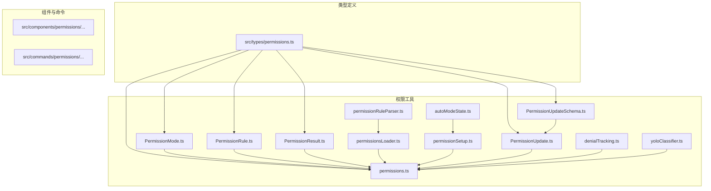
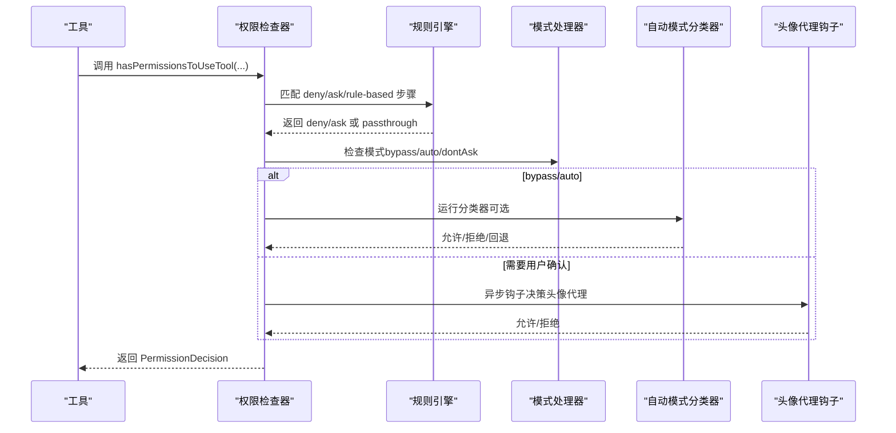
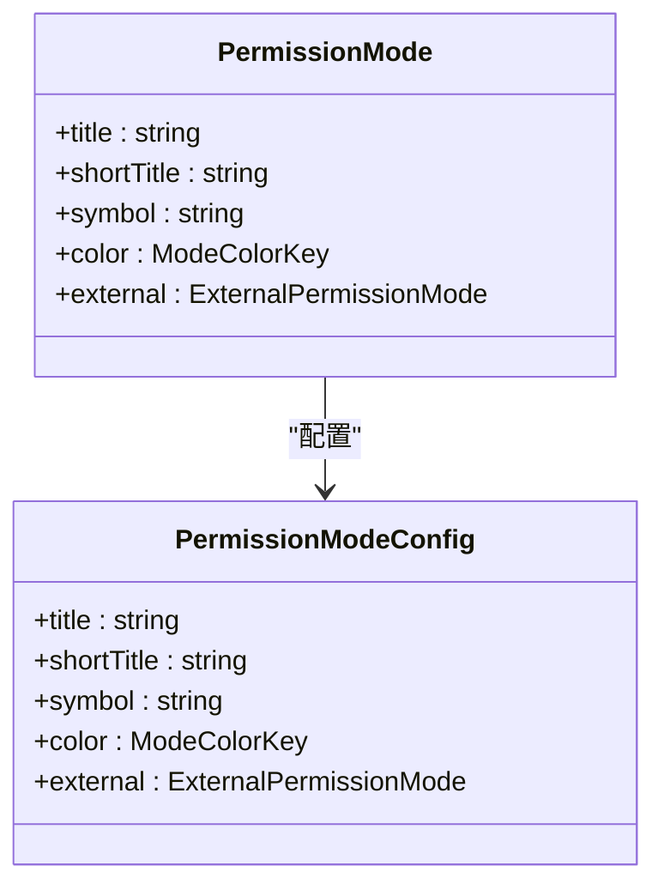
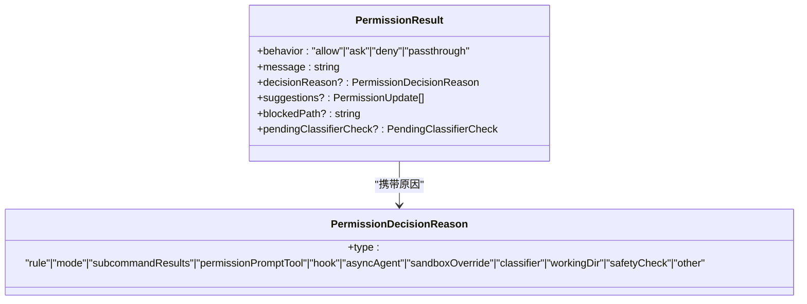
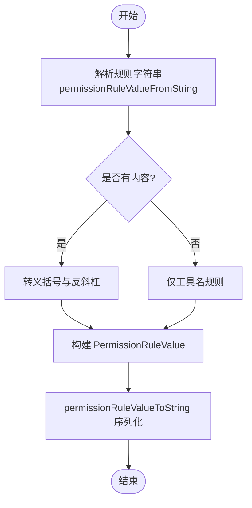
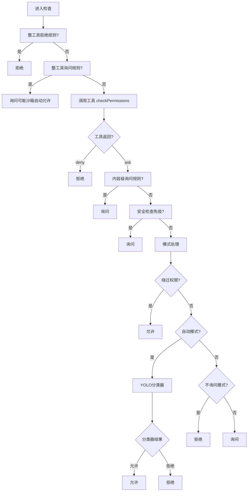
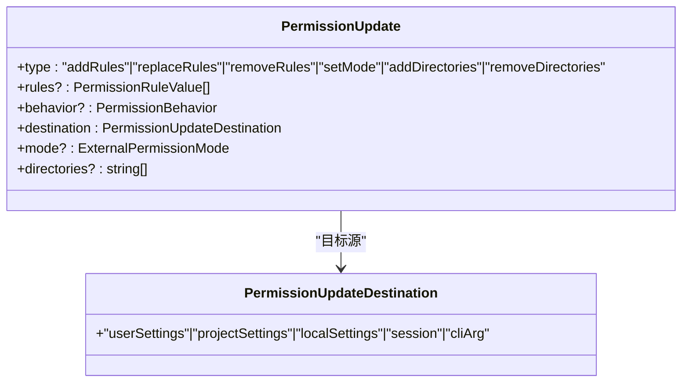
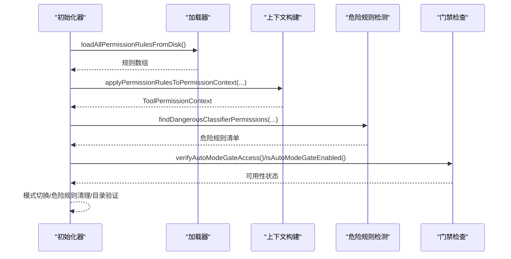
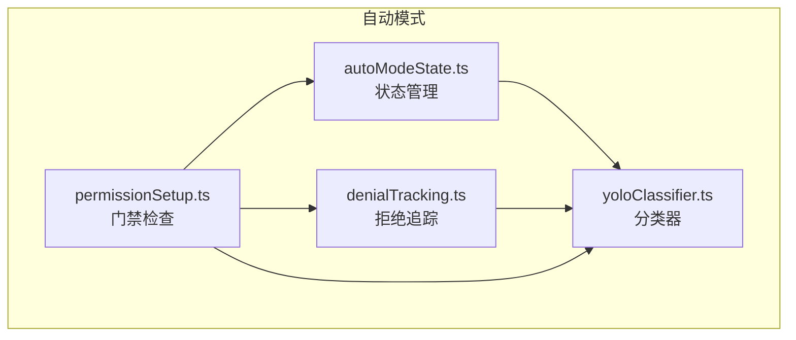
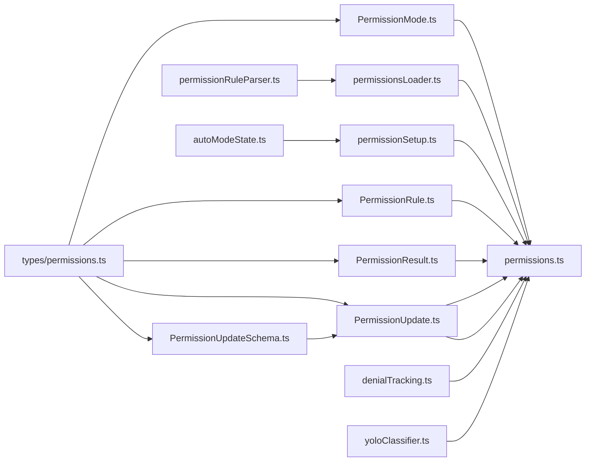

# 权限架构设计

<cite>
**本文档引用的文件**
- [src/types/permissions.ts](file://src/types/permissions.ts)
- [src/utils/permissions/PermissionMode.ts](file://src/utils/permissions/PermissionMode.ts)
- [src/utils/permissions/PermissionResult.ts](file://src/utils/permissions/PermissionResult.ts)
- [src/utils/permissions/PermissionRule.ts](file://src/utils/permissions/PermissionRule.ts)
- [src/utils/permissions/permissions.ts](file://src/utils/permissions/permissions.ts)
- [src/utils/permissions/permissionRuleParser.ts](file://src/utils/permissions/permissionRuleParser.ts)
- [src/utils/permissions/permissionsLoader.ts](file://src/utils/permissions/permissionsLoader.ts)
- [src/utils/permissions/permissionSetup.ts](file://src/utils/permissions/permissionSetup.ts)
- [src/utils/permissions/autoModeState.ts](file://src/utils/permissions/autoModeState.ts)
- [src/utils/permissions/denialTracking.ts](file://src/utils/permissions/denialTracking.ts)
- [src/utils/permissions/yoloClassifier.ts](file://src/utils/permissions/yoloClassifier.ts)
- [src/utils/permissions/PermissionUpdate.ts](file://src/utils/permissions/PermissionUpdate.ts)
- [src/utils/permissions/PermissionUpdateSchema.ts](file://src/utils/permissions/PermissionUpdateSchema.ts)
</cite>

## 目录
1. [简介](#简介)
2. [项目结构](#项目结构)
3. [核心组件](#核心组件)
4. [架构总览](#架构总览)
5. [详细组件分析](#详细组件分析)
6. [依赖关系分析](#依赖关系分析)
7. [性能考虑](#性能考虑)
8. [故障排除指南](#故障排除指南)
9. [结论](#结论)

## 简介
本文件系统性阐述该代码库中权限架构的设计与实现，涵盖权限模型、检查机制、策略配置、模式管理、结果数据结构、规则解析与加载、初始化流程以及最佳实践与性能优化建议。权限系统通过“模式 + 规则 + 分类器”的分层设计，在保证安全的同时提供灵活的用户体验。

## 项目结构
权限相关代码主要分布在以下位置：
- 类型定义：`src/types/permissions.ts`（纯类型与常量，避免循环依赖）
- 权限工具：`src/utils/permissions/`（模式、规则、更新、加载、检查、分类器等）
- 组件集成：`src/components/permissions/`（用户交互界面）
- 命令入口：`src/commands/permissions/`（权限规则列表命令）

图表来源
- [src/types/permissions.ts:1-442](file://src/types/permissions.ts#L1-L442)
- [src/utils/permissions/PermissionMode.ts:1-142](file://src/utils/permissions/PermissionMode.ts#L1-L142)
- [src/utils/permissions/permissions.ts:1-1487](file://src/utils/permissions/permissions.ts#L1-L1487)

章节来源
- [src/types/permissions.ts:1-442](file://src/types/permissions.ts#L1-L442)
- [src/utils/permissions/PermissionMode.ts:1-142](file://src/utils/permissions/PermissionMode.ts#L1-L142)
- [src/utils/permissions/permissions.ts:1-1487](file://src/utils/permissions/permissions.ts#L1-L1487)

## 核心组件
- 权限模式（PermissionMode）：控制整体权限行为，支持默认、计划、绕过权限、自动、接受编辑、不询问等模式。
- 权限规则（PermissionRule）：定义允许、拒绝、询问的具体规则，支持工具级与内容级规则。
- 权限结果（PermissionResult）：封装决策结果与原因，支持允许、询问、拒绝与透传。
- 权限更新（PermissionUpdate）：描述如何在不同目标源（用户/项目/本地/会话/命令行）应用规则变更。
- 权限加载器（permissionsLoader）：从设置源加载规则并转换为内部规则对象。
- 检查器（permissions.ts）：执行规则匹配、模式处理、自动模式分类器、头像代理钩子等。
- 初始化器（permissionSetup.ts）：构建 ToolPermissionContext，处理危险规则清理、模式切换、目录权限等。
- 自动模式状态（autoModeState.ts）：维护自动模式开关与电路断路状态。
- 拒绝追踪（denialTracking.ts）：统计连续与累计拒绝次数，触发回退提示。
- 分类器（yoloClassifier.ts）：自动模式下的安全分类器，支持XML两阶段输出格式。

章节来源
- [src/utils/permissions/PermissionMode.ts:1-142](file://src/utils/permissions/PermissionMode.ts#L1-L142)
- [src/utils/permissions/PermissionRule.ts:1-41](file://src/utils/permissions/PermissionRule.ts#L1-L41)
- [src/utils/permissions/PermissionResult.ts:1-36](file://src/utils/permissions/PermissionResult.ts#L1-L36)
- [src/utils/permissions/PermissionUpdate.ts:1-390](file://src/utils/permissions/PermissionUpdate.ts#L1-L390)
- [src/utils/permissions/permissions.ts:1-1487](file://src/utils/permissions/permissions.ts#L1-L1487)
- [src/utils/permissions/permissionsLoader.ts:1-297](file://src/utils/permissions/permissionsLoader.ts#L1-L297)
- [src/utils/permissions/permissionSetup.ts:1-1533](file://src/utils/permissions/permissionSetup.ts#L1-L1533)
- [src/utils/permissions/autoModeState.ts:1-40](file://src/utils/permissions/autoModeState.ts#L1-L40)
- [src/utils/permissions/denialTracking.ts:1-46](file://src/utils/permissions/denialTracking.ts#L1-L46)
- [src/utils/permissions/yoloClassifier.ts:1-1496](file://src/utils/permissions/yoloClassifier.ts#L1-L1496)

## 架构总览
权限系统采用“上下文驱动 + 规则优先 + 模式兜底 + 分类器增强”的分层架构：

图表来源
- [src/utils/permissions/permissions.ts:473-956](file://src/utils/permissions/permissions.ts#L473-L956)
- [src/utils/permissions/yoloClassifier.ts:711-800](file://src/utils/permissions/yoloClassifier.ts#L711-L800)

章节来源
- [src/utils/permissions/permissions.ts:473-956](file://src/utils/permissions/permissions.ts#L473-L956)
- [src/utils/permissions/yoloClassifier.ts:711-800](file://src/utils/permissions/yoloClassifier.ts#L711-L800)

## 详细组件分析

### 权限模式（PermissionMode）
- 支持模式集合：默认、计划、绕过权限、自动、接受编辑、不询问（条件特性）。
- 外部模式映射：内部模式到外部展示模式的映射，确保对外暴露一致的模式标识。
- 模式配置：标题、短标题、符号、颜色、外部模式映射等。
- 模式判断：是否外部模式、字符串转模式、默认模式判断、颜色获取等。

图表来源
- [src/utils/permissions/PermissionMode.ts:34-91](file://src/utils/permissions/PermissionMode.ts#L34-L91)

章节来源
- [src/utils/permissions/PermissionMode.ts:1-142](file://src/utils/permissions/PermissionMode.ts#L1-L142)

### 权限结果（PermissionResult）
- 结果类型：允许（含更新输入）、询问（含消息、建议、阻断路径、元数据、异步分类器挂起）、拒绝（含消息与原因）、透传。
- 决策原因：规则、模式、子命令结果、权限提示工具、钩子、异步代理、沙箱覆盖、分类器、工作目录、安全检查、其他。
- 辅助函数：根据行为返回人类可读描述。

图表来源
- [src/types/permissions.ts:148-325](file://src/types/permissions.ts#L148-L325)

章节来源
- [src/types/permissions.ts:148-325](file://src/types/permissions.ts#L148-L325)
- [src/utils/permissions/PermissionResult.ts:1-36](file://src/utils/permissions/PermissionResult.ts#L1-L36)

### 权限规则（PermissionRule）
- 规则值：工具名 + 可选内容；内容支持通配符与前缀语法。
- 行为：允许、拒绝、询问。
- 解析器：支持括号转义、解析与序列化，兼容旧工具名别名。
- 规则来源：用户设置、项目设置、本地设置、标志设置、策略设置、命令行参数、会话。

图表来源
- [src/utils/permissions/permissionRuleParser.ts:93-152](file://src/utils/permissions/permissionRuleParser.ts#L93-L152)

章节来源
- [src/utils/permissions/PermissionRule.ts:1-41](file://src/utils/permissions/PermissionRule.ts#L1-L41)
- [src/utils/permissions/permissionRuleParser.ts:1-199](file://src/utils/permissions/permissionRuleParser.ts#L1-L199)

### 权限检查流程（hasPermissionsToUseTool）
- 规则优先：整工具拒绝、整工具询问、工具实现检查、内容级询问规则、安全检查免疫。
- 模式处理：绕过权限模式直接允许；自动模式下尝试接受编辑快速路径与分类器；不询问模式将询问转为拒绝。
- 头像代理钩子：在无法弹窗场景（如后台代理）先尝试钩子决策。
- 分类器：自动模式下运行YOLO分类器，记录拒绝次数，超过阈值回退到人工确认。

图表来源
- [src/utils/permissions/permissions.ts:1158-1318](file://src/utils/permissions/permissions.ts#L1158-L1318)
- [src/utils/permissions/permissions.ts:518-927](file://src/utils/permissions/permissions.ts#L518-L927)

章节来源
- [src/utils/permissions/permissions.ts:473-956](file://src/utils/permissions/permissions.ts#L473-L956)
- [src/utils/permissions/permissions.ts:1158-1318](file://src/utils/permissions/permissions.ts#L1158-L1318)

### 权限更新（PermissionUpdate）
- 更新类型：添加/替换/删除规则、设置模式、添加/删除目录。
- 目标源：用户设置、项目设置、本地设置、会话、命令行参数。
- 应用与持久化：内存上下文更新与设置文件同步，支持批量应用与持久化。

图表来源
- [src/utils/permissions/PermissionUpdateSchema.ts:24-78](file://src/utils/permissions/PermissionUpdateSchema.ts#L24-L78)

章节来源
- [src/utils/permissions/PermissionUpdate.ts:1-390](file://src/utils/permissions/PermissionUpdate.ts#L1-L390)
- [src/utils/permissions/PermissionUpdateSchema.ts:1-79](file://src/utils/permissions/PermissionUpdateSchema.ts#L1-L79)

### 权限加载与初始化
- 加载规则：从启用的设置源读取权限配置，转换为规则数组；受托管设置限制时仅使用策略设置。
- 初始化上下文：合并CLI参数、规则、附加工作目录、模式可用性、自动模式可用性等。
- 危险规则检测：识别可能导致绕过分类器的规则（如 Bash(*)、PowerShell(*)、Agent(*)），并在自动模式下清理或警告。
- 模式切换：统一处理计划/自动模式进入与退出，设置分类器状态与危险规则恢复。

图表来源
- [src/utils/permissions/permissionsLoader.ts:120-145](file://src/utils/permissions/permissionsLoader.ts#L120-L145)
- [src/utils/permissions/permissionSetup.ts:872-1033](file://src/utils/permissions/permissionSetup.ts#L872-L1033)
- [src/utils/permissions/permissionSetup.ts:1078-1260](file://src/utils/permissions/permissionSetup.ts#L1078-L1260)

章节来源
- [src/utils/permissions/permissionsLoader.ts:1-297](file://src/utils/permissions/permissionsLoader.ts#L1-L297)
- [src/utils/permissions/permissionSetup.ts:1-1533](file://src/utils/permissions/permissionSetup.ts#L1-L1533)

### 自动模式与分类器
- 自动模式状态：维护活动状态、CLI标志、电路断路状态，用于全局一致性。
- 拒绝追踪：统计连续与累计拒绝次数，达到阈值后回退到人工确认。
- YOLO分类器：构建系统提示、压缩对话历史、XML两阶段输出、错误提示转储、令牌用量与耗时统计。
- 门禁检查：GrowthBook配置、设置禁用、模型支持、快模冲突等综合判定。

图表来源
- [src/utils/permissions/autoModeState.ts:1-40](file://src/utils/permissions/autoModeState.ts#L1-L40)
- [src/utils/permissions/denialTracking.ts:1-46](file://src/utils/permissions/denialTracking.ts#L1-L46)
- [src/utils/permissions/yoloClassifier.ts:1-1496](file://src/utils/permissions/yoloClassifier.ts#L1-L1496)
- [src/utils/permissions/permissionSetup.ts:1078-1260](file://src/utils/permissions/permissionSetup.ts#L1078-L1260)

章节来源
- [src/utils/permissions/autoModeState.ts:1-40](file://src/utils/permissions/autoModeState.ts#L1-L40)
- [src/utils/permissions/denialTracking.ts:1-46](file://src/utils/permissions/denialTracking.ts#L1-L46)
- [src/utils/permissions/yoloClassifier.ts:1-1496](file://src/utils/permissions/yoloClassifier.ts#L1-L1496)
- [src/utils/permissions/permissionSetup.ts:1078-1260](file://src/utils/permissions/permissionSetup.ts#L1078-L1260)

## 依赖关系分析
- 类型解耦：权限类型集中于 `src/types/permissions.ts`，避免运行时依赖循环。
- 工具模块：权限检查器依赖模式、规则、更新、加载器、分类器、钩子、沙箱等模块。
- 初始化链路：初始化器聚合加载器、规则解析器、危险规则检测、门禁检查，形成稳定的上下文构建流程。

图表来源
- [src/types/permissions.ts:1-442](file://src/types/permissions.ts#L1-L442)
- [src/utils/permissions/permissions.ts:1-1487](file://src/utils/permissions/permissions.ts#L1-L1487)

章节来源
- [src/types/permissions.ts:1-442](file://src/types/permissions.ts#L1-L442)
- [src/utils/permissions/permissions.ts:1-1487](file://src/utils/permissions/permissions.ts#L1-L1487)

## 性能考虑
- 规则匹配优化：对规则按来源与行为进行分组与缓存，减少重复解析与遍历。
- 分类器成本控制：统计分类器令牌用量与耗时，结合会话总用量计算开销占比；在超长对话时回退到手动确认以避免昂贵API调用。
- 拒绝追踪：通过连续与累计拒绝计数快速决定是否回退，避免无意义的分类器调用。
- 并发与串行：目录校验并行化，但应用更新串行累积，避免竞态与状态不一致。
- 令牌估算：在分类器提示长度不足时进行估算，减少不必要的重试。

## 故障排除指南
- 自动模式不可用：检查门禁配置（GrowthBook）、设置禁用、模型支持、快模冲突；必要时通知用户并回退到默认模式。
- 分类器异常：当API不可用或上下文窗口超限时，系统会回退到手动确认或失败关闭策略，并在蚂蚁环境转储错误提示以便诊断。
- 危险规则误删：初始化器会检测并警告潜在危险规则，可在自动模式退出时恢复。
- 拒绝过多：当连续或累计拒绝达到阈值，系统会回退到人工确认，同时清零计数以保护用户体验。

章节来源
- [src/utils/permissions/permissionSetup.ts:1078-1260](file://src/utils/permissions/permissionSetup.ts#L1078-L1260)
- [src/utils/permissions/yoloClassifier.ts:213-250](file://src/utils/permissions/yoloClassifier.ts#L213-L250)
- [src/utils/permissions/denialTracking.ts:1-46](file://src/utils/permissions/denialTracking.ts#L1-L46)

## 结论
该权限架构通过清晰的模式、规则与更新机制，结合自动模式分类器与拒绝追踪，实现了高安全性与良好用户体验的平衡。初始化器负责在启动阶段完成规则加载、危险规则清理与门禁检查，确保上下文的一致性与可用性。遵循本文档的最佳实践与性能建议，可进一步提升系统的稳定性与响应速度。