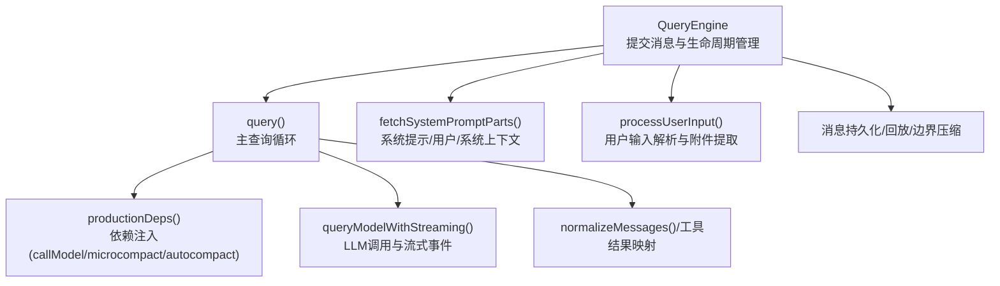
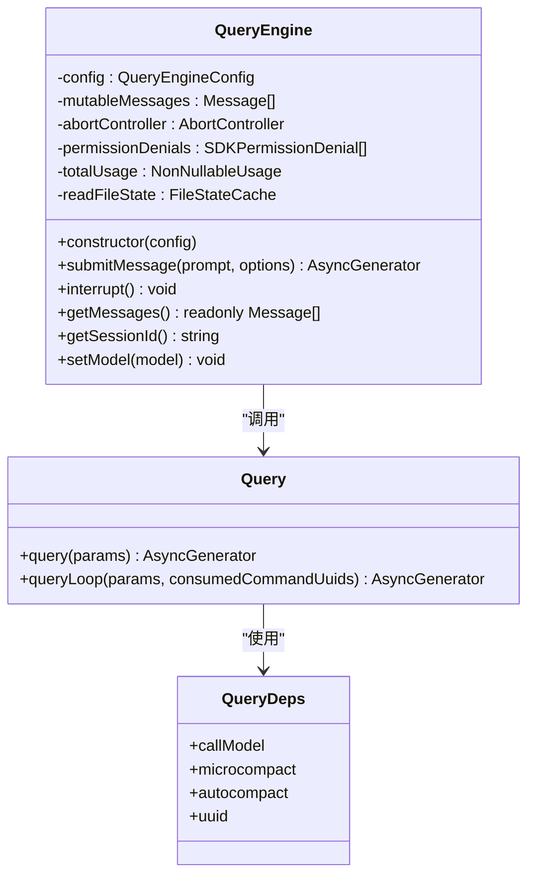
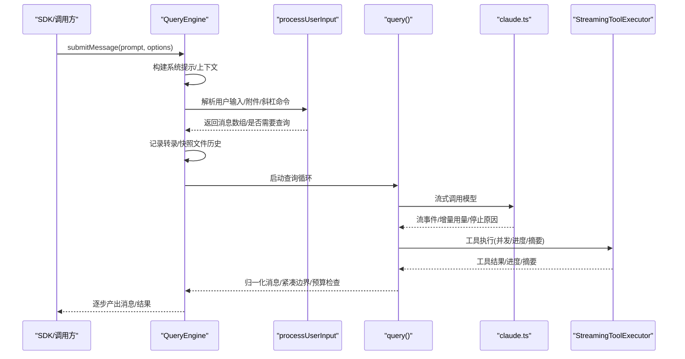
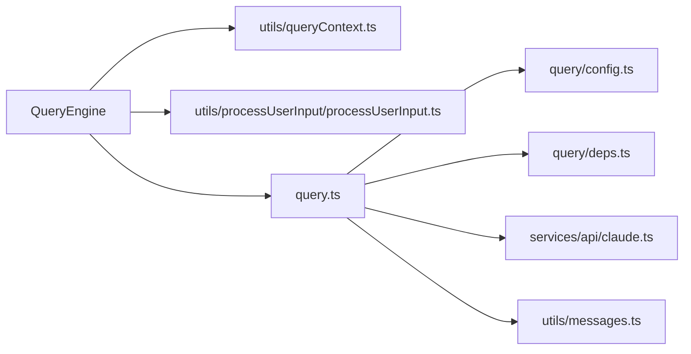

# 查询引擎架构

<cite>
**本文引用的文件**
- [QueryEngine.ts](file://src/QueryEngine.ts)
- [query.ts](file://src/query.ts)
- [query/config.ts](file://src/query/config.ts)
- [query/deps.ts](file://src/query/deps.ts)
- [utils/queryContext.ts](file://src/utils/queryContext.ts)
- [utils/processUserInput/processUserInput.ts](file://src/utils/processUserInput/processUserInput.ts)
- [services/api/claude.ts](file://src/services/api/claude.ts)
- [utils/messages.ts](file://src/utils/messages.ts)
</cite>

## 目录
1. [引言](#引言)
2. [项目结构](#项目结构)
3. [核心组件](#核心组件)
4. [架构总览](#架构总览)
5. [详细组件分析](#详细组件分析)
6. [依赖关系分析](#依赖关系分析)
7. [性能考量](#性能考量)
8. [故障排查指南](#故障排查指南)
9. [结论](#结论)
10. [附录：配置与最佳实践](#附录配置与最佳实践)

## 引言
本文件面向系统架构师与高级开发者，深入解析查询引擎（QueryEngine）的架构设计与实现细节。内容涵盖类设计模式、生命周期与状态管理、初始化流程（系统提示构建、用户上下文设置、工具权限配置）、与外部系统（LLM API、工具执行、消息处理）的集成方式、异步处理与错误处理策略，以及配置项与最佳实践。

## 项目结构
查询引擎位于 src/QueryEngine.ts，围绕 submitMessage() 提供一次会话内的多轮对话生命周期管理；其内部通过 query() 实现与模型服务的交互、工具调用与上下文压缩等核心逻辑。相关支撑模块包括：
- 系统提示与上下文构建：utils/queryContext.ts
- 用户输入预处理：utils/processUserInput/processUserInput.ts
- 模型调用与流式输出：services/api/claude.ts
- 消息规范化与工具结果映射：utils/messages.ts
- 查询配置与依赖注入：query/config.ts、query/deps.ts

图表来源
- [QueryEngine.ts](file://src/QueryEngine.ts)
- [query.ts](file://src/query.ts)
- [query/config.ts](file://src/query/config.ts)
- [query/deps.ts](file://src/query/deps.ts)
- [utils/queryContext.ts](file://src/utils/queryContext.ts)
- [utils/processUserInput/processUserInput.ts](file://src/utils/processUserInput/processUserInput.ts)
- [services/api/claude.ts](file://src/services/api/claude.ts)
- [utils/messages.ts](file://src/utils/messages.ts)

章节来源
- [QueryEngine.ts](file://src/QueryEngine.ts)
- [query.ts](file://src/query.ts)
- [query/config.ts](file://src/query/config.ts)
- [query/deps.ts](file://src/query/deps.ts)
- [utils/queryContext.ts](file://src/utils/queryContext.ts)
- [utils/processUserInput/processUserInput.ts](file://src/utils/processUserInput/processUserInput.ts)
- [services/api/claude.ts](file://src/services/api/claude.ts)
- [utils/messages.ts](file://src/utils/messages.ts)

## 核心组件
- QueryEngine：封装单次会话的生命周期与状态，负责系统提示构建、用户输入处理、工具权限跟踪、消息持久化、转录记录、预算控制与错误聚合，并以异步生成器形式向 SDK 输出消息与结果。
- query()：查询主循环，负责上下文压缩（微/自动）、模型调用、工具执行、停止钩子、令牌预算与任务预算控制、错误恢复与重试、消息归一化与产出标准化。
- 配置与依赖：buildQueryConfig() 快照运行时门禁与环境开关；productionDeps() 注入真实 I/O 依赖（模型调用、压缩算法），便于测试替换。

章节来源
- [QueryEngine.ts](file://src/QueryEngine.ts)
- [query.ts](file://src/query.ts)
- [query/config.ts](file://src/query/config.ts)
- [query/deps.ts](file://src/query/deps.ts)

## 架构总览
查询引擎采用“分层职责 + 依赖注入”的架构：
- 表层：QueryEngine 对外暴露 submitMessage()，负责会话级状态与消息持久化。
- 中层：query() 执行查询循环，协调上下文压缩、模型调用、工具执行与停止钩子。
- 底层：productionDeps() 将 I/O 依赖注入到查询循环中，确保可测试性与可维护性。
- 外部集成：services/api/claude.ts 提供流式模型调用与错误分类；工具执行由 StreamingToolExecutor 与 runTools 协作完成；消息在 SDK 层进行归一化与序列化。

图表来源
- [QueryEngine.ts](file://src/QueryEngine.ts)
- [query.ts](file://src/query.ts)
- [query/deps.ts](file://src/query/deps.ts)

## 详细组件分析

### QueryEngine 设计与生命周期
- 设计模式：基于“配置驱动 + 私有状态 + 异步生成器”的模式，将会话状态（消息、文件缓存、用量）跨轮次持久，支持 headless/SDK 与未来 REPL 场景。
- 生命周期阶段：
  - 初始化：读取 cwd、工具集、命令集、MCP 客户端、代理定义、canUseTool 包装器、AppState 获取/更新器、初始消息、文件缓存、可选自定义系统提示与追加提示、模型与预算参数、思考配置、回调与中断控制器等。
  - 系统提示构建：并行获取默认系统提示、用户上下文与系统上下文，拼接自定义/追加提示，注入协调者上下文与内存机制提示（当存在覆盖时）。
  - 用户输入处理：通过 processUserInput() 解析文本/图片/附件，识别斜杠命令与技能触发，生成用户消息与可选的本地命令输出消息。
  - 系统初始化消息：在进入模型调用前，先产出系统初始化消息（包含工具、MCP、模型、权限模式、命令、代理、插件、快速模式等）。
  - 主查询循环：委托 query() 执行，期间持续记录转录、处理紧凑边界、追踪权限拒绝、结构化输出重试、预算超限与最大轮次限制。
  - 结果产出：根据最终消息类型与停止原因，产出 SDK result 消息或错误诊断（含内存日志水印）。

图表来源
- [QueryEngine.ts](file://src/QueryEngine.ts)
- [utils/processUserInput/processUserInput.ts](file://src/utils/processUserInput/processUserInput.ts)
- [query.ts](file://src/query.ts)
- [services/api/claude.ts](file://src/services/api/claude.ts)

章节来源
- [QueryEngine.ts](file://src/QueryEngine.ts)
- [utils/processUserInput/processUserInput.ts](file://src/utils/processUserInput/processUserInput.ts)
- [query.ts](file://src/query.ts)
- [services/api/claude.ts](file://src/services/api/claude.ts)

### 初始化流程详解
- 系统提示构建：
  - 并行获取默认系统提示、用户上下文与系统上下文；若提供自定义系统提示，则跳过默认构建，仅追加自定义与可选追加提示。
  - 当存在自定义系统提示且设置了内存路径覆盖时，注入内存机制提示，确保写/编辑工具正确工作。
- 用户上下文与系统上下文：
  - 用户上下文来自 getUserContext()，系统上下文来自 getSystemContext()（除非自定义系统提示已提供）。
  - 协调者模式下注入额外上下文（如草稿目录）。
- 工具权限包装：
  - 包装 canUseTool 以收集权限拒绝信息，用于 SDK 报告与诊断。
- 插件与技能加载：
  - 在进入模型调用前，缓存只读地加载技能与插件，避免阻塞启动。
- 系统初始化消息：
  - 产出包含工具、MCP、模型、权限模式、命令、代理、插件、快速模式等信息的消息，供 SDK 建立初始状态。

章节来源
- [QueryEngine.ts](file://src/QueryEngine.ts)
- [utils/queryContext.ts](file://src/utils/queryContext.ts)

### 与外部系统集成
- LLM API 调用：
  - 通过 services/api/claude.ts 的 queryModelWithStreaming() 进行流式调用，支持思考配置、工具选择、代理、任务预算、快速模式、顾问模型等参数。
  - 错误分类与重试策略由 withRetry 与错误分类函数协作完成；流式回退时清理孤儿消息并重建执行器。
- 工具执行：
  - StreamingToolExecutor 支持并发工具执行、进度消息、摘要生成与回退处理；runTools 协同执行工具链。
- 消息处理：
  - 归一化消息（按内容块拆分）、工具结果映射、附件与进度消息内联记录、紧凑边界裁剪、转录持久化与回放。

章节来源
- [services/api/claude.ts](file://src/services/api/claude.ts)
- [query.ts](file://src/query.ts)
- [utils/messages.ts](file://src/utils/messages.ts)

### 异步处理与错误处理
- 异步生成器：
  - QueryEngine.submitMessage() 与 query() 均为异步生成器，逐条产出消息，支持边生成边消费，降低首字节延迟。
- 中断与取消：
  - 内部持有 AbortController，interrupt() 触发中断；模型调用与工具执行均尊重信号。
- 错误分类与恢复：
  - 对 API 错误进行分类（如令牌不足、输出长度超限、最大轮次/预算超限），在可恢复场景（如上下文压缩、媒体恢复）下延迟抛出，直至恢复尝试结束。
- 诊断与可观测性：
  - 使用 headlessProfilerCheckpoint 与 queryCheckpoint 标注关键时间点；内存日志水印用于错误诊断；权限拒绝列表用于 SDK 报告。

章节来源
- [QueryEngine.ts](file://src/QueryEngine.ts)
- [query.ts](file://src/query.ts)
- [services/api/claude.ts](file://src/services/api/claude.ts)

### 状态管理与持久化
- 会话状态：
  - mutableMessages：当前会话消息数组，贯穿多轮；紧凑边界后进行修剪。
  - totalUsage：累计用量；每条消息增量更新，最终汇总。
  - permissionDenials：权限拒绝列表，用于 SDK 报告。
  - readFileState：文件读取缓存，随引擎实例传递并在最后回写。
- 转录与快照：
  - recordTranscript 持久化消息；fileHistoryMakeSnapshot 生成文件历史快照；flushSessionStorage 支持急刷。
- 会话标识：
  - getSessionId() 统一会话 ID，贯穿消息与统计。

章节来源
- [QueryEngine.ts](file://src/QueryEngine.ts)
- [utils/messages.ts](file://src/utils/messages.ts)

## 依赖关系分析
- QueryEngine 依赖：
  - utils/queryContext.ts：系统提示与上下文构建。
  - utils/processUserInput/processUserInput.ts：用户输入解析与附件提取。
  - query.ts：查询主循环与上下文压缩、工具执行、停止钩子。
  - services/api/claude.ts：模型调用与流式事件。
  - utils/messages.ts：消息归一化与工具结果映射。
- query() 依赖：
  - query/config.ts：查询配置快照（运行时门禁与环境开关）。
  - query/deps.ts：生产依赖注入（模型调用、压缩算法）。
- 可能的循环：
  - QueryEngine 与 processUserInput 之间通过 ToolUseContext 与命令/工具集合耦合，但未形成直接循环导入；通过类型导出与运行时 require 分离。

图表来源
- [QueryEngine.ts](file://src/QueryEngine.ts)
- [utils/queryContext.ts](file://src/utils/queryContext.ts)
- [utils/processUserInput/processUserInput.ts](file://src/utils/processUserInput/processUserInput.ts)
- [query.ts](file://src/query.ts)
- [query/config.ts](file://src/query/config.ts)
- [query/deps.ts](file://src/query/deps.ts)
- [services/api/claude.ts](file://src/services/api/claude.ts)
- [utils/messages.ts](file://src/utils/messages.ts)

章节来源
- [QueryEngine.ts](file://src/QueryEngine.ts)
- [query.ts](file://src/query.ts)
- [query/config.ts](file://src/query/config.ts)
- [query/deps.ts](file://src/query/deps.ts)
- [utils/queryContext.ts](file://src/utils/queryContext.ts)
- [utils/processUserInput/processUserInput.ts](file://src/utils/processUserInput/processUserInput.ts)
- [services/api/claude.ts](file://src/services/api/claude.ts)
- [utils/messages.ts](file://src/utils/messages.ts)

## 性能考量
- 流式输出与低延迟：queryModelWithStreaming 与 AsyncGenerator 使消息可边生成边消费，显著降低首字节延迟。
- 上下文压缩：微/自动压缩减少上下文长度，提升吞吐与降低成本；在可恢复错误场景延迟抛出，避免重复计算。
- 缓存与快照：转录与文件历史快照采用异步写入与急刷策略，平衡一致性与性能。
- 并发工具执行：StreamingToolExecutor 支持并发执行与进度消息，缩短整体响应时间。
- 配置快照：buildQueryConfig() 将运行时门禁与环境开关快照至查询配置，避免重复评估。

## 故障排查指南
- 常见错误类型与定位：
  - 最大轮次/预算超限：在 QueryEngine 中检测并返回对应 result 错误类型。
  - 结构化输出重试上限：当启用 jsonSchema 且工具调用次数超过阈值时终止并返回错误。
  - 权限拒绝：通过 permissionDenials 列表上报，SDK 可据此展示与重试。
  - 错误诊断：错误诊断消息包含结果类型、最后内容类型与停止原因，结合内存日志水印定位问题。
- 中断与取消：
  - 调用 interrupt() 触发 AbortController，模型调用与工具执行应尽快响应。
- 日志与指标：
  - 使用 headlessProfilerCheckpoint 与 queryCheckpoint 标注关键时间点，便于性能分析与问题定位。

章节来源
- [QueryEngine.ts](file://src/QueryEngine.ts)
- [query.ts](file://src/query.ts)

## 结论
QueryEngine 通过清晰的分层与依赖注入，将会话生命周期、系统提示构建、用户输入处理、工具权限与执行、上下文压缩、预算控制与错误恢复整合为统一的异步生成器接口。其设计兼顾可测试性、可观测性与可扩展性，适合在 headless/SDK 与 REPL 等多种场景复用。

## 附录：配置与最佳实践

### 配置选项（QueryEngineConfig）
- cwd：工作目录
- tools：可用工具集合
- commands：可用命令集合
- mcpClients：MCP 服务器连接
- agents：代理定义
- canUseTool：工具使用决策函数（带权限拒绝追踪）
- getAppState/setAppState：应用状态获取/更新
- initialMessages：初始消息（可选）
- readFileCache：文件读取缓存
- customSystemPrompt：自定义系统提示（覆盖默认）
- appendSystemPrompt：附加系统提示（追加）
- userSpecifiedModel：用户指定模型
- fallbackModel：回退模型
- thinkingConfig：思考配置
- maxTurns/maxBudgetUsd/taskBudget：轮次与预算限制
- jsonSchema：结构化输出模式（配合 StructuredOutput 工具）
- verbose/replayUserMessages/includePartialMessages：调试与回放选项
- handleElicitation：MCP URL 请求处理回调
- setSDKStatus：SDK 状态回调
- abortController：中断控制器
- orphanedPermission：遗留权限处理
- snipReplay：历史截断回调（HISTORY_SNIP 特性）

章节来源
- [QueryEngine.ts](file://src/QueryEngine.ts)

### 最佳实践
- 明确预算与轮次：在 headless 场景设置 maxBudgetUsd 与 maxTurns，避免无限消耗。
- 合理使用自定义系统提示：仅在必要时覆盖默认提示，并通过 appendSystemPrompt 追加策略约束。
- 结构化输出重试：合理设置 MAX_STRUCTURED_OUTPUT_RETRIES 环境变量，避免无休止重试。
- 并发工具执行：优先使用 StreamingToolExecutor 的并发能力，同时关注工具并发安全与资源占用。
- 中断与可观测性：在长时间运行的任务中定期检查中断信号，开启 headlessProfiler 与 queryCheckpoint 以定位瓶颈。
- 转录与快照：在关键节点调用 recordTranscript 与 fileHistoryMakeSnapshot，确保可恢复性与调试信息完整。