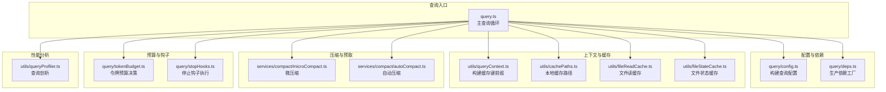
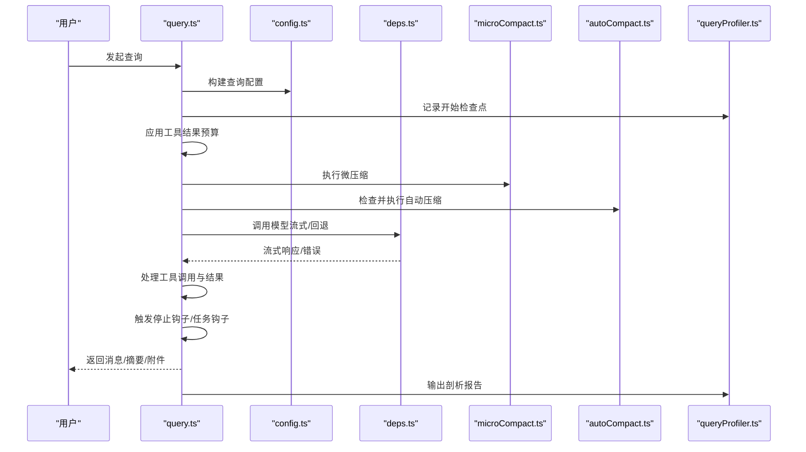
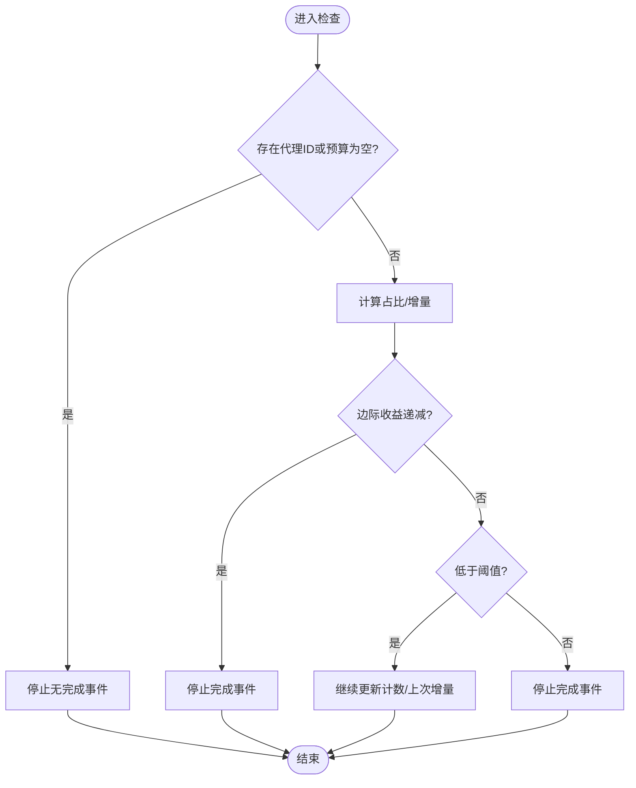
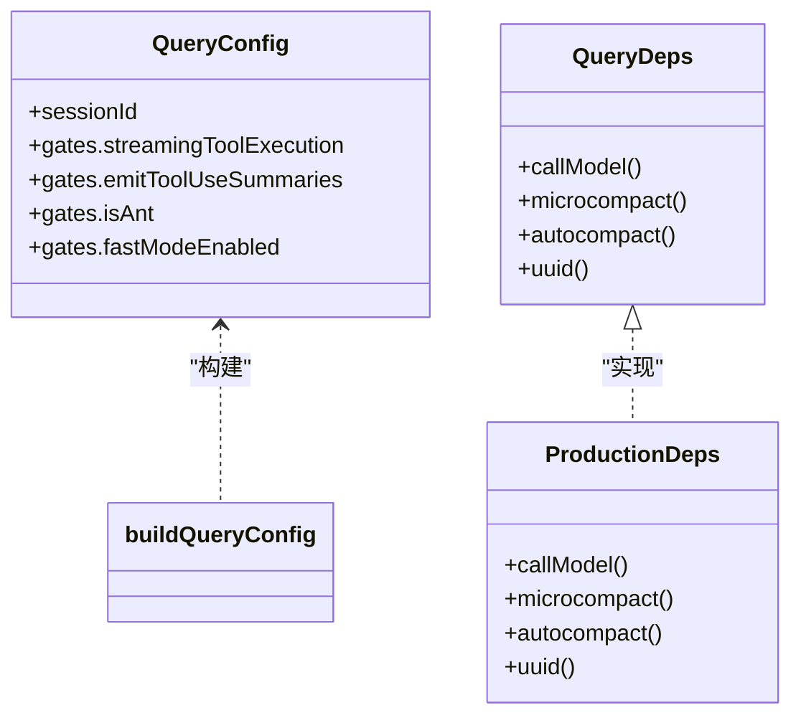
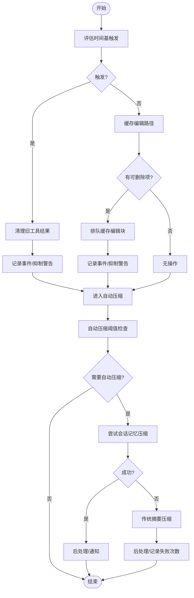
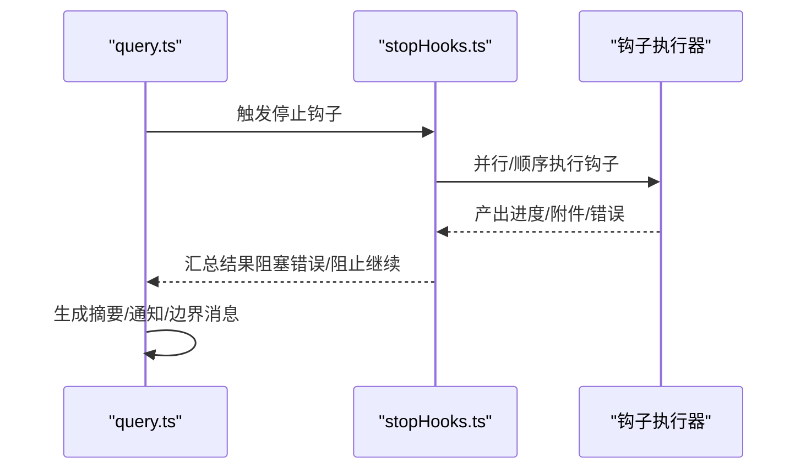
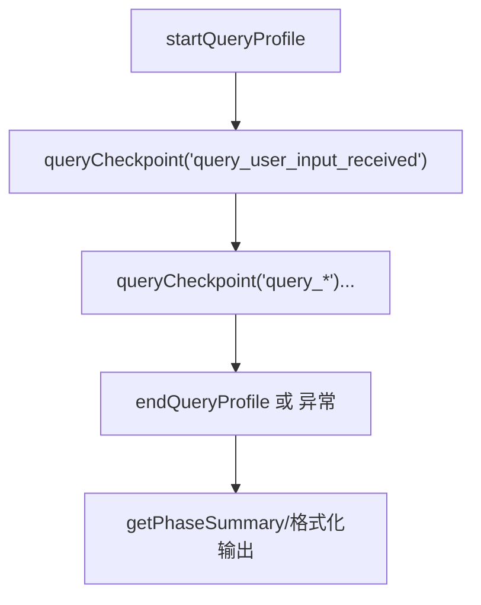
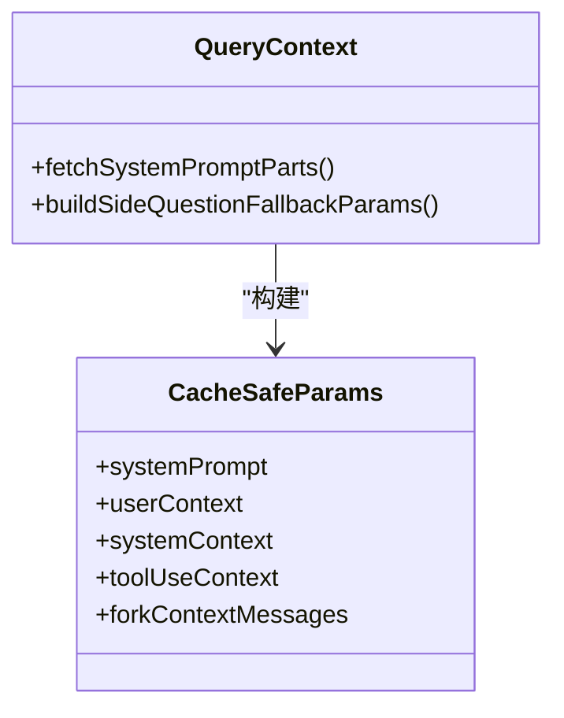
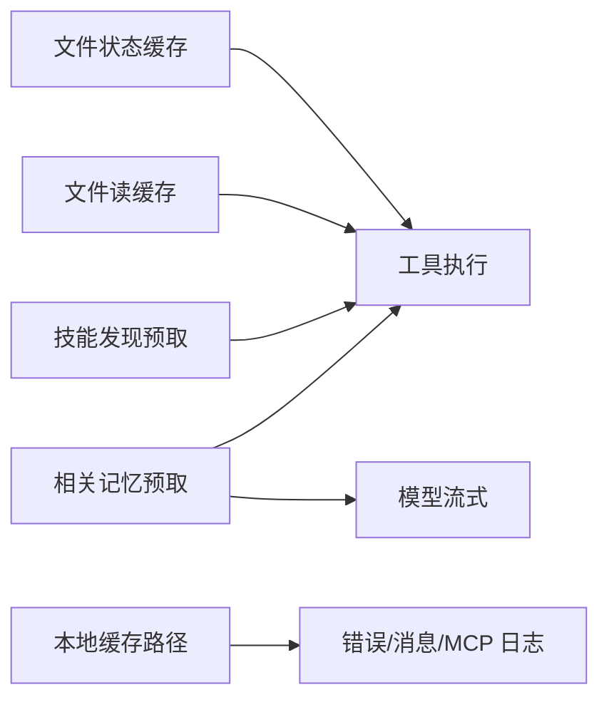
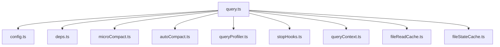

# 查询优化策略

<cite>
**本文引用的文件**
- [src/query/config.ts](file://src/query/config.ts)
- [src/query/deps.ts](file://src/query/deps.ts)
- [src/query/tokenBudget.ts](file://src/query/tokenBudget.ts)
- [src/query/stopHooks.ts](file://src/query/stopHooks.ts)
- [src/utils/queryProfiler.ts](file://src/utils/queryProfiler.ts)
- [src/utils/tokenBudget.ts](file://src/utils/tokenBudget.ts)
- [src/services/compact/microCompact.ts](file://src/services/compact/microCompact.ts)
- [src/services/compact/autoCompact.ts](file://src/services/compact/autoCompact.ts)
- [src/utils/queryContext.ts](file://src/utils/queryContext.ts)
- [src/query.ts](file://src/query.ts)
- [src/utils/cachePaths.ts](file://src/utils/cachePaths.ts)
- [src/utils/fileReadCache.ts](file://src/utils/fileReadCache.ts)
- [src/utils/fileStateCache.ts](file://src/utils/fileStateCache.ts)
</cite>

## 目录
1. [简介](#简介)
2. [项目结构](#项目结构)
3. [核心组件](#核心组件)
4. [架构总览](#架构总览)
5. [详细组件分析](#详细组件分析)
6. [依赖关系分析](#依赖关系分析)
7. [性能考量](#性能考量)
8. [故障排除指南](#故障排除指南)
9. [结论](#结论)
10. [附录](#附录)

## 简介
本文件系统化梳理查询优化策略与实现，覆盖以下主题：
- 查询管道中的优化技术：令牌预算管理、查询缓存策略（含微压缩与自动压缩）、预取机制
- 查询性能监控与分析：延迟测量、吞吐量统计、资源使用跟踪
- 配置参数与调优方法：并发控制、批处理策略、内存管理
- 不同场景的应用：长对话处理、大规模数据查询、实时响应需求
- 最佳实践与故障排除

## 项目结构
查询优化涉及的核心模块分布于以下路径：
- 查询配置与依赖注入：src/query/config.ts、src/query/deps.ts
- 令牌预算与停止钩子：src/query/tokenBudget.ts、src/query/stopHooks.ts
- 缓存与上下文：src/utils/queryContext.ts、src/utils/cachePaths.ts
- 压缩与预取：src/services/compact/microCompact.ts、src/services/compact/autoCompact.ts、src/utils/fileReadCache.ts、src/utils/fileStateCache.ts
- 性能分析：src/utils/queryProfiler.ts
- 主查询循环：src/query.ts

图表来源
- [src/query.ts](file://src/query.ts)
- [src/query/config.ts](file://src/query/config.ts)
- [src/query/deps.ts](file://src/query/deps.ts)
- [src/utils/queryContext.ts](file://src/utils/queryContext.ts)
- [src/utils/cachePaths.ts](file://src/utils/cachePaths.ts)
- [src/utils/fileReadCache.ts](file://src/utils/fileReadCache.ts)
- [src/utils/fileStateCache.ts](file://src/utils/fileStateCache.ts)
- [src/services/compact/microCompact.ts](file://src/services/compact/microCompact.ts)
- [src/services/compact/autoCompact.ts](file://src/services/compact/autoCompact.ts)
- [src/query/tokenBudget.ts](file://src/query/tokenBudget.ts)
- [src/query/stopHooks.ts](file://src/query/stopHooks.ts)
- [src/utils/queryProfiler.ts](file://src/utils/queryProfiler.ts)

章节来源
- [src/query.ts](file://src/query.ts)
- [src/query/config.ts](file://src/query/config.ts)
- [src/query/deps.ts](file://src/query/deps.ts)
- [src/utils/queryContext.ts](file://src/utils/queryContext.ts)
- [src/utils/cachePaths.ts](file://src/utils/cachePaths.ts)
- [src/utils/fileReadCache.ts](file://src/utils/fileReadCache.ts)
- [src/utils/fileStateCache.ts](file://src/utils/fileStateCache.ts)
- [src/services/compact/microCompact.ts](file://src/services/compact/microCompact.ts)
- [src/services/compact/autoCompact.ts](file://src/services/compact/autoCompact.ts)
- [src/query/tokenBudget.ts](file://src/query/tokenBudget.ts)
- [src/query/stopHooks.ts](file://src/query/stopHooks.ts)
- [src/utils/queryProfiler.ts](file://src/utils/queryProfiler.ts)

## 核心组件
- 查询配置与运行门禁：构建不可变配置快照，包含会话ID、特性开关（流式工具执行、工具使用摘要、快速模式等），确保查询入口的一致性与可测试性。
- 依赖注入工厂：将模型调用、微压缩、自动压缩、UUID生成等外部依赖解耦，便于测试替身与按需替换。
- 令牌预算与动态停止：基于全局令牌消耗比例与连续增量阈值，动态决定是否继续或停止，避免过度压缩与无效迭代。
- 上下文与缓存键：统一构建系统提示、用户上下文与系统上下文的缓存键前缀，支持侧问与恢复场景的缓存命中。
- 微压缩与自动压缩：微压缩通过“缓存编辑”减少服务器端前缀失效；自动压缩在达到阈值时触发，保障上下文窗口安全。
- 预取与缓存：相关记忆预取、技能发现预取、文件读缓存与文件状态缓存，降低I/O与等待时间。
- 性能剖析：分阶段记录关键时间点（从输入到首块到达），输出相对/绝对时间与阶段汇总，定位瓶颈。

章节来源
- [src/query/config.ts](file://src/query/config.ts)
- [src/query/deps.ts](file://src/query/deps.ts)
- [src/query/tokenBudget.ts](file://src/query/tokenBudget.ts)
- [src/utils/queryContext.ts](file://src/utils/queryContext.ts)
- [src/services/compact/microCompact.ts](file://src/services/compact/microCompact.ts)
- [src/services/compact/autoCompact.ts](file://src/services/compact/autoCompact.ts)
- [src/utils/queryProfiler.ts](file://src/utils/queryProfiler.ts)

## 架构总览
查询优化贯穿“准备—压缩—请求—工具—钩子—产出”的完整流水线，关键优化点如下：
- 准备阶段：预取相关记忆与技能，构建缓存键前缀，应用工具结果预算限制。
- 压缩阶段：先微压缩（缓存编辑/内容清理），再自动压缩（会话记忆优先，否则传统摘要）。
- 请求阶段：根据门禁与预算决策选择流式工具执行、快速模式等策略，记录关键时间点。
- 工具阶段：流式工具执行器按块处理，错误与回退路径清晰。
- 钩子阶段：停止钩子、任务完成钩子、伙伴空闲钩子并行/顺序执行，产出摘要与通知。
- 产出阶段：合并消息、边界消息、附件与摘要，返回终端状态。

图表来源
- [src/query.ts](file://src/query.ts)
- [src/query/config.ts](file://src/query/config.ts)
- [src/query/deps.ts](file://src/query/deps.ts)
- [src/services/compact/microCompact.ts](file://src/services/compact/microCompact.ts)
- [src/services/compact/autoCompact.ts](file://src/services/compact/autoCompact.ts)
- [src/utils/queryProfiler.ts](file://src/utils/queryProfiler.ts)

## 详细组件分析

### 组件A：令牌预算与动态停止
- 决策逻辑：基于全局令牌消耗占比与连续增量阈值判断是否继续；若出现“边际收益递减”，则停止并记录完成事件（包含持续轮次、耗时等）。
- 连续计数与消息：每次继续会增加计数，并生成“继续工作”的提示消息，避免过早总结。
- 适用场景：长对话中防止无意义的多轮迭代，平衡吞吐与质量。

图表来源
- [src/query/tokenBudget.ts](file://src/query/tokenBudget.ts)

章节来源
- [src/query/tokenBudget.ts](file://src/query/tokenBudget.ts)
- [src/utils/tokenBudget.ts](file://src/utils/tokenBudget.ts)

### 组件B：查询配置与依赖注入
- 配置快照：一次性捕获会话ID与运行期门禁（如流式工具执行、工具使用摘要、快速模式），保证查询过程稳定且可测试。
- 依赖工厂：将模型调用、微压缩、自动压缩、UUID生成等抽象为接口，便于替换与注入。

图表来源
- [src/query/config.ts](file://src/query/config.ts)
- [src/query/deps.ts](file://src/query/deps.ts)

章节来源
- [src/query/config.ts](file://src/query/config.ts)
- [src/query/deps.ts](file://src/query/deps.ts)

### 组件C：微压缩与自动压缩
- 微压缩（Cached MC）：在服务器缓存未失效时，通过“缓存编辑”删除旧工具结果，不破坏前缀，减少重写成本。
- 时间基微压缩：当自上次助手消息间隔超过阈值，直接清理历史工具结果，避免冷缓存导致的全量重写。
- 自动压缩：在达到有效上下文窗口阈值时触发，优先尝试会话记忆压缩，失败则进行传统摘要压缩；带电路保护，避免无限失败重试。

图表来源
- [src/services/compact/microCompact.ts](file://src/services/compact/microCompact.ts)
- [src/services/compact/autoCompact.ts](file://src/services/compact/autoCompact.ts)

章节来源
- [src/services/compact/microCompact.ts](file://src/services/compact/microCompact.ts)
- [src/services/compact/autoCompact.ts](file://src/services/compact/autoCompact.ts)

### 组件D：停止钩子与产出整合
- 停止钩子：在每轮结束后执行，支持阻塞错误、阻止继续、输出统计与通知；可并行执行多个钩子，聚合信息生成摘要。
- 伙伴/任务钩子：对伙伴角色补充“任务完成”和“空闲”钩子，保持一致性行为。
- 异常与取消：在钩子执行期间若被中断，记录分析事件并产生用户可见的中断消息。

图表来源
- [src/query.ts](file://src/query.ts)
- [src/query/stopHooks.ts](file://src/query/stopHooks.ts)

章节来源
- [src/query/stopHooks.ts](file://src/query/stopHooks.ts)

### 组件E：性能剖析与监控
- 分阶段检查点：从“用户输入”到“首块到达”记录关键节点，计算相对/绝对时间与阶段占比。
- 报告维度：包含TTFT分解（预请求开销/网络延迟）、阶段汇总条形图、慢操作预警。
- 使用方式：通过环境变量启用，输出调试日志，便于定位瓶颈。

图表来源
- [src/utils/queryProfiler.ts](file://src/utils/queryProfiler.ts)

章节来源
- [src/utils/queryProfiler.ts](file://src/utils/queryProfiler.ts)

### 组件F：上下文与缓存键
- 缓存键前缀：由默认系统提示片段、用户上下文、系统上下文组成，用于API缓存命中；支持自定义系统提示时跳过默认拼接。
- 侧问回退：在无停止钩子快照时，重建缓存安全参数，尽量匹配主循环发送内容，提升侧问命中率。

图表来源
- [src/utils/queryContext.ts](file://src/utils/queryContext.ts)

章节来源
- [src/utils/queryContext.ts](file://src/utils/queryContext.ts)

### 组件G：预取与缓存
- 相关记忆预取：在每轮开始时启动，跨工具执行与模型流式阶段并行进行，减少等待。
- 技能发现预取：在非写入迭代中按写入pivot触发，避免阻塞主助手回合。
- 文件读缓存：基于mtime的内存缓存，减少重复读取；LRU文件状态缓存限制内存占用。
- 本地缓存路径：稳定的目录命名与哈希策略，确保升级后缓存可复用。

图表来源
- [src/query.ts](file://src/query.ts)
- [src/utils/fileReadCache.ts](file://src/utils/fileReadCache.ts)
- [src/utils/fileStateCache.ts](file://src/utils/fileStateCache.ts)
- [src/utils/cachePaths.ts](file://src/utils/cachePaths.ts)

章节来源
- [src/query.ts](file://src/query.ts)
- [src/utils/fileReadCache.ts](file://src/utils/fileReadCache.ts)
- [src/utils/fileStateCache.ts](file://src/utils/fileStateCache.ts)
- [src/utils/cachePaths.ts](file://src/utils/cachePaths.ts)

## 依赖关系分析
- 松耦合设计：查询主循环通过依赖注入与配置快照解耦外部实现，便于替换与测试。
- 功能门禁：通过运行期门禁与特性开关控制功能启用，避免不必要的模块加载与分支。
- 压缩链路：微压缩优先于自动压缩，两者均受上下文窗口与阈值约束，形成闭环。
- 钩子链路：停止钩子作为主链，伙伴/任务钩子作为补充，统一产出消息与通知。

图表来源
- [src/query.ts](file://src/query.ts)
- [src/query/config.ts](file://src/query/config.ts)
- [src/query/deps.ts](file://src/query/deps.ts)
- [src/services/compact/microCompact.ts](file://src/services/compact/microCompact.ts)
- [src/services/compact/autoCompact.ts](file://src/services/compact/autoCompact.ts)
- [src/utils/queryProfiler.ts](file://src/utils/queryProfiler.ts)
- [src/query/stopHooks.ts](file://src/query/stopHooks.ts)
- [src/utils/queryContext.ts](file://src/utils/queryContext.ts)
- [src/utils/fileReadCache.ts](file://src/utils/fileReadCache.ts)
- [src/utils/fileStateCache.ts](file://src/utils/fileStateCache.ts)

章节来源
- [src/query.ts](file://src/query.ts)
- [src/query/config.ts](file://src/query/config.ts)
- [src/query/deps.ts](file://src/query/deps.ts)
- [src/services/compact/microCompact.ts](file://src/services/compact/microCompact.ts)
- [src/services/compact/autoCompact.ts](file://src/services/compact/autoCompact.ts)
- [src/utils/queryProfiler.ts](file://src/utils/queryProfiler.ts)
- [src/query/stopHooks.ts](file://src/query/stopHooks.ts)
- [src/utils/queryContext.ts](file://src/utils/queryContext.ts)
- [src/utils/fileReadCache.ts](file://src/utils/fileReadCache.ts)
- [src/utils/fileStateCache.ts](file://src/utils/fileStateCache.ts)

## 性能考量
- 延迟测量
  - 首块到达时间（TTFT）拆解：预请求开销与网络延迟占比，辅助识别前端准备与网络瓶颈。
  - 关键检查点：从输入到微压缩、自动压缩、模型请求、工具执行等阶段，便于定位慢环节。
- 吞吐量统计
  - 通过阶段汇总条形图直观展示各阶段耗时占比，结合慢操作预警（如git状态、工具模式、客户端创建）指导优化。
- 资源使用跟踪
  - 内存快照与阶段标记结合，记录查询会话内存变化，辅助排查内存泄漏与峰值。
- 优化建议
  - 启用微压缩以减少服务器端重写；合理设置自动压缩阈值与缓冲区，避免频繁压缩。
  - 在长会话中利用时间基微压缩清理历史工具结果，降低上下文膨胀。
  - 使用预取机制隐藏I/O与工具执行延迟，提高整体响应速度。
  - 通过剖析报告与慢操作预警持续迭代，逐步消除热点路径。

## 故障排除指南
- 提示过长（阻断上限）
  - 现象：在自动压缩关闭或特定条件下，直接返回“提示过长”错误。
  - 排查：确认自动压缩是否启用、是否刚发生压缩、是否处于反应式压缩/上下文折叠接管期。
  - 处置：开启自动压缩或手动执行压缩；检查上下文折叠配置。
- 边际收益递减导致提前停止
  - 现象：在高消耗轮次后停止，避免无效迭代。
  - 排查：查看完成事件中的持续轮次与耗时；确认是否需要放宽阈值或调整任务预算。
  - 处置：适当提高预算或延长任务预算剩余；优化工具调用粒度。
- 钩子阻断继续或产生阻塞错误
  - 现象：钩子返回阻止继续或阻塞错误，生成摘要与通知。
  - 排查：查看钩子错误列表与输出；确认命令/提示文本与持续时间。
  - 处置：修复钩子脚本或权限；必要时临时禁用相关钩子。
- 流式回退与孤儿消息
  - 现象：流式回退后丢弃部分消息并生成墓碑，重新建立执行器。
  - 排查：关注回退事件与孤儿消息数量；确认工具输入回填是否正确。
  - 处置：检查工具输入回填逻辑与回退策略；避免在回退后残留旧工具结果。
- 缓存命中问题
  - 现象：侧问或恢复时缓存未命中。
  - 排查：确认缓存键前缀是否一致；检查自定义系统提示是否影响默认拼接。
  - 处置：使用缓存安全参数重建；确保与主循环一致的上下文拼接。

章节来源
- [src/query.ts](file://src/query.ts)
- [src/query/tokenBudget.ts](file://src/query/tokenBudget.ts)
- [src/query/stopHooks.ts](file://src/query/stopHooks.ts)
- [src/utils/queryProfiler.ts](file://src/utils/queryProfiler.ts)

## 结论
该查询优化体系通过“配置快照+依赖注入+预算决策+微/自动压缩+预取+钩子+剖析”的组合拳，在保证质量的同时显著提升了吞吐与稳定性。针对不同场景（长对话、大规模数据、实时响应）可通过调整阈值、启用预取与缓存编辑、优化工具粒度与回退策略来达成最佳效果。建议以剖析报告为依据持续迭代，配合阻塞错误与慢操作预警，形成闭环优化流程。

## 附录
- 配置参数与调优要点
  - 自动压缩窗口与阈值：通过环境变量与用户配置共同决定，兼顾吞吐与安全。
  - 快速模式与流式工具执行：按运行期门禁动态启用，减少请求准备时间。
  - 令牌预算与任务预算：在长对话中平衡继续与停止，避免边际收益递减。
  - 预取策略：在工具执行与模型流式阶段并行进行，隐藏I/O与工具延迟。
- 最佳实践
  - 开启微压缩与自动压缩，合理设置阈值与缓冲区。
  - 使用剖析报告定期审视阶段耗时，聚焦慢操作。
  - 在长会话中启用时间基微压缩，避免冷缓存导致的全量重写。
  - 对工具调用进行粒度控制，减少单次工具输出过大导致的压缩压力。
  - 通过钩子链路收集阻塞错误与输出统计，及时修复问题。