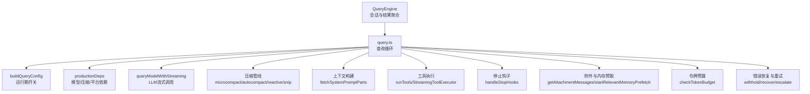
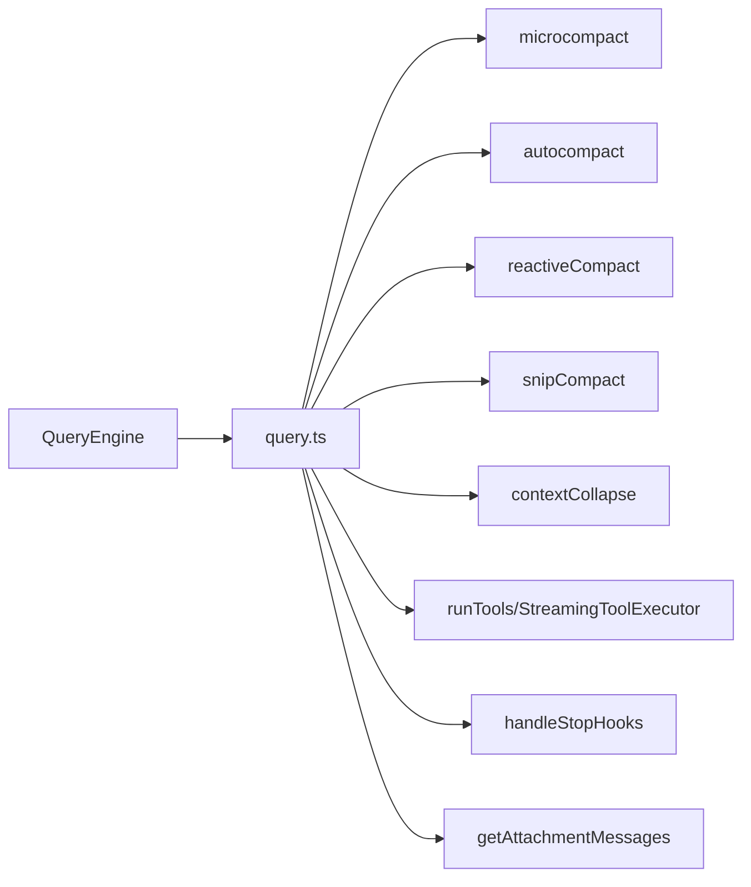

# 查询管道

<cite>
**本文引用的文件**
- [src/query.ts](file://src/query.ts)
- [src/QueryEngine.ts](file://src/QueryEngine.ts)
- [src/query/config.ts](file://src/query/config.ts)
- [src/query/deps.ts](file://src/query/deps.ts)
- [src/query/tokenBudget.ts](file://src/query/tokenBudget.ts)
- [src/query/stopHooks.ts](file://src/query/stopHooks.ts)
- [src/utils/queryContext.ts](file://src/utils/queryContext.ts)
- [src/utils/queryHelpers.ts](file://src/utils/queryHelpers.ts)
- [src/services/tools/StreamingToolExecutor.ts](file://src/services/tools/StreamingToolExecutor.ts)
- [src/services/api/claude.ts](file://src/services/api/claude.ts)
- [src/services/compact/autoCompact.ts](file://src/services/compact/autoCompact.ts)
- [src/services/compact/microCompact.ts](file://src/services/compact/microCompact.ts)
- [src/services/compact/compact.ts](file://src/services/compact/compact.ts)
- [src/services/compact/reactiveCompact.ts](file://src/services/compact/reactiveCompact.ts)
- [src/services/contextCollapse/index.js](file://src/services/contextCollapse/index.js)
- [src/services/compact/snipCompact.js](file://src/services/compact/snipCompact.js)
- [src/services/compact/snipProjection.js](file://src/services/compact/snipProjection.js)
- [src/utils/messages.js](file://src/utils/messages.js)
- [src/utils/tokens.ts](file://src/utils/tokens.ts)
- [src/utils/context.ts](file://src/utils/context.ts)
- [src/utils/api.ts](file://src/utils/api.ts)
- [src/utils/attachments.js](file://src/utils/attachments.js)
- [src/utils/hooks/postSamplingHooks.js](file://src/utils/hooks/postSamplingHooks.js)
- [src/utils/hooks.js](file://src/utils/hooks.js)
- [src/utils/sessionStorage.js](file://src/utils/sessionStorage.js)
- [src/utils/model/model.js](file://src/utils/model/model.js)
- [src/bootstrap/state.ts](file://src/bootstrap/state.ts)
- [src/services/api/errors.js](file://src/services/api/errors.js)
- [src/services/api/dumpPrompts.js](file://src/services/api/dumpPrompts.js)
- [src/services/tools/toolOrchestration.js](file://src/services/tools/toolOrchestration.js)
- [src/services/toolUseSummary/toolUseSummaryGenerator.js](file://src/services/toolUseSummary/toolUseSummaryGenerator.js)
- [src/utils/toolResultStorage.js](file://src/utils/toolResultStorage.js)
- [src/utils/headlessProfiler.js](file://src/utils/headlessProfiler.js)
- [src/utils/queryProfiler.js](file://src/utils/queryProfiler.js)
- [src/utils/debug.js](file://src/utils/debug.js)
- [src/utils/log.js](file://src/utils/log.js)
- [src/services/analytics/index.js](file://src/services/analytics/index.js)
- [src/services/analytics/growthbook.js](file://src/services/analytics/growthbook.js)
- [src/utils/abortController.js](file://src/utils/abortController.js)
- [src/utils/fileStateCache.js](file://src/utils/fileStateCache.js)
- [src/utils/fileRead.js](file://src/utils/fileRead.js)
- [src/utils/path.js](file://src/utils/path.js)
- [src/utils/file.js](file://src/utils/file.js)
- [src/utils/systemPromptType.js](file://src/utils/systemPromptType.js)
- [src/constants/querySource.js](file://src/constants/querySource.js)
- [src/utils/envUtils.js](file://src/utils/envUtils.js)
- [src/utils/systemTheme.js](file://src/utils/systemTheme.js)
- [src/utils/thinking.js](file://src/utils/thinking.js)
- [src/utils/model/model.js](file://src/utils/model/model.js)
- [src/utils/processUserInput/processUserInput.js](file://src/utils/processUserInput/processUserInput.js)
- [src/utils/permissions/filesystem.js](file://src/utils/permissions/filesystem.js)
- [src/utils/messages/mappers.js](file://src/utils/messages/mappers.js)
- [src/utils/messages/systemInit.js](file://src/utils/messages/systemInit.js)
- [src/utils/commandLifecycle.js](file://src/utils/commandLifecycle.js)
- [src/utils/messageQueueManager.js](file://src/utils/messageQueueManager.js)
- [src/utils/tasks.js](file://src/utils/tasks.js)
- [src/utils/teammate.js](file://src/utils/teammate.js)
- [src/utils/forkedAgent.js](file://src/utils/forkedAgent.js)
- [src/utils/telemetryAttributes.ts](file://src/utils/telemetryAttributes.ts)
- [src/utils/telemetry/index.js](file://src/utils/telemetry/index.js)
- [src/utils/profilerBase.ts](file://src/utils/profilerBase.ts)
- [src/utils/sinks.ts](file://src/utils/sinks.ts)
- [src/utils/streamJsonStdoutGuard.ts](file://src/utils/streamJsonStdoutGuard.ts)
- [src/utils/stream.ts](file://src/utils/stream.ts)
- [src/utils/timeout.ts](file://src/utils/timeout.ts)
- [src/utils/timeouts.ts](file://src/utils/timeouts.ts)
- [src/utils/slowOperations.ts](file://src/utils/slowOperations.ts)
- [src/utils/sequential.ts](file://src/utils/sequential.ts)
- [src/utils/combinedAbortSignal.ts](file://src/utils/combinedAbortSignal.ts)
- [src/utils/lockfile.ts](file://src/utils/lockfile.ts)
- [src/utils/heapDumpService.ts](file://src/utils/heapDumpService.ts)
- [src/utils/headlessProfiler.ts](file://src/utils/headlessProfiler.ts)
- [src/utils/heapDumpService.ts](file://src/utils/heapDumpService.ts)
- [src/utils/heapDumpService.ts](file://src/utils/heapDumpService.ts)
- [src/utils/heapDumpService.ts](file://src/utils/heapDumpService.ts)
- [src/utils/heapDumpService.ts](file://src/utils/heapDumpService.ts)
- [src/utils/heapDumpService.ts](file://src/utils/heapDumpService.ts)
- [src/utils/heapDumpService.ts](file://src/utils/heapDumpService.ts)
- [src/utils/heapDumpService.ts](file://src/utils/heapDumpService.ts)
- [src/utils/heapDumpService.ts](file://src/utils/heapDumpService.ts)
- [src/utils/heapDumpService.ts](file://src/utils/heapDumpService.ts)
- [src/utils/heapDumpService.ts](file://src/utils/heapDumpService.ts)
- [src/utils/heapDumpService.ts](file://src/utils/heapDumpService.ts)
- [src/utils/heapDumpService.ts](file://src/utils/heapDumpService.ts)
- [src/utils/heapDumpService.ts](file://src/utils/heapDumpService.ts)
- [src/utils/heapDumpService.ts](file://src/utils/heapDumpService.ts)
- [src/utils/heapDumpService.ts](file://src/utils/heapDumpService.ts)
- [src/utils/heapDumpService.ts](file://src/utils/heapDumpService.ts)
- [src/utils/heapDumpService.ts](file://src/utils/heapDumpService.ts)
- [src/utils/heapDumpService.ts](file://src/utils/heapDumpService.ts)
- [src/utils/heapDumpService.ts](file://src/utils/heapDumpService.ts)
- [src/utils/heapDumpService.ts](file://src/utils/heapDumpService.ts)
- [src/utils/heapDumpService.ts](file://src/utils/heapDumpService.ts)
- [src/utils/heapDumpService.ts](file://src/utils/heapDumpService.ts)
- [src/utils/heapDumpService.ts](file://src/utils/heapDumpService.ts)
- [src/utils/heapDumpService.ts](file://src/utils/heapDumpService.ts)
- [src/utils/heapDumpService.ts](file://src/utils/heapDumpService......)
</cite>

## 目录
1. [简介](#简介)
2. [项目结构](#项目结构)
3. [核心组件](#核心组件)
4. [架构总览](#架构总览)
5. [详细组件分析](#详细组件分析)
6. [依赖关系分析](#依赖关系分析)
7. [性能考量](#性能考量)
8. [故障排查指南](#故障排查指南)
9. [结论](#结论)
10. [附录](#附录)

## 简介
本文件系统性阐述 Claude Code 查询管道的设计与实现，覆盖查询优化、查询缓存、查询执行机制、LLM API 调用、工具调用循环、流式响应处理与重试逻辑、配置与参数管理（令牌预算、查询超时、并发控制）、性能优化策略（缓存、预取、批量）以及监控与调试工具。目标读者为性能优化工程师与系统架构师。

## 项目结构
查询管道由“查询引擎”和“查询循环”两层组成：
- 查询引擎（QueryEngine）：负责会话状态持久化、消息序列化、成本统计、结果聚合与输出、转义条件（最大轮次、预算上限、错误诊断）等。
- 查询循环（query.ts）：负责单轮对话的完整生命周期，包括上下文压缩（微压缩、自动压缩、可选折叠、可选截断）、LLM 流式调用、工具调用、停止钩子、令牌预算、恢复路径（提示过长、输出令牌限制、媒体尺寸过大）等。



图示来源
- [src/QueryEngine.ts:184-1177](file://src/QueryEngine.ts#L184-L1177)
- [src/query.ts:219-1729](file://src/query.ts#L219-L1729)
- [src/query/config.ts:29-46](file://src/query/config.ts#L29-L46)
- [src/query/deps.ts:33-40](file://src/query/deps.ts#L33-L40)
- [src/query/stopHooks.ts:65-473](file://src/query/stopHooks.ts#L65-L473)
- [src/utils/queryContext.ts:44-74](file://src/utils/queryContext.ts#L44-L74)
- [src/services/tools/StreamingToolExecutor.ts:40-71](file://src/services/tools/StreamingToolExecutor.ts#L40-L71)

章节来源
- [src/QueryEngine.ts:184-1177](file://src/QueryEngine.ts#L184-L1177)
- [src/query.ts:219-1729](file://src/query.ts#L219-L1729)

## 核心组件
- 查询配置（QueryConfig）
  - 运行期开关：流式工具执行、工具使用摘要、ANT 模式、快速模式开关等。
  - 配置快照：在查询入口一次性捕获，保证后续步骤的纯函数特性。
- 查询依赖（QueryDeps）
  - 模型调用、微压缩、自动压缩、UUID 生成器等，便于测试注入。
- 令牌预算（TokenBudget）
  - 基于阈值与边际收益判断的“继续/停止”决策，支持持续轮次与完成事件统计。
- 停止钩子（StopHooks）
  - 在每轮结束时执行的后采样钩子链路，支持阻塞错误、阻止继续、通知与摘要生成。
- 查询引擎（QueryEngine）
  - 会话级状态管理、消息持久化、成本统计、结果聚合、最大轮次与预算检查、中断控制等。

章节来源
- [src/query/config.ts:15-46](file://src/query/config.ts#L15-L46)
- [src/query/deps.ts:21-40](file://src/query/deps.ts#L21-L40)
- [src/query/tokenBudget.ts:6-94](file://src/query/tokenBudget.ts#L6-L94)
- [src/query/stopHooks.ts:65-473](file://src/query/stopHooks.ts#L65-L473)
- [src/QueryEngine.ts:184-1177](file://src/QueryEngine.ts#L184-L1177)

## 架构总览
查询管道采用“分层解耦 + 特性开关”的设计：
- 分层解耦：查询引擎负责会话与结果；查询循环负责一轮内的上下文压缩、模型调用、工具执行、钩子与恢复。
- 特性开关：通过环境变量与 Statsig 门控控制功能启用（如流式工具执行、快速模式、令牌预算等），避免无谓模块加载与死码。
- 可插拔依赖：通过生产依赖工厂注入模型调用、压缩与平台能力，便于替换与测试。

```mermaid
sequenceDiagram
participant Caller as "调用方"
participant Engine as "QueryEngine"
participant Loop as "query.ts"
participant Model as "LLM流式API"
participant Tools as "工具执行器"
participant Hooks as "停止钩子"
Caller->>Engine : submitMessage(prompt)
Engine->>Loop : query({...})
Loop->>Loop : 上下文压缩/预取/预处理
Loop->>Model : 发起流式请求
Model-->>Loop : 流式内容块
Loop->>Tools : 工具调用串行/并行
Tools-->>Loop : 工具结果
Loop->>Hooks : 结束钩子评估
Hooks-->>Loop : 阻止/继续/摘要
Loop-->>Engine : 产出消息/流事件/附件
Engine-->>Caller : SDK消息/最终结果
```

图示来源
- [src/QueryEngine.ts:209-1156](file://src/QueryEngine.ts#L209-L1156)
- [src/query.ts:241-1729](file://src/query.ts#L241-L1729)
- [src/services/tools/StreamingToolExecutor.ts:40-71](file://src/services/tools/StreamingToolExecutor.ts#L40-L71)
- [src/query/stopHooks.ts:65-473](file://src/query/stopHooks.ts#L65-L473)

## 详细组件分析

### 查询循环（query.ts）
- 生命周期与状态
  - 入口：query(params) 返回异步生成器；内部委托 queryLoop 实现。
  - 状态：State 包含消息、工具上下文、自动压缩跟踪、最大输出令牌回收计数、是否尝试过反应式压缩、当前轮次、过渡原因等。
- 上下文与压缩
  - 微压缩（microcompact）：对消息进行局部压缩，保留关键信息。
  - 自动压缩（autocompact）：基于阈值触发的全局压缩，产出摘要消息与附件。
  - 反应式压缩（reactiveCompact）：在提示过长或媒体过大时进行摘要化处理。
  - 历史截断（snipCompact）：按令牌预算进行历史截断，减少上下文长度。
  - 上下文折叠（contextCollapse）：在 REPL 中投影折叠视图，保持细粒度上下文。
- LLM 流式调用
  - 使用 prependUserContext 将用户上下文拼接到消息前；根据配置选择模型、思考配置、工具列表与代理定义。
  - 支持流式回退（FallbackTriggeredError）：当高负载导致流式失败时，丢弃孤儿消息并切换到非流式执行。
  - 提示过长/媒体过大/输出令牌限制的“暂缓”与恢复：在流中暂缓错误消息，待恢复后再呈现。
- 工具调用循环
  - 串行执行（runTools）与流式执行（StreamingToolExecutor）两种路径；后者支持并发安全与进度节流。
  - 工具结果标准化后注入消息，随后生成附件（命令队列、内存预取、技能发现等）。
- 停止钩子与恢复
  - 每轮结束后执行 handleStopHooks，产出进度、附件、阻塞错误、阻止继续信号与摘要。
  - 恢复路径：上下文折叠排水（cheap）、反应式压缩（summary）、输出令牌限制升级、最大轮次检查。
- 令牌预算与完成事件
  - 基于阈值与边际收益判断是否继续；记录完成事件（包含百分比、令牌数、是否边际递减、耗时）。
- 终止与返回
  - 返回 Terminal 对象，包含原因（完成/中止/预算/轮次限制/错误等）。

章节来源
- [src/query.ts:219-1729](file://src/query.ts#L219-L1729)
- [src/services/compact/microCompact.ts](file://src/services/compact/microCompact.ts)
- [src/services/compact/autoCompact.ts](file://src/services/compact/autoCompact.ts)
- [src/services/compact/reactiveCompact.ts](file://src/services/compact/reactiveCompact.ts)
- [src/services/compact/snipCompact.js](file://src/services/compact/snipCompact.js)
- [src/services/contextCollapse/index.js](file://src/services/contextCollapse/index.js)
- [src/services/tools/StreamingToolExecutor.ts:40-71](file://src/services/tools/StreamingToolExecutor.ts#L40-L71)
- [src/query/stopHooks.ts:65-473](file://src/query/stopHooks.ts#L65-L473)
- [src/query/tokenBudget.ts:45-94](file://src/query/tokenBudget.ts#L45-L94)

### 查询引擎（QueryEngine）
- 会话与消息管理
  - 维护 mutableMessages 与 totalUsage；支持文件历史快照、权限拒绝记录、孤儿权限处理。
- 系统提示与上下文
  - 通过 fetchSystemPromptParts 获取默认系统提示、用户上下文与系统上下文，并支持自定义与附加提示。
- 流式与结果聚合
  - 记录流事件（message_start/delta/stop）并累积用量；规范化消息输出；支持包含部分消息选项。
- 预算与轮次控制
  - USD 预算上限检查；结构化输出重试次数限制；最大轮次检查。
- 结果与诊断
  - 成功判定（assistant 文本/思考或 user 的全部 tool_result）；错误诊断（ede_diagnostic）收集内存日志水印。
- 中断与状态导出
  - 提供 interrupt()；导出消息、文件缓存、会话 ID、当前模型。

章节来源
- [src/QueryEngine.ts:184-1177](file://src/QueryEngine.ts#L184-L1177)
- [src/utils/queryContext.ts:44-74](file://src/utils/queryContext.ts#L44-L74)
- [src/utils/queryHelpers.ts:48-94](file://src/utils/queryHelpers.ts#L48-L94)

### 查询配置与依赖注入
- 运行期开关（QueryConfig）
  - 流式工具执行、工具使用摘要、ANT 模式、快速模式等。
- 依赖注入（QueryDeps）
  - 模型调用、微压缩、自动压缩、UUID 生成器；生产工厂集中管理签名同步与模块导入。

章节来源
- [src/query/config.ts:15-46](file://src/query/config.ts#L15-L46)
- [src/query/deps.ts:21-40](file://src/query/deps.ts#L21-L40)

### 停止钩子（handleStopHooks）
- 执行顺序
  - 保存缓存安全参数；模板分类（可选）；提示建议（可选）；记忆提取（可选）；自动梦境（可选）；计算机使用清理（可选）。
  - 执行 Stop 钩子链路，收集阻塞错误、阻止继续信号、钩子信息与输出；生成摘要消息与通知。
  - 若为同伴（teammate）身份，依次执行任务完成钩子与空闲钩子。
- 错误与取消
  - 捕获钩子异常并记录事件；若被中断则返回“取消”状态。

章节来源
- [src/query/stopHooks.ts:65-473](file://src/query/stopHooks.ts#L65-L473)

### 令牌预算（TokenBudget）
- 决策规则
  - 当 agentId 存在或预算为空/无效时直接停止；否则比较当前轮次令牌占比与阈值；连续多次增长过慢触发边际收益判断；否则继续。
- 完成事件
  - 记录轮次次数、占比、令牌数、预算、是否边际递减、耗时等指标。

章节来源
- [src/query/tokenBudget.ts:45-94](file://src/query/tokenBudget.ts#L45-L94)

### 流式工具执行器（StreamingToolExecutor）
- 并发与安全
  - 并发安全工具可并行执行；非并发工具独占执行；错误传播与兄弟进程终止。
- 回退与丢弃
  - 流式回退时丢弃未完成任务并创建新执行器，避免孤儿结果泄漏。
- 进度节流
  - 对 bash/powershell 进度消息进行节流与去重，降低噪声。

章节来源
- [src/services/tools/StreamingToolExecutor.ts:40-71](file://src/services/tools/StreamingToolExecutor.ts#L40-L71)

## 依赖关系分析
- 查询循环对压缩模块的依赖
  - microcompact/autocompact/reactive/snip 与上下文折叠相互协作，形成多层上下文瘦身。
- 查询循环对工具执行的依赖
  - runTools 与 StreamingToolExecutor 提供串行与流式两种执行路径，配合权限与并发控制。
- 查询循环对钩子与附件的依赖
  - 停止钩子、内存预取、技能发现、命令队列等通过附件注入，增强上下文与可观测性。
- 查询引擎对查询循环的依赖
  - QueryEngine 负责会话状态、成本统计、结果聚合与转义条件，query.ts 负责每轮执行细节。



图示来源
- [src/query.ts:412-447](file://src/query.ts#L412-L447)
- [src/query.ts:1380-1408](file://src/query.ts#L1380-L1408)
- [src/query/stopHooks.ts:65-473](file://src/query/stopHooks.ts#L65-L473)
- [src/QueryEngine.ts:675-1049](file://src/QueryEngine.ts#L675-L1049)

## 性能考量
- 查询优化
  - 上下文压缩：微压缩优先，自动压缩按阈值触发，反应式压缩在过载时兜底；历史截断减少冗余。
  - 令牌预算：动态“继续/停止”决策，避免无效轮次；完成事件用于统计与调参。
  - 流式回退：高负载时切换非流式，确保稳定性。
- 缓存与预取
  - 缓存安全参数（CacheSafeParams）：在主循环与侧问之间共享一致的缓存键前缀。
  - 内存预取：在每轮开始与工具执行后进行，过滤重复并合并结果。
  - 技能发现预取：在模型流式期间并行发现，提升命中率。
- 批量与并发
  - 工具执行器支持并发安全工具并行；非并发工具串行，避免资源竞争。
  - 流式进度节流：降低高频更新带来的传输与渲染压力。
- 监控与可观测性
  - 多处埋点事件（tengu_*）记录链路耗时、令牌使用、压缩效果、钩子行为等。
  - Profiler checkpoint 与 headless profiler 用于端到端延迟分析。

章节来源
- [src/query.ts:301-304](file://src/query.ts#L301-L304)
- [src/query.ts:331-335](file://src/query.ts#L331-L335)
- [src/query.ts:1600-1614](file://src/query.ts#L1600-L1614)
- [src/query.ts:1620-1628](file://src/query.ts#L1620-L1628)
- [src/utils/queryProfiler.js](file://src/utils/queryProfiler.js)
- [src/utils/headlessProfiler.js](file://src/utils/headlessProfiler.js)

## 故障排查指南
- 常见错误类型与恢复
  - 提示过长：先尝试上下文折叠排水，再尝试反应式压缩；仍失败则呈现错误并记录。
  - 输出令牌限制：首次尝试扩大输出令牌上限，多次失败后注入恢复消息并允许用户续传。
  - 媒体尺寸过大：反应式压缩剥离媒体后重试；若已尝试过则直接呈现错误。
  - 图像/缩放错误：以用户友好消息呈现并终止。
- 中断与取消
  - 用户中断：生成中断消息；流式工具执行器生成合成工具结果，避免消息不匹配。
  - 子代理中断：在特定特性下进行计算机使用清理。
- 诊断与日志
  - 错误诊断（ede_diagnostic）：基于内存日志水印输出诊断信息。
  - 事件埋点：tengu_query_error、tengu_token_budget_completed、tengu_model_fallback_triggered 等。
  - 调试输出：logForDebugging、logAntError 提供详细堆栈与上下文。

章节来源
- [src/query.ts:1062-1183](file://src/query.ts#L1062-L1183)
- [src/query.ts:1185-1256](file://src/query.ts#L1185-L1256)
- [src/query.ts:1015-1052](file://src/query.ts#L1015-L1052)
- [src/QueryEngine.ts:1082-1118](file://src/QueryEngine.ts#L1082-L1118)
- [src/utils/debug.js](file://src/utils/debug.js)
- [src/utils/log.js](file://src/utils/log.js)

## 结论
该查询管道通过“查询引擎 + 查询循环”的分层设计，结合特性开关、可插拔依赖与多层上下文压缩，实现了稳定、可观测且可扩展的 LLM 推理与工具调用流水线。令牌预算、流式回退、恢复路径与钩子链路共同保障了在高负载与复杂任务下的鲁棒性与性能。建议在生产环境中启用必要的压缩与预取策略，并结合埋点与 Profiler 进行持续优化。

## 附录

### 查询配置与参数管理
- 令牌预算
  - 通过 getCurrentTurnTokenBudget 与 getTurnOutputTokens 获取当前轮次预算与输出令牌；checkTokenBudget 判定继续或停止。
- 最大轮次与预算
  - QueryEngine 在每轮迭代后检查 maxTurns 与 maxBudgetUsd，必要时提前终止并输出结果。
- 快速模式与模型回退
  - 根据运行期开关决定是否启用快速模式；当流式回退触发时，切换到备用模型并记录事件。
- 超时与并发
  - 通过 AbortController 与工具执行器的子中断控制器实现细粒度取消；流式进度节流降低并发压力。

章节来源
- [src/query/tokenBudget.ts:45-94](file://src/query/tokenBudget.ts#L45-L94)
- [src/QueryEngine.ts:971-1002](file://src/QueryEngine.ts#L971-L1002)
- [src/QueryEngine.ts:1004-1048](file://src/QueryEngine.ts#L1004-L1048)
- [src/query.ts:659-708](file://src/query.ts#L659-L708)
- [src/query.ts:893-953](file://src/query.ts#L893-L953)
- [src/utils/abortController.js](file://src/utils/abortController.js)
- [src/services/tools/StreamingToolExecutor.ts:40-71](file://src/services/tools/StreamingToolExecutor.ts#L40-L71)

### 查询性能优化策略
- 缓存与键前缀
  - 使用 buildQueryConfig 与 buildSideQuestionFallbackParams 生成一致的缓存键前缀，提升缓存命中率。
- 预取与批处理
  - 内存预取与技能发现预取并行；工具执行器批处理结果并按序发出。
- 压缩策略
  - 微压缩优先，自动压缩按阈值触发；反应式压缩与历史截断作为兜底。
- 监控与调优
  - 使用 queryCheckpoint 与 headlessProfilerCheckpoint 记录关键节点耗时；结合 tengu_* 事件进行回归分析。

章节来源
- [src/query/config.ts:29-46](file://src/query/config.ts#L29-L46)
- [src/utils/queryContext.ts:88-179](file://src/utils/queryContext.ts#L88-L179)
- [src/query.ts:412-447](file://src/query.ts#L412-L447)
- [src/query.ts:1600-1628](file://src/query.ts#L1600-L1628)
- [src/utils/queryProfiler.js](file://src/utils/queryProfiler.js)
- [src/utils/headlessProfiler.js](file://src/utils/headlessProfiler.js)

### 查询系统的监控与调试工具
- 事件埋点
  - tengu_query_error、tengu_token_budget_completed、tengu_model_fallback_triggered、tengu_auto_compact_succeeded 等。
- Profiler
  - queryCheckpoint 与 headlessProfilerCheckpoint 用于端到端与关键阶段耗时分析。
- 调试输出
  - logForDebugging、logAntError、ede_diagnostic 用于定位问题与回归分析。
- 日志与转储
  - 内存日志水印、堆转储服务、慢操作检测等辅助工具。

章节来源
- [src/query.ts:959-996](file://src/query.ts#L959-L996)
- [src/query.ts:1349-1354](file://src/query.ts#L1349-L1354)
- [src/utils/queryProfiler.js](file://src/utils/queryProfiler.js)
- [src/utils/headlessProfiler.js](file://src/utils/headlessProfiler.js)
- [src/utils/debug.js](file://src/utils/debug.js)
- [src/utils/log.js](file://src/utils/log.js)
- [src/utils/heapDumpService.ts](file://src/utils/heapDumpService.ts)