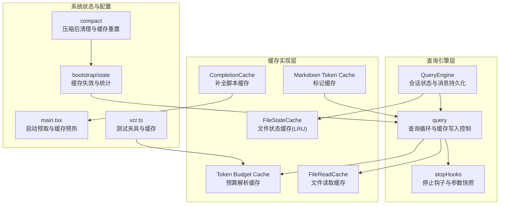
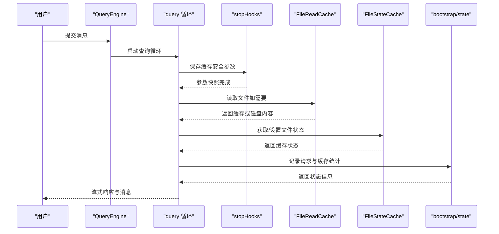
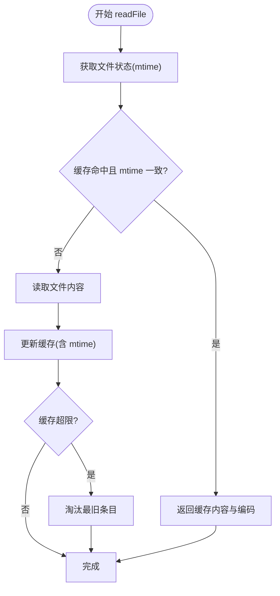
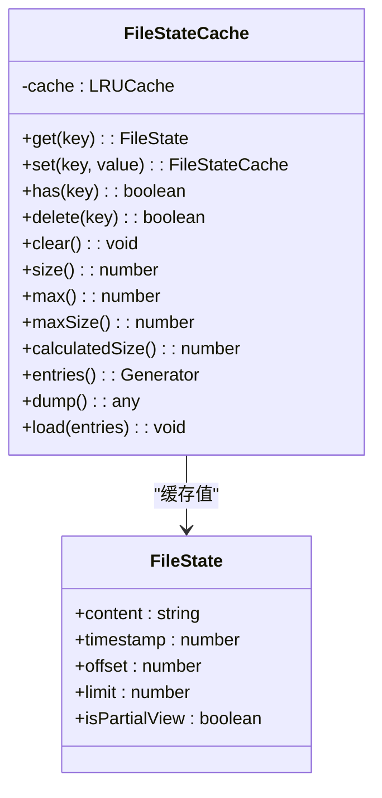
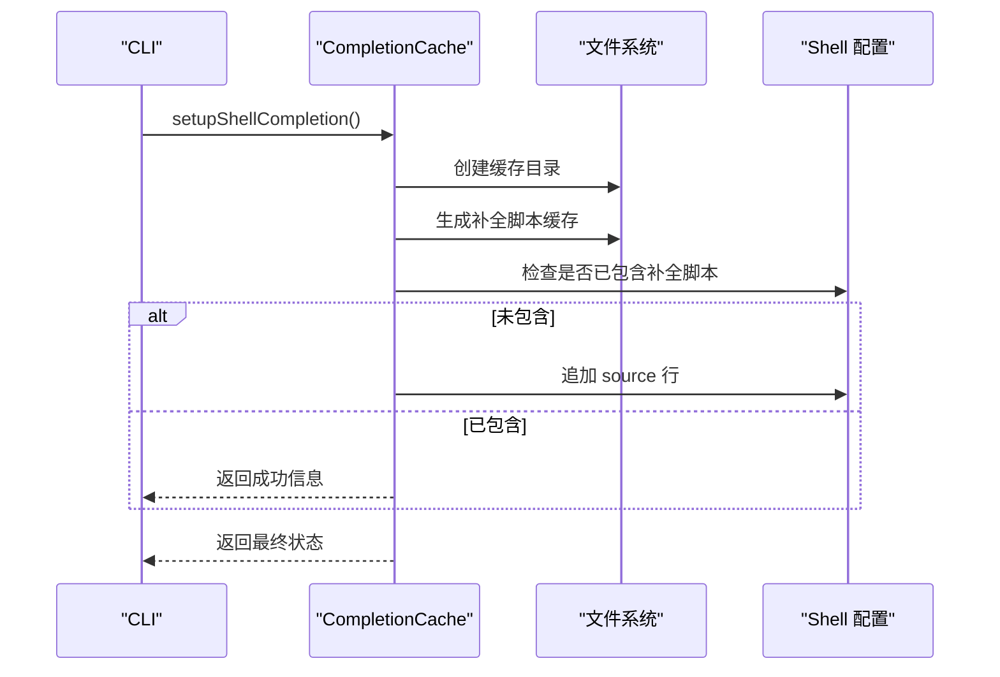
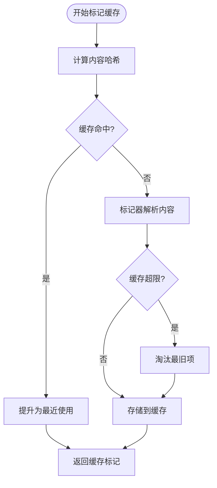
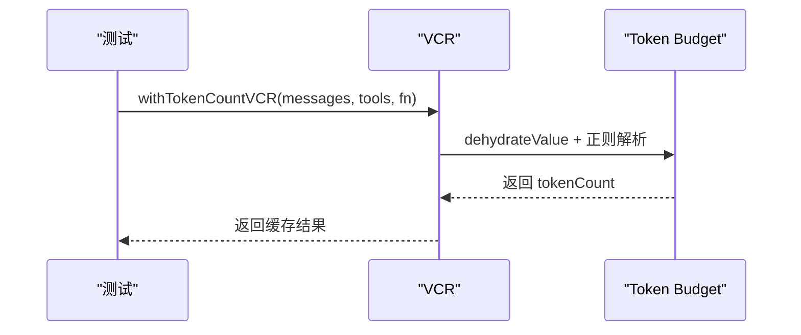
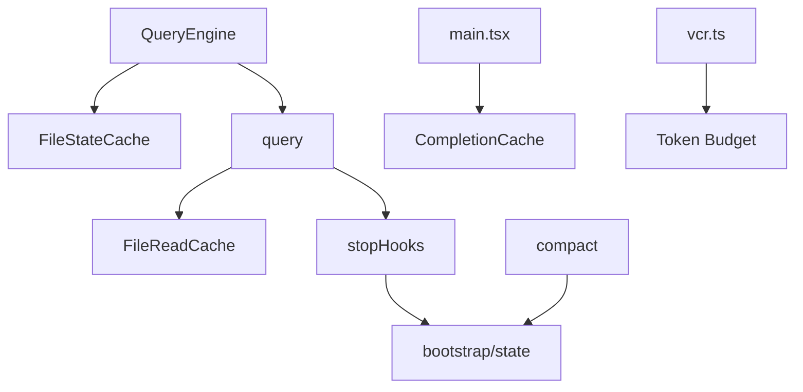

# 查询缓存机制

<cite>
**本文档引用的文件**
- [src/utils/fileReadCache.ts](file://src/utils/fileReadCache.ts)
- [src/utils/fileStateCache.ts](file://src/utils/fileStateCache.ts)
- [src/utils/completionCache.ts](file://src/utils/completionCache.ts)
- [src/components/Markdown.tsx](file://src/components/Markdown.tsx)
- [src/QueryEngine.ts](file://src/QueryEngine.ts)
- [src/query.ts](file://src/query.ts)
- [src/query/stopHooks.ts](file://src/query/stopHooks.ts)
- [src/bootstrap/state.ts](file://src/bootstrap/state.ts)
- [src/main.tsx](file://src/main.tsx)
- [src/commands/compact/compact.ts](file://src/commands/compact/compact.ts)
- [src/services/vcr.ts](file://src/services/vcr.ts)
</cite>

## 目录
1. [简介](#简介)
2. [项目结构](#项目结构)
3. [核心组件](#核心组件)
4. [架构概览](#架构概览)
5. [详细组件分析](#详细组件分析)
6. [依赖关系分析](#依赖关系分析)
7. [性能考量](#性能考量)
8. [故障排除指南](#故障排除指南)
9. [结论](#结论)

## 简介

本文件深入解析该代码库中的查询缓存机制，涵盖查询管道中的缓存架构设计、层次结构、策略与失效机制。重点包括：

- 完成缓存（命令行补全缓存）
- 文件读取缓存（文件内容缓存）
- 令牌预算缓存（提示词预算解析缓存）
- Markdown 标记缓存（渲染性能优化）

我们将详细说明不同缓存的应用场景、配置与管理方法（大小限制、过期策略、内存回收）、命中率优化与性能调优技术，并提供监控指标与故障诊断方法。

## 项目结构

查询缓存机制分布在多个模块中，围绕查询引擎与工具执行形成完整的缓存体系：

**图表来源**
- [src/QueryEngine.ts:184-207](file://src/QueryEngine.ts#L184-L207)
- [src/query.ts:219-239](file://src/query.ts#L219-L239)
- [src/query/stopHooks.ts:65-98](file://src/query/stopHooks.ts#L65-L98)
- [src/utils/fileReadCache.ts:14-68](file://src/utils/fileReadCache.ts#L14-L68)
- [src/utils/fileStateCache.ts:30-93](file://src/utils/fileStateCache.ts#L30-L93)
- [src/utils/completionCache.ts:75-134](file://src/utils/completionCache.ts#L75-L134)
- [src/components/Markdown.tsx:50-71](file://src/components/Markdown.tsx#L50-L71)
- [src/bootstrap/state.ts:236-257](file://src/bootstrap/state.ts#L236-L257)
- [src/main.tsx:2338-2353](file://src/main.tsx#L2338-L2353)
- [src/commands/compact/compact.ts:48-83](file://src/commands/compact/compact.ts#L48-L83)
- [src/services/vcr.ts:382-406](file://src/services/vcr.ts#L382-L406)

**章节来源**
- [src/QueryEngine.ts:184-207](file://src/QueryEngine.ts#L184-L207)
- [src/query.ts:219-239](file://src/query.ts#L219-L239)
- [src/utils/fileReadCache.ts:14-68](file://src/utils/fileReadCache.ts#L14-L68)
- [src/utils/fileStateCache.ts:30-93](file://src/utils/fileStateCache.ts#L30-L93)
- [src/utils/completionCache.ts:75-134](file://src/utils/completionCache.ts#L75-L134)
- [src/components/Markdown.tsx:50-71](file://src/components/Markdown.tsx#L50-L71)
- [src/bootstrap/state.ts:236-257](file://src/bootstrap/state.ts#L236-L257)
- [src/main.tsx:2338-2353](file://src/main.tsx#L2338-L2353)
- [src/commands/compact/compact.ts:48-83](file://src/commands/compact/compact.ts#L48-L83)
- [src/services/vcr.ts:382-406](file://src/services/vcr.ts#L382-L406)

## 核心组件

本节概述各类缓存组件及其职责与特性。

- 文件读取缓存（FileReadCache）
  - 类型：内存映射缓存
  - 特性：基于修改时间自动失效；最大条目数限制；支持清空与逐项失效
  - 场景：频繁读取同一文件内容时避免重复磁盘 IO
  - 关键接口：readFile、clear、invalidate、getStats

- 文件状态缓存（FileStateCache）
  - 类型：LRU 缓存（带字节大小限制）
  - 特性：路径标准化；条目与字节大小双重限制；支持克隆与合并
  - 场景：跨工具共享文件状态，减少重复读取与解析
  - 关键接口：get、set、has、delete、clear、size/max/maxSize/calculatedSize、entries/dump/load

- 补全脚本缓存（CompletionCache）
  - 类型：文件系统缓存 + 配置文件注入
  - 特性：按 Shell 自动检测与缓存生成；更新后重新生成缓存；失败时回退到手动安装提示
  - 场景：加速命令行补全加载，提升交互体验
  - 关键接口：setupShellCompletion、regenerateCompletionCache

- Markdown 标记缓存（Markdown Token Cache）
  - 类型：内存映射缓存（LRU 风格）
  - 特性：基于内容哈希；命中时提升至最近使用；超过阈值淘汰最旧项
  - 场景：UI 渲染中对相同 Markdown 内容的标记复用
  - 关键接口：内部缓存对象与淘汰逻辑

- 令牌预算缓存（Token Budget Cache）
  - 类型：解析结果缓存（通过 VCR 测试夹具）
  - 特性：去水化处理以稳定夹具键；支持测试环境下的稳定命中
  - 场景：在测试中稳定计算令牌预算，避免因时间戳等不稳定因素导致夹具不命中
  - 关键接口：withTokenCountVCR、parseTokenBudget、findTokenBudgetPositions

**章节来源**
- [src/utils/fileReadCache.ts:14-68](file://src/utils/fileReadCache.ts#L14-L68)
- [src/utils/fileStateCache.ts:30-93](file://src/utils/fileStateCache.ts#L30-L93)
- [src/utils/completionCache.ts:75-134](file://src/utils/completionCache.ts#L75-L134)
- [src/components/Markdown.tsx:50-71](file://src/components/Markdown.tsx#L50-L71)
- [src/services/vcr.ts:382-406](file://src/services/vcr.ts#L382-L406)

## 架构概览

查询缓存架构围绕查询引擎展开，结合系统状态与工具执行，形成多层缓存协同：

**图表来源**
- [src/QueryEngine.ts:209-239](file://src/QueryEngine.ts#L209-L239)
- [src/query.ts:675-686](file://src/query.ts#L675-L686)
- [src/query/stopHooks.ts:96-98](file://src/query/stopHooks.ts#L96-L98)
- [src/utils/fileReadCache.ts:22-68](file://src/utils/fileReadCache.ts#L22-L68)
- [src/utils/fileStateCache.ts:41-68](file://src/utils/fileStateCache.ts#L41-L68)
- [src/bootstrap/state.ts:244-256](file://src/bootstrap/state.ts#L244-L256)

**章节来源**
- [src/QueryEngine.ts:209-239](file://src/QueryEngine.ts#L209-L239)
- [src/query.ts:675-686](file://src/query.ts#L675-L686)
- [src/query/stopHooks.ts:96-98](file://src/query/stopHooks.ts#L96-L98)
- [src/bootstrap/state.ts:244-256](file://src/bootstrap/state.ts#L244-L256)

## 详细组件分析

### 文件读取缓存（FileReadCache）

- 设计要点
  - 基于修改时间（mtime）的自动失效，确保缓存一致性
  - 最大条目数限制（默认 1000），超出时淘汰最早项
  - 支持清空与逐项失效，便于测试与内存管理

- 复杂度分析
  - 读取：平均 O(1)，最坏 O(n)（Map 迭代删除）
  - 写入：O(1)
  - 失效：O(1)

- 性能影响
  - 显著降低重复文件读取的 IO 成本
  - 在频繁编辑同一文件的场景下保持缓存命中率

**图表来源**
- [src/utils/fileReadCache.ts:22-68](file://src/utils/fileReadCache.ts#L22-L68)

**章节来源**
- [src/utils/fileReadCache.ts:14-68](file://src/utils/fileReadCache.ts#L14-L68)

### 文件状态缓存（FileStateCache）

- 设计要点
  - 使用 LRU 算法，支持条目数量与字节大小双重限制
  - 路径标准化（normalize）保证相对/绝对路径的一致命中
  - 支持克隆、合并与序列化（dump/load），便于会话迁移与压缩

- 复杂度分析
  - get/set：O(1)
  - 删除/清空：O(1)
  - dump/load：O(n)

- 性能影响
  - 控制内存占用上限（默认 25MB），避免大文件导致内存膨胀
  - 通过合并策略在多工具间共享最新状态

**图表来源**
- [src/utils/fileStateCache.ts:30-93](file://src/utils/fileStateCache.ts#L30-L93)

**章节来源**
- [src/utils/fileStateCache.ts:30-93](file://src/utils/fileStateCache.ts#L30-L93)

### 补全脚本缓存（CompletionCache）

- 设计要点
  - 检测当前 Shell 并生成对应补全脚本缓存
  - 将缓存脚本注入到 Shell 的配置文件中
  - 更新后重新生成缓存，确保与新二进制同步

- 复杂度分析
  - 生成缓存：O(1)（写文件）
  - 注入配置：O(1)（读写配置文件）

- 性能影响
  - 减少每次启动时的补全脚本生成开销
  - 提升命令行交互响应速度

**图表来源**
- [src/utils/completionCache.ts:75-134](file://src/utils/completionCache.ts#L75-L134)

**章节来源**
- [src/utils/completionCache.ts:75-134](file://src/utils/completionCache.ts#L75-L134)

### Markdown 标记缓存（Markdown Token Cache）

- 设计要点
  - 基于内容哈希的缓存键
  - 命中时提升至最近使用，淘汰最旧项
  - 限制最大条目数，避免内存增长

- 复杂度分析
  - 查找：O(1)
  - 插入/提升：O(1)
  - 淘汰：O(1)

- 性能影响
  - 在 UI 中对重复 Markdown 内容进行标记复用，减少渲染成本

**图表来源**
- [src/components/Markdown.tsx:50-71](file://src/components/Markdown.tsx#L50-L71)

**章节来源**
- [src/components/Markdown.tsx:50-71](file://src/components/Markdown.tsx#L50-L71)

### 令牌预算缓存（Token Budget Cache）

- 设计要点
  - 通过 VCR（Fixture）机制稳定夹具键，避免时间戳等不稳定因素
  - 在测试环境中对令牌预算解析进行缓存，提高稳定性
  - 支持多种预算表达式格式的解析与位置定位

- 复杂度分析
  - 解析：O(n)（字符串匹配与正则）
  - 位置定位：O(n)（全局匹配）

- 性能影响
  - 在测试中显著提升夹具命中率，减少重复计算

**图表来源**
- [src/services/vcr.ts:382-406](file://src/services/vcr.ts#L382-L406)
- [src/utils/tokenBudget.ts:21-64](file://src/utils/tokenBudget.ts#L21-L64)

**章节来源**
- [src/services/vcr.ts:382-406](file://src/services/vcr.ts#L382-L406)
- [src/utils/tokenBudget.ts:21-64](file://src/utils/tokenBudget.ts#L21-L64)

## 依赖关系分析

查询缓存机制的依赖关系如下：

**图表来源**
- [src/QueryEngine.ts:184-207](file://src/QueryEngine.ts#L184-L207)
- [src/query.ts:219-239](file://src/query.ts#L219-L239)
- [src/query/stopHooks.ts:65-98](file://src/query/stopHooks.ts#L65-L98)
- [src/utils/fileReadCache.ts:14-68](file://src/utils/fileReadCache.ts#L14-L68)
- [src/utils/fileStateCache.ts:30-93](file://src/utils/fileStateCache.ts#L30-L93)
- [src/utils/completionCache.ts:75-134](file://src/utils/completionCache.ts#L75-L134)
- [src/bootstrap/state.ts:236-257](file://src/bootstrap/state.ts#L236-L257)
- [src/main.tsx:2338-2353](file://src/main.tsx#L2338-L2353)
- [src/commands/compact/compact.ts:48-83](file://src/commands/compact/compact.ts#L48-L83)
- [src/services/vcr.ts:382-406](file://src/services/vcr.ts#L382-L406)

**章节来源**
- [src/QueryEngine.ts:184-207](file://src/QueryEngine.ts#L184-L207)
- [src/query.ts:219-239](file://src/query.ts#L219-L239)
- [src/query/stopHooks.ts:65-98](file://src/query/stopHooks.ts#L65-L98)
- [src/bootstrap/state.ts:236-257](file://src/bootstrap/state.ts#L236-L257)
- [src/main.tsx:2338-2353](file://src/main.tsx#L2338-L2353)
- [src/commands/compact/compact.ts:48-83](file://src/commands/compact/compact.ts#L48-L83)
- [src/services/vcr.ts:382-406](file://src/services/vcr.ts#L382-L406)

## 性能考量

- 命中率优化
  - 文件读取缓存：通过 mtime 自动失效与最大条目限制平衡一致性与内存占用
  - 文件状态缓存：LRU 与字节大小双重限制，适合大文件场景
  - Markdown 标记缓存：MRU 提升命中，避免频繁重新解析
  - 令牌预算缓存：VCR 去水化处理，稳定夹具键

- 内存回收
  - FileReadCache：超限时淘汰最旧条目
  - FileStateCache：LRU 与字节大小限制共同作用
  - Markdown Token Cache：固定最大条目数

- 启动预热
  - 启动时后台预取与缓存预热，减少首次查询延迟

- 压缩后的缓存重置
  - 成功压缩后清除相关缓存，避免陈旧数据影响后续查询

**章节来源**
- [src/utils/fileReadCache.ts:60-68](file://src/utils/fileReadCache.ts#L60-L68)
- [src/utils/fileStateCache.ts:34-38](file://src/utils/fileStateCache.ts#L34-L38)
- [src/components/Markdown.tsx:64-70](file://src/components/Markdown.tsx#L64-L70)
- [src/main.tsx:2338-2353](file://src/main.tsx#L2338-L2353)
- [src/commands/compact/compact.ts:63-75](file://src/commands/compact/compact.ts#L63-L75)

## 故障排除指南

- 缓存未命中
  - 检查文件是否被修改（mtime 不一致触发失效）
  - 确认路径是否标准化（FileStateCache 使用 normalize）
  - 验证缓存大小限制是否导致淘汰

- 缓存异常增大
  - 检查文件状态缓存的字节大小限制配置
  - 监控 Markdown 缓存的最大条目数

- 启动预热无效
  - 确认后台预取开关与节流参数
  - 检查环境变量与功能开关

- 压缩后缓存不一致
  - 确认压缩后清理流程是否执行
  - 检查缓存重置标志位

**章节来源**
- [src/utils/fileReadCache.ts:35-44](file://src/utils/fileReadCache.ts#L35-L44)
- [src/utils/fileStateCache.ts:34-38](file://src/utils/fileStateCache.ts#L34-L38)
- [src/bootstrap/state.ts:244-256](file://src/bootstrap/state.ts#L244-L256)
- [src/main.tsx:2338-2353](file://src/main.tsx#L2338-L2353)
- [src/commands/compact/compact.ts:63-75](file://src/commands/compact/compact.ts#L63-L75)

## 结论

该查询缓存机制通过多层缓存设计实现了高效、稳定的查询性能。文件读取与状态缓存有效减少了 IO 与解析成本，补全脚本缓存提升了交互体验，令牌预算缓存增强了测试稳定性。配合启动预热与压缩后的缓存重置，系统在长时间运行中保持良好的性能与一致性。建议在生产环境中根据实际负载调整缓存大小与淘汰策略，并持续监控缓存命中率与内存使用情况以优化性能。