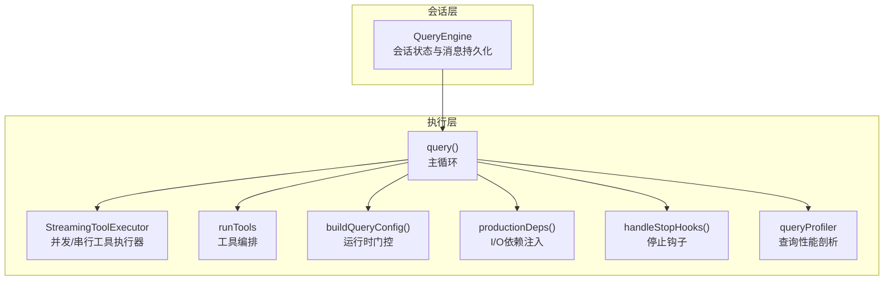
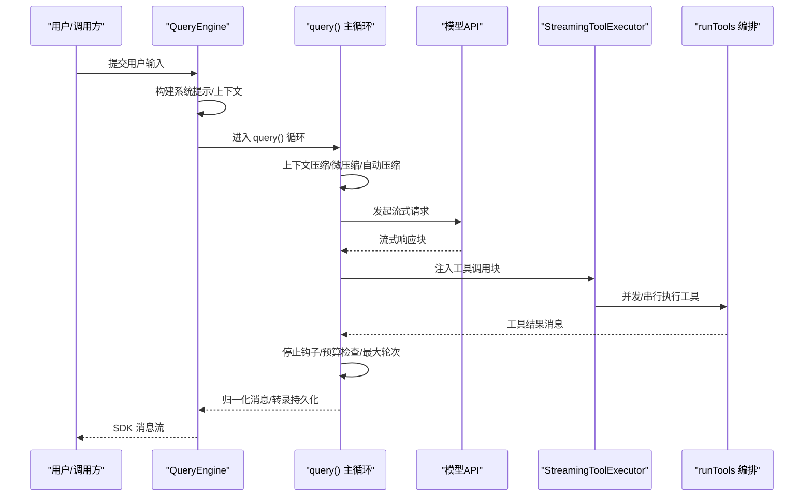
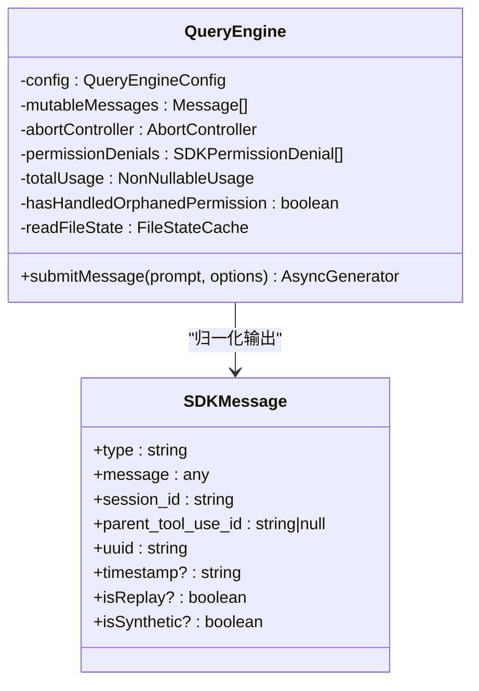
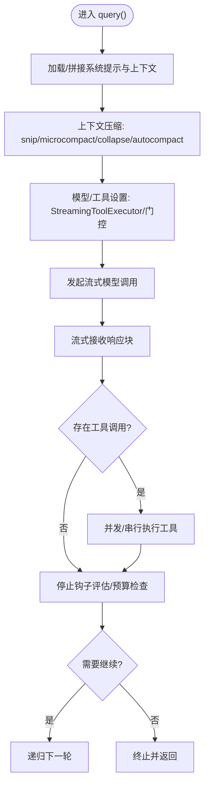
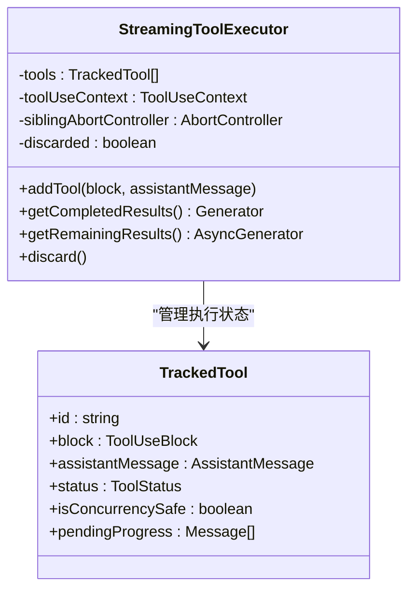
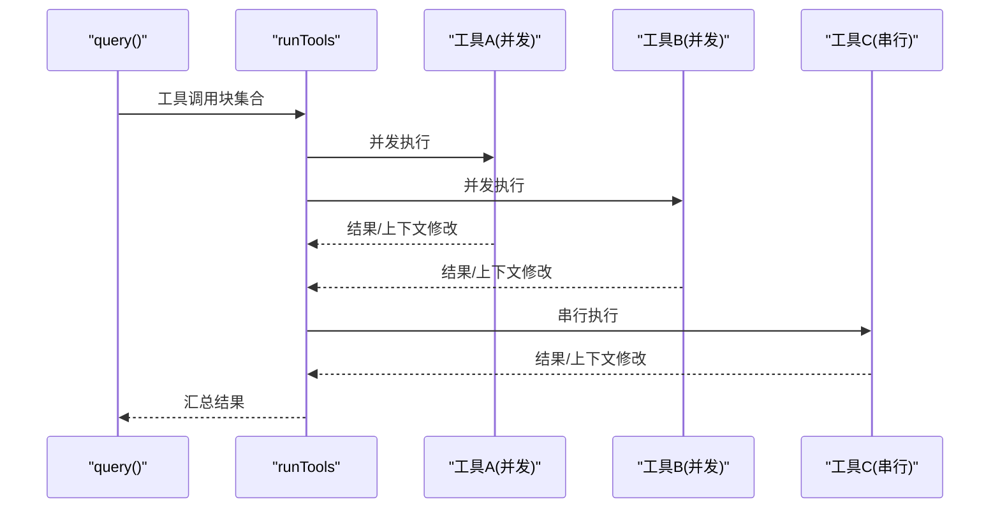
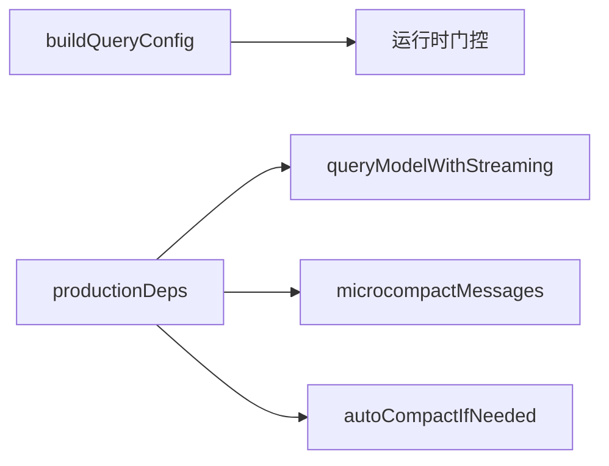
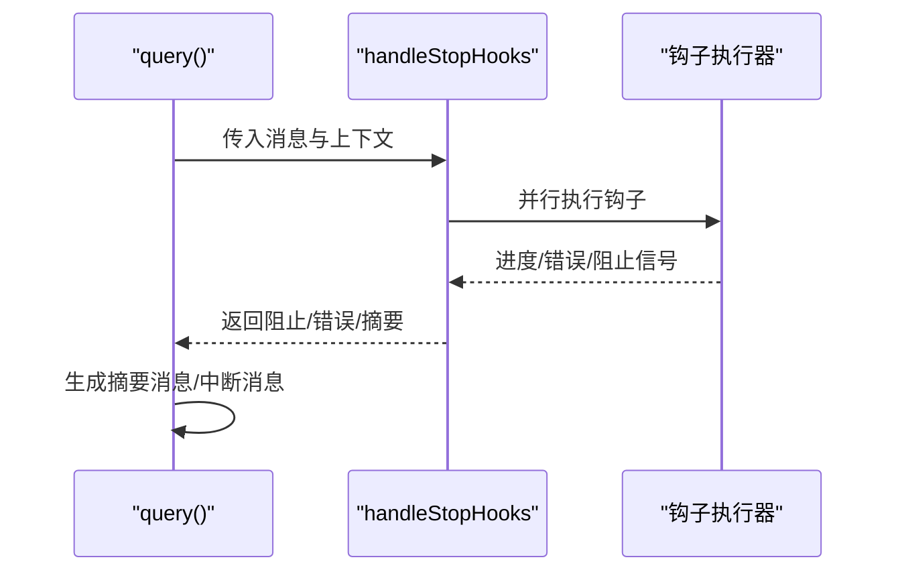
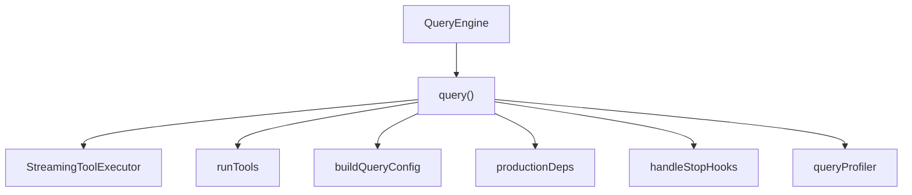

# 查询执行循环

<cite>
**本文档引用的文件**
- [src/query.ts](file://src/query.ts)
- [src/QueryEngine.ts](file://src/QueryEngine.ts)
- [src/services/tools/StreamingToolExecutor.ts](file://src/services/tools/StreamingToolExecutor.ts)
- [src/services/tools/toolOrchestration.ts](file://src/services/tools/toolOrchestration.ts)
- [src/query/config.ts](file://src/query/config.ts)
- [src/query/deps.ts](file://src/query/deps.ts)
- [src/query/stopHooks.ts](file://src/query/stopHooks.ts)
- [src/utils/queryProfiler.ts](file://src/utils/queryProfiler.ts)
- [src/utils/queryHelpers.ts](file://src/utils/queryHelpers.ts)
- [src/query/tokenBudget.ts](file://src/query/tokenBudget.ts)
</cite>

## 目录
1. [简介](#简介)
2. [项目结构](#项目结构)
3. [核心组件](#核心组件)
4. [架构总览](#架构总览)
5. [详细组件分析](#详细组件分析)
6. [依赖关系分析](#依赖关系分析)
7. [性能考量](#性能考量)
8. [故障排查指南](#故障排查指南)
9. [结论](#结论)

## 简介
本文件系统性阐述查询执行循环（Query Execution Loop）的设计与实现，覆盖从用户输入到模型响应、工具执行、状态管理、异步处理与流式输出、错误恢复与终止条件等全链路。目标读者为性能工程师与系统开发者，提供可操作的技术指导与优化建议。

## 项目结构
查询执行循环由两层协作构成：
- QueryEngine：会话级生命周期与状态持久化，负责系统提示构建、权限追踪、转录记录与结果归一化输出。
- query.ts 中的 query 函数：核心执行循环，负责上下文压缩、模型调用、工具执行、停止钩子、预算控制与递归推进。

图表来源
- [src/QueryEngine.ts](file://src/QueryEngine.ts)
- [src/query.ts](file://src/query.ts)
- [src/services/tools/StreamingToolExecutor.ts](file://src/services/tools/StreamingToolExecutor.ts)
- [src/services/tools/toolOrchestration.ts](file://src/services/tools/toolOrchestration.ts)
- [src/query/config.ts](file://src/query/config.ts)
- [src/query/deps.ts](file://src/query/deps.ts)
- [src/query/stopHooks.ts](file://src/query/stopHooks.ts)
- [src/utils/queryProfiler.ts](file://src/utils/queryProfiler.ts)

章节来源
- [src/QueryEngine.ts](file://src/QueryEngine.ts)
- [src/query.ts](file://src/query.ts)

## 核心组件
- QueryEngine：封装一次会话的完整生命周期，负责系统提示构建、权限追踪、转录持久化、消息归一化与 SDK 输出桥接。
- query 函数：主执行循环，包含上下文压缩、模型调用、工具执行、停止钩子、预算控制与递归推进。
- StreamingToolExecutor：在流式模型响应期间并发/串行执行工具，维护进度消息与中断传播。
- 工具编排 runTools：按工具并发安全属性分批执行，支持并发与串行混合策略。
- 配置与依赖：buildQueryConfig 构建运行时门控；productionDeps 注入 I/O 依赖以支持测试替身。
- 停止钩子：在每轮结束时执行，支持阻断继续、错误注入与摘要生成。
- 性能剖析：queryProfiler 提供端到端时间线与阶段耗时统计。
- 辅助工具：queryHelpers 提供消息归一化、孤儿权限处理、文件缓存提取等。

章节来源
- [src/QueryEngine.ts](file://src/QueryEngine.ts)
- [src/query.ts](file://src/query.ts)
- [src/services/tools/StreamingToolExecutor.ts](file://src/services/tools/StreamingToolExecutor.ts)
- [src/services/tools/toolOrchestration.ts](file://src/services/tools/toolOrchestration.ts)
- [src/query/config.ts](file://src/query/config.ts)
- [src/query/deps.ts](file://src/query/deps.ts)
- [src/query/stopHooks.ts](file://src/query/stopHooks.ts)
- [src/utils/queryProfiler.ts](file://src/utils/queryProfiler.ts)
- [src/utils/queryHelpers.ts](file://src/utils/queryHelpers.ts)

## 架构总览
查询执行循环采用“会话-循环”双层设计：
- 会话层（QueryEngine）：负责系统提示构建、权限追踪、转录持久化与 SDK 消息归一化。
- 循环层（query）：负责上下文压缩、模型调用、工具执行、停止钩子、预算控制与递归推进。

图表来源
- [src/QueryEngine.ts](file://src/QueryEngine.ts)
- [src/query.ts](file://src/query.ts)
- [src/services/tools/StreamingToolExecutor.ts](file://src/services/tools/StreamingToolExecutor.ts)
- [src/services/tools/toolOrchestration.ts](file://src/services/tools/toolOrchestration.ts)

## 详细组件分析

### QueryEngine：会话生命周期与消息归一化
- 系统提示构建：从工具、模型、工作目录、MCP 客户端与自定义/附加系统提示组装最终系统提示。
- 权限追踪：包装 canUseTool，记录拒绝原因以便 SDK 报告。
- 转录持久化：在进入循环前写入用户消息，保证中断后仍可恢复。
- SDK 归一化：将内部消息转换为 SDK 兼容格式，过滤空内容，处理合成消息与工具结果映射。
- 异常与孤儿权限：处理孤儿权限场景，确保工具调用前后历史一致。

图表来源
- [src/QueryEngine.ts](file://src/QueryEngine.ts)
- [src/utils/queryHelpers.ts](file://src/utils/queryHelpers.ts)

章节来源
- [src/QueryEngine.ts](file://src/QueryEngine.ts)
- [src/utils/queryHelpers.ts](file://src/utils/queryHelpers.ts)

### query 函数：主执行循环
- 状态管理：使用 State 结构跨迭代保持消息、工具上下文、自动压缩跟踪、最大输出令牌恢复计数、轮次计数等。
- 上下文压缩：按序执行 snip、microcompact、contextCollapse、autocompact，并产出边界消息。
- 模型调用：prepend 用户上下文与系统提示，支持快速模式、代理类型、任务预算、MCP 工具等参数。
- 流式处理：在流中回退时丢弃部分消息并重建执行器，避免签名不匹配导致的 API 错误。
- 工具执行：根据门控选择 StreamingToolExecutor 或 runTools；并发安全工具批量并发，非并发工具串行。
- 错误恢复：prompt-too-long、媒体过大、max_output_tokens 等错误延迟到恢复路径后再抛出。
- 停止钩子：在无 API 错误时评估，支持阻断继续、错误注入与摘要生成。
- 预算控制：基于 token 预算决定是否继续或提前结束。
- 终止条件：达到最大轮次、停止钩子阻止、预算完成、API 错误等。

图表来源
- [src/query.ts](file://src/query.ts)
- [src/query/stopHooks.ts](file://src/query/stopHooks.ts)
- [src/query/tokenBudget.ts](file://src/query/tokenBudget.ts)

章节来源
- [src/query.ts](file://src/query.ts)
- [src/query/stopHooks.ts](file://src/query/stopHooks.ts)
- [src/query/tokenBudget.ts](file://src/query/tokenBudget.ts)

### StreamingToolExecutor：流式工具执行器
- 并发策略：并发安全工具可并行，非并发工具需独占；维护顺序与进度消息优先产出。
- 中断传播：父级中断、兄弟错误（如 Bash 失败）与流式回退均通过子 AbortController 传播。
- 合成结果：在中断/回退时生成合成 tool_result，避免消息不配对。
- 进度消息：独立队列立即产出，避免阻塞主执行流。

图表来源
- [src/services/tools/StreamingToolExecutor.ts](file://src/services/tools/StreamingToolExecutor.ts)

章节来源
- [src/services/tools/StreamingToolExecutor.ts](file://src/services/tools/StreamingToolExecutor.ts)

### 工具编排 runTools：并发/串行混合
- 分区策略：将连续只读工具合并为并发批次，非并发工具单独串行。
- 上下文修改：支持工具执行过程中对 ToolUseContext 的增量修改，串行批次在完成后应用。

图表来源
- [src/services/tools/toolOrchestration.ts](file://src/services/tools/toolOrchestration.ts)

章节来源
- [src/services/tools/toolOrchestration.ts](file://src/services/tools/toolOrchestration.ts)

### 配置与依赖注入
- buildQueryConfig：构建 QueryConfig，包含会话 ID 与运行时门控（如流式工具执行、快模开关等）。
- productionDeps：注入模型调用、微压缩、自动压缩与 UUID 生成等依赖，便于测试替换。

图表来源
- [src/query/config.ts](file://src/query/config.ts)
- [src/query/deps.ts](file://src/query/deps.ts)

章节来源
- [src/query/config.ts](file://src/query/config.ts)
- [src/query/deps.ts](file://src/query/deps.ts)

### 停止钩子与清理
- 在每轮结束时执行，支持阻断继续、错误注入与摘要生成。
- 清理逻辑：在中断/异常时释放计算机使用锁、生成中断消息、发出钩子摘要通知。

图表来源
- [src/query/stopHooks.ts](file://src/query/stopHooks.ts)

章节来源
- [src/query/stopHooks.ts](file://src/query/stopHooks.ts)

## 依赖关系分析
- QueryEngine 依赖 query.ts 的 query 循环，通过 AsyncGenerator 将消息与 SDK 消息桥接。
- query.ts 依赖 StreamingToolExecutor 与 runTools 实现工具执行；依赖 buildQueryConfig 与 productionDeps 获取运行时门控与 I/O 依赖。
- 停止钩子模块与性能剖析模块作为横切关注点被 query.ts 调用。

图表来源
- [src/QueryEngine.ts](file://src/QueryEngine.ts)
- [src/query.ts](file://src/query.ts)
- [src/services/tools/StreamingToolExecutor.ts](file://src/services/tools/StreamingToolExecutor.ts)
- [src/services/tools/toolOrchestration.ts](file://src/services/tools/toolOrchestration.ts)
- [src/query/config.ts](file://src/query/config.ts)
- [src/query/deps.ts](file://src/query/deps.ts)
- [src/query/stopHooks.ts](file://src/query/stopHooks.ts)
- [src/utils/queryProfiler.ts](file://src/utils/queryProfiler.ts)

章节来源
- [src/QueryEngine.ts](file://src/QueryEngine.ts)
- [src/query.ts](file://src/query.ts)

## 性能考量
- 流式回退与内存保留：在流式回退时丢弃部分消息并重建执行器，避免签名不匹配；同时仅保留最新请求体以降低内存占用。
- 上下文压缩：在进入模型调用前进行多级压缩，减少 token 使用与 API 成本。
- 工具并发：并发安全工具批量并发执行，非并发工具串行，兼顾吞吐与一致性。
- 预算控制：基于 token 预算动态决定是否继续，避免无效续跑。
- 性能剖析：通过 queryProfiler 记录关键时间点，定位瓶颈阶段（上下文加载、微压缩、自动压缩、查询设置、工具模式构建、消息归一化、客户端创建、网络 TTFB、工具执行等）。

优化建议
- 启用 CLAUDE_CODE_PROFILE_QUERY=1 观察阶段耗时，识别长尾阶段。
- 调整并发度：通过 CLAUDE_CODE_MAX_TOOL_USE_CONCURRENCY 控制工具并发上限。
- 预热与缓存：在长时间会话中复用工具/插件缓存，减少启动开销。
- 任务预算：合理设置任务预算参数，避免超阈值重试带来的额外成本。

章节来源
- [src/query.ts](file://src/query.ts)
- [src/utils/queryProfiler.ts](file://src/utils/queryProfiler.ts)
- [src/query/tokenBudget.ts](file://src/query/tokenBudget.ts)

## 故障排查指南
常见问题与处理
- prompt-too-long：延迟到恢复路径再抛出，先尝试上下文折叠与反应式压缩；若仍失败则直接返回错误。
- 媒体过大：针对图片/PDF/多图等场景，启用反应式压缩的 strip-retry；避免在预览尾部重复触发。
- max_output_tokens：首次命中时提升输出令牌上限至 64k；超过恢复次数后延迟错误并给出元消息提示。
- 模型回退：当高需求触发回退时切换模型并清理历史消息，必要时剥离思维签名块。
- 中断与异常：在工具执行与流式期间捕获中断，生成中断消息并释放资源；孤儿权限场景确保历史一致性。

章节来源
- [src/query.ts](file://src/query.ts)
- [src/utils/queryHelpers.ts](file://src/utils/queryHelpers.ts)

## 结论
查询执行循环通过“会话-循环”双层设计实现了从用户输入到工具执行的完整闭环，具备完善的上下文压缩、流式工具执行、停止钩子与预算控制能力。借助性能剖析与可观测性工具，可在真实生产环境中持续优化端到端延迟与稳定性。对于性能工程师与系统开发者，建议结合门控参数、并发策略与预算控制，针对性地进行容量规划与资源调度。