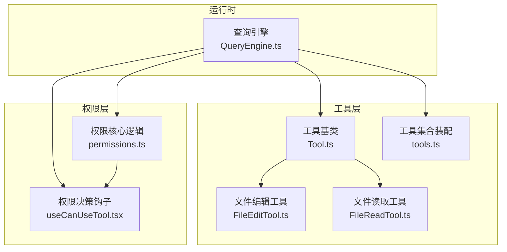
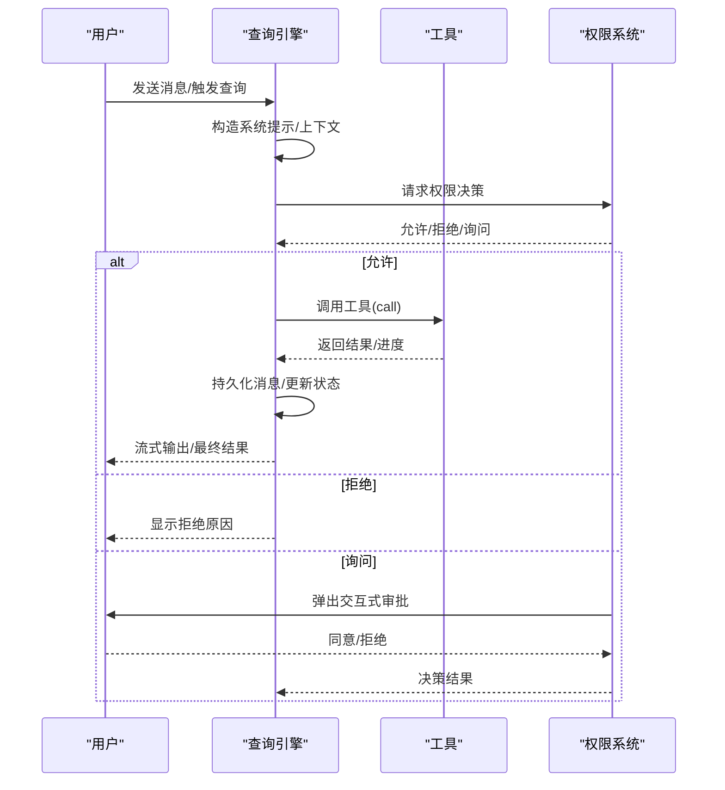
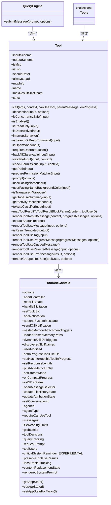

# 工具系统

<cite>
**本文引用的文件**
- [Tool.ts](file://src/Tool.ts)
- [tools.ts](file://src/tools.ts)
- [FileEditTool.ts](file://src/tools/FileEditTool/FileEditTool.ts)
- [FileReadTool.ts](file://src/tools/FileReadTool/FileReadTool.ts)
- [permissions.ts](file://src/utils/permissions/permissions.ts)
- [useCanUseTool.tsx](file://src/hooks/useCanUseTool.tsx)
- [QueryEngine.ts](file://src/QueryEngine.ts)
</cite>

## 目录
1. [简介](#简介)
2. [项目结构](#项目结构)
3. [核心组件](#核心组件)
4. [架构总览](#架构总览)
5. [详细组件分析](#详细组件分析)
6. [依赖关系分析](#依赖关系分析)
7. [性能考量](#性能考量)
8. [故障排查指南](#故障排查指南)
9. [结论](#结论)
10. [附录：创建自定义工具示例](#附录创建自定义工具示例)

## 简介
本文件系统性阐述 Claude Code 的工具系统设计与实现，围绕工具基类（Tool.ts）展开，深入解析工具生命周期管理、输入输出模式、权限模型与状态管理；详解工具注册机制、工具执行流程与结果处理；阐述输入验证、错误处理与重试机制；解释工具与查询引擎的交互方式及在权限控制系统中的作用；并提供可直接参考的代码片段路径，帮助初学者快速上手、高级开发者高效落地。

## 项目结构
工具系统由“工具基类 + 工具集合装配 + 权限控制 + 查询引擎”四部分组成：
- 工具基类与类型定义：定义工具接口、上下文、进度、结果等核心类型，并提供构建器函数以统一默认行为。
- 工具集合装配：集中管理内置工具与 MCP 工具的组装、过滤与去重策略。
- 权限控制：对工具调用进行规则匹配、自动分类与交互式审批，支持自动模式与拒绝追踪。
- 查询引擎：驱动对话循环，协调工具调用、消息持久化与状态更新。

图表来源
- [Tool.ts](file://src/Tool.ts)
- [tools.ts](file://src/tools.ts)
- [permissions.ts](file://src/utils/permissions/permissions.ts)
- [useCanUseTool.tsx](file://src/hooks/useCanUseTool.tsx)
- [QueryEngine.ts](file://src/QueryEngine.ts)

章节来源
- [Tool.ts](file://src/Tool.ts)
- [tools.ts](file://src/tools.ts)
- [QueryEngine.ts](file://src/QueryEngine.ts)

## 核心组件
- 工具基类与类型系统
  - 定义工具接口、输入/输出模式、进度类型、结果包装、上下文与权限上下文等。
  - 提供工具构建器 buildTool，统一填充默认方法（如启用状态、并发安全、只读、破坏性、权限检查、分类器输入等），确保工具实现最小化样板代码。
- 工具集合装配
  - 统一获取内置工具列表，按环境与特性开关动态拼装；结合权限规则过滤；合并 MCP 工具并去重（内置优先）。
- 权限控制系统
  - 基于规则匹配（允许/拒绝/询问）、自动模式（分类器）、拒绝追踪与阈值回退、交互式审批等多层策略。
- 查询引擎
  - 负责会话生命周期、系统提示构造、消息持久化、工具调用编排与结果归档。

章节来源
- [Tool.ts](file://src/Tool.ts)
- [tools.ts](file://src/tools.ts)
- [permissions.ts](file://src/utils/permissions/permissions.ts)
- [QueryEngine.ts](file://src/QueryEngine.ts)

## 架构总览
工具系统采用“声明式工具 + 运行时编排”的架构。工具通过 buildTool 统一声明能力与约束；查询引擎在每轮对话中根据系统提示、用户输入与权限策略选择并调用工具；权限系统在调用前进行规则匹配与自动/交互式审批；工具执行后生成结果与进度消息，由查询引擎负责持久化与 UI 展示。

图表来源
- [QueryEngine.ts](file://src/QueryEngine.ts)
- [permissions.ts](file://src/utils/permissions/permissions.ts)
- [useCanUseTool.tsx](file://src/hooks/useCanUseTool.tsx)
- [Tool.ts](file://src/Tool.ts)

## 详细组件分析

### 工具基类与生命周期
- 工具接口与方法族
  - 必需方法：call、description、inputSchema、outputSchema（可选）、isConcurrencySafe、isEnabled、isReadOnly、isDestructive（可选）、interruptBehavior（可选）、isSearchOrReadCommand（可选）、isOpenWorld（可选）、requiresUserInteraction（可选）、isMcp/isLsp（可选）、shouldDefer/alwaysLoad（可选）、mcpInfo（可选）、maxResultSizeChars、strict（可选）、backfillObservableInput（可选）、validateInput（可选）、checkPermissions、getPath（可选）、preparePermissionMatcher（可选）、prompt、userFacingName、userFacingNameBackgroundColor（可选）、isTransparentWrapper（可选）、getToolUseSummary（可选）、getActivityDescription（可选）、toAutoClassifierInput、mapToolResultToToolResultBlockParam、renderToolResultMessage（可选）、extractSearchText（可选）、renderToolUseMessage、isResultTruncated（可选）、renderToolUseTag（可选）、renderToolUseProgressMessage（可选）、renderToolUseQueuedMessage（可选）、renderToolUseRejectedMessage（可选）、renderToolUseErrorMessage（可选）、renderGroupedToolUse（可选）。
  - 生命周期要点：validateInput 在 checkPermissions 前执行；权限系统可基于工具的输入与上下文决定是否需要交互式审批或自动放行；工具可声明并发安全、只读、破坏性等属性，影响 UI 与安全策略。
- 上下文与进度
  - ToolUseContext 提供命令集、调试/详细模式、模型、工具集、MCP 客户端与资源、非交互会话标记、代理定义、预算、系统提示覆盖、刷新工具回调、文件读取缓存、通知与 OS 通知、内存附件触发、发现技能名、进行中工具 ID、响应长度、流模式、紧凑进度回调、SDK 状态、消息选择器、文件历史与归属状态更新、会话 ID、代理 ID/类型、强制 canUseTool、消息数组、文件读取/匹配限制、工具决策记录、查询跟踪、交互式请求回调、工具使用 ID、关键系统提醒、保留工具结果、本地拒绝追踪、内容替换状态、冻结的系统提示等。
  - ToolProgressData 与 Progress 用于工具进度上报与 UI 渲染。
- 结果与渲染
  - ToolResult 包含 data、新消息数组、上下文修饰器、MCP 元数据；工具可选择性渲染工具使用消息、结果消息、拒绝/错误 UI，以及分组渲染。
- 注册与查找
  - 工具可通过工具名或别名查找；工具集合通过 getAllBaseTools/assembleToolPool/getMergedTools 等函数装配与合并。

章节来源
- [Tool.ts](file://src/Tool.ts)

### 工具注册机制与集合装配
- 工具预设与解析
  - 支持工具预设（如 default），解析预设并筛选 isEnabled() 为真的工具名列表。
- 基础工具池
  - getAllBaseTools 根据环境变量与特性开关拼装内置工具，包含 Bash、Grep/Glob（若未嵌入搜索工具）、文件读写/编辑、网页搜索/抓取、任务相关、技能、计划模式、配置、Tungsten、PowerShell、WebBrowser、工作树模式、发送消息、协作模式、远程触发、监控、睡眠、定时任务、推送通知、订阅 PR、终端捕获、历史裁剪、工作流脚本、溢出测试、笔记本编辑、AskUserQuestion、SyntheticOutput、ToolSearch 等。
- 过滤与合并
  - filterToolsByDenyRules 基于权限上下文的拒绝规则过滤工具；
  - assembleToolPool 合并内置与 MCP 工具，内置优先，保持提示缓存稳定排序；
  - getMergedTools 返回内置与 MCP 工具的完整列表（不进行内置优先排序）。
- REPL 模式与简单模式
  - 简单模式仅暴露 Bash、FileRead、FileEdit 等基础工具；REPL 模式下隐藏原语工具，由 REPL 包裹执行。

章节来源
- [tools.ts](file://src/tools.ts)

### 工具执行流程与结果处理
- 执行入口
  - 查询引擎在每轮对话中根据系统提示与用户输入选择工具，调用工具的 call 方法。
- 输入验证与权限
  - validateInput 对输入进行业务校验（如路径存在性、大小限制、字符串匹配等）；
  - checkPermissions 结合工具特定规则与全局权限上下文决定是否允许、需要交互式审批或自动放行。
- 并发与中断
  - isConcurrencySafe 控制并发安全；interruptBehavior 决定用户在工具运行中提交新消息时是取消还是阻塞。
- 结果映射与渲染
  - mapToolResultToToolResultBlockParam 将工具输出映射为模型可见的结果块；
  - renderToolResultMessage/renderToolUseMessage 等负责 UI 渲染与摘要提取。

章节来源
- [QueryEngine.ts](file://src/QueryEngine.ts)
- [Tool.ts](file://src/Tool.ts)

### 权限模型与状态管理
- 规则体系
  - alwaysAllowRules/alwaysDenyRules/alwaysAskRules 三类规则来源（设置源、CLI 参数、命令、会话等）；
  - 支持工具级规则与 MCP 服务器级规则（如 mcp__server）。
- 决策流程
  - hasPermissionsToUseTool 内部综合规则匹配、自动模式（分类器）、接受编辑模式、幂等允许清单、安全检查等，最终决定允许/拒绝/询问；
  - useCanUseTool 钩子封装权限决策，处理自动模式拒绝通知、交互式审批弹窗、分类器快速通道等。
- 拒绝追踪与阈值回退
  - 记录连续拒绝次数，达到阈值后自动回退到交互式审批，避免长期被自动拒绝。
- 本地拒绝追踪
  - 异步子代理场景下，通过 localDenialTracking 保证拒绝计数在无 UI 场景下仍有效。

章节来源
- [permissions.ts](file://src/utils/permissions/permissions.ts)
- [useCanUseTool.tsx](file://src/hooks/useCanUseTool.tsx)

### 输入验证、错误处理与重试机制
- 输入验证
  - validateInput 可在工具内部实现严格校验（如路径合法性、大小限制、内容一致性、是否已读取等），返回 ValidationResult（result: true/false、message、errorCode、behavior、meta 等）。
- 错误处理
  - 工具内部抛出异常或返回失败结果；查询引擎负责将错误映射为 UI 友好的拒绝/错误消息（renderToolUseErrorMessage）。
- 重试机制
  - 查询引擎对可重试的 API 错误进行分类与重试（例如网络抖动、速率限制），并在必要时注入重试边界与日志水印，避免无限循环。

章节来源
- [FileEditTool.ts](file://src/tools/FileEditTool/FileEditTool.ts)
- [FileReadTool.ts](file://src/tools/FileReadTool/FileReadTool.ts)
- [QueryEngine.ts](file://src/QueryEngine.ts)

### 工具与查询引擎的交互
- 系统提示与上下文
  - 查询引擎在每轮对话开始前构造系统提示，注入工具列表、MCP 客户端、命令、代理定义、主题、预算等信息。
- 工具调用编排
  - 查询引擎将 ToolUseContext 注入工具调用，工具可在执行过程中更新 AppState、读取文件状态、触发通知、记录归属与文件历史等。
- 消息持久化与 UI 更新
  - 查询引擎负责将消息写入会话存储、生成紧凑边界、记录转录、统计用量与成本，并向 SDK/REPL 输出增量消息。

章节来源
- [QueryEngine.ts](file://src/QueryEngine.ts)

## 依赖关系分析

图表来源
- [Tool.ts](file://src/Tool.ts)
- [QueryEngine.ts](file://src/QueryEngine.ts)

章节来源
- [Tool.ts](file://src/Tool.ts)
- [QueryEngine.ts](file://src/QueryEngine.ts)

## 性能考量
- 工具并发与中断
  - 通过 isConcurrencySafe 与 interruptBehavior 控制工具并发与用户输入中断策略，避免阻塞或资源竞争。
- 结果大小与持久化
  - maxResultSizeChars 控制工具结果大小，超过阈值将结果落盘并通过预览文件路径替代完整内容，降低内存占用与传输开销。
- 缓存与提示稳定性
  - 工具集合按名称排序并内置优先，有助于系统提示缓存命中；权限规则匹配与拒绝追踪减少重复计算。
- 自动模式与分类器
  - 自动模式通过分类器快速放行低风险操作，减少交互等待；同时记录分类器成本与耗时，便于优化。

## 故障排查指南
- 工具未出现或被隐藏
  - 检查环境变量与特性开关（如 USER_TYPE、NODE_ENV、WEB_BROWSER_TOOL、WORKFLOW_SCRIPTS 等）；确认工具 isEnabled() 返回 true；REPL 模式下原语工具可能被隐藏。
- 权限拒绝
  - 查看权限规则（alwaysAllowRules/alwaysDenyRules/alwaysAskRules）与 MCP 服务器规则；确认自动模式阈值与拒绝追踪状态；必要时开启交互式审批。
- 文件读写异常
  - FileEditTool 会检查文件大小、是否已读取、修改时间戳一致性、UNC 路径安全、笔记本网格文件类型等；FileReadTool 会处理设备文件、图像缩放、PDF 分页与令牌估算。
- 查询引擎问题
  - 关注消息持久化、紧凑边界、用量统计与错误水印；检查可重试 API 错误与重试边界。

章节来源
- [tools.ts](file://src/tools.ts)
- [permissions.ts](file://src/utils/permissions/permissions.ts)
- [FileEditTool.ts](file://src/tools/FileEditTool/FileEditTool.ts)
- [FileReadTool.ts](file://src/tools/FileReadTool/FileReadTool.ts)
- [QueryEngine.ts](file://src/QueryEngine.ts)

## 结论
Claude Code 的工具系统以“声明式工具 + 运行时编排 + 多层权限控制”为核心，通过 buildTool 统一默认行为，借助 tools.ts 的装配机制整合内置与 MCP 工具，配合 QueryEngine 的会话编排与权限系统的自动/交互式审批，形成高扩展、强安全、易维护的工具生态。开发者可基于 Tool.ts 的接口快速实现自定义工具，并通过 validateInput、checkPermissions、render 系列方法与 UI/错误/拒绝消息实现一致的用户体验。

## 附录：创建自定义工具示例
以下示例展示如何创建一个自定义工具，涵盖工具定义、参数验证、权限检查与结果返回的关键步骤。请将下列路径复制到编辑器中查看具体实现位置：

- 工具基类与构建器
  - [工具接口与构建器定义](file://src/Tool.ts)
- 示例：文件编辑工具（含 validateInput/checkPermissions/render）
  - [文件编辑工具实现](file://src/tools/FileEditTool/FileEditTool.ts)
- 示例：文件读取工具（含权限检查与渲染）
  - [文件读取工具实现](file://src/tools/FileReadTool/FileReadTool.ts)
- 权限决策与交互式审批
  - [权限决策主流程](file://src/utils/permissions/permissions.ts)
  - [权限钩子与交互式审批](file://src/hooks/useCanUseTool.tsx)
- 查询引擎集成
  - [查询引擎提交消息与工具调用](file://src/QueryEngine.ts)
- 工具集合装配
  - [工具集合装配与合并](file://src/tools.ts)