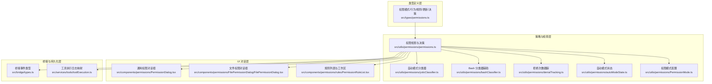
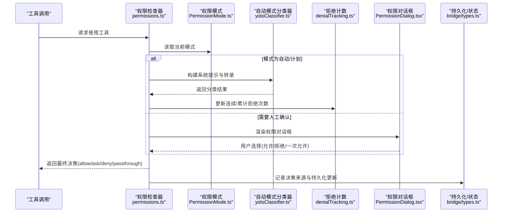
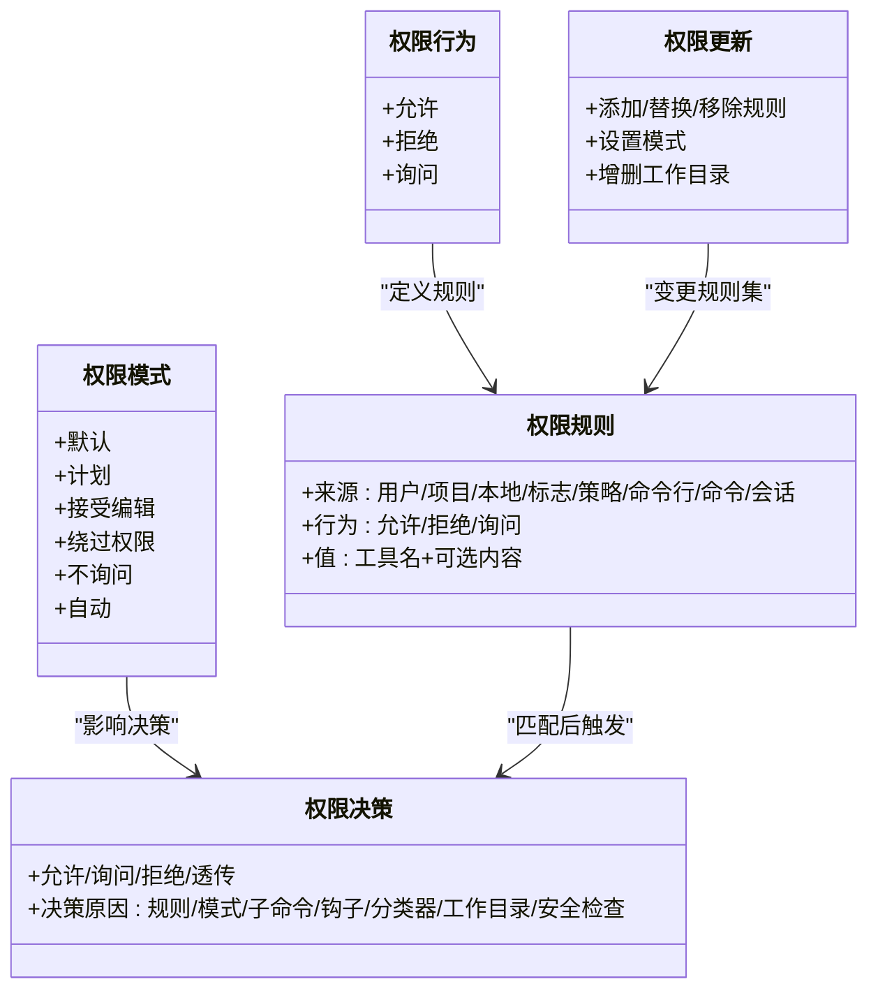
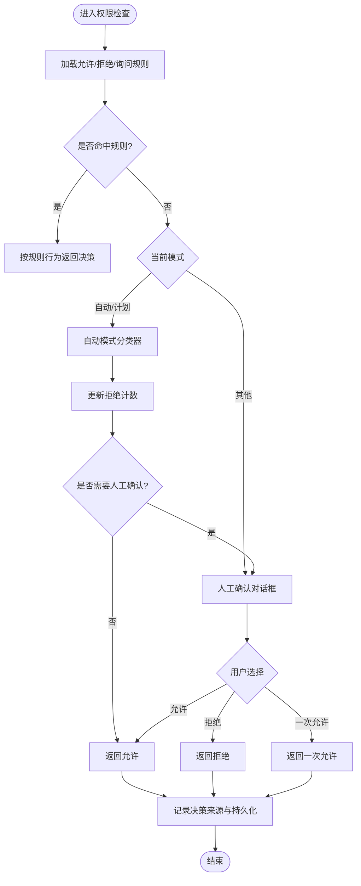
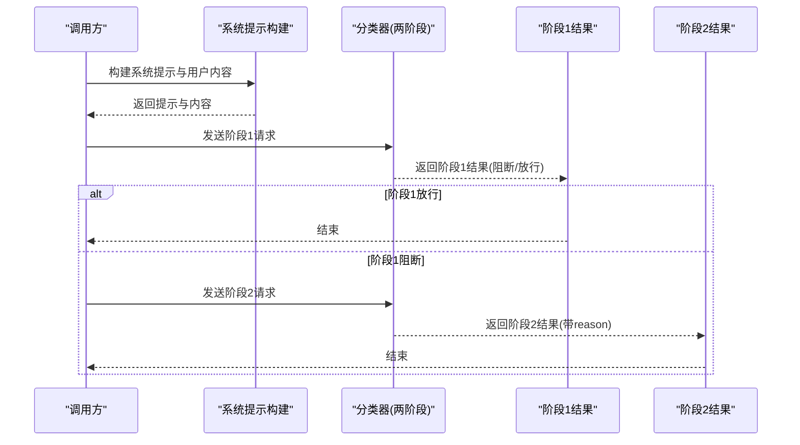
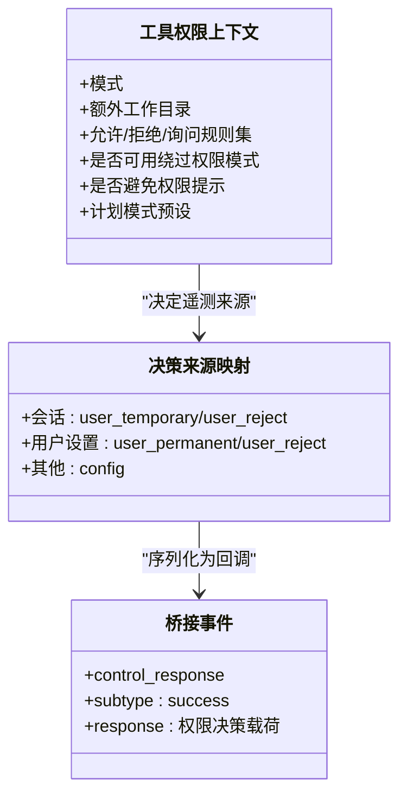
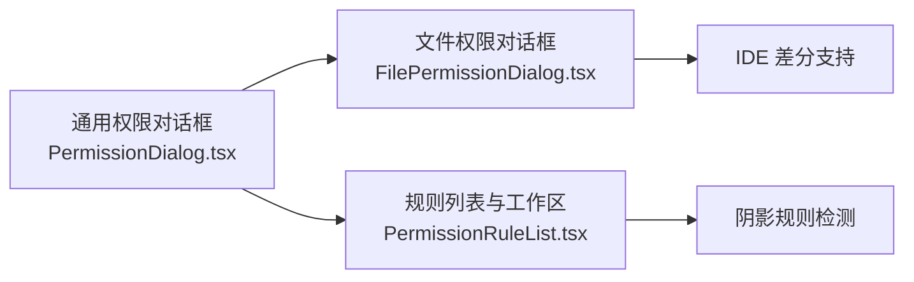
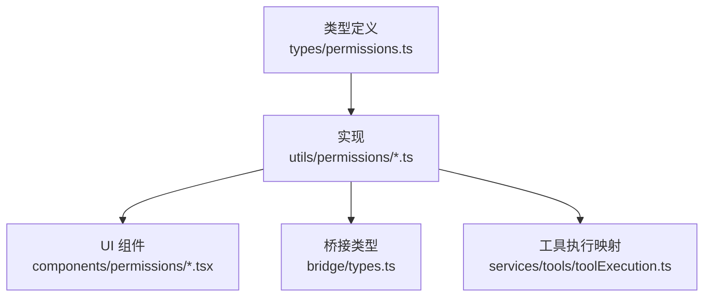

# 权限控制系统

<cite>
**本文引用的文件**
- [src/types/permissions.ts](file://src/types/permissions.ts)
- [src/utils/permissions/permissions.ts](file://src/utils/permissions/permissions.ts)
- [src/utils/permissions/PermissionMode.ts](file://src/utils/permissions/PermissionMode.ts)
- [src/utils/permissions/yoloClassifier.ts](file://src/utils/permissions/yoloClassifier.ts)
- [src/utils/permissions/bashClassifier.ts](file://src/utils/permissions/bashClassifier.ts)
- [src/utils/permissions/denialTracking.ts](file://src/utils/permissions/denialTracking.ts)
- [src/utils/permissions/autoModeState.ts](file://src/utils/permissions/autoModeState.ts)
- [src/components/permissions/PermissionDialog.tsx](file://src/components/permissions/PermissionDialog.tsx)
- [src/components/permissions/FilePermissionDialog/FilePermissionDialog.tsx](file://src/components/permissions/FilePermissionDialog/FilePermissionDialog.tsx)
- [src/components/permissions/rules/PermissionRuleList.tsx](file://src/components/permissions/rules/PermissionRuleList.tsx)
- [src/commands/permissions/permissions.tsx](file://src/commands/permissions/permissions.tsx)
- [src/bridge/types.ts](file://src/bridge/types.ts)
- [src/services/tools/toolExecution.ts](file://src/services/tools/toolExecution.ts)
</cite>

## 目录
1. [引言](#引言)
2. [项目结构](#项目结构)
3. [核心组件](#核心组件)
4. [架构总览](#架构总览)
5. [详细组件分析](#详细组件分析)
6. [依赖关系分析](#依赖关系分析)
7. [性能考量](#性能考量)
8. [故障排查指南](#故障排查指南)
9. [结论](#结论)
10. [附录](#附录)

## 引言
本文件系统性梳理 Claude Code 的权限控制系统，覆盖权限模型、权限检查机制、权限策略配置、自动化分类器与人工确认的结合、权限上下文传递与状态持久化，并给出与工具系统集成及多代理场景下的注意事项。文档既面向初学者解释权限控制的基本概念，也为高级开发者提供策略定制与扩展指南。

## 项目结构
权限系统由“类型定义层”“策略与检查层”“UI 对话层”“桥接与持久化层”四部分组成：
- 类型定义层：统一描述权限模式、行为、规则、更新、决策与解释等核心类型，避免循环依赖并集中管理。
- 策略与检查层：负责规则解析、匹配、决策生成、自动模式分类器、拒绝次数跟踪与降级提示等。
- UI 对话层：提供通用权限对话框、文件权限对话框、规则列表与工作区目录管理等交互界面。
- 桥接与持久化层：处理桥接消息协议、权限更新持久化、会话内临时权限等。

图表来源
- [src/types/permissions.ts:1-442](file://src/types/permissions.ts#L1-L442)
- [src/utils/permissions/permissions.ts:1-800](file://src/utils/permissions/permissions.ts#L1-L800)
- [src/utils/permissions/yoloClassifier.ts:1-800](file://src/utils/permissions/yoloClassifier.ts#L1-L800)
- [src/utils/permissions/bashClassifier.ts:1-62](file://src/utils/permissions/bashClassifier.ts#L1-L62)
- [src/utils/permissions/denialTracking.ts:1-46](file://src/utils/permissions/denialTracking.ts#L1-L46)
- [src/utils/permissions/autoModeState.ts:1-40](file://src/utils/permissions/autoModeState.ts#L1-L40)
- [src/utils/permissions/PermissionMode.ts:1-142](file://src/utils/permissions/PermissionMode.ts#L1-L142)
- [src/components/permissions/PermissionDialog.tsx:1-72](file://src/components/permissions/PermissionDialog.tsx#L1-L72)
- [src/components/permissions/FilePermissionDialog/FilePermissionDialog.tsx:1-204](file://src/components/permissions/FilePermissionDialog/FilePermissionDialog.tsx#L1-L204)
- [src/components/permissions/rules/PermissionRuleList.tsx:1-800](file://src/components/permissions/rules/PermissionRuleList.tsx#L1-L800)
- [src/bridge/types.ts:117-131](file://src/bridge/types.ts#L117-L131)
- [src/services/tools/toolExecution.ts:173-194](file://src/services/tools/toolExecution.ts#L173-L194)

章节来源
- [src/types/permissions.ts:1-442](file://src/types/permissions.ts#L1-L442)
- [src/utils/permissions/permissions.ts:1-800](file://src/utils/permissions/permissions.ts#L1-L800)
- [src/utils/permissions/PermissionMode.ts:1-142](file://src/utils/permissions/PermissionMode.ts#L1-L142)
- [src/utils/permissions/yoloClassifier.ts:1-800](file://src/utils/permissions/yoloClassifier.ts#L1-L800)
- [src/utils/permissions/bashClassifier.ts:1-62](file://src/utils/permissions/bashClassifier.ts#L1-L62)
- [src/utils/permissions/denialTracking.ts:1-46](file://src/utils/permissions/denialTracking.ts#L1-L46)
- [src/utils/permissions/autoModeState.ts:1-40](file://src/utils/permissions/autoModeState.ts#L1-L40)
- [src/components/permissions/PermissionDialog.tsx:1-72](file://src/components/permissions/PermissionDialog.tsx#L1-L72)
- [src/components/permissions/FilePermissionDialog/FilePermissionDialog.tsx:1-204](file://src/components/permissions/FilePermissionDialog/FilePermissionDialog.tsx#L1-L204)
- [src/components/permissions/rules/PermissionRuleList.tsx:1-800](file://src/components/permissions/rules/PermissionRuleList.tsx#L1-L800)
- [src/bridge/types.ts:117-131](file://src/bridge/types.ts#L117-L131)
- [src/services/tools/toolExecution.ts:173-194](file://src/services/tools/toolExecution.ts#L173-L194)

## 核心组件
- 权限模式与行为
  - 模式：默认(default)、计划(plan)、接受编辑(acceptEdits)、绕过权限(bypassPermissions)、不询问(dontAsk)、自动(auto，ANT 专属)。
  - 行为：允许(allow)、拒绝(deny)、询问(ask)。
- 规则与更新
  - 规则来源：用户设置(userSettings)、项目设置(projectSettings)、本地设置(localSettings)、标志设置(flagSettings)、策略设置(policySettings)、命令行(cliArg)、命令(command)、会话(session)。
  - 更新操作：添加/替换/移除规则、设置模式、增删工作目录。
- 决策与结果
  - 决策类型：允许、询问、拒绝；支持“透传(passthrough)”用于特定场景。
  - 决策原因：规则、模式、子命令结果、权限提示工具、钩子、异步代理、沙箱覆盖、分类器、工作目录、安全检查等。
- 自动模式与分类器
  - 自动模式通过两阶段 XML 分类器对工具调用进行快速阻断或深入推理，支持“fast/thinking/both”三种模式。
  - 拒绝次数跟踪与降级提示，防止过度阻断导致体验问题。
- UI 与交互
  - 通用权限对话框、文件权限对话框、规则列表与工作区管理，支持搜索、批量增删、阴影规则警告等。

章节来源
- [src/types/permissions.ts:14-38](file://src/types/permissions.ts#L14-L38)
- [src/types/permissions.ts:44-80](file://src/types/permissions.ts#L44-L80)
- [src/types/permissions.ts:85-146](file://src/types/permissions.ts#L85-L146)
- [src/types/permissions.ts:151-324](file://src/types/permissions.ts#L151-L324)
- [src/utils/permissions/PermissionMode.ts:42-91](file://src/utils/permissions/PermissionMode.ts#L42-L91)
- [src/utils/permissions/denialTracking.ts:7-45](file://src/utils/permissions/denialTracking.ts#L7-L45)
- [src/utils/permissions/yoloClassifier.ts:540-799](file://src/utils/permissions/yoloClassifier.ts#L540-L799)

## 架构总览
权限系统围绕“工具使用前的权限检查”展开，贯穿“规则匹配—人工确认—自动分类器—决策输出—UI 展示—持久化”的闭环。

图表来源
- [src/utils/permissions/permissions.ts:473-800](file://src/utils/permissions/permissions.ts#L473-L800)
- [src/utils/permissions/PermissionMode.ts:107-141](file://src/utils/permissions/PermissionMode.ts#L107-L141)
- [src/utils/permissions/yoloClassifier.ts:711-800](file://src/utils/permissions/yoloClassifier.ts#L711-L800)
- [src/utils/permissions/denialTracking.ts:24-45](file://src/utils/permissions/denialTracking.ts#L24-L45)
- [src/components/permissions/PermissionDialog.tsx:1-72](file://src/components/permissions/PermissionDialog.tsx#L1-L72)
- [src/bridge/types.ts:117-131](file://src/bridge/types.ts#L117-L131)

## 详细组件分析

### 权限模型与类型体系
- 权限模式与行为
  - 模式枚举与外部模式映射，区分 ANT 与外部用户可见模式。
  - 行为三态：allow/deny/ask，配合“透传”与“挂起分类器检查”等扩展能力。
- 规则与更新
  - 规则值包含工具名与可选内容，支持 MCP 服务器级规则与通配符。
  - 更新操作涵盖规则增删改、模式切换、工作目录增删。
- 决策与解释
  - 决策原因类型丰富，便于审计与可视化解释。
  - 支持“挂起分类器检查”，在对话前异步评估以减少等待。

图表来源
- [src/types/permissions.ts:14-38](file://src/types/permissions.ts#L14-L38)
- [src/types/permissions.ts:44-80](file://src/types/permissions.ts#L44-L80)
- [src/types/permissions.ts:85-146](file://src/types/permissions.ts#L85-L146)
- [src/types/permissions.ts:151-324](file://src/types/permissions.ts#L151-L324)

章节来源
- [src/types/permissions.ts:1-442](file://src/types/permissions.ts#L1-L442)

### 权限检查与决策流程
- 规则匹配
  - 从不同来源聚合允许/拒绝/询问规则，按工具名与内容精确匹配或通配匹配。
  - 支持 MCP 服务器级规则与 Agent 类型专用规则。
- 人工确认与自动模式
  - 模式为“不询问”时，将“询问”转换为“拒绝”。
  - 自动模式下优先尝试“接受编辑”快速路径与“安全工具白名单”跳过分类器；否则运行两阶段 XML 分类器。
  - 拒绝计数达到阈值时触发降级提示，必要时回退到人工确认。
- 决策输出与持久化
  - 决策包含行为、更新输入、决策原因、建议更新等元信息。
  - 将决策来源映射为遥测语义，便于审计与统计。

图表来源
- [src/utils/permissions/permissions.ts:473-800](file://src/utils/permissions/permissions.ts#L473-L800)
- [src/utils/permissions/denialTracking.ts:12-45](file://src/utils/permissions/denialTracking.ts#L12-L45)
- [src/utils/permissions/yoloClassifier.ts:711-800](file://src/utils/permissions/yoloClassifier.ts#L711-L800)

章节来源
- [src/utils/permissions/permissions.ts:1-800](file://src/utils/permissions/permissions.ts#L1-L800)
- [src/utils/permissions/denialTracking.ts:1-46](file://src/utils/permissions/denialTracking.ts#L1-L46)
- [src/utils/permissions/yoloClassifier.ts:1-800](file://src/utils/permissions/yoloClassifier.ts#L1-L800)

### 自动模式分类器与两阶段流程
- 两阶段设计
  - 阶段1(快速)：短提示词与终止序列，快速得出阻断/放行结论。
  - 阶段2(思考)：在阻断情况下进一步要求链式思考，降低误判。
- 输出格式
  - 使用 XML 格式输出，包含 <block> 与 <reason> 标签，便于解析。
- 上下文构建
  - 从消息历史抽取用户文本与助手工具调用，压缩为紧凑转录，加入 CLAUDE.md 用户配置作为上下文前缀。
- 错误与调试
  - 支持错误提示转储、请求/响应转储、会话级错误文件等，便于诊断与复现。

图表来源
- [src/utils/permissions/yoloClassifier.ts:711-800](file://src/utils/permissions/yoloClassifier.ts#L711-L800)
- [src/utils/permissions/yoloClassifier.ts:540-799](file://src/utils/permissions/yoloClassifier.ts#L540-L799)

章节来源
- [src/utils/permissions/yoloClassifier.ts:1-800](file://src/utils/permissions/yoloClassifier.ts#L1-L800)

### 权限上下文传递与状态持久化
- 上下文
  - 工具权限上下文包含模式、额外工作目录、各类规则集合、是否可用绕过权限模式、是否应避免权限提示、是否在计划模式等。
- 决策来源映射
  - 将规则来源映射为遥测语义，区分会话临时授予、永久用户授予、用户拒绝、配置来源等。
- 桥接与持久化
  - 桥接事件类型定义了权限决策的回调结构；工具执行模块将决策来源映射为遥测来源，便于端到端追踪。

图表来源
- [src/types/permissions.ts:414-441](file://src/types/permissions.ts#L414-L441)
- [src/services/tools/toolExecution.ts:173-194](file://src/services/tools/toolExecution.ts#L173-L194)
- [src/bridge/types.ts:117-131](file://src/bridge/types.ts#L117-L131)

章节来源
- [src/types/permissions.ts:414-441](file://src/types/permissions.ts#L414-L441)
- [src/services/tools/toolExecution.ts:173-194](file://src/services/tools/toolExecution.ts#L173-L194)
- [src/bridge/types.ts:117-131](file://src/bridge/types.ts#L117-L131)

### UI 与对话框定制
- 通用权限对话框
  - 提供标题、副标题、颜色主题、右侧徽章等定制项，适配不同权限请求场景。
- 文件权限对话框
  - 支持 IDE 差分显示、符号链接目标检测、语言高亮、输入模式切换、反馈文案等。
- 规则列表与工作区
  - 提供规则搜索、添加/删除规则、工作区目录增删、最近拒绝记录等功能，支持阴影规则警告与修复建议。

图表来源
- [src/components/permissions/PermissionDialog.tsx:1-72](file://src/components/permissions/PermissionDialog.tsx#L1-L72)
- [src/components/permissions/FilePermissionDialog/FilePermissionDialog.tsx:1-204](file://src/components/permissions/FilePermissionDialog/FilePermissionDialog.tsx#L1-L204)
- [src/components/permissions/rules/PermissionRuleList.tsx:1-800](file://src/components/permissions/rules/PermissionRuleList.tsx#L1-L800)

章节来源
- [src/components/permissions/PermissionDialog.tsx:1-72](file://src/components/permissions/PermissionDialog.tsx#L1-L72)
- [src/components/permissions/FilePermissionDialog/FilePermissionDialog.tsx:1-204](file://src/components/permissions/FilePermissionDialog/FilePermissionDialog.tsx#L1-L204)
- [src/components/permissions/rules/PermissionRuleList.tsx:1-800](file://src/components/permissions/rules/PermissionRuleList.tsx#L1-L800)

### 权限规则定义与示例
- 规则定义
  - 工具名与可选内容构成规则值；MCP 服务器级规则支持通配符。
  - 规则来源与行为组合形成最终决策。
- 示例路径
  - 规则来源字符串映射与规则值解析/序列化函数位于权限工具模块中。
  - 命令入口通过 JSX 组件渲染规则列表并支持重试拒绝命令。

章节来源
- [src/utils/permissions/permissions.ts:116-131](file://src/utils/permissions/permissions.ts#L116-L131)
- [src/utils/permissions/permissions.ts:238-302](file://src/utils/permissions/permissions.ts#L238-L302)
- [src/commands/permissions/permissions.tsx:1-9](file://src/commands/permissions/permissions.tsx#L1-L9)

### 权限检查实现与对话框定制
- 权限检查实现
  - 工具使用前调用权限检查函数，内部完成规则匹配、模式处理、自动模式分类器调用、拒绝计数更新与 UI 交互。
- 对话框定制
  - 通过 props 定制标题、副标题、问题文案、内容区域、IDE 差分支持、语言高亮等。
  - 支持一次允许、拒绝反馈、输入模式切换等交互选项。

章节来源
- [src/utils/permissions/permissions.ts:473-800](file://src/utils/permissions/permissions.ts#L473-L800)
- [src/components/permissions/FilePermissionDialog/FilePermissionDialog.tsx:48-203](file://src/components/permissions/FilePermissionDialog/FilePermissionDialog.tsx#L48-L203)

### 权限系统与工具系统的集成
- 工具执行与权限决策
  - 工具执行模块将规则来源映射为遥测来源，便于审计与统计。
- 多代理与无头代理
  - 提供权限请求钩子，支持无头/异步代理在无法弹窗时进行决策或中断。

章节来源
- [src/services/tools/toolExecution.ts:173-194](file://src/services/tools/toolExecution.ts#L173-L194)
- [src/utils/permissions/permissions.ts:392-471](file://src/utils/permissions/permissions.ts#L392-L471)

## 依赖关系分析
- 耦合与内聚
  - 类型定义集中在 types/permissions.ts，避免模块间循环依赖；策略与 UI 通过类型接口耦合，内聚度高。
- 外部依赖
  - 自动模式分类器依赖消息历史、工具输入投影、CLAUDE.md 用户配置；拒绝计数与阈值控制确保系统稳定性。
- 可能的循环依赖
  - 通过将类型抽离至独立文件，避免工具→权限→工具的环路。

图表来源
- [src/types/permissions.ts:1-442](file://src/types/permissions.ts#L1-L442)
- [src/utils/permissions/permissions.ts:1-800](file://src/utils/permissions/permissions.ts#L1-L800)
- [src/components/permissions/PermissionDialog.tsx:1-72](file://src/components/permissions/PermissionDialog.tsx#L1-L72)
- [src/bridge/types.ts:117-131](file://src/bridge/types.ts#L117-L131)
- [src/services/tools/toolExecution.ts:173-194](file://src/services/tools/toolExecution.ts#L173-L194)

章节来源
- [src/types/permissions.ts:1-442](file://src/types/permissions.ts#L1-L442)
- [src/utils/permissions/permissions.ts:1-800](file://src/utils/permissions/permissions.ts#L1-L800)
- [src/components/permissions/PermissionDialog.tsx:1-72](file://src/components/permissions/PermissionDialog.tsx#L1-L72)
- [src/bridge/types.ts:117-131](file://src/bridge/types.ts#L117-L131)
- [src/services/tools/toolExecution.ts:173-194](file://src/services/tools/toolExecution.ts#L173-L194)

## 性能考量
- 自动模式分类器
  - 两阶段设计平衡速度与准确性；通过提示缓存与短令牌预算提升吞吐。
- 拒绝计数与降级
  - 连续/累计拒绝阈值避免系统长期阻断，必要时回退到人工确认。
- UI 与交互
  - 搜索、差分、输入模式切换等交互优化用户体验，减少误操作成本。

## 故障排查指南
- 自动模式分类器不可用
  - 检查功能开关与外部模板加载状态；查看错误提示转储与请求/响应转储文件定位问题。
- 拒绝过多导致体验下降
  - 查看拒绝计数状态与阈值配置，适当调整规则或模式。
- 权限对话框无响应
  - 检查钩子执行状态与无头代理上下文，确认是否被中断或未触发。

章节来源
- [src/utils/permissions/yoloClassifier.ts:144-250](file://src/utils/permissions/yoloClassifier.ts#L144-L250)
- [src/utils/permissions/denialTracking.ts:12-45](file://src/utils/permissions/denialTracking.ts#L12-L45)
- [src/utils/permissions/permissions.ts:392-471](file://src/utils/permissions/permissions.ts#L392-L471)

## 结论
Claude Code 的权限控制系统以类型驱动的规则模型为核心，结合人工确认与自动模式分类器，在保证安全性的同时兼顾效率与体验。通过清晰的上下文传递、丰富的决策原因与完善的 UI 交互，系统能够灵活适配多代理与复杂工具生态。建议在生产环境中持续监控自动模式分类器的准确率与拒绝计数，动态优化规则与模式配置。

## 附录
- 权限模式与行为速览
  - 模式：默认、计划、接受编辑、绕过权限、不询问、自动。
  - 行为：允许、拒绝、询问。
- 关键实现路径参考
  - 权限检查与决策：[hasPermissionsToUseTool:473-800](file://src/utils/permissions/permissions.ts#L473-L800)
  - 自动模式分类器：[classifyYoloActionXml:711-800](file://src/utils/permissions/yoloClassifier.ts#L711-L800)
  - 拒绝计数：[denialTracking:1-46](file://src/utils/permissions/denialTracking.ts#L1-L46)
  - 权限模式配置：[PermissionMode:1-142](file://src/utils/permissions/PermissionMode.ts#L1-L142)
  - 通用对话框：[PermissionDialog:1-72](file://src/components/permissions/PermissionDialog.tsx#L1-L72)
  - 文件对话框：[FilePermissionDialog:1-204](file://src/components/permissions/FilePermissionDialog/FilePermissionDialog.tsx#L1-L204)
  - 规则列表：[PermissionRuleList:1-800](file://src/components/permissions/rules/PermissionRuleList.tsx#L1-L800)
  - 桥接事件类型：[PermissionResponseEvent:117-131](file://src/bridge/types.ts#L117-L131)
  - 决策来源映射：[ruleSourceToOTelSource:173-194](file://src/services/tools/toolExecution.ts#L173-L194)