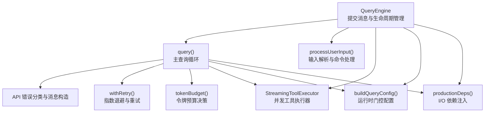
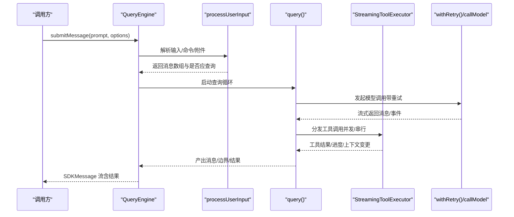
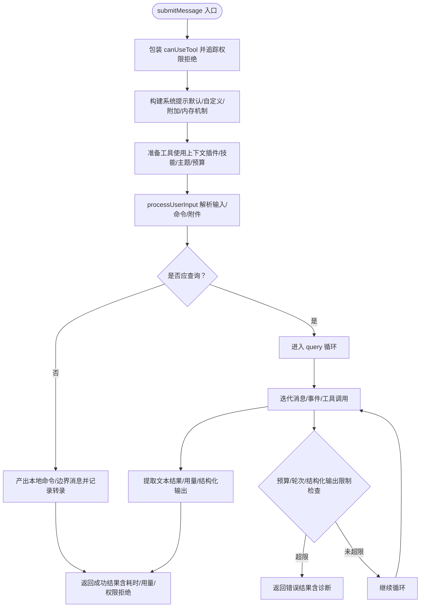
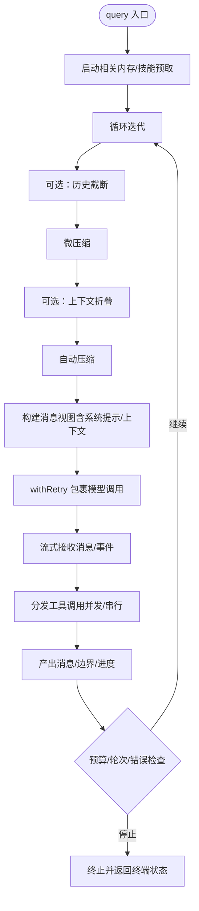
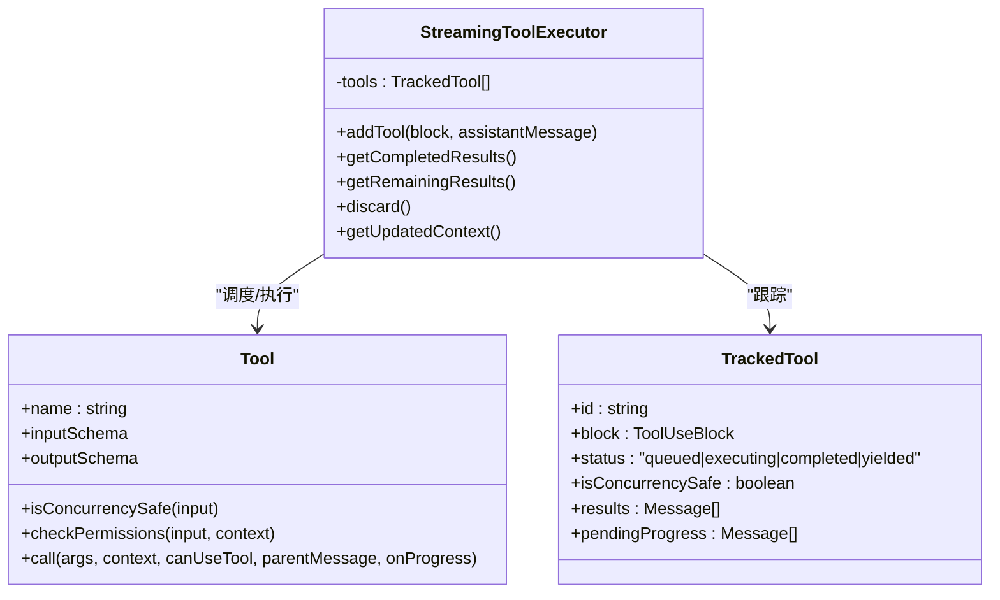
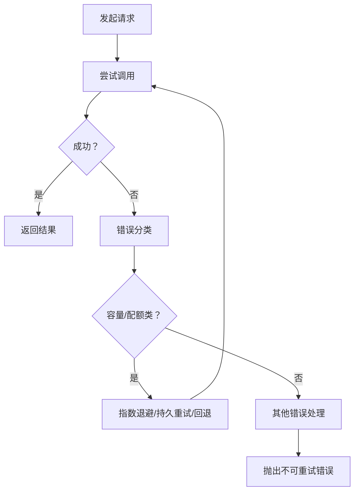
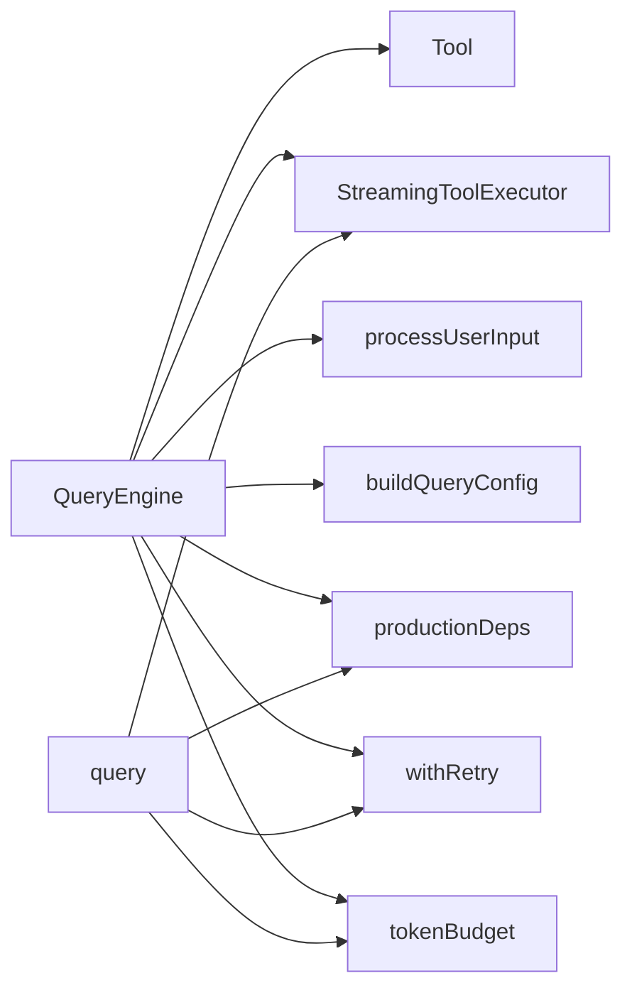

# 查询引擎

<cite>
**本文引用的文件**
- [QueryEngine.ts](file://src/QueryEngine.ts)
- [query.ts](file://src/query.ts)
- [Tool.ts](file://src/Tool.ts)
- [StreamingToolExecutor.ts](file://src/services/tools/StreamingToolExecutor.ts)
- [tokenBudget.ts](file://src/query/tokenBudget.ts)
- [config.ts](file://src/query/config.ts)
- [deps.ts](file://src/query/deps.ts)
- [processUserInput.ts](file://src/utils/processUserInput/processUserInput.ts)
- [errors.ts](file://src/services/api/errors.ts)
- [withRetry.ts](file://src/services/api/withRetry.ts)
- [queryHelpers.ts](file://src/utils/queryHelpers.ts)
</cite>

## 目录
1. [简介](#简介)
2. [项目结构](#项目结构)
3. [核心组件](#核心组件)
4. [架构总览](#架构总览)
5. [详细组件分析](#详细组件分析)
6. [依赖关系分析](#依赖关系分析)
7. [性能考量](#性能考量)
8. [故障排查指南](#故障排查指南)
9. [结论](#结论)
10. [附录](#附录)

## 简介
本文件系统性解析 Claude Code 的查询引擎（QueryEngine），聚焦其在无头/SDK 场景下的工作流：从用户输入到系统提示构建、消息处理与工具调用循环、LLM API 调用与重试、上下文管理与令牌预算控制、以及结果生成与状态持久化。文档既面向初学者解释核心概念，也为高级开发者提供架构细节与扩展建议。

## 项目结构
查询引擎位于 src/QueryEngine.ts，围绕它形成以下关键模块：
- 查询主循环：src/query.ts
- 工具系统与并发执行：src/Tool.ts、src/services/tools/StreamingToolExecutor.ts
- 配置与依赖注入：src/query/config.ts、src/query/deps.ts
- 用户输入预处理：src/utils/processUserInput/processUserInput.ts
- 错误分类与重试：src/services/api/errors.ts、src/services/api/withRetry.ts
- 结果归一化与辅助工具：src/utils/queryHelpers.ts

**图表来源**
- [QueryEngine.ts:184-207](file://src/QueryEngine.ts#L184-L207)
- [query.ts:219-239](file://src/query.ts#L219-L239)
- [config.ts:29-46](file://src/query/config.ts#L29-L46)
- [deps.ts:33-40](file://src/query/deps.ts#L33-L40)
- [StreamingToolExecutor.ts:40-62](file://src/services/tools/StreamingToolExecutor.ts#L40-L62)
- [errors.ts:425-520](file://src/services/api/errors.ts#L425-L520)
- [withRetry.ts:170-517](file://src/services/api/withRetry.ts#L170-L517)
- [tokenBudget.ts:45-93](file://src/query/tokenBudget.ts#L45-L93)

**章节来源**
- [QueryEngine.ts:130-207](file://src/QueryEngine.ts#L130-L207)
- [query.ts:1-120](file://src/query.ts#L1-L120)
- [config.ts:1-47](file://src/query/config.ts#L1-L47)
- [deps.ts:1-41](file://src/query/deps.ts#L1-L41)

## 核心组件
- QueryEngine：封装一次对话的生命周期，负责消息状态、权限记录、用量统计、会话持久化与结果归一化输出。
- query：主查询循环，负责上下文压缩、令牌预算、工具调度、模型调用与错误恢复。
- Tool/StreamingToolExecutor：工具定义与并发执行器，支持并发安全与串行工具的顺序执行、进度与中断处理。
- 配置与依赖：运行时门控（如流式工具执行、快模式）、I/O 依赖注入（模型调用、自动压缩、微压缩）。
- 输入处理：将用户输入解析为消息序列，处理本地命令、附件与权限规则。
- 错误与重试：统一错误分类、速率限制与容量过载处理、持久重试与心跳反馈。

**章节来源**
- [QueryEngine.ts:175-207](file://src/QueryEngine.ts#L175-L207)
- [query.ts:219-239](file://src/query.ts#L219-L239)
- [Tool.ts:362-473](file://src/Tool.ts#L362-L473)
- [StreamingToolExecutor.ts:40-62](file://src/services/tools/StreamingToolExecutor.ts#L40-L62)
- [config.ts:29-46](file://src/query/config.ts#L29-L46)
- [deps.ts:33-40](file://src/query/deps.ts#L33-L40)
- [processUserInput.ts:85-140](file://src/utils/processUserInput/processUserInput.ts#L85-L140)
- [errors.ts:425-520](file://src/services/api/errors.ts#L425-L520)
- [withRetry.ts:170-517](file://src/services/api/withRetry.ts#L170-L517)

## 架构总览
下图展示了 QueryEngine 如何协调各子系统完成一次查询：

**图表来源**
- [QueryEngine.ts:209-236](file://src/QueryEngine.ts#L209-L236)
- [processUserInput.ts:85-140](file://src/utils/processUserInput/processUserInput.ts#L85-L140)
- [query.ts:653-708](file://src/query.ts#L653-L708)
- [withRetry.ts:170-517](file://src/services/api/withRetry.ts#L170-L517)
- [StreamingToolExecutor.ts:140-151](file://src/services/tools/StreamingToolExecutor.ts#L140-L151)

## 详细组件分析

### QueryEngine：生命周期与消息处理
- 初始化与状态
  - 维护可变消息列表、用量统计、权限拒绝记录、文件读取缓存与中止控制器。
  - 支持可选的“孤儿权限”一次性处理与历史截断（HISTORY_SNIP）回调。
- 提交消息流程
  - 包装 canUseTool 以追踪权限拒绝；构建系统提示（默认/自定义/附加/内存机制提示）；准备工具使用上下文（含插件、技能、主题、预算等）。
  - 处理本地命令与 /slash 命令，必要时直接返回结果或系统边界消息。
  - 记录会话转录并按需刷新存储，确保中断后仍可恢复。
  - 进入 query 循环，逐条归一化消息并产出 SDKMessage。
- 结束与诊断
  - 检查预算上限（USD）、结构化输出重试次数、最大轮次；失败时输出诊断信息（包含内存错误水印）。
  - 成功时提取文本结果、用量与结构化输出，生成最终结果消息。

**图表来源**
- [QueryEngine.ts:209-236](file://src/QueryEngine.ts#L209-L236)
- [QueryEngine.ts:410-428](file://src/QueryEngine.ts#L410-L428)
- [QueryEngine.ts:675-686](file://src/QueryEngine.ts#L675-L686)
- [QueryEngine.ts:971-1048](file://src/QueryEngine.ts#L971-L1048)
- [QueryEngine.ts:1120-1155](file://src/QueryEngine.ts#L1120-L1155)

**章节来源**
- [QueryEngine.ts:184-207](file://src/QueryEngine.ts#L184-L207)
- [QueryEngine.ts:209-236](file://src/QueryEngine.ts#L209-L236)
- [QueryEngine.ts:410-428](file://src/QueryEngine.ts#L410-L428)
- [QueryEngine.ts:675-686](file://src/QueryEngine.ts#L675-L686)
- [QueryEngine.ts:971-1048](file://src/QueryEngine.ts#L971-L1048)
- [QueryEngine.ts:1120-1155](file://src/QueryEngine.ts#L1120-L1155)

### query：查询循环与上下文管理
- 上下文压缩
  - 历史截断（HISTORY_SNIP）、微压缩（microcompact）、自动压缩（autoCompact）与反应式压缩（reactiveCompact）按序进行，产出压缩后的消息视图。
- 令牌预算与任务预算
  - 使用 tokenBudget 决策是否继续；结合任务预算（task_budget）在压缩前后维护剩余窗口。
- 工具调度
  - 流式工具执行器根据并发安全策略调度工具，串行工具阻塞后续非并发工具，支持进度即时产出与中断传播。
- 模型调用与重试
  - 通过 withRetry 包裹 callModelWithStreaming，实现指数退避、持久重试、容量过载回退与快模式降级。
- 错误与恢复
  - 对提示过长、媒体过大、令牌溢出等错误进行分类与恢复（如缩减/剥离/调整 max_tokens）。

**图表来源**
- [query.ts:307-308](file://src/query.ts#L307-L308)
- [query.ts:401-410](file://src/query.ts#L401-L410)
- [query.ts:414-426](file://src/query.ts#L414-L426)
- [query.ts:441-447](file://src/query.ts#L441-L447)
- [query.ts:454-543](file://src/query.ts#L454-L543)
- [query.ts:659-708](file://src/query.ts#L659-L708)
- [withRetry.ts:170-517](file://src/services/api/withRetry.ts#L170-L517)
- [StreamingToolExecutor.ts:140-151](file://src/services/tools/StreamingToolExecutor.ts#L140-L151)

**章节来源**
- [query.ts:241-251](file://src/query.ts#L241-L251)
- [query.ts:307-308](file://src/query.ts#L307-L308)
- [query.ts:401-410](file://src/query.ts#L401-L410)
- [query.ts:454-543](file://src/query.ts#L454-L543)
- [query.ts:659-708](file://src/query.ts#L659-L708)
- [withRetry.ts:170-517](file://src/services/api/withRetry.ts#L170-L517)
- [StreamingToolExecutor.ts:140-151](file://src/services/tools/StreamingToolExecutor.ts#L140-L151)

### 工具系统与并发控制
- 工具定义
  - Tool 接口定义了工具的输入/输出模式、权限校验、并发安全、只读/破坏性标记、描述与渲染等能力。
- 并发执行器
  - StreamingToolExecutor 维护工具队列，按并发安全策略执行；对非并发工具保持串行；支持进度即时产出、兄弟工具错误传播与中断处理。
  - 提供 discard 机制用于流式回退场景丢弃旧结果。

**图表来源**
- [Tool.ts:362-473](file://src/Tool.ts#L362-L473)
- [StreamingToolExecutor.ts:40-62](file://src/services/tools/StreamingToolExecutor.ts#L40-L62)
- [StreamingToolExecutor.ts:265-405](file://src/services/tools/StreamingToolExecutor.ts#L265-L405)

**章节来源**
- [Tool.ts:362-473](file://src/Tool.ts#L362-L473)
- [StreamingToolExecutor.ts:40-62](file://src/services/tools/StreamingToolExecutor.ts#L40-L62)
- [StreamingToolExecutor.ts:129-151](file://src/services/tools/StreamingToolExecutor.ts#L129-L151)
- [StreamingToolExecutor.ts:265-405](file://src/services/tools/StreamingToolExecutor.ts#L265-L405)

### LLM API 调用与重试逻辑
- withRetry
  - 实现指数退避与抖动、持久重试（心跳反馈）、容量过载回退（快模式降级）、令牌溢出自动调整 max_tokens。
  - 对 429/529、连接错误、认证失效、云平台凭证问题进行分类处理与缓存清理。
- 错误分类
  - 将 API 错误映射为 UI 友好的消息，区分提示过长、媒体过大、令牌溢出、无效模型名、余额不足等场景。

**图表来源**
- [withRetry.ts:170-517](file://src/services/api/withRetry.ts#L170-L517)
- [errors.ts:425-520](file://src/services/api/errors.ts#L425-L520)

**章节来源**
- [withRetry.ts:170-517](file://src/services/api/withRetry.ts#L170-L517)
- [errors.ts:425-520](file://src/services/api/errors.ts#L425-L520)

### 查询构建、上下文管理与令牌预算
- 查询配置
  - buildQueryConfig 快照会话 ID 与运行时门控（流式工具执行、工具使用摘要、快模式开关等），避免测试污染。
- 令牌预算
  - checkTokenBudget 基于阈值与边际收益判断是否继续；记录持续次数与增量，用于统计与日志。
- 任务预算
  - 在压缩前后维护剩余窗口，确保服务端正确计数。

**章节来源**
- [config.ts:29-46](file://src/query/config.ts#L29-L46)
- [tokenBudget.ts:45-93](file://src/query/tokenBudget.ts#L45-L93)
- [query.ts:508-515](file://src/query.ts#L508-L515)

### 性能优化策略
- 缓存与压缩
  - 自动/微/历史截断压缩减少上下文长度，降低延迟与成本。
- 并发控制
  - StreamingToolExecutor 仅在并发安全前提下并行，避免资源争用与死锁。
- 会话持久化
  - 按需写入转录与刷新，平衡一致性与 I/O 开销。
- 快模式与回退
  - 容量压力下切换标准速度以保护提示缓存，必要时触发模型回退。

**章节来源**
- [query.ts:414-426](file://src/query.ts#L414-L426)
- [query.ts:454-543](file://src/query.ts#L454-L543)
- [withRetry.ts:267-314](file://src/services/api/withRetry.ts#L267-L314)

### 使用方式与配置选项（示例路径）
- 创建 QueryEngine 并提交消息
  - [ask 函数入口:1186-1295](file://src/QueryEngine.ts#L1186-L1295)
  - [QueryEngine.submitMessage:209-236](file://src/QueryEngine.ts#L209-L236)
- 关键配置项（来自 QueryEngineConfig）
  - [cwd/tools/commands/mcpClients/agents:130-173](file://src/QueryEngine.ts#L130-L173)
  - [canUseTool/getAppState/setAppState:130-173](file://src/QueryEngine.ts#L130-L173)
  - [customSystemPrompt/appendSystemPrompt:141-142](file://src/QueryEngine.ts#L141-L142)
  - [userSpecifiedModel/fallbackModel:143-144](file://src/QueryEngine.ts#L143-L144)
  - [thinkingConfig/maxTurns/maxBudgetUsd/taskBudget:145-148](file://src/QueryEngine.ts#L145-L148)
  - [jsonSchema/verbose/replayUserMessages/includePartialMessages:149-155](file://src/QueryEngine.ts#L149-L155)
  - [handleElicitation/setSDKStatus/abortController/orphanedPermission/snipReplay:152-173](file://src/QueryEngine.ts#L152-L173)
- 查询循环参数
  - [query 参数类型与字段:181-199](file://src/query.ts#L181-L199)

**章节来源**
- [QueryEngine.ts:1186-1295](file://src/QueryEngine.ts#L1186-L1295)
- [QueryEngine.ts:209-236](file://src/QueryEngine.ts#L209-L236)
- [query.ts:181-199](file://src/query.ts#L181-L199)

## 依赖关系分析
- QueryEngine 依赖
  - 工具系统：Tool/StreamingToolExecutor
  - 输入处理：processUserInput
  - 配置与依赖：buildQueryConfig/productionDeps
  - API 与重试：withRetry
  - 令牌预算：tokenBudget
- query 依赖
  - 自动/微压缩、模型调用、工具编排、停止钩子、任务预算等。

**图表来源**
- [QueryEngine.ts:184-207](file://src/QueryEngine.ts#L184-L207)
- [query.ts:219-239](file://src/query.ts#L219-L239)
- [config.ts:29-46](file://src/query/config.ts#L29-L46)
- [deps.ts:33-40](file://src/query/deps.ts#L33-L40)
- [withRetry.ts:170-517](file://src/services/api/withRetry.ts#L170-L517)
- [tokenBudget.ts:45-93](file://src/query/tokenBudget.ts#L45-L93)
- [StreamingToolExecutor.ts:40-62](file://src/services/tools/StreamingToolExecutor.ts#L40-L62)

**章节来源**
- [QueryEngine.ts:184-207](file://src/QueryEngine.ts#L184-L207)
- [query.ts:219-239](file://src/query.ts#L219-L239)
- [deps.ts:33-40](file://src/query/deps.ts#L33-L40)

## 性能考量
- 上下文压缩
  - 在长会话中显著降低 token 使用与延迟，建议启用自动压缩与历史截断。
- 工具并发
  - 仅对并发安全工具并行，避免串行阻塞；对串行工具采用有序队列。
- 重试与退避
  - 指数退避与抖动降低服务器压力；持久重试配合心跳反馈提升长时间等待体验。
- 用量与预算
  - 通过 USD 预算与令牌预算及时止损，避免超支。

[本节为通用指导，无需具体文件引用]

## 故障排查指南
- 常见错误与恢复
  - 提示过长：自动压缩/剥离/调整 max_tokens；参考 [错误分类:560-574](file://src/services/api/errors.ts#L560-L574) 与 [withRetry 调整:388-427](file://src/services/api/withRetry.ts#L388-L427)。
  - 媒体过大：剥离图片/PDF 或改用文本替代；参考 [错误分类:612-639](file://src/services/api/errors.ts#L612-L639)。
  - 速率限制/容量过载：指数退避、持久重试、快模式降级；参考 [withRetry:267-314](file://src/services/api/withRetry.ts#L267-L314)。
- 诊断信息
  - QueryEngine 在失败时输出诊断前缀与内存错误水印，便于定位问题；参考 [错误输出:1106-1115](file://src/QueryEngine.ts#L1106-L1115)。
- 权限与拒绝
  - 记录权限拒绝列表，便于 SDK 报告；参考 [权限追踪:262-268](file://src/QueryEngine.ts#L262-L268)。

**章节来源**
- [errors.ts:560-574](file://src/services/api/errors.ts#L560-L574)
- [withRetry.ts:267-314](file://src/services/api/withRetry.ts#L267-L314)
- [QueryEngine.ts:1106-1115](file://src/QueryEngine.ts#L1106-L1115)
- [QueryEngine.ts:262-268](file://src/QueryEngine.ts#L262-L268)

## 结论
QueryEngine 将用户输入、系统提示构建、工具调度与模型调用整合为一个可扩展的查询流水线。通过上下文压缩、并发工具执行、令牌与预算控制、以及健壮的重试与错误恢复机制，QueryEngine 在保证稳定性的同时兼顾性能与可观测性。对于扩展者，建议优先完善工具并发安全标识、优化上下文压缩策略，并在 SDK 层面利用权限拒绝与诊断信息提升用户体验。

[本节为总结，无需具体文件引用]

## 附录
- 相关类型与接口
  - [QueryEngineConfig:130-173](file://src/QueryEngine.ts#L130-L173)
  - [Tool 接口:362-473](file://src/Tool.ts#L362-L473)
  - [QueryParams:181-199](file://src/query.ts#L181-L199)
  - [QueryConfig:15-27](file://src/query/config.ts#L15-L27)
  - [QueryDeps:21-31](file://src/query/deps.ts#L21-L31)

**章节来源**
- [QueryEngine.ts:130-173](file://src/QueryEngine.ts#L130-L173)
- [Tool.ts:362-473](file://src/Tool.ts#L362-L473)
- [query.ts:181-199](file://src/query.ts#L181-L199)
- [config.ts:15-27](file://src/query/config.ts#L15-L27)
- [deps.ts:21-31](file://src/query/deps.ts#L21-L31)