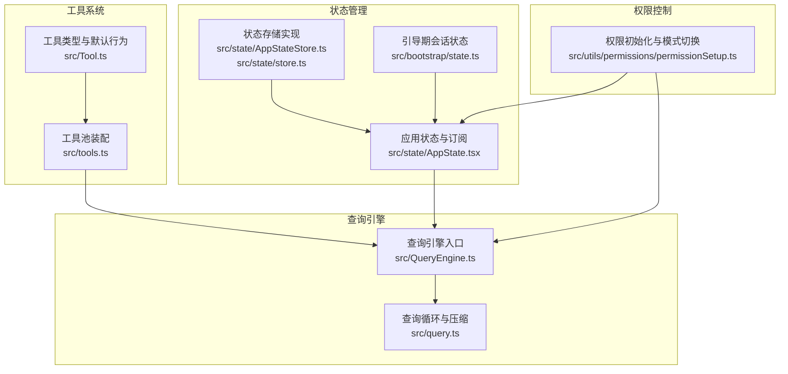
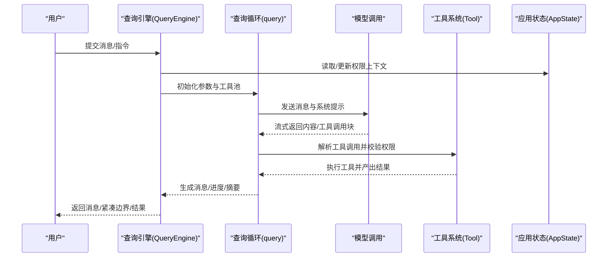
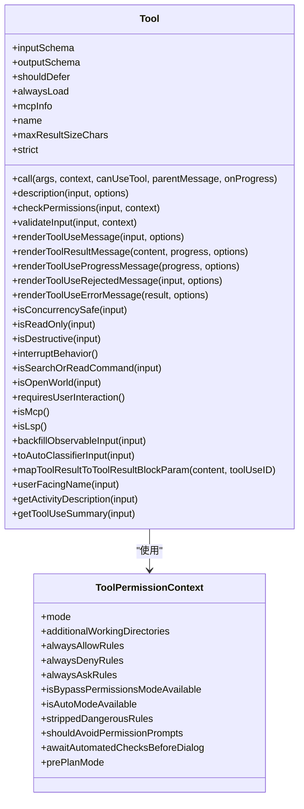
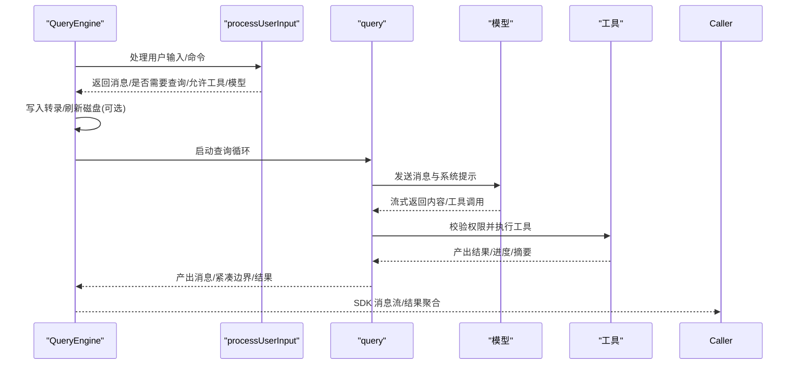
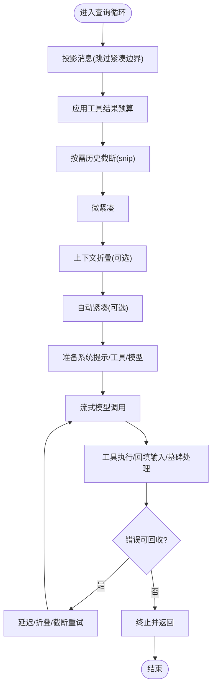
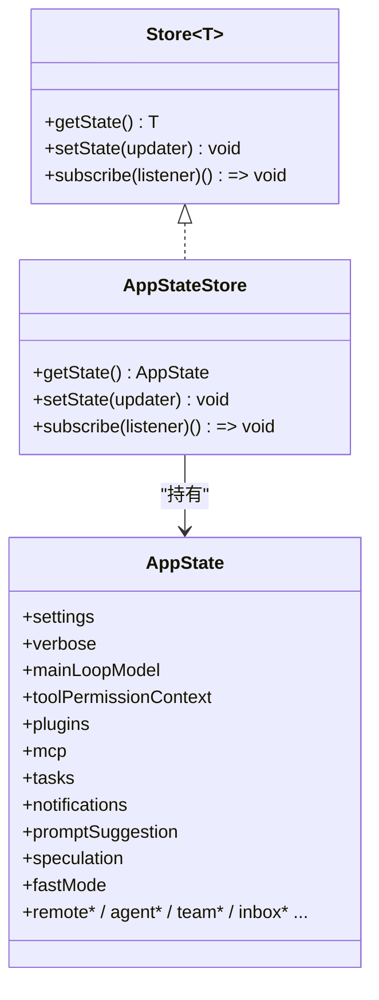
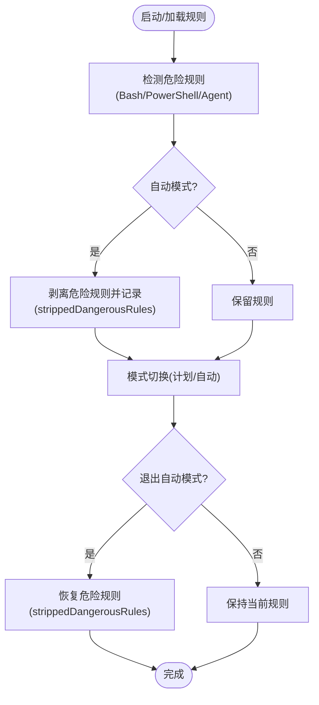
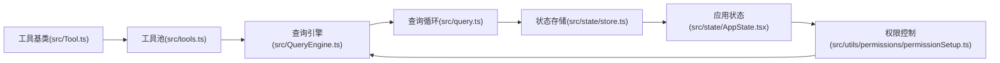

# 核心概念

<cite>
**本文引用的文件**
- [src/Tool.ts](file://src/Tool.ts)
- [src/tools.ts](file://src/tools.ts)
- [src/QueryEngine.ts](file://src/QueryEngine.ts)
- [src/query.ts](file://src/query.ts)
- [src/state/AppState.tsx](file://src/state/AppState.tsx)
- [src/state/AppStateStore.ts](file://src/state/AppStateStore.ts)
- [src/state/store.ts](file://src/state/store.ts)
- [src/bootstrap/state.ts](file://src/bootstrap/state.ts)
- [src/utils/permissions/permissionSetup.ts](file://src/utils/permissions/permissionSetup.ts)
</cite>

## 目录
1. [简介](#简介)
2. [项目结构](#项目结构)
3. [核心组件](#核心组件)
4. [架构总览](#架构总览)
5. [详细组件分析](#详细组件分析)
6. [依赖分析](#依赖分析)
7. [性能考虑](#性能考虑)
8. [故障排查指南](#故障排查指南)
9. [结论](#结论)

## 简介
本文件面向初学者与高级开发者，系统性梳理 Claude Code 的核心概念：工具系统（Tool System）、查询引擎（QueryEngine）工作流、状态管理（AppState）与权限控制（Permissions）。内容涵盖：
- 工具系统设计：工具基类、输入输出模式、权限模型、生命周期与渲染管线
- 查询引擎机制：LLM API 调用、工具调用循环、流式响应处理、重试与恢复
- 状态管理：应用状态架构、会话状态管理、状态持久化
- 权限控制：权限检查机制、策略与交互流程
- 图示与示例路径：帮助读者快速定位实现位置与参考代码

## 项目结构
围绕“工具系统”“查询引擎”“状态管理”“权限控制”，本仓库的关键模块如下：
- 工具系统：定义工具接口、默认行为、权限上下文与工具池装配
- 查询引擎：封装一次对话的完整生命周期，驱动 LLM 与工具执行
- 查询循环：在单轮对话中协调消息、压缩、流式执行与错误恢复
- 状态管理：全局应用状态、会话状态与存储订阅
- 权限控制：权限规则加载、危险规则检测与模式切换

图表来源
- [src/Tool.ts](file://src/Tool.ts)
- [src/tools.ts](file://src/tools.ts)
- [src/QueryEngine.ts](file://src/QueryEngine.ts)
- [src/query.ts](file://src/query.ts)
- [src/state/AppState.tsx](file://src/state/AppState.tsx)
- [src/state/AppStateStore.ts](file://src/state/AppStateStore.ts)
- [src/state/store.ts](file://src/state/store.ts)
- [src/bootstrap/state.ts](file://src/bootstrap/state.ts)
- [src/utils/permissions/permissionSetup.ts](file://src/utils/permissions/permissionSetup.ts)

章节来源
- [src/Tool.ts](file://src/Tool.ts)
- [src/tools.ts](file://src/tools.ts)
- [src/QueryEngine.ts](file://src/QueryEngine.ts)
- [src/query.ts](file://src/query.ts)
- [src/state/AppState.tsx](file://src/state/AppState.tsx)
- [src/state/AppStateStore.ts](file://src/state/AppStateStore.ts)
- [src/state/store.ts](file://src/state/store.ts)
- [src/bootstrap/state.ts](file://src/bootstrap/state.ts)
- [src/utils/permissions/permissionSetup.ts](file://src/utils/permissions/permissionSetup.ts)

## 核心组件
- 工具系统（Tool System）
  - 工具基类与默认行为：输入/输出模式、并发安全、只读/破坏性标记、权限检查钩子、描述与渲染接口
  - 工具池装配：内置工具与 MCP 工具合并、去重、按名称排序、按规则过滤
- 查询引擎（QueryEngine）
  - 会话级生命周期：消息累积、系统提示构建、工具池装配、权限上下文注入、转录记录与持久化
  - SDK/打印模式：异步生成器驱动消息流，支持权限拒绝、命令处理、本地命令输出、紧凑边界等
- 查询循环（query.ts）
  - 消息预处理、自动/微紧凑、上下文折叠、令牌预算与任务预算、流式模型调用、工具执行与结果回填、错误恢复与重试
- 状态管理（AppState）
  - 全局应用状态 Store：深冻结状态、订阅通知、设置变更同步；会话状态包含权限上下文、插件、MCP、任务、通知等
- 权限控制（Permissions）
  - 规则加载与危险规则检测、自动模式下危险规则剥离与恢复、模式切换副作用（计划/自动模式附件、状态位）

章节来源
- [src/Tool.ts](file://src/Tool.ts)
- [src/tools.ts](file://src/tools.ts)
- [src/QueryEngine.ts](file://src/QueryEngine.ts)
- [src/query.ts](file://src/query.ts)
- [src/state/AppState.tsx](file://src/state/AppState.tsx)
- [src/state/AppStateStore.ts](file://src/state/AppStateStore.ts)
- [src/state/store.ts](file://src/state/store.ts)
- [src/utils/permissions/permissionSetup.ts](file://src/utils/permissions/permissionSetup.ts)

## 架构总览
下面以“从用户输入到工具执行”的视角，展示工具系统、查询引擎与状态管理的协作关系。

图表来源
- [src/QueryEngine.ts](file://src/QueryEngine.ts)
- [src/query.ts](file://src/query.ts)
- [src/Tool.ts](file://src/Tool.ts)
- [src/state/AppState.tsx](file://src/state/AppState.tsx)

## 详细组件分析

### 工具系统（Tool System）
- 设计要点
  - 工具接口：call、description、inputSchema、outputSchema、权限检查、并发安全、只读/破坏性、中断行为、搜索/读取/列表识别、是否 MCP/LSP、延迟加载/始终加载、最大结果大小、严格模式回填、输入验证、渲染与摘要、活动描述、分类器输入映射、结果消息映射等
  - 默认行为：未显式实现的方法采用安全默认（如允许、非并发安全、非只读、非破坏性、直接放行权限、空分类器输入、使用工具名作为用户可见名）
  - 工具池装配：内置工具与 MCP 工具合并，按名称去重（内置优先），按规则过滤，条件特性开关裁剪
- 生命周期与渲染
  - 输入回填：在观察者可见前对工具输入进行回填，保证 SDK 流与转录序列化看到扩展字段
  - 渲染管线：工具使用消息、进度消息、拒绝/错误消息、分组渲染、结果截断判断、标签渲染
- 权限模型
  - 工具级权限检查：validateInput → checkPermissions → canUseTool 钩子链路
  - 权限上下文：ToolPermissionContext 包含模式、附加工作目录、规则集合、是否可绕过、是否等待自动化检查等
  - 危险规则剥离与恢复：自动模式下剥离可能绕过分类器的规则，并在退出时恢复

图表来源
- [src/Tool.ts](file://src/Tool.ts)

章节来源
- [src/Tool.ts](file://src/Tool.ts)
- [src/tools.ts](file://src/tools.ts)
- [src/utils/permissions/permissionSetup.ts](file://src/utils/permissions/permissionSetup.ts)

### 查询引擎（QueryEngine）
- 会话生命周期
  - 维护消息数组、权限拒绝记录、用量统计、文件读缓存、发现技能集、已加载 CLAUDE.md 路径集
  - 初始化系统提示、用户上下文、记忆机制提示、结构化输出钩子注册、插件与技能缓存加载
  - 处理本地命令与 /slash 命令，写入转录并可选择立即刷新磁盘
  - 生成系统初始化消息（工具、MCP、模型、权限模式、命令、代理、技能、插件、快进模式）
- SDK/打印模式消息流
  - 支持权限拒绝、命令输出、紧凑边界、结果聚合（耗时、用量、停止原因、权限拒绝数、快进模式状态）
  - 对于非查询型命令，直接返回用户侧消息与合成助手消息
- 会话状态与持久化
  - 记录转录、必要时强制刷新、文件历史快照、权限拒绝追踪、用量累计

图表来源
- [src/QueryEngine.ts](file://src/QueryEngine.ts)
- [src/query.ts](file://src/query.ts)

章节来源
- [src/QueryEngine.ts](file://src/QueryEngine.ts)
- [src/query.ts](file://src/query.ts)

### 查询循环（query.ts）
- 关键流程
  - 消息投影：跳过紧凑边界后的消息，避免重复压缩
  - 工具结果预算：在微紧凑前应用内容替换预算，必要时持久化替换记录
  - 历史压缩：按需执行 snip、微紧凑、上下文折叠、自动紧凑；记录紧凑前后令牌数与用量
  - 模型调用：准备系统提示、用户上下文、工具清单、代理定义、任务预算、快进模式等参数
  - 流式执行：构建 StreamingToolExecutor，回填工具输入，处理孤儿消息墓碑，丢弃失败流式结果并重建执行器
  - 错误恢复：提示过长、输出令牌上限等可回收错误延迟抛出，配合折叠/反应式紧凑/截断重试
- 过渡与终止
  - 工具使用块到达即为退出信号；stop-hook 可触发重试；命令生命周期通知完成

图表来源
- [src/query.ts](file://src/query.ts)

章节来源
- [src/query.ts](file://src/query.ts)

### 状态管理（AppState）
- 应用状态架构
  - AppState：深冻结状态对象，包含设置、模型、权限上下文、插件、MCP、任务、通知、提示建议、推测、思维开关、快进模式、远程桥接、inbox、工作沙箱权限、初始消息、计划验证、否认追踪、活动覆盖层、努力值、超计划模式等
  - AppStateStore：基于 Store 接口的状态容器，提供 getState、setState、subscribe
  - AppStateProvider：React Provider，注入状态与设置变更监听，确保 UI 仅在选择字段变化时重渲染
- 会话状态管理
  - 会话 ID、父会话 ID、项目根目录、会话项目目录、提示缓存控制、最后请求/完成时间、紧凑后标记等
  - 文件历史、归属信息、用量统计、转录记录、错误日志、慢操作、频道允许列表、计划 slug 缓存等
- 状态持久化
  - 转录记录与刷新、紧凑边界写入、文件历史快照、内容替换记录

图表来源
- [src/state/store.ts](file://src/state/store.ts)
- [src/state/AppStateStore.ts](file://src/state/AppStateStore.ts)
- [src/state/AppState.tsx](file://src/state/AppState.tsx)

章节来源
- [src/state/AppState.tsx](file://src/state/AppState.tsx)
- [src/state/AppStateStore.ts](file://src/state/AppStateStore.ts)
- [src/state/store.ts](file://src/state/store.ts)
- [src/bootstrap/state.ts](file://src/bootstrap/state.ts)

### 权限控制系统
- 权限检查机制
  - 规则来源：设置文件、项目设置、本地设置、会话、CLI 参数等
  - 规则解析与应用：允许/拒绝/询问三类规则，支持通配与前缀匹配；与工具池装配结合进行过滤
  - 危险规则检测：Bash/PowerShell/Agent 的危险模式（如 Bash(*)、脚本解释器前缀、Agent 允许等）会被识别
- 权限策略
  - 自动模式：剥离危险规则，启用分类器；退出时恢复规则并添加退出附件
  - 计划模式：进入/退出附带提示与状态位；模式切换时清理临时字段
  - 绕过权限模式：受组织策略与设置门控限制
- 用户交互流程
  - 模式切换：统一通过 transitionPermissionMode 处理副作用（附件、状态位、自动模式激活/停用）
  - 危险规则移除：在内存上下文中移除并可持久化到对应源
  - CLI 优先级：dangerouslySkipPermissions > 显式模式 > 设置默认 > 默认

图表来源
- [src/utils/permissions/permissionSetup.ts](file://src/utils/permissions/permissionSetup.ts)

章节来源
- [src/utils/permissions/permissionSetup.ts](file://src/utils/permissions/permissionSetup.ts)

## 依赖分析
- 工具系统依赖
  - 工具池装配依赖工具基类与工具列表，按规则过滤与去重
  - 渲染与描述依赖应用状态中的主题、插件、代理定义、MCP 工具等
- 查询引擎依赖
  - 依赖工具池、系统提示构建、消息规范化、转录记录、用量统计、紧凑服务、任务预算、令牌预算
- 状态管理依赖
  - Store 实现提供订阅与浅比较更新；AppStateProvider 将状态注入 React 上下文
- 权限控制依赖
  - 规则加载与解析、危险规则检测、模式切换副作用、自动模式状态模块

图表来源
- [src/tools.ts](file://src/tools.ts)
- [src/Tool.ts](file://src/Tool.ts)
- [src/QueryEngine.ts](file://src/QueryEngine.ts)
- [src/query.ts](file://src/query.ts)
- [src/state/store.ts](file://src/state/store.ts)
- [src/state/AppState.tsx](file://src/state/AppState.tsx)
- [src/utils/permissions/permissionSetup.ts](file://src/utils/permissions/permissionSetup.ts)

章节来源
- [src/tools.ts](file://src/tools.ts)
- [src/Tool.ts](file://src/Tool.ts)
- [src/QueryEngine.ts](file://src/QueryEngine.ts)
- [src/query.ts](file://src/query.ts)
- [src/state/store.ts](file://src/state/store.ts)
- [src/state/AppState.tsx](file://src/state/AppState.tsx)
- [src/utils/permissions/permissionSetup.ts](file://src/utils/permissions/permissionSetup.ts)

## 性能考虑
- 压缩与折叠
  - 微紧凑、自动紧凑、上下文折叠减少上下文长度，降低令牌占用与 API 成本
  - 历史截断（snip）与紧凑边界消息在长会话中显著节省内存
- 流式执行
  - 流式工具执行器在模型返回工具调用块时尽早开始执行，缩短端到端延迟
  - 流式回退时丢弃孤儿消息并重建执行器，避免残留结果污染
- 令牌预算与任务预算
  - 工具结果预算与任务预算防止过度输出，提升稳定性
- 状态与转录
  - 转录写入采用异步队列与必要时强制刷新，平衡吞吐与可靠性
  - 文件历史快照按需触发，避免频繁 IO

## 故障排查指南
- 提示过长/输出令牌上限
  - 现象：阻断限制错误或可回收错误延迟抛出
  - 排查：确认自动紧凑/反应式紧凑/上下文折叠是否启用；检查 snip 是否生效；查看令牌警告状态
  - 参考路径
    - [src/query.ts](file://src/query.ts)
- 权限拒绝
  - 现象：SDK 报告权限拒绝，消息中包含被拒绝的工具名与输入
  - 排查：检查工具权限规则、危险规则剥离、模式切换记录
  - 参考路径
    - [src/QueryEngine.ts](file://src/QueryEngine.ts)
    - [src/utils/permissions/permissionSetup.ts](file://src/utils/permissions/permissionSetup.ts)
- 工具执行异常
  - 现象：工具错误消息或拒绝 UI
  - 排查：确认工具输入验证、权限检查、并发安全、只读/破坏性标记；查看工具自定义错误/拒绝渲染
  - 参考路径
    - [src/Tool.ts](file://src/Tool.ts)
- 状态不一致
  - 现象：UI 不更新或状态未持久化
  - 排查：确认订阅函数是否正确；检查 setState 是否触发 Object.is 比较差异；核对转录写入时机
  - 参考路径
    - [src/state/AppState.tsx](file://src/state/AppState.tsx)
    - [src/state/store.ts](file://src/state/store.ts)

章节来源
- [src/query.ts](file://src/query.ts)
- [src/QueryEngine.ts](file://src/QueryEngine.ts)
- [src/Tool.ts](file://src/Tool.ts)
- [src/state/AppState.tsx](file://src/state/AppState.tsx)
- [src/state/store.ts](file://src/state/store.ts)
- [src/utils/permissions/permissionSetup.ts](file://src/utils/permissions/permissionSetup.ts)

## 结论
- 工具系统通过统一接口与默认安全行为，为复杂外部能力提供一致的接入与治理方式
- 查询引擎将 LLM 与工具执行整合为可压缩、可流式的会话循环，兼顾性能与用户体验
- 状态管理以 Store 为核心，提供细粒度订阅与深冻结状态，保障 UI 与数据一致性
- 权限控制以规则为中心，结合危险规则检测与模式切换副作用，实现自动/计划/默认/绕过权限等多态场景