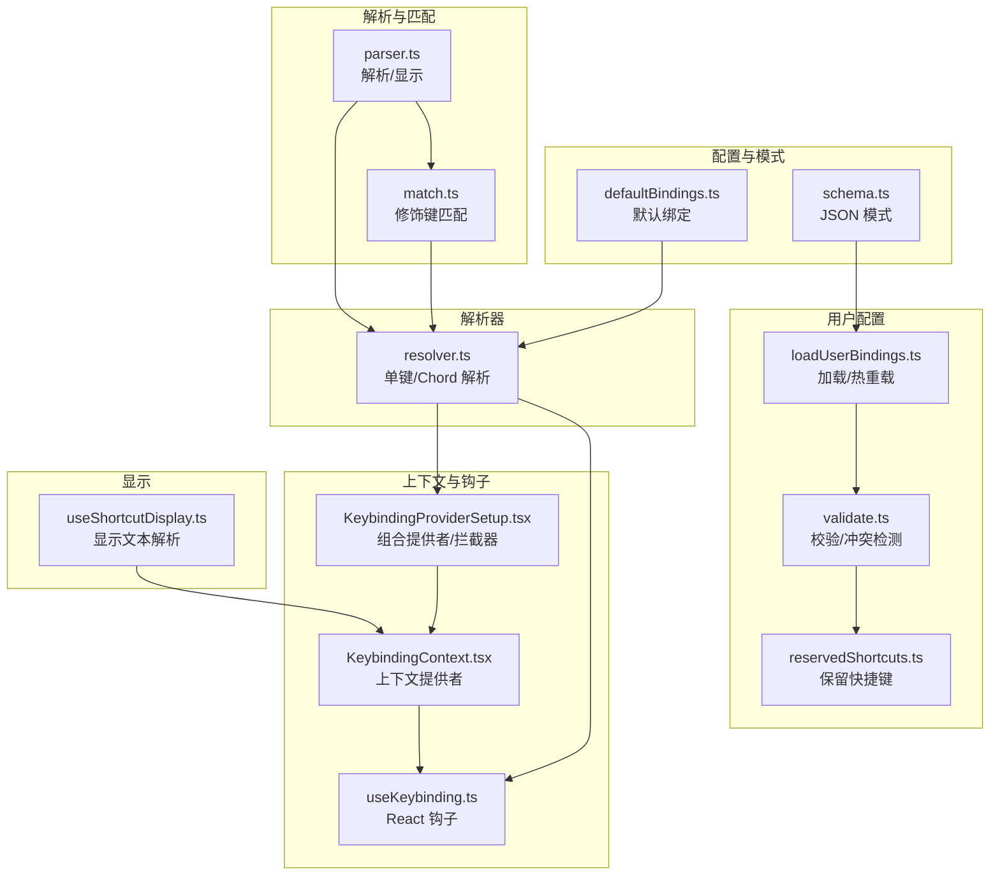
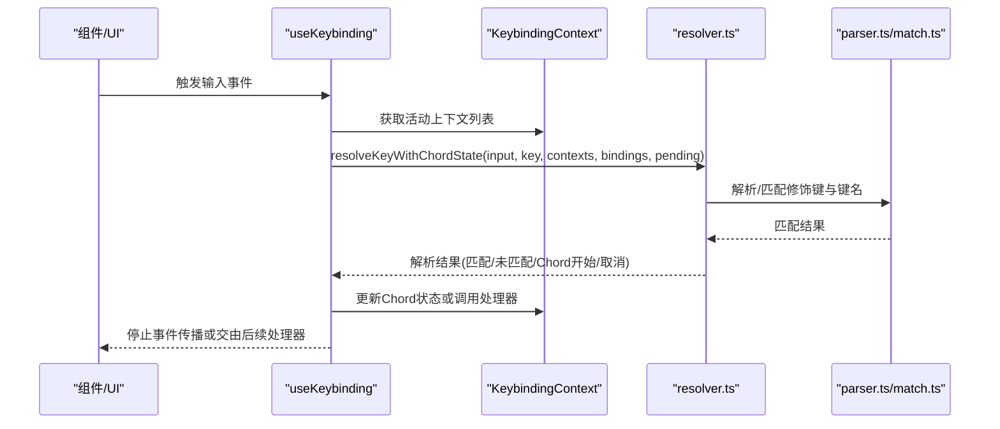
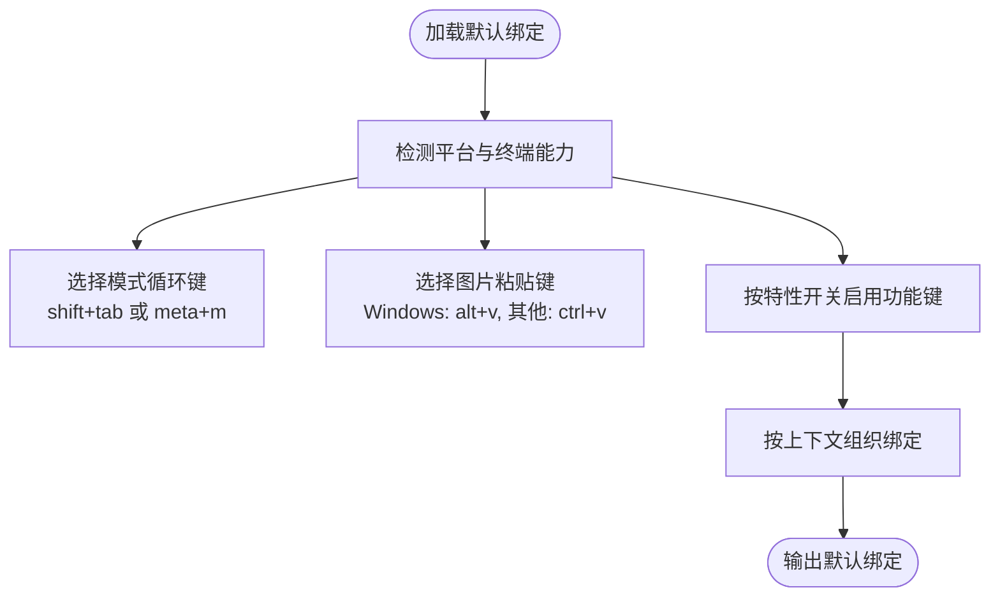
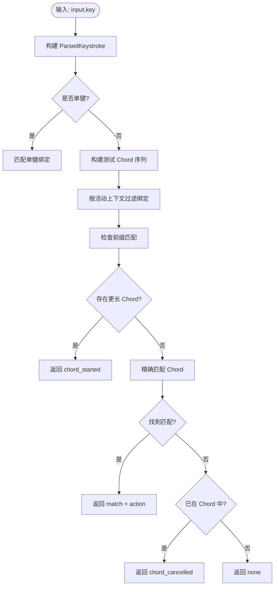
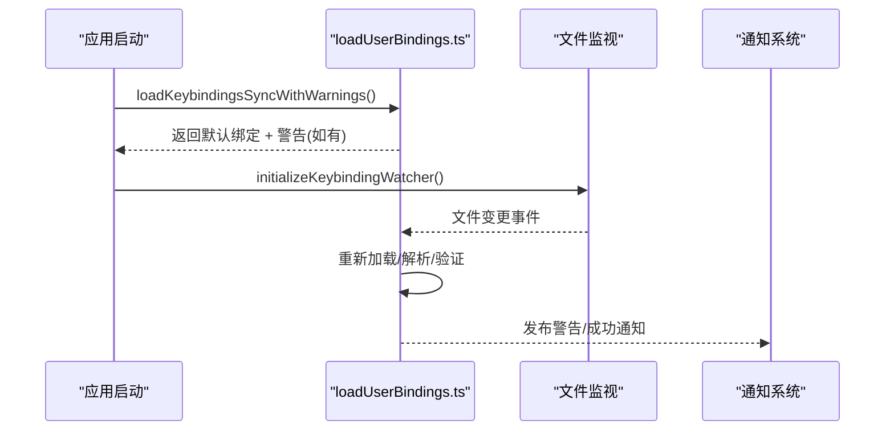
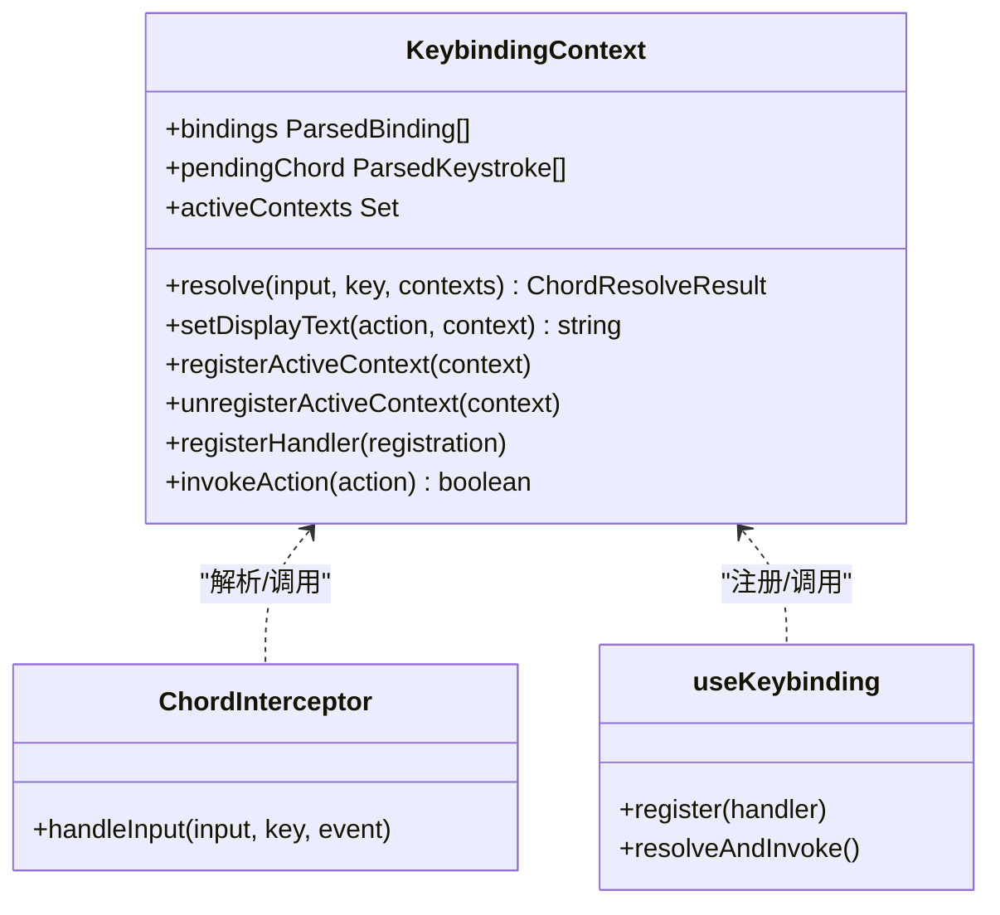
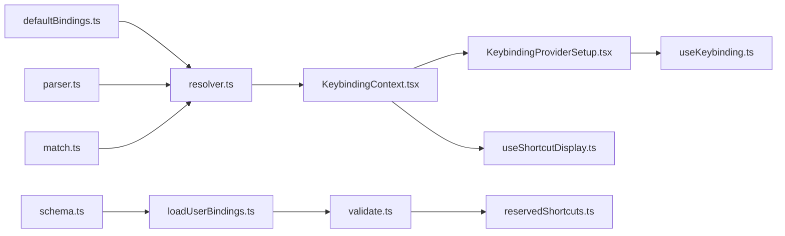

# 键盘绑定系统

<cite>
**本文档引用的文件**
- [defaultBindings.ts](file://src/keybindings/defaultBindings.ts)
- [resolver.ts](file://src/keybindings/resolver.ts)
- [match.ts](file://src/keybindings/match.ts)
- [parser.ts](file://src/keybindings/parser.ts)
- [schema.ts](file://src/keybindings/schema.ts)
- [loadUserBindings.ts](file://src/keybindings/loadUserBindings.ts)
- [validate.ts](file://src/keybindings/validate.ts)
- [reservedShortcuts.ts](file://src/keybindings/reservedShortcuts.ts)
- [useKeybinding.ts](file://src/keybindings/useKeybinding.ts)
- [KeybindingContext.tsx](file://src/keybindings/KeybindingContext.tsx)
- [KeybindingProviderSetup.tsx](file://src/keybindings/KeybindingProviderSetup.tsx)
- [useShortcutDisplay.ts](file://src/keybindings/useShortcutDisplay.ts)
</cite>

## 目录
1. [简介](#简介)
2. [项目结构](#项目结构)
3. [核心组件](#核心组件)
4. [架构总览](#架构总览)
5. [详细组件分析](#详细组件分析)
6. [依赖关系分析](#依赖关系分析)
7. [性能考量](#性能考量)
8. [故障排除指南](#故障排除指南)
9. [结论](#结论)
10. [附录](#附录)

## 简介
本文件系统性阐述 Claude Code 的键盘绑定（Keybindings）子系统：从设计架构到实现细节，覆盖默认绑定配置、用户自定义加载与热重载、绑定解析与上下文感知、冲突检测与保留快捷键策略、以及性能优化与用户体验考量。文档同时提供配置示例、故障排除方法与最佳实践，帮助用户体验设计师与高级开发者高效理解和扩展该系统。

## 项目结构
键盘绑定系统位于 `src/keybindings/` 目录下，采用模块化分层设计：
- 配置与模式：默认绑定、JSON 模式与校验
- 解析与匹配：按键字符串解析、修饰键归一化、精确匹配
- 解析器：单键与多键序列（Chord）解析、优先级与取消逻辑
- 上下文与钩子：React 上下文、注册活跃上下文、useKeybinding 钩子
- 用户配置：加载、热重载、验证与告警
- 显示与回退：快捷键显示文本解析、迁移期回退策略



**图表来源**
- [defaultBindings.ts:1-341](file://src/keybindings/defaultBindings.ts#L1-L341)
- [schema.ts:1-237](file://src/keybindings/schema.ts#L1-L237)
- [parser.ts:1-204](file://src/keybindings/parser.ts#L1-L204)
- [match.ts:1-121](file://src/keybindings/match.ts#L1-L121)
- [resolver.ts:1-245](file://src/keybindings/resolver.ts#L1-L245)
- [KeybindingContext.tsx:1-243](file://src/keybindings/KeybindingContext.tsx#L1-L243)
- [useKeybinding.ts:1-197](file://src/keybindings/useKeybinding.ts#L1-L197)
- [KeybindingProviderSetup.tsx:1-308](file://src/keybindings/KeybindingProviderSetup.tsx#L1-L308)
- [loadUserBindings.ts:1-473](file://src/keybindings/loadUserBindings.ts#L1-L473)
- [validate.ts:1-499](file://src/keybindings/validate.ts#L1-L499)
- [reservedShortcuts.ts:1-128](file://src/keybindings/reservedShortcuts.ts#L1-L128)
- [useShortcutDisplay.ts:1-60](file://src/keybindings/useShortcutDisplay.ts#L1-L60)

**章节来源**
- [defaultBindings.ts:1-341](file://src/keybindings/defaultBindings.ts#L1-L341)
- [schema.ts:1-237](file://src/keybindings/schema.ts#L1-L237)
- [parser.ts:1-204](file://src/keybindings/parser.ts#L1-L204)
- [match.ts:1-121](file://src/keybindings/match.ts#L1-L121)
- [resolver.ts:1-245](file://src/keybindings/resolver.ts#L1-L245)
- [KeybindingContext.tsx:1-243](file://src/keybindings/KeybindingContext.tsx#L1-L243)
- [useKeybinding.ts:1-197](file://src/keybindings/useKeybinding.ts#L1-L197)
- [KeybindingProviderSetup.tsx:1-308](file://src/keybindings/KeybindingProviderSetup.tsx#L1-L308)
- [loadUserBindings.ts:1-473](file://src/keybindings/loadUserBindings.ts#L1-L473)
- [validate.ts:1-499](file://src/keybindings/validate.ts#L1-L499)
- [reservedShortcuts.ts:1-128](file://src/keybindings/reservedShortcuts.ts#L1-L128)
- [useShortcutDisplay.ts:1-60](file://src/keybindings/useShortcutDisplay.ts#L1-L60)

## 核心组件
- 默认绑定与平台适配：根据平台与终端能力动态选择模式循环键、图片粘贴键等，确保在不同环境下的可用性。
- 绑定解析器：支持单键与多键序列（Chord），具备前缀匹配、超时取消、未命中处理等能力。
- 修饰键匹配：统一 alt/meta、区分 super/cmd，处理终端历史遗留行为（如 escape 的 meta 标记）。
- 用户配置加载与热重载：从用户目录读取 keybindings.json，合并默认与用户配置，支持文件变更自动重载。
- 冲突检测与保留快捷键：识别不可重新绑定的系统/终端快捷键，检测重复绑定与跨上下文冲突。
- React 集成：通过上下文提供解析能力，useKeybinding 钩子简化事件处理与传播控制。
- 显示文本解析：将内部表示转换为平台友好的显示文本，支持迁移期回退策略。

**章节来源**
- [defaultBindings.ts:1-341](file://src/keybindings/defaultBindings.ts#L1-L341)
- [resolver.ts:1-245](file://src/keybindings/resolver.ts#L1-L245)
- [match.ts:1-121](file://src/keybindings/match.ts#L1-L121)
- [parser.ts:1-204](file://src/keybindings/parser.ts#L1-L204)
- [loadUserBindings.ts:1-473](file://src/keybindings/loadUserBindings.ts#L1-L473)
- [validate.ts:1-499](file://src/keybindings/validate.ts#L1-L499)
- [reservedShortcuts.ts:1-128](file://src/keybindings/reservedShortcuts.ts#L1-L128)
- [useKeybinding.ts:1-197](file://src/keybindings/useKeybinding.ts#L1-L197)
- [KeybindingContext.tsx:1-243](file://src/keybindings/KeybindingContext.tsx#L1-L243)
- [useShortcutDisplay.ts:1-60](file://src/keybindings/useShortcutDisplay.ts#L1-L60)

## 架构总览
键盘绑定系统采用“配置 + 解析 + 上下文 + 钩子”的分层架构：
- 配置层：默认绑定 + 用户 JSON 配置（合并后生效）
- 解析层：按键字符串解析、修饰键归一化、匹配与 Chord 解析
- 上下文层：React 提供者管理活动上下文、处理器注册表、Chord 状态
- 钩子层：useKeybinding/useKeybindings 将绑定与组件逻辑解耦
- 显示层：显示文本解析与迁移回退



**图表来源**
- [useKeybinding.ts:1-197](file://src/keybindings/useKeybinding.ts#L1-L197)
- [KeybindingContext.tsx:1-243](file://src/keybindings/KeybindingContext.tsx#L1-L243)
- [resolver.ts:1-245](file://src/keybindings/resolver.ts#L1-L245)
- [parser.ts:1-204](file://src/keybindings/parser.ts#L1-L204)
- [match.ts:1-121](file://src/keybindings/match.ts#L1-L121)

## 详细组件分析

### 默认绑定与平台适配
- 动态键选择：根据平台与终端 VT 模式能力，选择模式循环键（shift+tab 或 meta+m）、图片粘贴键（Windows 使用 alt+v，其他平台 ctrl+v）。
- 特性开关：基于功能门控（feature flags）启用特定快捷键（如全局搜索、快速打开、终端面板切换等）。
- 上下文覆盖：为各 UI 上下文（Chat、Settings、Confirmation、Transcript 等）提供专用绑定。



**图表来源**
- [defaultBindings.ts:1-341](file://src/keybindings/defaultBindings.ts#L1-L341)

**章节来源**
- [defaultBindings.ts:1-341](file://src/keybindings/defaultBindings.ts#L1-L341)

### 绑定解析与匹配
- 单键匹配：仅处理长度为 1 的 Chord，使用修饰键归一化与键名映射进行精确匹配。
- Chord 解析：支持多步序列（如 "ctrl+k ctrl+s"），具备前缀匹配、等待更长 Chord、超时取消、未命中处理。
- 修饰键归一化：alt/meta 合并为逻辑 meta；super/cmd 区分；处理终端历史遗留（escape 的 meta 标记）。



**图表来源**
- [resolver.ts:1-245](file://src/keybindings/resolver.ts#L1-L245)
- [match.ts:1-121](file://src/keybindings/match.ts#L1-L121)
- [parser.ts:1-204](file://src/keybindings/parser.ts#L1-L204)

**章节来源**
- [resolver.ts:1-245](file://src/keybindings/resolver.ts#L1-L245)
- [match.ts:1-121](file://src/keybindings/match.ts#L1-L121)
- [parser.ts:1-204](file://src/keybindings/parser.ts#L1-L204)

### 用户配置加载与热重载
- 加载策略：同步加载用于初始渲染，异步监听文件变更以热重载。
- 合并与覆盖：默认绑定优先，用户绑定后置覆盖；最后一条生效。
- 验证与告警：结构校验、重复键检测、保留快捷键冲突检测；通过通知系统提示用户。
- 文件监控：基于 chokidar 监听 keybindings.json 变更，稳定阈值避免抖动。



**图表来源**
- [loadUserBindings.ts:1-473](file://src/keybindings/loadUserBindings.ts#L1-L473)
- [KeybindingProviderSetup.tsx:1-308](file://src/keybindings/KeybindingProviderSetup.tsx#L1-L308)

**章节来源**
- [loadUserBindings.ts:1-473](file://src/keybindings/loadUserBindings.ts#L1-L473)
- [KeybindingProviderSetup.tsx:1-308](file://src/keybindings/KeybindingProviderSetup.tsx#L1-L308)

### 冲突检测与保留快捷键
- 保留快捷键：系统/终端级别不可重新绑定（如 ctrl+c、ctrl+d、ctrl+m），以及可能被拦截的快捷键（如 ctrl+z、macOS cmd+*）。
- 重复检测：同一上下文中重复键会发出警告，仅最后一条生效。
- 跨上下文冲突：允许相同键在不同上下文中重复，但需注意优先级与覆盖规则。

**章节来源**
- [reservedShortcuts.ts:1-128](file://src/keybindings/reservedShortcuts.ts#L1-L128)
- [validate.ts:1-499](file://src/keybindings/validate.ts#L1-L499)

### React 集成与上下文
- 上下文提供者：KeybindingProvider 维护绑定列表、活动上下文集合、Chord 状态、处理器注册表，并提供解析与显示文本查询。
- Chord 拦截器：ChordInterceptor 在所有子组件之前注册 useInput，拦截 Chord 序列，阻止后续输入处理器接收中间键。
- useKeybinding/useKeybindings：组件侧注册处理器，解析匹配后停止事件传播或交由后续处理器。



**图表来源**
- [KeybindingContext.tsx:1-243](file://src/keybindings/KeybindingContext.tsx#L1-L243)
- [KeybindingProviderSetup.tsx:1-308](file://src/keybindings/KeybindingProviderSetup.tsx#L1-L308)
- [useKeybinding.ts:1-197](file://src/keybindings/useKeybinding.ts#L1-L197)

**章节来源**
- [KeybindingContext.tsx:1-243](file://src/keybindings/KeybindingContext.tsx#L1-L243)
- [KeybindingProviderSetup.tsx:1-308](file://src/keybindings/KeybindingProviderSetup.tsx#L1-L308)
- [useKeybinding.ts:1-197](file://src/keybindings/useKeybinding.ts#L1-L197)

### 显示文本解析与回退
- 显示文本：将内部键表示转换为人类可读格式，按平台显示 opt/alt、cmd/super。
- 迁移回退：在上下文不可用或找不到绑定时记录一次性的回退事件，保证 UI 显示稳定。

**章节来源**
- [parser.ts:1-204](file://src/keybindings/parser.ts#L1-L204)
- [useShortcutDisplay.ts:1-60](file://src/keybindings/useShortcutDisplay.ts#L1-L60)

## 依赖关系分析
- 配置依赖：defaultBindings.ts 依赖平台工具与特性门控；schema.ts 定义 JSON 结构与动作枚举。
- 解析依赖：resolver.ts 依赖 parser.ts 与 match.ts；match.ts 依赖 Ink 的 Key 类型。
- 上下文依赖：KeybindingContext.tsx 依赖 resolver.ts；KeybindingProviderSetup.tsx 依赖上下文与通知系统。
- 用户配置依赖：loadUserBindings.ts 依赖 schema.ts 与 validate.ts；validate.ts 依赖 reservedShortcuts.ts。
- 显示依赖：useShortcutDisplay.ts 依赖上下文与分析日志。



**图表来源**
- [defaultBindings.ts:1-341](file://src/keybindings/defaultBindings.ts#L1-L341)
- [resolver.ts:1-245](file://src/keybindings/resolver.ts#L1-L245)
- [parser.ts:1-204](file://src/keybindings/parser.ts#L1-L204)
- [match.ts:1-121](file://src/keybindings/match.ts#L1-L121)
- [schema.ts:1-237](file://src/keybindings/schema.ts#L1-L237)
- [loadUserBindings.ts:1-473](file://src/keybindings/loadUserBindings.ts#L1-L473)
- [validate.ts:1-499](file://src/keybindings/validate.ts#L1-L499)
- [reservedShortcuts.ts:1-128](file://src/keybindings/reservedShortcuts.ts#L1-L128)
- [KeybindingContext.tsx:1-243](file://src/keybindings/KeybindingContext.tsx#L1-L243)
- [KeybindingProviderSetup.tsx:1-308](file://src/keybindings/KeybindingProviderSetup.tsx#L1-L308)
- [useKeybinding.ts:1-197](file://src/keybindings/useKeybinding.ts#L1-L197)
- [useShortcutDisplay.ts:1-60](file://src/keybindings/useShortcutDisplay.ts#L1-L60)

**章节来源**
- [defaultBindings.ts:1-341](file://src/keybindings/defaultBindings.ts#L1-L341)
- [resolver.ts:1-245](file://src/keybindings/resolver.ts#L1-L245)
- [parser.ts:1-204](file://src/keybindings/parser.ts#L1-L204)
- [match.ts:1-121](file://src/keybindings/match.ts#L1-L121)
- [schema.ts:1-237](file://src/keybindings/schema.ts#L1-L237)
- [loadUserBindings.ts:1-473](file://src/keybindings/loadUserBindings.ts#L1-L473)
- [validate.ts:1-499](file://src/keybindings/validate.ts#L1-L499)
- [reservedShortcuts.ts:1-128](file://src/keybindings/reservedShortcuts.ts#L1-L128)
- [KeybindingContext.tsx:1-243](file://src/keybindings/KeybindingContext.tsx#L1-L243)
- [KeybindingProviderSetup.tsx:1-308](file://src/keybindings/KeybindingProviderSetup.tsx#L1-L308)
- [useKeybinding.ts:1-197](file://src/keybindings/useKeybinding.ts#L1-L197)
- [useShortcutDisplay.ts:1-60](file://src/keybindings/useShortcutDisplay.ts#L1-L60)

## 性能考量
- 解析性能
  - 单键匹配：线性扫描已按活动上下文过滤的绑定集，Set 查询 O(1)，整体 O(n)。
  - Chord 匹配：先按前缀筛选候选，再精确匹配，避免全量扫描。
- 内存与状态
  - 使用 ref 存储 Chord 状态，避免 React 渲染延迟；state 仅用于 UI 更新。
  - 处理器注册表使用 Map/Set 结构，按 action 分组，减少遍历成本。
- I/O 与热重载
  - 文件写入稳定阈值与轮询间隔降低频繁重载开销。
  - 初始同步加载保证首屏渲染不阻塞。
- 显示文本
  - 显示文本缓存于上下文，避免重复计算。

[本节为通用性能讨论，无需具体文件分析]

## 故障排除指南
- 常见问题
  - 快捷键无效：检查是否被系统/终端拦截（保留快捷键）、是否被用户显式 unbind、是否处于错误上下文。
  - Chord 无法完成：确认未触发超时（默认 1 秒）、是否被滚动/输入事件中断。
  - 自定义配置不生效：检查 keybindings.json 结构、是否被外部用户限制、是否存在重复键导致被忽略。
- 排查步骤
  - 使用 /doctor 查看验证警告与重复键提示。
  - 检查通知区域的 keybinding-config-warning 提示。
  - 临时禁用用户配置，确认默认绑定是否正常工作。
- 诊断工具
  - 验证函数会报告 parse_error、duplicate、reserved、invalid_context、invalid_action 等类型警告。
  - 保留快捷键检测会给出严重程度（error/warning）与原因说明。

**章节来源**
- [validate.ts:1-499](file://src/keybindings/validate.ts#L1-L499)
- [reservedShortcuts.ts:1-128](file://src/keybindings/reservedShortcuts.ts#L1-L128)
- [KeybindingProviderSetup.tsx:1-308](file://src/keybindings/KeybindingProviderSetup.tsx#L1-L308)

## 结论
该键盘绑定系统通过清晰的分层设计实现了高可扩展性与强健性：默认绑定与平台适配确保可用性，解析器兼顾单键与 Chord 场景，上下文与钩子解耦组件逻辑，用户配置支持热重载与严格校验，保留快捷键与冲突检测保障稳定性。配合显示文本解析与迁移回退策略，系统在复杂终端环境中仍能提供一致的用户体验。

[本节为总结性内容，无需具体文件分析]

## 附录

### 默认绑定配置与上下文
- 全局（Global）：中断、退出、重绘、待办切换、转录切换、Brief 切换、同伴预览、历史搜索、全局搜索、快速打开、终端面板切换等。
- 聊天（Chat）：取消、代理终止、模式循环、模型选择器、快思模式、思考切换、提交、历史导航、撤销、外部编辑器、暂存、图片粘贴、消息操作、语音激活等。
- 自动补全（Autocomplete）：接受、关闭、上一项、下一项。
- 设置（Settings）：确认/取消、列表导航、切换/确认、关闭、搜索、重试。
- 确认（Confirmation）：确认/取消、前后项、切换字段、切换、切换模式、切换解释、权限调试。
- 标签页（Tabs）：下一个、上一个、左右方向。
- 转录（Transcript）：显示全部、退出、q 退出。
- 历史搜索（HistorySearch）：下一个、接受、Tab 接受、取消、执行。
- 任务（Task）：后台运行（tmux 下需两次 ctrl+b）。
- 主题选择器（ThemePicker）：切换语法高亮。
- 滚动（Scroll）：翻页、行进、顶部/底部、复制。
- 帮助（Help）：关闭。
- 附件（Attachments）：下一/上一张、移除、退出。
- 页脚（Footer）：上下、左右、打开选中、清除选择。
- 消息选择器（MessageSelector）：上下、顶部/底部、选择。
- Diff 对话框（DiffDialog）：关闭、前后源、前后文件、查看详情。
- 模型选择器（ModelPicker）：降低/提高努力度。
- 选择（Select）：上下、j/k、前进/后退、接受、取消。
- 插件（Plugin）：切换、安装。

**章节来源**
- [defaultBindings.ts:1-341](file://src/keybindings/defaultBindings.ts#L1-L341)

### 自定义绑定创建方法
- 文件位置：~/.claude/keybindings.json
- 格式要求：顶层对象包含 bindings 数组，每个元素为 { context, bindings }。
- 上下文约束：context 必须为受支持的上下文之一；命令绑定必须位于 Chat 上下文。
- 语法规范：键字符串支持 ctrl/control、alt/opt/option/meta、shift、cmd/command/super/win、方向键与特殊键别名。
- 覆盖规则：用户绑定后置覆盖默认绑定，最后一条生效。
- 示例路径：参考以下文件中的键字符串与上下文组织方式。

**章节来源**
- [schema.ts:1-237](file://src/keybindings/schema.ts#L1-L237)
- [parser.ts:1-204](file://src/keybindings/parser.ts#L1-L204)
- [loadUserBindings.ts:1-473](file://src/keybindings/loadUserBindings.ts#L1-L473)

### 绑定解析流程（代码级）
```mermaid
sequenceDiagram
participant Comp as "组件"
participant Hook as "useKeybinding"
participant Ctx as "KeybindingContext"
participant Res as "resolver.ts"
participant Par as "parser.ts"
participant Mat as "match.ts"
Comp->>Hook : 输入事件
Hook->>Ctx : 获取上下文列表
Hook->>Res : resolveKeyWithChordState(...)
Res->>Par : 解析/显示
Res->>Mat : 修饰键匹配
Mat-->>Res : 匹配结果
Res-->>Hook : 解析结果
Hook->>Ctx : 注册/调用处理器
Hook-->>Comp : 控制事件传播
```

**图表来源**
- [useKeybinding.ts:1-197](file://src/keybindings/useKeybinding.ts#L1-L197)
- [KeybindingContext.tsx:1-243](file://src/keybindings/KeybindingContext.tsx#L1-L243)
- [resolver.ts:1-245](file://src/keybindings/resolver.ts#L1-L245)
- [parser.ts:1-204](file://src/keybindings/parser.ts#L1-L204)
- [match.ts:1-121](file://src/keybindings/match.ts#L1-L121)